# API Reference
Source: https://docs.pipecat.ai/client/android/api-reference


# SDK Introduction
Source: https://docs.pipecat.ai/client/android/introduction

Build Android applications with Pipecat's Kotlin client library

The Pipecat Android SDK provides a Kotlin implementation for building voice and multimodal AI applications on Android. It handles:

* Real-time audio and video streaming
* Bot communication and state management
* Media device handling
* Configuration management
* Event handling

## Installation

Add the dependency for your chosen transport to your `build.gradle` file. For example, to use the Daily transport:

```gradle
implementation "ai.pipecat:daily-transport:0.3.3"
```

## Example

Here's a simple example using Daily as the transport layer. Note that the `clientConfig` is optional and depends
on what is required by the bot backend.

```kotlin
val clientConfig = listOf(
    ServiceConfig(
        service = "llm",
        options = listOf(
            Option("model", "meta-llama/Meta-Llama-3.1-8B-Instruct-Turbo"),
            Option("messages", Value.Array(
                Value.Object(
                    "role" to Value.Str("system"),
                    "content" to Value.Str("You are a helpful assistant.")
                )
            ))
        )
    ),
    ServiceConfig(
        service = "tts",
        options = listOf(
            Option("voice", "79a125e8-cd45-4c13-8a67-188112f4dd22")
        )
    )
)

val callbacks = object : RTVIEventCallbacks() {
    override fun onBackendError(message: String) {
        Log.e(TAG, "Error from backend: $message")
    }
}

val options = RTVIClientOptions(
    services = listOf(ServiceRegistration("llm", "together"), ServiceRegistration("tts", "cartesia")),
    params = RTVIClientParams(baseUrl = "<your API url>", config = clientConfig)
)

val client = RTVIClient(DailyTransport.Factory(context), callbacks, options)
client.connect().await() // Using Coroutines

// Or using callbacks:
// client.start().withCallback { /* handle completion */ }
```

## Documentation

<CardGroup cols={2}>
  <Card title="API Reference" icon="book" href="https://docs-android.rtvi.ai/">
    Complete SDK API documentation
  </Card>

  <Card title="Daily Transport" icon="network-wired" href="./transports/daily">
    WebRTC implementation using Daily
  </Card>
</CardGroup>


# Daily WebRTC Transport
Source: https://docs.pipecat.ai/client/android/transports/daily

WebRTC implementation for Android using Daily

The Daily transport implementation enables real-time audio and video communication in your Pipecat Android applications using [Daily's](https://www.daily.co/) WebRTC infrastructure.

## Installation

Add the Daily transport dependency to your `build.gradle`:

```gradle
implementation "ai.pipecat:daily-transport:0.3.7"
```

## Usage

Create a client using the Daily transport:

```kotlin
val callbacks = object : RTVIEventCallbacks() {
    override fun onBackendError(message: String) {
        Log.e(TAG, "Error from backend: $message")
    }
}

val options = RTVIClientOptions(
    services = listOf(ServiceRegistration("llm", "together"), ServiceRegistration("tts", "cartesia")),
    params = RTVIClientParams(baseUrl = "<your API url>", config = clientConfig)
)

val client = RTVIClient(DailyTransport.Factory(context), callbacks, options)
client.connect().await()
```

## Configuration

Your server endpoint should return Daily-specific configuration:

```json
{
  "url": "https://your-domain.daily.co/room-name",
  "token": "your-daily-token"
}
```

## Resources

<CardGroup cols={2}>
  <Card horizontal title="Demo" icon="play" href="https://github.com/pipecat-ai/pipecat-examples/tree/main/simple-chatbot/client/android">
    Simple Chatbot Demo
  </Card>

  <Card horizontal title="Source" icon="github" href="https://github.com/pipecat-ai/pipecat-client-android-transports/">
    Client Transports
  </Card>
</CardGroup>

<Card title="Daily Transport Reference" icon="book-open" href="https://docs-android.rtvi.ai/">
  Complete API documentation for the Daily transport implementation
</Card>


# Gemini Live Websocket Transport
Source: https://docs.pipecat.ai/client/android/transports/gemini-websocket

Websocket implementation for Android using Gemini

The Gemini Live Websocket transport implementation enables real-time audio communication with the Gemini Multimodal Live service, using a direct websocket connection.

<Note>
  Transports of this type are designed primarily for development and testing
  purposes. For production applications, you will need to build a server
  component with a server-friendly transport, like the
  [DailyTransport](./daily), to securely handle API keys.
</Note>

## Installation

Add the transport dependency to your `build.gradle`:

```gradle
implementation "ai.pipecat:gemini-live-websocket-transport:0.3.7"
```

## Usage

Create a client:

```kotlin
val transport = GeminiLiveWebsocketTransport.Factory(context)

val options = RTVIClientOptions(
    params = RTVIClientParams(
        baseUrl = null,
        config = GeminiLiveWebsocketTransport.buildConfig(
            apiKey = "<your Gemini api key>",
            generationConfig = Value.Object(
                "speech_config" to Value.Object(
                    "voice_config" to Value.Object(
                        "prebuilt_voice_config" to Value.Object(
                            "voice_name" to Value.Str("Puck")
                        )
                    )
                )
            ),
            initialUserMessage = "How tall is the Eiffel Tower?"
        )
    )
)

val client = RTVIClient(transport, callbacks, options)

client.start().withCallback {
    // ...
}
```

## Resources

<CardGroup cols={2}>
  <Card horizontal title="Demo" icon="play" href="https://github.com/pipecat-ai/pipecat-client-android-gemini-live-websocket-demo">
    Simple Chatbot Demo
  </Card>

  <Card horizontal title="Source" icon="github" href="https://github.com/pipecat-ai/pipecat-client-android-transports/">
    Client Transports
  </Card>
</CardGroup>

<Card title="Pipecat Android Client Reference" icon="book-open" href="https://docs-android.rtvi.ai/">
  Complete API documentation for the Pipecat Android client.
</Card>


# OpenAI Realtime WebRTC Transport
Source: https://docs.pipecat.ai/client/android/transports/openai-webrtc

WebRTC implementation for Android using OpenAI

The OpenAI Realtime WebRTC transport implementation enables real-time audio communication with the OpenAI Realtime service, using a direct WebRTC connection.

## Installation

Add the transport dependency to your `build.gradle`:

```gradle
implementation "ai.pipecat:openai-realtime-webrtc-transport:0.3.7"
```

## Usage

Create a client:

```kotlin
val transport = OpenAIRealtimeWebRTCTransport.Factory(context)

val options = RTVIClientOptions(
    params = RTVIClientParams(
        baseUrl = null,
        config = OpenAIRealtimeWebRTCTransport.buildConfig(
            apiKey = apiKey,
            initialMessages = listOf(
                LLMContextMessage(role = "user", content = "How tall is the Eiffel Tower?")
            ),
            initialConfig = OpenAIRealtimeSessionConfig(
                voice = "ballad",
                turnDetection = Value.Object("type" to Value.Str("semantic_vad")),
                inputAudioNoiseReduction = Value.Object("type" to Value.Str("near_field")),
                inputAudioTranscription = Value.Object("model" to Value.Str("gpt-4o-transcribe"))
            )
        )
    )
)

val client = RTVIClient(transport, callbacks, options)

client.start().withCallback {
    // ...
}
```

## Resources

<CardGroup cols={2}>
  <Card horizontal title="Demo" icon="play" href="https://github.com/pipecat-ai/pipecat-client-android-openai-realtime-webrtc-demo">
    Simple Chatbot Demo
  </Card>

  <Card horizontal title="Source" icon="github" href="https://github.com/pipecat-ai/pipecat-client-android-transports/">
    Client Transports
  </Card>
</CardGroup>

<Card title="Pipecat Android Client Reference" icon="book-open" href="https://docs-android.rtvi.ai/">
  Complete API documentation for the Pipecat Android client.
</Card>


# Small WebRTC Transport
Source: https://docs.pipecat.ai/client/android/transports/small-webrtc

WebRTC implementation for Android

The Small WebRTC transport implementation enables real-time audio communication with the Small WebRTC Pipecat transport, using a direct WebRTC connection.

## Installation

Add the transport dependency to your `build.gradle`:

```gradle
implementation "ai.pipecat:small-webrtc-transport:0.3.7"
```

## Usage

Create a client:

```kotlin
val transport = SmallWebRTCTransport.Factory(context, baseUrl)

val options = RTVIClientOptions(
    params = RTVIClientParams(baseUrl = null),
    enableMic = true,
    enableCam = true
)

val client = RTVIClient(transport, callbacks, options)

client.start().withCallback {
    // ...
}
```

## Resources

<CardGroup cols={2}>
  <Card horizontal title="Demo" icon="play" href="https://github.com/pipecat-ai/pipecat-examples/tree/main/p2p-webrtc/video-transform/client/android">
    Demo App
  </Card>

  <Card horizontal title="Source" icon="github" href="https://github.com/pipecat-ai/pipecat-client-android-transports/">
    Client Transports
  </Card>
</CardGroup>

<Card title="Pipecat Android Client Reference" icon="book-open" href="https://docs-android.rtvi.ai/">
  Complete API documentation for the Pipecat Android client.
</Card>


# SDK Introduction
Source: https://docs.pipecat.ai/client/c++/introduction

Build native applications with Pipecat’s C++ client library

The Pipecat C++ SDK provides a native implementation for building voice and multimodal AI applications. It supports:

* Linux (`x86_64` and `aarch64`)
* macOS (`aarch64`)
* Windows (`x86_64`)

## Dependencies

### libcurl

The SDK uses [libcurl](https://curl.se/libcurl/) for HTTP requests.

<Tabs>
  <Tab title="Linux">
    ```bash
    sudo apt-get install libcurl4-openssl-dev
    ```
  </Tab>

  <Tab title="macOS">
    On macOS `libcurl` is already included so there is nothing to install.
  </Tab>

  <Tab title="Windows">
    On Windows we use [vcpkg](https://vcpkg.io/en/) to install dependencies. You
    need to set it up following one of the
    [tutorials](https://learn.microsoft.com/en-us/vcpkg/get_started/get-started).

    The `libcurl` dependency will be automatically downloaded when building.
  </Tab>
</Tabs>

## Installation

Build the SDK using CMake:

<Tabs>
  <Tab title="Linux/macOS">
    ```bash
    cmake . -G Ninja -Bbuild -DCMAKE_BUILD_TYPE=Release
    ninja -C build
    ```
  </Tab>

  <Tab title="Windows">
    ```bash
    # Initialize Visual Studio environment
    "C:\Program Files (x86)\Microsoft Visual Studio\2019\Professional\VC\Auxiliary\Build\vcvarsall.bat" amd64
    # Configure and build
    cmake . -Bbuild --preset vcpkg
    cmake --buildbuild --config Release
    ```
  </Tab>
</Tabs>

### Cross-compilation

For Linux aarch64:

```bash
cmake . -G Ninja -Bbuild -DCMAKE_TOOLCHAIN_FILE=aarch64-linux-toolchain.cmake -DCMAKE_BUILD_TYPE=Release
ninja -C build
```

## Documentation

<CardGroup cols={2}>
  <Card title="API Reference" icon="book" href="https://github.com/pipecat-ai/pipecat-client-cxx">
    Complete SDK API documentation
  </Card>

  <Card title="Daily Transport" icon="network-wired" href="./transport">
    WebRTC implementation using Daily
  </Card>
</CardGroup>


# Daily WebRTC Transport
Source: https://docs.pipecat.ai/client/c++/transport

WebRTC implementation for C++ using Daily

The Daily transport implementation enables real-time audio and video communication in your Pipecat C++ applications using [Daily's](https://www.daily.co/) WebRTC infrastructure.

## Dependencies

### Daily Core C++ SDK

Download the [Daily Core C++ SDK](https://github.com/daily-co/daily-core-sdk) from the [available releases](https://github.com/daily-co/daily-core-sdk/releases) for your platform and set:

```bash
export DAILY_CORE_PATH=/path/to/daily-core-sdk
```

### Pipecat C++ SDK

Build the base [Pipecat C++ SDK](https://github.com/pipecat-ai/pipecat-client-cxx-daily) first and set:

```bash
export PIPECAT_SDK_PATH=/path/to/pipecat-client-cxx
```

## Building

First, set a few environment variables:

```bash
PIPECAT_SDK_PATH=/path/to/pipecat-client-cxx
DAILY_CORE_PATH=/path/to/daily-core-sdk
```

Then, build the project:

<Tabs>
  <Tab title="Linux/macOS">
    ```bash
    cmake . -G Ninja -Bbuild -DCMAKE_BUILD_TYPE=Release
    ninja -C build
    ```
  </Tab>

  <Tab title="Windows">
    ```bash
    # Initialize Visual Studio environment
    "C:\Program Files (x86)\Microsoft Visual Studio\2019\Professional\VC\Auxiliary\Build\vcvarsall.bat" amd64

    # Configure and build
    cmake . -Bbuild --preset vcpkg
    cmake --build build --config Release
    ```
  </Tab>
</Tabs>

## Examples

<CardGroup cols={3}>
  <Card title="Basic Client" icon="code" href="https://github.com/pipecat-ai/pipecat-client-cxx-daily/blob/main/examples/c++">
    Simple C++ implementation example
  </Card>

  {" "}

  <Card title="Audio Client" icon="waveform" href="https://github.com/pipecat-ai/pipecat-client-cxx-daily/blob/main/examples/c++-portaudio">
    C++ client with PortAudio support
  </Card>

  <Card title="Node.js Server" icon="server" href="https://github.com/pipecat-ai/pipecat-client-cxx-daily/blob/main/examples/server">
    Example Node.js proxy implementation
  </Card>
</CardGroup>


# Client SDKs
Source: https://docs.pipecat.ai/client/introduction

Client libraries for building real-time AI applications with Pipecat

<Warning>
  The Client SDKs are currently in transition to a new, simpler API design. The
  js and react libraries have already been deployed with these changes. Their
  corresponding documentation along with this top-level documentation has been
  updated to reflect the latest changes. For transitioning to the new API,
  please refer to the [migration guide](/client/migration-guide). Note that
  React Native, iOS, and Android SDKs are still in the process of being updated
  and their documentation will be updated once the new versions are released. If
  you have any questions or need assistance, please reach out to us on
  [Discord](https://discord.gg/pipecat).
</Warning>

Pipecat provides client SDKs for multiple platforms, all implementing the RTVI (Real-Time Voice and Video Inference) standard. These SDKs make it easy to build real-time AI applications that can handle voice, video, and text interactions.

<CardGroup cols={3}>
  <Card title="Javascript" icon="JS" color="#f7e014" href="/client/js/introduction">
    Pipecat JS SDK
  </Card>

  <Card title="React" icon="react" color="#56c4db" href="/client/react/introduction">
    Pipecat React SDK
  </Card>

  <Card title="React Native" icon="react" color="#56c4db" href="/client/react-native/introduction">
    Pipecat React Native SDK
  </Card>

  <Card title="Swift" icon="swift" color="#F05138" vertical="true" href="/client/ios/introduction">
    Pipecat iOS SDK
  </Card>

  <Card title="Kotlin" icon="android" color="#78C257" href="/client/android/introduction">
    Pipecat Android SDK
  </Card>

  <Card title="C++" icon="C" color="#679cd3" href="/client/c++/introduction">
    Pipecat C++ SDK
  </Card>
</CardGroup>

## Core Functionality

All Pipecat client SDKs provide:

<CardGroup cols={2}>
  <Card title="Media Management" icon="video">
    Handle device inputs and media streams for audio and video
  </Card>

  <Card title="Bot Integration" icon="robot">
    Configure and communicate with your Pipecat bot
  </Card>

  <Card title="Session Management" icon="arrows-rotate">
    Manage connection state and error handling
  </Card>
</CardGroup>

## Core Types

### PipecatClient

The main class for interacting with Pipecat bots. It is the primary type you will interact with.

### Transport

The `PipecatClient` wraps a Transport, which defines and provides the underlying connection mechanism (e.g., WebSocket, WebRTC). Your Pipecat pipeline will contain a corresponding transport.

### RTVIMessage

Represents a message sent to or received from a Pipecat bot.

## Simple Usage Examples

<Tabs>
  <Tab title="Connecting to a Bot">
    Establish ongoing connections via WebSocket or WebRTC for:

    * Live voice conversations
    * Real-time video processing
    * Continuous interactions

    <CodeGroup>
      ```javascript javascript
      // Example: Establishing a real-time connection
      import { RTVIEvent, RTVIMessage, PipecatClient } from "@pipecat-ai/client-js";
      import { DailyTransport } from "@pipecat-ai/daily-transport";

      const pcClient = new PipecatClient({
        transport: new DailyTransport(),
        enableMic: true,
        enableCam: false,
        enableScreenShare: false,
        callbacks: {
          onBotConnected: () => {
            console.log("[CALLBACK] Bot connected");
          },
          onBotDisconnected: () => {
            console.log("[CALLBACK] Bot disconnected");
          },
          onBotReady: () => {
            console.log("[CALLBACK] Bot ready to chat!");
          },
        },
      });

      try {
        // Below, we use a REST endpoint to fetch connection credentials for our
        // Daily Transport. Alternatively, you could provide those credentials
        // directly to `connect()`.
        await pcClient.startBotAndConnect({
          endpoint: "https://your-connect-end-point-here/connect",
        });
      } catch (e) {
        console.error(e.message);
      }

      // Events (alternative approach to constructor-provided callbacks)
      pcClient.on(RTVIEvent.Connected, () => {
        console.log("[EVENT] User connected");
      });
      pcClient.on(RTVIEvent.Disconnected, () => {
        console.log("[EVENT] User disconnected");
      });
      ```

      ```jsx react
      // Example: Using PipecatClient in a React component
      import { PipecatClient } from "@pipecat-ai/client-js";
      import {
        PipecatClientProvider,
        PipecatClientAudio,
        usePipecatClient,
        useRTVIClientEvent,
      } from "@pipecat-ai/client-react";
      import { DailyTransport } from "@pipecat-ai/daily-transport";

      // Create the client instance
      const client = new PipecatClient({
        transport: new DailyTransport(),
        enableMic: true,
      });

      // Root component wraps the app with the provider
      function App() {
        return (
          <PipecatClientProvider client={client}>
            <VoiceBot />
            <PipecatClientAudio />
          </PipecatClientProvider>
        );
      }

      // Component using the client
      function VoiceBot() {
        const client = usePipecatClient();

        const handleClick = async () => {
          await client.startBotAndConnect({
            endpoint: `${process.env.PIPECAT_API_URL || "/api"}/connect`
          });
        };

        return (
          <button onClick={handleClick}>Start Conversation</button>;
        );
      }

      function EventListener() {
        useRTVIClientEvent(
          RTVIEvent.Connected,
          useCallback(() => {
            console.log("[EVENT] User connected");
          }, [])
        );
      }
      ```
    </CodeGroup>
  </Tab>

  <Tab title="Custom Messaging">
    Send custom messages and handle responses from your bot. This is useful for:

    * Running server-side functionality
    * Triggering specific bot actions
    * Querying the server
    * Responding to server requests

    <CodeGroup>
      ```javascript javascript
      import { PipecatClient } from "@pipecat-ai/client-js";

      const pcClient = new PipecatClient({
        transport: new DailyTransport(),
        callbacks: {
          onBotConnected: () => {
            pcClient
              .sendClientRequest("get-language")
              .then((response) => {
                console.log("[CALLBACK] Bot using language:", response);
                if (response !== preferredLanguage) {
                  pcClient.sendClientMessage("set-language", {
                    language: preferredLanguage,
                  });
                }
              })
              .catch((error) => {
                console.error("[CALLBACK] Error getting language:", error);
              });
          },
          onServerMessage: (message) => {
            console.log("[CALLBACK] Received message from server:", message);
          },
        },
      });
      // Here we have obtained the connection details separately and pass them
      // directly to connect().
      // Alternatively, you can use a connection endpoint to fetch these details
      // using `startBotAndConnect()`.
      await pcClient.connect({
        url: "https://your-daily-room-url",
        token: "your-daily-token",
      });
      ```

      ```jsx react
      // Example: Messaging in a React application
      import { useCallback } from "react";
      import { RTVIEvent, TransportState } from "@pipecat-ai/client-js";
      import { usePipecatClient, useRTVIClientEvent } from "@pipecat-ai/client-react";

      function EventListener() {
        const pcClient = usePipecatClient();
        useRTVIClientEvent(
          RTVIEvent.BotConnected,
          useCallback(() => {
            pcClient
              .sendClientRequest("get-language")
              .then((response) => {
                console.log("[CALLBACK] Bot using language:", response);
                if (response !== preferredLanguage) {
                  pcClient.sendClientMessage("set-language", {
                    language: preferredLanguage,
                  });
                }
              })
              .catch((error) => {
                console.error("[CALLBACK] Error getting language:", error);
              });
          }, [])
        );
        useRTVIClientEvent(
          RTVIEvent.ServerMessage,
          useCallback((data) => {
            console.log("[CALLBACK] Received message from server:", data);
          }, [])
        );
      }
      ```
    </CodeGroup>
  </Tab>
</Tabs>

## About RTVI

Pipecat's client SDKs implement the RTVI (Real-Time Voice and Video Inference) standard, an open specification for real-time AI inference. This means:

* Your code can work with any RTVI-compatible inference service
* You get battle-tested tooling for real-time multimedia handling
* You can easily set up development and testing environments

## Next Steps

Get started by trying out examples:

<CardGroup cols={2}>
  <Card title="Simple Chatbot Example" icon="robot" href="https://github.com/pipecat-ai/pipecat-examples/tree/main/simple-chatbot">
    Complete client-server example with both bot backend (Python) and frontend
    implementation (JS, React, React Native, iOS, and Android).
  </Card>

  <Card title="More Examples" icon="code" href="https://github.com/pipecat-ai/pipecat-examples">
    Explore our full collection of example applications and implementations
    across different platforms and use cases.
  </Card>
</CardGroup>


# API Reference
Source: https://docs.pipecat.ai/client/ios/api-reference


# SDK Introduction
Source: https://docs.pipecat.ai/client/ios/introduction

Build iOS applications with Pipecat’s Swift client library

The Pipecat iOS SDK provides a Swift implementation for building voice and multimodal AI applications on iOS. It handles:

* Real-time audio streaming
* Bot communication and state management
* Media device handling
* Configuration management
* Event handling

## Installation

Add the SDK to your project using Swift Package Manager:

```swift
// Core SDK
.package(url: "https://github.com/pipecat-ai/pipecat-client-ios.git", from: "0.3.0"),

// Daily transport implementation
.package(url: "https://github.com/pipecat-ai/pipecat-client-ios-daily.git", from: "0.3.0"),
```

Then add the dependencies to your target:

```swift
.target(name: "YourApp", dependencies: [
    .product(name: "PipecatClientIOS", package: "pipecat-client-ios")
    .product(name: "PipecatClientIOSDaily", package: "pipecat-client-ios-daily")
]),
```

## Example

Here's a simple example using Daily as the transport layer:

```swift
import PipecatClientIOS
import PipecatClientIOSDaily

let clientConfig = [
    ServiceConfig(
        service: "llm",
        options: [
            Option(name: "model", value: .string("meta-llama/Meta-Llama-3.1-8B-Instruct-Turbo")),
            Option(name: "messages", value: .array([
                .object([
                    "role" : .string("system"),
                    "content": .string("You are a helpful assistant.")
                ])
            ]))
        ]
    ),
    ServiceConfig(
        service: "tts",
        options: [
            Option(name: "voice", value: .string("79a125e8-cd45-4c13-8a67-188112f4dd22"))
        ]
    )
]

let options = RTVIClientOptions.init(
    enableMic: true,
    params: RTVIClientParams(
        baseUrl: $PIPECAT_API_URL,
        config: clientConfig
    )
)

let client = RTVIClient.init(
    transport: DailyTransport.init(options: configOptions),
    options: configOptions
)
try await client.start()
```

## Documentation

<CardGroup cols={2}>
  <Card title="API Reference" icon="book" href="https://docs-ios.pipecat.ai/">
    Complete SDK API documentation
  </Card>

  <Card horizontal title="Source" icon="github" href="https://github.com/pipecat-ai/pipecat-client-ios/">
    Pipecat Client iOS
  </Card>
</CardGroup>

<CardGroup cols={2}>
  <Card horizontal title="Demo" icon="play" href="https://github.com/pipecat-ai/pipecat-examples/tree/main/simple-chatbot/client/ios">
    Simple Chatbot Demo
  </Card>

  <Card title="Daily Transport" icon="network-wired" href="./transports/daily">
    WebRTC implementation using Daily
  </Card>
</CardGroup>


# Daily WebRTC Transport
Source: https://docs.pipecat.ai/client/ios/transports/daily

WebRTC implementation for iOS using Daily

The Daily transport implementation enables real-time audio and video communication in your Pipecat iOS applications using [Daily's](https://www.daily.co/) WebRTC infrastructure.

## Installation

Add the Daily transport package to your project:

```swift
.package(url: "https://github.com/pipecat-ai/pipecat-client-ios-daily.git", from: "0.3.0")

// Add to your target dependencies
.target(name: "YourApp", dependencies: [
    .product(name: "PipecatClientIOSDaily", package: "pipecat-client-ios-daily")
])
```

## Usage

Create a client using the Daily transport:

```swift
import PipecatClientIOS
import PipecatClientIOSDaily

let configOptions = RTVIClientOptions.init(
    enableMic: true,
    params: RTVIClientParams(
        baseUrl: $PIPECAT_API_URL
    )
)

let client = RTVIClient.init(
    transport: DailyTransport.init(options: configOptions),
    options: configOptions
)

try await client.start()
```

## Configuration

Your server endpoint should return Daily-specific configuration:

```swift
// Example server response
{
    "url": "https://your-domain.daily.co/room-name",
    "token": "your-daily-token"
}
```

## API Reference

<CardGroup cols={2}>
  <Card horizontal title="Demo" icon="play" href="https://github.com/pipecat-ai/pipecat-examples/tree/main/simple-chatbot/client/ios">
    Simple Chatbot Demo
  </Card>

  <Card horizontal title="Source" icon="github" href="https://github.com/pipecat-ai/pipecat-client-ios-daily/">
    Daily Transport
  </Card>
</CardGroup>

<Card title="Daily Transport Reference" icon="book-open" href="https://docs-ios.pipecat.ai/PipecatClientIOSDaily/documentation/pipecatclientiosdaily">
  Complete API documentation for the Daily transport implementation
</Card>


# Gemini Live Websocket Transport
Source: https://docs.pipecat.ai/client/ios/transports/gemini-websocket

Websocket implementation for iOS using Gemini

The Gemini Live Websocket transport implementation enables real-time audio communication with the Gemini Multimodal Live service, using a direct websocket connection.

<Note>
  Transports of this type are designed primarily for development and testing
  purposes. For production applications, you will need to build a server
  component with a server-friendly transport, like the
  [DailyTransport](./daily), to securely handle API keys.
</Note>

## Installation

Add the Gemini transport package to your project:

```swift
.package(url: "https://github.com/pipecat-ai/pipecat-client-ios-gemini-live-websocket.git", from: "0.3.1"),

// Add to your target dependencies
.target(name: "YourApp", dependencies: [
    .product(name: "PipecatClientIOSGeminiLiveWebSocket", package: "pipecat-client-ios-gemini-live-websocket")
],
```

## Usage

Create a client:

```swift
let options: RTVIClientOptions = .init(
    params: .init(config: [
        .init(
            service: "llm",
            options: [
                .init(name: "api_key", value: .string("<your Gemini api key>")),
                .init(name: "initial_messages", value: .array([
                    .object([
                        "role": .string("user"), // "user" | "system"
                        "content": .string("I need your help planning my next vacation.")
                    ])
                ])),
                .init(name: "generation_config", value: .object([
                    "speech_config": .object([
                        "voice_config": .object([
                            "prebuilt_voice_config": .object([
                                "voice_name": .string("Puck") // "Puck" | "Charon" | "Kore" | "Fenrir" | "Aoede"
                            ])
                        ])
                    ])
                ]))
            ]
        )
    ])
)

let client = GeminiLiveWebSocketVoiceClient(options: options)

try await client.start()
```

## API Reference

<CardGroup cols={2}>
  <Card horizontal title="Demo" icon="play" href="https://github.com/pipecat-ai/pipecat-client-ios-gemini-live-websocket-demo">
    Simple Chatbot Gemini Demo
  </Card>

  <Card horizontal title="Source" icon="github" href="https://github.com/pipecat-ai/pipecat-client-ios-gemini-live-websocket">
    iOS Gemini Live WebSocket
  </Card>
</CardGroup>

<Card title="Pipecat iOS Client Reference" icon="book-open" href="https://docs-ios.pipecat.ai/PipecatClientIOSGeminiLiveWebSocket/documentation/pipecatclientiosgeminilivewebsocket">
  Complete API documentation for the Gemini transport implementation
</Card>


# OpenAIRealTimeWebRTCTransport
Source: https://docs.pipecat.ai/client/ios/transports/openai-webrtc


## Overview

The OpenAI Realtime WebRTC transport implementation enables real-time audio communication directly with the [OpenAI Realtime API using WebRTC](https://platform.openai.com/docs/guides/realtime-webrtc) voice-to-voice service.
It handles media device management, audio/video streams, and state management for the connection.

## Installation

Add the OpenAI transport package to your project:

```swift
.package(url: "https://github.com/pipecat-ai/pipecat-client-ios-openai-realtime.git", from: "0.0.1"),

// Add to your target dependencies
.target(name: "YourApp", dependencies: [
    .product(name: "PipecatClientIOSOpenAIRealtimeWebrtc", package: "pipecat-client-ios-openai-realtime")
],
```

## Usage

Create a client:

```swift
let rtviClientOptions = RTVIClientOptions.init(
    enableMic: currentSettings.enableMic,
    enableCam: false,
    params: .init(config: [
        .init(
            service: "llm",
            options: [
                .init(name: "api_key", value: .string(openaiAPIKey)),
                .init(name: "initial_messages", value: .array([
                    .object([
                        "role": .string("user"), // "user" | "system"
                        "content": .string("Start by introducing yourself.")
                    ])
                ])),
                .init(name: "session_config", value: .object([
                    "instructions": .string("You are Chatbot, a friendly and helpful assistant who provides useful information, including weather updates."),
                    "voice": .string("echo"),
                    "input_audio_noise_reduction": .object([
                        "type": .string("near_field")
                    ]),
                    "turn_detection": .object([
                        "type": .string("semantic_vad")
                    ])
                ])),
            ]
        )
    ])
)
self.rtviClientIOS = RTVIClient.init(
    transport: OpenAIRealtimeTransport.init(options: rtviClientOptions),
    options: rtviClientOptions
)
try await rtviClientIOS.start()
```

<Note type="warning">
  Currently, invalid session configurations will result in the OpenAI connection
  being failed.
</Note>

## API Reference

<CardGroup cols={2}>
  <Card horizontal title="Demo" icon="play" href="https://github.com/pipecat-ai/pipecat-client-ios-openai-realtime-webrtc-demo">
    Simple Chatbot OpenAI Demo
  </Card>

  <Card horizontal title="Source" icon="github" href="https://github.com/pipecat-ai/pipecat-client-ios-openai-realtime-webrtc">
    iOS OpenAI Realtime WebRTC
  </Card>
</CardGroup>

<Card title="Pipecat iOS Client Reference" icon="book-open" href="https://docs-ios.pipecat.ai/PipecatClientIOSOpenAIRealtimeWebrtc/documentation/pipecatclientiosopenairealtimewebrtc">
  Complete API documentation for the OpenAI transport implementation
</Card>


# Callbacks and events
Source: https://docs.pipecat.ai/client/js/api-reference/callbacks


The Pipecat JavaScript client listens for messages and events from the bot via the transport layer. This allows you to respond to changes in state, errors, and other events. The client implements the RTVI standard for these communications.

## Event Handling Options

You can handle events in two ways:

### 1. Callbacks

Define handlers in the client constructor:

```typescript
const pcClient = new PipecatClient({
  callbacks: {
    onBotReady: () => console.log("Bot ready via callback"),
    // ... other callbacks
  },
});
```

### 2. Event Listeners

Add handlers using the event emitter pattern:

```typescript
pcClient.on(RTVIEvent.BotReady, () => console.log("Bot ready via event"));
```

<Note>
  Events and callbacks provide the same functionality. Choose the pattern that best fits your application's architecture.
</Note>

## Callbacks

### State and connectivity

<ParamField path="onConnected">
  Local user successfully established a connection to the transport.
</ParamField>

<ParamField path="onDisconnected">
  Local user disconnected from the transport, either intentionally by calling `pcClient.disconnect()` or due to an error.
</ParamField>

<ParamField path="onTransportStateChanged" type="state:TransportState">
  Provides a `TransportState` string representing the connectivity state of the local client. See [transports](./transports) for state explanation.
</ParamField>

<ParamField path="onBotReady" type="botReadyData:BotReadyData">
  The bot has been instantiated, its pipeline is configured, and it is receiving user media and interactions. This method is passed a `BotReadyData` object, which contains the RTVI `version` number. Since the bot is remote and may be using a different version of RTVI than the client, you can use the passed `version` string to check for compatibility.
</ParamField>

<ParamField path="onBotConnected">
  Bot connected to the transport and is configuring. Note: bot connectivity does not infer that its pipeline is yet ready to run. Please use `onBotReady` instead.
</ParamField>

<ParamField path="onBotDisconnected" type="participant: Participant">
  Bot disconnected from the transport. This may occur due to session expiry, a pipeline error or for any reason the server deems the session over.
</ParamField>

<ParamField path="onParticipantJoined" type="participant: Participant">
  A non-bot participant joined the session.
</ParamField>

<ParamField path="onParticipantLeft" type="participant: Participant">
  A non-bot participant left the session. Note: excluded local participant.
</ParamField>

### Messages and errors

<ParamField path="onServerMessage" type="data:any">
  Receives custom messages sent from the server to the client. This provides a generic channel for server-to-client communication. The data structure is flexible and defined by the server implementation.
</ParamField>

<ParamField path="onMessageError" type="message:RTVIMessage">
  Response error when an action fails or an unknown message type is sent from the client.
</ParamField>

<ParamField path="onError" type="message:RTVIMessage">
  Error signalled by the bot. This could be due to a malformed config update or an unknown action dispatch or the inability to complete a client request. The message parameter is of type `error` and matches [the RTVI standard](/client/rtvi-standard#error-%F0%9F%A4%96). Its `data` field includes a `message` string that describes the error and a `fatal` boolean indicating if the error is unrecoverable and resulted in a bot disconnection. If `fatal` is true, the client will automatically disconnect.
</ParamField>

### Media and devices

<ParamField path="onAvailableMicsUpdated" type="mics:MediaDeviceInfo[]">
  Lists available local media microphone devices. Triggered when a new device becomes available, a device is removed, or in response to `pcClient.initDevices()`.
</ParamField>

<ParamField path="onAvailableCamsUpdated" type="cams:MediaDeviceInfo[]">
  Lists available local media camera devices. Triggered when a new device becomes available, a device is removed, or in response to `pcClient.initDevices()`.
</ParamField>

<ParamField path="onAvailableSpeakersUpdated" type="speakers:MediaDeviceInfo[]">
  Lists available local speaker devices. Triggered when a new device becomes available, a device is removed, or in response to `pcClient.initDevices()`.
</ParamField>

<ParamField path="onMicUpdated" type="mic:MediaDeviceInfo">
  User selected a new microphone as their selected/active device.
</ParamField>

<ParamField path="onCamUpdated" type="cam:MediaDeviceInfo">
  User selected a new camera as their selected/active device.
</ParamField>

<ParamField path="onSpeakerUpdated" type="speaker:MediaDeviceInfo">
  User selected a new speaker as their selected/active device.
</ParamField>

<ParamField path="onDeviceError" type="error:DeviceError">
  Error related to media devices, such as camera or microphone issues. This could be due to permissions, device unavailability, or other related problems. See the [DeviceError](errors#deviceerror) section for more details about the return type.
</ParamField>

<ParamField path="onTrackStarted" type="track: MediaStreamTrack, participant:Participant">
  Media track from a local or remote participant/bot was started and playable. Can be either an audio or video track.
</ParamField>

<ParamField path="onTrackStopped" type="track: MediaStreamTrack, participant:Participant">
  Media track from a local or remote participant/bot was stopped and no longer playable.
</ParamField>

<ParamField path="onScreenTrackStarted" type="track: MediaStreamTrack, participant:Participant">
  Media track from a local or remote participant's screenshare was started and playable. Can be either an audio or video track.
</ParamField>

<ParamField path="onScreenTrackStopped" type="track: MediaStreamTrack, participant:Participant">
  Media track from a local or remote participant's screenshare was stopped and no longer playable.
</ParamField>

### Audio and Voice Activity

<ParamField path="onLocalAudioLevel" type="level:number">
  Local audio gain level (0 to 1).
</ParamField>

<ParamField path="onRemoteAudioLevel" type="level: number, participant: Participant">
  Remote audio gain level (0 to 1). Note: if more than one participant is connected to the transport, the `participant` property details the associated peer/bot.
</ParamField>

<ParamField path="onBotStartedSpeaking">
  The bot started speaking/sending speech audio.
</ParamField>

<ParamField path="onBotStoppedSpeaking">
  The bot stopped speaking/sending speech audio.
</ParamField>

<ParamField path="onUserStartedSpeaking">
  The local user started speaking. This method is more reliable than using audio
  gain and is the result of the bot's VAD (voice activity detection) model. This
  provides a more accurate result in noisy environments.
</ParamField>

<ParamField path="onUserStoppedSpeaking">
  The local user stopped speaking, indicated by the VAD model.
</ParamField>

### Transcription

<ParamField path="onUserTranscript" type="TranscriptData">
  Transcribed local user input (both partial and final).

  Callback receives a `TranscriptData` object:

  <Expandable title="TranscriptData">
    <ParamField path="text" type="string">
      The transcribed text.
    </ParamField>

    <ParamField path="final" type="boolean">
      Indicates if the text is final (true) or partial (false).
    </ParamField>

    <ParamField path="timestamp" type="string">
      The timestamp of the transcription.
    </ParamField>

    <ParamField path="user_id" type="string">
      The ID of the user the transcription is for.
    </ParamField>
  </Expandable>
</ParamField>

<ParamField path="onBotTranscript" type="text:BotLLMTextData">
  Finalized bot output text generated by the LLM. Sentence aggregated.
</ParamField>

### Service-specific Events

<ParamField path="onBotLlmSearchResponse" type="BotLLMSearchResponseData">
  Bot LLM search response text generated by the LLM service. This is typically used for search or retrieval tasks.

  <Warning>
    Search capabilities are currently only supported by Google Gemini. To take advantage of this event, your pipeline must include a [`GoogleLLMService`](/server/services/llm/gemini) and your pipeline task should include the [`GoogleRTVIObserver`](/server/frameworks/rtvi/google-rtvi-observer) in lieu of the typical `RTVIObserver`.
  </Warning>

  <Expandable title="BotLLMSearchResponseData">
    <ParamField path="search_result" type="string">
      The search result text.
    </ParamField>

    <ParamField path="rendered_content" type="string">
      The rendered content of the search result.
    </ParamField>

    <ParamField path="origins" type="LLMSearchOrigin[]">
      The origins of the search result.

      <Expandable title="LLMSearchOrigin">
        <ParamField path="site_uri" type="string">
          The URI of the site where the search result was found.
        </ParamField>

        <ParamField path="site_title" type="string">
          The title of the site where the search result was found.
        </ParamField>

        <ParamField path="results" type="LLMSearchResult[]">
          The individual search results.

          <Expandable title="LLMSearchResult">
            <ParamField path="text" type="string">
              The text of the search result.
            </ParamField>

            <ParamField path="confidence" type="number[]">
              The confidence scores for the search result.
            </ParamField>
          </Expandable>
        </ParamField>
      </Expandable>
    </ParamField>
  </Expandable>
</ParamField>

<ParamField path="onBotLlmText" type="BotLLMTextData">
  Streamed LLM token response text generated by the LLM service.

  <Expandable title="BotLLMTextData">
    <ParamField path="text" type="string">
      The text of the LLM response.
    </ParamField>
  </Expandable>
</ParamField>

<ParamField path="onBotLlmStarted">LLM service inference started.</ParamField>

<ParamField path="onBotLlmStopped">LLM service inference concluded.</ParamField>

<ParamField path="onBotTtsText" type="BotTTSTextData">
  If your TTS service supports streamed responses over sockets, the text parameter contains the words from TTS service as they are spoken. If you are using a HTTP based TTS service, the text parameter will contain the full text of the TTS response.

  <Expandable title="BotTTSTextData" defaultOpen="true">
    <ParamField path="text" type="string">
      The text of the LLM response.
    </ParamField>
  </Expandable>
</ParamField>

<ParamField path="onBotTtsStarted">TTS service started inference.</ParamField>

<ParamField path="onBotTtsStopped">TTS service inference concluded.</ParamField>

### Other

<ParamField path="onMetrics" default="data:PipecatMetricsData">
  Pipeline data provided by Pipecat. Please see [Pipecat
  documentation](https://docs.pipecat.ai) for more information.
</ParamField>

## Events

Each callback described above has a corresponding event that can be listened for using the `.on()` method. This allows you to handle the same functionality using either callbacks or event listeners, depending on your preferred architecture.

Here's the complete reference mapping events to their corresponding callbacks:

### State and connectivity Events

| Event Name              | Callback Name             | Data Type        |
| ----------------------- | ------------------------- | ---------------- |
| `Connected`             | `onConnected`             | -                |
| `Disconnected`          | `onDisconnected`          | -                |
| `TransportStateChanged` | `onTransportStateChanged` | `TransportState` |
| `BotReady`              | `onBotReady`              | `BotReadyData`   |
| `BotConnected`          | `onBotConnected`          | -                |
| `BotDisconnected`       | `onBotDisconnected`       | `Participant`    |
| `ParticipantConnected`  | `onParticipantJoined`     | `Participant`    |
| `ParticipantLeft`       | `onParticipantLeft`       | `Participant`    |

### Message and Error Events

| Event Name      | Callback Name     | Data Type     |
| --------------- | ----------------- | ------------- |
| `ServerMessage` | `onServerMessage` | `any`         |
| `MessageError`  | `onMessageError`  | `RTVIMessage` |
| `Error`         | `onError`         | `RTVIMessage` |

### Media Events

| Event Name             | Callback Name            | Data Type                       |
| ---------------------- | ------------------------ | ------------------------------- |
| `TrackStarted`         | `onTrackStarted`         | `MediaStreamTrack, Participant` |
| `TrackStopped`         | `onTrackStopped`         | `MediaStreamTrack, Participant` |
| `AvailableMicsUpdated` | `onAvailableMicsUpdated` | `MediaDeviceInfo[]`             |
| `AvailableCamsUpdated` | `onAvailableCamsUpdated` | `MediaDeviceInfo[]`             |
| `MicUpdated`           | `onMicUpdated`           | `MediaDeviceInfo`               |
| `CamUpdated`           | `onCamUpdated`           | `MediaDeviceInfo`               |
| `SpeakerUpdated`       | `onSpeakerUpdated`       | `MediaDeviceInfo`               |
| `DeviceError`          | `onDeviceError`          | `DeviceError`                   |

### Audio Activity Events

| Event Name            | Callback Name           | Data Type             |
| --------------------- | ----------------------- | --------------------- |
| `LocalAudioLevel`     | `onLocalAudioLevel`     | `number`              |
| `RemoteAudioLevel`    | `onRemoteAudioLevel`    | `number, Participant` |
| `BotStartedSpeaking`  | `onBotStartedSpeaking`  | -                     |
| `BotStoppedSpeaking`  | `onBotStoppedSpeaking`  | -                     |
| `UserStartedSpeaking` | `onUserStartedSpeaking` | -                     |
| `UserStoppedSpeaking` | `onUserStoppedSpeaking` | -                     |

### Text and Transcription Events

| Event Name       | Callback Name      | Data Type        |
| ---------------- | ------------------ | ---------------- |
| `UserTranscript` | `onUserTranscript` | `TranscriptData` |
| `BotTranscript`  | `onBotTranscript`  | `BotLLMTextData` |
| `BotLlmText`     | `onBotLlmText`     | `BotLLMTextData` |
| `BotTtsText`     | `onBotTtsText`     | `BotTTSTextData` |

### Service State Events

| Event Name             | Callback Name            | Data Type                  |
| ---------------------- | ------------------------ | -------------------------- |
| `BotLlmSearchResponse` | `onBotLlmSearchResponse` | `BotLLMSearchResponseData` |
| `BotLlmStarted`        | `onBotLlmStarted`        | -                          |
| `BotLlmStopped`        | `onBotLlmStopped`        | -                          |
| `BotTtsStarted`        | `onBotTtsStarted`        | -                          |
| `BotTtsStopped`        | `onBotTtsStopped`        | -                          |

### Other Events

| Event Name | Callback Name | Data Type            |
| ---------- | ------------- | -------------------- |
| `Metrics`  | `onMetrics`   | `PipecatMetricsData` |

## Usage Example

```typescript
import { PipecatClient, RTVIEvent } from "@pipecat-ai/client-js";

// Using callbacks
const pcClient = new PipecatClient({
  callbacks: {
    onBotReady: () => console.log("Bot ready via callback"),
    onUserTranscript: (data) => console.log("Transcript:", data.text),
  },
});

// Alternate approach: Using event listeners
pcClient.on(RTVIEvent.BotReady, () => {
  console.log("Bot ready via event");
});
```


# PipecatClient Constructor
Source: https://docs.pipecat.ai/client/js/api-reference/client-constructor

Setting up the PipecatClient

```javascript
import { PipecatClient } from "@pipecat-ai/client-js";
```

`PipecatClient` is the primary component for building the client-side portion of a client-bot interaction. It is designed to work with various transport layers, such as WebRTC, WebSockets, or HTTP, allowing you to pick and choose the communication layer that best suits your application while maintaining a consistent API.

<Note>
  When initializing the `PipecatClient`, you must provide a transport instance to the constructor for your chosen protocol or provider. See [Transport](/client/js/transports) for more information. For the purpose of this guide, we'll demonstrate using the [Daily WebRTC transport](/client/js/transports/daily).
</Note>

## Example

```typescript
import { RTVIEvent, RTVIMessage, PipecatClient } from "@pipecat-ai/client-js";
import { DailyTransport } from "@pipecat-ai/daily-transport";

const PipecatClient = new PipecatClient({
  transport: new DailyTransport(),
  enableMic: true,
  enableCam: false,
  enableScreenShare: false,
  timeout: 15 * 1000,
  callbacks: {
    onConnected: () => {
      console.log("[CALLBACK] User connected");
    },
    onDisconnected: () => {
      console.log("[CALLBACK] User disconnected");
    },
    onTransportStateChanged: (state: string) => {
      console.log("[CALLBACK] State change:", state);
    },
    onBotConnected: () => {
      console.log("[CALLBACK] Bot connected");
    },
    onBotDisconnected: () => {
      console.log("[CALLBACK] Bot disconnected");
    },
    onBotReady: () => {
      console.log("[CALLBACK] Bot ready to chat!");
    },
  },
});
```

***

## API reference

### transport

<ParamField path="transport" type="Class<Transport>" default="undefined" required="true">
  An instance of the `Transport` type you will use to connect to your bot service (`PipecatClient.connect()`). Transports implement the underlying device management, connectivity, media transmission, and state logic that manage the lifecycle of your session.

  <Note>
    As a best practice, we recommend you construct the transport inline in the client constructor, as opposed to holding a reference to it. Access to the transport is typically unnecessary. For advanced use cases that do require access to the transport, we recommend doing so via the `PipecatClient.transport` property, which provides some additional safeguards.
  </Note>

  ```typescript
  import { PipecatClient } from "@pipecat-ai/client-js";
  import { DailyTransport } from "@pipecat-ai/daily-transport";

  const pcClient = new PipecatClient({
    transport: new DailyTransport(),
  });
  ```
</ParamField>

### callbacks

<ParamField path="callbacks" type="RTVIEventCallbacks" required="false">
  Map of callback functions. See [callbacks](./callbacks).
</ParamField>

### Media Initialization

<ParamField path="enableMic" type="boolean" default="true" required="false">
  Enable user's local microphone device.
</ParamField>

<ParamField path="enableCam" type="boolean" default="false" required="false">
  Enable user's local webcam device. Note: Not all transports support video. Setting this value in that case will have no effect.
</ParamField>

<ParamField path="enableScreenShare" type="boolean" default="false" required="false">
  Enable user's local screen share. Note: Not all transports support screen sharing. Setting this value in that case will have no effect.
</ParamField>


# Client Methods
Source: https://docs.pipecat.ai/client/js/api-reference/client-methods


The Pipecat JavaScript client provides a comprehensive set of methods for managing bot interactions and media handling. These core methods are documented below.

## Session connectivity

### startBot()

`async startBot(startBotParams: APIEndpoint): Promise<TransportConnectionParams | unknown>`

This method hits your server endpoint to start the bot and optionally obtain the connection parameters needed for `connect()` to connect the `Transport`. It returns a Promise that resolves with the response from the server.

<ParamField path="startBotParams" type="APIEndpoint" required="true">
  The `APIEndpoint` object should have the following shape:

  <Expandable title="APIEndpoint" defaultOpen="true">
    <ParamField path="endpoint" type="string" required="true">
      The URL of the endpoint to connect to. This should be a valid REST endpoint.
    </ParamField>

    <ParamField path="headers" type="Headers" required="false">
      Optional headers to include in the request to the endpoint. This can be used to pass authentication tokens or other necessary headers.
    </ParamField>

    <ParamField path="requestData" type="object" required="false">
      Optional request data to include in the request to the endpoint. This can be used to pass additional data to your server-side endpoint. Oftentimes, this is used to pass the initial prompt or other configuration data to initialize the bot.
    </ParamField>

    <ParamField path="timeout" type="number" required="false">
      Optional timeout in milliseconds for the request to the endpoint.
    </ParamField>
  </Expandable>
</ParamField>

During the `startBot()` process, the transport state will transition through the states: "authenticating" and "authenticated".

```javascript
try {
  await pcClient.startBot({
    endpoint: "/api/start", // Your server endpoint to start the bot
    requestData: {
      initial_prompt: "You are a pirate captain",
      llm_provider: "openai"
    }
  });
} catch (error) {
  console.error("Error starting the bot:", error);
}
```

### connect()

`async connect(connectParams): Promise<BotReadyData>`

This method initiates the connection process, optionally passing parameters that your transport class requires to establish a connection or an endpoint to your server for obtaining those parameters.

<ParamField path="connectParams" type="TransportConnectionParams" required="false">
  An object containing the `TransportConnectionParams` your Transport expects.

  Check your transport class documentation for the expected shape of `TransportConnectionParams`. For example, the DailyTransport expects a `url` and `token`.

  <Warning>
    In 1.2.0 we deprecated support for passing a `ConnectionEndpoint` object directly to `connect()`. Instead, you should use the `startBot()` or `startBotAndConnect()` methods to fetch connection parameters from your server endpoint and then pass those parameters directly to `connect()`.
  </Warning>
</ParamField>

This method can be try / catched to handle errors at startup:

```typescript
try {
  await pcClient.connect({
    webrtcUrl: "http://my-server/api/offer"
  });
} catch (error) {
  console.error("Error connecting to the bot:", error);
}
```

During the connection process, the transport state will transition through the following states: "connecting", "connected", "ready".

<Note>
  Calling `connect()` asynchronously will resolve when the bot and client signal that they are ready. See [messages and events](./messages). If you want to call `connect()` without `await`, you can use the `onBotReady` callback or `BotReady` event to know when you can interact with the bot.
</Note>

<Warning>
  Attempting to call `connect()` when the transport is already in a 'connected' or 'ready' state will throw an error. You should [disconnect](#disconnect) from a session first before attempting to connect again.
</Warning>

### startBotAndConnect()

`async startBotAndConnect(startBotParams: APIEndpoint): Promise<BotReadyData>`

This method combines the functionality of `startBot()` and `connect()`. It first starts the bot by hitting your server endpoint and then connects the transport passing the response from the endpoint to the transport as connection parameters.

```javascript
try {
  await pcClient.startBotAndConnect({
    endpoint: "/api/start", // Your server endpoint to start the bot
    requestData: {
      initial_prompt: "You are a pirate captain",
      llm_provider: "openai"
    }
  });
} catch (error) {
  console.error("Error starting up:", error);
}
```

It's equivalent to: `pcClient.startBot(...).then((resp) => pcClient.connect(resp))`.

### disconnect()

`async disconnect(): Promise<void>`

Disconnects from the active session. The transport state will transition to "disconnecting" and then "disconnected".

It is common practice for bots to exit and cleanup when the client disconnects.

```typescript
await pcClient.disconnect();
```

### disconnectBot()

`disconnectBot(): void`

Triggers the bot to disconnect from the session, leaving the client connected.

```typescript
await pcClient.disconnectBot();
```

## Messages

Custom messaging between the client and the bot. This is useful for sending data to the bot, triggering specific actions, reacting to server events, or querying the server.

For more, see: [messages and events](./messages).

### sendClientMessage()

`sendClientMessage(msgType: string, data?: unknown): void`

Sends a custom message to the bot and does not expect a response. This is useful for sending data to the bot or triggering specific actions.

<ParamField path="msgType" type="string" required="true">
  A string identifying the message.
</ParamField>

<ParamField path="data" type="unknown" required="false">
  Optional data to send with the message. This can be any JSON-serializable object.
</ParamField>

### sendClientRequest()

`async sendClientRequest(msgType: string, data: unknown, timeout?: number): Promise<unknown>`

Sends a custom request to the bot and expects a response. This is useful for querying the server or triggering specific actions that require a response. The method returns a Promise that resolves with the data from response.

<ParamField path="msgType" type="string" required="true">
  A string identifying the message.
</ParamField>

<ParamField path="data" type="unknown" required="false">
  Optional data to send with the message. This can be any JSON-serializable object.
</ParamField>

<ParamField path="timeout" type="number" required="false" default="10000">
  Optional timeout in milliseconds for the request. If the request does not receive a response within this time, it will reject with an RTVIMessage of type `'error-response'`.
</ParamField>

## Devices

### initDevices()

`async initDevices(): Promise<void>`

Initializes the media device selection machinery, based on `enableCam`/`enableMic` selections and defaults (i.e. turns on the local cam/mic). This method can be called before `connect()` to test and switch between camera and microphone sources.

```typescript
await pcClient.initDevices();
```

### getAllMics()

`async getAllMics(): Promise<MediaDeviceInfo[]>`

Returns a list of available microphones in the form of [`MediaDeviceInfo[]`](https://developer.mozilla.org/en-US/docs/Web/API/MediaDeviceInfo).

```typescript
mic_device_list = pcClient.getAllMics();
```

### getAllCams()

`async getAllCams(): Promise<MediaDeviceInfo[]>`

Returns a list of available cameras in the form of [`MediaDeviceInfo[]`](https://developer.mozilla.org/en-US/docs/Web/API/MediaDeviceInfo).

```typescript
cam_device_list = pcClient.getAllCams();
```

### getAllSpeakers()

`async getAllSpeakers(): Promise<MediaDeviceInfo[]>`

Returns a list of available speakers in the form of [`MediaDeviceInfo[]`](https://developer.mozilla.org/en-US/docs/Web/API/MediaDeviceInfo).

```typescript
speaker_device_list = pcClient.getAllSpeakers();
```

### selectedMic

`selectedMic: MediaDeviceInfo | {}`

The currently selected microphone, represented as a `MediaDeviceInfo` object. If no microphone is selected, it returns an empty object.

```typescript
current_mic = pcClient.selectedMic;
```

### selectedCam

`selectedCam: MediaDeviceInfo | {}`

The currently selected camera, represented as a `MediaDeviceInfo` object. If no camera is selected, it returns an empty object.

```typescript
current_cam = pcClient.selectedCam;
```

### selectedSpeaker

`selectedSpeaker: MediaDeviceInfo | {}`

The currently selected speaker, represented as a `MediaDeviceInfo` object. If no speaker is selected, it returns an empty object.

```typescript
current_speaker = pcClient.selectedSpeaker;
```

### updateMic()

`updateMic(micId: string): void`

Switches to the microphone identified by the provided `micId`, which should match a `deviceId` in the list returned from [`getAllMics()`](#getAllMics).

<ParamField path="micId" type="string">
  deviceId
</ParamField>

```typescript
pcClient.updateMic(deviceId);
```

### updateCam()

`updateCam(camId: string): void`

Switches to the camera identified by the provided `camId`, which should match a `deviceId` in the list returned from [`getAllCams()`](#getAllCams).

<ParamField path="camId" type="string">
  deviceId
</ParamField>

```typescript
pcClient.updateCam(deviceId);
```

### updateSpeaker()

`updateSpeaker(speakerId: string): void`

Switches to the speaker identified by the provided `speakerId`, which should match a `deviceId` in the list returned from [`getAllSpeakers()`](#getAllSpeakers).

<ParamField path="speakerId" type="string">
  deviceId
</ParamField>

```typescript
pcClient.updateSpeaker(deviceId);
```

### enableMic(enable: boolean)

`enableMic(enable: boolean): void`

Turn on or off (unmute or mute) the client mic input.

<ParamField path="enable" type="boolean" required="true">
  A boolean indicating whether to enable (`true`) or disable (`false`) the microphone.
</ParamField>

```typescript
pcClient.enableMic(true);
```

### enableCam(enable: boolean)

`enableCam(enable: boolean): void`

Turn on or off the client cam input.

<ParamField path="enable" type="boolean" required="true">
  A boolean indicating whether to enable (`true`) or disable (`false`) the camera.
</ParamField>

```typescript
pcClient.enableCam(true);
```

### enableScreenShare(enable: boolean)

`enableScreenShare(enable: boolean): void`

Start a screen share from the client's device.

<ParamField path="enable" type="boolean" required="true">
  A boolean indicating whether to enable (`true`) or disable (`false`) screen sharing.
</ParamField>

```typescript
pcClient.enableScreenShare(true);
```

### isMicEnabled

`isMicEnabled: boolean`

An accessor to determine if the client's microphone is enabled.

```typescript
mic_enabled = pcClient.isMicEnabled;
```

### isCamEnabled

`isCamEnabled: boolean`

An accessor to determine if the client's camera is enabled.

```typescript
cam_enabled = pcClient.isCamEnabled;
```

### isSharingScreen

An accessor to determine if the client is sharing their screen.

```typescript
screen_sharing = pcClient.isSharingScreen;
```

## Tracks (audio and video)

### tracks()

`tracks(): Tracks`

Returns a `Tracks` object with available `MediaStreamTrack` objects for both the client and the bot.

```typescript
live_tracks_list = pcClient.tracks()
```

**Tracks Type**

```typescript
{
  local: {
    audio?: MediaStreamTrack;
    video?: MediaStreamTrack;
  },
  bot?: {
    audio?: MediaStreamTrack;
    video?: MediaStreamTrack;
  }
}
```

## Advanced LLM Interactions

### appendToContext()

`async appendToContext(context: LLMContextMessage): boolean`

A method to append data to the bot's context. This is useful for providing additional information or context to the bot during the conversation.

<ParamField path="context" type="LLMContextMessage" required="true">
  The context to append. This should be an object with the following shape:

  <Expandable title="LLMContextMessage" defaultOpen="true">
    <ParamField path="role" type="string" required="true">
      The role to append the context to. Currently only "user" or "assistant" are supported.
    </ParamField>

    <ParamField path="content" type="unknown" required="true">
      The content to append to the context. This can be any JSON-serializable object.
    </ParamField>

    <ParamField path="run_immediately" type="boolean" required="false" default="false">
      Whether to immediately run the bot with the updated context. If `false`, the context will be updated but the bot will not be run until the next message or action that triggers the bot to run (like the user speaking).
    </ParamField>
  </Expandable>
</ParamField>

### registerFunctionCallHandler()

`registerFunctionCallHandler(functionName: string, callback: FunctionCallCallback): void`

Registers a function call handler that will be called when the bot requests a function call. This is useful for when the server-side function handler needs information from the client to execute the function call or when the client needs to perform some action based on the running of function call.

<ParamField path="functionName" type="string" required="true">
  The name of the function to handle. This should match the function name in the bot's context.
</ParamField>

<ParamField path="callback" type="FunctionCallCallback" required="true">
  `type FunctionCallCallback = (fn: FunctionCallParams) => Promise<LLMFunctionCallResult | void>`

  The callback function to call when the bot sends a function call request. This function should accept the following parameters:

  <Expandable title="FunctionCallParams" defaultOpen="true">
    <ParamField path="functionName" type="string" required="true">
      The name of the function being called. It should always match the name you registered the handler under.
    </ParamField>

    <ParamField path="arguments" type="Record<string, unknown>" required="true">
      The arguments passed to the function call. This is a key-value object where the keys are the argument names and the values are the argument values.
    </ParamField>
  </Expandable>

  The callback should return a Promise that resolves with the result of the function call or void if no result is needed. If returning a result, it should be a `string` or `Record<string, unknown>`.
</ParamField>

## Other

### transport

`transport: Transport`

A safe accessor for the transport instance used by the client. This is useful for accessing transport-specific methods or properties that are not exposed directly on the client.

```typescript
const transport = pcClient.transport as DailyTransport;
transport.getSessionInfo();
```

### setLogLevel()

`setLogLevel(level: LogLevel): void`

Sets the log level for the client. This is useful for debugging and controlling the verbosity of logs. The log levels are defined in the `LogLevel` enum:

```typescript
export enum LogLevel {
  NONE = 0,
  ERROR = 1,
  WARN = 2,
  INFO = 3,
  DEBUG = 4,
}
```

By default, the log level is set to `LogLevel.DEBUG`.

```typescript
pcClient.setLogLevel(LogLevel.INFO);
```


# Errors
Source: https://docs.pipecat.ai/client/js/api-reference/errors


## RTVIError Type

Base `PipecatClient` error type, extends [`Error`](https://developer.mozilla.org/en-US/docs/Web/JavaScript/Reference/Global_Objects/Error) and primarily introduces the `status` field. Most methods will try to throw an error of this type when something goes wrong. This is different from the RTVI error event and its corresponding [`onError` callback](./callbacks#param-on-error), which are used for communicating errors that are sent by the bot.

<ParamField path="status" type="number" required="false">
  A unique identifier (or HTTP code if applicable) for the error.
</ParamField>

<ParamField path="message" type="string" required="false">
  A human-readable message describing the error.
</ParamField>

## Pre-defined RTVIErrors

### ConnectionTimeoutError

Emitted when the bot does not enter a ready state within the specified timeout period during the `connect()` method call.

### StartBotError

Emitted from `startBot()` or `startBotAndConnect()` when the endpoint responds with an error or the `fetch` itself fails. This may be due to the endpoint being unavailable, or the server failing to parse the provided data.

<ParamField path="error" type="string" required="true">
  All `StartBotError` instances will have an `error` field set to `invalid-request-error`.
</ParamField>

<ParamField path="status" type="number" required="false">
  HTTP status code returned by the endpoint, if applicable.
</ParamField>

<ParamField path="message" type="string" required="false">
  Verbose error message returned by the endpoint, if provided. To take advantage of this, the endpoint should return an error response with a JSON object with an `info` field containing the error message.
</ParamField>

### TransportStartError

Emitted when the Transport is not able to connect. You may need to check the connection parameters provided or returned from you endpoint.

### BotNotReadyError

Emitted when the client attempts to perform an action or method that requires the bot to be in a ready state, but the bot is not ready. You must call `connect()` first and wait for the bot to be ready before performing such actions.

### DeviceError

Emitted when there is an issue with acquiring or using a media device, such as a camera or microphone. This could be due to permissions issues, device unavailability, or other related problems.

<ParamField path="devices" type="array<'cam' | 'mic' | 'speaker'>" required="true">
  List of media devices, `'cam'`, `'mic'`, and/or `'speaker'`, that are unavailable or could not be accessed.
</ParamField>

<ParamField path="type" type="string" required="true">
  The `type` field will indicate what type of device error occurred. Options include:

  * `"in-use"`: A device is currently in use by another application and cannot be accessed. *windows only*
  * `"permissions"`: The user has not granted permission to access the media device.
  * `"undefined-mediadevices"`: `getUserMedia()` is not an available API on the current platform or browser.
  * `"not-found"`: The specified media device could not be found.
  * `"constraints"`: The media device could not be configured with the specified constraints.
  * `"unknown"`: An unknown error occurred while accessing the media device.
</ParamField>

<ParamField path="details" type="object" required="false">
  Additional details about the device error, if available.
</ParamField>

### UnsupportedFeatureError

Not all Transports are created equal, and some may not support certain features. This error is thrown when a feature is requested that the current Transport does not support.

<ParamField path="feature" type="string" required="true">
  This custom field will contain the name of the unsupported feature.
</ParamField>


# Custom Messaging
Source: https://docs.pipecat.ai/client/js/api-reference/messages


The Pipecat JavaScript client can send and receive arbitrary messages to/from the server running the bot. This page outlines and demonstrates both client and server code for passing and responding to custom messages as well as providing arbitrary data at connection time.

## Connection-Time Configuration

Oftentimes clients need to provide configuration data to the server when starting the bot. This can include things like preferred language, user preferences, initial messages, or any other data that the server needs to know about the client. This must occur before the bot is started and therefore is not part of the RTVI standard, but rather a custom implementation. That said, the `PipecatClient` makes it easy to send this data as part of the `startBot()` and `startBotAndConnect()` methods, by passing an API endpoint object with the `requestData` property. Your server endpoint can then handle this data as needed. In the example below, we demonstrate sending an initial prompt and preferred language to the server when connecting.

<CodeGroup>
  ```javascript client
  try {
      pcClient.startBotAndConnect({
          endpoint: '/api/start', // Your server endpoint to start the bot
          requestData: {
              initial_prompt: "You are a pirate captain",
              preferred_language: 'en-US'
          }
      });
  } catch (error) {
      console.error("Error starting the bot:", error);
  }
  ```

  ```python FastAPI endpoint

  def validate_request_data(body: Dict[str, Any]) -> Tuple[str, str]:
      """Validate and extract prompt and language from request data."""
      if not isinstance(body, dict):
          raise ValueError("Request body must be a dictionary")

      prompt = body.get("initial_prompt", "You are a pirate captain")
      lang = body.get("preferred_language", "en-US")

      if not isinstance(prompt, str) or not isinstance(lang, str):
          raise ValueError("Both initial_prompt and preferred_language must be strings")

      return prompt, lang

  @app.post("/api/start")
  async def start(request: Request) -> Dict[Any, Any]:
      """Startup endpoint that creates a room, starts the bot, and returns
         connection credentials.

      This endpoint is called by clients to kick off a session and establish
      a connection.

      Returns:
          Dict[Any, Any]: Authentication bundle containing room_url and token

      Raises:
          HTTPException: If room creation, token generation, or bot startup fails
      """
      body = await request.json()
      try:
          prompt, lang = validate_request_data(body)
      except ValueError as e:
          raise HTTPException(status_code=400, info=f"Invalid request data: {e}")

      print("Creating room for RTVI connection", body)
      room_url, token = await create_room_and_token()
      print(f"Room URL: {room_url}")

      # Start the bot process
      try:
          proc = subprocess.Popen(
              [f"python3 -m bot -u {room_url} -t {token} -p {prompt} -l {lang}"],
              shell=True,
              bufsize=1,
              cwd=os.path.dirname(os.path.abspath(__file__)),
          )
          bot_procs[proc.pid] = (proc, room_url)
      except Exception as e:
          raise HTTPException(status_code=500, detail=f"Failed to start subprocess: {e}")

      # Return the authentication bundle in format expected by DailyTransport
      return {"url": room_url, "token": token}
  ```

  ```python bot
  import argparse
  import asyncio

  def extract_arguments():
      parser = argparse.ArgumentParser(description="Example")
      parser.add_argument(
          "-u", "--room-url", type=str, default=os.getenv("DAILY_SAMPLE_ROOM_URL", "")
      )
      parser.add_argument(
          "-t", "--token", type=str, default=os.getenv("DAILY_SAMPLE_ROOM_TOKEN", None)
      )
      parser.add_argument(
          "-p", "--prompt", type=str, default="You are a pirate captain"
      )
      parser.add_argument("-l", "--language", type=str, default="en-US")
      return parser.parse_args()

  async def main():
      args = extract_arguments()
      print(f"room_url: {args.room_url}")

      daily_transport = DailyTransport(
          args.room_url,
          args.token,
          "Chatbot",
          DailyParams(
              audio_in_enabled=True,
              audio_out_enabled=True,
              vad_analyzer=SileroVADAnalyzer(),
          ),
      )

      llm = GeminiMultimodalLiveLLMService(
          api_key=os.getenv("GOOGLE_API_KEY"),
          voice_id="Puck",
          transcribe_user_audio=True,
          system_instruction=SYSTEM_INSTRUCTION,
          params=InputParams(
              language=args.language,  # Pass preferred language to LLM
          ),
      )

      messages = [ { role: "system", content: args.prompt } ]
      context = OpenAILLMContext(messages)
      context_aggregator = llm.create_context_aggregator(context)

      # RTVI events for Pipecat client UI
      rtvi = RTVIProcessor(config=RTVIConfig(config=[]), transport=daily_transport)

      pipeline = Pipeline(
          [
              daily_transport.input(),
              context_aggregator.user(),
              rtvi,
              llm,
              daily_transport.output(),
              context_aggregator.assistant(),
          ]
      )

      task = PipelineTask(
          pipeline,
          params=PipelineParams(allow_interruptions=True),
          observers=[RTVIObserver(rtvi)],
      )

      @rtvi.event_handler("on_client_ready")
      async def on_client_ready(rtvi):
          await rtvi.set_bot_ready()
          # Kick off the conversation
          await task.queue_frames([LLMRunFrame()])

      @transport.event_handler("on_client_disconnected")
      async def on_client_disconnected(transport, client):
          logger.debug(f"Client disconnected")
          await task.cancel()

      runner = PipelineRunner(handle_sigint=False)

      await runner.run(task)

  if __name__ == "__main__":
      asyncio.run(main())
  ```
</CodeGroup>

## Sending Custom Messages to the Server

Once connected, you can send custom messages to the server using the `sendClientMessage` method. This is useful for triggering specific actions or sending data that the server needs to process.

<CodeGroup>
  ```javascript client
  try {
      pcClient.sendClientMessage('set-language', { language: 'en-US' });
  } catch (error) {
      console.error("Error sending message to server:", error);
  }
  ```

  ```python bot
      task = PipelineTask(
          pipeline,
          params,
          observers=[RTVIObserver(rtvi)],
      )

      @rtvi.event_handler("on_client_message")
      async def on_client_message(rtvi, msg):
          print("RTVI client message:", msg.type, msg.data)
          if msg.type == "set-language":
              language = msg.data.get("language", "en-US")
              await task.queue_frames([STTUpdateSettingsFrame(language=language)])

  ### Alternatively, if your message requires asynchronous processing or storing of
  ### state, you may want to handle it from inside a FrameProcessor, listen for a
  ### RTVIClientMessageFrame and push a RTVIServerResponseFrame
  class CustomFrameProcessor(FrameProcessor):
      async def process_frame(self, frame: Frame, direction: FrameDirection):
          await super().process_frame(frame, direction)
          if isinstance(frame, RTVIClientMessageFrame):
              print("RTVI client message:", frame.msg_id, frame.type, frame.data)
              if frame.type == "set-language":
                  language = frame.data.get("language", "en-US")
                  await self.push_frame(STTUpdateSettingsFrame(language=language))
                  return
          await self.push_frame(frame, direction)
  ```
</CodeGroup>

## Requesting Information from the Server

You can also request information from the server using the `sendClientRequest` method. This is useful for querying the server for specific data or triggering and action and getting a success/failure response.

<CodeGroup>
  ```javascript client
  try {
      const response = await pcClient.sendClientRequest('get-language');
      console.log("Current language:", response.language);
  } catch (error) {
      console.error("Error requesting data from server:", error);
  }
  ```

  ```python bot
  @rtvi.event_handler("on_client_message")
  async def on_client_message(rtvi, msg):
      print("RTVI client message:", msg.type, msg.data)
      if msg.type == "get-language":
          await rtvi.send_server_response(msg, {"language": get_current_language()})
      else:
          await rtvi.send_error_response(msg, "Unknown request type")

  ### Alternatively, if your message requires asynchronous processing or storing of
  ### state, you may want to handle it from inside a FrameProcessor, listen for a
  ### RTVIClientMessageFrame and push a RTVIServerResponseFrame
  class CustomFrameProcessor(FrameProcessor):
      async def process_frame(self, frame: Frame, direction: FrameDirection):
          await super().process_frame(frame, direction)
          if isinstance(frame, RTVIClientMessageFrame):
              print("RTVI client message:", frame.msg_id, frame.type, frame.data)
              if frame.type == "get-language":
                  data = {"language": get_current_language()}
                  await self.push_frame(
                      RTVIServerResponseFrame(
                          client_msg=frame,
                          data=data,
                      ),
                  )
                  return
              else:
                  await self.push_frame(
                      RTVIServerResponseFrame(
                          client_msg=frame,
                          error="Unknown request type"
                      )
                  )
          await self.push_frame(frame, direction)
  ```
</CodeGroup>

## Handling Custom Messages from the Server

You can handle custom messages sent from the server using the `onServerMessage` callback. This allows you to process messages that the server sends back to the client, such as notifications or updates.

<CodeGroup>
  ```javascript client
  pcClient.onServerMessage((message) => {
      console.log("Received message from server:", message);
      if (message.data.msg === 'language-updated') {
          console.log("Language updated to:", message.data.language);
      }
  });
  ```

  ```python bot
  ## From inside an Observer, call `send_server_message` directly on your rtvi instance
  class CustomObserver(BaseObserver):
      async def on_push_frame(self, data: FramePushed):
          if isinstance(frame, STTUpdateSettingsFrame):
              for key, value in settings.items():
                  if key == "language":
                      await rtvi.send_server_message({
                          "msg": "language-updated",
                          "language": value
                      })

  ### Alternatively, from inside a FrameProcessor, push a RTVIServerMessageFrame
  class CustomFrameProcessor(FrameProcessor):
      async def process_frame(self, frame: Frame, direction: FrameDirection):
          await super().process_frame(frame, direction)
          if isinstance(frame, STTUpdateSettingsFrame):
              for key, value in settings.items():
                  if key == "language":
                      await self.push_frame(
                          RTVIServerMessageFrame(
                              data={
                                  "msg": "language-updated",
                                  "language": value
                              }
                          )
                      )
          await self.push_frame(frame, direction)
  ```
</CodeGroup>


# SDK Introduction
Source: https://docs.pipecat.ai/client/js/introduction

Build web applications with Pipecat’s JavaScript client library

The Pipecat JavaScript SDK provides a lightweight client implementation that handles:

* Device and media stream management
* Connecting to Pipecat bots
* Messaging with Pipecat bots and handling responses using the RTVI standard
* Managing session state and errors

## Installation

Install the SDK and a transport implementation (e.g. Daily for WebRTC):

```bash
npm install @pipecat-ai/client-js
npm install @pipecat-ai/[daily-transport, small-webrtc-transport, etc.]
```

## Example

Here's a simple example using Daily as the transport layer:

```javascript
import { PipecatClient } from "@pipecat-ai/client-js";
import { DailyTransport } from "@pipecat-ai/daily-transport";

// Handle incoming audio from the bot
function handleBotAudio(track, participant) {
  if (participant.local || track.kind !== "audio") return;

  const audioElement = document.createElement("audio");
  audioElement.srcObject = new MediaStream([track]);
  document.body.appendChild(audioElement);
  audioElement.play();
}

// Create and configure the client
const pcClient = new PipecatClient({
  transport: new DailyTransport(),
  enableMic: true,
  callbacks: {
    onTrackStarted: handleBotAudio,
  },
});

// Connect to your bot
pcClient.connect({
  url: "https://your-daily-room-url",
  token: "your-daily-token",
});
```

## Explore the SDK

<CardGroup cols={2}>
  <Card title="Client Constructor" icon="cube" href="/client/js/api-reference/client-constructor">
    Configure your client instance with transport and callbacks
  </Card>

  <Card title="Client Methods" icon="code" href="/client/js/api-reference/client-methods">
    Core methods for interacting with your bot
  </Card>

  <Card title="API Reference" icon="book" href="/client/js/api-reference">
    Detailed documentation of all available APIs
  </Card>
</CardGroup>

The Pipecat JavaScript SDK implements the [RTVI standard](/client/rtvi-standard) for real-time AI inference, ensuring compatibility with any RTVI-compatible server and transport layer.


# RTVIClient Migration Guide for JavaScript
Source: https://docs.pipecat.ai/client/js/migration-guide

A Guide to migrating from a JavaScript RTVIClient to PipecatClient

This guide covers migrating from RTVIClient to the new `PipecatClient` in a JavaScript application. The new client introduces simplified configuration and improved client-server messaging. For an overview of the changes, see the top-level [RTVIClient Migration Guide](https://docs.pipecat.ai/client/migration-guide).

## Key Changes

### 1. Package and Class Names

**Old**

```javascript
import { RTVIClient } from '@pipecat-ai/client-js';
```

**New**

```javascript
// New
import { PipecatClient } from '@pipecat-ai/client-js';
```

### 2. Client and Transport Configuration

The core difference here is that the client no longer accepts a `params` field. The configuration that used to be provided here is no longer supported and hitting a `/connect` endpoint is now an explicit step and provided directly to either the `startBot()` or `startBotAndConnect()` method.

**Old**

```javascript
const transport = new DailyTransport();
const client = new RTVIClient({
  transport,
  params: {
    baseUrl: 'http://localhost:7860',
    endpoints: {
      connect: '/connect'
    }
  }
});
```

**New**

```javascript
const client = new PipecatClient({
  transport: new DailyTransport(),
  // Connection params moved to startBotAndConnect() call
});
```

### 3. Connection Method

Previously, `connect()` was called on the client instance without parameters. Now, you provide connection parameters directly to the `connect()` method. This allows for more flexibility and customization of the connection process. For ease of use, we've also introduced a `startBot()` and `startBotAndConnect()` method where you can provide an API endpoint that returns the connection parameters.

**Old**

```javascript
await client.connect();
```

**New**

There are three options for connecting now. For migration purposes, you are likely to use option 3 (`startBotAndConnect()`):

1. **Direct Connection**: Provide the connection details directly to `connect()`.

```javascript
const cxnDetails = {
  url: 'https://your-daily-room-url',
  token: 'your-daily-token'
};
await client.connect(cxnDetails);
```

2. **Using startBot()**: Fetch connection details from an API endpoint and pass them to `connect()`.

```javascript
let cxnDetails = await client.startBot({
  endpoint: 'http://localhost:7860/connect',
  requestData: {
    // Any custom data your /connect endpoint requires
    llm_provider: 'openai',
    initial_prompt: "You are a pirate captain",
    // Any additional data
  }
});
cxnDetails = modifyCxnDetails(cxnDetails); // Modify if needed
await client.connect(cxnDetails);
```

3. **Using startBotAndConnect()**: Fetch connection details and connect in one step.

```javascript
await client.startBotAndConnect({
  endpoint: 'http://localhost:7860/connect',
  requestData: {
    // Any custom data your /connect endpoint requires
    llm_provider: 'openai',
    initial_prompt: "You are a pirate captain",
    // Any additional data
  }
});
```

### 4. Function Call Handling

Previously, you would use a helper class to handle function calls and provide a single callback to handle any/all function calls. Now, you can register a callback for each function call by name directly on the `PipecatClient` instance.

**Old**

```javascript
let llmHelper = new LLMHelper({});
llmHelper.handleFunctionCall(async (data) => {
  return await this.handleFunctionCall(data.functionName, data.arguments);
});
client.registerHelper('openai', llmHelper);
```

**New**

```javascript
client.registerFunctionCallHandler('functionName', async (data) => {
  // Handle function call
  return result;
});
```

### 5. Pipeline Configuration Initialization

Previously, you could provide a pipeline configuration as part of the `RTVIClient` constructor and it was expected to be in a specific format. Now, if you would like to pass any initial pipeline configurations, you do so as `requestData` added to the endpoint you provide to `connect()`. In both cases, you would need server-side code to parse and apply these settings, but now you can define the structure and what pieces of configuration you want to send.

**Old**

```javascript
const pipelineConfig = [{
  "service": "llm",
  "options": [
    {
      "name": "initial_messages",
      "value": [
        {
          "role": "system",
          "content": `You are a pirate captain.`
        }
      ]
    },
  ],
},
{
  "service": "tts",
  "options": [
    {
      "name": "language",
      "value": "en-US"
    }
  ]
}];

const rtviClient = new RTVIClient({
  ...
  params: {
    ...
    config: pipelineConfig
  },
});
rtviClient.connect();
```

**New**

Check out [this section of docs](./api-reference/messages#connection-time-configuration) for an example, complete with server-side code showing how to initialize the pipeline configuration at connection time.

```javascript
try {
  pcClient.startBotAndConnect({
    endpoint: 'https://your-server/connect',
    requestData: {
      initial_prompt: "You are a pirate captain",
      preferred_language: 'en-US'
    }
  });
} catch (error) {
  console.error("Error connecting to server:", error);
}
```

### 6. Pipeline Configuration Updates

Previously, the client supported updating the pipeline configuration using a specific method that took a configuration object in a generic format. Dynamic and predifined configuration updates, however, are a security concern, allowing clients to override settings and potentially abuse API keys. For this reason, it has been removed and most configuration updates need to be handled custom by your application. To do so, you should take advantage of the client-server messaging system, which allows you to send messages to the server and handle responses. This way, you can implement your own logic for updating configurations securely.

**Old**

```javascript
const updatedConfig = [{
  "service": "tts",
  "options": [
    {
      "name": "voice",
      "value": "Janice"
    }
  ]
}];
try {
  await rtviClient.updateConfig(
    updatedConfig as RTVIClientConfigOption[],
    true
  );
} catch (e) {
  console.error("Failed to update config", e);
}
```

**New**

Check out [this section of docs](./api-reference/messages#sending-custom-messages-to-the-server) for a more complete example, along with an example on making a request (`sendClientRequest()`) to wait for a response.

```javascript
try {
  pcClient.sendClientMessage('set-voice', { voice: 'Janice' });
} catch (error) {
  console.error("Error sending message to server:", error);
}
```

### 7. LLM Context Updates

Previously, you would use a helper class to update the context. This could be a security concern for the same reasons as mentioned above and should now be done using the [client-server messaging system](./api-reference/messages). However, in the case where you simply wish to add to the user's or assistant's context, you can use the [`appendToContext()`](./api-reference/client-methods#appendtocontext) method on the `PipecatClient` instance. This allows for easy, built-in support for text-based context updates without needing to implement custom messaging.

**Old**

```javascript
let llmHelper = new LLMHelper({});
client.registerHelper('llm', llmHelper);
await llmHelper.setContext(
  {
    messages: [
      {
        role: "user",
        content: "Tell me a joke.",
      },
    ],
  },
  true
);
```

**New**

```javascript
client.appendToContext({
  role: "user",\
  content: "Tell me a joke.",
  run_immediately: true
});
```

## Breaking Changes

1. **Configuration Structure**: Connection parameters are now passed to connect() instead of constructor
2. **Helper System**: Removed in favor of direct `PipecatClient` member functions or client-server messaging.

## Migration Steps

1. Update package imports to use new names
2. Move connection configuration from constructor to startBot()/startBotAndConnect()/connect() methods
3. Replace any helper classes with corresponding `PipecatClient` methods or custom messaging
4. Update any TypeScript types referencing old names


# Daily WebRTC Transport
Source: https://docs.pipecat.ai/client/js/transports/daily


The DailyTransport class provides a WebRTC transport layer using [Daily.co's](https://daily.co) infrastructure. It wraps a Daily-JS call client to handle audio/video device management, WebRTC connections, and real-time communication between clients and bots. For complete documentation on Daily's API, see the [Daily API Reference](https://docs.daily.co/reference/daily-js).

This transport is designed for production use cases, leveraging Daily's global infrastructure for low-latency, high-quality audio and video streaming. It expects your Pipecat server to include the corresponding [`DailyTransport` server-side](/server/services/transport/daily) implementation.

## Usage

### Basic Setup

```javascript
import { PipecatClient } from "@pipecat-ai/client-js";
import { DailyTransport } from "@pipecat-ai/daily-transport";

const pcClient = new PipecatClient({
  transport: new DailyTransport({
    // DailyTransport constructor options
    bufferLocalAudioUntilBotReady: true, // Optional, defaults to false
    inputSettings: { video: { processor: { type: "background-blur" } } },
  }),
  enableCam: false, // Default camera off
  enableMic: true, // Default microphone on
  callbacks: {
    // Event handlers
  },
  // ...
});

await pcClient.connect({
  url: "https://your-domain.daily.co/room",
  token: "your-daily-token", // Optional, if your room requires authentication
});
```

## API Reference

### Constructor Options

```typescript
interface DailyTransportConstructorOptions extends DailyFactoryOptions {
  bufferLocalAudioUntilBotReady?: boolean;
}
```

<ParamField path="bufferLocalAudioUntilBotReady" type="boolean" default="false" required="false">
  If set to `true`, the transport will buffer local audio until the bot is ready. This is useful for ensuring that bot gets any audio from the user that started before the bot is ready to process it.
</ParamField>

<ParamField path="DailyFactoryOptions">
  The `DailyTransportConstructorOptions` extends the `DailyFactoryOptions` type that is accepted by the underlying Daily instance. These options are passed directly through to the Daily constructor. See the [Daily API Reference](https://docs.daily.co/reference/daily-js/daily-call-client/properties) for a complete list of options.

  <Note>
    While you can provide the room url and optional token as part of your
    constructor options, the typical pattern is to provide them via a connection
    endpoint with `startBot()` or directly as part of `connect()`. See below.
  </Note>
</ParamField>

### TransportConnectionParams

On `connect()`, the `DailyTransport` optionally takes a set of [`DailyCallOptions`](https://docs.daily.co/reference/daily-js/daily-call-client/methods#dailycalloptions) to connect to a Daily room. This can be provided directly to the `PipecatClient`'s `connect()` method or via a starting endpoint passed to the `PipecatClient`'s `startBotAndConnect()` method. If using an endpoint, your endpoint should return a JSON object matching the `DailyCallOptions` type. See the [client connect()](https://docs.pipecat.ai/client/js/api-reference/client-methods#connect) documentation for more information.

<CodeGroup>
  ```typescript client
  pcClient.connect({
    url: 'https://your.daily.co/room'
  });
  // OR...
  pcClient.startBotAndConnect({
    endpoint: '/api/start', // Your server endpoint to start the bot
  });
  ```

  ```python server
  @app.post("/api/start")
  async def start(request: Request) -> Dict[Any, Any]:
      print("Creating room and token for RTVI connection")
      room_url, token = await create_room_and_token()

      # Start the bot process
      print("Starting bot subprocess")
      try:
          subprocess.Popen(
              [f"python3 -m bot.py -u {room_url} -t {token}"],
              shell=True,
              bufsize=1,
              cwd=os.path.dirname(os.path.abspath(__file__)),
          )
      except Exception as e:
          raise HTTPException(status_code=500, detail=f"Failed to start subprocess: {e}")

      # Return the Daily call options in format expected by DailyTransport/Daily Call Object
      return {"url": room_url, "token": token}
  ```
</CodeGroup>

### Methods

For most operations, you will not interact with the transport directly. Most methods have an equivalent in the `PipecatClient` and should be called from the `PipecatClient`. However, there are a few transport-specific methods that you may need to call directly. When doing so, be sure to access your transport via the `transport` property of the `PipecatClient` instance.

* `preAuth()`

  This is the one method meant to be called directly, which is used to allow you to gather information about the Daily room prior to connecting. As a Daily-specific action, it is not exposed through the `PipecatClient`. This method must be called prior to `connect()` and use the same `room_url` and `token` (optional) as what will be used on `connect()`.

  ```typescript
  pcClient.transport.preAuth({
    url: "https://your.daily.co/room",
    token: "your_token",
  });
  const roomInfo = pcClient.transport.dailyCallClient.room();
  ```

## Events

The transport implements the various [`PipecatClient` event handlers](https://docs.pipecat.ai/client/js/api-reference/callbacks). For Daily-specific events, you can attach listeners to the underlying Daily call client. For a list of available events, see the [Daily API Reference](https://docs.daily.co/reference/daily-js/events).

```typescript
pcClient.transport.dailyCallClient.on('recording-started', (ev) => {...});
```

## Advanced

### Accessing the Daily Call

For advanced use cases, where you may need to work with the Daily call client directly, you can access it via the `dailyCallClient` property.

```javascript
const dailyCall = pcClient.transport.dailyCallClient;
```

<Note>
  The Daily call client returned is safe-guarded to not allow you to call
  functions which affect the call's lifecycle and will redirect you to use
  either a Transport method or the `PipecatClient` to perform the equivalent
  action.
</Note>

## More Information

<CardGroup cols={2}>
  <Card horizontal title="Demo" icon="play" href="https://github.com/pipecat-ai/pipecat-examples/tree/main/simple-chatbot">
    Simple Chatbot Demo
  </Card>

  <Card horizontal title="Source" icon="github" href="https://github.com/pipecat-ai/pipecat-client-web-transports/tree/main/transports/daily">
    `OpenAIRealTimeWebRTCTransport`
  </Card>
</CardGroup>

<Card horizontal title="Package" icon="browser" href="https://www.npmjs.com/package/@pipecat-ai/daily-transport">
  `@pipecat-ai/daily-transport`
</Card>


# GeminiLiveWebSocketTransport
Source: https://docs.pipecat.ai/client/js/transports/gemini


## Overview

The `GeminiLiveWebsocketTransport` class implements a fully functional [Pipecat `Transport`](./transport), providing a framework for implementing real-time communication directly with the [Gemini Multimodal Live](https://ai.google.dev/api/multimodal-live) service. Like all transports, it handles media device management, audio/video streams, and state management for the connection.

<Note>
  Transports of this type are designed primarily for development and testing purposes. For production applications, you will need to build a server component with a server-friendly transport, like the  [DailyTransport](./daily), to securely handle API keys.
</Note>

## Usage

### Basic Setup

```javascript
import { GeminiLiveWebsocketTransport, GeminiLLMServiceOptions } from '@pipecat-ai/gemini-live-websocket-transport';
import { PipecatClient } from '@pipecat-ai/client-js';

const options: GeminiLLMServiceOptions = {
  api_key: 'YOUR_API_KEY',
  initial_messages: [
    // Set up initial system and user messages.
    // Without the user message, the bot will not respond immediately
    // and wait for the user to speak first.
    {
      role: "model",
      content: "You are a confused jellyfish.",
    },
    { role: "user", content: "Blub blub!" },
  ],
  generation_config: {
    temperature: 0.7,
    maxOutput_tokens: 1000
  }
};

const transport = new GeminiLiveWebsocketTransport(options);
let pcClient = new PipecatClient({
  transport: new GeminiLiveWebsocketTransport (options),
  callbacks: {
    // Event handlers
  },
});
pcClient.connect();
```

## API Reference

### Constructor Options

#### `GeminiLLMServiceOptions`

```typescript
interface GeminiLLMServiceOptions {
  api_key: string; // Required: Your Gemini API key
  initial_messages?: Array<{
    // Optional: Initial conversation context
    content: string;
    role: string;
  }>;
  generation_config?: {
    // Optional: Generation parameters
    candidate_count?: number;
    max_output_tokens?: number;
    temperature?: number;
    top_p?: number;
    top_k?: number;
    presence_penalty?: number;
    frequency_penalty?: number;
    response_modalities?: string;
    speech_config?: {
      voice_config?: {
        prebuilt_voice_config?: {
          voice_name: "Puck" | "Charon" | "Kore" | "Fenrir" | "Aoede";
        };
      };
    };
  };
}
```

### TransportConnectionParams

The `GeminiLiveWebsocketTransport` does not take connection parameters. It connects directly to the Gemini Multimodal Live service using the API key provided as part of the  initial configuration.

### Events

The GeminiLiveWebSocketTransport implements the various [PipecatClient event handlers](https://docs.pipecat.ai/client/js/api-reference/callbacks). Check out the docs or samples for more info.

## More Information

<CardGroup cols={2}>
  <Card horizontal title="Demo" icon="play" href="https://github.com/pipecat-ai/pipecat-client-web-transports/tree/main/examples/directToLLMTransports">
    Gemini MultiModal Live Basic Demo
  </Card>

  <Card horizontal title="Source" icon="github" href="https://github.com/pipecat-ai/pipecat-client-web-transports/tree/main/transports/gemini-live-websocket-transport">
    `GeminiLiveWebsocketTransport`
  </Card>
</CardGroup>

<Card horizontal title="Package" icon="browser" href="https://www.npmjs.com/package/@pipecat-ai/gemini-live-websocket-transport">
  `@pipecat-ai/realtime-websocket-transport`
</Card>


# OpenAIRealTimeWebRTCTransport
Source: https://docs.pipecat.ai/client/js/transports/openai-webrtc


## Overview

The `OpenAIRealTimeWebRTCTransport` is a fully functional [Pipecat `Transport`](https://docs.pipecat.ai/client/js/transports/transport). It provides a framework for implementing real-time communication directly with the [OpenAI Realtime API using WebRTC](https://platform.openai.com/docs/guides/realtime-webrtc) voice-to-voice service. It handles media device management, audio/video streams, and state management for the connection.

<Note>
  Transports of this type are designed primarily for development and testing purposes. For production applications, you will need to build a server component with a server-friendly transport, like the  [DailyTransport](./daily), to securely handle API keys.
</Note>

## Usage

### Basic Setup

```javascript
import { OpenAIRealTimeWebRTCTransport, OpenAIServiceOptions } from '@pipecat-ai/openai-realtime-webrtc-transport';
import { PipecatClient } from '@pipecat-ai/client-js';

const options: OpenAIServiceOptions = {
  api_key: 'YOUR_API_KEY',
  session_config: {
    instructions: 'You are a confused jellyfish.',
  },
  initial_messages: [{ role: "user", content: "Blub blub!" }],
};

let pcClient = new PipecatClient({
  transport: new OpenAIRealTimeWebRTCTransport (options),
  ...
});
pcClient.connect();
```

## API Reference

### Constructor Options

Below is the transport's type definition for the OpenAI Session configuration you need to pass in to the `create()` method. See the [OpenAI Realtime API documentation](https://platform.openai.com/docs/api-reference/realtime-client-events/session/update) for more details on each of the options and their defaults.

```typescript
export type OpenAIFunctionTool = {
  type: "function";
  name: string;
  description: string;
  parameters: JSONSchema;
};

export type OpenAIServerVad = {
  type: "server_vad";
  create_response?: boolean;
  interrupt_response?: boolean;
  prefix_padding_ms?: number;
  silence_duration_ms?: number;
  threshold?: number;
};

export type OpenAISemanticVAD = {
  type: "semantic_vad";
  eagerness?: "low" | "medium" | "high" | "auto";
  create_response?: boolean; // defaults to true
  interrupt_response?: boolean; // defaults to true
};

export type OpenAISessionConfig = Partial<{
  modalities?: string;
  instructions?: string;
  voice?:
    | "alloy"
    | "ash"
    | "ballad"
    | "coral"
    | "echo"
    | "sage"
    | "shimmer"
    | "verse";
  input_audio_noise_reduction?: {
    type: "near_field" | "far_field";
  } | null; // defaults to null/off
  input_audio_transcription?: {
    model: "whisper-1" | "gpt-4o-transcribe" | "gpt-4o-mini-transcribe";
    language?: string;
    prompt?: string[] | string; // gpt-4o models take a string
  } | null; // we default this to gpt-4o-transcribe
  turn_detection?: OpenAIServerVad | OpenAISemanticVAD | null; // defaults to server_vad
  temperature?: number;
  max_tokens?: number | "inf";
  tools?: Array<OpenAIFunctionTool>;
}>;

export interface OpenAIServiceOptions {
  api_key: string;
  model?: string;
  initial_messages?: LLMContextMessage[];
  settings?: OpenAISessionConfig;
}
```

### TransportConnectionParams

The `OpenAIRealTimeWebRTCTransport` does not take connection parameters. It connects directly to the OpenAI Realtime API using the API key provided as part of the initial configuration.

### Events

The transport implements the various [`PipecatClient` event handlers](https://docs.pipecat.ai/client/js/api-reference/callbacks). Check out the docs or samples for more info.

## More Information

<CardGroup cols={2}>
  <Card horizontal title="Demo" icon="play" href="https://github.com/pipecat-ai/pipecat-client-web-transports/tree/main/examples/directToLLMTransports">
    OpenAI Realtime Basic Demo
  </Card>

  <Card horizontal title="Source" icon="github" href="https://github.com/pipecat-ai/pipecat-client-web-transports/tree/main/transports/openai-realtime-webrtc-transport">
    `OpenAIRealTimeWebRTCTransport`
  </Card>
</CardGroup>

<Card horizontal title="Package" icon="browser" href="https://www.npmjs.com/package/@pipecat-ai/openai-realtime-webrtc-transport">
  `@pipecat-ai/openai-realtime-webrtc-transport`
</Card>


# SmallWebRTCTransport
Source: https://docs.pipecat.ai/client/js/transports/small-webrtc

A lightweight WebRTC transport for peer-to-peer connections with Pipecat

`SmallWebRTCTransport` enables peer-to-peer WebRTC connections between clients and your Pipecat application. It implements bidirectional audio and video streaming using WebRTC for real-time communication.

This transport is intended for lightweight implementations, particularly for local development and testing. It expects your Pipecat server to include the corresponding [`SmallWebRTCTransport` server-side](/server/services/transport/small-webrtc) implementation.

## Usage

### Basic Setup

```javascript
import { PipecatClient } from "@pipecat-ai/client-js";
import { SmallWebRTCTransport } from "@pipecat-ai/small-webrtc-transport";

const pcClient = new PipecatClient({
  transport: new SmallWebRTCTransport({
    // Optional configuration for the transport
    iceServers: ["stun:stun.l.google.com:19302"],
  }),
  enableCam: false, // Default camera off
  enableMic: true, // Default microphone on
  callbacks: {
    // Event handlers
  },
});

await pcClient.connect({
  webrtcUrl: "/api/offer", // Your WebRTC signaling server endpoint
});
```

## API Reference

### Constructor Options

```typescript
interface SmallWebRTCTransportConstructorOptions {
  iceServers?: RTCIceServer[];
  waitForICEGathering?: boolean;
  webrtcUrl?: string;
  audioCodec?: string;
  videoCodec?: string;
  mediaManager?: MediaManager;
}
```

#### Properties

<ParamField name="iceServers" type="string[]">
  Array of STUN/TURN server URLs for ICE connection establishment. Default is `["stun:stun.l.google.com:19302"]`.

  ```javascript
  // Set custom ICE servers
  transport.iceServers = [
    "stun:stun.l.google.com:19302",
    "stun:stun1.l.google.com:19302",
  ];
  ```
</ParamField>

<ParamField name="waitForICEGathering" type="boolean" default="false">
  If `true`, the transport will wait for ICE gathering to complete before being
  considered `'connected'`.
</ParamField>

<ParamField name="webrtcUrl" type="string">
  URL of the WebRTC signaling server's offer endpoint. This endpoint may also be provided as part of `connect()`.

  Note: This field used to be called `connectionUrl` in versions prior to
  `1.2.0`.
</ParamField>

<ParamField name="audioCodec" type="string">
  Preferred audio codec to use. If not specified, your browser default will be
  used.
</ParamField>

<ParamField name="videoCodec" type="string">
  Preferred video codec to use. If not specified, your browser default will be
  used.
</ParamField>

<ParamField name="mediaManager" type="MediaManager" default="DailyMediaManager">
  The media manager to use for handling local audio and video streams. This should not be overridden unless you have a specific reason to use a different media manager. The default is `DailyMediaManager`, which is suitable for most use cases. Note that the `DailyMediaManager` does not use any of Daily's services, it simply takes advantage of vast media support provided by the Daily library.
</ParamField>

### TransportConnectionParams

```typescript
export type SmallWebRTCTransportConnectionOptions = {
  webrtcUrl?: string;
};
```

On `connect()`, the `SmallWebRTCTransport` optionally takes a set of connection parameters. This can be provided directly to the `PipecatClient`'s `connect()` method or via a starting endpoint passed to the `PipecatClient`'s `startBotAndConnect()` method. If using an endpoint, your endpoint should return a JSON object matching the `SmallWebRTCTransportConnectionOptions` type, which currently expects a single `webrtcUrl` property.

<CodeGroup>
  ```typescript client
  pcClient.startBotAndConnect({
    endpoint: '/api/start', // Your server endpoint to start the bot and return the webrtcUrl
  });
  // OR...
  pcClient.connect({
    webrtcUrl: '/api/offer', // Your WebRTC offer/answer endpoint
  });
  ```

  ```python server
  # See
  # https://github.com/pipecat-ai/pipecat-examples/blob/main/p2p-webrtc/video-transform/server/server.py
  # for a complete example of how to implement the server-side endpoint.
  @app.post("/api/offer")
  async def offer(request: dict, background_tasks: BackgroundTasks):
      pipecat_connection = SmallWebRTCConnection(ice_servers)
      await pipecat_connection.initialize(sdp=request["sdp"], type=request["type"])

      @pipecat_connection.event_handler("closed")
      async def handle_disconnected(webrtc_connection: SmallWebRTCConnection):
          logger.info(f"Discarding peer connection for pc_id: {webrtc_connection.pc_id}")
          pcs_map.pop(webrtc_connection.pc_id, None)

      background_tasks.add_task(run_bot, pipecat_connection)

      answer = pipecat_connection.get_answer()

      return answer
  ```
</CodeGroup>

### Methods

For most operations, you will not interact with the transport directly. Most methods have an equivalent in the `PipecatClient` and should be called from the `PipecatClient`. However, there are a few transport-specific methods that you may need to call directly. When doing so, be sure to access your transport via the `transport` property of the `PipecatClient` instance.

<ResponseField name="setAudioCodec" type="method">
  Sets the preferred audio codec.

  ```javascript
  transport.setAudioCodec("opus");
  ```
</ResponseField>

<ResponseField name="setVideoCodec" type="method">
  Sets the preferred video codec.

  ```javascript
  transport.setVideoCodec("VP8");
  ```
</ResponseField>

## Events

The transport implements the various [`PipecatClient` event handlers](https://docs.pipecat.ai/client/js/api-reference/callbacks).

## Connection Process

The connection process follows these steps:

1. The transport negotiates a WebRTC connection with the corresponding pipecat transport, complete with transceivers for the media and a data channel for messaging.
2. The transport sends a message to the pipecat transport to let it know it's ready.
3. The Pipecat transport sends a message letting the client know it is ready.

## Reconnection Handling

The transport includes automatic reconnection logic:

* Up to 3 reconnection attempts after connection failures
* Detection of ICE connection state changes
* Graceful recovery from temporary disconnections
* Graceful disconnect when reconnection attempts fail

## More Information

<CardGroup cols={2}>
  <Card horizontal title="Video Transform Demo" icon="video" href="https://github.com/pipecat-ai/pipecat-examples/tree/main/p2p-webrtc/video-transform">
    Real-time video transformation example
  </Card>

  <Card horizontal title="Package" icon="browser" href="https://www.npmjs.com/package/@pipecat-ai/small-webrtc-transport">
    `@pipecat-ai/small-webrtc-transport`
  </Card>
</CardGroup>


# Transport Overview
Source: https://docs.pipecat.ai/client/js/transports/transport


Transports are the means by which `PipecatClient`s communicate with their bot services. Transports implement the underlying device management, connectivity, media transmission, and state logic that manage the lifecycle of your session.

All transport packages (such as `DailyTransport`) extend from the `Transport` base class defined in the `client-js` library. You can extend this class if you are looking to implement your own or add additional functionality.

## Transport lifecycle

Each Pipecat client instance is associated with a transport instance. The instance will re-use the transport instance across multiple calls to `connect()`, allowing you to connect to different bot services without needing to create a new transport or client each time.

```typescript
import { PipecatClient } from "@pipecat-ai/client-js";
import { DailyTransport } from "@pipecat-ai/daily-transport";

const pcClient = new PipecatClient({
  transport: new DailyTransport(),
  ...
});

await pcClient.startBotAndConnect({ endpoint: "/api/start" });
await pcClient.disconnect();
await pcClient.connect(); // re-uses url returned from previous startBotAndConnect call, skipping the endpoint
```

## Transport states

`TransportState`

Your transport instance goes through a series of states during its lifecycle. These states are:

<Steps>
  <Step title="Disconnected">
    Transport is idle and has not yet been initialized (default state).
  </Step>

  <Step title="Initializing">
    Transport is being initialized. This occurs in response to a `pcClient.initDevices()` call, where the transport is being set up in order to enumerate local media devices. If you call `connect()` and bypass `initDevices()`, the transport will skip this state and go directly to `Connecting`.
  </Step>

  <Step title="Initialized">
    Transport has been initialized and is ready to connect. This state is reached after a successful `pcClient.initDevices()` call and skipped if `initDevices()` is not used.
  </Step>

  <Step title="Authenticating">
    Your client has called `pcClient.startBot()` or `pcClient.startBotAndConnect()` and is waiting for a response from your server containing connection details for your transport (such as a session URL and token). Note: If you provide the `TransportConnectionParams` directly to `connect()` without calling either `startBot` methods, the transport will skip this state and go directly to `Connecting`.
  </Step>

  <Step title="Authenticated">
    Your client has called `pcClient.startBot()` or `pcClient.startBotAndConnect()` and has successfully received a response. If using `startBotAndConnect()`, it will quickly move into the `Connecting` state. Note: If you provide the `TransportConnectionParams` directly to `connect()` without calling either `startBot` methods, the transport will skip this state and go directly to `Connecting`.
  </Step>

  <Step title="Connecting">
    The transport is connecting to the server.
  </Step>

  <Step title="Connected">
    The transport has successfully connected to the session and is awaiting a client-ready signal (indicated audio and video tracks are ready to be sent and received).
  </Step>

  <Step title="Ready">Transport is ready and the session can begin.</Step>

  <Step title="Disconnecting">
    Transport is disconnecting from the session.
  </Step>

  <Step title="Error">
    An error occurred during the transport lifecycle. This indicates a fatal error and the transport should move quickly into the `Disconnected` state.
  </Step>
</Steps>

You can access the current transport state via `pcClient.state`, or by defining a callback or event:

```typescript
// Callback
const pcClient = new PipecatClient({
  transport: new DailyTransport(),
  callbacks: {
    onTransportStateChange: (state) => {
      console.log(state);
    }
  //...
});

// Event
pcClient.on(RTVIEvent.TransportStateChanged, (e) => console.log(e));

// Client getter
console.log(pcClient.state); // Disconnected <TransportState>
```


# WebSocketTransport
Source: https://docs.pipecat.ai/client/js/transports/websocket

A lightweight transport for WebSocket based connections with Pipecat

`WebSocketTransport` enables a purely WebSocket based connection between clients and your Pipecat application. It implements bidirectional audio and video streaming using a WebSocket for real-time communication.

This transport is intended for lightweight implementations, particularly for local development and testing. It expects your Pipecat server to include the corresponding [`WebSocketTransport` server-side](/server/services/transport/websocket-server) implementation.

<Warning>
  The `WebSocketTransport` is best suited for server-server applications and prototyping client/server apps.

  For client/server production applications, we strongly recommend using a WebRTC-based transport for robust network and media handling. For more on WebRTC vs. Websocket communication, check out [this article](https://voiceaiandvoiceagents.com/#websockets-webrtc).
</Warning>

## Usage

### Basic Setup

```javascript
import { PipecatClient } from "@pipecat-ai/client-js";
import {
  WebSocketTransport,
  ProtobufFrameSerializer,
} from "@pipecat-ai/websocket-transport";

const pcClient = new PipecatClient({
  transport: new WebSocketTransport({
    serializer: new ProtobufFrameSerializer(),
    recorderSampleRate: 8000,
    playerSampleRate: 8000,
  }),
  enableCam: false, // Default camera off
  enableMic: true, // Default microphone on
  callbacks: {
    // Event handlers
  },
});

await pcClient.connect({
  wsUrl: "ws://localhost:7860/ws", // Your WebSocket server URL
});
```

## API Reference

### Constructor Options

```typescript
type WebSocketTransportOptions = {
  wsUrl?: string;
  serializer?: WebSocketSerializer;
  recorderSampleRate?: number;
  playerSampleRate?: number;
};

export interface WebSocketTransportConstructorOptions
  extends WebSocketTransportOptions {
  mediaManager?: MediaManager;
}
```

#### Properties

<ParamField name="wsUrl" type="string">
  URL of the WebSocket server. This is the endpoint your client will connect to
  for WebSocket communication.
</ParamField>

<ParamField name="serializer" type="WebSocketSerializer" default="ProtobufFrameSerializer">
  The serializer to use for encoding/decoding messages sent over the WebSocket
  connection. The websocket-transport package provides two serializer options: -
  `ProtobufFrameSerializer`: Uses Protocol Buffers for serialization. -
  `TwilioSerializer`: Uses Twilio's serialization format. The main purpose of
  the TwilioSerializer is to allow testing the bots built to work with Twilio
  without having to make phone calls.
</ParamField>

<ParamField name="recorderSampleRate" type="number">
  Sample rate for which to encode the audio input. Default is `16000`.
</ParamField>

<ParamField name="playerSampleRate" type="number">
  Sample rate for which to decode the incoming audio for output. Default is
  `24000`.
</ParamField>

<ParamField name="mediaManager" type="MediaManager" default="DailyMediaManager">
  The media manager to use for handling local audio and video streams. This should not be overridden unless you have a specific reason to use a different media manager. The default is `DailyMediaManager`, which is suitable for most use cases. Note that the `DailyMediaManager` does not use any of Daily's services, it simply takes advantage of vast media support provided by the Daily library.
</ParamField>

### TransportConnectionParams

The `WebSocketTransport` takes the same options as the constructor; `WebSocketTransportOptions`. Anything provided here will override the defaults set in the constructor. The `wsUrl` is required to establish a connection.

<CodeGroup>
  ```typescript client
  pcClient.connect({
    wsUrl: 'http://localhost:7860/ws'
  });
  // OR...
  pcClient.startBotAndConnect({
    endpoint: '/api/start', // returns { wsUrl }
  });
  ```

  ```python server
  # See
  # https://github.com/pipecat-ai/pipecat-examples/blob/main/websocket/server/server.py
  # for a complete example of how to implement the server-side endpoint.
  @app.websocket("/ws")
  async def websocket_endpoint(websocket: WebSocket):
      await websocket.accept()
      print("WebSocket connection accepted")
      try:
          await run_bot(websocket)
      except Exception as e:
          print(f"Exception in run_bot: {e}")


  @app.post("/api/start")
  async def start(request: Request) -> Dict[Any, Any]:
      ws_url = "ws://localhost:7860/ws"
      return {"wsUrl": ws_url}
  ```

  ```python bot
  # See
  # https://github.com/pipecat-ai/pipecat-examples/blob/main/websocket/server/bot_websocket_server.py
  # for a complete example of a bot script using the WebSocketTransport.
  from pipecat.serializers.protobuf import ProtobufFrameSerializer
  from pipecat.transports.network.websocket_server import (
      WebsocketServerParams,
      WebsocketServerTransport,
  )

  async def run_bot(websocket_client):
      ws_transport = FastAPIWebsocketTransport(
          websocket=websocket_client,
          params=FastAPIWebsocketParams(
              audio_in_enabled=True,
              audio_out_enabled=True,
              add_wav_header=False,
              vad_analyzer=SileroVADAnalyzer(),
              serializer=ProtobufFrameSerializer(),
          ),
      )

      llm = ... # Initialize your LLM here, e.g., OpenAI, HuggingFace, etc.
      context_aggregator = llm.create_context_aggregator(context)

      # RTVI events for Pipecat client UI
      rtvi = RTVIProcessor(config=RTVIConfig(config=[]))

      pipeline = Pipeline(
          [
              ws_transport.input(),
              context_aggregator.user(),
              rtvi,
              llm,  # LLM
              ws_transport.output(),
              context_aggregator.assistant(),
          ]
      )

      task = PipelineTask(
          pipeline,
          params,
          observers=[RTVIObserver(rtvi)],
      )
      ...
  ```
</CodeGroup>

### Methods

For most operations, you will not interact with the transport directly. Most methods have an equivalent in the `PipecatClient` and should be called from the `PipecatClient`. However, there is one transport-specific methods that you may need to call directly. When doing so, be sure to access your transport via the `transport` property of the `PipecatClient` instance.

<ResponseField name="handleUserAudioStream" type="method">
  If implementing your own serializer, you will need to pass the user audio
  stream to the transport via this method, which takes an `ArrayBuffer` of audio
  data.

  ```javascript
  transport.handleUserAudioStream(chunk.data);
  ```
</ResponseField>

## Events

The transport implements the various [`PipecatClient` event handlers](https://docs.pipecat.ai/client/js/api-reference/callbacks).

## Reconnection Handling

The WebSocketTransport does provide reconnection handling. If the WebSocket connection is lost, it will attempt to reconnect twice. If all reconnection attempts fail, the transport will gracefully disconnect.

## More Information

<CardGroup cols={2}>
  <Card horizontal title="WebSocket Demo" icon="video" href="https://github.com/pipecat-ai/pipecat-examples/tree/main/websocket">
    Basic Agent example using a WebSocket transport
  </Card>

  <Card horizontal title="Twilio Demo" icon="video" href="https://github.com/pipecat-ai/pipecat-examples/tree/main/twilio-chatbot">
    Example using a WebSocket transport to simulate a Twilio connection to a bot
  </Card>

  <Card horizontal title="Source" icon="github" href="https://github.com/pipecat-ai/pipecat-client-web-transports/tree/main/transports/websocket-transport">
    `WebSocketTransport`
  </Card>

  <Card horizontal title="Package" icon="browser" href="https://www.npmjs.com/package/@pipecat-ai/websocket-transport">
    `@pipecat-ai/websocket-transport`
  </Card>
</CardGroup>


# RTVIClient Migration Guide
Source: https://docs.pipecat.ai/client/migration-guide

A Guide to migrating from RTVIClient to PipecatClient

This guide will cover the high-level changes between the old `RTVIClient` and the new `PipecatClient`. For specific code updates, refer to the platform-specific migration guides.

## Key changes

* **Client Name**: The class name has changed from `RTVIClient` to `PipecatClient`.
* **Pipeline Connection**: Previously, the client expected a REST endpoint for gathering connection information as part of the constructor and was difficult to update or bypass. The new client expects connection information to be provided directly as part of the `connect()` method. For convenience in typical setups where the connection information is obtained from an API endpoint that also launches the server-side bot, we've introduced `startBot()` for hitting the endpoint and returning the response as well as `startBotAndConnect()` which does both the fetching and connecting and assumes the response contains the necessary connection details.
* **Actions and helpers**: These have gone away in favor of some built-in methods for doing common actions like function call handling and appending to the llm context or in the case of custom actions, a simple set of methods for sending messages to the bot and handling responses. See `registerFunctionCallHandler()`, `appendToContext()`, `sendClientMessage()`, and `sendClientRequest()` for more details.
* **Bot Configuration**: This functionality as been removed as a security measure, so that a client cannot inherently have the ability to override a bot configuration and use credentials to its own whims. If you need the client to initialize or update the bot configuration, you will need to do so through an API call to your backend or building on top of the client-server messaging, which has now been made easier.

<Warning>
  The Client SDKs are currently in the process of making these changes. At this time, only the JavaScript and React libraries have been updated and released. Their corresponding documentation along with this top-level documentation has been updated to reflect the latest changes. The React Native, iOS, and Android SDKs are still in the process of being updated and their documentation will be updated and a migration guide provided once the new versions are released. If you have any questions or need assistance, please reach out to us on [Discord](https://discord.gg/pipecat).
</Warning>

## Migration guides

<CardGroup cols={2}>
  <Card title="JavaScript" icon="code" href="/client/js/migration-guide">
    Migrate your JavaScript client code to the new `PipecatClient`
  </Card>

  <Card title="React" icon="react" href="/client/react/migration-guide">
    Update your React components to use the new `PipecatClient`
  </Card>
</CardGroup>


# API Reference
Source: https://docs.pipecat.ai/client/react-native/api-reference

API reference for the Pipecat React Native SDK

<Note>
  The Pipecat React Native SDK leverages the Pipecat JavaScript SDK for seamless integration with React Native applications.
  For detailed information, please reference to the [Javascript SDK docs](/client/js/api-reference/client-constructor).

  **Just ensure you use the appropriate transport layer for React Native.**
</Note>


# SDK Introduction
Source: https://docs.pipecat.ai/client/react-native/introduction

Build React Native applications with Pipecat's React Native client library

The Pipecat React Native SDK leverages the [Pipecat JavaScript SDK](/client/js/introduction) to provide seamless integration for React Native applications.
Since the JavaScript SDK is designed to work across both web and React Native platforms, the core functionalities remain the same:

* Device and media stream management
* Managing bot configuration
* Sending actions to the bot
* Handling bot messages and responses
* Managing session state and errors

The primary difference lies in the transport layer, which is tailored to support the unique requirements of the React Native environment.

For example, when using the SDK with React Native, you would install `RNDailyTransport` instead of `DailyTransport`.

## Installation

Install the SDK and a transport implementation (e.g. Daily for WebRTC):

```bash
npm i @pipecat-ai/react-native-daily-transport
npm i @daily-co/react-native-daily-js@^0.70.0
npm i @daily-co/react-native-webrtc@^118.0.3-daily.2
npm i @react-native-async-storage/async-storage@^1.23.1
npm i react-native-background-timer@^2.4.1
npm i react-native-get-random-values@^1.11.0
```

<Note>Installing `@pipecat-ai/react-native-daily-transport` automatically includes the corresponding version of the JavaScript SDK.</Note>

If you are using Expo, you will also need to add the following dependencies:

```bash
npm i @config-plugins/react-native-webrtc@^10.0.0
npm i @daily-co/config-plugin-rn-daily-js@0.0.7
```

## Requirements

This package introduces some constraints on what OS/SDK versions your project can support:

* iOS: Deployment target >= 13
* Android: `minSdkVersion` >= 24

## Quick start

Here's a simple example using Daily as the transport layer:

```tsx
import { RNDailyTransport } from '@pipecat-ai/react-native-daily-transport';
import { RTVIClient } from '@pipecat-ai/client-js';

// Create and configure the client
let voiceClient = new RTVIClient({
  params: {
    baseUrl: process.env.PIPECAT_API_URL || "/api",
  },
  transport: new RNDailyTransport(),
  enableMic: true
});

// Connect to your bot
await voiceClient.connect();
```

> You can find a basic working example [here](https://github.com/pipecat-ai/pipecat-client-react-native-daily-transport/tree/main/example)
> and a more comprehensive example [here](https://github.com/daily-demos/daily-bots-react-native-demo/).

## Explore the SDK

The Pipecat React Native SDK leverages the Pipecat JavaScript SDK for seamless integration with React Native applications. For detailed information, refer to our JavaScript documentation.

> Just ensure you use the appropriate transport layer for React Native.

<CardGroup cols={2}>
  <Card title="Client Constructor" icon="cube" href="/client/js/api-reference/client-constructor">
    Configure your client instance with transport and callbacks
  </Card>

  <Card title="Client Methods" icon="code" href="/client/js/api-reference/client-methods">
    Core methods for interacting with your bot
  </Card>

  <Card title="API Reference" icon="book" href="/client/js/api-reference">
    Detailed documentation of all available APIs
  </Card>

  <Card title="Helpers" icon="wand-magic-sparkles" href="/client/js/helpers">
    Utility functions for common operations
  </Card>
</CardGroup>


# Components
Source: https://docs.pipecat.ai/client/react/components

Ready-to-use React components for Pipecat applications

The Pipecat React SDK provides several components for handling audio, video, and visualization in your application.

## PipecatClientProvider

The root component for providing Pipecat client context to your application.

```jsx
<PipecatClientProvider client={pcClient}>
  {/* Child components */}
</PipecatClientProvider>
```

**Props**

<ParamField path="client" type="PipecatClient" required="true">
  A singleton instance of `PipecatClient`
</ParamField>

## PipecatClientAudio

Creates a new `<audio>` element that mounts the bot's audio track.

```jsx
<PipecatClientAudio />
```

**Props**

No props required

## PipecatClientVideo

Creates a new `<video>` element that renders either the bot or local participant's video track.

```jsx
<PipecatClientVideo
  participant="local"
  fit="cover"
  mirror
  onResize={({ aspectRatio, height, width }) => {
    console.log("Video dimensions changed:", { aspectRatio, height, width });
  }}
/>
```

**Props**

<ParamField path="participant" type="('local' | 'bot')" required="true">
  Defines which participant's video track is rendered
</ParamField>

<ParamField path="fit" type="('contain' | 'cover')">
  Defines whether the video should be fully contained or cover the box. Default: 'contain'
</ParamField>

<ParamField path="mirror" type="boolean">
  Forces the video to be mirrored, if set
</ParamField>

<ParamField path="onResize(dimensions: object)" type="function">
  Triggered whenever the video's rendered width or height changes
</ParamField>

## PipecatClientCamToggle

A headless component to read and set the local participant's camera state.

```jsx
<PipecatClientCamToggle
  onCamEnabledChanged={(enabled) => console.log("Camera enabled:", enabled)}
  disabled={false}
>
  {({ disabled, isCamEnabled, onClick }) => (
    <button disabled={disabled} onClick={onClick}>
      {isCamEnabled ? "Disable Camera" : "Enable Camera"}
    </button>
  )}
</PipecatClientCamToggle>
```

**Props**

<ParamField path="onCamEnabledChanged(enabled: boolean)" type="function">
  Triggered whenever the local participant's camera state changes
</ParamField>

<ParamField path="disabled" type="boolean">
  If true, the component will not allow toggling the camera state. Default: false
</ParamField>

<ParamField path="children" type="function">
  A render prop that provides state and handlers to the children
</ParamField>

## PipecatClientMicToggle

A headless component to read and set the local participant's microphone state.

```jsx
<PipecatClientMicToggle
  onMicEnabledChanged={(enabled) => console.log("Microphone enabled:", enabled)}
  disabled={false}
>
  {({ disabled, isMicEnabled, onClick }) => (
    <button disabled={disabled} onClick={onClick}>
      {isMicEnabled ? "Disable Microphone" : "Enable Microphone"}
    </button>
  )}
</PipecatClientMicToggle>
```

**Props**

<ParamField path="onMicEnabledChanged(enabled: boolean)" type="function">
  Triggered whenever the local participant's microphone state changes
</ParamField>

<ParamField path="disabled" type="boolean">
  If true, the component will not allow toggling the microphone state. Default: false
</ParamField>

<ParamField path="children" type="function">
  A render prop that provides state and handlers to the children
</ParamField>

## VoiceVisualizer

Renders a visual representation of audio input levels on a `<canvas>` element.

```jsx
<VoiceVisualizer
  participantType="local"
  backgroundColor="white"
  barColor="black"
  barGap={1}
  barWidth={4}
  barMaxHeight={24}
/>
```

**Props**

<ParamField path="participantType" type="string" required="true">
  The participant type to visualize audio for
</ParamField>

<ParamField path="backgroundColor" type="string">
  The background color of the canvas. Default: 'transparent'
</ParamField>

<ParamField path="barColor" type="string">
  The color of the audio level bars. Default: 'black'
</ParamField>

<ParamField path="barCount" type="number">
  The number of bars to display. Default: 5
</ParamField>

<ParamField path="barGap" type="number">
  The gap between bars in pixels. Default: 12
</ParamField>

<ParamField path="barWidth" type="number">
  The width of each bar in pixels. Default: 30
</ParamField>

<ParamField path="barMaxHeight" type="number">
  The maximum height at full volume of each bar in pixels. Default: 120
</ParamField>


# Hooks
Source: https://docs.pipecat.ai/client/react/hooks

React hooks for accessing Pipecat client functionality

The Pipecat React SDK provides hooks for accessing client functionality, managing media devices, and handling events.

## usePipecatClient

Provides access to the `PipecatClient` instance originally passed to `PipecatClientProvider`.

```jsx
import { usePipecatClient } from "@pipecat-ai/client-react";

function MyComponent() {
  const pcClient = usePipecatClient();

  await pcClient.startBotAndConnect({
    endpoint: '/api/start',
    requestData: {
      // Any custom data your /start endpoint requires
    }
  });
}
```

## useRTVIClientEvent

Allows subscribing to RTVI client events. It is advised to wrap handlers with `useCallback`.

```jsx
import { useCallback } from "react";
import { RTVIEvent, TransportState } from "@pipecat-ai/client-js";
import { useRTVIClientEvent } from "@pipecat-ai/client-react";

function EventListener() {
  useRTVIClientEvent(
    RTVIEvent.TransportStateChanged,
    useCallback((transportState: TransportState) => {
      console.log("Transport state changed to", transportState);
    }, [])
  );
}
```

**Arguments**

<ParamField path="event" type="RTVIEvent" required="true" />

<ParamField path="handler" type="function" required="true" />

## usePipecatClientMediaDevices

Manage and list available media devices.

```jsx
import { usePipecatClientMediaDevices } from "@pipecat-ai/client-react";

function DeviceSelector() {
  const {
    availableCams,
    availableMics,
    selectedCam,
    selectedMic,
    updateCam,
    updateMic,
  } = usePipecatClientMediaDevices();

  return (
    <>
      <select
        name="cam"
        onChange={(ev) => updateCam(ev.target.value)}
        value={selectedCam?.deviceId}
      >
        {availableCams.map((cam) => (
          <option key={cam.deviceId} value={cam.deviceId}>
            {cam.label}
          </option>
        ))}
      </select>
      <select
        name="mic"
        onChange={(ev) => updateMic(ev.target.value)}
        value={selectedMic?.deviceId}
      >
        {availableMics.map((mic) => (
          <option key={mic.deviceId} value={mic.deviceId}>
            {mic.label}
          </option>
        ))}
      </select>
    </>
  );
}
```

## usePipecatClientMediaTrack

Access audio and video tracks.

```jsx
import { usePipecatClientMediaTrack } from "@pipecat-ai/client-react";

function MyTracks() {
  const localAudioTrack = usePipecatClientMediaTrack("audio", "local");
  const botAudioTrack = usePipecatClientMediaTrack("audio", "bot");
}
```

**Arguments**

<ParamField path="trackType" type="'audio' | 'video'" required="true" />

<ParamField path="participantType" type="'bot' | 'local'" required="true" />

## usePipecatClientTransportState

Returns the current transport state.

```jsx
import { usePipecatClientTransportState } from "@pipecat-ai/client-react";

function ConnectionStatus() {
  const transportState = usePipecatClientTransportState();
}
```

## usePipecatClientCamControl

Controls the local participant's camera state.

```jsx
import { usePipecatClientCamControl } from "@pipecat-ai/client-react";
function CamToggle() {
  const { enableCam, isCamEnabled } = usePipecatClientCamControl();

  return (
    <button onClick={() => enableCam(!isCamEnabled)}>
      {isCamEnabled ? "Disable Camera" : "Enable Camera"}
    </button>
  );
}
```

## usePipecatClientMicControl

Controls the local participant's microphone state.

```jsx
import { usePipecatClientMicControl } from "@pipecat-ai/client-react";
function MicToggle() {
  const { enableMic, isMicEnabled } = usePipecatClientMicControl();

  return (
    <button onClick={() => enableMic(!isMicEnabled)}>
      {isMicEnabled ? "Disable Microphone" : "Enable Microphone"}
    </button>
  );
}
```


# SDK Introduction
Source: https://docs.pipecat.ai/client/react/introduction

Build React applications with Pipecat's React client library

The Pipecat React SDK provides React-specific components and hooks for building voice and multimodal AI applications. It wraps the core JavaScript SDK functionality in an idiomatic React interface that handles:

* React context for client state management
* Components for audio and video rendering
* Hooks for accessing client functionality
* Media device management
* Event handling through hooks

## Installation

Install the SDK, core client, and a transport implementation (e.g. Daily for WebRTC):

```bash
npm install @pipecat-ai/client-js
npm install @pipecat-ai/client-react
npm install @pipecat-ai/daily-transport
```

## Example

Here's a simple example using Daily as the transport layer:

```tsx
import { PipecatClient } from "@pipecat-ai/client-js";
import {
  PipecatClientProvider,
  PipecatClientAudio,
  usePipecatClient,
} from "@pipecat-ai/client-react";
import { DailyTransport } from "@pipecat-ai/daily-transport";

// Create the client instance
const client = new PipecatClient({
  transport: new DailyTransport(),
  enableMic: true,
});

// Root component wraps the app with the provider
function App() {
  return (
    <PipecatClientProvider client={client}>
      <VoiceBot />
      <PipecatClientAudio />
    </PipecatClientProvider>
  );
}

// Component using the client
function VoiceBot() {
  const client = usePipecatClient();

  const handleClick = async () => {
    await client.startBotAndConnect({
      endpoint: `${process.env.PIPECAT_API_URL || "/api"}/connect`
    });
  };

  return (
    <button onClick={handleClick}>Start Conversation</button>;
  );
}
```

## Explore the SDK

<CardGroup cols={2}>
  <Card title="Components" icon="puzzle-piece" href="/client/react/components">
    Ready-to-use components for audio, video, and visualization
  </Card>

  <Card title="Hooks" icon="code" href="/client/react/hooks">
    React hooks for accessing client functionality
  </Card>
</CardGroup>

The Pipecat React SDK builds on top of the [JavaScript SDK](/client/js/introduction) to provide an idiomatic React interface while maintaining compatibility with the RTVI standard.


# RTVIClient Migration Guide for React
Source: https://docs.pipecat.ai/client/react/migration-guide

A Guide to migrating from an RTVIClient to PipecatClient in React

This guide covers migrating from RTVIClient to the new `PipecatClient` in a React application. The new client introduces simplified configuration and improved client-server messaging. For an overview of the changes, see the top-level [RTVIClient Migration Guide](https://docs.pipecat.ai/client/migration-guide).

## Key Changes

### 1. Package and Class Names

**Old**

```javascript
import { RTVIClient } from '@pipecat-ai/client-js';
```

**New**

```javascript
import { PipecatClient } from '@pipecat-ai/client-js';
```

### 2. React Components and Hooks

**Old**

```javascript
import { 
  RTVIClientProvider,
  RTVIClientAudio,
  RTVIClientVideo,
  useRTVIClient,
  useRTVIClientTransportState
} from '@pipecat-ai/client-react';
```

**New**

```javascript
import {
  PipecatClientProvider,
  PipecatClientAudio,
  PipecatClientVideo,
  usePipecatClient,
  usePipecatClientTransportState
} from '@pipecat-ai/client-react';
```

### 3. Client and Transport Configuration

**Old**

```javascript
const transport = new DailyTransport();
const client = new RTVIClient({
  transport,
  params: {
    baseUrl: 'http://localhost:7860',
    endpoints: {
      connect: '/connect'
    }
  }
});
```

**New**

```javascript
const client = new PipecatClient({
  transport: new DailyTransport(),
  // Connection params moved to connect() call
});
```

### 4. Connection Method

Previously, `connect()` was called on the client instance without parameters. Now, you provide connection parameters directly to the `connect()` method. This allows for more flexibility and customization of the connection process. For ease of use, we've also introduced a `startBot()` and `startBotAndConnect()` method where you can provide an API endpoint that returns the connection parameters.

**Old**

```javascript
await client.connect();
```

**New**

There are three options for connecting now. For migration purposes, you are likely to use option 3 (`startBotAndConnect()`):

1. **Direct Connection**: Provide the connection details directly to `connect()`.

```javascript
const cxnDetails = {
  url: 'https://your-daily-room-url',
  token: 'your-daily-token'
};
await client.connect(cxnDetails);
```

2. **Using startBot()**: Fetch connection details from an API endpoint and pass them to `connect()`.

```javascript
let cxnDetails = await client.startBot({
  endpoint: 'http://localhost:7860/connect',
  requestData: {
    // Any custom data your /connect endpoint requires
    llm_provider: 'openai',
    initial_prompt: "You are a pirate captain",
    // Any additional data
  }
});
cxnDetails = modifyCxnDetails(cxnDetails); // Modify if needed
await client.connect(cxnDetails);
```

3. **Using startBotAndConnect()**: Fetch connection details and connect in one step.

```javascript
await client.startBotAndConnect({
  endpoint: 'http://localhost:7860/connect',
  requestData: {
    // Any custom data your /connect endpoint requires
    llm_provider: 'openai',
    initial_prompt: "You are a pirate captain",
    // Any additional data
  }
});
```

### 5. Function Call Handling

**Old**

```javascript
let llmHelper = new LLMHelper({});
llmHelper.handleFunctionCall(async (data) => {
  return await this.handleFunctionCall(data.functionName, data.arguments);
});
client.registerHelper('openai', llmHelper);
```

**New**

```javascript
client.registerFunctionCallHandler('functionName', async (data) => {
  // Handle function call
  return result;
});
```

## Breaking Changes

1. **Configuration Structure**: Connection parameters are now passed to connect() instead of constructor
2. **Helper System**: Removed in favor of direct `PipecatClient` member functions or client-server messaging.
3. **Component Names**: All React components renamed from RTVI prefix to Pipecat prefix
4. **Hook Names**: All React hooks renamed from useRTVI prefix to usePipecat prefix

## Migration Steps

1. Update package imports to use new names
2. Move connection configuration from constructor to startBot()/startBotAndConnect()/connect() methods
3. Replace any helper classes with corresponding `PipecatClient` methods or custom messaging
4. Update React component and hook names
5. Update any TypeScript types referencing old names


# The RTVI Standard
Source: https://docs.pipecat.ai/client/rtvi-standard

An overview of the RTVI standard and its key features

The RTVI (Real-Time Voice and Video Inference) standard defines a set of message types and structures sent between clients and servers. It is designed to facilitate real-time interactions between clients and AI applications that require voice, video, and text communication. It provides a consistent framework for building applications that can communicate with AI models and the backends running those models in real-time.

<Note>
  This page documents version 1.0 of the RTVI standard, released in June 2025.
</Note>

## Key Features

<CardGroup cols={2}>
  <Card title="Connection Management" icon="plug">
    RTVI provides a flexible connection model that allows clients to connect to AI services and coordinate state.
  </Card>

  <Card title="Transcriptions" icon="text">
    The standard includes built-in support for real-time transcription of audio streams.
  </Card>

  <Card title="Client-Server Messaging" icon="comments">
    The standard defines a messaging protocol for sending and receiving messages between clients and servers, allowing for efficient communication of requests and responses.
  </Card>

  <Card title="Advanced LLM Interactions" icon="robot">
    The standard supports advanced interactions with large language models (LLMs), including context management, function call handline, and search results.
  </Card>

  <Card title="Service-Specific Insights" icon="lightbulb">
    RTVI supports events to provide insight into the input/output and state for typical services that exist in speech-to-speech workflows.
  </Card>

  <Card title="Metrics and Monitoring" icon="chart-line">
    RTVI provides mechanisms for collecting metrics and monitoring the performance of server-side services.
  </Card>
</CardGroup>

## Terms

* **Client**: The front-end application or user interface that interacts with the RTVI server.
* **Server**: The backend-end service that runs the AI framework and processes requests from the client.
* **User**: The end user interacting with the client application.
* **Bot**: The AI interacting with the user, technically an amalgamation of a large language model (LLM) and a text-to-speech (TTS) service.

## RTVI Message Format

The messages defined as part of the RTVI protocol adhere to the following format:

```json
{
    "id": string,
    "label": "rtvi-ai",
    "type": string,
    "data": unknown
}
```

<ParamField path="id" type="string" required={false}>
  A unique identifier for the message, used to correlate requests and responses.
</ParamField>

<ParamField path="label" type="string" required={true} default="rtvi-ai">
  A label that identifies this message as an RTVI message. This field is required and should always be set to `'rtvi-ai'`.
</ParamField>

<ParamField path="type" type="string" required={true}>
  The type of message being sent. This field is required and should be set to one of the predefined RTVI message types listed below.
</ParamField>

<ParamField path="data" type="unknown" required={false}>
  The payload of the message, which can be any data structure relevant to the message type.
</ParamField>

## RTVI Message Types

Following the above format, this section describes the various message types defined by the RTVI standard. Each message type has a specific purpose and structure, allowing for clear communication between clients and servers.

<Tip>
  Each message type below includes either a 🤖 or 🏄 emoji to denote whether the message is sent from the bot (🤖) or client (🏄).
</Tip>

### Connection Management

#### client-ready 🏄

Indicates that the client is ready to receive messages and interact with the server. Typically sent after the transport media channels have connected.

* **type**: `'client-ready'`
* **data**:
  * **version**: `string`

    The version of the RTVI standard being used. This is useful for ensuring compatibility between client and server implementations.

  * **about**: `AboutClient Object`

    An object containing information about the client, such as its rtvi-version, client library, and any other relevant metadata. The `AboutClient` object follows this structure:

    <Expandable title="AboutClient">
      <ParamField path="library" type="string" required="true" />

      <ParamField path="library_version" type="string" />

      <ParamField path="platform" type="string" />

      <ParamField path="platform_version" type="string" />

      <ParamField path="platform_details" type="any">
        Any platform-specific details that may be relevant to the server. This could include information about the browser, operating system, or any other environment-specific data needed by the server. This field is optional and open-ended, so please be mindful of the data you include here and any security concerns that may arise from exposing sensitive or personal-identifiable information.
      </ParamField>
    </Expandable>

#### bot-ready 🤖

Indicates that the bot is ready to receive messages and interact with the client. Typically send after the transport media channels have connected.

* **type**: `'bot-ready'`
* **data**:
  * **version**: `string`

    The version of the RTVI standard being used. This is useful for ensuring compatibility between client and server implementations.

  * **about**: `any` (Optional)

    An object containing information about the server or bot. It's structure and value are both undefined by default. This provides flexibility to include any relevant metadata your client may need to know about the server at connection time, without any built-in security concerns. Please be mindful of the data you include here and any security concerns that may arise from exposing sensitive information.

#### disconnect-bot 🏄

Indicates that the client wishes to disconnect from the bot. Typically used when the client is shutting down or no longer needs to interact with the bot. Note: Disconnets should happen automatically when either the client or bot disconnects from the transport, so this message is intended for the case where a client may want to remain connected to the transport but no longer wishes to interact with the bot.

* **type**: `'disconnect-bot'`
* **data**: `undefined`

#### error 🤖

Indicates an error occurred during bot initialization or runtime.

* **type**: `'error'`
* **data**:
  * **message**: `string`

    Description of the error.

  * **fatal**: `boolean`

    Indicates if the error is fatal to the session.

### Transcription

#### user-started-speaking 🤖

Emitted when the user begins speaking

* **type**: `'user-started-speaking'`
* **data**: None

#### user-stopped-speaking 🤖

Emitted when the user stops speaking

* **type**: `'user-stopped-speaking'`
* **data**: None

#### bot-started-speaking 🤖

Emitted when the bot begins speaking

* **type**: `'bot-started-speaking'`
* **data**: None

#### bot-stopped-speaking 🤖

Emitted when the bot stops speaking

* **type**: `'bot-stopped-speaking'`
* **data**: None

#### user-transcription 🤖

Real-time transcription of user speech, including both partial and final results.

* **type**: `'user-transcription'`
* **data**:
  * **text**: `string`

    The transcribed text of the user.

  * **final**: `boolean`

    Indicates if this is a final transcription or a partial result.

  * **timestamp**: `string`

    The timestamp when the transcription was generated.

  * **user\_id**: `string`

    Identifier for the user who spoke.

#### bot-transcription 🤖

Transcription of the bot's speech. Note: This protocol currently does not match the user transcription format to support real-time timestamping for bot transcriptions. Rather, the event is typically sent for each sentence of the bot's response. This difference is currently due to limitations in TTS services which mostly do not support (or support well), accurate timing information. If/when this changes, this protocol may be updated to include the necessary timing information. For now, if you want to attempt real-time transcription to match your bot's speaking, you can try using the `bot-tts-text` message type.

* **type**: `'bot-transcription'`
* **data**:
  * **text**: `string`

    The transcribed text from the bot, typically aggregated at a per-sentence level.

### Client-Server Messaging

#### server-message 🤖

An arbitrary message sent from the server to the client. This can be used for custom interactions or commands. This message may be coupled with the `client-message` message type to handle responses from the client.

* **type**: `'server-message'`
* **data**: `any`

  The `data` can be any JSON-serializable object, formatted according to your own specifications.

#### client-message 🏄

An arbitrary message sent from the client to the server. This can be used for custom interactions or commands. This message may be coupled with the `server-response` message type to handle responses from the server.

* **type**: `'client-message'`
* **data**:

  * **t**: `string`
  * **d**: `unknown` (optional)

  The data payload should contain a `t` field indicating the type of message and an optional `d` field containing any custom, corresponding data needed for the message.

#### server-response 🤖

An message sent from the server to the client in response to a `client-message`. **IMPORTANT**: The `id` should match the `id` of the original `client-message` to correlate the response with the request.

* **type**: `'client-message'`
* **data**:

  * **t**: `string`
  * **d**: `unknown` (optional)

  The data payload should contain a `t` field indicating the type of message and an optional `d` field containing any custom, corresponding data needed for the message.

#### error-response 🤖

Error response to a specific client message. **IMPORTANT**: The `id` should match the `id` of the original `client-message` to correlate the response with the request.

* **type**: `'error-response'`
* **data**:
  * **error**: `string`

### Advanced LLM Interactions

#### append-to-context 🏄

A message sent from the client to the server to append data to the context of the current llm conversation. This is useful for providing text-based content for the user or augmenting the context for the assistant.

* **type**: `'append-to-context'`
* **data**:
  * **role**: `"user"` | `"assistant"`

    The role the context should be appended to. Currently only supports `"user"` and `"assistant"`.

  * **content**: `unknown`

    The content to append to the context. This can be any data structure the llm understand.

  * **run\_immediately**: `boolean` (optional)

    Indicates whether the context should be run immediately after appending. Defaults to `false`. If set to `false`, the context will be appended but not executed until the next llm run.

#### llm-function-call 🤖

A function call request from the LLM, sent from the bot to the client. Note that for most cases, an LLM function call will be handled completely server-side. However, in the event that the call requires input from the client or the client needs to be aware of the function call, this message/response schema is required.

* **type**: `'llm-function-call'`
* **data**:
  * **function\_name**: `string`

    Name of the function to be called.

  * **tool\_call\_id**: `string`

    Unique identifier for this function call.

  * **args**: `Record<string, unknown>`

    Arguments to be passed to the function.

#### llm-function-call-result 🏄

The result of the function call requested by the LLM, returned from the client.

* **type**: `'llm-function-call-result'`
* **data**:
  * **function\_name**: `string`

    Name of the called function.

  * **tool\_call\_id**: `string`

    Identifier matching the original function call.

  * **args**: `Record<string, unknown>`

    Arguments that were passed to the function.

  * **result**: `Record<string, unknown> | string`

    The result returned by the function.

#### bot-llm-search-response 🤖

Search results from the LLM's knowledge base.

<Note>
  Currently, Google Gemini is the only LLM that supports built-in search. However, we expect other LLMs to follow suite, which is why this message type is defined as part of the RTVI standard. As more LLMs add support for this feature, the format of this message type may evolve to accommodate discrepancies.
</Note>

* **type**: `'bot-llm-search-response'`
* **data**:
  * **search\_result**: `string` (optional)

    Raw search result text.

  * **rendered\_content**: `string` (optional)

    Formatted version of the search results.

  * **origins**: `Array<Origin Object>`

    Source information and confidence scores for search results. The `Origin Object` follows this structure:

    ```json
    {
        "site_uri": string (optional),
        "site_title": string (optional),
        "results": Array<{
            "text": string,
            "confidence": number[]
        }>
    }
    ```

**Example:**

```json
"id": undefined
"label": "rtvi-ai"
"type": "bot-llm-search-response"
"data": {
    "origins": [
    {
        "results": [
            {
                "confidence": [0.9881149530410768],
                "text": "* Juneteenth: A Freedom Celebration is scheduled for June 18th from 12:00 pm to 2:00 pm."
            },
            {
                "confidence": [0.9692034721374512],
                "ext": "* A Juneteenth celebration at Fort Negley Park will take place on June 19th from 5:00 pm to 9:30 pm."
            }
        ],
        "site_title": "vanderbilt.edu",
        "site_uri": "https://vertexaisearch.cloud.google.com/grounding-api-redirect/AUZIYQHwif83VK9KAzrbMSGSBsKwL8vWfSfC9pgEWYKmStHyqiRoV1oe8j1S0nbwRg_iWgqAr9wUkiegu3ATC8Ll-cuE-vpzwElRHiJ2KgRYcqnOQMoOeokVpWqi"
    },
    {
        "results": [
            {
                "confidence": [0.6554043292999268],
                "text": "In addition to these events, Vanderbilt University is a large research institution with ongoing activities across many fields."
            }
        ],
        "site_title": "wikipedia.org",
        "site_uri": "https://vertexaisearch.cloud.google.com/grounding-api-redirect/AUZIYQESbF-ijx78QbaglrhflHCUWdPTD4M6tYOQigW5hgsHNctRlAHu9ktfPmJx7DfoP5QicE0y-OQY1cRl9w4Id0btiFgLYSKIm2-SPtOHXeNrAlgA7mBnclaGrD7rgnLIbrjl8DgUEJrrvT0CKzuo"
    }],
    "rendered_content": "<style>\n.container ... </div>\n</div>\n",
    "search_result": "Several events are happening at Vanderbilt University:\n\n* Juneteenth: A Freedom Celebration is scheduled for June 18th from 12:00 pm to 2:00 pm.\n* A Juneteenth celebration at Fort Negley Park will take place on June 19th from 5:00 pm to 9:30 pm.\n\n  In addition to these events, Vanderbilt University is a large research institution with ongoing activities across many fields.  For the most recent news, you should check Vanderbilt's official news website.\n"
}
```

### Service-Specific Insights

#### bot-llm-started 🤖

Indicates LLM processing has begun

* **type**: `bot-llm-started`
* **data**: None

#### bot-llm-stopped 🤖

Indicates LLM processing has completed

* **type**: `bot-llm-stopped`
* **data**: None

#### user-llm-text 🤖

Aggregated user input text that is sent to the LLM.

* **type**: `'user-llm-text'`
* **data**:
  * **text**: `string`

    The user's input text to be processed by the LLM.

#### bot-llm-text 🤖

Individual tokens streamed from the LLM as they are generated.

* **type**: `'bot-llm-text'`
* **data**:
  * **text**: `string`

    The token text from the LLM.

#### bot-tts-started 🤖

Indicates text-to-speech (TTS) processing has begun.

* **type**: `'bot-tts-started'`
* **data**: None

#### bot-tts-stopped 🤖

Indicates text-to-speech (TTS) processing has completed.

* **type**: `'bot-tts-stopped'`
* **data**: None

#### bot-tts-text 🤖

The per-token text output of the text-to-speech (TTS) service (what the TTS actually says).

* **type**: `'bot-tts-text'`
* **data**:
  * **text**: `string`

    The text representation of the generated bot speech.

### Metrics and Monitoring

#### metrics 🤖

Performance metrics for various processing stages and services. Each message will contain entries for one or more of the metrics types: `processing`, `ttfb`, `characters`.

* **type**: `'metrics'`
* **data**:
  * **processing**: \[See Below] (optional)

    Processing time metrics.

  * **ttfb**:  \[See Below] (optional)

    Time to first byte metrics.

  * **characters**:  \[See Below] (optional)

    Character processing metrics.

For each metric type, the data structure is an array of objects with the following structure:

* **processor**: `string`

  The name of the processor or service that generated the metric.

* **value**: `number`

  The value of the metric, typically in milliseconds or character count.

* **model**: `string` (optional)

  The model of the service that generated the metric, if applicable.

**Example:**

```json
{
  "type": "metrics",
  "data": {
    "processing": [
      {
        "model": "eleven_flash_v2_5",
        "processor": "ElevenLabsTTSService#0",
        "value": 0.0005140304565429688
      }
    ],
    "ttfb": [
      {
        "model": "eleven_flash_v2_5",
        "processor": "ElevenLabsTTSService#0",
        "value": 0.1573178768157959
      }
    ],
    "characters": [
      {
        "model": "eleven_flash_v2_5",
        "processor": "ElevenLabsTTSService#0",
        "value": 43
      }
    ]
  }
}
```


# Overview
Source: https://docs.pipecat.ai/deployment/overview

How to deploy your Pipecat bot online

## Introduction to Pipecat deployment

You've created your Pipecat bot, had a good chat with it locally, and are eager to share it with the world. Let’s explore how to approach deployment.

<Note>
  We're continually adding further deployment example projects to the Pipecat
  repo, which you can find
  [here](https://github.com/pipecat-ai/pipecat-examples/tree/main/deployment).
</Note>

### Deployment options

You have several options for deploying your Pipecat bot:

1. **Pipecat Cloud** - A purpose-built managed service designed specifically for Pipecat deployments
2. **Self-managed cloud deployment** - Deploy to providers like Fly.io, AWS, Google Cloud Run, etc.
3. **Custom infrastructure** - Run on your own servers or specialized AI infrastructure

The best choice depends on your specific requirements, scale, and expertise.

### Things you'll need

* **Transport service** - Pipecat has existing services for various different [media transport](/server/services/supported-services#transports) modes, such as WebRTC or WebSockets. If you're not using a third-party service for handling media transport, you'll want to make sure that infrastructure is hosted and ready to receive connections.

* **Deployment target** - You can deploy and run Pipecat bots anywhere that can run Python code - Google Cloud Run, AWS, Fly.io etc. We recommend providers that offer APIs, so you can programmatically spawn new bot agents on-demand.

* **Docker** - If you're targeting cloud architecture / VMs, they will most often expect a containerized app. It's worth having Docker installed and setup to run builds. We'll step through creating a `Dockerfile` in this documentation.

## Production-ready bots

In local development, things often work great as you're testing on controlled, stable network conditions. In real-world use-cases, however, your users will likely interact with your bot across a variety of different devices and network conditions.

WebSockets are fine for server-to-server communication or for initial development. But for production use, you'll likely want client-server audio that uses a protocol designed for real-time media transport. For an explanation of the difference between WebSockets and WebRTC, [see this post](https://www.daily.co/blog/how-to-talk-to-an-llm-with-your-voice/#webrtc).

If you're targeting scalable, client-server interactions, we recommend you use WebRTC for the best results.

## Supporting models

Most chatbots require very little in the way of system resources, but if you are making use of custom models or require GPU-powered infrastructure, it's important to consider how to pre-cache local resources so that they are not downloaded at runtime. Your bot processes / VMs should aim to launch and connect as quickly as possible, so the user is not left waiting.

Designing and operating a pool of workers is out of scope for our documentation, but we'll highlight best practices in all of our examples.

As an example of a supporting model, most Pipecat [examples](https://github.com/pipecat-ai/pipecat-examples) make use of Silero VAD which we recommend including as part of your Docker image (so it's cached and readily available when your bot runs.) Since the Silero model is quite small, this doesn't inflate the size of the container too much. You may, however, want to consider making large models availabile via a network volume and ensuring your bot knows where to find it.

For Silero specifically, you can read more about how to do download it directly [here](https://pypi.org/project/silero/#:~:text=Models%20are%20downloaded%20on%20demand,downloaded%20to%20a%20cache%20folder).

```python
# Run at buildtime
torch.hub.load(
    repo_or_dir='snakers4/silero-vad',
    model='silero_vad',
    force_reload=True
    )
```

***

## Getting started

<Card title="Basic deployment pattern" icon="draw-square" iconType="duotone" href="./pattern">
  Introduction to a model for deploying Pipecat bots
</Card>

***

## Provider guides

Once you've familiarized yourself with the Pipecat [deployment pattern](/guides/deployment/pattern), here are some guides that walk you through the process for various deployment options. Remember, your Pipecat bots are simply Python processes, so you can host them on whichever infrastructure or service best suits your project.

<CardGroup cols={2}>
  <Card title="Pipecat Cloud" icon="cloud" href="./platforms/pipecat-cloud">
    Managed service purpose-built for Pipecat deployments
  </Card>

  <Card title="Fly.io" icon="paper-plane" href="./platforms/fly">
    For service-driven / CPU bots
  </Card>

  <Card title="Modal" icon="rocket" href="./platforms/modal">
    For running custom models on GPU-accelerated infrastructure
  </Card>

  <Card title="Cerebrium" icon="brain" href="./platforms/cerebrium">
    For GPU-accelerated models & specialized AI infrastructure
  </Card>
</CardGroup>


# Deployment pattern
Source: https://docs.pipecat.ai/deployment/pattern

Basic deployment pattern for Pipecat bots

## Project structure

A Pipecat project will often consist of the following:

<Card title="1. Bot file">
  E.g. `bot.py`. Your Pipecat bot / agent, containing all the pipelines that you
  want to run in order to communicate with an end-user. A bot file may take some
  command line arguments, such as a transport URL and configuration.
</Card>

<Card title="2. Bot runner">
  E.g. `bot_runner.py`. Typically a basic HTTP service that listens for incoming
  user requests and spawns the relevant bot file in response.
</Card>

<Note>
  You can call these files whatever you like! We use `bot.py` and
  `bot_runner.py` for simplicity.
</Note>

### Typical user / bot flow

There are many ways to approach connecting users to bots. Pipecat is unopinionated about *how* exactly you should do this, but it's helpful to put an idea forward.

At a very basic level, it may look something like this:

<Steps>
  <Step title="User requests to join session via client / app">
    Client initiates a HTTP request to a hosted bot runner service.
  </Step>

  <Step title="Bot runner handles the request">
    Authenticates, configures and instantiates everything necessary for the
    session to commence (e.g. a new WebSocket channel, or WebRTC room, etc.)
  </Step>

  <Step title="Bot runner spawns bot / agent">
    A new bot process / VM is created for the user to connect with (passing
    across any necessary configuration.) Your project may load just one bot
    file, contextually swap between multiple, or launch many at once.
  </Step>

  <Step title="Bot instantiates and joins session via specified transport credentials">
    Bot initializes, connects to the session (e.g. locally or via WebSockets,
    WebRTC etc) and runs your bot code.
  </Step>

  <Step title="Bot runner returns status to client">
    Once the bot is ready, the runner resolves the HTTP request with details for
    the client to connect.
  </Step>
</Steps>

<Frame></Frame>

***

## Bot runner

The majority of use-cases require a way to trigger and manage a bot session over the internet. We call these bot runners; a HTTP service that provides a gateway for spawning bots on-demand.

The anatomy of a bot runner service is entirery arbitrary, but at very least will have a method that spawns a new bot process, for example:

```python
import uvicorn

from fastapi import FastAPI, Request, HTTPException
from fastapi.responses import JSONResponse

app = FastAPI()

@app.post("/start_bot")
async def start_bot(request: Request) -> JSONResponse:
    # ... handle / authenticate the request
    # ... setup the transport session

    # Spawn a new bot process
    try:
       #... create a new bot instance
    except Exception as e:
        raise HTTPException(
            status_code=500, detail=f"Failed to start bot: {e}")

    # Return a URL for the user to join
    return JSONResponse({...})

if __name__ == "__main__":
    uvicorn.run(
        "bot_runner:app",
        host="0.0.0.0",
        port=7860
    )

```

This pseudo code defines a `/start_bot/` endpoint which listens for incoming user `POST` requests or webhooks, then configures the session (such as creating rooms on your transport provider) and instantiates a new bot process.

A client will typically require some information regarding the newly spawned bot, such as a web address, so we also return some JSON with the necessary details.

### Data transport

Your [transport layer](/server/services/transport/daily) is responsible for sending and receiving audio and video data over the internet.

You will have implemented a transport layer as part of your `bot.py` pipeline. This may be a service that you want to host and include in your deployment, or it may be a third-party service waiting for peers to connect (such as [Daily](https://www.daily.co), or a websocket.)

For this example, we will make use of Daily’s WebRTC transport. This will mean that our `bot_runner.py` will need to do some configuration when it spawns a new bot:

1. Create and configure a new Daily room for the session to take place in.
2. Issue both the bot and the user an authentication token to join the session.

Whatever you use for your transport layer, you’ll likely need to setup some environmental variables and run some custom code before spawning the agent.

### Best practice for bot files

A good pattern to work to is the assumption that your `bot.py` is an encapsulated entity and does not have any knowledge of the `bot_runner.py`. You should provide the bot everything it needs to operate during instantiation.

Sticking to this approach helps keep things simple and makes it easier to step through debugging (if the bot launched and something goes wrong, you know to look for errors in your bot file.)

***

## Example

Let's assume we have a fully service-driven `bot.py` that connects to a WebRTC session, passes audio transcription to GPT4 and returns audio text-to-speech with ElevenLabs.

We'll also use Silero voice activity detection, to better know when the user has stopped talking.

```python bot.py
import asyncio
import aiohttp
import os
import sys
import argparse

from pipecat.pipeline.pipeline import Pipeline
from pipecat.pipeline.runner import PipelineRunner
from pipecat.pipeline.task import PipelineParams, PipelineTask
from pipecat.processors.aggregators.llm_response import LLMAssistantResponseAggregator, LLMUserResponseAggregator
from pipecat.frames.frames import LLMMessagesFrame, EndFrame
from pipecat.services.openai.llm import OpenAILLMService
from pipecat.services.elevenlabs.tts import ElevenLabsTTSService
from pipecat.transports.services.daily import DailyParams, DailyTransport
from pipecat.vad.silero import SileroVADAnalyzer

from loguru import logger

from dotenv import load_dotenv
load_dotenv(override=True)

logger.remove(0)
logger.add(sys.stderr, level="DEBUG")

daily_api_key = os.getenv("DAILY_API_KEY", "")
daily_api_url = os.getenv("DAILY_API_URL", "https://api.daily.co/v1")


async def main(room_url: str, token: str):
    async with aiohttp.ClientSession() as session:
        transport = DailyTransport(
            room_url,
            token,
            "Chatbot",
            DailyParams(
                api_url=daily_api_url,
                api_key=daily_api_key,
                audio_in_enabled=True,
                audio_out_enabled=True,
                video_out_enabled=False,
                vad_analyzer=SileroVADAnalyzer(),
                transcription_enabled=True,
            )
        )

        tts = ElevenLabsTTSService(
            aiohttp_session=session,
            api_key=os.getenv("ELEVENLABS_API_KEY", ""),
            voice_id=os.getenv("ELEVENLABS_VOICE_ID", ""),
        )

        llm = OpenAILLMService(
            api_key=os.getenv("OPENAI_API_KEY"),
            model="gpt-4o")

        messages = [
            {
                "role": "system",
                "content": "You are Chatbot, a friendly, helpful robot. Your output will be converted to audio so don't include special characters other than '!' or '?' in your answers. Respond to what the user said in a creative and helpful way, but keep your responses brief. Start by saying hello.",
            },
        ]

        tma_in = LLMUserResponseAggregator(messages)
        tma_out = LLMAssistantResponseAggregator(messages)

        pipeline = Pipeline([
            transport.input(),
            tma_in,
            llm,
            tts,
            transport.output(),
            tma_out,
        ])

        task = PipelineTask(pipeline, params=PipelineParams(allow_interruptions=True))

        @transport.event_handler("on_first_participant_joined")
        async def on_first_participant_joined(transport, participant):
            transport.capture_participant_transcription(participant["id"])
            await task.queue_frames([LLMMessagesFrame(messages)])

        @transport.event_handler("on_participant_left")
        async def on_participant_left(transport, participant, reason):
            await task.queue_frame(EndFrame())

        @transport.event_handler("on_call_state_updated")
        async def on_call_state_updated(transport, state):
            if state == "left":
                await task.queue_frame(EndFrame())

        runner = PipelineRunner()

        await runner.run(task)


if __name__ == "__main__":
    parser = argparse.ArgumentParser(description="Pipecat Bot")
    parser.add_argument("-u", type=str, help="Room URL")
    parser.add_argument("-t", type=str, help="Token")
    config = parser.parse_args()

    asyncio.run(main(config.u, config.t))

```

### HTTP API

To launch this bot, let's create a `bot_runner.py` that:

* Creates an API for users to send requests to.
* Launches a bot as a subprocess.

```python bot_runner.py
import os
import argparse
import subprocess

from pipecat.transports.services.helpers.daily_rest import DailyRESTHelper, DailyRoomObject, DailyRoomProperties, DailyRoomParams

from fastapi import FastAPI, Request, HTTPException
from fastapi.middleware.cors import CORSMiddleware
from fastapi.responses import JSONResponse

# Load API keys from env
from dotenv import load_dotenv
load_dotenv(override=True)


# ------------ Configuration ------------ #

MAX_SESSION_TIME = 5 * 60  # 5 minutes
# List of require env vars our bot requires
REQUIRED_ENV_VARS = [
    'DAILY_API_KEY',
    'OPENAI_API_KEY',
    'ELEVENLABS_API_KEY',
    'ELEVENLABS_VOICE_ID']

daily_rest_helper = DailyRESTHelper(
    os.getenv("DAILY_API_KEY", ""),
    os.getenv("DAILY_API_URL", 'https://api.daily.co/v1'))


# ----------------- API ----------------- #

app = FastAPI()

app.add_middleware(
    CORSMiddleware,
    allow_origins=["*"],
    allow_credentials=True,
    allow_methods=["*"],
    allow_headers=["*"]
)

# ----------------- Main ----------------- #


@app.post("/start_bot")
async def start_bot(request: Request) -> JSONResponse:
    try:
        # Grab any data included in the post request
        data = await request.json()
    except Exception as e:
        pass

    # Create a new Daily WebRTC room for the session to take place in
    try:
        params = DailyRoomParams(
            properties=DailyRoomProperties()
        )
        room: DailyRoomObject = daily_rest_helper.create_room(params=params)
    except Exception as e:
        raise HTTPException(
            status_code=500,
            detail=f"Unable to provision room {e}")

    # Give the agent a token to join the session
    token = daily_rest_helper.get_token(room.url, MAX_SESSION_TIME)

    # Return an error if we were unable to create a room or a token
    if not room or not token:
        raise HTTPException(
            status_code=500, detail=f"Failed to get token for room: {room_url}")

    try:
        # Start a new subprocess, passing the room and token to the bot file
        subprocess.Popen(
            [f"python3 -m bot -u {room.url} -t {token}"],
            shell=True,
            bufsize=1,
            cwd=os.path.dirname(os.path.abspath(__file__)))
    except Exception as e:
        raise HTTPException(
            status_code=500, detail=f"Failed to start subprocess: {e}")

    # Grab a token for the user to join with
    user_token = daily_rest_helper.get_token(room.url, MAX_SESSION_TIME)

    # Return the room url and user token back to the user
    return JSONResponse({
        "room_url": room.url,
        "token": user_token,
    })


if __name__ == "__main__":
    # Check for required environment variables
    for env_var in REQUIRED_ENV_VARS:
        if env_var not in os.environ:
            raise Exception(f"Missing environment variable: {env_var}.")

    parser = argparse.ArgumentParser(description="Pipecat Bot Runner")
    parser.add_argument("--host", type=str,
                        default=os.getenv("HOST", "0.0.0.0"), help="Host address")
    parser.add_argument("--port", type=int,
                        default=os.getenv("PORT", 7860), help="Port number")
    parser.add_argument("--reload", action="store_true",
                        default=False, help="Reload code on change")

    config = parser.parse_args()

    try:
        import uvicorn

        uvicorn.run(
            "bot_runner:app",
            host=config.host,
            port=config.port,
            reload=config.reload
        )

    except KeyboardInterrupt:
        print("Pipecat runner shutting down...")

```

### Dockerfile

Since our bot is just using Python, our Dockerfile can be quite simple:

<CodeGroup>
  ```shell Dockerfile
  FROM python:3.11-bullseye

  # Open port 7860 for http service

  ENV FAST_API_PORT=7860
  EXPOSE 7860

  # Install Python dependencies

  COPY \*.py .
  COPY ./requirements.txt requirements.txt
  RUN pip3 install --no-cache-dir --upgrade -r requirements.txt

  # Install models

  RUN python3 install_deps.py

  # Start the FastAPI server

  CMD python3 bot_runner.py --port ${FAST_API_PORT}

  ```

  ```python install_deps.py
  import torch

  # Download (cache) the Silero VAD model
  torch.hub.load(repo_or_dir='snakers4/silero-vad', model='silero_vad', force_reload=True)
  ```
</CodeGroup>

The bot runner and bot `requirements.txt`:

```shell requirements.txt
pipecat-ai[daily,openai,silero]
fastapi
uvicorn
python-dotenv
```

And finally, let's create a `.env` file with our service keys

```shell .env
DAILY_API_KEY=...
OPENAI_API_KEY=...
ELEVENLABS_API_KEY=...
ELEVENLABS_VOICE_ID=...
```

***

### How it works

Right now, this runner is spawning `bot.py` as a subprocess. When spawning the process, we pass through the transport room and token as system arguments to our bot, so it knows where to connect.

Subprocesses serve as a great way to test out your bot in the cloud without too much hassle, but depending on the size of the host machine, it will likely not hold up well under load.

Whilst some bots are just simple operators between the transport and third-party AI services (such as OpenAI), others have somewhat CPU-intensive operations, such as running and loading VAD models, so you may find you’re only able to scale this to support up to 5-10 concurrent bots.

Scaling your setup would require virtualizing your bot with it's own set of system resources, the process of which depends on your cloud provider.

### Best practices

In an ideal world, we'd recommend containerizing your bot and bot runner independently so you can deploy each without any unnecessary dependencies or models.

Most cloud providers will offer a way to deploy various images programmatically, which we explore in the various provider examples in these docs.

For the sake of simplicity defining this pattern, we're just using one container for everything.

### Build and run

We should now have a project that contains the following files:

* `bot.py`
* `bot_runner.py`
* `requirements.txt`
* `.env`
* `Dockerfile`

You can now `docker build ...` and deploy your container. Of course, you can still work with your bot in local development too:

```shell
# Install and activate a virtual env
python -m venv venv
source venv/bin/activate # or OS equivalent

pip install -r requirements.txt

python bot_runner.py --host localhost --reload
```


# agent
Source: https://docs.pipecat.ai/deployment/pipecat-cloud/cli-reference/agent

Manage agent deployments

The `agent` command provides sub-commands for managing your deployed agents. These commands allow you to view status, start agents, see logs, and manage deployments.

## start

Start a deployed agent instance, creating an active session.

**Usage:**

```shell
pcc agent start [ARGS] [OPTIONS]
```

**Arguments:**

<ParamField path="agent-name" type="string" required>
  Unique string identifier for the agent deployment. Must not contain spaces.
</ParamField>

**Options:**

<ParamField path="--api-key / -k" type="string">
  Public API key to authenticate the agent deployment. Will default to any key
  set in your config.

  For more information, see [API keys](../fundamentals/accounts-and-organizations#api-keys).
</ParamField>

<ParamField path="--data / -d" type="string">
  Stringified JSON object to pass to the agent deployment. This data will be
  available to the agent as a `data` parameter in your `bot()` method.

  More information [here](../fundamentals/active-sessions#running-an-agent).
</ParamField>

<ParamField path="--force / -f" type="boolean" default="false">
  Skip summary confirmation before issuing start request.
</ParamField>

<ParamField path="--use-daily / -D" type="boolean" default="false">
  Create a Daily WebRTC session for the agent.
</ParamField>

<ParamField path="--daily-properties / -p" type="string">
  Stringified JSON object with Daily room properties to customize the WebRTC
  session. Only used when `--use-daily` is set to true.

  See [Daily API
  documentation](https://docs.daily.co/reference/rest-api/rooms/config) for
  available properties.
</ParamField>

<ParamField path="--organization / -o" type="str">
  Organization to start the agent for. If not provided, uses the current
  organization from your configuration.
</ParamField>

## status

Shows the current status of an agent deployment, including health and conditions.

**Usage:**

```shell
pcc agent status [ARGS]
```

**Arguments:**

<ParamField path="agent-name" type="string" required>
  Unique string identifier for the agent deployment. Must not contain spaces.
</ParamField>

## deployments

Lists deployment history for an agent, including image versions and timestamps.

**Usage:**

```shell
pcc agent deployments [ARGS]
```

**Arguments:**

<ParamField path="agent-name" type="string" required>
  Unique string identifier for the agent deployment. Must not contain spaces.
</ParamField>

## logs

Displays combined logs from all agent instances, useful for debugging issues.

**Usage:**

```shell
pcc agent logs [ARGS] [OPTIONS]
```

**Arguments:**

<ParamField path="agent-name" type="string" required>
  Unique string identifier for the agent deployment. Must not contain spaces.
</ParamField>

**Options:**

<ParamField path="--level / -l" type="string" default="ALL">
  Filter logs by severity: `ALL`, `DEBUG`, `INFO`, `WARNING`, `ERROR`,
  `CRITICAL`.
</ParamField>

<ParamField path="--limit / -n" type="int" default="100">
  Limit the number of log lines to display.
</ParamField>

<ParamField path="--deployment / -d" type="str">
  Filter results for specific agent deployment ID (obtainable from `pcc agent
    deployments [agent-name]`).
</ParamField>

## list

Lists all agents in an organization with their details.

**Usage:**

```shell
pcc agent list [OPTIONS]
```

**Options:**

<ParamField path="--organization / -o" type="string">
  Organization to list agents for. If not provided, uses the current
  organization from your configuration.
</ParamField>

## sessions

Lists active sessions for a specified agent. When there are no active sessions, it suggests how to start a new session.

**Usage:**

```shell
pcc agent sessions [ARGS] [OPTIONS]
```

**Arguments:**

<ParamField path="agent-name" type="string" required>
  Name of the agent to list active sessions for.
</ParamField>

**Options:**

<ParamField path="--organization / -o" type="string">
  Organization to list sessions for. If not provided, uses the current
  organization from your configuration.
</ParamField>

## delete

Deletes an agent deployment. This will prevent starting new agents and remove all associated data.

<Warning>This action is irreversible. All data will be lost.</Warning>

**Usage:**

```shell
pcc agent delete [ARGS] [OPTIONS]
```

**Arguments:**

<ParamField path="agent-name" type="string" required>
  Unique string identifier for the agent deployment. Must not contain spaces.
</ParamField>

**Options:**

<ParamField path="--force / -f" type="string">
  Do not prompt for confirmation before deleting the agent.
</ParamField>


# auth
Source: https://docs.pipecat.ai/deployment/pipecat-cloud/cli-reference/auth

Authentication and authorization commands

The `auth` command group manages authentication with Pipecat Cloud, allowing you to login, logout, and check your current account identity.

## login

Begins an authorization flow to authenticate with Pipecat Cloud.

**Usage:**

```shell
pcc auth login [OPTIONS]
```

**Options:**

<ParamField path="--headless / -h" type="boolean" default="false">
  Skip opening a browser window for authentication and print the URL instead.
  Useful for remote or containerized environments.
</ParamField>

This command initiates the authentication process by:

1. Generating a unique authentication URL
2. Opening your default web browser (if available)
3. Waiting for you to complete the sign-in process in the browser
4. Retrieving and storing your access token locally

If the browser doesn't open automatically, or if you use the `--headless` option, you can copy and paste the displayed URL into your browser manually.

On successful login, the CLI will store the access token in the local configuration file (defaults to `~/.config/pipecatcloud/pipecatcloud.toml`). This token will be used for all subsequent requests to the Pipecat Cloud API.

You can override the default location by setting the `PIPECAT_CONFIG_PATH` environment variable.

## logout

Signs out of the current Pipecat Cloud account by removing the access token from your local configuration file.

**Usage:**

```shell
pcc auth logout
```

## whoami

Displays information about the currently authenticated user, including user ID, active organization, and Daily API key.

**Usage:**

```shell
pcc auth whoami
```

***

<Card title="More about user accounts" icon="people-group" href="../fundamentals/accounts-and-organizations">
  Managing your account and collaborating on agents as part of a team
</Card>


# deploy
Source: https://docs.pipecat.ai/deployment/pipecat-cloud/cli-reference/deploy

Create or modify an agent deployment

The `deploy` command creates a new agent deployment or updates an existing one. It builds a deployment manifest with the provided parameters and monitors the deployment status until the agent is ready.

If the agent name already exists, you'll be prompted to confirm the update unless the `--force` flag is used.

This command will wait for the active deployment / revision to enter a ready state before returning. If the deployment fails, the command will exit with an [error](../fundamentals/error-codes) with more information.

## Usage

```shell
pcc deploy [ARGS] [OPTIONS]
```

**Arguments:**

<ParamField path="agent-name" type="string" required>
  Unique string identifier for the agent deployment. Must not contain spaces.
</ParamField>

<ParamField path="image" type="string" required>
  URL of the Docker image to deploy. Must be a valid Docker image URL. For
  example: `docker.io/my-repo/my-image:latest`.
</ParamField>

**Options:**

<ParamField path="--credentials / -c" type="string">
  Name of the image pull secret to use for accessing private repositories. The
  secret must be previously created using the `pcc secrets image-pull-secret`
  command.
</ParamField>

<ParamField path="--organization / -o" type="string">
  Organization to deploy the agent to. If not provided, uses the current
  organization from your configuration.
</ParamField>

<ParamField path="--secrets / -s" type="string">
  Name of the secret set to use for the deployment. The secret set must exist in
  the specified organization.
</ParamField>

<ParamField path="--min-agents / -min" type="number" default="0">
  Minimum number of agent instances to keep warm at all times. Default is 0,
  which means the agent will scale down to zero when not in use. Setting this to
  1 or higher avoids cold starts.
</ParamField>

<ParamField path="--max-agents / -max" type="number" default="50">
  Maximum number of allowed agent instances. Must be between 1 and 50. If you
  need more agents, please contact us at [help@daily.co](mailto:help@daily.co) or via
  [Discord](https://discord.gg/dailyco).
</ParamField>

<ParamField path="--enable-krisp / -krisp" type="boolean" default="false">
  Enable Krisp noise cancellation for this deployed agent. In addition, you also
  need to enable the `KrispFilter()` for your transport. See the [Krisp Noise
  Cancellation](../guides/krisp-noise-cancellation) guide for more information.
</ParamField>

<ParamField path="--force / -f" type="boolean" default="false">
  Force deployment and skip confirmation prompts. Use with caution.
</ParamField>

## Examples

**Deploy a new agent:**

```shell
pcc deploy my-first-agent your-docker-repository/my-first-agent:0.1
```

**Update an existing agent with a new image:**

```shell
pcc deploy my-first-agent your-docker-repository/my-first-agent:0.2
```

**Deploy with a specific secret set:**

```shell
pcc deploy my-first-agent your-docker-repository/my-first-agent:0.1 --secrets my-secret-set
```

**Deploy a private image using image pull credentials:**

```shell
pcc deploy my-first-agent your-docker-repository/my-first-agent:0.1 --credentials dockerhub-creds
```

**Keep one instance always warm to avoid cold starts:**

```shell
pcc deploy my-first-agent your-docker-repository/my-first-agent:0.1 --min-agents 1
```

**Limit the maximum number of agent instances:**

```shell
pcc deploy my-first-agent your-docker-repository/my-first-agent:0.1 --max-agents 5
```

## Configuration TOML

The deploy command will look for any values declared in an adjacent `pcc-deploy.toml` file (documented [here](../fundamentals/deploy#using-pcc-deploy-toml)).

Values are applied with the following order of precedence:

1. CLI arguments
2. `pcc-deploy.toml` values
3. Default values


# docker
Source: https://docs.pipecat.ai/deployment/pipecat-cloud/cli-reference/docker

Build and push Docker images for agent deployments

The `docker` command provides utilities for building, tagging, and pushing Docker images to container registries. This command automatically parses registry information from your deployment configuration and supports both Docker Hub and custom registries.

## build-push

Build, tag, and push a Docker image for your agent deployment. This command reads configuration from your `pcc-deploy.toml` file to automatically determine registry settings, image names, and versions.

**Usage:**

```shell
pcc docker build-push [ARGS] [OPTIONS]
```

**Arguments:**

<ParamField path="agent-name" type="string">
  Name of the agent to build image for. If not provided, uses the `agent_name`
  from your `pcc-deploy.toml` file.
</ParamField>

**Registry Configuration:**

<ParamField path="--registry / -r" type="string">
  Registry type to push to. Supported values: `dockerhub`, `custom`. When not
  specified, automatically detected from the `image` field in your
  `pcc-deploy.toml` file.
</ParamField>

<ParamField path="--username / -u" type="string">
  Registry username for authentication. When not specified, automatically parsed
  from the `image` field in your `pcc-deploy.toml` file (e.g., `myusername` from
  `myusername/app:1.0`).
</ParamField>

<ParamField path="--registry-url" type="string">
  Custom registry URL (required for custom registries). When not specified,
  automatically parsed from the `image` field for custom registries (e.g.,
  `gcr.io` from `gcr.io/project/app:1.0`).
</ParamField>

**Build Configuration:**

<ParamField path="--version / -v" type="string">
  Version tag for the image. When not specified, automatically extracted from
  the `image` field in your `pcc-deploy.toml` file (e.g., `1.0` from
  `myusername/app:1.0`).
</ParamField>

<ParamField path="--no-push" type="boolean" default="false">
  Build and tag only, do not push to registry. Useful for local testing or when
  you want to push manually later.
</ParamField>

<ParamField path="--no-latest" type="boolean" default="false">
  Do not tag the image as `latest`. By default, images are tagged with both the
  specified version and `latest`.
</ParamField>

## Configuration

The `docker build-push` command reads configuration from your `pcc-deploy.toml` file to minimize required command-line arguments. Here's how different registry setups work:

### Docker Hub (Default)

For Docker Hub repositories, the minimal configuration is:

```toml
agent_name = "my-agent"
image = "myusername/my-agent:1.0"
```

This automatically configures:

* Registry: `dockerhub`
* Username: `myusername`
* Agent name: `my-agent`
* Version: `1.0`

### Custom Registry

For custom registries like Google Container Registry, AWS ECR, or private registries:

```toml
agent_name = "my-agent"
image = "gcr.io/my-project/my-agent:1.0"
```

This automatically configures:

* Registry: `custom`
* Registry URL: `gcr.io`
* Username/Project: `my-project`
* Agent name: `my-agent`
* Version: `1.0`

### Docker Configuration Section

For advanced configuration, add a `[docker]` section:

```toml
agent_name = "my-agent"
image = "myusername/my-agent:1.0"

[docker]
auto_latest = false  # Don't tag as 'latest'
```

Available `[docker]` options:

<ParamField path="auto_latest" type="boolean" default="true">
  Whether to automatically tag the image as `latest` in addition to the
  specified version.
</ParamField>

## Examples

### Basic Usage (Recommended)

With a properly configured `pcc-deploy.toml`:

```shell
# Build and push using all configuration from pcc-deploy.toml
pcc docker build-push
```

### Override Version

```shell
# Use a different version than what's in pcc-deploy.toml
pcc docker build-push --version 2.0
```

### Build Only

```shell
# Build and tag locally without pushing
pcc docker build-push --no-push
```

### Different Registry

```shell
# Override registry settings for one-time builds
pcc docker build-push --registry custom --registry-url my-registry.com --username myuser
```

### Skip Latest Tag

```shell
# Only tag with the specific version, not 'latest'
pcc docker build-push --no-latest
```

## Platform Support

All images are built for the `linux/arm64` platform, which is required for Pipecat Cloud deployments. This is automatically configured and cannot be changed.

## Error Handling

The command provides helpful error messages for common issues:

* **Authentication errors**: Suggests the appropriate `docker login` command
* **Missing Dockerfile**: Indicates that a Dockerfile must be present in the current directory
* **Registry access issues**: Provides guidance on checking permissions and authentication


# init
Source: https://docs.pipecat.ai/deployment/pipecat-cloud/cli-reference/init


**Usage:**

```shell
pcc init
```

Populates the working directory with template files for a new Pipecat Cloud project.

Files are downloaded from the `main` branch of the [Pipecat Cloud Starter Template](https://github.com/daily-co/pipecat-cloud-starter).

Will ask for confirmation before overwriting any existing files.


# organizations
Source: https://docs.pipecat.ai/deployment/pipecat-cloud/cli-reference/organizations

Organization and API key management commands

The `organizations` command group helps you manage your Pipecat Cloud organizations and API keys. You can list and select organizations, as well as create, list, and manage API keys for use with the platform.

<Note>
  Organization and user management is not available via the CLI. Please use the
  [Pipecat Cloud Dashboard](https://pipecat.daily.co) to manage organizations
  and users.
</Note>

## list

Lists all organizations that your account has access to, highlighting the currently active one used for CLI operations.

**Usage:**

```shell
pcc organizations list
```

## select

Changes your active organization for CLI operations.

This command either presents an interactive selection menu or directly sets a specified organization as your default. The selection is stored in your local configuration file (defaults to `~/.config/pipecatcloud/pipecatcloud.toml`) and used for all subsequent CLI commands.

**Usage:**

```shell
pcc organizations select [OPTIONS]
```

**Options:**

<ParamField path="--organization / -o" type="string">
  Bypass prompt by directly specifying a namespace / organization string.
</ParamField>

## keys

The `keys` sub-commands manage API keys for authenticating with Pipecat Cloud services.

### keys list

Lists all API keys for the current organization.

**Usage:**

```shell
pcc organizations keys list [OPTIONS]
```

**Options:**

<ParamField path="--organization / -o" type="string">
  Organization ID to list keys for. If not provided, the default organization
  will be used.
</ParamField>

### keys create

Create a new public API key for account / organization. Command will prompt the user to enter
a human-readable name for the key.

**Usage:**

```shell
pcc organizations keys create [OPTIONS]
```

**Options:**

<ParamField path="--organization / -o" type="string">
  Organization ID to create key for. If not provided, the default organization
  will be used.
</ParamField>

### keys delete

Delete an API key from your organization. Command will prompt the user to select which key they wish to delete.

**Usage:**

```shell
pcc organizations keys delete [OPTIONS]
```

**Options:**

<ParamField path="--organization / -o" type="string">
  Organization ID to delete key for. If not provided, the default organization
  will be used.
</ParamField>

### keys use

Sets a specific API key as your default for CLI operations.

The selected key is stored in the local configuration file (defaults to `~/.config/pipecatcloud/pipecatcloud.toml`) and will be used for all subsequent requests to the Pipecat Cloud API.

Please note that the key must be associated with the same user account or organization as you are making requests to.

If the public key is revoked or deleted via the dashboard, the user will need to re-run this command to select a new key.

**Usage:**

```shell
pcc organizations keys use [OPTIONS]
```

**Options:**

<ParamField path="--organization / -o" type="string">
  Organization ID to select default key from. If not provided, the default
  organization will be used.
</ParamField>

***

<Card title="More about organizations" icon="people-group" href="../fundamentals/accounts-and-organizations">
  Managing your account and collaborating on agents as part of a team
</Card>


# Overview
Source: https://docs.pipecat.ai/deployment/pipecat-cloud/cli-reference/overview

Pipecat Cloud CLI commands

The Pipecat Cloud CLI can be installed with the following command:

```bash
pip install pipecatcloud
```

You can run commands with the `pipecatcloud` or `pcc` command (for short).

<ParamField path="pcc --version">
  Show the currently installed version of the Pipecat Cloud CLI.
</ParamField>

<ParamField path="pcc --help">
  Show a list of available commands for the Pipecat Cloud CLI.
</ParamField>

<ParamField path="pcc --config">
  Show the current configuration settings for the CLI (including an overrides.)
</ParamField>

## Local user config

CLI configuration is stored in `~/.config/pipecatcloud/pipecatcloud.toml` by default. You can override this location by setting the `PIPECAT_CONFIG_PATH` environment variable.

The local configuration file stores the following information:

* Access token
* The currently active namespace / organization
* Default API keys and settings for each organization

It takes precedence over environment variables, but not command-line flags.

<Accordion title="Example configuration file">
  <Warning>We do not recommend manually editing the configuration file. Should the file become malformed, please run `pcc auth logout` to reset.</Warning>

  ```toml
    token = "..."
    org = "user-namespace"

    [another-user-org]
    default_public_key = "pk_..."
    default_public_key_name = "Test Key"

    [futher-user-org]
    default_public_key = "pk_..."
    default_public_key_name = "Pipecat Cloud Public Key"
  ```
</Accordion>


# secrets
Source: https://docs.pipecat.ai/deployment/pipecat-cloud/cli-reference/secrets

Secret sets and secret management commands

The `secrets` command group helps you manage sensitive information for your agent deployments. You can create and manage secret sets (key-value pairs) and image pull secrets (for private Docker registries).

## list

List secret sets and image pull secrets for active namespace / organization.

If provided with a valid secret set name, will show the keys of that set (values are hidden.)

**Usage:**

```shell
pcc secrets list [ARGS] [OPTIONS]
```

**Arguments:**

<ParamField path="name" type="string">
  Name of the secret set list keys for. Must be a valid string identifier.
</ParamField>

**Options:**

<ParamField path="--sets / -s" type="boolean" default="true">
  Show secret sets only. Filter out image pull secrets from the results.
</ParamField>

<ParamField path="--organization / -o" type="string">
  Organization to list secrets for. If not provided, uses the current
  organization from your configuration.
</ParamField>

## set

Create or update a secret set with the given name and key-value pairs. Secrets can be passed directly as key value pairs or loaded from a file.

**Usage:**

```shell
pcc secrets set [ARGS] [OPTIONS]
```

**Arguments:**

<ParamField path="name" type="string" required>
  Name of the secret set to create or modify. Must be a valid string identifier
  containing only characters, numbers, and hyphens.
</ParamField>

<ParamField path="secrets" type="string">
  List of secret key-value pairs e.g. `KEY1=value1 KEY2="value with spaces"`.

  See [this note](../fundamentals/secrets#special-characters) on using special
  characters in secret values.

  Example:

  ```shell
  pcc secrets set my-secrets 'API_KEY=123 API_KEY_2="value with spaces"'
  ```
</ParamField>

**Options:**

<ParamField path="--file / -f" type="string">
  Relative path to a file with a list of secret key-value pairs. Each line in
  the file should be in the format `KEY=value`.

  Example:

  ```shell
  pcc secrets set my-secrets --file .env
  ```
</ParamField>

<ParamField path="--skip / -s" type="boolean" default="false">
  Skip confirmations and proceed with the operation.
</ParamField>

<ParamField path="--organization / -o" type="string">
  Organization to create/update the secret set in. If not provided, uses the
  current organization from your configuration.
</ParamField>

## unset

Removes a specific secret key from a secret set.

**Usage:**

```shell
pcc secrets unset [ARGS] [OPTIONS]
```

**Arguments:**

<ParamField path="name" type="string" required>
  Name of the secret set to remove the secret from.
</ParamField>

<ParamField path="secret_key" type="string" required>
  The key of the secret to remove from the set.
</ParamField>

Example:

```shell
pcc secrets unset my-secret-set SOME_KEY
```

**Options:**

<ParamField path="--skip / -s" type="boolean" default="false">
  Skip confirmations and proceed with the operation.
</ParamField>

<ParamField path="--organization / -o" type="string">
  Organization containing the secret set. If not provided, uses the current
  organization from your configuration.
</ParamField>

## delete

Deletes an entire secret set.

**Usage:**

```shell
pcc secrets delete [ARGS] [OPTIONS]
```

**Arguments:**

<ParamField path="name" type="string" required>
  Name of the secret set to delete. This action is irreversible.
</ParamField>

**Options:**

<ParamField path="--skip / -s" type="boolean" default="false">
  Skip confirmations and proceed with the operation.
</ParamField>

<ParamField path="--organization / -o" type="string">
  Organization containing the secret set. If not provided, uses the current
  organization from your configuration.
</ParamField>

## image-pull-secret

Creates credentials for pulling images from private Docker registries.

This command encodes and securely stores your image repository credentials. These credentials are used with the [deploy](./deploy) command when pulling images from private repositories. If you don't provide credentials directly, the command will prompt you for input and offer the option to encode them in base64 format for additional security.

**Usage:**

```shell
pcc secrets image-pull-secret [ARGS] [OPTIONS]
```

**Arguments:**

<ParamField path="name" type="string" required>
  Name of the credentials set to create or modify. Must be a valid string
  identifier.
</ParamField>

<ParamField path="host" type="string" required>
  Host address of the image repository e.g. `https://index.docker.io/v1/`.
</ParamField>

<ParamField path="credentials" type="string" default="prompts for input">
  Credentials for the image repository in the form of `username:password`.

  Will prompt you for the value if not provided.

  Example:

  ```shell
  pcc secrets image-pull-secret my-registry-creds https://index.docker.io/v1/ my-username:my-password
  ```
</ParamField>

**Options:**

<ParamField path="--encode" type="boolean" default="true">
  Encode the credentials in base64 format.
</ParamField>

<ParamField path="--organization / -o" type="string">
  Organization to create the image pull secret in. If not provided, uses the
  current organization from your configuration.
</ParamField>

***

<Card title="More about secrets" icon="key" href="../fundamentals/secrets">
  Learn more about managing application secrets
</Card>


# Accounts and Organizations
Source: https://docs.pipecat.ai/deployment/pipecat-cloud/fundamentals/accounts-and-organizations

Managing your account and collaborating on agents as part of a team

Pipecat Cloud accounts are issued a personal workspace where you can deploy agents independently.
User workspaces are unique and isolated from one another, making them unsuitable for collaboration.

## Authentication

Before you can issue any commands via the CLI, you must authenticate with your Pipecat Cloud account.

```bash
pcc auth login
```

This command will open a browser window and prompt you to authenticate with your Pipecat Cloud account.

You can verify a login was successful by running the `whoami` command:

```bash
pcc auth whoami
```

You can sign out of your account by running the following:

```bash
pcc auth logout
```

**Credentials**

Access tokens are stored locally on your device at `~/.config/pipecatcloud/pipecatcloud.toml`. You can override the default location by setting the `PIPECAT_CONFIG_PATH` environment variable.
If you need to revoke access to your account, please sign out of the Pipecat Cloud dashboard to invalidate your access token.

## Organizations

Working as part of a team requires creating an organization. Organizations are multi-tenant workspaces that enable collaboration on deployments.

* Billing and integrations are managed at the organization level.
* Agents and secrets are shared across the organization, with varying roles and privileges.
* Organizations have dedicated access tokens for initializing agent instances.

<Info>
  During the beta phase, deployments cannot be shared or moved between
  organizations or user accounts. If you plan to collaborate with others, we
  recommend creating a new organization.
</Info>

### Creating organizations

Organization creation must be done via the [Pipecat Cloud dashboard<Icon icon="arrow-up-right-from-square" iconType="solid" />](https://pipecat.daily.co/).

### Inviting accounts to your organization

While in beta you must know the account name of a given Pipecat Cloud user in order to invite them.
We will add support for inviting users via email in the future.

You can obtain your account name by running `pcc auth whoami`.

### Working with organizations

You can get a list of available organizations that your account is a member of by running the following:

```bash
pcc organizations list
```

You can switch to a different organization by running the following:

```bash
pcc organizations select
```

Switching organizations will target all CLI commands to the selected organization. For example, `pcc deploy` will issue the deployment request to your select organization.

Alternatively, you issue commands with the optional `--org` flag, for example:

```bash
pcc deploy my-agent image-name --org my-organization
```

## API keys

Pipecat Cloud requires using an API key for some CLI commands or interfacing via the REST API.

API keys are issued at the user workspace and organization level.

You can create up to 5 private and 5 public API keys for different agents / purposes.

### Private API keys

Used to authenticate with private REST API endpoints. Private API keys
are typically used for administrative tasks and should not be shared or used by end-user applications.

Examples of where you may want to use private API keys include:

* Managing organizations and users via the REST API
* Server-to-server deployment scripts
* GitHub actions

You should not share your private API key with anyone.

### Public API keys

Public API keys are suitable for CLI usage for commands that could be invoked by end-user actions on the platform.

Examples of where you may want to use public API keys include:

* [Starting an agent instance](./active-sessions) (via the CLI or REST API)
* Server-to-server end-user applications
* Client-side while developing / iterating

Public API keys allow starting new agent processes, so while they are generally safe to share, you should still be cautious to avoid
malicious use (i.e. triggering your account rate limit.) We recommend keeping your public API key server-side and not sharing it in public repositories.

### Managing API keys

You can create, cycle, revoke or delete API keys via the [Pipecat Cloud dashboard <Icon icon="arrow-up-right-from-square" iconType="solid" />](https://pipecat.daily.co) and CLI.

```bash
# Create a new API key
pcc organizations keys create

# List available keys
pcc organizations keys list
```

When using the CLI, you can specify a default API key to use for all commands that require it:

```bash
pcc organizations keys use
```

Selecting a key will modify your local configuration file and use it for all subsequent commands.

Please be aware that if the key is cycled or revoked, you will need to run the `keys use` command again to update your local configuration file with a new key.


# Starting Sessions
Source: https://docs.pipecat.ai/deployment/pipecat-cloud/fundamentals/active-sessions

Serving user requests with active sessions.

Once you have made a successful deployment, you can start on-demand sessions to begin interacting with your agent.

An active session is a running instance of your agent code that connects with you or your end-users.
Sessions are created in response to a request and scaled up or down based on your deployment configuration (see [Scaling](./scaling)).

<Info>
  You must have an active billing account to start sessions. Usage is billed for
  the duration of each session, please refer to
  [pricing](https://www.daily.co/pricing/pipecat-cloud) for more information.
</Info>

Starting active sessions can be achieved programmatically via the REST API and Python library or directly via the CLI.

## Running an agent

Requests to start an agent requires passing a [public API key](./accounts-and-organizations#api-keys). Keys are used to ensure that only authorized users or apps can start sessions and can be cycled or revoked at any time.

### Development pattern

A typical application will start a session in response to a user request (via a web UI, mobile app, phone call or other client). Pipecat Cloud takes care of your session infrastructure and scaling, so you can focus on building your application logic.

Developers should:

1. Provide a secure endpoint to receive requests that keeps your API key secret

2. Pass any required data to the agent when starting a session (such as pipeline configuration, transport session data, etc.)

3. Handle any errors that may occur during the start process

### Using REST

The Pipecat Cloud REST API provides an endpoint to start a session with your agent over HTTP:

<CodeGroup>
  ```bash cURL
  curl --location --request POST 'https://api.pipecat.daily.co/v1/public/{agent_name}/start' \
    --header 'Authorization: Bearer PUBLIC_API_KEY' \
    --header 'Content-Type: application/json' \
    --data-raw '{
      "createDailyRoom": true,
      "body": {"custom": "data"}
    }'
  ```

  ```python Python
  endpoint = "https://api.pipecat.daily.co/v1/public/{service}/start"
  agent_name = "my-first-agent"
  api_key = "pk_..."

  async with aiohttp.ClientSession() as session:
      response = await session.post(
          f"{endpoint.format(service=agent_name)}",
          headers={"Authorization": f"Bearer {api_key}"},
          json={
              "createDailyRoom": True,  # Creates a Daily room
              "body": {"custom": "data"}  # Data to pass to your agent
          }
      )
  ```
</CodeGroup>

### Using Python

The Pipecat Python library provides helper methods to start a session with your agent:

```python
import asyncio

from pipecatcloud.exception import AgentStartError
from pipecatcloud.session import Session, SessionParams


async def main():
    try:
        # Create session object
        session = Session(
            agent_name="my-first-agent",
            api_key=API_KEY,  # Replace with your actual API key
            params=SessionParams(
                use_daily=True,  # Optional: Creates a Daily room
                daily_room_properties={"start_video_off": False},
                data={"key": "value"},
            ),
        )

        # Start the session
        response = await session.start()

        # Get Daily room URL
        daily_url = f"{response['dailyRoom']}?t={response['dailyToken']}"
        print(f"Join Daily room: {daily_url}")

    except AgentStartError as e:
        print(f"Error starting agent: {e}")
    except Exception as e:
        print(f"Unexpected error: {e}")


# Run the async function
if __name__ == "__main__":
    asyncio.run(main())
```

### Using the CLI

To start an agent via the command line interface:

```shell
pcc agent start my-first-agent --api-key pk_...
```

You can select and use a default API key for the agent start command:

```shell
pcc organizations keys use my-default-key
```

See the [CLI reference](../cli-reference/agent#start) for more information.

## Passing data

Most agents will require some initial data, such pipeline configuration, transport session credentials, etc.

For sensitive data, we recommend using [secrets](./secrets) to store and access your data securely.

You pass a data blob through to the start request (please note that the data must be JSON-serializable):

```bash
pcc agent start my-first-agent --data '{"room": "my-room"}'

# or from a file
pcc agent start my-first-agent --data-file data.json
```

Data passed to your session can be accessed in your agent code via the `bot()` method, which receives session arguments:

<Tabs>
  <Tab title="Standard Session">
    ```python
    # bot.py
    from pipecatcloud.agent import PipecatSessionArguments

    async def bot(args: PipecatSessionArguments):
        # Access the session ID
        logger.info(f"Session started with ID: {args.session_id}")
        
        # Access the custom data passed to the session
        logger.info(f"Session data: {args.body}")
        
        # ...
    ```
  </Tab>

  <Tab title="Daily Voice Session">
    ```python
    # bot.py for voice agent
    from loguru import logger
    from pipecatcloud.agent import DailySessionArguments

    async def bot(args: DailySessionArguments):
        """Main bot entry point compatible with the FastAPI route handler.

        Args:
            room_url: The Daily room URL
            token: The Daily room token
            body: The configuration object from the request body
        """
        logger.info(f"Bot process initialized {args.room_url} {args.token}")
        logger.info(f"Custom data: {args.body}")
        logger.info(f"Session ID: {args.session_id}")

        try:
            await main(args.room_url, args.token)
            logger.info("Bot process completed")
        except Exception as e:
            logger.exception(f"Error in bot process: {str(e)}")
            raise
    ```
  </Tab>

  <Tab title="WebSocket Session">
    ```python
    # bot.py for WebSocket agent
    from loguru import logger
    from pipecatcloud.agent import WebSocketSessionArguments

    async def bot(args: WebSocketSessionArguments):
        """Main bot entry point for WebSocket connections.

        Args:
            ws: The WebSocket connection
        """
        logger.info("WebSocket bot process initialized")
        logger.info(f"Custom data: {args.body}")
        logger.info(f"Session ID: {args.session_id}")

        try:
            await main(args.websocket)
            logger.info("WebSocket bot process completed")
        except Exception as e:
            logger.exception(f"Error in WebSocket bot process: {str(e)}")
            raise
    ```
  </Tab>
</Tabs>

For more advanced data requirements, your application should run its own data fetching logic before a session request is made.

If you require your agent to fetch it's own data, be mindful of any blocking requests that could slow down the start process.

## Agent capacity

Deployments have an upper limit for the number of sessions that can be started concurrently.
This helps developers implement cost control and workload management and can be adjusted per deployment.

See [Scaling](./scaling) for more information.

<Warning>
  While in beta, the default instance pool capacity is **50 active sessions per
  deployment**. Please contact us at [help@daily.co](mailto:help@daily.co) or via
  [Discord](https://discord.gg/dailyco) if you require more capacity.
</Warning>

Developers are responsible for handling capacity errors when starting sessions. When your instance pool is at capacity, the start request will fail with a `429` status and code.

Here is a simple example of how to handle a capacity error:

<CodeGroup>
  ```bash REST
  curl --location --request POST 'https://api.pipecat.daily.co/v1/public/{agent_name}/start' \
  --header 'Authorization: Bearer PUBLIC_API_KEY' \
  --header 'Content-Type: application/json' \
  --data-raw '{}'

  >> {
  >>	"status": 429,
  >>	"code": "429",
  >>	"message": "Rate limit exceeded. Please try again later"
  >> }
  ```

  ```python Python
  from pipecatcloud import Session, SessionParams
  from pipecatcloud.exception import AgentStartError

  try:
      session = Session(
          agent_name="my-first-agent",
          api_key="pk_...",
          params=SessionParams(
              use_daily=False,
              data={}
          )
      )
  except AgentStartError as e:
      # This will catch capacity errors and other start failures
      print(f"Error starting agent: {e}")
  except Exception as e:
      print(f"Unexpected error: {e}")
  ```
</CodeGroup>

## Logging and monitoring

Session observability can be accessed via the [Dashboard <Icon icon="arrow-up-right-from-square" iconType="solid" />](https://pipecat.daily.co) or from the CLI.

### Active sessions

To view active sessions via the CLI:

```shell
pcc agent sessions [my-first-agent]
```

This command will list all active sessions for the specified agent, alongside a session ID.

### Session logs

<Warning>Session logs are not available in beta.</Warning>

To view individual session logs, use the following command:

```shell
pcc agent logs [my-first-agent] --session [session-id]
```

For more information, see [Logging and Observability](./logging).

## Stopping sessions

<Warning>Session termination is not available in beta.</Warning>

You can issue a termination request to stop an active session. This will immediately stop the instance so be aware of disrupting any ongoing user interactions.

```shell
pcc agent stop my-first-agent --session [session-id]
```

Deleting an agent deployment will block any new sessions from starting, but will not stop any active sessions. You must stop each session individually.

## Usage

You are charged for the duration of each session, see [pricing](https://www.daily.co/pricing/pipecat-cloud).

The exact duration of session is calculated based on:

* Time spent instantiating the agent
* Time spent running the agent
* Time spent tearing down the agent

You can monitor your usage on your [Dashboard <Icon icon="arrow-up-right-from-square" iconType="solid" />](https://pipecat.daily.co).


# Agent Images
Source: https://docs.pipecat.ai/deployment/pipecat-cloud/fundamentals/agent-images

How to containerize your agent project

Pipecat Cloud agents are designed to be run from containerized images. This allows you to run the agent in a controlled environment, with all the dependencies and configurations needed.

Your project defines the environment that your agent will run using Docker and built using a Dockerfile in the root directory of the project.

For example, your Dockerfile might look like this:

```dockerfile
FROM dailyco/pipecat-base:latest
COPY ./requirements.txt requirements.txt
RUN pip install --no-cache-dir --upgrade -r requirements.txt
COPY ./bot.py bot.py
```

<Frame>
  
</Frame>

## Using an official base image

Pipecat Cloud provides a series of base images that we recommend for most use-cases. Base images provide:

* Simplified development and deployment
* Optimizations for performance and security
* Pre-installed system dependencies for most multi-modal agent use-cases

Using a base image reduces complexity in your project but requires you to adhere to a specific project structure.

* Your project must contain a `bot.py` file that defines the agent pipeline
* The `bot.py` must contain a `bot()` method that is the entry point for your agent pipeline
* The `bot()` method must be asynchronous, e.g. `async def bot():`

You do not need to specify a `CMD` as part of your Dockerfile - the base image is configured to run your `bot.py` module.

You can browse available base images in the [Pipecat Cloud Docker Hub <Icon icon="arrow-up-right-from-square" iconType="solid" />](https://hub.docker.com/u/dailyco).

### Available images

#### Base Image

| Name                   | Description                                               |
| ---------------------- | --------------------------------------------------------- |
| `dailyco/pipecat-base` | Multi-modal Pipecat optimized, suitable for most use-case |

The base image supports multiple Python versions. Starting with version 0.1.0, the default Python version is 3.12 (previously 3.10).

**Latest tags:**

* `dailyco/pipecat-base:latest` (Python 3.12, default)
* `dailyco/pipecat-base:latest-py3.10` (Python 3.10)
* `dailyco/pipecat-base:latest-py3.11` (Python 3.11)
* `dailyco/pipecat-base:latest-py3.12` (Python 3.12)
* `dailyco/pipecat-base:latest-py3.13` (Python 3.13)

**Versioned tags:**

* `dailyco/pipecat-base:0.1.0` (Python 3.12, default)
* `dailyco/pipecat-base:0.1.0-py3.10` (Python 3.10)
* `dailyco/pipecat-base:0.1.0-py3.11` (Python 3.11)
* `dailyco/pipecat-base:0.1.0-py3.12` (Python 3.12)
* `dailyco/pipecat-base:0.1.0-py3.13` (Python 3.13)

<Tip>For production use, we recommend pinning to specific versions.</Tip>

#### Starter Images

| Name                                              | Description                                                                                          |
| ------------------------------------------------- | ---------------------------------------------------------------------------------------------------- |
| `dailyco/pipecat-starters-voice`                  | Basic voice bot with Deepgram STT, OpenAI LLM, and Cartesia TTS services                             |
| `dailyco/pipecat-starters-twilio`                 | Basic voice bot using Twilio websockets                                                              |
| `dailyco/pipecat-starters-telnyx`                 | Basic voice bot using Telnyx websockets                                                              |
| `dailyco/pipecat-starters-plivo`                  | Basic voice bot using Plivo websockets                                                               |
| `dailyco/pipecat-starters-pstn_sip`               | Basic voice bot using Daily's PSTN/SIP for dialing in and out                                        |
| `dailyco/pipecat-starters-gemini_multimodal_live` | Voice bot using Google's Gemini Multimodal Live with integrated audio, video, and speech processing  |
| `dailyco/pipecat-starters-natural_conversation`   | Voice bot with dual-LLM architecture for natural conversation flow and utterance detection           |
| `dailyco/pipecat-starters-openai_realtime`        | Voice bot using OpenAI's Realtime Beta API with integrated audio streaming, STT, LLM, and TTS        |
| `dailyco/pipecat-starters-vision`                 | Voice and vision bot with camera analysis capabilities using Anthropic Claude and custom image tools |

Starter images are independently versioned and can be pinned to specific versions. For example, to use the voice starter image version `0.0.8`:

```dockerfile
FROM dailyco/pipecat-starters-voice:0.0.8
```

## Using a custom image

For more complex use-cases, you can use a custom image.

When doing so, we recommend following best practices to ensure your agent instance runs optimally on the platform.

Our [base image](https://github.com/daily-co/pipecat-cloud-images/tree/main/pipecat-base) is open source and serves as a useful blueprint for configuring your custom agent image.

### Agent image structure

<Warning>
  Custom agent images are for advanced use cases. For most teams,
  we recommend using our base images. If needed, consult the base
  image code as a reference.

  For unsupported use cases, contact us at [help@daily.co](mailto:help@daily.co) or via
  [Discord](https://discord.gg/dailyco).
</Warning>

Pipecat Cloud agent images must adhere to a specific structure to run on the platform. Our base images abstract away much of this complexity, but if you are building a custom image, you must ensure your agent adheres to the following:

* HTTP API that can handle requests from the platform to configure and run agent instances.
* The necessary system level dependencies (such as Python.)

In order to start an instance of your custom agent, you must expose a HTTP `POST /bot` route that will be called by the platform.

We recommend using FastAPI to create this route. Please refer to the base image code for an example of how to do this.

## Building the image

While in beta, Pipecat Cloud requires all images to be built to target Linux on ARM. This is the most common platform for cloud deployments.

```bash
docker build --platform linux/arm64 -t my-agent:latest .
```

Your agent image should include:

* All dependencies required for your agent to run.
* Assets (such as images or models) available in the container filesystem
* The entry point for your agent (usually a Python script)
* Additional system dependencies (if required)

### Best practices

* Keep your image as small as possible. Use multi-stage builds to reduce the size of the final image.
* Use a `.dockerignore` file to exclude unnecessary files from the image.
* Pipecat Cloud will automatically restart your agent if it crashes. Ensure your agent can handle this gracefully.
* Use [Secrets](./secrets) to securely store sensitive information in your agent image.
* To optimize for fast start-ups, avoid long running or blocking processes during initialization.


# Deployments
Source: https://docs.pipecat.ai/deployment/pipecat-cloud/fundamentals/deploy

Serving your agent via Pipecat Cloud

Once you've built an agent image, it's time to deploy it to Pipecat Cloud.

## Deploying an agent

Deploying agents to Pipecat Cloud requires first pushing your built image to a container registry, such as [Docker Hub](https://hub.docker.com/).

```bash
docker tag my-first-agent your-docker-repository/my-first-agent:0.1
docker push your-docker-repository/my-first-agent:0.1
```

Once your agent image is pushed, you can deploy it to Pipecat Cloud using the CLI deployment command:

```bash
pcc deploy my-first-agent your-docker-repository/my-first-agent:0.1
```

This command will instruct Pipecat Cloud to create a new deployment from your image. Once it has completed, you will be able to run your agent on-demand.

The `deploy` command requires both of the following arguments:

* `agent-name`: The name of the agent to deploy.
* `image`: The repository and tag of the image to deploy.

For a list of deployment configuration options, please see the [CLI reference](../cli-reference/deploy).

You will be asked to confirm your deployment configuration before proceeding.

### Deployment status

Once complete, Pipecat Cloud will return the status of your deployment or any errors that occurred during the deployment process.

### Using pcc-deploy.toml

To support shareable deployment configurations, you can create a `pcc-deploy.toml` file in the root of your project (adjacent to where you run your CLI commands.)

The CLI will automatically detect this file and use it to populate the deployment configuration. Any CLI arguments you provide will override the values in the `pcc-deploy.toml` file.

An example `pcc-deploy.toml` file might look like this:

```toml
agent_name = "my-first-agent"
image = "your-docker-repository/my-first-agent:0.1"
image_credentials = "dockerhub-access"
secret_set = "my-agent-secrets"

[scaling]
    min_agents = 0
```

<Tip>You can verify your configuration by running `pcc --config`.</Tip>

### Checking status of a deployment

You can check the status of a deployment using the CLI:

```bash
pcc agent status my-first-agent
```

If a deployment was successful and ready to be started, you should see a `ready` status.

## Modifying a deployment

Agents are referenced as a mutable manifest in Pipecat Cloud.
Pushing a new image or configuration to the same agent name will update your agent manifest and be used for any new requests.

```bash
pcc deploy my-first-agent your-docker-repository/my-first-agent:latest --min-agents 2
```

This command will update the `my-first-agent` deployment to use the new image and set the minimum number of instances to 2.

To avoid interruption of any active sessions, any running agent instances will continue on the old image until the session concludes.

Idle agent instances in your agent pool will be replaced with the new configuration according to the Pipecat Cloud auto-scaling strategy.
New agent requests may, therefore, start with prior deployment configuration if updates are not fully propagated. This ensures on-demand availability
remains consistent and avoids potential cold starts.

### Failed deployments

If a deployment fails (i.e. fails to enter a `ready` state), requests will be routed to any prior deployments in a ready state.

This ensures that your agent remains available to end-users even when a deployment fails.

## Delete a deployment

<Warning>
  This action is irreversible and will remove all data related to the agent from
  Pipecat Cloud.
</Warning>

If you no longer need a deployment, you can delete it using the `delete` command:

```bash
pcc agent delete my-first-agent
```

Any running agent instances will continue to run until they conclude or are stopped.


# Troubleshooting
Source: https://docs.pipecat.ai/deployment/pipecat-cloud/fundamentals/error-codes

Common issues and solutions when deploying agents to Pipecat Cloud

## Error codes

### PCC-1002

> Attempt to start agent without public api key.

Ensure you have provided a valid public API key when starting an agent. [Learn more](./accounts-and-organizations#api-keys) about creating and managing API keys.

### PCC-1004

> Billing credentials not set. Please set billing credentials via the Pipecat Cloud dashboard.

In order to deploy or start an agent on Pipecat Cloud, you must have valid billing credentials set up on the namespace or organization you have specified. You can set up these up via the [Pipecat Cloud dashboard](https://pipecat.daily.co/).

### PCC\_IMAGE\_NOT\_FOUND

> The provided image address or tag could not be found.

Check your provided image, tag and host address to ensure they are correct.

### PCC\_IMAGE\_PULL\_UNAUTHORIZED

> Unauthorized to pull image at given address.

If you are using a private repository, ensure you have provided valid credentials to access the repository via [image pull secrets](./secrets#image-pull-secrets).

### PCC\_IMAGE\_TOO\_LARGE

> Image is too large.

Ensure the image you are attempting to pull is not too large. Currently, Pipecat Cloud has no maximum image size limit, but excessively large images may cause issues when deploying agents.

### PCC\_IMAGE\_PULL\_RATE\_LIMIT

> Remote repository rate limited the pull request.

Check that your image repository is not rate limiting your pull requests. This can be caused by excessive requests to the repository, or by the repository owner setting rate limits.

### PCC\_INVALID\_IMAGE\_PLATFORM

> Image platform is not supported.

Ensure the image you are attempting to pull is supported by Pipecat Cloud. Currently, Pipecat Cloud only supports images for the `linux/arm64` platform.

### PCC\_IMAGE\_PULL\_UNKNOWN\_ERROR

> Unknown error occurred when attempting to pull the image.

If you receive this error, please contact support for further assistance.

### PCC\_UNKNOWN\_ERROR

> Unknown error occurred when attempting to start provided image.

Indicates an error in your image that prevent your agent from starting. Typically `pcc agent logs [AGENT_NAME]` will provide more information on the error.

### PCC-AGENT-AT-CAPACITY

> Service maximum agent instances reached

This error indicates that the maximum active sessions for your deployment have been reached. You can either increase the maximum active sessions for your deployment (`max-agents`), or place the end-user in a queue until a session becomes available.


# Logging and Observability
Source: https://docs.pipecat.ai/deployment/pipecat-cloud/fundamentals/logging

Obtaining logs and metrics from your agents and sessions

<Warning>
  This section of the documentation is currently work in progress. Please check
  back soon for updates.
</Warning>

## Agent logs

Agent logs are available via both the CLI and Dashboard. You can view logs for a specific agent by running the following command:

```bash
pcc agent logs my-agent
```

This command accept various filters to help you narrow down the logs you are looking for. For example, you can filter logs by severity level:

```bash
pcc agent logs my-agent -l ERROR
```

### Session logging

We recommend using the `loguru` library for logging within your agent. This will ensure any logging within your agent associated to the session it is running in.

```python
from loguru import logger

async def bot():
	logger.info("Hello, world!") # will be associated with the session id
```

If you are handling logging manually, you can obtain the active session ID from the `PipecatSessionArguments` object (or subclass alternative) passed to your `bot()` method:

```python
from pipecatcloud.agent import PipecatSessionArguments

async def bot(args: PipecatSessionArguments):
	session_id = args.session_id
```

<Note>
  See [the Session Arguments reference](../sdk-reference/session-arguments) for
  more additional SessionArgument types.
</Note>


# Scaling
Source: https://docs.pipecat.ai/deployment/pipecat-cloud/fundamentals/scaling

Production-ready agent deployment and scaling strategies

Agentic applications demand near-instant agent availability to maintain user engagement and responsiveness. Pipecat Cloud manages the complexity of scaling these agent deployments in production environments, providing granular controls for compute resources and cost optimization.

## Core concepts

### Instances

An instance represents a single unit of compute that runs your agent.

Instance costs are determined by:

* [Active session](./active-sessions) runtime duration
* Warm instance maintenance time
* The compute profile specified in your deployment

Pipecat Cloud automatically provisions and manages agent instances to handle active sessions, ensuring that your deployment can scale to meet demand
within the limits of your deployment configuration.

### Instance pool

Making a deployment to Pipecat Cloud creates a managed pool of agent instances that:

* Routes requests to available agent instances
* Scales based on demand within configured limits
* Maintains optimal performance through auto-scaling

<Frame>
  
</Frame>

Developers can configure the upper and lower limit of a deployment's instance pool, providing a cost-effective way to handle varying loads.

### Minimum agents

`min-agents`

* Maintains specified number of warm agent instances to serve incoming requests
* Immediately ready to become active, reducing cold starts
* Defaults to `0` if unspecified

<Frame caption="Minimum number of agent instances maintained in a pool at all times.">
  
</Frame>

Developers specify a `min-agents` configuration to determines the number of agent instances that should be kept warm in their deployment pool. A warm instance is kept running and can immediately be used to serve an active session.

Maintaining a minimum number of agent instances is important to keep agent start times fast and reduce [cold starts](./scaling#cold-starts).

```shell
# Defaults to zero
pcc deploy [agent-name]

# Maintain 1 warm instance at all times
pcc deploy [agent-name] --min-agents 1
```

<Warning>
  Setting `--min-agents` to 1 or greater will incur charges even when the agent
  is not in use.
</Warning>

### Maximum agents

`max-agents`

* Sets hard limit on concurrent sessions
* Acts as a cost control / load mechanism
* Returns HTTP 429 when pool capacity is reached

<Frame caption="Maximum agents is the hard limit on the number of agents in your pool.">
  
</Frame>

<Note>
  During beta, each deployment made to Pipecat Cloud has a maximum allowed pool
  size of 50. Please contact us at [help@daily.co](mailto:help@daily.co) or via
  [Discord](https://discord.gg/dailyco) if you require more capacity.
</Note>

Deployments can optionally be made with a `max-agents` configuration that limits the number of agent instances that your pool can contain.
This exists as a cost control measure, allowing developers to limit the total number of active sessions that can be run at any one time.

The maximum instance count is a hard limit, meaning requests made to a pool that is at capacity will receive a `429` response. See [starting sessions](./active-sessions#agent-capacity) for more information for how to handle this in your application code.

```shell
# Limit pool to 25 active sessions running concurrently
pcc deploy [agent-name] --max-agents 25
```

### Agent lifecycle

<Steps>
  <Step title="Pool Initialization">
    * Provisions the minimum number of warm agent instances based on `min-agents` configuration (defaults to `0`)
    * Listens for session requests to route to available agent instances
  </Step>

  <Step title="Session Assignment">
    * ✅ If a warm instance is available, the session will be assigned to that instance
    * ⏳ If no warm agent instances are available, and your pool is not at capacity, a new instance will be provisioned to handle the request (e.g a cold-start)
    * ❌ If your pool is at capacity, your application will receive a `429` response from the start request
  </Step>

  <Step title="Auto-scaling">
    * The Pipecat Cloud auto-scaler determines if additional warm agent instances should be created to support further requests.
    * Once a session concludes, agent instances are either returned to the pool to serve another session or discarded
  </Step>
</Steps>

<Note>
  <b>Your are billed for warm agent instances</b>, even if they are not handling
  active sessions. Developers should consider their deployment strategy when
  cost optimizing, adjusting the minimum and maximum instance count accordingly.
  See [current pricing](https://www.daily.co/pricing/pipecat-cloud) for details.
</Note>

## Cold-starts

A cold start may occur when an active session request is made and no warm agent instances are available in the pool to handle it. In this case, Pipecat Cloud will provision a new instance to handle the request.

Cold starts require additional time to provision the instance and load the agent instances, which may result in a delay for the user. To minimize cold starts, you can configure your pool to maintain a minimum number of warm agent instances at all times.

<Frame>
  
</Frame>

Pipecat Cloud aims to mitigate cold starts as much as possible through [auto-scaling](#auto-scaling).

<AccordionGroup>
  <Accordion title="How long does a cold start take?">
    The exact duration of a cold start depends on multiple factors, such as the size of your agent image and the complexity of your agent. In general, cold starts take around 10 seconds. Once you have a running instance of a deployed image, new sessions start immediately with no cold start delay.

    For developers, especially during test and development, using scale-to-zero with cold starts is a good place to start as it saves money. Once you understand your utilization pattern, you can build a strategy around optimizing start times by maintaining warm agent instances.
  </Accordion>

  <Accordion title="Mitigation strategies">
    To avoid cold starts, you can:

    * Adjust the number of warm agent instances (`min-agents`) in your pool to ensure that there are always agent instances available to handle requests.
    * Adjust your maximum instance count (`max-agents`) and issue capacity notifications in your application.
  </Accordion>
</AccordionGroup>

### Scale-to-zero

For some deployments, using a minimum instance count of 0 is preferable (e.g. while in development.) Since you are only charged for warm agents instances and active sessions, this can be a cost-effective way to manage deployments where fast start times are not required.

When the minimum instance count is set to 0, the pool will scale down to 0 agent instances when there are no active sessions. Idle agent instances are maintained for 5 minutes before being terminated.

<Tip>
  Scale-to-zero is not recommended for production deployments where immediate
  response is required.
</Tip>

## Auto-scaling

Pipecat Cloud performs auto-scaling by default on all deployments. Auto-scaling is accomplished through the following mechanisms:

* Scaling up based on request velocity
* Maintaining efficiency within max-agents limit
* Scaling down to min-agents (or zero) during low usage
* Supporting burst workloads automatically

### Auto-Scaling Buffer

<Note>
  <b>Pipecat Cloud maintains a free auto-scaling buffer</b> in addition to your
  paid reserved agent instances. This saves you from over-provisioning warm
  agent instances while still ensuring fast response times during traffic
  increases.
</Note>

When your traffic increases and you have active sessions running, our system automatically:

* Proactively provisions additional idle agent instances based on your current usage patterns
* Provides these buffer agent instances at no additional cost to you
* Ensures you can continue handling traffic spikes even when all your paid warm agents are in use

For example, with multiple active sessions:

* The system is already spinning up additional buffer agent instances in the background
* These buffer agent instances become available within \~10 seconds
* You can continue calling the `/start` endpoint without worrying about configuring additional capacity

This approach means:

* You can set a lower `min-agents` value than your peak traffic requirements
* You'll still avoid cold starts in most scenarios
* You get better cost efficiency without sacrificing performance

The only scenario where you need to consider higher `min-agents` values is for extremely rapid traffic spikes (tens or hundreds of calls per second) where the buffer can't be provisioned fast enough.

### Scaling Philosophy

Our scaling system is designed to minimize the need for manual capacity planning. Here's how we recommend thinking about scaling:

* **Start simple:** We encourage you to set `min-agents` to 0 initially and test how the system performs for your specific use case. Many applications work well without any pre-warmed agent instances.

* **Optimize as needed:** We work hard to make cold starts rare and as fast as possible so that, for many applications, you don't have to worry about warm instances at all.

* **Tune for traffic patterns:** If you have spiky workloads with bursty traffic patterns, setting an appropriate `min-agents` value can help prevent cold starts during critical periods. Consider scheduling higher `min-agents` values only during your peak usage hours.

Our goal is to make scaling decisions as simple as possible while giving you the controls you need for optimization when required.

## Updating scaling configuration

You can update your deployment's configuration at any time via the CLI or Pipecat Cloud Dashboard.

```shell
pcc deploy [agent-name] [image] --min-agents 1 --max-agents 5
```

Please note that changing your scaling parameters will not disrupt any active sessions.
If you reduce your max instance count below the number of currently active sessions, you will still be billed for the duration of those sessions.

## Capacity Planning

Effective capacity planning is crucial for production deployments to ensure your agents respond immediately.

Pipecat Cloud auto-scales your agents. For most cases, the only action you need to take is to set the `--min-agents` parameter to 1. However, if your application experiences fluctuations in traffic, you may need to plan for additional warm capacity to ensure your agents are always ready to respond immediately.

<Card title="Capacity Planning Guide" icon="calculator" href="/pipecat-in-production/capacity-planning">
  See our guide for calculating reserved agents, understanding warm capacity,
  and implementing scaling strategies for production.
</Card>

## Usage summary

Pipecat Cloud bills based on:

* Active session minutes
* Reserved session minutes

An active session starts when you call the `/start` endpoint (or CLI or SDK equivalent). The active session ends when your pipeline shuts down.

Reserved session minutes are the time your warm agent instances are kept running, even if they are not handling active sessions. When active sessions start, the auto-scaler may provision further warm agent instances to support the next incoming request. Reserved session minutes are optional and controlled by setting `--min-agents` in your deployment configuration.

<Note>
  Both active and reserved session minutes are rounded up to the nearest minute.
</Note>


# Secrets
Source: https://docs.pipecat.ai/deployment/pipecat-cloud/fundamentals/secrets

Providing your agent with sensitive information

Most agents will require access to sensitive information, such as API keys, passwords, and other secrets.
To keep this information secure, we recommend using Pipecat Cloud's secret management feature.

Secrets are created as "sets" of key-value pairs, and defined at the user / organization level.
This means that secrets can be shared across all agent deployments within the same user workspace or organization.

To access secrets, your deployment must specify the secret set to use.

## Working with secrets

Secrets can be managed via either the CLI or the [Dashboard <Icon icon="arrow-up-right-from-square" iconType="solid" />](https://pipecat.daily.co).

### Creating a secret set and adding secrets

```bash
pcc secrets set my-secrets SECRET_NAME secret-value SECRET_NAME_2 secret-value-2
```

This command will create or modify the secret set with the name `my-secrets`, and add or update the key-value pairs `SECRET_NAME` and `SECRET_NAME_2`.

You can add additional secrets to the set by specifying more key-value pairs.

```bash
pcc secrets set my-secrets SECRET_NAME_3 secret-value-3
```

<Info>
  Whenever a secret is added or updated in an existing set, any deployments
  using that set will need to be redeployed to access the new values.
</Info>

#### Special characters

There are several ways to specify key-value pairs:

1. **Simple values** (no spaces or special characters):

   ```bash
   pcc secrets set my-secrets KEY1=simple KEY2=value
   ```

2. **Values with spaces**:

   ```bash
   pcc secrets set my-secrets KEY1="value with spaces"
   # or
   pcc secrets set my-secrets "KEY1=value with spaces"
   ```

3. **Values containing equals signs**:

   ```bash
   pcc secrets set my-secrets KEY1="value=with=equals"
   # or
   pcc secrets set my-secrets KEY1==value=with=equals
   ```

4. **Values containing quotes**:

   ```bash
   pcc secrets set my-secrets KEY1="value with \"quotes\""
   # or
   pcc secrets set my-secrets 'KEY1=value with "quotes"'
   ```

5. **Values containing backslashes**:
   ```bash
   pcc secrets set my-secrets 'KEY1=value with \backslashes'
   # or
   pcc secrets set my-secrets "KEY1=value with \\backslashes"
   ```

#### Important Notes

* Keys must contain only alphanumeric characters, underscores, and hyphens (`[a-zA-Z0-9_-]`)
* Keys must not exceed 64 characters in length
* Values are preserved exactly as entered, including any spaces, quotes, or special characters
* If a value contains spaces, you must either:
  * Enclose the value in quotes: `KEY="value with spaces"`
  * Enclose the entire key-value pair in quotes: `"KEY=value with spaces"`
* When using quotes within values, you can either:
  * Use single quotes around the pair containing double quotes: `'KEY=value "quoted" here'`
  * Use escaped double quotes: `KEY="value \"quoted\" here"`

### List secret sets

You can view a list of available secret sets in your currently selected workspace or organization.

```bash
pcc secrets list
```

You can pass an optional secret set name to view the secret keys within that set. Values are not displayed.

```bash
pcc secrets list my-secrets
```

### Removing a secret

To remove a secret from a set, use the `unset` command.

```bash
pcc secrets unset my-secrets SECRET_NAME
```

To remove a secret-set entirely, use the `delete` command:

```bash
pcc secrets delete my-secrets
```

### Image pull secrets

Image pull secrets are used to authenticate with private Docker registries when deploying agents.

They can be passed as part of the `deploy` command.

```bash
pcc secrets image-pull-secret my-image-pull-secret https://index.docker.io/v1/
```

Running this command will prompt you for account credentials.
You can optionally encode your credentials in base64 with the `--base64encode` flag.

<Warning>
  Unlike secret sets, image pull secrets can not be updated. You must delete and
  recreate the secret if you need to change the credentials.
</Warning>

#### Using Private Docker Hub Images with Pipecat Cloud

If you want to use private Docker Hub images with your Pipecat Cloud deployment, follow these steps:

**Step 1: Create a Docker Hub Access Token**

1. Log in to [Docker Hub](https://hub.docker.com)
2. Go to Account Settings → Personal access tokens
3. Click "Generate new token"
4. Name it (e.g., "pcc-images") and set permissions (e.g. "Read & Write")
5. Copy and save the generated token securely

**Step 2: Make Your Docker Hub Image Private**

1. Go to your repository on Docker Hub
2. Click "Settings"
3. Under "Visibility," change from "Public" to "Private"
4. Save changes

**Step 3: Set Up Image Pull Secret in Pipecat Cloud**

```bash
# Create image pull secret
pcc secrets image-pull-secret my-image-pull-secret https://index.docker.io/v1/
# Enter your Docker Hub username when prompted
# Enter your access token (not password) when prompted
```

<Info>
  `dockerhub-access` is the name of your image pull secret, so name it whatever
  you'd like.
</Info>

**Step 4: Deploy Your Agent with the Image Pull Secret**

Update your `pcc-deploy.toml` file:

```toml
agent_name = "my-first-agent"
image = "your-docker-repository/my-first-agent:0.1"
image_credentials = "my-image-pull-secret"
secret_set = "my-secrets"

[scaling]
	min_agents = 0
	max_agents = 5
```

Finally, deploy your agent with the `pcc-deploy.toml` configuration:

```bash
pcc deploy
```

## Accessing secrets in your agent code

Secrets are mounted as environment variables in your agent process.

For example, if you define a secret with the key MY\_SECRET, you can access it in your agent code like so:

```python
import os

secret_value = os.environ.get('MY_SECRET')
```

When deploying, you have two options to specify which secret set to use:

1. Specify a secret set as part of your deploy command:

```bash
pcc deploy my-first-agent your-docker-repository/my-first-agent:0.1 --secrets my-secrets
```

2. Specify a `secret_set` key in your `pcc-deploy.toml` file:

```toml
agent_name = "my-first-agent"
image = "your-docker-repository/my-first-agent:0.1"
secret_set = "my-secrets"
```

With either approach, the CLI will automatically inject the secrets from the specified set into your agent deployment as environment variables.

## Other methods

If you prefer to manage secrets outside of Pipecat Cloud, you can use environment variables or other secret management tools.

You could, for example, set environment variables in your Dockerfile:

```dockerfile
FROM dailyco/pipecat-base:latest

ENV MY_SECRET=secret-value

COPY ./requirements.txt requirements.txt
RUN pip install --no-cache-dir --upgrade -r requirements.txt
COPY ./bot.py bot.py
```

We recommend using Pipecat Cloud's built-in management for the most secure and versatile method of managing secrets.


# Capacity Planning
Source: https://docs.pipecat.ai/deployment/pipecat-cloud/guides/capacity-planning

Optimize your agent deployments to minimize cold starts

## Overview

By default, Pipecat Cloud auto-scales your agent to help minimize the likelihood that your agents experience a cold start. For many applications, you can simply set the `--min-agents` parameter to 1 in order to avoid scaling from zero and let Pipecat Cloud handle the rest.

However, for applications where traffic can fluctuate, you may need to plan for additional warm capacity to ensure your agents are always ready to respond immediately. For those cases, this guide will help you understand how warm capacity works in Pipecat Cloud, when you need to plan to use reserves, and how you can optimize your plan for both performance and cost.

## Agent Types

Before discussing capacity planning, it's important to understand the different types of agent instances in Pipecat Cloud:

* **Active Agents**: Agent instances currently running and handling user sessions.
* **Idle Agents**: When you start an active agent, Pipecat Cloud automatically provisions an additional idle agent to help with scaling. These take approximately 30 seconds to become available, though this time may vary based on system load and image size. You are not charged for these idle agents.
* **Reserved Agents**: Agent instances maintained according to your `--min-agents` deployment setting, ensuring immediate availability regardless of current traffic.

## Understanding Warm Capacity

Your "warm capacity" represents agent instances that are immediately available to handle new sessions without a cold start. Pipecat Cloud automatically manages this based on:

1. Your configured **reserved agents** (`min-agents`)
2. Your current **active sessions**
3. Automatically provisioned **idle agents**

The system ensures you always have the following warm capacity available:

* When **Reserved > Active**: Your warm capacity equals the number of **Reserved Agents**
* When **Active ≥ Reserved**: Your warm capacity equals the number of **Active Agents** (through automatically provisioned idle agents)

To illustrate the point, here are a few scenarios showing how warm capacity works:

| Reserved | Active | Warm Capacity |
| -------- | ------ | ------------- |
| 10       | 1      | 10            |
| 10       | 10     | 10            |
| 1        | 10     | 10            |

This shows how:

* Reserved agents provide a guaranteed minimum warm capacity
* As active sessions increase beyond your reserved count, your warm capacity grows to match through automatically provisioned idle agents

## Agent Cooldown

When an active session ends, the agent instance behavior is governed by a cooldown period:

* The agent instance remains available in your warm capacity pool for a 5-minute cooldown period
* During this time, it can immediately serve another request without any cold start
* After the 5-minute cooldown expires, if the agent instance hasn't been used, it will be terminated
* This cooldown provides a buffer in your warm capacity pool, helping to smooth transitions between traffic peaks

## Planning for Traffic Patterns

To determine the optimal reserved instance count for your deployment, consider:

1. **Peak Concurrent Sessions**: How many simultaneous sessions do you expect during peak periods?

2. **Growth Rate**: How quickly do new sessions start during peak periods?

   * If new sessions start faster than the \~30 second warm-up time for auto-scaled agent instances, you'll need more reserved capacity

3. **Cold Start Tolerance**: How important is immediate response for your use case?

<Tip>
  Completely avoiding cold starts may not be practical for all applications. We
  strongly recommend considering longer or variable start up times when building
  your application. For phone use cases, consider a hold message or for web
  apps, consider a waiting UX or message.
</Tip>

## Cost-Efficient Scaling Strategies

* **Development/Testing**: Use `min-agents: 0` to minimize costs during development
* **Production Voice AI**: Set `min-agents` to cover your baseline traffic to avoid cold starts
* **Time-Based Scaling**: Consider modifying your reserved count for known high-traffic periods
* **Monitoring**: Regularly review your warm capacity utilization to optimize your configuration

<Info>A cold start typically takes around 10 seconds.</Info>

## Calculating Optimal Reserved Agents

For production deployments where immediate response is essential, you can calculate your optimal reserved agent count using a growth rate approach:

```
Optimal Reserved = MAX(Baseline Sessions, CPS × Idle Creation Delay)
```

Where:

* **Baseline Sessions**: Minimum concurrent sessions you typically maintain
* **CPS (Calls Per Second)**: Your expected session growth rate during peak periods
* **Idle Creation Delay**: Time for new idle agents to become available (\~30 seconds)

This formula addresses the fundamental challenge: "Can our warm capacity creation keep pace with our call growth rate?" By reserving capacity based on your growth rate and the idle creation delay, you ensure sufficient capacity is available during the critical period before auto-scaling can catch up.

### Growth Rate Examples

Here's how the formula works with different growth rates:

| Scenario      | Baseline | CPS                | Idle Creation Delay | Calculation       | Optimal Reserved |
| ------------- | -------- | ------------------ | ------------------- | ----------------- | ---------------- |
| High volume   | 10       | 1.0 (1 call/sec)   | 30s                 | MAX(10, 1.0 × 30) | 30               |
| Medium volume | 10       | 0.5 (1 call/2sec)  | 30s                 | MAX(10, 0.5 × 30) | 15               |
| Low volume    | 10       | 0.1 (1 call/10sec) | 30s                 | MAX(10, 0.1 × 30) | 10               |

### Call Center Example

Consider a voice AI call center that:

* Normally handles 10 concurrent calls (baseline)
* During promotions, receives new calls at a rate of 1 call per second
* Has a 30-second idle creation delay

Applying our formula:

```
Optimal Reserved = MAX(10, 1 × 30)
                 = MAX(10, 30)
                 = 30
```

With 30 reserved agents:

* You can handle the growth rate of 1 call per second for the full 30 seconds until new idle agents start becoming available
* This prevents any cold starts during the critical catch-up period
* Auto-scaling will create additional idle agents to handle continued growth

### Understanding the Growth Rate Approach

This approach works because:

1. When your call volume starts increasing, you immediately begin consuming your warm capacity
2. At the same time, each new active call triggers the creation of a new idle agent
3. However, these new idle agents take \~30 seconds to become available
4. Your reserved capacity must be sufficient to handle all calls during this 30-second "catch-up period"

### Trading Cost for Performance

The formula provides a starting point, which you can adjust based on your specific needs:

* **Cost-sensitive**: Use a lower reserved count and accept some cold starts during traffic spikes
* **Performance-sensitive**: Use the calculated reserved count to ensure zero cold starts
* **Hybrid approach**: Monitor your actual traffic patterns and adjust based on real-world performance

<Tip>
  For most production voice AI applications, we recommend using at least the
  calculated optimal reserved agent count during business hours or peak usage
  periods, and then scaling down during off-hours to optimize costs.
</Tip>

## Summary and Next Steps

Proper capacity planning ensures your agents are always ready to respond immediately, providing the best possible user experience while optimizing costs:

1. **Understand your traffic patterns**: Baseline sessions, peak sessions, and growth rate
2. **Calculate your optimal reserved agents**: Use the formula to determine the right level of warm capacity
3. **Monitor and adjust**: Refine your capacity planning based on real-world performance and costs

<CardGroup cols={2}>
  <Card title="Explore Scaling Options" icon="server" href="../fundamentals/scaling">
    Learn more about scaling configuration options and deployment strategies.
  </Card>

  <Card title="Deploy Your Agent" icon="rocket" href="../fundamentals/deploy">
    Apply your capacity planning knowledge to your agent deployment.
  </Card>
</CardGroup>


# Daily WebRTC
Source: https://docs.pipecat.ai/deployment/pipecat-cloud/guides/daily-webrtc

Using Daily as a WebRTC transport for your Pipecat Cloud agents

[Daily](https://www.daily.co) is a WebRTC platform that provides real-time voice and video capabilities to connect users with voice agents.

Pipecat Cloud offers a first-class integration with Daily, making it straightforward to deploy WebRTC-enabled agents without managing complex infrastructure yourself.

## Using an Integrated Daily API Key

When you create a Pipecat Cloud account, you're automatically provisioned with a Daily API key that's fully integrated with the platform.

The integrated Daily API key provides:

* **Zero configuration**: No need to separately sign up for Daily or manage API keys
* **Free voice minutes**: Voice minutes for one human participant and one agent are free when using your Pipecat Cloud-provisioned Daily key
* **Simplified deployment**: Create Daily rooms and launch agents with a single command
* **Built-in compatibility**: All Pipecat base images work with Daily out of the box

<Info>
  While 1:1 voice minutes are included, additional Daily features like
  recording, transcription, and PSTN/SIP connections are billed according to
  [Daily's standard pricing](https://www.daily.co/pricing).
</Info>

## Using Daily with Pipecat Cloud Agents

### Starting an Agent with Daily Transport

When starting a Pipecat Cloud agent, you can specify Daily as the transport using the `--use-daily` flag with the CLI or setting the appropriate parameters in the SDK or REST API calls.

<Tabs>
  <Tab title="CLI">
    ```bash
    # Start an agent instance with a Daily room
    pcc agent start my-agent-name --use-daily

    # Start with custom Daily room properties
    pcc agent start my-agent-name --use-daily --daily-properties '{"enable_recording": "cloud"}'
    ```

    This command creates a Daily room and provides a URL you can open in your browser to interact with your agent using voice.
  </Tab>

  <Tab title="Python SDK">
    ```python
    from pipecatcloud import Session, SessionParams

    # Create and start a session
    session = Session(
        agent_name="my-agent",
        api_key="pk_...",
        params=SessionParams(
            use_daily=True,
            # Optionally customize the Daily room
            daily_room_properties={
                "enable_recording": "cloud"
            }
        )
    )
    response = await session.start()

    # Access the Daily room URL and token
    daily_url = f"{response['dailyRoom']}?t={response['dailyToken']}"
    print(f"Join the call at: {daily_url}")
    ```
  </Tab>

  <Tab title="REST API">
    ```bash
    curl --location --request POST 'https://api.pipecat.daily.co/v1/public/my-agent-name/start' \
      --header 'Authorization: Bearer YOUR_API_KEY' \
      --header 'Content-Type: application/json' \
      --data-raw '{
        "createDailyRoom": true,
        "dailyRoomProperties": {
          "enable_recording": "cloud"
        }
      }'
    ```

    The response includes `dailyRoom` (URL) and `dailyToken` fields that can be used to join the call.
  </Tab>
</Tabs>

### Using Your Own Daily API Key

While Pipecat Cloud provides a Daily API key with included 1:1 voice minutes, you can optionally use your own Daily API key if you have specific requirements. When using your own key, all usage will be billed according to your Daily account's pricing plan rather than being included with your Pipecat Cloud subscription.

## WebRTC vs. WebSockets for Voice AI

When building voice AI applications, choosing the right transport technology is crucial:

* **WebRTC** is purpose-built for real-time audio and video communication between browsers and devices:

  * Optimized for real-time media streaming over unpredictable networks
  * Uses UDP protocol, prioritizing speed over guaranteed packet delivery
  * Provides built-in echo cancellation and noise suppression
  * Intelligently adapts bitrate based on changing network conditions
  * Handles NAT traversal for connections across different networks
  * Includes device management for cameras and microphones

* **WebSockets** work well for server-to-server communication because:
  * They operate in controlled network environments with stable connections
  * When server-to-server latency is low, packet retransmission doesn't add substantial delay
  * Server environments don't need device access or media quality enhancements
  * They're simpler to implement for pure data transmission
  * Many server platforms have built-in WebSocket support

<Info>
  For browser or mobile app voice applications, WebRTC delivers superior
  performance across varying network conditions. For more details, see [How to
  Talk to an LLM with Your
  Voice](https://www.daily.co/blog/how-to-talk-to-an-llm-with-your-voice/#webrtc).
</Info>

When connecting to telephony systems like Twilio or implementing server-to-server communication where network conditions are controlled and reliable, WebSockets remain an appropriate choice. However, for any user-facing voice or video application, WebRTC offers significant advantages in quality and reliability.

## How it Works

When you start an agent with Daily integration:

1. Pipecat Cloud creates a Daily room using your API key (either the provisioned one or your custom key)
2. A URL and access token is generated, creating a means to access the Daily room
3. The agent is started and configured to join the Daily room
4. Your code (in `bot.py`) receives the room URL and token as parameters
5. The Pipecat framework automatically connects to the Daily room using these parameters

The basic flow is handled for you, allowing you to focus on building your agent's conversation logic rather than WebRTC infrastructure.

## Next Steps

<CardGroup cols={3}>
  <Card title="Daily WebRTC docs" icon="globe" href="https://docs.daily.co">
    Explore Daily's complete documentation for additional features
  </Card>

  <Card title="DailyTransport Pipecat Docs" icon="puzzle-piece" href="/server/services/transport/daily">
    Explore Pipecat's DailyTransport documentation
  </Card>

  <Card title="Pipecat Examples" icon="code" href="https://github.com/pipecat-ai/pipecat-examples">
    View example Pipecat projects using Daily WebRTC
  </Card>
</CardGroup>


# Krisp Noise Cancellation
Source: https://docs.pipecat.ai/deployment/pipecat-cloud/guides/krisp-noise-cancellation

Eliminate background noise and voices for more reliable agent interactions

## Overview

Voice agents are vulnerable to background noise, especially other voices that trigger false interruptions. When this happens, your bot stops mid-sentence unnecessarily, creating a poor user experience. Pipecat Cloud's Krisp integration processes incoming audio to remove ambient noise and background voices before they reach your agent, resulting in cleaner audio input with fewer false interruptions and better transcription.

<Info>
  Krisp processes the audio before it reaches your agent's speech recognition
  and VAD systems, helping to ensure that only the intended user's voice
  triggers interruptions.
</Info>

## Enabling Krisp

Enabling Krisp with Pipecat Cloud involves the following steps:

### 1. Use the Pipecat Base Image

Krisp dependencies are pre-installed in the official Pipecat base image. You don't need to add any Krisp-related packages to your `requirements.txt` file. Krisp support is available in the `dailyco/pipecat-base` image starting with version `0.0.6`.

```dockerfile
FROM dailyco/pipecat-base:latest

COPY ./requirements.txt requirements.txt

RUN pip install --no-cache-dir --upgrade -r requirements.txt

COPY ./bot.py bot.py
```

<Note>
  If you're not using the Pipecat base image and would like to use Krisp, please
  contact [help@daily.co](mailto:help@daily.co) for assistance.
</Note>

### 2. Add the Krisp Filter to Your Transport

In your bot code, import and add the `KrispFilter` to your transport:

```python
from pipecat.audio.filters.krisp_filter import KrispFilter
from pipecat.audio.vad.silero import SileroVADAnalyzer
from pipecat.transports.services.daily import DailyParams, DailyTransport

transport = DailyTransport(
    room_url,
    token,
    "Voice AI Bot",
    DailyParams(
        audio_in_filter=KrispFilter(),  # Add Krisp filter here
        audioin_enabled=True,
        audio_out_enabled=True,
        vad_enabled=True,
        vad_analyzer=SileroVADAnalyzer(),
        vad_audio_passthrough=True,
    ),
)
```

### 3. Enable Krisp in Your Deployment

You can enable Krisp when deploying your agent through:

<Tabs>
  <Tab title="CLI">
    ```bash
    pcc deploy --enable-krisp true
    ```
  </Tab>

  <Tab title="Config File">
    In your `pcc-deploy.toml`:

    ```toml
    agent_name = "voice-starter"
    image = "your-repo/voice-starter:0.1"
    secret_set = "voice-starter-secrets"
    enable_krisp = true

    [scaling]
    min_agents = 0

    ```
  </Tab>

  <Tab title="Dashboard">
    In the Pipecat Cloud dashboard:

    1. Navigate to your agent
    2. Go to Settings > Agent Configuration
    3. Toggle "Krisp Noise Cancellation" on
    4. Save your changes
  </Tab>
</Tabs>

<Check>
  Once configured, your agent will process incoming audio through Krisp's noise
  cancellation.
</Check>

## Testing Your Integration

To verify Krisp is working:

1. Deploy your agent with Krisp enabled
2. Connect to your agent in an environment with background noise; try turning on a TV or podcast
3. Observe whether background noises and voices affect your agent's behavior

## Pricing

Krisp processing is billed based on active session minutes:

| Usage Tier                      | Price               |
| ------------------------------- | ------------------- |
| First 100,000 minutes per month | Free                |
| Additional minutes              | \$0.0002 per minute |

<Note>
  For agents deployed with Krisp enabled, active session minutes count as Krisp
  usage, accruing towards your monthly bill.
</Note>

## Local Development

Krisp cannot be used in local development environments, as it requires a proprietary SDK and model which can only be distributed on Pipecat Cloud. When running locally be sure to not import the KrispFilter module and don't apply it to your transport.

## Troubleshooting

If you're experiencing issues with Krisp noise cancellation:

* Verify `enable_krisp` is set to `true` in your deployment configuration
* Confirm you've added the `KrispFilter()` to your transport configuration
* Check your logs for any Krisp-related error messages
* Confirm that you have not added any Krisp-related dependencies to your `requirements.txt` file, as they are not needed and may cause conflicts.

```
```


# Smart Turn Detection
Source: https://docs.pipecat.ai/deployment/pipecat-cloud/guides/smart-turn

Advanced conversational turn detection using Fal-hosted smart-turn model

## Overview

Smart Turn Detection uses an advanced machine learning model to determine when a user has finished speaking and your bot should respond. Unlike basic Voice Activity Detection (VAD) which only detects speech vs. non-speech, Smart Turn Detection recognizes natural conversational cues like intonation patterns and linguistic signals for more natural conversations.

On Pipecat Cloud, Smart Turn Detection is powered by Fal.ai's hosted smart-turn model, providing scalable inference without any setup required.

<CardGroup cols={2}>
  <Card title="Smart Turn Model" icon="play" href="https://fal.ai/models/fal-ai/smart-turn/playground">
    Try the model in Fal's interactive playground
  </Card>

  <Card title="GitHub Repository" icon="github" href="https://github.com/pipecat-ai/smart-turn">
    Open source model for conversational turn detection
  </Card>
</CardGroup>

## Key Benefits

* **Natural conversations**: More human-like turn-taking patterns
* **Zero setup**: A Fal API key is automatically provisioned for you
* **Free to use**: Included at no additional cost
* **Scalable**: Powered by Fal.ai's cloud infrastructure

## Quick Start

To enable Smart Turn Detection in your Pipecat Cloud bot, add the `FalSmartTurnAnalyzer` to your transport configuration.

Use an environment variable of `FAL_API_KEY` which automatically receives a Fal API key at runtime when deployed to Pipecat Cloud.

```python
import os
import aiohttp
from pipecat.audio.turn.smart_turn.fal_smart_turn import FalSmartTurnAnalyzer
from pipecat.audio.vad.silero import SileroVADAnalyzer
from pipecat.audio.vad.vad_analyzer import VADParams
from pipecat.transports.services.daily import DailyParams, DailyTransport

async def main(room_url: str, token: str):
    async with aiohttp.ClientSession() as session:
        transport = DailyTransport(
            room_url,
            token,
            "Voice AI Bot",
            DailyParams(
                audio_in_enabled=True,
                audio_out_enabled=True,
                # Set VAD to 0.2 seconds for optimal Smart Turn performance
                vad_analyzer=SileroVADAnalyzer(params=VADParams(stop_secs=0.2)),
                # Enable Smart Turn Detection using FAL_API_KEY, which is automatically provisioned
                turn_analyzer=FalSmartTurnAnalyzer(
                    api_key=os.getenv("FAL_API_KEY"), aiohttp_session=session
                ),
            ),
        )

        # Continue with your pipeline setup...
```

<Tip>
  Smart Turn Detection requires VAD to be enabled with `stop_secs=0.2`. This
  value mimics the training data and allows Smart Turn to dynamically adjust
  timing based on the model's predictions.
</Tip>

## How It Works

1. **Audio Analysis**: The system continuously analyzes incoming audio for speech patterns
2. **VAD Processing**: Voice Activity Detection segments audio into speech and silence
3. **Turn Classification**: When VAD detects a pause, the ML model analyzes the speech segment for natural completion cues
4. **Smart Response**: The model determines if the turn is complete or if the user is likely to continue speaking

## Training Data Collection

The smart-turn model is trained on real conversational data collected through these applications. Help us improve the model by contributing your own data or classifying existing data:

<CardGroup cols={2}>
  <Card title="Data Collector" icon="microphone" href="https://turn-training.pipecat.ai/">
    Contribute conversational data to improve the model
  </Card>

  <Card title="Data Classifier" icon="check-circle" href="https://smart-turn-dataset.pipecat.ai/">
    Help classify turn completion patterns in conversations
  </Card>
</CardGroup>

## Deployment Requirements

* **Automatic API key provisioning**: When deployed to Pipecat Cloud, a Fal API key is automatically provided via the `FAL_API_KEY` environment variable
* **Manual setup for other deployments**: You can use Smart Turn Detection locally or on other platforms by obtaining your own Fal API key from [fal.ai](https://fal.ai)
* **Internet connectivity**: Requires connection to Fal.ai's inference servers

<Info>
  On Pipecat Cloud, the FAL\_API\_KEY environment variable is automatically
  provided at no cost. For local development or other deployment platforms,
  you'll need to sign up for your own Fal account and API key.
</Info>

## Performance Notes

* The model is optimized for English conversations
* Network latency may vary based on geographic location
* Fallback VAD-based turn detection if the service is unavailable
* Best results with clear audio input and minimal background noise


# Daily Dial-in
Source: https://docs.pipecat.ai/deployment/pipecat-cloud/guides/telephony/daily-dial-in

Using Daily's Transport to receive calls from external SIP Addresses and PSTN numbers

When a user calls one of your purchased phone numbers, the call is received by Daily’s infrastructure and placed on hold. This triggers a webhook that initializes the Pipecat Bot.

There are two ways to handle this initialization:

1. **Host the webhook yourself** in your application infrastructure.
2. **Let Daily handle the webhook** (coming soon).

For most use cases, letting Daily manage the webhook should be sufficient. However, if you need to customize the bot’s behavior—for example, based on the caller's number or the number dialed—you’ll need to host the webhook yourself to apply that logic.

We provide example servers built with `Next.js` and `FastAPI` to help you get started with your own implementation.

<CardGroup cols={2}>
  <Card title="FastAPI Webhook Server" icon="server" href="https://github.com/pipecat-ai/pipecat/tree/main/examples/deployment/pipecat-cloud-daily-pstn-server/fastapi-webhook-server">
    Python-based webhook server implementation using FastAPI for handling
    dial-in calls
  </Card>

  <Card title="Next.js Webhook Server" icon="js" href="https://github.com/pipecat-ai/pipecat/tree/main/examples/deployment/pipecat-cloud-daily-pstn-server/nextjs-webhook-server">
    JavaScript-based webhook server implementation using Next.js for handling
    dial-in calls
  </Card>
</CardGroup>

### Handling Dial-In Webhook (`room_creation_api`)

To support inbound calls, you currently need to host a server that handles incoming call webhooks. In the near future, Daily will support managing incoming calls directly and provide an endpoint—similar to `{service}/start`—to handle this automatically.

When someone calls your purchased number, Daily sends a webhook request containing information about the call. Your server can use this data to take the call off hold and connect it to a Pipecat Bot.

Here’s a sample of the webhook payload:

```js
{
  "To": "+1CALLER",
  "From": "+1PURCHASED",
  "callId": "string-contains-uuid",
  "callDomain": "string-contains-uuid"
}
```

Your webhook handler should then forward this data to the [{service}/start](../../fundamentals/active-sessions#using-rest) endpoint to initialize the session. Here are the required fields to set:

* Set `createDailyRoom` to true
* Configure `dailyRoomProperties` with the following `sip` settings:
  * `sip_mode`: "dial-in"
  * `num_endpoints`: 1 (set to 2 for call transfers)
  * `display_name`: typically set to the `From` number
* In the body, map the webhook payload to `dialin_settings` and convert camelCase to snake\_case (e.g., `callId` → `call_id`).

```bash
curl --request POST \
--url https://api.pipecat.daily.co/v1/public/{service}/start \
--header 'Authorization: Bearer $API_KEY' \
--header 'Content-Type: application/json' \
--data-raw '{
    'createDailyRoom': true,
    'dailyRoomProperties': {
        'sip': {'display_name': '+1CALLER', 'sip_mode': 'dial-in', 'num_endpoints': 1},
        'exp': 1742353314
    },
    'body': {
        'dialin_settings': {
            'from': '+1CALLER',
            'to': '+1PURCHASED',
            'call_id': 'callid-uuid',
            'call_domain': 'domain-uui'
        }
    }
}
```

### Receiving a Call on the Bot

The `{service}/start` endpoint creates a Pipecat bot instance and forwards the incoming request to it. Within the bot, pass the `dialin_settings` from the request body to the `DailyTransport`, see example below. The incoming PSTN or SIP call will then be automatically routed to the bot.

```python
transport = DailyTransport(
    room_url,
    token,
    "Voice AI Bot",
    DailyParams(
        api_key=os.getenv("DAILY_API_KEY"),  # Required for dial-in
        dialin_settings=dialin_settings,     # Received from the {service}/start body
        audio_out_enabled=True,
        vad_enabled=True,
        vad_analyzer=SileroVADAnalyzer(),
        vad_audio_passthrough=True,
    ),
)
```

Since this is an inbound call, the bot should begin speaking as soon as the remote user joins the call.

```python
 @transport.event_handler("on_first_participant_joined")
    async def on_first_participant_joined(transport, participant):
        if dialin_settings:
            # the bot will start to speak as soon as the call connects
            await task.queue_frames([LLMRunFrame()])
```

## Next Steps

After setting up your webhook server, you can implement a Pipecat bot that handles the call interactions:

<Card title="Dial-in/Dial-out Bot Example" icon="phone" href="https://github.com/daily-co/pipecat-cloud-images/blob/main/pipecat-starters/pstn_sip/bot.py">
  Complete example of a Pipecat bot implementation that handles both incoming
  (dial-in) and outgoing (dial-out) calls
</Card>

This starter template provides all the necessary components to build a production-ready telephony bot.


# Daily Dial-out
Source: https://docs.pipecat.ai/deployment/pipecat-cloud/guides/telephony/daily-dial-out

Using Daily’s Transport to make calls to external SIP Addresses and PSTN numbers

To initiate outbound calls, you first need to configure your Daily rooms to allow dial-out by setting `enable_dialout` in `dailyRoomProperties`. Then, include the target phone number(s) in the request `body` of `{service}/start`.

In this example, we use the `dialout_settings` array to pass one or more phone numbers for the bot to dial. Each object in the array must include a `phoneNumber` and can optionally specify a `callerId` to control the outbound caller ID.

<Info>
  If no `callerId` is provided, a random phone number will be used to make the
  call. To specify the caller ID, use the [phone number's
  `id`](./daily-phone-numbers#list-all-purchased-phone-numbers) as the
  `callerId`.
</Info>

```bash
curl --request POST \
--url https://api.pipecat.daily.co/v1/public/{service}/start \
--header 'Authorization: Bearer $API_KEY' \
--header 'Content-Type: application/json' \
--data-raw '{
    'createDailyRoom': true,
    'dailyRoomProperties': {
        'enable_dialout': true,
        'exp': 1742353929
    },
    'body': {
        'dialout_settings': \
        [{'phoneNumber': '+1TARGET', 'callerId': 'UUID_OF_PURCHASED_NUM'}]
    }
}
```

<Info>
  The API\_KEY here is Pipcat Cloud's [public API
  key](../../fundamentals/accounts-and-organizations#api-keys), typically begins
  with "pk\_..."
</Info>

The bot should begin dialing out as soon as the call state transitions to the `joined` state.

Unlike dial-in scenarios where the bot typically speaks first, dial-out calls may require the bot to wait for the remote user to speak. In these cases, you can start listening for the remote user when the `on_dialout_answered` event fires.

This is also a good point to initiate voicemail detection—for example, by analyzing the remote user's audio to determine if the call has reached a voicemail.

```python
@transport.event_handler("on_call_state_updated")
async def on_call_state_updated(transport, state):
    if state == "joined" and dialout_settings:
        await start_dialout(transport, dialout_settings)

@transport.event_handler("on_dialout_answered")
    async def on_dialout_answered(transport, data):
        # the bot will wait for the user to speak before responding
        await rtvi.set_bot_ready()
```

### Examples of `dialout_settings`

Here are various configurations you can use in the `dialout_settings` array:

<CodeGroup>
  ```json Twilio SIP Address
  "dialout_settings": [
    { 
      "sipUri": "sip:+1xxxx@domain.sip.twilio.com" 
    }
  ]
  ```

  ```json Phone Number with CallerID

  "dialout_settings": [
    {
      "phoneNumber": "+1xxx",
      "callerId": "uuid"
    }
  ]

  ```

  ```json Multiple Phone Numbers
  "dailout_settings": [
    {
      "phoneNumber": "+1xxx",
      "callerId": "uuid-1"
    },
    {
      "sipUri": "sip:+1xxxx@domain.sip.twilio.com"
    },
    {
      "phoneNumber": "+1xxx",
      "callerId": "uuid-1"
    }
  ]
  ```
</CodeGroup>

## Next Steps

After configuring your dial-out functionality, you can implement a Pipecat bot to handle the call interactions:

<Card title="Dial-in/Dial-out Bot Example" icon="phone" href="https://github.com/daily-co/pipecat-cloud-images/blob/main/pipecat-starters/pstn_sip/bot.py">
  Complete example of a Pipecat bot implementation that handles both incoming
  (dial-in) and outgoing (dial-out) calls with voicemail detection
</Card>


# Daily Phone Numbers
Source: https://docs.pipecat.ai/deployment/pipecat-cloud/guides/telephony/daily-phone-numbers

Purchase phone numbers to use with Daily’s Transport

You can buy a phone number through the Pipecat Cloud Dashboard:

* Go to `Settings` > `Telephony` and follow the UI to purchase a phone number.

Or you can use the [REST API](https://docs.daily.co/reference/rest-api/phone-numbers) to find, buy, list, and release phone numbers.

### Search for available phone numbers

We offer several [search filters](https://docs.daily.co/reference/rest-api/phone-numbers/list-available-numbers), such as, `region`, `city`, `areacode`, etc that can help narrow down the search space for a phone number. The response contains phone numbers that meet the chosen criteria. For simplicty, in the below examples, we will use `+19499870006` as an example `phone_number`.

<CodeGroup>
  ```bash Request
  curl --request GET \
    --url 'https://api.daily.co/v1/list-available-numbers?region=CA' \
    --header 'Authorization: Bearer $DAILY_API_KEY'
  ```

  ```js Success
  {
      "total_count": 1,
      "data": [{
          "number": "+19499800001",
          "region": "CA"
      }]
  }
  ```
</CodeGroup>

### Buy a phone number

To purchase the chosen number, make a POST request to the [buy-phone-number](https://docs.daily.co/reference/rest-api/phone-numbers/buy-phone-number) and pass the chosen phone number in the data field. The response returns the phone number and a unique id. The unique id is needed when releasing the chosen phone number, for example.

<CodeGroup>
  ```bash Request
  curl --request POST \
    --url 'https://api.daily.co/v1/buy-phone-number' \
    --header 'Authorization: Bearer $DAILY_API_KEY' \
    --header 'Content-Type: application/json' \
    --data '{
          "number": "+19499800001"
  }'
  ```

  ```js Success
  {
      "id": "5ccc01ca-f448-4f17-b7b4-cf354b7b8256",
      "number": "+19499800001"
  }
  ```
</CodeGroup>

<Info>
  Use the id to select the desired phone number for dial-out. Pass it as
  `callerId` in the `start_dialout` API or include it in the `dialout_settings`
  JSON.
</Info>

### Release a phone number

To release a phone number associated with your account. Successfully deleting the number takes the phone number out of operation.

<Warning>
  For compliance reasons, a phone number cannot be released until 14 days after
  purchase. A successful release operation cannot be undone, and the phone
  number will be taken out of operation.
</Warning>

<CodeGroup>
  ```bash Request
  curl -H "Content-Type: application/json" \
    -H "Authorization: Bearer $DAILY_API_KEY" \
    -XDELETE \
    https://api.daily.co/v1/release-phone-number/5ccc01ca-f448-4f17-b7b4-cf354b7b8256
  ```

  ```js Success
  {
    "deleted": true,
    "id": "0cb313e1-211f-4be0-833d-8c7305b19902",
  }
  ```

  ```js Failure
  {
    ("Failed to release new number, try again in 14 days");
  }
  ```
</CodeGroup>

### List all purchased phone numbers

You can also list all your purchased phone numbers using the following [API](https://docs.daily.co/reference/rest-api/phone-numbers/purchased-phone-numbers)

<CodeGroup>
  ```bash Request
  curl --request GET \
    --url 'https://api.daily.co/v1/purchased-phone-numbers' \
    --header 'Authorization: Bearer $DAILY_API_KEY'
  ```

  ```js Success
  {
      "total_count": 1,
      "data": [{
          "name": null,
          "id": "5ccc01ca-f448-4f17-b7b4-cf354b7b8256",
          "created_date": "Mon, 19 Aug 2024 18:50:34 +0000",
          "type": "purchased_phone_number",
          "number": "+19499800001",
          "status": "verified",
          "verified": true
      }]
  }
  ```
</CodeGroup>

### CNAM Registration

Please contact `help@daily.co` for adding Caller Name (CNAM) to the purchased phone numbers. Daily will need your Name or Company Name to register with the United States CNAM Registry. Once registered, the Caller ID will display the appropriate name on the calling party's device.

We need the following information:

* All phone numbers and the corresponding CNAM entry. A CNAM entry can only be 14 letter long, including spaces.
* Company documents
* An employee's ID/driver's license

<Info>
  It can take up to 48 hours for the CNAM to reflect on the national caller ID
  name database and can take longer to update for major carriers, who check the
  national database periodically.
</Info>


# Daily Telephony Overview
Source: https://docs.pipecat.ai/deployment/pipecat-cloud/guides/telephony/daily-telephony-overview

Using Daily's PSTN and SIP infrastructure with your Pipecat Cloud agents

DailyTransport supports both SIP and PSTN calls. This means that you can receive and make calls to and from external SIP addresses. Similarly for PSTN, you are able to purchase phone numbers and hence make and receive calls to and from the purchased phone numbers.

## Getting Started with Daily Telephony

<CardGroup cols={3}>
  <Card title="Phone Numbers" icon="phone" href="./daily-phone-numbers">
    Purchase and manage phone numbers for use with your Pipecat agents
  </Card>

  <Card title="Dial-in" icon="phone-arrow-down-left" href="./daily-dial-in">
    Configure your bot to receive incoming calls
  </Card>

  <Card title="Dial-out" icon="phone-arrow-up-right" href="./daily-dial-out">
    Enable your bot to make outbound calls
  </Card>
</CardGroup>

## Purchase a phone number

You can buy a phone number through the Pipecat Cloud Dashboard:

1. Go to `Settings` > `Telephony`
2. Follow the UI to purchase a phone number
3. Configure the webhook URL to receive incoming calls

Or purchase the number using Daily's [PhoneNumbers API](https://docs.daily.co/reference/rest-api/phone-numbers).

## Configure Pinless Dial-In

When a phone call or a SIP interconnect call is received on Daily, the call is placed on hold and the caller hears hold music while Daily triggers a webhook (`room_creation_api`). This phone number–to–webhook mapping is managed through your Daily domain. You can list, create, update, delete a `domain-dialin-config` entry using [Daily's REST API](https://docs.daily.co/reference/rest-api/domainDialinConfig). Below is an example for creating the dial-in config:

<CodeGroup>
  ```bash POST
  curl --request POST \
    --url https://api.daily.co/v1/domain-dialin-config \
    --header 'Authorization: Bearer $DAILY_API_KEY' \
    --header 'Content-Type: application/json' \
    --data-raw '{
      "type": "pinless_dialin",
      "name_prefix": "Customer1",
      "phone_number": "+1PURCHASED_NUM",
      "room_creation_api": "https://your-app.example.com/api/dial",
      "hold_music_url": "https://example.com/static/ringtone.mp3",
      "timeout_config": {
        "message": "No agent is available right now"
      }
    }'
  ```

  ```json 200 OK
  {
    "total_count": 2,
    "data": [
      {
        "id": "uuid-pinless-config-1",
        "type": "pinless_dialin",
        "config": {
          "phone_number": null,
          "sip_uri": "<sip-uuid-1>@<sip-domain>",
          "hmac": "<hmac-token-1>",
          "phone_number": "+1PURCHASED_NUM",
          "hold_music_url": "https://example.com/static/ringtone.mp3",
          "name_prefix": "phone-handler",
          "room_creation_api": "https://your-app.example.com/api/dial",
          "timeout_config": {
            "message": "No agent is available right now"
          }
        }
      },
      {
        "id": "uuid-pinless-config-2",
        "type": "pinless_dialin",
        "config": {
          "room_creation_api": "https://your-app.example.com/api/dial",
          "sip_uri": "<sip-uuid-2>@<sip-domain>",
          "hmac": "<hmac-token-2>",
          "name_prefix": "sip-interconnect"
        }
      }
    ]
  }
  ```
</CodeGroup>

<CodeGroup>
  ```bash GET
  curl -H "Content-Type: application/json" \
       -H "Authorization: Bearer $DAILY_API_KEY" \
       https://api.daily.co/v1/domain-dialin-config        
  ```

  ```json 200 OK
  {
    "total_count": 2,
    "data": [
      {
        "id": "4781bab8-bb12-4946-b1ff-850bb8ffd57d",
        "type": "pin_dialin",
        "config": {
          "phone_number": "+1202212121",
          "name_prefix": "my-pin",
          "ivr_greeting": {
            "message": "my sample message # 4"
          }
        }
      },
      {
        "id": "7462c516-ba29-4d5a-aa72-f95d610f0687",
        "type": "pinless_dialin",
        "config": {
          "phone_number": null,
          "sip_uri": "username--1739954793579@daily-<domainid>-pinless-sip.domain.com",
          "hmac": "9jyatvPWQfBymCGDOYPYKF/TRZXR+08Gj4bvPF78pH0=",
          "room_creation_api": "https://my-room-creation-api",
          "name_prefix": "my-pinless",
          "timeout_config": {
            "message": "my new message"
          },
          "hold_music_url": "https://my-server/1-MB-MP3.mp3"
        }
      }
    ]
  }
  ```
</CodeGroup>

In the example, if you omit the `phone_number` field, Daily will generate a static SIP URI (`sip_uri`) that can be used for SIP interconnect. This is useful if you’re routing calls from providers like Twilio, Telnyx, Exotel, or Plivo.

## Dial-in

The call flow for handling inbound calls looks like this:

1. The user calls your purchased phone number. Daily receives the call and places it on hold.
2. A webhook triggers the `room_creation_api`.
3. Your server calls the Pipecat Cloud endpoint (`{service}/start`) with the `dialin_settings`.
4. The bot starts speaking as soon as the remote user joins.

In a future update, steps 2 and 3 will be automatically managed by Daily via a new `{service}/` endpoint, simplifying the process. While the update is being rolled out, we provide [example servers](https://github.com/pipecat-ai/pipecat-examples/tree/main/deployment/pipecat-cloud-daily-pstn-server) built with `Next.js` and `FastAPI` to help you get started with your own implementation.

<Info>A call can be received on the `phone_number` or the `sip_uri`.</Info>

<Card title="Dial-in Example Servers" icon="server" href="https://github.com/pipecat-ai/pipecat-examples/tree/main/deployment/pipecat-cloud-daily-pstn-server">
  Complete example of a Pipecat bot implementation that handles both incoming
  (dial-in) and outgoing (dial-out) calls with voicemail detection
</Card>

## Dial-out

The call flow looks like this:

1. Your application calls the Pipecat Cloud endpoint with `dialout_settings`
2. Bot begins dialing out when the call state moves to `joined`
3. Bot waits for the remote party to speak before responding


# Plivo Websocket Transport
Source: https://docs.pipecat.ai/deployment/pipecat-cloud/guides/telephony/plivo-websocket

Using Plivo's WebSocket Transport for your Pipecat Cloud agents

Native support for Plivo's WebSocket Transport with Pipecat Cloud allows you to connect your AI agents with Plivo's voice infrastructure. This integration enables your Pipecat bots to handle real phone calls using Plivo's WebSocket streaming.

## How It Works

Pipecat Cloud implements Plivo's bidirectional [Media Streaming protocol](https://www.plivo.com/docs/voice/guides/stream-audio/). While audio streams flow through WebSockets, the call session is controlled by XML responses that tell Plivo how to handle each call.

When Pipecat Cloud receives an incoming WebSocket connection from Plivo, it processes the `start` message to initialize a new bot instance. All WebSocket messages are forwarded to your bot, including call information such as the caller's number and call UUID. This allows your bot to leverage Plivo's Voice API for advanced call control - such as recording conversations, transferring to human agents, or implementing complex call flows.

## Prerequisites

Before setting up this integration, ensure you have:

* A Plivo account with voice capabilities
* A Pipecat Cloud account with a Plivo WebSocket-compatible bot
* A web server to host XML responses (we'll show you how to set this up)

A ready-to-build example of a Plivo websockets bot with complete source code is available on our [Github](https://github.com/daily-co/pipecat-cloud-images/tree/main/pipecat-starters/plivo). Follow the steps to [build and deploy the image](../../quickstart#deploy-the-agent).

## Plivo Setup

To connect your Pipecat Cloud bot to Plivo's voice network:

1. [Purchase a phone number from Plivo](https://www.plivo.com/docs/numbers/quickstart/) if you haven't already. Ensure the number has voice capabilities.

2. Retrieve your Pipecat Cloud organization name using the `pipecatcloud` CLI. This information is required when creating the XML configuration.

```bash
$ pcc organizations list
```

This command will output a list of organizations associated with your account. For example:

```bash
Organization        Name
──────────────────────────────────────
Default Workspace   three-random-words-randomnumber (active)
```

3. Set up an XML server to respond to Plivo webhooks. Unlike Twilio's TwiML Bins, Plivo requires a web server to host your XML responses.

Create a file called `server.py`:

```python
from fastapi import FastAPI, Query, HTTPException
from starlette.responses import Response
import uvicorn

app = FastAPI(title="Plivo XML Server", description="Serves XML for Plivo WebSocket streaming")

@app.get("/plivo-xml")
async def plivo_xml(
    agent: str = Query(..., description="Agent name"),
    org: str = Query(..., description="Organization name"),
    # Optional Plivo parameters that are automatically passed by Plivo
    CallUUID: str = Query(None, description="Plivo call UUID"),
    From: str = Query(None, description="Caller's phone number"),
    To: str = Query(None, description="Called phone number"),
):
    """
    Returns XML for Plivo to start WebSocket streaming to Pipecat Cloud

    Required parameters:
    - agent: Your deployed agent name
    - org: Your Pipecat Cloud organization name

    Example: /plivo-xml?agent=my-bot&org=my-org-123
    """
    # Log call details (optional - useful for debugging)
    if CallUUID:
        print(f"Plivo call: {From} → {To}, UUID: {CallUUID}")

    # Basic validation
    if not agent or not org:
        raise HTTPException(status_code=400, detail="Both 'agent' and 'org' parameters are required")

    xml = f"""<?xml version="1.0" encoding="UTF-8"?>
<Response>
  <Stream bidirectional="true" keepCallAlive="true" contentType="audio/x-mulaw;rate=8000">
    wss://api.pipecat.daily.co/ws/plivo?serviceHost={agent}.{org}
  </Stream>
</Response>"""

    return Response(content=xml, media_type="application/xml")

if __name__ == "__main__":
    # Run the server on port 7860
    # Use with ngrok: ngrok http 7860
    uvicorn.run(app, host="0.0.0.0", port=7860)
```

4. Install dependencies and run your XML server:

```bash
pip install fastapi uvicorn
python server.py
```

5. Make your server publicly accessible. For testing, you can use ngrok:

```bash
ngrok http 7860
```

This will give you a public URL like `https://abc123.ngrok.io`.

<Tip>
  When testing using ngrok, use a `--subdomain` arg to keep your ngrok URL
  consistent.
</Tip>

6. Create your XML application in the Plivo dashboard:
   * Navigate to Voice → XML in your Plivo dashboard
   * Select Add New Application
     * Enter a name for your application (e.g., "Pipecat WebSocket")
     * Set the **Answer URL** to your ngrok URL with agent and organization parameters:
       ```bash
       https://abc123.ngrok.io/plivo-xml?agent=AGENT_NAME&org=ORGANIZATION_NAME
       ```
       * Replace `AGENT_NAME` with your deployed bot's name (e.g., `my-first-agent`)
       * Replace `ORGANIZATION_NAME` with your organization name from step 2 (e.g., `three-random-words-randomnumber`)
     * Set **HTTP Method** to `GET`
     * Click Create Application to create your application
7. Configure your Plivo phone number to use your XML application:
   * Navigate to Phone Numbers and select your phone number from the list
   * Select XML Application as the Application Type
   * Select your XML Application from the Plivo Application dropdown
   * Click Update to apply your changes

## Making and Receiving Calls

### Receiving Inbound Calls

To test your integration, simply dial your Plivo phone number from any phone. The call will connect to your Pipecat Cloud bot, which will respond according to your bot's configuration.

## Advanced Call Control

Your bot can control the active call by leveraging Plivo's Voice API with the `CallUUID` that's automatically provided to your bot. This enables capabilities such as:

* Recording conversations
* Playing audio prompts
* Gathering DTMF input (keypad presses)
* Ending calls programmatically

For examples of these advanced features, refer to the [sample implementation on GitHub](https://github.com/daily-co/pipecat-cloud-images/tree/main/pipecat-starters/plivo) and Plivo's [Voice API documentation](https://www.plivo.com/docs/voice/api/).

## Production Deployment

For production use, deploy your XML server to a reliable hosting platform instead of using ngrok.

Update your Plivo phone number configuration to use your production server URL.


# Telnyx Websocket Transport
Source: https://docs.pipecat.ai/deployment/pipecat-cloud/guides/telephony/telnyx-websocket

Using Telnyx's WebSocket Transport for your Pipecat Cloud agents

Native support for Telnyx's WebSocket Transport with Pipecat Cloud allows you to connect your AI agents with Telnyx's voice infrastructure. This integration enables your Pipecat bots to handle real phone calls using Telnyx's WebSocket streaming.

## How It Works

Pipecat Cloud implements Telnyx's bidirectional [Media Streaming protocol](https://developers.telnyx.com/docs/voice/programmable-voice/media-streaming). While audio streams flow through WebSockets, the call session is controlled by updating the Telnyx Extensible Markup Language (TeXML) associated with each call's unique identifier (`call_control_id`).

When Pipecat Cloud receives an incoming WebSocket connection from Telnyx, it processes the `connected` and `start` messages to initialize a new bot instance. All WebSocket messages are forwarded to your bot, including any custom parameters set in your TeXML. This allows your bot to leverage Telnyx's Call Control API for advanced call control - such as recording conversations, transferring to human agents, or implementing complex call flows.

<Frame>
  
</Frame>

## Prerequisites

Before setting up this integration, ensure you have:

* A Telnyx account with voice capabilities
* A Pipecat Cloud account with a Telnyx WebSocket-compatible bot

A ready-to-build example of a Telnyx websockets bot with complete source code is available on our [Github](https://github.com/daily-co/pipecat-cloud-images/tree/main/pipecat-starters/telnyx). Follow the steps to [build and deploy the image](../../quickstart#deploy-the-agent).

## Telnyx Setup

To connect your Pipecat Cloud bot to Telnyx's voice network:

1. [Purchase a phone number from Telnyx](https://telnyx.com/resources/purchase-a-phone-number-with-telnyx) if you haven't already. Ensure the number has voice capabilities.

2. Retrieve your Pipecat Cloud organization name using the `pipecatcloud` CLI. This information is required when creating the TeXML configuration.

```bash
$ pcc organizations list
```

This command will output a list of organizations associated with your account. For example:

```bash
Organization        Name
──────────────────────────────────────
Default Workspace   three-random-words-randomnumber (active)
```

3. Create a [TeXML Application](https://developers.telnyx.com/docs/voice/programmable-voice/texml-setup) with the following configuration:

```xml
<?xml version="1.0" encoding="UTF-8"?>
<Response>
  <Connect>
    <Stream url="wss://api.pipecat.daily.co/ws/telnyx?serviceHost=AGENT_NAME.ORGANIZATION_NAME" bidirectionalMode="rtp"></Stream>
  </Connect>
  <Pause length="40"/>
</Response>
```

Replace the placeholder values:

* `AGENT_NAME` with your deployed bot's name (e.g., `my-first-agent`)
* `ORGANIZATION_NAME` with your organization name from step 2 (e.g., `three-random-words-randomnumber`)

For example, if your agent is named "customer-support" and your organization is "industrious-purple-cat-12345", your serviceHost would be: `customer-support.industrious-purple-cat-12345`

4. Assign the TeXML Application to your Telnyx phone number:
   * Navigate to Voice → Programmable Voice in your Telnyx dashboard
   * In the TeXML Applications tab, select the pencil icon for the TeXML Application you created in step 3
   * In the Numbers tab, select Assign numbers
   * Select the number you would like to assign the TeXML Application to
   * Click Save to apply your changes

## Making and Receiving Calls

### Receiving Inbound Calls

To test your integration, simply dial your Telnyx phone number from any phone. The call will connect to your Pipecat Cloud bot, which will respond according to your bot's configuration.

### Making Outbound Calls

To initiate outbound calls from the bot, you can use Telnyx's Call Control API. Here are examples using both curl and the Telnyx CLI:

Using curl:

```bash
curl -X POST \
"https://api.telnyx.com/v2/calls" \
-H "Authorization: Bearer $TELNYX_API_KEY" \
-H "Content-Type: application/json" \
-d '{
  "to": "+155586753XX",
  "from": "+155522232XX",
  "connection_id": "YOUR_CONNECTION_ID",
  "webhook_url": "YOUR_TEXML_APPLICATION_URL"
}'
```

Using Telnyx CLI:

```bash
telnyx calls create \
  --to="+155586753XX" \
  --from="+155522232XX" \
  --connection-id="YOUR_CONNECTION_ID" \
  --webhook-url="YOUR_TEXML_APPLICATION_URL"
```

Where:

* `$TELNYX_API_KEY` is your Telnyx API key (found in your Telnyx Console)
* `YOUR_CONNECTION_ID` is your Telnyx connection ID for the phone number
* `YOUR_TEXML_APPLICATION_URL` is the webhook URL of your TeXML Application
* The "from" number must be your Telnyx phone number
* The "to" number is the destination phone number

## Advanced Call Control

Your bot can control the active call by leveraging Telnyx's Call Control API with the `call_control_id` that's automatically provided to your bot. This enables capabilities such as:

* Recording conversations
* Playing audio prompts
* Gathering DTMF input (keypad presses)
* Ending calls programmatically

For examples of these advanced features, refer to the [sample implementation on GitHub](https://github.com/daily-co/pipecat-cloud-images/tree/main/pipecat-starters/telnyx) and Telnyx's [Call Control API documentation](https://developers.telnyx.com/docs/api/v2/call-control).


# Twilio Websocket Transport
Source: https://docs.pipecat.ai/deployment/pipecat-cloud/guides/telephony/twilio-websocket

Using Twilio’s WebSocket Transport for your Pipecat Cloud agents

Native support for Twilio's WebSocket Transport with Pipecat Cloud allows you to connect your AI agents with Twilio's voice infrastructure. This integration enables your Pipecat bots to handle real phone calls using Twilio's Websockets.

## How It Works

Pipecat Cloud implements Twilio's bidirectional [Media Streams protocol](https://www.twilio.com/docs/voice/media-streams/websocket-messages). While audio streams flow through WebSockets, the call session is controlled by updating the Twilio Markup Language (TwiML) associated with each call's unique identifier (`CallSid`).

When Pipecat Cloud receives an incoming WebSocket connection from Twilio, it processes the `Connected` and `Start` messages to initialize a new bot instance. All WebSocket messages are forwarded to your bot, including any custom parameters set in your TwiML. This allows your bot to leverage Twilio's REST API for advanced call control - such as recording conversations, transferring to human agents, or implementing complex call flows.

<Frame>
  
</Frame>

## Prerequisites

Before setting up this integration, ensure you have:

* A Twilio account with voice capabilities
* A Pipecat Cloud account with a Twilio Websockets-compatible bot

A ready-to-build example of a Twilio websockets bot with complete source code is available on our [Github](https://github.com/daily-co/pipecat-cloud-images/tree/main/pipecat-starters/twilio). Follow the steps to [build and deploy the image](../../quickstart#deploy-the-agent).

## Twilio Setup

To connect your Pipecat Cloud bot to Twilio's voice network:

1. [Purchase a phone number from Twilio](https://help.twilio.com/articles/223135247-How-to-Search-for-and-Buy-a-Twilio-Phone-Number-from-Console) if you haven't already. Ensure the number has voice capabilities.

2. Retrieve your Pipecat Cloud organization name using the `pipecatcloud` CLI. This information is required when creating the TwiML configuration.

```bash
$ pcc organizations list
```

This command will output a list of organizations associated with your account. For example:

```bash
Organization        Name
──────────────────────────────────────
Default Workspace   three-random-words-randomnumber (active)
```

3. Create a [TwiML Bin](https://help.twilio.com/articles/360043489573-Getting-started-with-TwiML-Bins) with the following configuration:

```xml
<?xml version="1.0" encoding="UTF-8"?>
<Response>
  <Connect>
    <Stream url="wss://api.pipecat.daily.co/ws/twilio">
      <Parameter name="_pipecatCloudServiceHost"
         value="AGENT_NAME.ORGANIZATION_NAME"/>
    </Stream>
  </Connect>
</Response>
```

Replace the placeholder values:

* `AGENT_NAME` with your deployed bot's name (e.g., `my-first-agent`)
* `ORGANIZATION_NAME` with your organization name from step 2 (e.g., `three-random-words-randomnumber`)

For example, if your agent is named "customer-support" and your organization is "industrious-purple-cat-12345", your value would be: `customer-support.industrious-purple-cat-12345`

4. Assign the TwiML Bin to your Twilio phone number:
   * Navigate to the Phone Numbers section in your Twilio dashboard
   * Select your phone number from the list
   * In the Configure tab, under "Voice Configuration" section, find "A call comes in"
   * Set this dropdown to "TwiML Bin"
   * Select the TwiML Bin you created in step 3
   * Click Save to apply your changes

## Making and Receiving Calls

### Receiving Inbound Calls

To test your integration, simply dial your Twilio phone number from any phone. The call will connect to your Pipecat Cloud bot, which will respond according to your bot's configuration.

### Making Outbound Calls

To initiate outbound calls from the bot, you can use Twilio's API. Here are examples using both curl and the Twilio CLI:

Using curl:

```bash
curl -X POST \
"https://api.twilio.com/2010-04-01/Accounts/$TWILIO_ACCOUNT_SID/Calls.json" \
--data-urlencode "Url=$TWIML_BIN_URL" \
--data-urlencode "To=+155586753XX" \
--data-urlencode "From=+155522232XX" \
-u $TWILIO_ACCOUNT_SID:$TWILIO_AUTH_TOKEN
```

Using Twilio CLI:

```bash
twilio api:core:calls:create --from="+155522232XX" --to="+155586753XX" \
 --url="$TWIML_BIN_URL"
```

Where:

* `$TWILIO_ACCOUNT_SID` and `$TWILIO_AUTH_TOKEN` are your Twilio credentials (found in your Twilio Console)
* `$TWIML_BIN_URL` is the URL of your TwiML Bin (found in the TwiML Bin details)
* The "From" number must be your Twilio phone number
* The "To" number is the destination phone number

## Advanced Call Control

Your bot can control the active call by leveraging Twilio's REST API with the `CallSid` that's automatically provided to your bot. This enables capabilities such as:

* Recording conversations
* Playing audio prompts
* Gathering DTMF input (keypad presses)
* Ending calls programmatically

For examples of these advanced features, refer to the [sample implementation on GitHub](https://github.com/daily-co/pipecat-cloud-images/tree/main/pipecat-starters/twilio) and Twilio's [Voice API documentation](https://www.twilio.com/docs/voice/api).


# Using Datadog
Source: https://docs.pipecat.ai/deployment/pipecat-cloud/guides/using-datadog

How to add Datadog logging, traces, and custom metrics to your Pipecat Cloud agents

This guide explains how to use [Datadog](https://www.datadoghq.com/) with your Pipecat Cloud agents for logging, traces, and custom metrics.

<Warning>
  This guide is a work in progress and may have some sharp edges. However, it
  has been vetted for basic usage.
</Warning>

## Prerequisites

* Have a Datadog account and API key.
* Use at least version `0.0.7` of the Pipecat Cloud base image:

```dockerfile
# dailyco/pipecat-base:latest should also work
FROM dailyco/pipecat-base:0.0.7
```

## Add Datadog API key as a secret

If you're using keeping your secrets in an `.env` file [as recommended](../quickstart#add-secrets), add your Datadog API key to that file:

```bash
DD_API_KEY=<your-datadog-api-key>
```

Then update your secret set from that file:

```bash
pcc secrets set <your-agent-secrets> --file .env
```

See [Secrets](../fundamentals/secrets) for more details.

## Create `datadog.yaml`

This file contains the Datadog Agent configuration.

The configuration shown below assumes you want all Datadog features covered in this guide (logging, traces, and custom metrics).

```yaml
site: <your-datadog-site> # e.g. us5.datadoghq.com
hostname: pipecat.daily.co # (or whatever would be useful for you to see in the Datadog dashboards)

# Include the following line only if you need logging (see "Enabling Logging")
logs_enabled: true

# Uncomment the below lines if you DON'T need traces (see "Enabling Traces")
# apm_config:
#   enabled: false

# Uncomment the below lines if you DON'T need custom metrics (see "Enabling Custom Metrics")
# use_dogstatsd: false

kubelet_tls_verify: false
autoconfig_exclude_features:
  - kubernetes
  - orchestratorexplorer
```

## Create `pre-app.sh`

This script runs before the agent launcher runs.

The file shown below assumes you want all Datadog features covered in this guide (logging, traces, and custom metrics).

```bash
#!/bin/bash

# Write the Datadog API key to the config file
echo "api_key: $DD_API_KEY" >> /etc/datadog-agent/datadog.yaml

# Start the Datadog Agent service
service datadog-agent start || true

# Include the below line only if you need traces (see "Enabling Traces")
# HACK: here we restart the Datadog Trace Agent specifically, since we know it failed to start above
service datadog-agent-trace restart || true

## DEBUGGING

# Check the status of the Datadog Agent subsystems for logging, custom metrics, and traces
# service datadog-agent status
# service datadog-agent-trace status
# datadog-agent status

# Display the Datadog agent log
# cat /var/log/datadog/agent.log
```

<Warning>
  You may see `Starting Datadog Agent: datadog-agent failed!` in your logs,
  triggered by `service datadog-agent start`. You can safely ignore this! As
  long as `service datadog-agent status` and `service datadog-agent-trace
    status` indicate that both of those services end up running, then we should
  have no trouble sending logs, traces, and custom metrics to Datadog.
</Warning>

## Update `Dockerfile` with the Datadog Agent

The snippet shown below assumes you want all Datadog features covered in this guide (logging, traces, and custom metrics).

```dockerfile
# Install the Datadog Agent
# (note that you can literally use "dummy"—or anything else—as the API key)
RUN apt-get -y update; apt-get -y install curl
RUN DD_API_KEY=dummy \
    DD_INSTALL_ONLY=true \
    bash -c "$(curl -L https://install.datadoghq.com/scripts/install_script_agent7.sh)"

# Configure Datadog Agent
COPY ./datadog.yaml /etc/datadog-agent
# Include the below line if you need logging (see "Enabling Logging")
COPY ./python.d /etc/datadog-agent/conf.d/python.d

# Include the below lines only if you need traces or custom metrics (see "Enabling Traces" or "Enabling Custom Metrics")
# Prepare file system for the Datadog Agent to use for Unix Sockets
RUN mkdir -p /var/run/datadog/
RUN chown dd-agent:dd-agent /var/run/datadog/

# Start Datadog Agent (move pre-app script to expected place where it'll be invoked by Pipecat Cloud base image)
COPY --chmod=755 ./pre-app.sh /app/
```

## Enabling logging

### Enable logging in `datadog.yaml`

Ensure the following is present in your [`datadog.yaml`](#create-datadog-yaml):

```yaml
logs_enabled: true
```

### Create `python.d/conf.yaml`

Configure log collection for your agent:

```yaml
# Use whatever agent name would be useful for you to see in the Datadog dashboard
logs:
  - type: file
    path: /var/log/<my-agent-name>/datadog.log
    service: <my-agent-name>
    source: python
    sourcecategory: sourcecode
```

### Update `Dockerfile` for logging

Ensure the following is present in your [`Dockerfile`](#update-dockerfile-with-the-datadog-agent):

```dockerfile
COPY ./python.d /etc/datadog-agent/conf.d/python.d
```

This configures the Datadog Agent to collect logs from your agent.

### Configure `logger` in `bot.py`

Add a Datadog sink to your logger.

This sink will write log lines into a file that your Datadog Agent will read from, in a Datadog-friendly format.

```python
import json

# Format log lines so that:
# - Datadog can parse and display log levels, messages, and timestamps
# - You can search Datadog logs by session_id
def datadog_format(record):
    format_string_safe_message = (
        json.dumps(record["message"]).replace("{", "{{").replace("}", "}}")
    )
    session_id = record["extra"].get("session_id", "")
    return (
        "{{"
        '"timestamp":"{time:YYYY-MM-DD HH:mm:ss.SSS}",'
        '"levelname":"{level}",'
        '"name":"{name}",'
        '"function":"{function}",'
        '"line":{line},'
        f'"message":{format_string_safe_message},'
        f'"session_id": "{session_id}"'
        "}}\n"
    )

async def bot(args: DailySessionArguments):
    # Add Datadog-specific sink
    logger.add(
        "/var/log/<my-agent-name>/datadog.log", # Use same path as in python.d/conf.yaml
        rotation="10 MB",
        retention="7 days",
        format=datadog_format,
    )
    # ...
```

## Enabling traces

### Enable traces in `datadog.yaml`

Ensure `apm_config.enabled` is NOT set to `false` in your [`datadog.yaml`](#create-datadog-yaml):

```yaml
# DELETE or COMMENT OUT the following lines, if they're present
# apm_config:
#  enabled: false
```

### Start the Datadog Trace Agent in `pre-app.sh`

Ensure the following is present in your [`pre-app.sh`](#create-pre-app-sh):

```bash
service datadog-agent-trace restart || true
```

### Prepare file system in `Dockerfile`

Ensure the following is present in your [`Dockerfile`](#update-dockerfile-with-the-datadog-agent):

```dockerfile
RUN mkdir -p /var/run/datadog/
RUN chown dd-agent:dd-agent /var/run/datadog/
```

### Add `ddtrace` Python library

In your `requirements.txt`:

```
ddtrace
```

### Record traces in `bot.py`

```python
from ddtrace import tracer

@tracer.wrap()
def my_function_call():
    # ...
```

## Enabling custom metrics

### Enable custom metrics in `datadog.yaml`

Ensure `use_dogstatsd` is NOT set to `false` in your [`datadog.yaml`](#create-datadog-yaml):

```yaml
# DELETE or COMMENT OUT the following line, if it's present
# use_dogstatsd: false
```

### Prepare file system in `Dockerfile`

Ensure the following is present in your [`Dockerfile`](#update-dockerfile-with-the-datadog-agent):

```dockerfile
RUN mkdir -p /var/run/datadog/
RUN chown dd-agent:dd-agent /var/run/datadog/
```

### Add `datadog` Python library

In your `requirements.txt`:

```
datadog
```

### Record custom metrics in `bot.py`

```python
from datadog import statsd

def my_function_call():
    statsd.increment("myagent.my_function_call")
```


# Introduction
Source: https://docs.pipecat.ai/deployment/pipecat-cloud/introduction

Deploy your AI agents to production at scale

Pipecat Cloud is a managed platform for hosting and scaling AI agents into production. Purpose-built for the Pipecat framework, Pipecat Cloud makes it easy for developers
to deploy Pipecat pipelines or custom agentic workflows.

<Frame>
  
</Frame>

**Platform summary:**

* Built from the ground up for agentic use-cases and the Pipecat ecosystem
* Flexible configuration options for customizing your deployment
* Blazing fast availability and performance tuned for agentic use-cases
* Cross-platform client SDKs for frictionless application development
* Real-time monitoring and observability
* Cost effective and scalable
* Secure and compliant
* First-party integrations from best-in-class providers
* Pre-made templates for common agentic workflows

Pipecat Cloud is built by [Daily <Icon icon="arrow-up-right-from-square" iconType="solid" />](https://daily.co), leveraging over a decade of experience building infrastructure
management and real-time voice and video capabilities.

***

<CardGroup cols={2}>
  <Card title="Create your account" icon="user" href="https://pipecat.daily.co" />

  <Card title="Deploy your first agent" icon="cloud" href="/getting-started/quickstart" />
</CardGroup>


# Create an Agent
Source: https://docs.pipecat.ai/deployment/pipecat-cloud/rest-reference/endpoint/agent-create

POST /agents
Create a new agent with a container image and configuration settings.


# Delete an Agent
Source: https://docs.pipecat.ai/deployment/pipecat-cloud/rest-reference/endpoint/agent-delete

DELETE /agents/{agentName}
Permanently delete an agent and its associated resources.


# Retrieve Agent Logs
Source: https://docs.pipecat.ai/deployment/pipecat-cloud/rest-reference/endpoint/agent-get-logs

GET /agents/{agentName}/logs
Get execution logs for an agent with filtering and pagination options.


# List All Agents
Source: https://docs.pipecat.ai/deployment/pipecat-cloud/rest-reference/endpoint/agent-list-all

GET /agents
Retrieve a list of all agents in your organization with their status and configuration.


# Get Agent Details
Source: https://docs.pipecat.ai/deployment/pipecat-cloud/rest-reference/endpoint/agent-list-one

GET /agents/{agentName}
Retrieve detailed information about a specific agent including its deployment status.


# Update an Agent
Source: https://docs.pipecat.ai/deployment/pipecat-cloud/rest-reference/endpoint/agent-update

POST /agents/{agentName}
Update an existing agent's configuration or deploy a new version.


# Create or Update Secrets
Source: https://docs.pipecat.ai/deployment/pipecat-cloud/rest-reference/endpoint/secret-create-update

PUT /secrets/{setName}
Create or update a secret set and its values


# Delete Entire Secret Set
Source: https://docs.pipecat.ai/deployment/pipecat-cloud/rest-reference/endpoint/secret-delete-secret-set

DELETE /secrets/{setName}
Delete an entire secret set by its name. This operation removes the secret set and all associated key-value pairs.


# Delete Specific Secret From Set
Source: https://docs.pipecat.ai/deployment/pipecat-cloud/rest-reference/endpoint/secret-delete-specific-secret

DELETE /secrets/{setName}/{secretKey}
Delete a specific secret from a set by its key. This operation removes the key-value pair from the specified secret set.


# List All Secret Sets
Source: https://docs.pipecat.ai/deployment/pipecat-cloud/rest-reference/endpoint/secret-list-all

GET /secrets
Retrieve a list of all secret sets in your organization with their name and secret type.


# Get Secret Set Details
Source: https://docs.pipecat.ai/deployment/pipecat-cloud/rest-reference/endpoint/secret-list-one

GET /secrets/{setName}
Retrieve key and value pairs for a specific secret set.


# Start an Agent session
Source: https://docs.pipecat.ai/deployment/pipecat-cloud/rest-reference/endpoint/start

POST /{agentName}/start
Start a new session with a deployed agent.

This endpoint starts a new instance of a deployed agent. You can optionally create a Daily room for the service to connect to.


# Examples
Source: https://docs.pipecat.ai/deployment/pipecat-cloud/sdk-reference/examples

Common usage patterns for the Pipecat Cloud Python SDK

This page provides examples of common tasks with the Pipecat Cloud Python SDK.

## Starting an Agent Session

This example shows how to start a session with various configurations:

```python
import asyncio

from pipecatcloud.exception import AgentStartError
from pipecatcloud.session import Session, SessionParams


async def main():
    try:
        # Create session object
        session = Session(
            agent_name="my-first-agent",
            api_key=API_KEY,  # Replace with your actual API key
            params=SessionParams(
                use_daily=True,  # Optional: Creates a Daily room
                daily_room_properties={"start_video_off": False},
                data={"key": "value"},
            ),
        )

        # Start the session
        response = await session.start()

        # Get Daily room URL
        daily_url = f"{response['dailyRoom']}?t={response['dailyToken']}"
        print(f"Join Daily room: {daily_url}")

    except AgentStartError as e:
        print(f"Error starting agent: {e}")
    except Exception as e:
        print(f"Unexpected error: {e}")


# Run the async function
if __name__ == "__main__":
    asyncio.run(main())
```

## Building a Bot Entry Point with Daily Arguments

```python
from loguru import logger
from pipecatcloud.agent import DailySessionArguments

async def bot(args: DailySessionArguments):
    """Main bot entry point compatible with the FastAPI route handler.

    Args:
        room_url: The Daily room URL
        token: The Daily room token
        body: The configuration object from the request body
    """
    logger.info(f"Bot process initialized {args.room_url} {args.token}")

    try:
        await main(args.room_url, args.token)
        logger.info("Bot process completed")
    except Exception as e:
        logger.exception(f"Error in bot process: {str(e)}")
        raise
```

## Building a Bot Entry Point with WebSocket Arguments

```python
from loguru import logger
from pipecatcloud.agent import WebSocketSessionArguments

async def bot(args: WebSocketSessionArguments):
    """Main bot entry point for WebSocket connections.

    Args:
        ws: The WebSocket connection
    """
    logger.info("WebSocket bot process initialized")

    try:
        await main(args.websocket)
        logger.info("WebSocket bot process completed")
    except Exception as e:
        logger.exception(f"Error in WebSocket bot process: {str(e)}")
        raise
```


# Error Handling
Source: https://docs.pipecat.ai/deployment/pipecat-cloud/sdk-reference/exceptions

Managing errors with the Pipecat Cloud Python SDK

The Pipecat Cloud SDK defines several exception classes to help you handle different error conditions.

## Base Exception Class

### Error

Base class for all Pipecat Cloud exceptions.

```python
from pipecatcloud.exception import Error

try:
    # SDK operation
except Error as e:
    print(f"A Pipecat Cloud error occurred: {e}")
```

## Session Errors

### AgentStartError

Raised when an agent fails to start.

```python
from pipecatcloud.exception import AgentStartError

try:
    response = await session.start()
except AgentStartError as e:
    print(f"Failed to start agent: {e}")
    if e.error_code == "429":
        print("Agent pool at capacity. Try again later.")
    elif e.error_code == "404":
        print("Agent not found.")
```

#### Properties

<ParamField path="message" type="string">
  Error message with details about the failure.
</ParamField>

<ParamField path="error_code" type="string">
  Error code that can be used for conditional handling of different error types.
</ParamField>

### AgentNotHealthyError

Raised when attempting to interact with an agent that is not in a ready state.

```python
from pipecatcloud.exception import AgentNotHealthyError

try:
    response = await session.start()
except AgentNotHealthyError as e:
    print(f"Agent is not ready: {e}")
    print("Check agent status with: pcc agent status my-agent")
```

#### Properties

<ParamField path="message" type="string">
  Error message with details about the agent's status.
</ParamField>

<ParamField path="error_code" type="string">
  Error code identifying the specific issue with the agent.
</ParamField>

## Authentication Errors

### AuthError

Raised when authentication fails or token has expired.

```python
from pipecatcloud.exception import AuthError

try:
    # Operation requiring authentication
except AuthError:
    print("Your session has expired. Please log in again.")
    # Prompt user to reauthenticate
```

#### Properties

<ParamField path="message" type="string" default="'Unauthorized / token expired. Please run `pcc auth login` to login again.'">
  Message explaining the authentication failure.
</ParamField>

## Configuration Errors

### ConfigError

Raised when there are issues with configuration storage or retrieval.

```python
from pipecatcloud.exception import ConfigError

try:
    # Operation requiring config
except ConfigError as e:
    print(f"Configuration error: {e.message}")
    # Guide user to fix configuration
```

#### Properties

<ParamField path="message" type="string" default="'Failed to update configuration'">
  Message explaining the configuration issue.
</ParamField>

### ConfigFileError

Raised when the configuration file is malformed.

```python
from pipecatcloud.exception import ConfigFileError

try:
    # Operation requiring config file
except ConfigFileError:
    print("Your configuration file is invalid or corrupted.")
    print("Try recreating it with: pcc auth login")
```

### InvalidError

Raised when an invalid operation is attempted.

```python
from pipecatcloud.exception import InvalidError

try:
    # Potentially invalid operation
except InvalidError as e:
    print(f"Invalid operation: {e}")
```


# Python SDK Overview
Source: https://docs.pipecat.ai/deployment/pipecat-cloud/sdk-reference/overview

Introduction to the Pipecat Cloud Python SDK

The Pipecat Cloud Python SDK provides a programmatic interface for managing and interacting with your agents. It allows you to start and manage agent sessions, handle different session types, and respond to various error conditions.

## Installation

Install the SDK using pip:

```bash
pip install pipecatcloud
```

## Key Components

The SDK contains several main components:

* [**Session Management**](./sessions) - Start and interact with agent sessions
* [**Session Arguments**](./session-arguments) - Types of arguments received by `bot()` entry points
* [**Error Handling**](./exceptions) - Exception classes for handling different error scenarios

## Quick Start

Here's a simple example to get started:

```python
import asyncio

from pipecatcloud.exception import AgentStartError
from pipecatcloud.session import Session, SessionParams


async def main():
    try:
        # Create session object
        session = Session(
            agent_name="my-first-agent",
            api_key=API_KEY,  # Replace with your actual API key
            params=SessionParams(
                use_daily=True,  # Optional: Creates a Daily room
                daily_room_properties={"start_video_off": False},
                data={"key": "value"},
            ),
        )

        # Start the session
        response = await session.start()

        # Get Daily room URL
        daily_url = f"{response['dailyRoom']}?t={response['dailyToken']}"
        print(f"Join Daily room: {daily_url}")

    except AgentStartError as e:
        print(f"Error starting agent: {e}")
    except Exception as e:
        print(f"Unexpected error: {e}")


# Run the async function
if __name__ == "__main__":
    asyncio.run(main())
```

For more detailed examples and use cases, see the [Examples](./examples) section.


# Session Arguments
Source: https://docs.pipecat.ai/deployment/pipecat-cloud/sdk-reference/session-arguments

Understanding the arguments received by bot entry points

When creating agents with Pipecat Cloud, your `bot()` entry point function receives different types of arguments depending on the session type. These classes represent the structure of those arguments.

## PipecatSessionArguments

Standard Pipecat Cloud agent session arguments, used for basic sessions.

```python
from pipecatcloud.agent import PipecatSessionArguments

def bot(args: PipecatSessionArguments):
    print(f"Session ID: {args.session_id}")
    print(f"Custom data: {args.body}")
```

### Properties

<ParamField path="session_id" type="Optional[str]">
  The unique identifier for the current session.
</ParamField>

<ParamField path="body" type="Any">
  The custom data passed to the agent via the session parameters.
</ParamField>

## DailySessionArguments

Arguments for sessions that involve Daily WebRTC rooms for voice/video interaction.

```python
from pipecatcloud.agent import DailySessionArguments

def bot(args: DailySessionArguments):
    print(f"Session ID: {args.session_id}")
    print(f"Daily room URL: {args.room_url}")
    print(f"Daily token: {args.token}")
    print(f"Custom data: {args.body}")
```

### Properties

<ParamField path="session_id" type="Optional[str]">
  The unique identifier for the current session.
</ParamField>

<ParamField path="room_url" type="str">
  The URL for the Daily room.
</ParamField>

<ParamField path="token" type="str">
  The authentication token for the Daily room.
</ParamField>

<ParamField path="body" type="Any">
  The custom data passed to the agent via the session parameters.
</ParamField>

## WebSocketSessionArguments

Arguments for sessions that use WebSocket connections for real-time communication.

```python
from pipecatcloud.agent import WebSocketSessionArguments

async def bot(args: WebSocketSessionArguments):
    print(f"Session ID: {args.session_id}")
    await args.websocket.send_text("Hello from the agent!")
```

### Properties

<ParamField path="session_id" type="Optional[str]">
  The unique identifier for the current session.
</ParamField>

<ParamField path="websocket" type="WebSocket">
  The FastAPI WebSocket connection used to communicate with the client.
</ParamField>


# Session Management
Source: https://docs.pipecat.ai/deployment/pipecat-cloud/sdk-reference/sessions

Managing agent sessions with the Pipecat Cloud Python SDK

The session management classes allow you to start and interact with agent sessions.

## Session

The `Session` class is the primary way to start and interact with agent sessions.

```python
from pipecatcloud.session import Session, SessionParams

session = Session(
    agent_name="my-agent",
    api_key="pk_...",
    params=SessionParams(use_daily=True)
)
```

### Constructor Parameters

<ParamField path="agent_name" type="string" required>
  Name of the deployed agent to interact with.
</ParamField>

<ParamField path="api_key" type="string" required>
  Public API key for authentication.
</ParamField>

<ParamField path="params" type="SessionParams">
  Optional parameters to configure the session.
</ParamField>

### Methods

<ResponseField name="start()" type="async">
  Starts a new session with the specified agent.

  **Returns**

  A dictionary containing session information. If `use_daily` is True, includes `dailyRoom` URL and `dailyToken`.

  **Raises**

  `AgentStartError`: If the session fails to start due to missing API key, agent not found, agent not ready, or capacity limits.
</ResponseField>

## SessionParams

The `SessionParams` class allows you to configure a session.

```python
from pipecatcloud.session import SessionParams

params = SessionParams(
    data={"custom_field": "value"},
    use_daily=True,
    daily_room_properties={"enable_recording": "cloud"}
)
```

### Parameters

<ParamField path="data" type="Dict[str, Any]" default="None">
  Optional dictionary of data to pass to the agent. Must be JSON-serializable.
</ParamField>

<ParamField path="use_daily" type="boolean" default="False">
  If True, creates a Daily WebRTC room for the session, enabling voice
  interaction.
</ParamField>

<ParamField path="daily_room_properties" type="Dict[str, Any]" default="None">
  Optional dictionary of properties to configure the Daily room. Only used when
  `use_daily=True`.

  See [Daily API
  documentation](https://docs.daily.co/reference/rest-api/rooms/config) for
  available properties.
</ParamField>


# HIPAA
Source: https://docs.pipecat.ai/deployment/pipecat-cloud/security/hipaa

HIPAA compliance for Pipecat Cloud

Pipecat Cloud provides HIPAA-compliant infrastructure for healthcare applications that need to process Protected Health Information (PHI).

## Infrastructure Compliance

Pipecat Cloud's infrastructure meets HIPAA controls for:

* Data processing
* Data transmission
* Secure handling of PHI

## Data Logging with HIPAA Controls

When HIPAA controls are enabled for your account:

**No application data is logged** - This includes conversation history and any PHI that may be contained in your application logs.

**Rationale**: Pipecat follows the HIPAA "minimum necessary" rule by logging only what's essential to run the service, rather than storing your PHI data.

**Alternative logging**: Configure an independent logging solution to route your application logs to your own secure log storage system.

## Business Associate Agreement (BAA)

Daily can sign a Business Associate Agreement covering:

* Pipecat Cloud
* Daily WebRTC infrastructure
* Daily transcription services

A single BAA covers all these services.

## Getting Started

Contact us at [help@daily.co](mailto:help@daily.co) to:

* Enable HIPAA controls for your account
* Sign a Business Associate Agreement
* Learn more about HIPAA compliance features


# Security Guide
Source: https://docs.pipecat.ai/deployment/pipecat-cloud/security/security-and-compliance

Securing your agents on Pipecat Cloud

This guide addresses security considerations throughout your journey with Pipecat Cloud, from account creation to running production agents. Each section focuses on practical security measures you can take and explains how Pipecat Cloud protects your agents.

## Account & Organization Security

### How do I secure access to my Pipecat Cloud account?

Pipecat Cloud implements different authentication mechanisms depending on how you interact with the platform:

| Interface | Authentication Method          | Security Notes                              |
| --------- | ------------------------------ | ------------------------------------------- |
| Dashboard | Email + OTP                    | Two-factor authentication by default        |
| CLI       | JWT via Clerk                  | Token-based auth with automatic expiration  |
| REST API  | Bearer token (public API keys) | Scoped to specific organizations and agents |

<Tip>
  For CLI usage, we recommend running `pcc auth login` regularly to refresh your
  credentials.
</Tip>

### How do I manage access for my team?

Organizations provide a secure way to collaborate with team members:

* Create separate organizations for different teams or environments
* Invite members with appropriate permission levels
* Use organization-specific API keys for automation

Each organization has its own isolated environment with separate resources, agents, and secrets.

## Development Security

### How do I keep API keys and secrets secure during development?

Never include sensitive credentials in your agent code or images:

```python
# DON'T do this
api_key = "sk_1234567890abcdef"  # Hardcoded keys are a security risk

# DO this instead
import os
api_key = os.environ.get("SERVICE_API_KEY")  # Use environment variables
```

During local development, use environment files (`.env`) and ensure they're in your `.gitignore`.

For deployment, use Pipecat Cloud's secrets management:

```bash
# Create a secret set with your API keys
pcc secrets set my-agent-secrets \
  OPENAI_API_KEY=sk_... \
  ANTHROPIC_API_KEY=sk_...

# Reference in deployment
pcc deploy my-agent my-image:latest --secret-set my-agent-secrets
```

<Info>
  Secrets are encrypted at rest and in transit, then securely injected as
  environment variables in your agent's runtime.
</Info>

<Warning>
  When you update or rotate API keys in a secret set, you must redeploy your
  agent to apply these changes. Updated secrets are not automatically propagated
  to running deployments.
</Warning>

### Is my agent code secure during development?

Your local development environment and version control security are your responsibility. We recommend:

* Using private repositories
* Implementing branch protection
* Scanning code for security issues
* Never committing secrets or credentials

## Deployment Security

### How do I secure my agent container?

Follow these container security best practices:

1. Start with our [official base image](https://github.com/daily-co/pipecat-cloud-images/tree/main/pipecat-base) for a pre-hardened configuration
2. Include only necessary components to reduce attack surface
3. Keep dependencies updated to patch vulnerabilities
4. Use container scanning tools before deployment

### Are my private container images secure?

If you use private container registries, Pipecat Cloud supports secure image pulls:

```bash
# Create an image pull secret for private registry
pcc secrets image-pull-secret dockerhub https://index.docker.io/v1/

# Alternatively, use base64 encoding for credentials
pcc secrets image-pull-secret dockerhub https://index.docker.io/v1/ --base64encode

# Use it during deployment
pcc deploy my-agent my-private-repo/image:latest --credentials dockerhub
```

Credentials are securely stored and only used during image pulls.

<Tip>
  The optional `--base64encode` flag provides an additional layer of obfuscation
  when entering credentials in environments where terminal history or session
  logging might be a concern.
</Tip>

### How does Pipecat Cloud protect my agent code?

Your deployed code remains private and protected through multiple layers:

* Containers run in isolated Kubernetes pods
* Network policies restrict cross-agent communication
* Each organization has separate namespaces
* Access controls prevent unauthorized access to running containers

## Runtime Security

### Can other customers access my agents or data?

Pipecat Cloud implements strong multi-tenant isolation:

* Organizational namespacing creates logical boundaries between customers
* Network policies prevent cross-namespace communication
* Kubernetes RBAC controls limit access to running pods
* Authentication is required for all API access

### How are my agents protected at runtime?

Pipecat Cloud provides several runtime security measures:

* **Network Controls**: Restrict egress to necessary services
* **Access Monitoring**: Track authentication and access patterns
* **Secret Injection**: Environment variables for secure credential access

### Who can start sessions with my agents?

Only clients with valid API keys for your organization can start agent sessions. For security best practices:

1. **Use server-side code** to start agent sessions, keeping API keys secure on your server
2. **Never expose API keys** in client-side code

```bash
# Create a public API key for client applications
pcc organizations keys create

# Associate with specific agents
pcc organizations keys use
```

<Warning>
  While called "public API keys," these should still be treated as sensitive
  credentials and not shared with end-users or embedded in client-side code.
  They are "public" only in the sense that they have limited permissions
  compared to admin keys.
</Warning>

We recommend implementing a server-side endpoint that starts sessions on behalf of your users, similar to how you might handle other sensitive API operations.

## Data Security

### Is my data encrypted?

Pipecat Cloud encrypts your data throughout the platform:

* **In Transit**: TLS 1.3 encryption for all API communications
* **At Rest**: AES-256 encryption for stored data
* **Database**: Hardware-level encryption for database content, such as public API keys which developers control the rotation of

### Where is my data stored?

All Pipecat Cloud infrastructure is currently located in the US (AWS us-west-2 region). Contact us at `help@daily.co` if you have specific data residency requirements.

### What happens to my data when agents terminate?

Ephemeral data used during agent sessions is removed when the session ends. By default, stdout and stderr logs are stored in Pipecat Cloud. You have control over what is logged and where the logging is stored. Refer to [Logging & Observability](../fundamentals/logging) for more information.

## Monitoring & Incident Response

### How does Pipecat Cloud detect security issues?

We maintain comprehensive logging and monitoring:

* Administrative API calls are logged and retained for 1 year
* Authentication attempts and access patterns are monitored
* System events are tracked for security analysis

<Info>
  Request access to [Daily's Trust Center](https://trust.daily.co/) to learn
  more about our incident response and security practices.
</Info>

### How do I report security vulnerabilities?

If you discover a potential security vulnerability:

1. Email us at [disclosures@daily.co](mailto:disclosures@daily.co) (we'll acknowledge within one week)
2. Provide reasonable time for us to resolve the issue before disclosure
3. Make a good faith effort to avoid violating privacy or degrading service

<Note>
  Reporting security findings directly to Daily helps to ensure continued
  protection for all users.
</Note>

## Security Responsibilities

Security in cloud environments works best as a partnership. Pipecat Cloud follows a shared responsibility model where we secure the underlying infrastructure and platform, while you maintain responsibility for your application code and configuration. Understanding these boundaries helps ensure comprehensive protection for your agents and data.

### What security aspects does Pipecat Cloud handle?

Pipecat Cloud is responsible for:

* Infrastructure and platform security
* Network security and isolation
* Secret storage and injection
* Authentication systems
* Platform monitoring and logging

### What security aspects am I responsible for?

As a customer, you're responsible for:

* Application code security
* API key management
* Agent configuration security
* Following container security best practices
* Proper secrets management

<Tip>
  While Pipecat Cloud secures log storage, you should ensure your agent code
  doesn't log sensitive information like credentials, personal data, or
  proprietary content in stdout/stderr streams.
</Tip>

## Additional Resources

For security-related questions or to report security issues:

* **Security Issues**: Email [disclosures@daily.co](mailto:disclosures@daily.co) to report potential vulnerabilities
* **General Support**: Contact [help@daily.co](mailto:help@daily.co) for security questions


# Cerebrium
Source: https://docs.pipecat.ai/deployment/platforms/cerebrium

Deploy Pipecat applications to Cerebrium

[Cerebrium](https://www.cerebrium.ai) is a serverless Infrastructure platform that makes it easy for companies to build, deploy and scale AI applications.
Cerebrium offers both CPUs and GPUs (H100s, A100s etc) with extremely low cold start times allowing us to create highly performant applications in the most cost efficient manner.

### Install the Cerebrium CLI

To get started, let us run the following commands:

1. Run `pip install cerebrium` to install the Python package.
2. Run `cerebrium login` to authenticate yourself.

If you don't have a Cerebrium account, you can create one and get started with \$30 in free credits.

### Create a Cerebrium project

1. Create a new Cerebrium project:

```bash
cerebrium init pipecat-agent
```

2. This will create two key files:

* `main.py` - Your application entrypoint
* `cerebrium.toml` - Configuration for build and environment settings

Update your `cerebrium.toml` with the necessary configuration:

```toml
[cerebrium.hardware]
region = "us-east-1"
provider = "aws"
compute = "CPU"
cpu = 4
memory = 18.0

[cerebrium.dependencies.pip]
torch = ">=2.0.0"
"pipecat-ai[silero, daily, openai, cartesia]" = "latest"
aiohttp = "latest"
torchaudio = "latest"
```

In order for our application to work, we need to copy our API keys from the various platforms. Navigate to the Secrets section in your Cerebrium dashboard to store your API keys:

* `OPENAI_API_KEY` - We use OpenAI For the LLM. You can get your API key from [here](https://platform.openai.com/api-keys)
* `DAILY_TOKEN` - For WebRTC communication. You can get your token from [here](https://dashboard.daily.co/developers)
* `CARTERSIA_API_KEY` - For text-to-speech services. You can get your API key from [here](https://play.cartesia.ai/keys)

We access these secrets in our code as if they are normal ENV vars. For the above, You can swap in any LLM or TTS service you wish to use.

### Agent setup

We create a basic pipeline setup in our `main.py` that combines our LLM, TTS and Daily WebRTC transport layer.

```python
import os
import sys
import time

import aiohttp
from loguru import logger
from pipecat.frames.frames import EndFrame
from pipecat.pipeline.pipeline import Pipeline
from pipecat.pipeline.runner import PipelineRunner
from pipecat.pipeline.task import PipelineParams, PipelineTask
from pipecat.services.openai.llm import OpenAILLMService
from pipecat.processors.aggregators.openai_llm_context import (
    OpenAILLMContext,
)
from pipecat.services.cartesia.tts import CartesiaTTSService
from pipecat.transports.services.daily import DailyParams, DailyTransport
from pipecat.vad.silero import SileroVADAnalyzer
from pipecat.vad.vad_analyzer import VADParams


logger.remove(0)
logger.add(sys.stderr, level="DEBUG")

async def main(room_url: str, token: str):
    async with aiohttp.ClientSession() as session:
        transport = DailyTransport(
            room_url,
            token,
            "Friendly bot",
            DailyParams(
                audio_in_enabled=True,
                audio_out_enabled=True,
                transcription_enabled=True,
                vad_analyzer=SileroVADAnalyzer(params=VADParams(stop_secs=0.6)),
            ),
        )


        messages = [
            {
                "role": "system",
                "content": "You are a helpful AI assistant that can switch between two services to showcase the difference in performance and cost: 'openai_realtime' and 'custom'. Respond to user queries and switch services when asked.",
            },
        ]

        llm = OpenAILLMService(
            name="LLM",
            api_key=os.environ.get("OPENAI_API_KEY"),
            model="gpt-4",
        )

        tts = CartesiaTTSService(
            api_key=os.getenv("CARTESIA_API_KEY"),
            voice_id="79a125e8-cd45-4c13-8a67-188112f4dd22",  # British Lady
        )

        custom_context = OpenAILLMContext(messages=messages)
        context_aggregator_custom = llm.create_context_aggregator(custom_context)

        pipeline = Pipeline(
            [
                transport.input(),  # Transport user input
                context_aggregator_custom.user(),
                llm,
                tts,
                context_aggregator_custom.assistant(),
                transport.output(),  # Transport bot output
            ]
        )

        task = PipelineTask(
            pipeline,
            params=PipelineParams(
                allow_interruptions=True,
                enable_metrics=True,
                enable_usage_metrics=True,
            ),
        )

        @transport.event_handler("on_first_participant_joined")
        async def on_first_participant_joined(transport, participant):
            transport.capture_participant_transcription(participant["id"])
            time.sleep(1.5)
            messages.append(
                {
                    "role": "system",
                    "content": "Introduce yourself.",
                }
            )
            await task.queue_frame(LLMMessagesFrame(messages))

        @transport.event_handler("on_participant_left")
        async def on_participant_left(transport, participant, reason):
            await task.queue_frame(EndFrame())

        @transport.event_handler("on_call_state_updated")
        async def on_call_state_updated(transport, state):
            if state == "left":
                await task.queue_frame(EndFrame())

        runner = PipelineRunner()
        await runner.run(task)
        await session.close()
```

First, in our main function, we initialize the daily transport layer to receive/send the audio/video data from the Daily room we will connect to. You can see we pass the room\_url we would like to join as well as a token to authenticate us programmatically joining. We also set our VAD stop seconds which is the amount of time we wait for a pause before our bot will respond - in this example, we set it to 600 milliseconds.

Next we connect to our LLM (OpenAI) as well as our TTS model (Cartesia). By setting 'transcription\_enabled=true' we are using the STT from Daily itself. This is where the Pipecat framework helps convert audio data to text and vice versa.

We then put this all together as a PipelineTask which is what Pipecat runs all together. The make up of a task is completely customizable and has support for Image and Vision use cases. Lastly, we have some event handlers for when a user joins/leaves the room.

### Deploy bot

Deploy your application to Cerebrium:

```bash
cerebrium deploy
```

You will then see that an endpoint is created for your bot at `POST \<BASE_URL\>/main` that you can call with your room\_url and token. Let us test it.

### Test it out

```python
def create_room():
    url = "https://api.daily.co/v1/rooms/"
    headers = {
        "Content-Type": "application/json",
        "Authorization": f"Bearer {os.environ.get('DAILY_TOKEN')}",
    }
    data = {
        "properties": {
            "exp": int(time.time()) + 60 * 5,  ##5 mins
            "eject_at_room_exp": True,
        }
    }

    response = requests.post(url, headers=headers, json=data)
    if response.status_code == 200:
        room_info = response.json()
        token = create_token(room_info["name"])
        if token and "token" in token:
            room_info["token"] = token["token"]
        else:
            logger.error("Failed to create token")
            return {
                "message": "There was an error creating your room",
                "status_code": 500,
            }
        return room_info
    else:
        logger.error(f"Failed to create room: {response.status_code}")
        return {"message": "There was an error creating your room", "status_code": 500}


def create_token(room_name: str):
    url = "https://api.daily.co/v1/meeting-tokens"
    headers = {
        "Content-Type": "application/json",
        "Authorization": f"Bearer {os.environ.get('DAILY_TOKEN')}",
    }
    data = {"properties": {"room_name": room_name, "is_owner": True}}

    response = requests.post(url, headers=headers, json=data)
    if response.status_code == 200:
        token_info = response.json()
        return token_info
    else:
        logger.error(f"Failed to create token: {response.status_code}")
        return None

if __name__ == "__main__":
    room_info = create_room()
    print(f"Join room: {room_info["url"]}")
    asyncio.run(main(room_info["url"], room_info["token"]))

```

## Future Considerations

Since Cerebrium supports both CPU and GPU workloads if you would like to lower the latency of your application then the best would be to get model weights from various providers and run them locally.
You can do this for:

* LLM: Run any OpenSource model using a framework such as vLLM
* TTS: Both PlayHt and Deepgram offer TTS models that can be run locally
* STT: Deepgram offers a local model that can be run locally

If you implement all three models locally, you should have much better performance. We have been able to get \~300ms voice-to-voice responses.

## Examples

* [Fastest voice agent](https://docs.cerebrium.ai/v4/examples/realtime-voice-agents): Local only implementation
* [RAG voice agent](https://www.cerebrium.ai/blog/creating-a-realtime-rag-voice-agent): Create a voice agent that can do RAG using Cerebrium + OpenAI + Pinecone
* [Twilio voice agent](https://docs.cerebrium.ai/v4/examples/twilio-voice-agent): Create a voice agent that can receive phone calls via Twilio
* [OpenAI Realtime API implementation](https://www.cerebrium.ai/blog/an-alternative-to-openai-realtime-api-for-voice-capabilities): Create a voice agent that can receive phone calls via OpenAI Realtime API


# Fly.io
Source: https://docs.pipecat.ai/deployment/platforms/fly

Deploy Pipecat bots to Fly.io machines

## Project setup

Let's explore how we can use [fly.io](www.fly.io) to make our app scalable for production by spawning our Pipecat bots on virtual machines with their own resources.

We mentioned [before](../pattern) that you would ideally containerize the `bot_runner.py` web service and the `bot.py` separately. To keep this example simple, we'll use the same container image for both services.

<Frame></Frame>

### Install the Fly CLI

You can find instructions for creating and setting up your fly account [here](https://fly.io/docs/getting-started/).

## Creating the Pipecat project

<Note>
  We have created a template project
  [here](https://github.com/pipecat-ai/pipecat-examples/tree/main/deployment/flyio-example)
  which you can clone. Since we're targeting production use-cases, this example
  uses Daily (WebRTC) as a transport, but you can configure your bot however you
  like.
</Note>

### Adding a fly.toml

Add a `fly.toml` to the root of your project directory. Here is a basic example:

```toml fly.toml
app = 'some-unique-app-name'
primary_region = 'sjc'

[build]

[env]
FLY_APP_NAME = 'some-unique-app-name'

[http_service]
internal_port = 7860
force_https = true
auto_stop_machines = true
auto_start_machines = true
min_machines_running = 0
processes = ['app']

[[vm]]
memory = 512
cpu_kind = 'shared'
cpus = 1
```

For apps with lots of users, consider what resources your HTTP service will require to meet load. We'll define our `bot.py` resources later, so you can set and scale these as you like (`fly scale ...`)

### Environment setup

Our bot requires some API keys and configuration, so create a `.env` in your project root:

```shell .env
DAILY_API_KEY=
OPENAI_API_KEY=
ELEVENLABS_API_KEY=
ELEVENLABS_VOICE_ID=
FLY_API_KEY=
FLY_APP_NAME=
```

Of course, the exact keys you need will depend on which services you are using within your `bot.py`.

<Warning>
  **Important:** your `FLY_APP_NAME` should match the name of your fly instance,
  such as that declared in your fly.toml.
</Warning>

The `.env` will allow us to test in local development, but is not included in the deployment. You'll need to set them as Fly app secrets, which you can do via the Fly dashboard or cli.

`fly secrets set ...`

## Containerize our app

Our Fly deployment will need a container image; let's create a simple `Dockerfile` in the root of the project:

<CodeGroup>
  ```shell Dockerfile
  FROM python:3.11-slim-bookworm

  # Open port 7860 for http service

  ENV FAST_API_PORT=7860
  EXPOSE 7860

  # Install Python dependencies

  COPY \*.py .
  COPY ./requirements.txt requirements.txt
  RUN pip3 install --no-cache-dir --upgrade -r requirements.txt

  # Install models

  RUN python3 install_deps.py

  # Start the FastAPI server

  CMD python3 bot_runner.py --port ${FAST_API_PORT}

  ```

  ```shell .dockerignore
  **/.DS_Store
  .env
  .env.*
  fly.toml
  ```
</CodeGroup>

<Note>You can use any base image as long as Python is available</Note>

Our container does the following:

* Opens port `7860` to serve our `bot_runner.py` FastAPI service.
* Downloads the necessary python dependencies.
* Download / cache the model dependencies the `bot.py` requires.
* Runs the `bot_runner.py` and listens for web requests.

### What models are we downloading?

To support voice activity detection, we're using Silero VAD. Whilst the filesize is not huge, having each new machine download the Silero model at runtime will impact bootup time. Instead, we include the model as part of the Docker image so it's cached and available.

You could, of course, also attach a network volume to each instance if you plan to include larger files as part of your deployment and don't want to bloat the size of your image.

## Launching new machines in `bot_runner.py`

When a user starts a session with our Pipecat bot, we want to launch a new machine on fly.io with it's own system resources.

Let's grab the bot\_runner.py from the example repo [here](https://github.com/pipecat-ai/pipecat/blob/jpt/deployment-examples/examples/deployment/flyio-example/bot_runner.py).

This runner differs from others in the Pipecat repo; we've added a new method that sends a REST request to Fly to provision a new machine for the session.

This method is invoked as part of the `/start_bot` endpoint:

```python bot_runner.py
FLY_API_HOST = os.getenv("FLY_API_HOST", "https://api.machines.dev/v1")
FLY_APP_NAME = os.getenv("FLY_APP_NAME", "your-fly-app-name")
FLY_API_KEY = os.getenv("FLY_API_KEY", "")
FLY_HEADERS = {
    'Authorization': f"Bearer {FLY_API_KEY}",
    'Content-Type': 'application/json'
}

def spawn_fly_machine(room_url: str, token: str):
    # Use the same image as the bot runner
    res = requests.get(f"{FLY_API_HOST}/apps/{FLY_APP_NAME}/machines", headers=FLY_HEADERS)
    if res.status_code != 200:
        raise Exception(f"Unable to get machine info from Fly: {res.text}")
    image = res.json()[0]['config']['image']

    # Machine configuration
    cmd = f"python3 bot.py -u {room_url} -t {token}"
    cmd = cmd.split()
    worker_props = {
        "config": {
            "image": image,
            "auto_destroy": True,
            "init": {
                "cmd": cmd
            },
            "restart": {
                "policy": "no"
            },
            "guest": {
                "cpu_kind": "shared",
                "cpus": 1,
                "memory_mb": 1024 # Note: 512 is just enough to run VAD, but 1gb is better
            }
        },

    }

    # Spawn a new machine instance
    res = requests.post(
        f"{FLY_API_HOST}/apps/{FLY_APP_NAME}/machines",
        headers=FLY_HEADERS,
        json=worker_props)

    if res.status_code != 200:
        raise Exception(f"Problem starting a bot worker: {res.text}")

    # Wait for the machine to enter the started state
    vm_id = res.json()['id']

    res = requests.get(
        f"{FLY_API_HOST}/apps/{FLY_APP_NAME}/machines/{vm_id}/wait?state=started",
        headers=FLY_HEADERS)

    if res.status_code != 200:
        raise Exception(f"Bot was unable to enter started state: {res.text}")
```

We want to make sure the machine started ok before returning any data to the user. Fly launches machines pretty fast, but will timeout if things take longer than they should. Depending on your transport method, you may want to optimistically return a response to the user, so they can join the room and poll for the status of their bot.

## Launch the Fly project

Getting your bot on Fly is as simple as:

`fly launch` or `fly launch --org orgname` if you're part of a team.

This will step you through some configuration, and build and deploy your Docker image.

Be sure to configure your app secrets with the necessary environment variables once the deployment has complete.

Assuming all goes well, you can update with any changes with `fly deploy`.

### Test it out

Start a new bot instance by sending a `POST` request to `https://your-fly-url.fly.dev/start_bot`. All being well, this will return a room URL and token.

A nice feature of Fly is the ability to monitor your machines (with live logs) via their dashboard:

[https://fly.io/apps/YOUR-APP\_NAME/machines](https://fly.io/apps/YOUR-APP_NAME/machines)

This is really helpful for monitoring the status of your spawned machine, and debugging if things do not work as expected.

<Note>
  This example is configured to expire after 5 minutes. The bot process is also
  configured to exit after the user leaves the room. This is a good way to
  ensure we don't have any hanging VMs, although you'll likely need to configure
  this behaviour this to meet your own needs.

  You'll also notice that we set `restart policy` to `no`. This prevents the machine attempting to restart after the session has concluded and the process exits.
</Note>

***

## Important considerations

This example does little in the way of load balancing or app security. Indeed, a user can spawn a new machine on your account simply by sending a `POST` request to the `bot_runner.py`. Be sure to configure a maximum number of instances, or authenticate requests to avoid costs getting out of control.

We also deployed our `bot.py` on a machine with the same image as our `bot_runner.py`. To optimize container file sizes and increase security, consider individual images that only deploy resources they require.


# Modal
Source: https://docs.pipecat.ai/deployment/platforms/modal

Deploy Pipecat applications to Modal

[Modal](https://www.modal.com) is well-suited for Pipecat deployments because it handles container orchestration, scaling, and cold starts efficiently. This makes it a good choice for production Pipecat bots that need reliable performance.

This guide walks through the Modal example included in the Pipecat repository, which follows the same [deployment pattern](../pattern).

<Card title="Modal example" icon="github" href="https://github.com/pipecat-ai/pipecat-examples/tree/main/deployment/modal-example">
  View the complete Modal deployment example in our GitHub repository
</Card>

<Frame>
    
</Frame>

## Install the Modal CLI

<Card title="Set up Modal" icon="rocket" href="https://modal.com/docs/guide#getting-started">
  Follow Modal's official instructions for creating an account and setting up
  the CLI
</Card>

## Deploy a self-serve LLM

1. Deploy Modal's OpenAI-compatible LLM service:

   ```bash
   git clone https://github.com/modal-labs/modal-examples
   cd modal-examples
   modal deploy 06_gpu_and_ml/llm-serving/vllm_inference.py
   ```

<Info>
  Refer to Modal's guide and example for [Deploying an OpenAI-compatible LLM
  service with vLLM](https://modal.com/docs/examples/vllm_inference) for more
  details.
</Info>

2. Take note of the endpoint URL from the previous step, which will look like:
   ```
   https://{your-workspace}--example-vllm-openai-compatible-serve.modal.run
   ```
   You'll need this for the `bot_vllm.py` file in the next section.

<Note>
  The default Modal LLM example uses Llama-3.1 and will shut down after 15
  minutes of inactivity. Cold starts take 5-10 minutes. To prepare the service,
  we recommend visiting the `/docs` endpoint (`https://<Modal workspace>--example-vllm-openai-compatible-serve.modal.run/docs`)
  for your deployed LLM and wait for it to fully load before connecting your client.
</Note>

## Deploy FastAPI App and Pipecat pipeline to Modal

1. Setup environment variables:

```bash
cd server
cp env.example .env
# Modify .env to provide your service API Keys
```

<Info>
  Alternatively, you can configure your Modal app to use
  [secrets](https://modal.com/docs/guide/secrets).
</Info>

2. Update the `modal_url` in `server/src/bot_vllm.py` to point to the URL you received from the self-serve LLM deployment in the previous step.

3. From within the `server` directory, test the app locally:

```bash
modal serve app.py
```

4. Deploy to production:

```bash
modal deploy app.py
```

5. Note the endpoint URL produced from this deployment. It will look like:

```bash
https://{your-workspace}--pipecat-modal-fastapi-app.modal.run
```

You'll need this URL for the client's `app.js` configuration mentioned in its README.

## Launch your bots on Modal

### Option 1: Direct Link

Simply click on the URL displayed after running the server or deploy step to launch an agent and be redirected to a Daily room to talk with the launched bot. This will use the OpenAI pipeline.

### Option 2: Connect via an RTVI Client

Follow the instructions provided in the [client folder's README](https://github.com/pipecat-ai/pipecat-examples/tree/main/deployment/modal-example/client/javascript) for building and running a custom client that connects to your Modal endpoint. The provided client includes a dropdown for choosing which bot pipeline to run.

## Navigating your LLM, server, and Pipecat logs

On your [Modal dashboard](https://modal.com/apps), you should have two Apps listed under Live Apps:

1. `example-vllm-openai-compatible`: This App contains the containers and logs used to run your self-hosted LLM. There will be just one App Function listed: `serve`. Click on this function to view logs for your LLM.
2. `pipecat-modal`: This App contains the containers and logs used to run your `connect` endpoints and Pipecat pipelines. It will list two App Functions:
   1. `fastapi_app`: This function is running the endpoints that your client will interact with and initiate starting a new pipeline (`/`, `/connect`, `/status`). Click on this function to see logs for each endpoint hit.
   2. `bot_runner`: This function handles launching and running a bot pipeline. Click on this function to get a list of all pipeline runs and access each run's logs.

## Modal & Pipecat Tips

* In most other Pipecat examples, we use `Popen` to launch the pipeline process from the `/connect` endpoint. In this example, we use a Modal function instead. This allows us to run the pipelines using a separately defined Modal image as well as run each pipeline in an isolated container.
* For the FastAPI and most common Pipecat Pipeline containers, a default `debian_slim` CPU-only should be all that's required to run. GPU containers are needed for self-hosted services.
* To minimize cold starts of the pipeline and reduce latency for users, set `min_containers=1` on the Modal Function that launches the pipeline to ensure at least one warm instance of your function is always available.

## Next steps

<Card title="Explore Modal's LLM Examples" icon="layer-group" href="https://modal.com/docs/examples/vllm_inference">
  For next steps on running a self-hosted LLM and reducing latency, check out
  all of Modal's LLM examples
</Card>


# Pipecat Cloud
Source: https://docs.pipecat.ai/deployment/platforms/pipecat-cloud

Deploy Pipecat agents with managed infrastructure

[Pipecat Cloud](https://pipecat.daily.co) is a managed platform for hosting and scaling Pipecat agents in production.

## Prerequisites

Before you begin, you'll need:

* A [Pipecat Cloud account](https://pipecat.daily.co)
* [Docker](https://www.docker.com) installed
* Python 3.10+
* The Pipecat Cloud CLI: `pip install pipecatcloud`

<Card title="Quickstart Guide" icon="play" href="../pipecat-cloud/quickstart">
  Follow a step-by-step guided experience to deploy your first agent
</Card>

## Choosing a starting point

Pipecat Cloud offers several ways to get started:

1. **Use a starter template** - Pre-built agent configurations for common use cases
2. **Build from the base image** - Create a custom agent using the official base image
3. **Clone the starter project** - A bare-bones project template to customize

### Starter templates

Pipecat Cloud provides several ready-made templates for common agent types:

| Template                                                                                                                       | Description                                                           |
| ------------------------------------------------------------------------------------------------------------------------------ | --------------------------------------------------------------------- |
| [voice](https://github.com/daily-co/pipecat-cloud-images/tree/main/pipecat-starters/voice)                                     | Voice conversation agent with STT, LLM and TTS                        |
| [twilio](https://github.com/daily-co/pipecat-cloud-images/tree/main/pipecat-starters/twilio)                                   | Telephony agent that works with Twilio                                |
| [natural\_conversation](https://github.com/daily-co/pipecat-cloud-images/tree/main/pipecat-starters/natural_conversation)      | Agent focused on natural dialogue flow, allowing a user time to think |
| [openai\_realtime](https://github.com/daily-co/pipecat-cloud-images/tree/main/pipecat-starters/openai_realtime)                | Agent using OpenAI's Realtime API                                     |
| [gemini\_multimodal\_live](https://github.com/daily-co/pipecat-cloud-images/tree/main/pipecat-starters/gemini_multimodal_live) | Multimodal agent using Google's Gemini Multimodal Live API            |
| [vision](https://github.com/daily-co/pipecat-cloud-images/tree/main/pipecat-starters/vision)                                   | Computer vision agent that can analyze images                         |

These templates include a functioning implementation and Dockerfile. You can use them directly:

```bash
# Clone the repository
git clone https://github.com/daily-co/pipecat-cloud-images.git

# Navigate to a starter template
cd pipecat-cloud-images/pipecat-starters/voice

# Customize the agent for your needs
```

## Project structure

Whether using a starter template or building from scratch, a basic Pipecat Cloud project typically includes:

```
my-agent/
├── bot.py             # Your Pipecat pipeline
├── Dockerfile         # Container definition
├── requirements.txt   # Python dependencies
└── pcc-deploy.toml    # Deployment config (optional)
```

### Agent implementation with bot.py

Your agent's `bot.py` code must include a specific `bot()` function that serves as the entry point for Pipecat Cloud. This function has different signatures depending on the transport method:

#### For WebRTC/Daily transports

```python
async def bot(args: DailySessionArguments):
    """Main bot entry point compatible with the FastAPI route handler.

    Args:
        config: The configuration object from the request body
        room_url: The Daily room URL
        token: The Daily room token
        session_id: The session ID for logging
    """
    logger.info(f"Bot process initialized {args.room_url} {args.token}")

    try:
        await main(args.room_url, args.token)
        logger.info("Bot process completed")
    except Exception as e:
        logger.exception(f"Error in bot process: {str(e)}")
        raise
```

#### For WebSocket transports (e.g., Twilio)

```python
async def bot(args: WebSocketSessionArguments):
    """Main bot entry point for WebSocket connections.

    Args:
        ws: The WebSocket connection
        session_id: The session ID for logging
    """
    logger.info("WebSocket bot process initialized")

    try:
        await main(args.websocket)
        logger.info("WebSocket bot process completed")
    except Exception as e:
        logger.exception(f"Error in WebSocket bot process: {str(e)}")
        raise
```

<CardGroup cols={2}>
  <Card title="Complete Example: Voice Bot" icon="code" href="https://github.com/daily-co/pipecat-cloud-images/blob/main/pipecat-starters/voice/bot.py">
    View a complete WebRTC voice bot implementation
  </Card>

  <Card title="Complete Example: Twilio Bot" icon="phone" href="https://github.com/daily-co/pipecat-cloud-images/blob/main/pipecat-starters/twilio/bot.py">
    View a complete Twilio WebSocket bot implementation
  </Card>
</CardGroup>

### Example Dockerfile

Pipecat Cloud provides base images that include common dependencies for Pipecat agents:

```Dockerfile
FROM dailyco/pipecat-base:latest

COPY ./requirements.txt requirements.txt
RUN pip install --no-cache-dir --upgrade -r requirements.txt

COPY ./bot.py bot.py
```

This Dockerfile:

1. Uses the official Pipecat base image
2. Installs Python dependencies from requirements.txt
3. Copies your bot.py file to the container

<Note>
  The base image (dailyco/pipecat-base) includes the HTTP API server, session
  management, and platform integration required to run on Pipecat Cloud. See the
  [base image source
  code](https://github.com/daily-co/pipecat-cloud-images/tree/main/pipecat-base)
  for details.
</Note>

## Building and pushing your Docker image

With your project structure in place, build and push your Docker image:

```bash
# Build the image
docker build --platform=linux/arm64 -t my-first-agent:latest .

# Tag the image for your repository
docker tag my-first-agent:latest your-username/my-first-agent:0.1

# Push the tagged image to the repository
docker push your-username/my-first-agent:0.1
```

<Note>
  Pipecat Cloud requires ARM64 images. Make sure to specify the
  `--platform=linux/arm64` flag when building.
</Note>

## Managing secrets

Your agent likely requires API keys and other credentials. Create a secret set to store them securely:

```bash
# Create an .env file with your credentials
touch .env

# Create a secret set from the file
pcc secrets set my-first-agent-secrets --file .env
```

## Deploying your agent

Deploy your agent with the CLI:

```bash
pcc deploy my-first-agent your-username/my-first-agent:0.1 --secret-set my-first-agent-secrets
```

For a more maintainable approach, create a `pcc-deploy.toml` file:

```toml
agent_name = "my-first-agent"
image = "your-username/my-first-agent:0.1"
secret_set = "my-first-agent-secrets"
image_credentials = "my-first-agent-image-credentials"  # For private repos

[scaling]
    min_instances = 0
```

Then deploy using:

```bash
pcc deploy
```

## Starting a session

Once deployed, you can start a session with your agent:

```bash
# Create and set a public access key if needed
pcc organizations keys create
pcc organizations keys use

# Start a session using Daily for WebRTC
pcc agent start my-first-agent --use-daily
```

This will open a Daily room where you can interact with your agent.

## Checking deployment status

Monitor your agent deployment:

```bash
# Check deployment status
pcc agent status my-first-agent

# View deployment logs
pcc agent logs my-first-agent
```

## Next steps

<CardGroup cols={2}>
  <Card title="Agent Images" icon="box" href="../pipecat-cloud/fundamentals/agent-images">
    Learn about containerizing your agent
  </Card>

  <Card title="Secrets" icon="key" href="../pipecat-cloud/fundamentals/secrets">
    Managing sensitive information
  </Card>

  <Card title="Scaling" icon="arrows-up-down-left-right" href="../pipecat-cloud/fundamentals/scaling">
    Configure scaling for production workloads
  </Card>

  <Card title="Active Sessions" icon="phone" href="../pipecat-cloud/fundamentals/active-sessions">
    Understand how sessions work
  </Card>
</CardGroup>


# Introduction
Source: https://docs.pipecat.ai/getting-started/introduction

Learn about Pipecat and how to get started.

Pipecat is an open source Python framework for building voice and multimodal AI bots that can see, hear, and speak in real-time.

The framework orchestrates AI services, network transports, and audio processing to enable ultra-low latency conversations that feel natural and responsive. Build everything from simple voice assistants to complex multimodal applications that combine audio, video, images, and text.

Want to dive right in? Check out the Quickstart example to run your first Pipecat application.

<Card title="Quickstart" icon="rocket" href="/getting-started/quickstart">
  Build and run your first Pipecat application
</Card>

## What You Can Build

<CardGroup cols={2}>
  <Card title="Voice Assistants" icon="microphone" href="https://github.com/pipecat-ai/pipecat-examples/tree/main/simple-chatbot">
    Natural, real-time conversations with AI using speech recognition and
    synthesis
  </Card>

  <Card title="Phone Agents" icon="phone" href="https://github.com/pipecat-ai/pipecat-examples/tree/main/patient-intake">
    Connect to your agent via phone for support, intake, and customer service
    interactions
  </Card>

  <Card title="Multimodal Apps" icon="layer-group" href="https://github.com/pipecat-ai/pipecat-examples/tree/main/moondream-chatbot">
    Applications that combine voice, video, images, and text for rich interactions
  </Card>

  <Card title="Creative Experiences" icon="wand-magic-sparkles" href="https://github.com/pipecat-ai/pipecat-examples/tree/main/storytelling-chatbot">
    Storytelling experiences and social companions that engage users
  </Card>

  <Card title="Interactive Games" icon="gamepad" href="https://github.com/pipecat-ai/pipecat-examples/tree/main/word-wrangler-gemini-live">
    Voice-controlled games and interactive experiences with real-time AI responses
  </Card>

  <Card title="Conversation Flows" icon="diagram-project" href="https://github.com/pipecat-ai/pipecat-flows">
    Build structured conversations with Pipecat Flows to complete tasks and improve LLM accuracy
  </Card>
</CardGroup>

## How It Works

Pipecat orchestrates AI services in a **pipeline**, which is a series of processors that handle real-time audio, text, and video frames with ultra-low latency.

Here's what happens in a typical voice conversation:

1. **Transport** receives audio from the user (browser, phone, etc.)
2. **Speech Recognition** converts speech to text in real-time
3. **LLM** generates intelligent responses based on context
4. **Speech Synthesis** converts responses back to natural speech
5. **Transport** streams audio back to the user

In most cases, the entire round-trip interaction happens between 500-800ms, creating a natural conversation experience for the user.

The diagram below shows a typical voice assistant pipeline, where each step happens in real-time:


## Ready to Build?

The best way to understand Pipecat is to build with it. Start with our 5-minute quickstart to create your first voice AI bot.

<Card title="Quickstart" icon="rocket" href="/getting-started/quickstart">
  Build and run your first Pipecat application
</Card>

## Get Involved

<CardGroup cols={2}>
  <Card title="Discord Community" icon="discord" iconType="duotone" href="https://discord.gg/pipecat">
    Connect with other developers, share your projects, and get support from the
    Pipecat team.
  </Card>

  <Card title="Pipecat GitHub repo" icon="github" iconType="duotone" href="https://github.com/pipecat-ai/pipecat">
    Explore the source code, open issues, and contribute to the project.
  </Card>
</CardGroup>


# Next Steps
Source: https://docs.pipecat.ai/getting-started/next-steps

Continue your Pipecat journey with advanced examples and comprehensive guides

## You've Built Your First Bot! 🙌

Congrats! You've successfully built and run your first Pipecat application. Now you're ready to explore more advanced concepts and build production applications.

## Choose Your Path

<CardGroup cols={2}>
  <Card title="Explore Examples" icon="code" href="https://github.com/pipecat-ai/pipecat-examples">
    **Production-ready applications** Dive into complete examples including
    multimodal bots, creative applications, and enterprise integrations.
  </Card>

  <Card title="Learn Core Concepts" icon="book-open" href="/learn/overview">
    **Master Pipecat fundamentals** - Understand pipelines, processors,
    transports, and how to build custom AI applications from the ground up.
  </Card>
</CardGroup>

## Popular Next Steps

### 🚀 Ready to Build?

* **[Explore Examples](https://github.com/pipecat-ai/pipecat-examples)**: 30+ production examples
* **[Deploy to Production](/guides/deployment/overview)**: Scale your applications

### 🧠 Want to Learn More?

Learn about the most common features:

* **[Context Management](/learn/context-management)**: Manage user context and state
* **[Custom Frame Processors](/guides/fundamentals/custom-frame-processor)**: Build custom processing logic for your frames
* **[Function Calling](/learn/function-calling)**: Integrate external APIs and services
* **[Recording Audio](/guides/fundamentals/recording-audio)**: Capture and process audio streams
* **[Saving Transcripts](/guides/fundamentals/saving-transcripts)**: Store and manage conversation transcripts

### 💬 Need Help?

* **[Discord Community](https://discord.gg/pipecat)**: Get support and share projects
* **[GitHub Issues](https://github.com/pipecat-ai/pipecat/issues)**: Report bugs or request features


# Phone Bots
Source: https://docs.pipecat.ai/getting-started/phone-bots

Connect your Pipecat bot to a phone number for voice conversations

## Overview

Learn how to connect your Pipecat bot to a phone number so users can call and have voice conversations. This guide covers different telephony integration options and shows you how to implement telephone-based AI interactions.

## Telephony Integration Options

Pipecat provides flexible integration with telephony providers through multiple connection mechanisms. Choose the approach that best fits your use case:

### WebSocket + Media Streams

**Best for:** Quick prototypes and production applications that need simple call handling

* **Simplicity**: Fast setup with minimal configuration
* **Supported providers**: Twilio, Telnyx, Plivo, Exotel
* **Limitations**: Basic call control (no transfers, reconnects, or advanced call center features)

**Examples:**

<CardGroup cols={3}>
  <Card title="Twilio WebSocket" icon="phone" href="#websocket-example-with-twilio">
    Complete setup guide using Twilio's Media Streams (shown below)
  </Card>

  <Card title="Telnyx WebSocket" icon="phone" href="https://github.com/pipecat-ai/pipecat-examples/tree/main/telnyx-chatbot">
    WebSocket integration with Telnyx telephony services
  </Card>

  <Card title="Plivo WebSocket" icon="phone" href="https://github.com/pipecat-ai/pipecat-examples/tree/main/plivo-chatbot">
    WebSocket integration with Plivo telephony platform
  </Card>
</CardGroup>

### Daily PSTN Calling

**Best for:** Simple telephony needs without external provider setup

* **Ease of use**: Built-in PSTN connectivity through Daily
* **Quick setup**: No additional telephony account required
* **Limitations**: Fewer customization options compared to dedicated providers

**Examples:**

<CardGroup cols={2}>
  <Card title="Daily PSTN: Dial-in" icon="phone-arrow-down-left" href="https://github.com/pipecat-ai/pipecat-examples/tree/main/phone-chatbot/daily-pstn-dial-in">
    Simple inbound calling using Daily's built-in PSTN connectivity
  </Card>

  <Card title="Daily PSTN: Dial-out" icon="phone-arrow-up-right" href="https://github.com/pipecat-ai/pipecat-examples/tree/main/phone-chatbot/daily-pstn-dial-out">
    Make outbound calls using Daily's PSTN service
  </Card>
</CardGroup>

### SIP + Daily WebRTC

**Best for:** Advanced call flows and call center integration

* **Advanced features**: Call transfers, reconnection, sophisticated routing
* **Audio quality**: Superior audio quality and reliability
* **Call center integration**: Connect to existing telephony infrastructure
* **Complexity**: More complex setup and configuration

**Examples:**

<CardGroup cols={2}>
  <Card title="Daily + Twilio SIP: Dial-in" icon="phone-arrow-down-left" href="https://github.com/pipecat-ai/pipecat-examples/tree/main/phone-chatbot/daily-twilio-sip-dial-in">
    Advanced dial-in calling with SIP integration for better call control
  </Card>

  <Card title="Daily + Twilio SIP: Dial-out" icon="phone-arrow-up-right" href="https://github.com/pipecat-ai/pipecat-examples/tree/main/phone-chatbot/daily-twilio-sip-dial-out">
    Make outbound calls with advanced telephony features
  </Card>
</CardGroup>

## WebSocket Example with Twilio

This example demonstrates the WebSocket approach using Twilio's Media Streams. It's the fastest way to get your bot answering phone calls.

## Prerequisites

### Python 3.10+

Pipecat requires Python 3.10 or newer. Check your version with:

```bash
python --version
```

If you need to upgrade Python, we recommend using a version manager like `uv` or `pyenv`.

### Required Services

You'll need accounts and API keys for the following services:

<CardGroup cols={2}>
  <Card title="Twilio Account" icon="phone" href="https://www.twilio.com/login">
    **Telephony Provider** Create an account and purchase a phone number for
    your bot
  </Card>

  <Card title="ngrok" icon="globe" href="https://ngrok.com/docs/getting-started/">
    **Local Tunneling** Create secure tunnels to your local development server
  </Card>
</CardGroup>

<CardGroup cols={3}>
  <Card title="Deepgram (STT)" icon="microphone" href="https://console.deepgram.com/signup">
    Create an account and generate your API key for real-time speech recognition.
  </Card>

  <Card title="OpenAI (LLM)" icon="brain" href="https://auth.openai.com/create-account">
    Create an account and generate an API key for intelligent conversation
    responses.
  </Card>

  <Card title="Cartesia (TTS)" icon="volume-high" href="https://play.cartesia.ai/sign-up">
    Sign up and generate your API key for natural voice synthesis.
  </Card>
</CardGroup>

## Setup

This example requires running both a server and ngrok tunnel in **two separate terminal windows**.

### 1. Clone the quickstart repository

```bash
git clone https://github.com/pipecat-ai/quickstart-phone-bot.git
cd quickstart-phone-bot
```

### 2. Set up your environment

Create your environment file:

```bash
cp env.example .env
```

Open the `.env` file in your text editor and add your API keys:

```bash
DEEPGRAM_API_KEY=your_deepgram_api_key
OPENAI_API_KEY=your_openai_api_key
CARTESIA_API_KEY=your_cartesia_api_key
```

<Tip>
  **Optional**: Add your `TWILIO_ACCOUNT_SID` and `TWILIO_AUTH_TOKEN` to enable
  automatic call hangup features.
</Tip>

### 3. Install dependencies

Set up your virtual environment and install dependencies:

```bash
python -m venv .venv
source .venv/bin/activate  # On Windows: .venv\Scripts\activate
pip install -r requirements.txt
```

<Tip>**Using `uv`?** Create a venv and get dependencies with: `uv sync`.</Tip>

### 4. Start ngrok tunnel (Terminal 1)

In your first terminal window, start ngrok to create a tunnel to your local server:

```bash
ngrok http 7860
```

<Tip>
  **Want a consistent URL?** Use the `--subdomain` flag: `ngrok http   --subdomain=your-bot-name 7860`
</Tip>

Copy your ngrok URL (e.g., `https://abc123.ngrok.io`). You'll need it for the next step.

### 5. Configure Twilio webhook

1. Go to your [Twilio phone number's configuration page](https://console.twilio.com/us1/develop/phone-numbers/manage/incoming)
2. Under "Voice Configuration", in the "A call comes in" section:
   * Select "Webhook" from the dropdown
   * Enter your ngrok URL: `https://your-ngrok-url.ngrok.io`
   * Ensure "HTTP POST" is selected
3. Click "Save" at the bottom of the page

### 6. Run your phone bot (Terminal 2)

In your second terminal window, start your bot server:

```bash
python bot.py --transport twilio --proxy your-ngrok-url.ngrok.io
```

Replace `your-ngrok-url.ngrok.io` with your actual ngrok domain (without `https://`).

<Tip>
  **Using `uv`?** Run with: `uv run bot.py --transport twilio --proxy
    your-ngrok-url.ngrok.io`
</Tip>

You should see output confirming your server is running and ready to receive calls.

### 7. Test your phone bot

**Call your Twilio phone number** to start talking with your AI bot! 🚀

The bot will answer, introduce itself, and engage in conversation based on what you say.

## Understanding the Call Flow

When someone calls your Twilio number, here's what happens:

1. **Incoming Call**: User dials your Twilio phone number
2. **Webhook**: Twilio sends call data to your ngrok URL
3. **WebSocket**: Your server establishes a real-time audio connection via WebSocket and exchanges Media Streams with Twilio
4. **Processing**: Audio flows through your Pipecat pipeline (STT → LLM → TTS)
5. **Response**: Synthesized speech streams back to the caller in real-time

This WebSocket approach provides low-latency, real-time audio processing perfect for natural conversation flow.

## Deployment Patterns

This example uses Pipecat's [development runner](/development/runner/guide) for local testing. The runner automatically handles server setup and connection management.

**For Pipecat Cloud deployment**: Your code can remain this simple. Pipecat Cloud handles all server infrastructure, requiring no additional setup in your code.

**For self-hosting**: You'll need to implement your own server to handle webhooks and WebSocket connections. See the WebSocket examples above for full implementation references in the pipecat-examples repository.

## Troubleshooting

* **Call doesn't connect**: Verify your ngrok URL is correctly set in the Twilio webhook configuration
* **No audio or bot doesn't respond**: Check that all API keys are correctly set in your `.env` file
* **Webhook errors**: Ensure your server is running and ngrok tunnel is active before making calls
* **ngrok tunnel issues**: Free ngrok URLs change on each restart. Remember to update your Twilio webhook URL

## Next Steps

Now that you have a working phone bot, you can explore more advanced telephony features:

* **Deploy to production**: Replace ngrok with a proper server deployment and update your Twilio webhook
* **Try advanced call flows**: Explore the Daily + SIP examples for call transfers, reconnection, and call center integration
* **Advanced features**: Check out [pipecat-examples](https://github.com/pipecat-ai/pipecat-examples) for call recording, analytics, and more
* **Join the community**: Connect with other developers on [Discord](https://discord.gg/pipecat) to share your projects and get help


# Quickstart
Source: https://docs.pipecat.ai/getting-started/quickstart

Run your first Pipecat bot in under 5 minutes

This quickstart guide will help you build and deploy your first Pipecat voice AI bot. You'll create a simple conversational agent that you can talk to in real-time, then deploy it to production on Pipecat Cloud.

**Two steps**: Local Development (5 min) → Production Deployment (5 min)

## Step 1: Local Development

### Prerequisites

**Environment**

* Python 3.10 or later
* [uv](https://docs.astral.sh/uv/getting-started/installation/) package manager installed

**AI Service API Keys**

This quickstart uses three AI services working together in a pipeline. You'll need API keys from each service:

<CardGroup cols={3}>
  <Card title="Deepgram (STT)" icon="microphone" href="https://console.deepgram.com/signup">
    Create an account and generate your API key for real-time
    speech recognition.
  </Card>

  <Card title="OpenAI (LLM)" icon="brain" href="https://auth.openai.com/create-account">
    Create an account and generate an API key for intelligent conversation
    responses.
  </Card>

  <Card title="Cartesia (TTS)" icon="volume-high" href="https://play.cartesia.ai/sign-up">
    Sign up and generate your API key for natural voice
    synthesis.
  </Card>
</CardGroup>

Have these API keys ready. You'll add them to your environment file in the next section.

### Setup

1. Clone the quickstart repository

```bash
git clone https://github.com/pipecat-ai/pipecat-quickstart.git
cd pipecat-quickstart
```

2. Configure your API keys

Create your environment file:

```bash
cp env.example .env
```

Open the `.env` file in your text editor and add your API keys:

```ini
DEEPGRAM_API_KEY=your_deepgram_api_key
OPENAI_API_KEY=your_openai_api_key
CARTESIA_API_KEY=your_cartesia_api_key
```

3. Set up virtual environment and install dependencies

```bash
uv sync
```

### Run your bot locally

Now you're ready to run your bot! Start it with

```bash
uv run bot.py
```

You should see output similar to this:

```
🚀 WebRTC server starting at http://localhost:7860/client
   Open this URL in your browser to connect!
```

Open [http://localhost:7860/client](http://localhost:7860/client) in your browser and click **Connect** to start talking to your bot.

<Note>
  **First run note**: The initial startup may take \~20 seconds as Pipecat
  downloads required models and imports. Subsequent runs will be much faster.
</Note>

🎉 **Success!** Your bot is running locally. Now let's deploy it to production so others can use it.

***

## Step 2: Deploy to Production

Transform your local bot into a production-ready service. Pipecat Cloud handles scaling, monitoring, and global deployment.

### Prerequisites

1. Sign up for Pipecat Cloud

[Create your Pipecat Cloud account](https://pipecat.daily.co/sign-up) to deploy and manage your bots.

2. Set up Docker

* **Install [Docker](https://www.docker.com/)** on your system
* **Create a [Docker Hub](https://hub.docker.com/) account**
* **Login to Docker Hub:**

```bash
docker login
```

3. Pipecat Cloud CLI

The `pipecatcloud` CLI is already installed with your quickstart project. We'll use it as `pcc` below to manage deployments and secrets.

### Configure your deployment

The `pcc-deploy.toml` file tells Pipecat Cloud how to run your bot. **Update the image field** with your Docker Hub username:

```toml
agent_name = "quickstart"
image = "YOUR_DOCKERHUB_USERNAME/quickstart:0.1"  # 👈 Update this line
secret_set = "quickstart-secrets"

[scaling]
	min_agents = 1
```

**Understanding the configuration:**

* `agent_name`: Your bot's name in Pipecat Cloud
* `image`: The Docker image to deploy (format: `username/image:version`)
* `secret_set`: Where your API keys are stored securely
* `min_agents`: Number of bot instances to keep ready (1 = instant start)

<Tip>
  [Set up
  `image_credentials`](https://docs.pipecat.ai/deployment/pipecat-cloud/fundamentals/secrets#image-pull-secrets)
  in your TOML file for authenticated image pulls.
</Tip>

### Configure secrets

Upload your API keys to Pipecat Cloud's secure storage:

```bash
uv run pcc secrets set quickstart-secrets --file .env
```

This creates a secret set called `quickstart-secrets` (matching your TOML file) and uploads all your API keys from `.env`.

### Build and deploy

1. Build and push your Docker image

```bash
uv run pcc docker build-push
```

This builds your Docker image and pushes it to Docker Hub based on the `image` information in your `pcc-deploy.toml` file.

2. Deploy to Pipecat Cloud

```bash
uv run pcc deploy
```

### Connect to your agent

1. Open your [Pipecat Cloud dashboard](https://pipecat.daily.co/)
2. Select your `quickstart` agent → **Sandbox**
3. Allow microphone access and click **Connect**

🎉 **Your bot is now live in production!**

<Card title="Ready to scale?" icon="rocket" href="/deployment/pipecat-cloud/introduction">
  Explore advanced Pipecat Cloud features like scaling, monitoring, secrets
  management, and production best practices.
</Card>

***

## Understanding the Quickstart Bot

When you speak to your bot, here's the real-time pipeline that processes your conversation:

1. **Audio Capture**: Your browser captures microphone audio and sends it via WebRTC
2. **Voice Activity Detection**: Silero VAD detects when you start and stop speaking
3. **Speech Recognition**: Deepgram converts your speech to text in real-time
4. **Language Processing**: OpenAI's GPT model generates an intelligent response
5. **Speech Synthesis**: Cartesia converts the response text back to natural speech
6. **Audio Playback**: The generated audio streams back to your browser

Each step happens with minimal latency, typically completing the full round-trip in under one second.

### AI Services

Your bot uses three AI services, each configured with API keys from your `.env` file:

```python
# Create AI Services
stt = DeepgramSTTService(api_key=os.getenv("DEEPGRAM_API_KEY"))
tts = CartesiaTTSService(
    api_key=os.getenv("CARTESIA_API_KEY"),
    voice_id="71a7ad14-091c-4e8e-a314-022ece01c121",
)
llm = OpenAILLMService(api_key=os.getenv("OPENAI_API_KEY"))
```

Pipecat supports many different AI services. You can swap out Deepgram for Azure Speech, OpenAI for Anthropic, or Cartesia for ElevenLabs without changing the rest of your code.

See the [supported services documentation](https://docs.pipecat.ai/server/services/supported-services) for all available options.

### Context and Messages

Your bot maintains conversation history using a context object, enabling multi-turn interactions where the bot remembers what was said earlier.

The context is initialized with a system message that defines the bot's personality:

```python
# All messages use the OpenAI message format
messages = [
    {
        "role": "system",
        "content": "You are a friendly AI assistant. Respond naturally and keep your answers conversational.",
    },
]

context = OpenAILLMContext(messages)
context_aggregator = llm.create_context_aggregator(context)
```

The context aggregator automatically collects user messages (after speech-to-text) and assistant responses (after text-to-speech), maintaining the conversation flow without manual intervention.

### RTVI Protocol

When building web or mobile clients, you can use [Pipecat's client SDKs](https://docs.pipecat.ai/client/introduction) that communicate with your bot via the [RTVI (Real-Time Voice Interaction) protocol](/client/rtvi-standard). In our quickstart example, we initialize the RTVI processor to handle client-server messaging and events:

```python
rtvi = RTVIProcessor(config=RTVIConfig(config=[]))
```

See below for how we incorporate the RTVI processor into the pipeline.

### Pipeline Configuration

The core of your bot is a Pipeline that processes data through a series of processors:

```python
# Create the pipeline with the processors
pipeline = Pipeline([
    transport.input(),              # Receive audio from browser
    rtvi,                           # Protocol for client/server messaging and events
    stt,                            # Speech-to-text (Deepgram)
    context_aggregator.user(),      # Add user message to context
    llm,                            # Language model (OpenAI)
    tts,                            # Text-to-speech (Cartesia)
    transport.output(),             # Send audio back to browser
    context_aggregator.assistant(), # Add bot response to context
])
```

Data flows through the pipeline as "frames", objects containing audio, text, or other data types. The ordering is crucial: audio must be transcribed before it can be processed by the LLM, and text must be synthesized before it can be played back.

The pipeline is managed by a PipelineTask:

```python
# Create a PipelineTask to manage the pipeline execution
task = PipelineTask(
    pipeline,
    params=PipelineParams(
        enable_metrics=True,
        enable_usage_metrics=True,
    ),
    observers=[RTVIObserver(rtvi)],
)
```

The task handles pipeline execution, collects metrics, and manages RTVI events through [observers](/server/utilities/observers/observer-pattern).

### Event Handlers

Event handlers manage the bot's lifecycle and user interactions:

```python
# Event handler for when a client connects
@transport.event_handler("on_client_connected")
async def on_client_connected(transport, client):
    logger.info(f"Client connected")
    # Add a greeting message to the context
    messages.append({"role": "system", "content": "Say hello and briefly introduce yourself."})
    # Prompt the bot to start talking when the client connects
    await task.queue_frames([LLMRunFrame()])

# Event handler for when a client disconnects
@transport.event_handler("on_client_disconnected")
async def on_client_disconnected(transport, client):
    logger.info(f"Client disconnected")
    # Cancel the task when the client disconnects
    # This stops the pipeline and all processors, cleaning up resources
    await task.cancel()
```

When a client connects, the bot adds a greeting instruction and queues a context frame to initiate the conversation. When disconnecting, it properly cancels the task to clean up resources.

### Running the Pipeline

Finally, the pipeline is executed by a PipelineRunner:

```python
# Create a PipelineRunner to run the task
runner = PipelineRunner(handle_sigint=False)

# Finally, run the task using the runner
# This will start the pipeline and begin processing frames
await runner.run(task)
```

The runner manages the pipeline's execution lifecycle. Note that `handle_sigint=False` because the main runner handles system signals.

### Bot Entry Point

The quickstart uses Pipecat's runner system:

```python
async def bot(runner_args: RunnerArguments):
    """Main bot entry point."""

    # Configure transport parameters for different environments
    transport_params = {
        "daily": lambda: DailyParams(
            audio_in_enabled=True,
            audio_out_enabled=True,
            vad_analyzer=SileroVADAnalyzer(),
        ),
        "webrtc": lambda: TransportParams(
            audio_in_enabled=True,
            audio_out_enabled=True,
            vad_analyzer=SileroVADAnalyzer(),
        ),
    }

    transport = await create_transport(runner_args, transport_params)
    await run_bot(transport, runner_args)

if __name__ == "__main__":
    from pipecat.runner.run import main
    main()
```

This runner automatically handles WebRTC connection setup and management, making it easy to get started with minimal configuration. The same code works for both local development and production deployment.

<Tip>
  **Production ready**: This bot pattern is fully compatible with Pipecat Cloud,
  meaning you can deploy your bot without any code changes.
</Tip>

## Troubleshooting

* **Browser permissions**: Make sure to allow microphone access when prompted by your browser.
* **Connection issues**: If the WebRTC connection fails, first try a different browser. If that fails, make sure you don't have a VPN or firewall rules blocking traffic. WebRTC uses UDP to communicate.
* **Audio issues**: Check that your microphone and speakers are working and not muted.

## Next Steps

Now that you have your first bot working, learn how to build applications for different platforms:

<CardGroup cols={2}>
  <Card title="Client/Server Web App" icon="laptop-mobile" href="https://github.com/pipecat-ai/pipecat-quickstart-client-server">
    Build custom web and mobile interfaces using Pipecat's client SDKs and Voice UI Kit
  </Card>

  <Card title="Phone Bot with Twilio" icon="phone" href="https://github.com/pipecat-ai/pipecat-quickstart-phone-bot">
    Connect your bot to a phone number so users can call and have voice conversations
  </Card>
</CardGroup>


# Web & Mobile Bots
Source: https://docs.pipecat.ai/getting-started/web-mobile

Build web and mobile applications with custom interfaces using Pipecat's client SDKs

## Overview

Learn how to build web and mobile applications using Pipecat's client/server architecture. This approach separates your bot logic from your user interface, giving you full control over the client experience while maintaining real-time voice communication.

This guide introduces two key technologies that power client/server applications:

### Pipecat Client SDKs

Pipecat provides client SDKs for multiple platforms, all implementing the [RTVI (Real-Time Voice and Video Inference) standard](/client/rtvi-standard). These SDKs handle the complex real-time communication between your custom interface and your Pipecat bot.

<CardGroup cols={3}>
  <Card title="JavaScript" icon="JS" color="#f7e014" href="/client/js/introduction">
    Build web applications with vanilla JavaScript
  </Card>

  <Card title="React" icon="react" color="#56c4db" href="/client/react/introduction">
    Create React applications with hooks and components
  </Card>

  <Card title="React Native" icon="react" color="#56c4db" href="/client/react-native/introduction">
    Build mobile apps with React Native
  </Card>

  <Card title="Swift" icon="swift" color="#F05138" href="/client/ios/introduction">
    Native iOS applications
  </Card>

  <Card title="Kotlin" icon="android" color="#78C257" href="/client/android/introduction">
    Native Android applications
  </Card>

  <Card title="C++" icon="C" color="#679cd3" href="/client/c++/introduction">
    High-performance native applications
  </Card>
</CardGroup>

**Key Benefits:**

* **Real-time communication**: Handle voice, video, and messaging in real-time
* **RTVI standard**: Open specification ensuring compatibility and consistency
* **Cross-platform**: Consistent API across all supported platforms
* **Production-ready**: Battle-tested for multimedia handling

### Voice UI Kit

The [Voice UI Kit](https://github.com/pipecat-ai/voice-ui-kit) provides React components and templates for quickly building voice AI interfaces. It's designed specifically to accelerate Pipecat application development.

**Key Features:**

* **Debug console**: Flexible UI for testing and benchmarking your bots
* **Headless components**: Building blocks for custom voice interfaces
* **Drop-in templates**: Fully-featured UIs ready for development and demos
* **Fully customizable**: Built on Tailwind with CSS variables for easy theming
* **Responsive design**: Optimized for desktop, tablet, and mobile

## React + SmallWebRTC Example

This example demonstrates a React client using the Voice UI Kit's console template, connected to a Pipecat bot server via SmallWebRTC transport.

## Prerequisites

### Python 3.10+

Pipecat requires Python 3.10 or newer. Check your version with:

```bash
python --version
```

If you need to upgrade Python, we recommend using a version manager like `uv` or `pyenv`.

### Node.js 16+

The React client requires Node.js 16 or newer. Check your version with:

```bash
node --version
```

### AI Service API Keys

<CardGroup cols={3}>
  <Card title="Deepgram (STT)" icon="microphone" href="https://console.deepgram.com/signup">
    Create an account and generate your API key for real-time speech recognition.
  </Card>

  <Card title="OpenAI (LLM)" icon="brain" href="https://auth.openai.com/create-account">
    Create an account and generate an API key for intelligent conversation
    responses.
  </Card>

  <Card title="Cartesia (TTS)" icon="volume-high" href="https://play.cartesia.ai/sign-up">
    Sign up and generate your API key for natural voice synthesis.
  </Card>
</CardGroup>

## Setup

This example requires running both a server and client in **two separate terminal windows**.

### 1. Clone the quickstart repository

```bash
git clone https://github.com/pipecat-ai/pipecat-quickstart-client-server.git
cd pipecat-quickstart-client-server
```

### 2. Set up the server (Terminal 1)

Navigate to the server directory and set up your environment:

```bash
cd server
```

Create your environment file:

```bash
cp env.example .env
```

Open the `.env` file and add your API keys:

```bash
DEEPGRAM_API_KEY=your_deepgram_api_key
OPENAI_API_KEY=your_openai_api_key
CARTESIA_API_KEY=your_cartesia_api_key
```

Set up your virtual environment and install dependencies:

```bash
python -m venv .venv
source .venv/bin/activate  # On Windows: .venv\Scripts\activate
pip install -r requirements.txt
```

<Tip>**Using `uv`?** Create a venv and get dependencies with: `uv sync`.</Tip>

Run your bot server:

```bash
python bot.py
```

<Tip>**Using `uv`?** Run with: `uv run bot.py`</Tip>

You should see output confirming your server is running and ready to receive connections.

### 3. Set up the client (Terminal 2)

In a new terminal window, navigate to the client directory:

```bash
cd client
```

Install client dependencies:

```bash
npm install
```

Start the development server:

```bash
npm run dev
```

You should see output like:

```

  VITE v6.2.5  ready in 5957 ms

  ➜  Local:   http://localhost:5173/
  ➜  Network: use --host to expose
  ➜  press h + enter to show help

```

### 4. Connect and test

**Open [http://localhost:5173](http://localhost:5173) in your browser**. You'll see the Voice UI Kit console interface with a connect button.

Click **Connect** and allow microphone access when prompted. The console will establish a connection to your bot server and you can start having a voice conversation!

## Understanding the Architecture

### Transport Layer

Both the client and server use the **SmallWebRTC transport**, which enables:

* **Bidirectional audio communication**: Real-time voice data flows between client and server
* **Bidirectional events and messaging**: RTVI protocol messages for coordination and control
* **Synchronized state**: Client and server stay in sync throughout the conversation

### Client Implementation

The React client uses the Voice UI Kit's `ConsoleTemplate` component:

```tsx
import {
  ConsoleTemplate,
  FullScreenContainer,
  ThemeProvider,
} from "@pipecat-ai/voice-ui-kit";

createRoot(document.getElementById("root")!).render(
  <StrictMode>
    <ThemeProvider>
      <FullScreenContainer>
        <ConsoleTemplate
          transportType="smallwebrtc"
          connectParams={{
            connectionUrl: "/api/offer",
          }}
        />
      </FullScreenContainer>
    </ThemeProvider>
  </StrictMode>
);
```

**Key Points:**

* **Full-page experience**: The console template provides a complete interface for voice interaction
* **Custom UI building**: The Voice UI Kit also offers individual components for building custom interfaces
* **Transport configuration**: The client connects to the `/api/offer` endpoint provided by the server

### Server Implementation

The server uses Pipecat's [development runner](/server/utilities/runner/guide), which automatically provides:

* **FastAPI server**: Handles HTTP requests and WebRTC connections
* **WebRTC endpoint**: The `/api/offer` endpoint that clients connect to
* **Connection management**: Automatic setup and teardown of client connections

<Note>
  This is the same server-side Pipecat bot from the [Quickstart
  example](/getting-started/quickstart).
</Note>

## Building for Other Platforms

This example uses React and SmallWebRTC, but Pipecat's client SDKs work across platforms with the same server-side bot code. The RTVI standard ensures consistent communication regardless of which client SDK you use.

<Card title="Multi-Platform Example" icon="laptop-mobile" href="https://github.com/pipecat-ai/pipecat-examples/tree/main/simple-chatbot">
  See the same bot working with 6 different client implementations: JavaScript,
  React, iOS (Swift), Android (Kotlin), React Native, and Daily Prebuilt
</Card>

**Key advantages:**

* **Write once, deploy everywhere**: Your Pipecat server works with any client platform
* **Consistent experience**: RTVI protocol ensures uniform behavior across platforms
* **Easy migration**: Switch between client platforms without changing server code

## Deployment Considerations

### Local Development

* **Client connects to local server**: The development runner provides all necessary endpoints
* **Automatic setup**: No additional configuration needed beyond API keys

### Pipecat Cloud Deployment

* **Server**: Deploy your bot code as-is to Pipecat Cloud
* **Client**: Update connection endpoint to your web server, which then connects to Pipecat Cloud's `/{agent}/start` endpoint
* **API key security**: Your web server keeps API keys secret from the client

### Self-Hosting

* **Custom server setup**: Implement your own FastAPI or similar server
* **Connection handling**: Handle bot startup and WebRTC connection management
* **Similar pattern**: Web server receives client connections, then starts bot instances

<Note>
  A web server layer is required in production to keep your AI service API keys
  secure and never expose them to client-side code.
</Note>

## Next Steps

Now that you have a working client/server application:

* **Customize the interface**: Explore Voice UI Kit components to build custom interfaces beyond the console template
* **Try other platforms**: Check out the iOS, Android, and React Native client SDKs
* **Join the community**: Connect with other developers on [Discord](https://discord.gg/pipecat) to share your projects and get help


# Building with Gemini Multimodal Live
Source: https://docs.pipecat.ai/guides/features/gemini-multimodal-live

Create a real-time AI chatbot using Gemini Multimodal Live and Pipecat

This guide will walk you through building a real-time AI chatbot using Gemini Multimodal Live and Pipecat. We'll create a complete application with a Pipecat server and a Pipecat React client that enables natural conversations with an AI assistant.

<Frame>
    
</Frame>

<CardGroup cols={3}>
  <Card title="API Reference" icon="book" href="/server/services/s2s/gemini">
    Gemini Multimodal Live API documentation
  </Card>

  <Card title="Example Code" icon="code" href="https://github.com/pipecat-ai/pipecat-examples/tree/main/simple-chatbot">
    Find the complete client and server code in Github
  </Card>

  <Card title="Client SDK" icon="react" href="/client/react/introduction">
    Pipecat React SDK documentation
  </Card>
</CardGroup>

## What We'll Build

In this guide, you'll create:

* A FastAPI server that manages bot instances
* A Gemini-powered conversational AI bot
* A React client with real-time audio/video
* A complete pipeline for speech-to-speech interaction

## Key Concepts

Before we dive into implementation, let's cover some important concepts that will help you understand how Pipecat and Gemini work together.

### Understanding Pipelines

At the heart of Pipecat is the pipeline system. A pipeline is a sequence of processors that handle different aspects of the conversation flow. Think of it like an assembly line where each station (processor) performs a specific task.

For our chatbot, the pipeline looks like this:

```python
pipeline = Pipeline([
    transport.input(),              # Receives audio/video from the user via WebRTC
    rtvi,                           # Handles client/server messaging and events
    context_aggregator.user(),      # Manages user message history
    llm,                            # Processes speech through Gemini
    talking_animation,              # Controls bot's avatar
    transport.output(),             # Sends audio/video back to the user via WebRTC
    context_aggregator.assistant(), # Manages bot message history
])
```

### Processors

Each processor in the pipeline handles a specific task:

<CardGroup cols={2}>
  <Card title="Transport" icon="arrow-right-arrow-left">
    `transport.input()` and `transport.output()` handle media streaming with
    Daily
  </Card>

  <Card title="Context" icon="brain">
    `context_aggregator` maintains conversation history for natural dialogue
  </Card>

  <Card title="Speech Processing" icon="waveform-lines">
    `rtvi_user_transcription` and `rtvi_bot_transcription` handle speech-to-text
  </Card>

  <Card title="Animation" icon="robot">
    `talking_animation` controls the bot's visual state based on speaking
    activity
  </Card>
</CardGroup>

<Note>
  The order of processors matters! Data flows through the pipeline in sequence,
  so each processor should receive the data it needs from previous processors.

  Learn more about the [Core Concepts](/learn/overview) to Pipecat server.
</Note>

### Gemini Integration

The `GeminiMultimodalLiveLLMService` is a speech-to-speech LLM service that interfaces with the Gemini Multimodal Live API.

It provides:

* Real-time speech-to-speech conversation
* Context management
* Voice activity detection
* Tool use

<Note>
  Pipecat manages two types of connections:

  1. A WebRTC connection between the Pipecat client and server for reliable audio/video streaming
  2. A WebSocket connection between the Pipecat server and Gemini for real-time AI processing

  This architecture ensures stable media streaming while maintaining responsive AI interactions.
</Note>

## Prerequisites

Before we begin, you'll need:

* Python 3.10 or higher
* Node.js 16 or higher
* A [Daily API key](https://dashboard.daily.co/u/signup?pipecat=1)
* A Google API key with Gemini Multimodal Live access
* Clone the Pipecat repo:

```bash
git clone git@github.com:pipecat-ai/pipecat.git
```

## Server Implementation

Let's start by setting up the server components. Our server will handle bot management, room creation, and client connections.

### Environment Setup

1. Navigate to the simple-chatbot's server directory:

```bash
cd examples/simple-chatbot/server
```

2. Set up a python virtual environment:

```bash
python -m venv venv
source venv/bin/activate  # On Windows: venv\Scripts\activate
```

3. Install requirements:

```bash
pip install -r requirements.txt
```

4. Copy env.example to .env and make a few changes:

```bash
# Remove the hard-coded example room URL
DAILY_SAMPLE_ROOM_URL=

# Add your Daily and Gemini API keys
DAILY_API_KEY=[your key here]
GEMINI_API_KEY=[your key here]

# Use Gemini implementation
BOT_IMPLEMENTATION=gemini
```

### Server Setup (server.py)

`server.py` is a FastAPI server that creates the meeting room where clients and bots interact, manages bot instances, and handles client connections. It's the orchestrator that brings everything on the server-side together.

#### Creating Meeting Room

The server uses Daily's API via a [REST API helper](/server/utilities/daily/rest-helper#create-room) to create rooms where clients and bots can meet. Each room is a secure space for audio/video communication:

```python server/server.py
async def create_room_and_token():
    """Create a Daily room and generate access credentials."""
    room = await daily_helpers["rest"].create_room(DailyRoomParams())
    token = await daily_helpers["rest"].get_token(room.url)
    return room.url, token
```

#### Managing Bot Instances

When a client connects, the server starts a new bot instance configured specifically for that room. It keeps track of running bots and ensures there's only one bot per room:

```python server/server.py
# Start the bot process for a specific room
bot_file = "bot-gemini.py"
proc = subprocess.Popen([f"python3 -m {bot_file} -u {room_url} -t {token}"])
bot_procs[proc.pid] = (proc, room_url)
```

#### Connection Endpoints

The server provides two ways to connect:

<CardGroup cols={2}>
  <Card title="Browser Access (/)" icon="browser">
    Creates a room, starts a bot, and redirects the browser to the Daily meeting
    URL. Perfect for quick testing and development.
  </Card>

  <Card title="RTVI Client (/connect)" icon="plug">
    Creates a room, starts a bot, and returns connection credentials. Used by
    RTVI clients for custom implementations.
  </Card>
</CardGroup>

### Bot Implementation (bot-gemini.py)

The bot implementation connects all the pieces: Daily transport, Gemini service, conversation context, and processors.

Let's break down each component:

#### Transport Setup

First, we configure the Daily transport, which handles WebRTC communication between the client and server.

```python server/bot-gemini.py
transport = DailyTransport(
    room_url,
    token,
    "Chatbot",
    DailyParams(
        audio_in_enabled=True,        # Enable audio input
        audio_out_enabled=True,       # Enable audio output
        video_out_enabled=True,      # Enable video output
        vad_analyzer=SileroVADAnalyzer(params=VADParams(stop_secs=0.5)),
    ),
)
```

<Info>
  Gemini Multimodal Live audio requirements:

  * Input: 16 kHz sample rate
  * Output: 24 kHz sample rate
</Info>

#### Gemini Service Configuration

Next, we initialize the Gemini service which will provide speech-to-speech inference and communication:

```python server/bot-gemini.py
llm = GeminiMultimodalLiveLLMService(
    api_key=os.getenv("GEMINI_API_KEY"),
    voice_id="Puck",                     # Choose your bot's voice
    params=InputParams(temperature=0.7)  # Set model input params
)
```

#### Conversation Context

We give our bot its personality and initial instructions:

```python server/bot-gemini.py
messages = [{
    "role": "user",
    "content": """You are Chatbot, a friendly, helpful robot.
                 Keep responses brief and avoid special characters
                 since output will be converted to audio."""
}]

context = OpenAILLMContext(messages)
context_aggregator = llm.create_context_aggregator(context)
```

`OpenAILLMContext` is used as a common LLM base service for context management. In the future, we may add a specific context manager for Gemini.

<Note>
  The context aggregator automatically maintains conversation history, helping
  the bot remember previous interactions.
</Note>

#### Processor Setup

We initialize two additional processors in our pipeline to handle different aspects of the interaction:

<CardGroup cols={2}>
  <Card title="RTVI Processors" icon="message-bot">
    `RTVIProcessor`: Handles all client communication events including transcriptions,
    speaking states, and performance metrics
  </Card>

  <Card title="Animation" icon="robot">
    `TalkingAnimation`: Controls the bot's visual state, switching between
    static and animated frames based on speaking status
  </Card>
</CardGroup>

<Info>
  [Learn more](/server/frameworks/rtvi/introduction) about the RTVI framework
  and available processors.
</Info>

#### Pipeline Assembly

Finally, we bring everything together in a pipeline:

```python server/bot-gemini.py
pipeline = Pipeline([
    transport.input(),             # Receive media
    rtvi,                          # Client UI events
    context_aggregator.user(),     # Process user context
    llm,                           # Gemini processing
    ta,                            # Animation (talking/quiet states)
    transport.output(),            # Send media
    context_aggregator.assistant() # Process bot context
])

task = PipelineTask(
    pipeline,
    params=PipelineParams(
        allow_interruptions=True,
        enable_metrics=True,
        enable_usage_metrics=True,
    ),
    observers=[RTVIObserver(rtvi)],
)
```

<Tip>
  The order of processors is crucial! For example, the RTVI processor should be
  early in the pipeline to capture all relevant events.

  The `RTVIObserver` monitors the entire pipeline and automatically collects relevant events to send to the client.
</Tip>

## Client Implementation

Our React client uses the [Pipecat React SDK](/client/react/introduction) to communicate with the bot. Let's explore how the client connects and interacts with our Pipecat server.

### Connection Setup

The client needs to connect to our bot server using the same transport type (Daily WebRTC) that we configured on the server:

```typescript examples/react/src/providers/PipecatProvider.tsx
const client = new PipecatClient({
  transport: new DailyTransport(),
  enableMic: true, // Enable audio input
  enableCam: false, // Disable video input
  enableScreenShare: false, // Disable screen sharing
});
client.startBotAndConnect({
  endpoint: "http://localhost:7860/connect", // Your bot connection endpoint
});
```

The connection configuration must match your server:

* `DailyTransport`: Matches the WebRTC transport used in `bot-gemini.py`
* `connect` endpoint: Matches the `/connect` route in `server.py`
* Media settings: Controls which devices are enabled on join

### Media Handling

Pipecat's React components handle all the complex media stream management for you:

```tsx
function App() {
  return (
    <PipecatClientProvider client={client}>
      <div className="app">
        <PipecatClientVideo participant="bot" /> {/* Bot's video feed */}
        <PipecatClientAudio /> {/* Audio input/output */}
      </div>
    </PipecatClientProvider>
  );
}
```

The `PipecatClientProvider` is the root component for providing Pipecat client context to your application. By wrapping your `PipecatClientAudio` and `PipecatClientVideo` components in this provider, they can access the client instance and receive and process the streams received from the Pipecat server.

### Real-time Events

The RTVI processors we configured in the pipeline emit events that we can handle in our client:

```typescript
// Listen for transcription events
useRTVIClientEvent(RTVIEvent.UserTranscript, (data: TranscriptData) => {
  if (data.final) {
    console.log(`User said: ${data.text}`);
  }
});

// Listen for bot responses
useRTVIClientEvent(RTVIEvent.BotTranscript, (data: BotLLMTextData) => {
  console.log(`Bot responded: ${data.text}`);
});
```

<CardGroup cols={2}>
  <Card title="Available Events" icon="bell">
    * Speaking state changes
    * Transcription updates
    * Bot responses
    * Connection status
    * Performance metrics
  </Card>

  <Card title="Event Usage" icon="code">
    Use these events to:

    * Show speaking indicators
    * Display transcripts
    * Update UI state
    * Monitor performance
  </Card>
</CardGroup>

<Tip>
  Optionally, uses callbacks to handle events in your application. [Learn
  more](/client/js/api-reference/callbacks#callbacks) in the Pipecat client
  docs.
</Tip>

### Complete Example

Here's a basic client implementation with connection status and transcription display:

```tsx
function ChatApp() {
  return (
    <PipecatClientProvider client={client}>
      <div className="app">
        {/* Connection UI */}
        <StatusDisplay />
        <ConnectButton />

        {/* Media Components */}
        <BotVideo />
        <PipecatClientAudio />

        {/* Debug/Transcript Display */}
        <DebugDisplay />
      </div>
    </PipecatClientProvider>
  );
}
```

<Note>
  Check out the [example
  repository](https://github.com/pipecat-ai/pipecat-examples/tree/main/simple-chatbot)
  for a complete client implementation with styling and error handling.
</Note>

## Running the Application

From the `simple-chatbot` directory, start the server and client to test the chatbot:

### 1. Start the Server

In one terminal:

```bash
python server/server.py
```

### 2. Start the Client

In another terminal:

```bash
cd examples/react
npm install
npm run dev
```

### 3. Testing the Connection

1. Open `http://localhost:5173` in your browser
2. Click "Connect" to join a room
3. Allow microphone access when prompted
4. Start talking with your AI assistant

<Warning>
  Troubleshooting:

  * Check that all API keys are properly configured in .env
  * Grant your browser access to your microphone, so it can receive your audio input
  * Verify WebRTC ports aren't blocked by firewalls
</Warning>

## Next Steps

Now that you have a working chatbot, consider these enhancements:

* Add custom avatar animations
* Implement [function calling](/learn/function-calling) for external integrations
* Add support for multiple languages
* Enhance error recovery and reconnection logic

### Examples

<CardGroup cols={2}>
  <Card title="Foundational Example" icon="code" href="https://github.com/pipecat-ai/pipecat/blob/main/examples/foundational/26a-gemini-multimodal-live-transcription.py">
    A basic implementation demonstrating core Gemini Multimodal Live features and transcription capabilities
  </Card>

  <Card title="Simple Chatbot" icon="robot" href="https://github.com/pipecat-ai/pipecat-examples/tree/main/simple-chatbot">
    A complete client/server implementation showing how to build a Pipecat JS or React client that connects to a Gemini Live Pipecat bot
  </Card>
</CardGroup>

### Learn More

* [Gemini Multimodal Live API Reference](/server/services/s2s/gemini)
* [React Client SDK Documentation](https://docs.pipecat.ai/client/react/introduction)


# Noise cancellation with Krisp
Source: https://docs.pipecat.ai/guides/features/krisp

Learn how to integrate Krisp noise cancellation into your Pipecat application

## Overview

This guide will walk you through setting up and using Krisp's noise reduction capabilities in your Pipecat application. Krisp provides professional-grade noise cancellation that can significantly improve audio quality in real-time communications.

To use Krisp's noise cancellation, you'll need to obtain their SDK and models through a Krisp developer account. Our Pipecat Krisp module simplifies the integration process, which we'll cover in this guide.

<Warning>
  If you're looking to use Krisp's VIVA SDK, follow the [guide on Krisp's
  website](https://sdk-docs.krisp.ai/docs/daily-pipecat).
</Warning>

## Walkthrough

### Get Access to Krisp SDK and Models

1. Create a Krisp developers account at [krisp.ai/developers](https://krisp.ai/developers)
2. Download the [Krisp Desktop SDK (v7)](https://sdk.krisp.ai/sdk/desktop) that matches your platform:
   * Linux: `Desktop SDK v7.0.2: Linux`
   * macOS (ARM): `Desktop SDK v7.0.1: Mac ARM`
   * macOS (Intel): `Desktop SDK v7.0.1: Mac Intel`
   * Windows(ARM): `Desktop SDK v7.0.2: Windows ARM`
   * Windows (x64): `Desktop SDK v7.0.2: Windows`
3. Download the corresponding models. We recommend trying the `Background Voice Cancellation` model. Recommended model for each platform:
   * Linux (ARM): `hs.c6.f.s.de56df.kw`
   * Mac (ARM): `hs.c6.f.s.de56df.kw`
   * Linux (x86\_64): `hs.c6.f.s.de56df.kw`
   * Mac (x86\_64): `hs.c6.f.s.de56df.kw`
   * Windows (x86\_64): `hs.c6.f.s.de56df.kw`

<Frame></Frame>

### Install build dependencies

The `pipecat-ai-krisp` module is a python wrapper around Krisp's C++ SDK. To build the module, you'll need to install the following dependencies:

<Tabs>
  <Tab title="macOS">
    ```bash
    # Using Homebrew
    brew install cmake pybind11
    ```
  </Tab>

  <Tab title="Ubuntu/Debian">
    ```bash
    # Using apt
    sudo apt-get update
    sudo apt-get install cmake python3-dev pybind11-dev g++
    ```
  </Tab>

  <Tab title="Windows">
    ```powershell
    # Using Chocolatey
    choco install cmake
    # pybind11 will be installed via pip during the build process

    # OR using Visual Studio
    # 1. Install Visual Studio with C++ development tools
    # 2. Install CMake from https://cmake.org/download/
    # pybind11 will be installed via pip during the build process
    ```
  </Tab>
</Tabs>

<Note>
  For Windows users: Make sure you have Visual Studio installed with C++
  development tools, or alternatively, have the Visual C++ Build Tools
  installed.
</Note>

### Install the pipecat-ai-krisp module

In your Pipecat repo, activate your virtual environment:

<Tabs>
  <Tab title="macOS/Linux">
    ```bash
    python3 -m venv venv
    source venv/bin/activate
    ```
  </Tab>

  <Tab title="Windows">
    ```powershell
    # Using PowerShell
    python -m venv venv
    .\venv\Scripts\Activate.ps1

    # OR using Command Prompt
    python -m venv venv
    .\venv\Scripts\activate.bat

    # OR using Git Bash
    python -m venv venv
    source venv/Scripts/activate
    ```
  </Tab>
</Tabs>

Export the path to your Krisp SDK and model files:

<Tabs>
  <Tab title="macOS/Linux">
    ```bash
    # Add to your .env file or shell configuration
    export KRISP_SDK_PATH=/PATH/TO/KRISP/SDK
    export KRISP_MODEL_PATH=/PATH/TO/KRISP/MODEL.kef
    ```
  </Tab>

  <Tab title="Windows">
    ```powershell
    # Using PowerShell
    $env:KRISP_SDK_PATH = "C:\PATH\TO\KRISP\SDK"
    $env:KRISP_MODEL_PATH = "C:\PATH\TO\KRISP\MODEL.kef"

    # OR using Command Prompt
    set KRISP_SDK_PATH=C:\PATH\TO\KRISP\SDK
    set KRISP_MODEL_PATH=C:\PATH\TO\KRISP\MODEL.kef
    ```
  </Tab>
</Tabs>

<Tip>
  When selecting a `KRISP_MODEL_PATH`, ensure that you're selecting the actual
  model file, not just the directory. The path should look something like this:

  <Tabs>
    <Tab title="ARM Linux">
      ```bash
      export KRISP_MODEL_PATH=./krisp/hs.c6.f.s.de56df.kw
      ```
    </Tab>

    <Tab title="Mac ARM">
      ```bash export
      KRISP_MODEL_PATH=./krisp/outbound-bvc-models-fp16/hs.c6.f.s.de56df.bucharest.kef
      ```
    </Tab>

    <Tab title="Windows">
      ```powershell
      $env:KRISP_MODEL_PATH="C:\krisp\outbound-bvc-models-fp32\hs.c6.f.s.de56df.bucharest.kef"
      ```
    </Tab>
  </Tabs>
</Tip>

Next, install the `pipecat-ai[krisp]` module, which will automatically build the `pipecat-ai-krisp` python wrapper module:

```bash
pip install "pipecat-ai[krisp]"
```

### Test the integration

You can now test the Krisp integration. The easiest way to do this is to run the foundational example: [07p-interruptible-krisp.py](https://github.com/pipecat-ai/pipecat/blob/main/examples/foundational/07p-interruptible-krisp.py).

<Tip>
  You can run a foundational example by running the following command:

  ```bash
  python examples/foundational/07p-interruptible-krisp.py -u YOUR_DAILY_ROOM_URL
  ```
</Tip>

#### Important for macOS users

If you're running on macOS you may receive a security warning about running the script. This is expected. You can allow access by going to `System Settings > Privacy & Security` then click `Allow Anyway` to permit the example to run.

<Frame></Frame>

After allowing and re-running, you may get a pop-up asking for permission. Select `Open Anyway` to run the script.

<Frame></Frame>

## Usage Example

Here's a basic example of how to add Krisp noise reduction to your Pipecat pipeline:

```python
from pipecat.audio.filters.krisp_filter import KrispFilter
from pipecat.transports.services.daily import DailyParams, DailyTransport

# Add to transport configuration
transport = DailyTransport(
    room_url,
    token,
    "Audio Bot",
    DailyParams(
        audio_in_filter=KrispFilter(),  # Enable Krisp noise reduction
        audio_in_enabled=True,
        audio_out_enabled=True,
        vad_analyzer=SileroVADAnalyzer(),
    ),
)
```

## Troubleshooting

Common issues and solutions:

1. **Missing Dependencies**

```bash
Error: Missing module: pipecat_ai_krisp
```

Solution: Ensure you've installed with the krisp extra: `pip install "pipecat-ai[krisp]"`

2. **Model Path Not Found**

```bash
Error: Model path for KrispAudioProcessor must be provided
```

Solution: Set the `KRISP_MODEL_PATH` environment variable or provide it in the constructor

3. **SDK Path Issues**

```bash
Error: Cannot find Krisp SDK
```

Solution: Verify `KRISP_SDK_PATH` points to a valid Krisp SDK installation

## Additional Resources

* [KrispFilter Reference Documentation](/api-reference/utilities/audio/krisp-filter)
* [Example Application](https://github.com/pipecat-ai/pipecat/blob/main/examples/foundational/07p-interruptible-krisp.py)


# Building With OpenAI Audio Models and APIs
Source: https://docs.pipecat.ai/guides/features/openai-audio-models-and-apis

Create voice agents with OpenAI audio models and Pipecat

This guide provides an overview of the audio capabilities OpenAI offers via their APIs. We'll also link to Pipecat sample code.

## Two Ways To Build Voice-to-voice

You can build voice-to-voice applications in two ways:

1. The cascaded models approach, using separate models for transcription, the LLM, and voice generation.

<Frame></Frame>

A cascaded pipeline looks like this, in Pipecat code. Here's a [single-file example that uses a cascaded pipeline](https://github.com/pipecat-ai/pipecat/blob/main/examples/foundational/07g-interruptible-openai.py). (See below for an overview of Pipecat core concepts.)

```python
pipeline = Pipeline(
    [
        transport.input(),
        speech_to_text,
        context_aggregator.user(),
        llm,
        text_to_speech,
        context_aggregator.assistant(),
        transport.output(),
    ]
)
```

2. Using a single, speech-to-speech model. This is conceptually much simpler. Though note that most applications also need to implement things like function calling, retrieval-augmented search, context management, and integration with existing systems. So the core pipeline is only part of an app's complexity.

<Frame></Frame>

Here's a speech-to-speech pipeline in Pipecat code. And here's a [single-file example that uses the OpenAI Realtime API](https://github.com/pipecat-ai/pipecat/blob/main/examples/foundational/19-openai-realtime-beta.py).

```python
pipeline = Pipeline(
    [
        transport.input(),
        context_aggregator.user(),
        speech_to_speech_llm,
        context_aggregator.assistant(),
        transport.output(),
    ]
)
```

Which approach should you choose?

* The cascaded models approach is preferable if you are implementing a complex workflow and need the best possible instruction following performance and function calling reliability. The `gpt-4o` model operating in text-to-text mode has the strongest instruction following and function calling performance.
* The speech-to-speech approach offers better audio understanding and human-like voice output. If your application is primarily free-form, open-ended conversation, these attributes might be more important than instruction following and function calling performance. Note also that `gpt-4o-audio-preview` and the OpenAI Realtime API are currently beta products.

## OpenAI Audio Models and APIs

### Transcription API

* Models: `gpt-4o-transcribe`, `gpt-4o-mini-transcribe`
* Pipecat service: `OpenAISTTService` ([reference docs](https://docs.pipecat.ai/server/services/stt/openai))
* OpenAI endpoint: `/v1/audio/transcriptions` ([docs](https://platform.openai.com/docs/api-reference/audio/createTranscription))

### Chat Completions API

* Models: `gpt-4o`, `gpt-4o-mini`, `gpt-4o-audio-preview`
* Pipecat service: `OpenAILLMService` ([reference docs](https://docs.pipecat.ai/server/services/llm/openai))
* OpenAI endpoint: `/v1/chat/completions` ([docs](https://platform.openai.com/docs/api-reference/chat))

### Realtime API

* Models: `gpt-4o-realtime-preview`, `gpt-4o-mini-realtime-preview`
* Pipecat service: `OpenAIRealtimeBetaLLMService` ([reference docs](https://docs.pipecat.ai/server/services/s2s/openai))
* OpenAI docs ([overview](https://platform.openai.com/docs/guides/realtime))

### Speech API

* Models: `gpt-4o-mini-tts`
* Pipecat service: `OpenAITTSService` ([reference docs](https://docs.pipecat.ai/server/services/tts/openai))
* OpenAI endpoint: `/v1/audio/speech` ([docs](https://platform.openai.com/docs/api-reference/audio/createSpeech))

## Sample code and starter kits

*If you have a code example or starter kit you would like this doc to link to, please let us know. We can add examples that help people get started with the OpenAI audio models and APIs.*

### Single-file examples

<CardGroup cols={2}>
  <Card title="OpenAI STT → LLM → TTS" icon="code" href="https://github.com/pipecat-ai/pipecat/blob/main/examples/foundational/07g-interruptible-openai.py">
    A complete implementation demonstrating the cascaded approach with OpenAI services
  </Card>

  <Card title="OpenAI Realtime API" icon="tower-broadcast" href="https://github.com/pipecat-ai/pipecat/blob/main/examples/foundational/19-openai-realtime-beta.py">
    A speech-to-speech implementation using OpenAI's Realtime API
  </Card>
</CardGroup>

### OpenAI + Twilio + Pipecat Cloud

[This starter kit](https://github.com/daily-co/pcc-openai-twilio/) is a complete telephone voice agent that can talk about the NCAA March Madness basketball tournaments and look up realtime game information using function calls.

<Frame>
    
</Frame>

The starter kit includes two bot configurations: cascaded model and speech-to-speech. The code can be packaged for deployment to Pipecat Cloud, a commercial platform for Pipecat agent hosting.


# Pipecat Flows
Source: https://docs.pipecat.ai/guides/features/pipecat-flows

Learn how to create structured conversations using Pipecat's flow system

## What is Pipecat Flows?

Pipecat Flows is an add-on framework for Pipecat that allows you to build structured conversations in your AI applications. It enables you to define conversation paths while handling the complexities of state management and LLM interactions.

Want to dive right in? Check out these examples:

<CardGroup cols={2}>
  <Card title="Hello World" icon="rocket" href="https://github.com/pipecat-ai/pipecat-flows/tree/main/examples/quickstart">
    A great first Flow to show you the ropes
  </Card>

  <Card title="Restaurant Reservation" icon="utensils" href="https://github.com/pipecat-ai/pipecat-flows/blob/main/examples/dynamic/restaurant_reservation.py">
    A simple, practical Flow example
  </Card>
</CardGroup>

## How do Pipecat and Pipecat Flows work together?

**Pipecat** defines the core capabilities of your bot. This includes the pipeline and processors which, at a minimum, enable your bot to:

* Receive audio from a user
* Transcribe the user's input
* Run an LLM completion
* Convert the LLM response to audio
* Send audio back to the user

**Pipecat Flows** complements Pipecat's core functionality by providing structure to a conversation, managing context and tools as the conversation progresses from one state to another. This is separate from the core pipeline, allowing you to separate conversation logic from core pipeline mechanics.

## When to Use Pipecat Flows?

Pipecat Flows is best suited for use cases where:

* **You need precise control** over how a conversation progresses through specific steps
* **Your bot handles complex tasks** that can be broken down into smaller, manageable pieces
* **You want to improve LLM accuracy** by focusing the model on one specific task at a time instead of managing multiple responsibilities simultaneously

This approach addresses a common problem: traditional methods often use large, monolithic prompts with many tools available at once, leading to hallucinations and lower accuracy.

Pipecat Flows solves this by:

* **Breaking complex tasks into focused steps** - Each node has a clear, single purpose
* **Providing relevant tools only when needed** - Functions are available only in the appropriate context
* **Giving clear, specific instructions** - Task messages focus the LLM on exactly what to do next

## Selecting a Flows Pattern

Pipecat Flows provides two general patterns for how to build your application: Dynamic Flows and Static Flows.

* **Dynamic Flows (recommended)**: When conversation paths need to be determined at runtime based on user input, external data, or business logic.
* **Static Flows**: When your conversation structure is known upfront and follows predefined paths.

<Note>
  Dynamic Flows can handle both simple and complex use cases. Selecting it
  provides you with an option that can grow with the complexity of your
  application. For these reasons, we strongly recommend it as the API pattern to
  follow.
</Note>

## Technical Overview

Pipecat Flows represents a conversation as a graph, where each step of the conversation is represented by a node. Nodes are of type `NodeConfig`, and may contain the following properties:

* `name`: The name of the node; used as a reference to transition to the node.
* `role_messages`: A list of message `dicts` defining the bot's role/personality. Typically set once in the initial node.
* `task_messages`: A list of message `dicts` defining the current node's objectives.
* `functions`: A list of function call definitions and their corresponding handlers.
* `pre_actions`: Actions to execute before LLM inference. Actions run once upon transitioning to a node.
* `post_actions`: Actions to execute after LLM inference. Actions run once after the node's initial LLM inference.
* `context_strategy`: Strategy for updating context during transitions. The default behavior is to append messages to the context.
* `respond_immediately`: Whether to run LLM inference as soon as the node is set. The default is True.

<Info>
  The only required field is `task_messages`, as your bot always needs a prompt
  to advance the conversation.
</Info>

Now that we've defined the structure of a node, let's look at the components that make up a node.

### Messages

Messages define what your bot should do and how it should behave at each node in your conversation flow.

#### Message Types

There are two types of messages you can configure:

**Role Messages** (Optional)
Define your bot's personality, tone, and overall behavior. These are typically set once at the beginning of your flow and establish the consistent persona your bot maintains throughout the conversation.

**Task Messages** (Required)
Define the specific objective your bot should accomplish in the current node. These messages focus the LLM on the immediate task at hand, such as asking a specific question or processing particular information.

#### Message Format

Messages are specified in OpenAI format as a list of `dicts`:

```python
"role_messages": [
    {
        "role": "system",
        "content": "You are an inquisitive child.",
    }
],
"task_messages": [
    {
        "role": "system",
        "content": "Say 'Hello world' and ask what is the user's favorite color.",
    }
],
```

#### Cross-Provider Compatibility

Pipecat's default message format uses the OpenAI message spec. With this message format, messages are automatically translated by Pipecat to work with your chosen LLM provider, making it easy to switch between OpenAI, Anthropic, Google, and other providers without changing your code.

<Warning>
  Some LLMs, like Anthropic and Gemini, can only set the system instruction at
  initialization time. This means you will only be able to set the
  `role_messages` at initialization for those LLMs.
</Warning>

### Functions

Functions in Pipecat Flows serve two key purposes:

1. **Process data** by interfacing with external systems and APIs to read or write information
2. **Progress the conversation** by transitioning between nodes in your flow

#### How Functions Work

When designing your nodes, clearly define the task in the `task_messages` and reference the available functions. The LLM will use these functions to complete the task and signal when it's ready to move forward.

For example, if your node's job is to collect a user's favorite color:

1. The LLM asks the question
2. The user provides their answer
3. The LLM calls the function with the answer
4. The function processes the data and determines the next node

#### Function Definition

Flows provides a universal `FlowsFunctionSchema` that works across all LLM providers:

```python
from pipecat_flows import FlowsFunctionSchema

record_favorite_color_func = FlowsFunctionSchema(
    name="record_favorite_color_func",
    description="Record the color the user said is their favorite.",
    required=["color"],
    handler=record_favorite_color_and_set_next_node,
    properties={"color": {"type": "string"}},
)
```

#### Function Handlers

Each function has a corresponding `handler` where you implement your application logic and specify the next node:

```python
async def record_favorite_color_and_set_next_node(
    args: FlowArgs, flow_manager: FlowManager
) -> tuple[str, NodeConfig]:
    """Function handler that records the color then sets the next node.

    Here "record" means print to the console, but any logic could go here:
    Write to a database, make an API call, etc.
    """
    print(f"Your favorite color is: {args['color']}")
    return args["color"], create_end_node()
```

#### Handler Return Values

Function handlers must return a tuple containing:

* **Result**: Data provided to the LLM for context in subsequent completions
* **Next Node**: The `NodeConfig` for Flows to transition to next

Some handlers may not want to transition conversational state, in which case you can return `None` for the next node. Other handlers may *only* want to transition conversational state without doing other work, in which case you can return `None` for the result.

#### Direct Functions

For more concise code, you can optionally use Direct Functions where the function definition and handler are combined in a single function. The function signature and docstring are automatically used to generate the function schema:

```python
async def record_favorite_color(
    flow_manager: FlowManager,
    color: str
) -> tuple[FlowResult, NodeConfig]:
    """
    Record the color the user said is their favorite.

    Args:
        color (str): The user's favorite color
    """
    print(f"Your favorite color is: {args["color"]}")
    return args["color"], create_end_node()

# Use directly in NodeConfig
node_config = {
    "functions": [record_favorite_color]
}
```

This approach eliminates the need for separate `FlowsFunctionSchema` definitions while maintaining the same functionality.

### Actions

Actions allow you to execute custom functionality at specific points in your conversation flow, giving you precise control over timing and sequencing.

#### Action Types

* `pre_actions` execute immediately when transitioning to a new node, *before* the LLM inference begins.
* `post_actions` execute after the LLM inference completes and any TTS has finished speaking.

#### Built-in Actions

Pipecat Flows includes several ready-to-use actions for common scenarios:

* **`tts_say`**: Speak a phrase immediately (useful for "please wait" messages)

```python
"pre_actions": [
    {
        "type": "tts_say",
        "text": "Please hold while I process your request..."
    }
]
```

* **`end_conversation`**: Gracefully terminate the conversation

```python
"post_actions": [
    {
        "type": "end_conversation",
        "text": "Thank you for your time!"
    }
]
```

* **`function`**: Execute a custom function at the specified timing

```python
"post_actions": [
    {
        "type": "function",
        "handler": end_conversation_handler
    }
]
```

#### Custom Actions

You can define your own actions to handle specific business logic or integrations. In most cases, consider using a **function action** first, as it executes at the expected time in the pipeline.

Custom actions give you complete flexibility to execute any functionality your application needs, but require careful timing considerations.

#### Action Timing

The execution order ensures predictable behavior:

1. **Pre-actions** run first upon node entry (in the order they are defined)
2. **LLM inference** processes the node's messages and functions
3. **TTS** speaks the LLM's response
4. **Post-actions** run after TTS completes (in the order they are defined)

This timing guarantees that actions execute in the correct sequence, such as ensuring the bot finishes speaking before ending the conversation. Note that custom actions may not follow this predictable timing, which is another reason to prefer function actions when possible.

### Context Strategy

Flows provides three built-in ways to manage conversation context as you move between nodes:

#### Strategy Types

1. **APPEND** (Default): New node messages are added to the existing context, preserving the full conversation history. The context grows as the conversation progresses.

2. **RESET**: The context is cleared and replaced with only the new node's messages. Useful when previous conversation history is no longer relevant or to reduce context window size.

3. **RESET\_WITH\_SUMMARY**: The context is cleared but includes an AI-generated summary of the previous conversation along with the new node's messages. Helps reduce context size while preserving key information.

#### When to Use Each Strategy

* Use **APPEND** when full conversation history is important for context
* Use **RESET** when starting a new topic or when previous context might confuse the current task
* Use **RESET\_WITH\_SUMMARY** for long conversations where you need to preserve key points but reduce context size

#### Configuration Examples

Context strategies can be defined globally in the FlowManager constructor:

```python
from pipecat_flows import ContextStrategy, ContextStrategyConfig

# Global strategy configuration
flow_manager = FlowManager(
    task=task,
    llm=llm,
    context_aggregator=context_aggregator,
    context_strategy=ContextStrategyConfig(
        strategy=ContextStrategy.APPEND,
    )
)
```

Or on a per-node basis:

```python
# Per-node strategy configuration
node_config = {
    "task_messages": [...],
    "functions": [...],
    "context_strategy": ContextStrategyConfig(
        strategy=ContextStrategy.RESET_WITH_SUMMARY,
        summary_prompt="Provide a concise summary of the customer's order details and preferences."
    )
}
```

### Respond Immediately

For each node in the conversation, you can decide whether the LLM should respond immediately upon entering the node (the default behavior) or whether the LLM should wait for the user to speak first before responding. You do this using the `respond_immediately` field.

<Tip>
  `respond_immediately=False` may be particularly useful in the very first node,
  especially in outbound-calling cases where the user has to first answer the
  phone to trigger the conversation.
</Tip>

```python
NodeConfig(
    task_messages=[
        {
            "role": "system",
            "content": "Warmly greet the customer and ask how many people are in their party. This is your only job for now; if the customer asks for something else, politely remind them you can't do it.",
        }
    ],
    respond_immediately=False,
    # ... other fields
)
```

<Warning>
  Keep in mind that if you specify `respond_immediately=False`, the user may not
  be aware of the conversational task at hand when entering the node (the bot
  hasn't told them yet). While it's always important to have guardrails in your
  node messages to keep the conversation on topic, letting the user speak first
  makes it even more so.
</Warning>

## Initialization

Initialize your flow by creating a `FlowManager` instance and calling `initialize()` to start the conversation.

### Dynamic Flow

First, create the FlowManager:

```python
flow_manager = FlowManager(
    task=task,                              # PipelineTask
    llm=llm,                                # LLMService
    context_aggregator=context_aggregator,  # Context aggregator
    transport=transport,                    # Transport
)
```

Then, initialize by passing the first `NodeConfig` into the `initialize()` method:

```python
@transport.event_handler("on_client_connected")
async def on_client_connected(transport, client):
    logger.info(f"Client connected")
    # Kick off the conversation.
    await flow_manager.initialize(create_initial_node())
```

### Static Flow

First, create the FlowManager:

```python
flow_manager = FlowManager(
    task=task,                              # PipelineTask
    llm=llm,                                # LLMService
    context_aggregator=context_aggregator,  # Context aggregator
    flow_config=flow_config,                # FlowConfig
)
```

Then initialize:

```python
@transport.event_handler("on_first_participant_joined")
async def on_first_participant_joined(transport, participant):
    await transport.capture_participant_transcription(participant["id"])
    logger.debug("Initializing flow")
    await flow_manager.initialize()
```

<Note>For Static Flows, `initialize()` does not take any args.</Note>

## Cross-Node State

Pipecat Flows supports cross-node state through the `flow_manager.state` dictionary. This persistent storage lets you share data across nodes throughout the entire conversation.

**Basic usage**

```python
async def record_favorite_color_and_set_next_node(
    args: FlowArgs, flow_manager: FlowManager
) -> tuple[str, NodeConfig]:
    """Function handler that records the color then sets the next node.

    Here "record" means print to the console, but any logic could go here;
    Write to a database, make an API call, etc.
    """
    flow_manager.state["color"] = args["color"]
    print(f"Your favorite color is: {args['color']}")
    return args["color"], create_end_node()
```

## Usage Examples:

### Dynamic Flow (Recommended)

Here's an example that ties together all the concepts we've covered:

```python
def create_initial_node() -> NodeConfig:
    """Create the initial node of the flow.

    Define the bot's role and task for the node as well as the function for it to call.
    The function call includes a handler which provides the function call result to
    Pipecat and then transitions to the next node.
    """
    record_favorite_color_func = FlowsFunctionSchema(
        name="record_favorite_color_func",
        description="Record the color the user said is their favorite.",
        required=["color"],
        handler=record_favorite_color_and_set_next_node,
        properties={"color": {"type": "string"}},
    )

    return {
        "name": "initial",
        "role_messages": [
            {
                "role": "system",
                "content": "You are an inquisitive child. Use very simple language. Ask simple questions. You must ALWAYS use one of the available functions to progress the conversation. Your responses will be converted to audio. Avoid outputting special characters and emojis.",
            }
        ],
        "task_messages": [
            {
                "role": "system",
                "content": "Say 'Hello world' and ask what is the user's favorite color.",
            }
        ],
        "functions": [record_favorite_color_func],
    }
```

### Static Flow

For static flows, you define your entire flow structure upfront using a `FlowConfig`. This follows the same rules as the NodeConfig, but is assembled as a single JSON object that defines the entire state of the program.

See the [food\_ordering example](https://github.com/pipecat-ai/pipecat-flows/blob/main/examples/static/food_ordering.py) for a complete FlowConfig implementation.

## Next Steps

Now that you understand the basics of Pipecat Flows, explore the reference docs and more examples:

<CardGroup cols={2}>
  <Card title="Pipecat Flows Reference" icon="book" href="/server/frameworks/flows/pipecat-flows">
    Complete API reference and technical details
  </Card>

  <Card title="Pipecat Flows Examples" icon="rocket" href="https://github.com/pipecat-ai/pipecat-flows/tree/main/examples">
    Explore more complex examples and use cases
  </Card>
</CardGroup>


# Custom FrameProcessor
Source: https://docs.pipecat.ai/guides/fundamentals/custom-frame-processor

Learn how to write your own custom FrameProcessor

Pipecat's architecture is made up of a Pipeline, FrameProcessors, and Frames. See the [Core Concepts](/learn/pipeline) for a full review. From that architecture, recall that FrameProcessors are the workers in the pipeline that receive frames and complete actions based on the frames received.

Pipecat comes with many FrameProcessors built in. These consist of services, like `OpenAILLMService` or `CartesiaTTSService`, utilities, like `UserIdleProcessor`, and other things. Largely, you can build most of your application with these built-in FrameProcessors, but commonly, your application code may require custom frame processing logic. For example, you may want to perform an action as a result of a frame that's pushed in the pipeline.

## Example: ImageSyncAggregator

Let's look at an example custom FrameProcessor that synchronizes images with bot speech:

```python
class ImageSyncAggregator(FrameProcessor):
    def __init__(self, speaking_path: str, waiting_path: str):
        super().__init__()
        self._speaking_image = Image.open(speaking_path)
        self._speaking_image_format = self._speaking_image.format
        self._speaking_image_bytes = self._speaking_image.tobytes()

        self._waiting_image = Image.open(waiting_path)
        self._waiting_image_format = self._waiting_image.format
        self._waiting_image_bytes = self._waiting_image.tobytes()

    async def process_frame(self, frame: Frame, direction: FrameDirection):
        await super().process_frame(frame, direction)

        if isinstance(frame, BotStartedSpeakingFrame):
            await self.push_frame(
                OutputImageRawFrame(
                    image=self._speaking_image_bytes,
                    size=(1024, 1024),
                    format=self._speaking_image_format,
                )
            )

        elif isinstance(frame, BotStoppedSpeakingFrame):
            await self.push_frame(
                OutputImageRawFrame(
                    image=self._waiting_image_bytes,
                    size=(1024, 1024),
                    format=self._waiting_image_format,
                )
            )

        await self.push_frame(frame)
```

This example custom FrameProcessor looks for `BotStartedSpeakingFrame` and `BotStoppedSpeakingFrame`. When it sees a `BotStartedSpeakingFrame`, it will show an image that says the bot is speaking. When it sees a `BotStoppedSpeakingFrame`, it will show an image that says the bot is not speaking.

<Note>
  See this [working
  example](https://github.com/pipecat-ai/pipecat/blob/main/examples/foundational/06a-image-sync.py)
  using the `ImageSyncAggregator` FrameProcessor
</Note>

## Adding to a Pipeline

This custom FrameProcessor can be added to a Pipeline just before the transport output:

```python
# Create and initialize the custom FrameProcessor
image_sync_aggregator = ImageSyncAggregator(
    os.path.join(os.path.dirname(__file__), "assets", "speaking.png"),
    os.path.join(os.path.dirname(__file__), "assets", "waiting.png"),
)

pipeline = Pipeline(
    [
        transport.input(),
        stt,
        context_aggregator.user(),
        llm,
        tts,
        image_sync_aggregator,  # Our custom FrameProcessor
        transport.output(),
        context_aggregator.assistant(),
    ]
)
```

With this positioning, the `ImageSyncAggregator` FrameProcessor will receive the `BotStartedSpeakingFrame` and `BotStoppedSpeakingFrame` outputted by the TTS processor and then push its own frame—`OutputImageRawFrame`—to the output transport.

## Key Requirements

FrameProcessors must inherit from the base `FrameProcessor` class. This ensures that your custom FrameProcessor will correctly handle frames like `StartFrame`, `EndFrame`, `StartInterruptionFrame` without having to write custom logic for those frames. This inheritance also provides it with the ability to `process_frame()` and `push_frame()`:

* **`process_frame()`** is what allows the FrameProcessor to receive frames and add custom conditional logic based on the frames that are received.
* **`push_frame()`** allows the FrameProcessor to push frames to the pipeline. Normally, frames are pushed DOWNSTREAM, but based on which processors need the output, you can also push UPSTREAM or in both directions.

### Essential Implementation Details

To ensure proper base class inheritance, it's critical to include:

1. **`super().__init__()`** in your `__init__` method
2. **`await super().process_frame(frame, direction)`** in your `process_frame()` method

```python
class MyCustomProcessor(FrameProcessor):
    def __init__(self, **kwargs):
        super().__init__(**kwargs)  # ✅ Required
        # Your initialization code here

    async def process_frame(self, frame: Frame, direction: FrameDirection):
        await super().process_frame(frame, direction)  # ✅ Required

        # Your custom frame processing logic here
        if isinstance(frame, SomeSpecificFrame):
            # Handle the frame
            pass

        await self.push_frame(frame)  # ✅ Required - pass frame through
```

## Critical Responsibility: Frame Forwarding

FrameProcessors receive **all** frames that are pushed through the pipeline. This gives them a lot of power, but also a great responsibility. Critically, they must push all frames through the pipeline; if they don't, they block frames from moving through the Pipeline, which will cause issues in how your application functions.

You can see this at work in the `ImageSyncAggregator`'s `process_frame()` method. It handles both bot speaking frames and also has an `await self.push_frame(frame)` which pushes the frame through to the next processor in the pipeline.

## Frame Direction

When pushing frames, you can specify the direction:

```python
# Push downstream (default)
await self.push_frame(frame)
await self.push_frame(frame, FrameDirection.DOWNSTREAM)

# Push upstream
await self.push_frame(frame, FrameDirection.UPSTREAM)
```

Most custom FrameProcessors will push frames downstream, but upstream can be useful for sending control frames or error notifications back up the pipeline.

## Best Practices

1. **Always call the parent methods**: Use `super().__init__()` and `await super().process_frame()`
2. **Forward all frames**: Make sure every frame is pushed through with `await self.push_frame(frame)`
3. **Handle frames conditionally**: Use `isinstance()` checks to handle specific frame types
4. **Use proper error handling**: Wrap risky operations in try/catch blocks
5. **Position carefully in pipeline**: Consider where in the pipeline your processor needs to be to receive the right frames

With these patterns, you can create powerful custom FrameProcessors that extend Pipecat's capabilities for your specific use case.


# Detecting Idle Users
Source: https://docs.pipecat.ai/guides/fundamentals/detecting-user-idle

Learn how to detect and respond when users are inactive in conversations

## Overview

In conversational applications, it's important to handle situations where users go silent or inactive. Pipecat's `UserIdleProcessor` helps you detect when users haven't spoken for a defined period, allowing your bot to respond appropriately.

## How It Works

The `UserIdleProcessor` monitors user activity and:

1. Starts tracking after the first interaction (user or bot speaking)
2. Resets a timer whenever the user speaks
3. Calls your custom callback function when the user is idle for longer than the timeout period
4. Provides a retry counter to track consecutive idle periods
5. Allows you to implement escalating responses or gracefully end the conversation

<Note>
  The processor uses speech events (not audio frames) to detect activity, so it
  requires an active speech-to-text service or a transport with built-in speech
  detection.
</Note>

## Basic Implementation

### Step 1: Create a Handler Function

First, create a callback function that will be triggered when the user is idle:

```python
# Simple handler that doesn't use retry count
async def handle_user_idle(processor):
    # Send a reminder to the user
    await processor.push_frame(TTSSpeakFrame("Are you still there?"))

# OR

# Advanced handler with retry logic
async def handle_user_idle(processor, retry_count):
    if retry_count == 1:
        # First attempt - gentle reminder
        await processor.push_frame(TTSSpeakFrame("Are you still there?"))
        return True  # Continue monitoring
    elif retry_count == 2:
        # Second attempt - more direct prompt
        await processor.push_frame(TTSSpeakFrame("Would you like to continue our conversation?"))
        return True  # Continue monitoring
    else:
        # Third attempt - end conversation
        await processor.push_frame(TTSSpeakFrame("I'll leave you for now. Have a nice day!"))
        await processor.push_frame(EndFrame(), FrameDirection.UPSTREAM)
        return False  # Stop monitoring
```

### Step 2: Create the Idle Processor

Initialize the processor with your callback and desired timeout:

```python
from pipecat.processors.user_idle_processor import UserIdleProcessor

user_idle = UserIdleProcessor(
    callback=handle_user_idle,  # Your callback function
    timeout=5.0,               # Seconds of inactivity before triggering
)
```

### Step 3: Add to Your Pipeline

Place the processor after speech detection but before context handling:

```python
pipeline = Pipeline(
    [
        transport.input(),
        stt,                         # Speech-to-text
        user_idle,                   # Add idle detection here
        context_aggregator.user(),
        llm,
        tts,
        transport.output(),
        context_aggregator.assistant(),
    ]
)
```

## Best Practices

* **Set appropriate timeouts**: Shorter timeouts (5-10 seconds) work well for voice conversations
* **Use escalating responses**: Start with gentle reminders and gradually become more direct
* **Limit retry attempts**: After 2-3 unsuccessful attempts, consider [ending the conversation](/learn/pipeline-termination) gracefully by pushing an `EndFrame`

## Next Steps

<CardGroup cols={2}>
  <Card title="Try the User Idle Example" icon="code" iconType="duotone" href="https://github.com/pipecat-ai/pipecat/blob/main/examples/foundational/17-detect-user-idle.py">
    Explore a complete working example that demonstrates how to detect and
    respond to user inactivity in Pipecat.
  </Card>

  <Card title="UserIdleProcessor Reference" icon="book" iconType="duotone" href="/server/utilities/user-idle-processor">
    Read the complete API reference documentation for advanced configuration
    options and callback patterns.
  </Card>
</CardGroup>

Implementing idle user detection improves the conversational experience by ensuring your bot can handle periods of user inactivity gracefully, either by prompting for re-engagement or politely ending the conversation when appropriate.


# Metrics
Source: https://docs.pipecat.ai/guides/fundamentals/metrics

Learn how to monitor performance and LLM/TTS usage with Pipecat.

When developing real-time, multimodal AI applications, monitoring two key
factors is crucial: performance (latency) and LLM/TTS usage. Performance impacts
user experience, while usage can affect operational costs. Pipecat offers
built-in metrics for both, which can be enabled with straightforward
configuration options.

## Enabling performance metrics

Set `enable_metrics=True` in `PipelineParams` when creating a task:

```python Example config
task = PipelineTask(
            pipeline,
            params=PipelineParams(
                ...
                enable_metrics=True,
                ...
            ),
        )
```

Once enabled, Pipecat logs the following metrics:

| Metric          | Description                                     |
| --------------- | ----------------------------------------------- |
| TTFB            | Time To First Byte in seconds                   |
| Processing Time | Time taken by the service to respond in seconds |

```console Sample output
AnthropicLLMService#0 TTFB: 0.8378312587738037
CartesiaTTSService#0 processing time: 0.0005071163177490234
CartesiaTTSService#0 TTFB: 0.17177796363830566
AnthropicLLMService#0 processing time: 2.4927797317504883
```

### Limiting TTFB responses

If you only want the **first** TTFB measurement for each service, you can
optionally pass `report_only_initial_ttfb=True` in `PipelineParams`:

```python Example config
task = PipelineTask(
            pipeline,
            params=PipelineParams(
                ...
                enable_metrics=True,
                report_only_initial_ttfb=True,
                ...
            ),
        )
```

> **Note:** `enable_metrics=True` is required for this setting to have an
> effect.

# Enabling LLM/TTS Usage Metrics

Set `enable_usage_metrics=True` in PipelineParams when creating a task:

```python Example config
task = PipelineTask(
            pipeline,
            params=PipelineParams(
                ...
                enable_usage_metrics=True,
                ...
            ),
        )
```

Pipecat will log the following as applicable:

| Metric    | Description                                 |
| --------- | ------------------------------------------- |
| LLM Usage | Number of prompt and completion tokens used |
| TTS Usage | Number of characters processed              |

```console Sample output
CartesiaTTSService#0 usage characters: 65
AnthropicLLMService#0 prompt tokens: 104, completion tokens: 53
```

> **Note:** Usage metrics are recorded per interaction and do not represent
> running totals.


# Recording Conversation Audio
Source: https://docs.pipecat.ai/guides/fundamentals/recording-audio

Learn how to record and save audio from conversations between users and your bot

## Overview

Recording audio from conversations provides valuable data for analysis, debugging, and quality control. You have two options for how to record with Pipecat:

### Option 1: Record using your transport service provider

Record without writing custom code by using your [transport](/server/services/supported-services#transports) provider's recording capabilities. In addition to saving you development time, some providers offer unique recording capabilities.

<Info>Refer to your service provider's documentation to learn more.</Info>

### Option 2: Create your own recording pipeline

Pipecat's `AudioBufferProcessor` makes it easy to capture high-quality audio recordings of both the user and bot during interactions. Opt for this approach if you want more control over your recording.

This guide focuses on how to recording using the `AudioBufferProcessor`, including high-level guidance for how to set up post-processing jobs for longer recordings.

## How the AudioBufferProcessor Works

The `AudioBufferProcessor` captures audio by:

1. Collecting audio frames from both the user (input) and bot (output)
2. Emitting events with recorded audio data
3. Providing options for composite or separate track recordings

<Note>
  Add the processor to your pipeline after the `transport.output()` to capture
  both the user audio and the bot audio as it's spoken.
</Note>

## Audio Recording Options

The `AudioBufferProcessor` offers several configuration options:

* **Composite recording**: Combined audio from both user and bot
* **Track-level recording**: Separate audio files for user and bot
* **Turn-based recording**: Individual audio clips for each speaking turn
* **Mono or stereo output**: Single channel mixing or two-channel separation

## Basic Implementation

### Step 1: Create an Audio Buffer Processor

Initialize the audio buffer processor with your desired configuration:

```python
from pipecat.processors.audio.audio_buffer_processor import AudioBufferProcessor

# Create audio buffer processor with default settings
audiobuffer = AudioBufferProcessor(
    num_channels=1,               # 1 for mono, 2 for stereo (user left, bot right)
    enable_turn_audio=False,      # Enable per-turn audio recording
    user_continuous_stream=True,  # User has continuous audio stream
)
```

### Step 2: Add to Your Pipeline

Place the processor in your pipeline after all audio-producing components:

```python
pipeline = Pipeline(
    [
        transport.input(),
        stt,
        context_aggregator.user(),
        llm,
        tts,
        transport.output(),
        audiobuffer,          # Add after all audio components
        context_aggregator.assistant(),
    ]
)
```

### Step 3: Start Recording

Explicitly start recording when needed, typically when a session begins:

```python
@transport.event_handler("on_client_connected")
async def on_client_connected(transport, client):
    logger.info(f"Client connected")
    # Important: Start recording explicitly
    await audiobuffer.start_recording()
    # Continue with session initialization...
```

<Warning>
  You must call `start_recording()` explicitly to begin capturing audio. The
  processor won't record automatically when initialized.
</Warning>

### Step 4: Handle Audio Data

Register an event handler to process audio data:

```python
@audiobuffer.event_handler("on_audio_data")
async def on_audio_data(buffer, audio, sample_rate, num_channels):
    # Save or process the composite audio
    timestamp = datetime.datetime.now().strftime("%Y%m%d_%H%M%S")
    filename = f"recordings/conversation_{timestamp}.wav"

    # Create the WAV file
    with wave.open(filename, "wb") as wf:
        wf.setnchannels(num_channels)
        wf.setsampwidth(2)  # 16-bit audio
        wf.setframerate(sample_rate)
        wf.writeframes(audio)

    logger.info(f"Saved recording to {filename}")
```

<Tip>
  If recording separate tracks, you can use the `on_track_audio_data` event
  handler to save user and bot audio separately.
</Tip>

## Recording Longer Conversations

For conversations that last a few minutes, it may be sufficient to just buffer the audio in memory. However, for longer sessions, storing audio in memory poses two challenges:

1. **Memory Usage**: Long recordings can consume significant memory, leading to potential crashes or performance issues.
2. **Conversation Loss**: If the application crashes or the connection drops, you may lose all recorded audio.

Instead, consider using a chunked approach to record audio in manageable segments. This allows you to periodically save audio data to disk or upload it to cloud storage, reducing memory usage and ensuring data persistence.

### Chunked Recording

Set a reasonable `buffer_size` to trigger periodic uploads:

```python
# 30-second chunks (recommended for most use cases)
SAMPLE_RATE = 24000
CHUNK_DURATION = 30  # seconds
audiobuffer = AudioBufferProcessor(
    sample_rate=SAMPLE_RATE,
    buffer_size=SAMPLE_RATE * 2 * CHUNK_DURATION  # 2 bytes per sample (16-bit)
)

chunk_counter = 0

@audiobuffer.event_handler("on_track_audio_data")
async def on_chunk_ready(buffer, user_audio, bot_audio, sample_rate, num_channels):
    global chunk_counter

    # Upload or save individual chunks
    await upload_audio_chunk(f"user_chunk_{chunk_counter:03d}.wav", user_audio, sample_rate, 1)
    await upload_audio_chunk(f"bot_chunk_{chunk_counter:03d}.wav", bot_audio, sample_rate, 1)

    chunk_counter += 1
```

### Multipart Upload Strategy

For cloud storage, consider using multipart uploads to stream audio chunks:

**Conceptual Approach:**

1. **Initialize multipart upload** when recording starts
2. **Upload chunks as parts** when buffers fill (every \~30 seconds)
3. **Complete multipart upload** when recording ends
4. **Post-process** to create final WAV file(s)

**Benefits:**

* Memory efficient for long sessions
* Fault tolerant (no data loss if connection drops)
* Enables real-time processing and analysis
* Parallel upload of multiple tracks

### Post-Processing Pipeline

After uploading chunks, create final audio files using tools like FFmpeg:

**Concatenating Audio Files:**

```bash
# Method 1: Simple concatenation (same format)
ffmpeg -i "concat:chunk_001.wav|chunk_002.wav|chunk_003.wav" -acodec copy final.wav

# Method 2: Using file list (recommended for many chunks)
# Create filelist.txt with format:
# file 'chunk_001.wav'
# file 'chunk_002.wav'
# ...
ffmpeg -f concat -safe 0 -i filelist.txt -c copy final_recording.wav
```

**Automation Considerations:**

* Use sequence numbers in chunk filenames for proper ordering
* Include metadata (sample rate, channels, duration) with each chunk
* Implement retry logic for failed uploads
* Consider using cloud functions/lambdas for automatic post-processing

## Next Steps

<CardGroup cols={2}>
  <Card title="Try the Audio Recording Example" icon="code" iconType="duotone" href="https://github.com/pipecat-ai/pipecat/blob/main/examples/foundational/34-audio-recording.py">
    Explore a complete working example that demonstrates how to record and save
    both composite and track-level audio with Pipecat.
  </Card>

  <Card title="AudioBufferProcessor Reference" icon="book" iconType="duotone" href="/server/utilities/audio/audio-buffer-processor">
    Read the complete API reference documentation for advanced configuration
    options and event handlers.
  </Card>
</CardGroup>

Consider implementing audio recording in your application for quality assurance, training data collection, or creating conversation archives. The recorded audio can be stored locally, uploaded to cloud storage, or processed in real-time for further analysis.


# Saving Conversation Transcripts
Source: https://docs.pipecat.ai/guides/fundamentals/saving-transcripts

Learn how to collect and save conversation transcripts between users and your bot

## Overview

Recording transcripts of conversations between users and your bot is useful for debugging, analysis, and creating a record of interactions. Pipecat's `TranscriptProcessor` makes it easy to collect both user and bot messages as they occur.

## How It Works

The `TranscriptProcessor` collects transcripts by:

1. Capturing what the user says (from `TranscriptionFrame`s)
2. Capturing what the bot says (from `TTSTextFrame`s)
3. Emitting events with transcript updates in real-time
4. Allowing you to handle these events with custom logic

<Note>
  The `TranscriptProcessor` provides two separate processors: one for user
  speech and one for assistant speech. Both emit the same event type when new
  transcript content is available.
</Note>

## Basic Implementation

### Step 1: Create a Transcript Processor

First, initialize the transcript processor:

```python
from pipecat.processors.transcript_processor import TranscriptProcessor

# Create a single transcript processor instance
transcript = TranscriptProcessor()
```

### Step 2: Add to Your Pipeline

Place the processors in your pipeline at the appropriate positions:

```python
pipeline = Pipeline(
    [
        transport.input(),
        stt,                            # Speech-to-text
        transcript.user(),              # Captures user transcripts
        context_aggregator.user(),
        llm,
        tts,                            # Text-to-speech
        transport.output(),
        transcript.assistant(),         # Captures assistant transcripts
        context_aggregator.assistant(),
    ]
)
```

<Note>
  Place `transcript.user()` after the STT processor and `transcript.assistant()`
  after `transport.output()` to ensure accurate transcript collection.
</Note>

### Step 3: Handle Transcript Updates

Register an event handler to process transcript updates:

```python
@transcript.event_handler("on_transcript_update")
async def handle_transcript_update(processor, frame):
    # Each message contains role (user/assistant), content, and timestamp
    for message in frame.messages:
        print(f"[{message.timestamp}] {message.role}: {message.content}")
```

<Tip>
  In addition to console logging, you can save transcripts to a database or file
  for later analysis.
</Tip>

## Next Steps

<CardGroup cols={2}>
  <Card title="Try the Transcript Example" icon="code" iconType="duotone" href="https://github.com/pipecat-ai/pipecat/blob/main/examples/foundational/28-transcription-processor.py">
    Explore a complete working example that demonstrates how to collect and save
    conversation transcripts with Pipecat.
  </Card>

  <Card title="TranscriptProcessor Reference" icon="book" iconType="duotone" href="/server/utilities/transcript-processor">
    Read the complete API reference documentation for advanced configuration
    options and event handlers.
  </Card>
</CardGroup>

Consider implementing transcript recording in your application for debugging during development and preserving important conversations in production. The transcript data can also be useful for analyzing conversation patterns and improving your bot's responses over time.


# User Input Muting with STTMuteFilter
Source: https://docs.pipecat.ai/guides/fundamentals/user-input-muting

Learn how to control when user speech is processed in your conversational bot

## Overview

In conversational applications, there are moments when you don't want to process user speech, such as during bot introductions or while executing function calls. Pipecat's `STTMuteFilter` lets you selectively "mute" user input based on different conversation states.

## When to Use STTMuteFilter

Common scenarios for muting user input include:

* **During introductions**: Prevent the bot from being interrupted during its initial greeting
* **While processing functions**: Block input while the bot is retrieving external data
* **During bot speech**: Reduce false transcriptions while the bot is speaking
* **For guided conversations**: Create more structured interactions with clear turn-taking

## How It Works

The `STTMuteFilter` works by blocking specific user-related frames from flowing through your pipeline. When muted, it filters:

* Voice activity detection (VAD) events
* Interruption signals
* Raw audio input frames
* Transcription frames

This prevents the Speech-to-Text service from receiving and processing the user's speech during muted periods.

<Note>
  The filter must be placed between your STT service and context aggregator in
  the pipeline to work correctly.
</Note>

## Mute Strategies

The `STTMuteFilter` supports several strategies for determining when to mute user input:

<CardGroup cols={2}>
  <Card title="FIRST_SPEECH" icon="microphone-slash" iconType="duotone">
    Mute only during the bot's first speech utterance. Useful for introductions
    when you want the bot to complete its greeting before the user can speak.
  </Card>

  <Card title="MUTE_UNTIL_FIRST_BOT_COMPLETE" icon="hourglass-half" iconType="duotone">
    Start muted and remain muted until the first bot utterance completes.
    Ensures the bot's initial instructions are fully delivered.
  </Card>

  <Card title="FUNCTION_CALL" icon="gear" iconType="duotone">
    Mute during function calls. Prevents users from speaking while the bot is
    processing external data requests.
  </Card>

  <Card title="ALWAYS" icon="volume-xmark" iconType="duotone">
    Mute whenever the bot is speaking. Creates a strict turn-taking conversation
    pattern.
  </Card>

  <Card title="CUSTOM" icon="sliders" iconType="duotone">
    Use custom logic via callback to determine when to mute. Provides maximum
    flexibility for complex muting rules.
  </Card>
</CardGroup>

<Warning>
  The `FIRST_SPEECH` and `MUTE_UNTIL_FIRST_BOT_COMPLETE` strategies should not
  be used together as they handle the first bot speech differently.
</Warning>

## Basic Implementation

### Step 1: Configure the Filter

First, create a configuration for the `STTMuteFilter`:

```python
from pipecat.processors.filters.stt_mute_filter import STTMuteConfig, STTMuteFilter, STTMuteStrategy

# Configure with one or more strategies
stt_mute_processor = STTMuteFilter(
    config=STTMuteConfig(
        strategies={
            STTMuteStrategy.MUTE_UNTIL_FIRST_BOT_COMPLETE,
            STTMuteStrategy.FUNCTION_CALL,
        }
    ),
)
```

### Step 2: Add to Your Pipeline

Place the filter between the STT service and context aggregator:

```python
pipeline = Pipeline(
    [
        transport.input(),           # Transport user input
        stt,                         # Speech-to-text service
        stt_mute_processor,          # Add between STT and context aggregator
        context_aggregator.user(),   # User responses
        llm,                         # LLM
        tts,                         # Text-to-speech
        transport.output(),          # Transport bot output
        context_aggregator.assistant(),  # Assistant spoken responses
    ]
)
```

## Best Practices

* **Place the filter correctly**: Always position `STTMuteFilter` between the STT service and context aggregator
* **Choose strategies wisely**: Select the minimal set of strategies needed for your use case
* **Test user experience**: Excessive muting can frustrate users; balance control with usability
* **Consider feedback**: Provide visual cues when the user is muted to improve the experience

## Next Steps

<CardGroup cols={2}>
  <Card title="Try the STTMuteFilter Example" icon="code" iconType="duotone" href="https://github.com/pipecat-ai/pipecat/blob/main/examples/foundational/24-stt-mute-filter.py">
    Explore a complete working example that demonstrates how to use
    STTMuteFilter to control user input during bot speech and function calls.
  </Card>

  <Card title="STTMuteFilter Reference" icon="book" iconType="duotone" href="/server/utilities/filters/stt-mute">
    Read the complete API reference documentation for advanced configuration
    options and muting strategies.
  </Card>
</CardGroup>

Experiment with different muting strategies to find the right balance for your application. For advanced scenarios, try implementing custom muting logic based on specific conversation states or content.


# Context Management
Source: https://docs.pipecat.ai/guides/learn/context-management

A guide to working with Pipecat's Context and Context Aggregators

## What is Context in Pipecat?

In Pipecat, **context** refers to the conversation history that the LLM uses to generate responses. The context consists of a list of alternating user/assistant messages that represents the collective history of the entire conversation.

```python
# Example context structure
messages = [
    {"role": "system", "content": "You are a helpful assistant."},
    {"role": "user", "content": "Hello!"},
    {"role": "assistant", "content": "Hi there! How can I help you?"},
    # Context aggregators automatically add new messages here
]
```

Since Pipecat is a real-time voice AI framework, context management happens automatically as the conversation flows, but you can also control it manually when needed.

## How Context Updates During Conversations

Context updates happen automatically as frames flow through your pipeline:

**User Messages:**

1. User speaks → `InputAudioRawFrame` → STT Service → `TranscriptionFrame`
2. `context_aggregator.user()` receives `TranscriptionFrame` and adds user message to context

**Assistant Messages:**

1. LLM generates response → `LLMTextFrame` → TTS Service → `TTSTextFrame`
2. `context_aggregator.assistant()` receives `TTSTextFrame` and adds assistant message to context

**Frame types that update context:**

* **`TranscriptionFrame`**: Contains user speech converted to text by STT service
* **`LLMTextFrame`**: Contains LLM-generated responses
* **`TTSTextFrame`**: Contains bot responses converted to text by TTS service (represents what was actually spoken)

<Note>
  The TTS service processes `LLMTextFrame`s but outputs `TTSTextFrame`s, which
  represent the actual spoken text returned by the TTS provider. This ensures
  context matches what users actually hear.
</Note>

## Setting Up Context Management

Pipecat includes a context aggregator that creates and manages context for both user and assistant messages:

### 1. Create the Context and Context Aggregator

```python
# Create LLM service
llm = OpenAILLMService(api_key=os.getenv("OPENAI_API_KEY"))

# Create context with initial messages
messages = [
    {"role": "system", "content": "You are a helpful voice assistant."}
]

# Create context (messages only)
context = OpenAILLMContext(messages)

# Create context aggregator instance
context_aggregator = llm.create_context_aggregator(context)
```

### 2. Context with Function Calling

Context can also include tools (function definitions) that the LLM can call during conversations:

```python
from pipecat.adapters.schemas.function_schema import FunctionSchema
from pipecat.adapters.schemas.tools_schema import ToolsSchema

# Define available functions
weather_function = FunctionSchema(
    name="get_current_weather",
    description="Get the current weather",
    properties={
        "location": {
            "type": "string",
            "description": "The city and state, e.g. San Francisco, CA",
        },
        "format": {
            "type": "string",
            "enum": ["celsius", "fahrenheit"],
            "description": "The temperature unit to use.",
        },
    },
    required=["location", "format"],
)

# Create tools schema
tools = ToolsSchema(standard_tools=[weather_function])

# Create context with both messages and tools
context = OpenAILLMContext(messages, tools)
context_aggregator = llm.create_context_aggregator(context)
```

Function call results are also automatically stored in the context, maintaining a complete conversation history including tool interactions.

<Note>
  We'll cover function calling in detail in an upcoming section. The context
  aggregator handles function call storage automatically.
</Note>

### 3. Add Context Aggregators to Your Pipeline

```python
pipeline = Pipeline([
    transport.input(),
    stt,
    context_aggregator.user(),      # User context aggregator
    llm,
    tts,
    transport.output(),
    context_aggregator.assistant(), # Assistant context aggregator
])
```

## Context Aggregator Placement

The placement of context aggregator instances in your pipeline is **crucial** for proper operation:

### User Context Aggregator

Place the user context aggregator **downstream from the STT service**. Since the user's speech results in `TranscriptionFrame` objects pushed by the STT service, the user aggregator needs to be positioned to collect these frames.

### Assistant Context Aggregator

Place the assistant context aggregator **after `transport.output()`**. This positioning is important because:

* The TTS service outputs `TTSTextFrame`s in addition to audio
* The assistant aggregator must be downstream to collect those frames
* It ensures context updates happen word-by-word for specific services (e.g. Cartesia, ElevenLabs, and Rime)
* Your context stays updated at the word level in case an interruption occurs

<Tip>
  Always place the assistant context aggregator **after** `transport.output()`
  to ensure proper word-level context updates during interruptions.
</Tip>

## Manual Context Control

You can programmatically add new messages to the context by pushing or queueing specific frames:

### Adding Messages

* **`LLMMessagesAppendFrame`**: Appends a new message to the existing context
* **`LLMMessagesUpdateFrame`**: Completely replaces the existing context with new messages

```python
# Add a new system message to context
new_message = {"role": "system", "content": "You are now in expert mode."}
await task.queue_frames([
    LLMMessagesAppendFrame([new_message], run_llm=True), # Optionally trigger bot response, too
])
```

### Retrieving Current Context

The context aggregator provides a `context` property for getting the current context:

```python
context = context_aggregator.user().context
```

## Triggering Bot Responses

You may want to manually trigger the bot to speak in two scenarios:

1. **Starting a pipeline** where the bot should speak first
2. **After editing the context** using `LLMMessagesAppendFrame` or `LLMMessagesUpdateFrame`

```python
# Example: Bot speaks first when pipeline starts
@transport.event_handler("on_client_connected")
async def on_client_connected(transport, client):
    # Trigger a response
    await task.queue_frames([LLMRunFrame()])
```

```python
# Example: Bot speaks after context is edited
new_message = {"role": "user", "content": "Tell me a fun fact."}
await task.queue_frames([
    LLMMessagesAppendFrame([new_message], run_llm=True), # Trigger bot response
])
```

This gives you fine-grained control over when and how the bot responds during the conversation flow.

## Key Takeaways

* **Context is conversation history** - automatically maintained as users and bots exchange messages
* **Frame types matter** - `TranscriptionFrame` for users, `TTSTextFrame` for assistants
* **Placement matters** - user aggregator after STT, assistant aggregator after transport output
* **Tools are included** - function definitions and results are stored in context
* **Manual control available** - use frames to append messages or trigger responses when needed
* **Word-level precision** - proper placement ensures context accuracy during interruptions

## What's Next

Now that you understand context management, let's explore how to configure the LLM services that process this context to generate intelligent responses.

<Card title="LLM Inference" icon="arrow-right" href="/learn/llm">
  Learn how to configure language models in your voice AI pipeline
</Card>


# Function Calling
Source: https://docs.pipecat.ai/guides/learn/function-calling

Enable LLMs to interact with external services and APIs in your voice AI pipeline

**Function calling** (also known as tool calling) allows LLMs to request information from external services and APIs during conversations. This extends your voice AI bot's capabilities beyond its training data to access real-time information and perform actions.

## Pipeline Integration

Function calling works seamlessly within your existing pipeline structure. The LLM service handles function calls automatically when they're needed:

```python
pipeline = Pipeline([
    transport.input(),
    stt,
    context_aggregator.user(),     # Collects user transcriptions
    llm,                          # Processes context, calls functions when needed
    tts,
    transport.output(),
    context_aggregator.assistant(), # Collects function results and responses
])
```

**Function call flow:**

1. User asks a question requiring external data
2. LLM recognizes the need and calls appropriate function
3. Your function handler executes and returns results
4. LLM incorporates results into its response
5. Response flows to TTS and user as normal

**Context integration:** Function calls and their results are automatically stored in conversation context by the context aggregators, maintaining complete conversation history.

## Understanding Function Calling

Function calling allows your bot to access real-time data and perform actions that aren't part of its training data.

For example, you could give your bot the ability to:

* Check current weather conditions
* Look up stock prices
* Query a database
* Control smart home devices
* Schedule appointments

Here's how it works:

1. You define functions the LLM can use and register them to the LLM service used in your pipeline
2. When needed, the LLM requests a function call
3. Your application executes any corresponding functions
4. The result is sent back to the LLM
5. The LLM uses this information in its response

## Implementation

### 1. Define Functions

Pipecat provides a standardized `FunctionSchema` that works across all supported LLM providers. This makes it easy to define functions once and use them with any provider.

As a shorthand, you could also bypass specifying a function configuration at all and instead use "direct" functions. Under the hood, these are converted to `FunctionSchema`s.

#### Using the Standard Schema (Recommended)

```python
from pipecat.adapters.schemas.function_schema import FunctionSchema
from pipecat.adapters.schemas.tools_schema import ToolsSchema

# Define a function using the standard schema
weather_function = FunctionSchema(
    name="get_current_weather",
    description="Get the current weather in a location",
    properties={
        "location": {
            "type": "string",
            "description": "The city and state, e.g. San Francisco, CA",
        },
        "format": {
            "type": "string",
            "enum": ["celsius", "fahrenheit"],
            "description": "The temperature unit to use.",
        },
    },
    required=["location", "format"]
)

# Create a tools schema with your functions
tools = ToolsSchema(standard_tools=[weather_function])

# Pass this to your LLM context
context = OpenAILLMContext(
    messages=[{"role": "system", "content": "You are a helpful assistant."}],
    tools=tools
)
```

The `ToolsSchema` will be automatically converted to the correct format for your LLM provider through adapters.

#### Using Direct Functions (Shorthand)

You can bypass specifying a function configuration (as a `FunctionSchema` or in a provider-specific format) and instead pass the function directly to your `ToolsSchema`. Pipecat will auto-configure the function, gathering relevant metadata from its signature and docstring. Metadata includes:

* name
* description
* properties (including individual property descriptions)
* list of required properties

Note that the function signature is a bit different when using direct functions. The first parameter is `FunctionCallParams`, followed by any others necessary for the function.

```python
from pipecat.adapters.schemas.tools_schema import ToolsSchema
from pipecat.services.llm_service import FunctionCallParams

# Define a direct function
async def get_current_weather(params: FunctionCallParams, location: str, format: str):
    """Get the current weather.

    Args:
        location: The city and state, e.g. "San Francisco, CA".
        format: The temperature unit to use. Must be either "celsius" or "fahrenheit".
    """
    weather_data = {"conditions": "sunny", "temperature": "75"}
    await params.result_callback(weather_data)

# Create a tools schema, passing your function directly to it
tools = ToolsSchema(standard_tools=[get_current_weather])

# Pass this to your LLM context
context = OpenAILLMContext(
    messages=[{"role": "system", "content": "You are a helpful assistant."}],
    tools=tools
)
```

#### Using Provider-Specific Formats (Alternative)

You can also define functions in the provider-specific format if needed:

<CodeGroup>
  ```python OpenAI
  from openai.types.chat import ChatCompletionToolParam

  # OpenAI native format
  tools = [
      ChatCompletionToolParam(
          type="function",
          function={
              "name": "get_current_weather",
              "description": "Get the current weather",
              "parameters": {
                  "type": "object",
                  "properties": {
                      "location": {
                          "type": "string",
                          "description": "The city and state, e.g. San Francisco, CA",
                      },
                      "format": {
                          "type": "string",
                          "enum": ["celsius", "fahrenheit"],
                          "description": "The temperature unit to use.",
                      },
                  },
                  "required": ["location", "format"],
              },
          },
      )
  ]
  ```

  ```python Anthropic
  # Anthropic native format
  tools = [
      {
          "name": "get_weather",
          "description": "Get the weather in a given location",
          "input_schema": {
              "type": "object",
              "properties": {
                  "location": {
                      "type": "string",
                      "description": "The city, e.g. San Francisco",
                  },
                  "format": {
                      "type": "string",
                      "enum": ["celsius", "fahrenheit"],
                      "description": "The temperature unit to use.",
                  },
              },
              "required": ["location", "format"],
          },
      }
  ]
  ```

  ```python Gemini
  # Gemini native format
  tools = [
      {
          "function_declarations": [
              {
                  "name": "get_weather_current",
                  "description": "Get the current weather",
                  "parameters": {
                      "type": "object",
                      "properties": {
                          "location": {
                              "type": "string",
                              "description": "Location as 'city,state,country'",
                          },
                          "format": {
                              "type": "string",
                              "enum": ["celsius", "fahrenheit"],
                              "description": "The temperature unit to use.",
                          },
                      },
                      "required": ["location", "format"],
                  },
              }
          ]
      }
  ]
  ```
</CodeGroup>

#### Provider-Specific Custom Tools

Some providers support unique tools that don't fit the standard function schema. For these cases, you can add custom tools:

```python
from pipecat.adapters.schemas.tools_schema import AdapterType, ToolsSchema

# Standard functions
weather_function = FunctionSchema(
    name="get_current_weather",
    description="Get the current weather",
    properties={"location": {"type": "string"}},
    required=["location"]
)

# Custom Gemini search tool
gemini_search_tool = {
    "web_search": {
        "description": "Search the web for information"
    }
}

# Create a tools schema with both standard and custom tools
tools = ToolsSchema(
    standard_tools=[weather_function],
    custom_tools={
        AdapterType.GEMINI: [gemini_search_tool]
    }
)
```

<Tip>
  See the provider-specific documentation for details on custom tools and their
  formats.
</Tip>

### 2. Register Function Handlers

Register handlers for your functions using one of these [LLM service methods](https://reference-server.pipecat.ai/en/latest/api/pipecat.services.llm_service.html#llm-service):

* `register_function`
* `register_direct_function`

Which one you use depends on whether your function is a ["direct" function](#using-direct-functions-shorthand).

<CodeGroup>
  ```python Non-Direct Function
  from pipecat.services.llm_service import FunctionCallParams

  llm = OpenAILLMService(api_key="your-api-key")

  # Main function handler - called to execute the function
  async def fetch_weather_from_api(params: FunctionCallParams):
      # Fetch weather data from your API
      weather_data = {"conditions": "sunny", "temperature": "75"}
      await params.result_callback(weather_data)

  # Register the function
  llm.register_function(
      "get_current_weather",
      fetch_weather_from_api,
      cancel_on_interruption=True,  # Cancel if user interrupts (default: True)
  )
  ```

  ```python Direct Function
  from pipecat.services.llm_service import FunctionCallParams

  llm = OpenAILLMService(api_key="your-api-key")

  # Direct function
  async def get_current_weather(params: FunctionCallParams, location: str, format: str):
      """Get the current weather.

      Args:
          location: The city and state, e.g. "San Francisco, CA".
          format: The temperature unit to use. Must be either "celsius" or "fahrenheit".
      """
      weather_data = {"conditions": "sunny", "temperature": "75"}
      await params.result_callback(weather_data)

  # Register direct function
  llm.register_direct_function(
      get_current_weather,
      cancel_on_interruption=False,  # Don't cancel on interruption
  )
  ```
</CodeGroup>

**Key registration options:**

* **`cancel_on_interruption=True`** (default): Function call is cancelled if user interrupts
* **`cancel_on_interruption=False`**: Function call continues even if user interrupts

Use `cancel_on_interruption=False` for critical operations that should complete even if the user starts speaking. Function calls are async, so you can continue the conversation while the function executes. Once the result returns, the LLM will automatically incorporate it into the conversation context. LLMs vary in terms of how well they incorporate changes to *previous* messages, so you may need to experiment with your LLM provider to see how it handles this.

### 3. Create the Pipeline

Include your LLM service in your pipeline with the registered functions:

```python
# Initialize the LLM context with your function schemas
context = OpenAILLMContext(
    messages=[{"role": "system", "content": "You are a helpful assistant."}],
    tools=tools
)

# Create the context aggregator to collect the user and assistant context
context_aggregator = llm.create_context_aggregator(context)

# Create the pipeline
pipeline = Pipeline([
    transport.input(),               # Input from the transport
    stt,                             # STT processing
    context_aggregator.user(),       # User context aggregation
    llm,                             # LLM processing
    tts,                             # TTS processing
    transport.output(),              # Output to the transport
    context_aggregator.assistant(),  # Assistant context aggregation
])
```

## Function Handler Details

### FunctionCallParams

Every function handler receives a `FunctionCallParams` object containing all the information needed for execution:

```python
@dataclass
class FunctionCallParams:
    function_name: str                          # Name of the called function
    tool_call_id: str                           # Unique identifier for this call
    arguments: Mapping[str, Any]                # Arguments from the LLM
    llm: LLMService                             # Reference to the LLM service
    context: OpenAILLMContext                   # Current conversation context
    result_callback: FunctionCallResultCallback # Return results here
```

**Using the parameters:**

```python
async def example_function_handler(params: FunctionCallParams):
    # Access function details
    print(f"Called function: {params.function_name}")
    print(f"Call ID: {params.tool_call_id}")

    # Extract arguments
    location = params.arguments["location"]

    # Access LLM context for conversation history
    messages = params.context.messages

    # Use LLM service for additional operations
    await params.llm.push_frame(TTSSpeakFrame("Looking up weather data..."))

    # Return results
    await params.result_callback({"conditions": "nice", "temperature": "75"})
```

See the [API reference](https://reference-server.pipecat.ai/en/latest/api/pipecat.services.llm_service.html#pipecat.services.llm_service.FunctionCallParams) for complete details.

### Handler Structure

Your function handler should:

1. Receive necessary arguments, either:
   * From `params.arguments`
   * Directly from function arguments, if using [direct functions](#using-direct-functions-shorthand)
2. Process data or call external services
3. Return results via `params.result_callback(result)`

<CodeGroup>
  ```python Non-Direct Function
  async def fetch_weather_from_api(params: FunctionCallParams):
      try:
          # Extract arguments
          location = params.arguments.get("location")
          format_type = params.arguments.get("format", "celsius")

          # Call external API
          api_result = await weather_api.get_weather(location, format_type)

          # Return formatted result
          await params.result_callback({
              "location": location,
              "temperature": api_result["temp"],
              "conditions": api_result["conditions"],
              "unit": format_type
          })
      except Exception as e:
          # Handle errors
          await params.result_callback({
              "error": f"Failed to get weather: {str(e)}"
          })
  ```

  ```python Direct Function
  async def get_current_weather(params: FunctionCallParams, location: str, format: str):
      """Get the current weather.

      Args:
          location: The city and state, e.g. "San Francisco, CA".
          format: The temperature unit to use. Must be either "celsius" or "fahrenheit".
      """
      try:
          # Call external API
          api_result = await weather_api.get_weather(location, format)

          # Return formatted result
          await params.result_callback({
              "location": location,
              "temperature": api_result["temp"],
              "conditions": api_result["conditions"],
              "unit": format
          })
      except Exception as e:
          # Handle errors
          await params.result_callback({
              "error": f"Failed to get weather: {str(e)}"
          })
  ```
</CodeGroup>

## Controlling Function Call Behavior (Advanced)

When returning results from a function handler, you can control how the LLM processes those results using a `FunctionCallResultProperties` object passed to the result callback.

### Properties

`FunctionCallResultProperties` provides fine-grained control over LLM execution:

```python
@dataclass
class FunctionCallResultProperties:
    run_llm: Optional[bool] = None                 # Whether to run LLM after this result
    on_context_updated: Optional[Callable] = None  # Callback when context is updated
```

**Property options:**

* **`run_llm=True`**: Run LLM after function call (default behavior)
* **`run_llm=False`**: Don't run LLM after function call (useful for chained calls)
* **`on_context_updated`**: Async callback executed after the function result is added to context

<Tip>
  Skip LLM execution (`run_llm=False`) when you have back-to-back function
  calls. If you skip a completion, you must manually trigger one from the
  context aggregator.
</Tip>

See the [API reference](https://reference-server.pipecat.ai/en/latest/api/pipecat.frames.frames.html#pipecat.frames.frames.FunctionCallResultProperties) for complete details.

### Example Usage

```python
from pipecat.frames.frames import FunctionCallResultProperties
from pipecat.services.llm_service import FunctionCallParams

async def fetch_weather_from_api(params: FunctionCallParams):
    # Fetch weather data
    weather_data = {"conditions": "sunny", "temperature": "75"}

    # Don't run LLM after this function call
    properties = FunctionCallResultProperties(run_llm=False)

    await params.result_callback(weather_data, properties=properties)

async def query_database(params: FunctionCallParams):
    # Query database
    results = await db.query(params.arguments["query"])

    async def on_update():
        await notify_system("Database query complete")

    # Run LLM after function call and notify when context is updated
    properties = FunctionCallResultProperties(
        run_llm=True,
        on_context_updated=on_update
    )

    await params.result_callback(results, properties=properties)
```

## Key Takeaways

* **Function calling extends LLM capabilities** beyond training data to real-time information
* **Context integration is automatic** - function calls and results are stored in conversation history
* **Multiple definition approaches** - use standard schema for portability, direct functions for simplicity
* **Pipeline integration is seamless** - functions work within your existing voice AI architecture
* **Advanced control available** - fine-tune LLM execution and monitor function call lifecycle

## What's Next

Now that you understand function calling, let's explore how to configure text-to-speech services to convert your LLM's responses (including function call results) into natural-sounding speech.

<Card title="Text to Speech" icon="arrow-right" href="/learn/text-to-speech">
  Learn how to configure speech synthesis in your voice AI pipeline
</Card>


# LLM Inference
Source: https://docs.pipecat.ai/guides/learn/llm

Learn how to configure language models to generate intelligent responses in your voice AI pipeline

**LLM services** are responsible for chat completions and tool calling based on the provided context (conversation history). The LLM responds by streaming tokens via `LLMTextFrame`s, which are used by subsequent processors to create audio output for the bot.

## Pipeline Placement

The LLM instance should be placed after the user context aggregator and before any downstream services that depend on the LLM's output stream:

```python
pipeline = Pipeline([
    transport.input(),
    stt,                           # Creates TranscriptionFrames
    context_aggregator.user(),     # Processes user context → creates OpenAILLMContextFrame
    llm,                           # Processes context → streams LLMTextFrames
    tts,                           # Processes LLMTextFrames → creates TTSAudioRawFrames
    transport.output(),
    context_aggregator.assistant(),
])
```

**Frame flow:**

* **Input**: Receives `OpenAILLMContextFrame` containing conversation history
* **Processing**:
  * Analyzes context and generates streaming response
  * Handles function calls if tools are available
  * Tracks token usage for metrics
* **Output**:
  * Denotes the start of the streaming response by pushing an `LLMFullResponseStartFrame`
  * Streams `LLMTextFrame`s containing response tokens to downstream processors (enables real-time TTS processing)
  * Ends with an `LLMFullResponseEndFrame` to mark the completion of the response
* **Function calls:**
  * `FunctionCallsStartedFrame`: Indicates function execution beginning
  * `FunctionCallInProgressFrame`: Indicates a function is currently executing
  * `FunctionCallResultFrame`: Contains results from executed functions

## Supported LLM Services

Pipecat supports a wide range of LLM providers to fit different needs, performance requirements, and budgets:

### Text-Based LLMs

Most LLM services are built on the OpenAI chat completion specification for compatibility:

<CardGroup cols={2}>
  <Card title="OpenAI" icon="openai">
    GPT models with the original chat completion API
  </Card>

  <Card title="Anthropic" icon="anthropic">
    Claude models with advanced reasoning capabilities
  </Card>

  <Card title="Google Gemini" icon="google">
    Multimodal capabilities with competitive performance
  </Card>

  <Card title="AWS Bedrock" icon="aws">
    Enterprise-grade hosting for various foundation models
  </Card>
</CardGroup>

**Compatible APIs**: Any OpenAI-spec compatible service can be used via the `base_url` parameter.

### Speech-to-Speech Models

For lower latency, some providers offer direct speech-to-speech models:

* **OpenAI Realtime**: Direct speech input/output with GPT models
* **Gemini Live**: Real-time speech conversations with Gemini
* **AWS Nova Sonic**: Speech-optimized models on Bedrock

For a complete list of supported LLM services, see the Supported Services page:

<Card title="Supported LLM Services" icon="list" href="/server/services/supported-services#large-language-models">
  View the complete list of supported language model providers
</Card>

## LLM Service Architecture

### BaseOpenAILLMService

Many LLM services use the OpenAI chat completion specification. Pipecat provides a `BaseOpenAILLMService` that most providers extend, enabling easy switching between compatible services:

```python
from pipecat.services.openai.llm import OpenAILLMService

# Native OpenAI
llm = OpenAILLMService(api_key=os.getenv("OPENAI_API_KEY"))

# OpenAI-compatible service via base_url
llm = OpenAILLMService(
    api_key=os.getenv("OTHER_API_KEY"),
    base_url="https://api.other-provider.com/v1"  # Custom endpoint
)
```

This architecture allows you to quickly plug in different LLM services without changing your pipeline code.

## LLM Configuration

### Service-Specific Configuration

Each LLM service has its own configuration options. For example, configuring OpenAI with various parameters:

```python
from pipecat.services.openai.base_llm import BaseOpenAILLMService
from pipecat.services.openai.llm import OpenAILLMService

llm = OpenAILLMService(
    api_key=os.getenv("OPENAI_API_KEY"),
    model="gpt-4",
    params=BaseOpenAILLMService.InputParams(
        temperature=0.7,            # Response creativity (0.0-2.0)
        max_completion_tokens=150,  # Maximum response length
        frequency_penalty=0.5,      # Reduce repetition (0.0-2.0)
        presence_penalty=0.5,       # Encourage topic diversity (0.0-2.0)
    ),
)
```

For detailed configuration options specific to each provider:

<Card title="Individual LLM Services" icon="settings" href="/server/services/supported-services#large-language-models">
  Explore configuration options for each supported LLM provider
</Card>

### Base Class Configuration

All LLM services inherit from the `LLMService` base class with shared configuration options:

```python
llm = YourLLMService(
    # Service-specific options...
    run_in_parallel=True,  # Whether function calls run in parallel (default: True)
)
```

**Key options:**

* **`run_in_parallel`**: Controls whether function calls execute simultaneously or sequentially
  * `True` (default): Faster execution when multiple functions are called
  * `False`: Sequential execution for dependent function calls

## Event Handlers

LLM services provide event handlers for monitoring completion lifecycle:

```python
@llm.event_handler("on_completion_timeout")
async def on_completion_timeout(service):
    logger.warning("LLM completion timed out")
    # Handle timeout (retry, fallback, etc.)

@llm.event_handler("on_function_calls_started")
async def on_function_calls_started(service, function_calls):
    logger.info(f"Starting {len(function_calls)} function calls")
    # Optionally notify user that bot is "thinking"
    await tts.queue_frame(TTSSpeakFrame("Let me check on that."))
```

**Available events:**

* **`on_completion_timeout`**: Triggered when LLM requests timeout
* **`on_function_calls_started`**: Triggered when function calls are initiated

These handlers enable you to provide user feedback and implement error recovery strategies.

## Function Calling

LLMs can call external functions to access real-time data and perform actions beyond their training data. This enables capabilities like checking weather, querying databases, or controlling external APIs.

Function calls and their results are automatically stored in the conversation context by the context aggregator.

<Card title="Function Calling" icon="code" href="/learn/function-calling">
  Learn how to enable LLMs to interact with external services and APIs
</Card>

## Key Takeaways

* **Pipeline placement matters** - LLM goes after user context, before TTS
* **Token streaming enables real-time responses** - no waiting for complete generation
* **OpenAI compatibility** enables easy provider switching
* **Function calling extends capabilities** beyond training data
* **Configuration affects behavior** - tune temperature, penalties, and limits
* **Services are modular** - swap providers without changing pipeline code

## What's Next

Now that you understand LLM configuration, let's explore how function calling enables your bot to interact with external services and real-time data.

<Card title="Function Calling" icon="arrow-right" href="/learn/function-calling">
  Learn how to enable LLMs to interact with external services and APIs
</Card>


# Overview of Pipecat
Source: https://docs.pipecat.ai/guides/learn/overview

Learn the foundational concepts of Pipecat's architecture for building voice AI agents

## What You'll Learn

This comprehensive guide will teach you how to build real-time voice AI agents with Pipecat. By the end, you'll be equipped with the knowledge to create custom applications—from simple voice assistants to complex multimodal bots that can see, hear, and speak.

<Info>
  **Prerequisites**: Basic Python knowledge is recommended. The guide takes
  approximately 45-60 minutes to complete, with hands-on examples throughout.
</Info>

## Why Voice AI is Challenging

Building responsive voice AI applications involves coordinating multiple AI services in real-time:

* **Speech recognition** must transcribe audio as users speak
* **Language models** need to process context and generate responses
* **Speech synthesis** has to convert text back to natural audio
* **Network transports** must handle streaming audio with minimal delay

Doing this manually means managing complex timing, buffering, error handling, and service coordination. Most developers end up rebuilding the same orchestration logic repeatedly.

## Pipecat's Solution

Pipecat solves this orchestration problem with a **pipeline architecture** that handles the complexity for you. Instead of managing individual API calls and timing, you define a flow of processing steps that work together automatically.

Here's what makes Pipecat different:

<CardGroup cols={2}>
  <Card title="Ultra-Low Latency" icon="bolt">
    Typical voice interactions complete in 500-800ms for natural conversations
  </Card>

  <Card title="Modular Design" icon="puzzle-piece">
    Swap AI providers, add features, or customize behavior without rewriting
    code
  </Card>

  <Card title="Real-time Processing" icon="clock">
    Stream processing eliminates waiting for complete responses at each step
  </Card>

  <Card title="Production Ready" icon="shield-check">
    Built-in error handling, logging, and scaling considerations
  </Card>
</CardGroup>

## Core Architecture Concepts

Before diving into how voice AI works, let's understand Pipecat's three foundational concepts:

### Frames

Think of frames as **data packages** moving through your application. Each frame contains a specific type of information:

* Audio data from a microphone
* Transcribed text from speech recognition
* Generated responses from an LLM
* Synthesized audio for playback

### Frame Processors

Frame processors are **specialized workers** that handle specific tasks:

* A speech-to-text processor converts audio frames into text frames
* An LLM processor takes text frames and produces response frames
* A text-to-speech processor converts response frames into audio frames

### Pipelines

Pipelines **connect processors together**, creating a path for frames to flow through your application. They handle the orchestration automatically.

## Voice AI Processing Flow

Now let's see how these concepts work together in a typical voice AI interaction:

<Steps>
  <Step title="Audio Input">
    User speaks → Transport receives streaming audio → Creates audio frames
  </Step>

  <Step title="Speech Recognition">
    STT processor receives audio frames → Transcribes speech in real-time →
    Outputs text frames
  </Step>

  <Step title="Context Management">
    Context processor aggregates text frames with conversation history → Creates
    formatted input for LLM
  </Step>

  <Step title="Language Processing">
    LLM processor receives context → Generates streaming response → Outputs text
    frames
  </Step>

  <Step title="Speech Synthesis">
    TTS processor receives text frames → Converts to speech → Outputs audio
    frames
  </Step>

  <Step title="Audio Output">
    Transport receives audio frames → Streams to user's device → User hears
    response
  </Step>
</Steps>

The key insight: **everything happens in parallel**. While the LLM is generating later parts of a response, earlier parts are already being converted to speech and played back to the user.

## Pipeline Architecture

Here's how this flow translates into a Pipecat pipeline:

<Frame>
  
</Frame>

Each processor in the pipeline:

1. Receives specific frame types as input
2. Performs its specialized task (transcription, language processing, etc.)
3. Outputs new frames for the next processor
4. Passes through frames it doesn't handle

<Info>
  While frames can flow upstream or downstream, most data flows downstream as
  shown above. We'll discuss pushing frames in later sections.
</Info>

## What's Next

In the following sections, we'll explore each component of this pipeline in detail:

* How to initialize sessions and connect users
* Configuring different transport options (Daily, WebRTC, Twilio, etc.)
* Setting up speech recognition and synthesis services
* Managing conversation context and LLM integration
* Handling the complete pipeline lifecycle
* Building custom processors for your specific needs

Each section includes practical examples and configuration options to help you build production-ready voice AI applications.

<Card title="Ready to Start Building?" icon="arrow-right" href="/learn/session-initialization">
  Let's begin with session initialization to connect users to your voice AI
  agent
</Card>


# Pipeline & Frame Processing
Source: https://docs.pipecat.ai/guides/learn/pipeline

Learn how Pipecat's pipeline architecture orchestrates frame processing for voice AI applications

The **Pipeline** is the core orchestration component in Pipecat that connects frame processors together, creating a structured path for data to flow through your voice AI application.

## Basic Pipeline Structure

A Pipeline takes a list of frame processors and connects them in sequence. Here's a simple voice AI pipeline that matches the voice AI agent architecture we discussed earlier:

```python
pipeline = Pipeline([
    transport.input(),              # Receives user audio
    stt,                            # Speech-to-text conversion
    context_aggregator.user(),      # Collect user responses
    llm,                            # Language model processing
    tts,                            # Text-to-speech conversion
    transport.output(),             # Sends audio to user
    context_aggregator.assistant(), # Collect assistant responses
])
```

## Understanding Frames and Frame Processing

Before diving deeper into pipelines, it's important to understand how data moves through them using **frames** and **frame processors**.

### What Are Frames?

**Frames** are data containers that carry information through your pipeline. Think of them as packages on a conveyor belt. Each frame contains a specific type of data that processors can examine and act upon.

Frames automatically receive unique identifiers and names (like `TranscriptionFrame#1`) that help with debugging and tracking data flow through your pipeline.

Common frame types include:

* **Audio frames**: Raw audio data from users or generated by TTS
* **Text frames**: Transcriptions, LLM responses, or other text content
* **Image frames**: Visual data for multimodal applications
* **System frames**: Control signals for pipeline management
* **Context frames**: Conversation history and state information

Frames flow through your pipeline from processor to processor, carrying the data your voice AI application needs to operate.

### What Are Frame Processors?

**Frame Processors** are the workers in your pipeline. Each processor has a specific job - like converting speech to text, generating responses, or playing audio. They:

* **Receive frames** from the previous processor in the pipeline
* **Process the data** (transcribe audio, generate text, etc.)
* **Create new frames** with their output
* **Pass frames along** to the next processor

Frame processors are modular and reusable. You can swap out different STT services or LLM providers without changing the rest of your pipeline.

### Frame Types

Frames in Pipecat have different base classes that determine how they're processed:

```python
@dataclass
class SystemFrame(Frame):
    """System frames are processed immediately, bypassing queues."""
    pass

@dataclass
class DataFrame(Frame):
    """Data frames are queued and processed in order."""
    pass

@dataclass
class ControlFrame(Frame):
    """Control frames are queued and processed in order."""
    pass
```

**Key differences:**

* **SystemFrames**: Processed immediately (interruptions, pipeline control, user input)
* **DataFrames & ControlFrames**: Queued and processed in order (audio output, text, images)

**Examples by type:**

```python
# SystemFrames (processed immediately)
InputAudioRawFrame         # User audio input
UserStartedSpeakingFrame   # Speech detection events
StartInterruptionFrame     # Interruption control
ErrorFrame                 # Error notifications

# DataFrames (queued and ordered)
OutputAudioRawFrame        # Audio for playback
TextFrame                  # Text content
TranscriptionFrame         # Speech-to-text results
LLMTextFrame               # LLM responses

# ControlFrames (queued and ordered)
EndFrame                   # Pipeline shutdown
TTSStartedFrame            # TTS response boundaries
LLMFullResponseStartFrame  # LLM response boundaries
```

### Frame Processing Order

**Frames are processed in guaranteed order**, even across ParallelPipelines. This enables reliable sequencing. For example, you can push two frames in order and the order will be respected. Additionally, the corresponding processing will finish before allowing the next frame to be processed. Let's look at an example where we push two frames—`TTSSpeakFrame` and `EndFrame`—in order to say goodbye then end the pipeline:

```python
from pipecat.frames.frames import EndFrame, TTSSpeakFrame

# These will execute in order: speak first, then end pipeline
await task.queue_frames([
    TTSSpeakFrame("Goodbye!"),
    EndFrame()
])
```

### How Frame Processors Work

Every frame processor follows the same pattern with two key methods:

```python
class TranscriptionLogger(FrameProcessor):
    async def process_frame(self, frame: Frame, direction: FrameDirection):
        # Always call parent first
        await super().process_frame(frame, direction)

        # Handle specific frame types
        if isinstance(frame, TranscriptionFrame):
            print(f"Transcription: {frame.text}")

        # Push frame to next processor
        await self.push_frame(frame, direction)
```

**Key methods:**

* **`process_frame()`**: Inspect and handle incoming frames
* **`push_frame()`**: Send frames upstream or downstream

<Card title="Custom Frame Processors" icon="code" href="/guides/fundamentals/custom-frame-processor">
  Learn how to build your own frame processors
</Card>

## How Data Flows Through Pipelines

Understanding data flow is crucial for building effective pipelines:

### Frame Processing Order

**Order matters**: Processors must be arranged so that each receives the frame types it needs:

1. `transport.input()` creates `InputAudioRawFrame`s from user audio
2. `stt` receives audio frames and outputs `TranscriptionFrame`s
3. `llm` processes text and generates `LLMTextFrame`s
4. `tts` converts text frames to `TTSAudioRawFrame`s and `TTSTextFrame`s
5. `transport.output()` creates `OutputAudioRawFrame`s and sends audio back to user

### Frame Propagation

**Processors always push frames**: Processors don't consume frames, they pass them along:

```python
# This pipeline allows multiple processors to use the same audio
pipeline = Pipeline([
    transport.input(),          # Creates InputAudioRawFrame
    stt,                        # Uses audio → creates TranscriptionFrame
    # ...                       # Other processors can use the same audio
    tts,                        # Uses LLMTextFrame → creates TTSAudioRawFrame
    transport.output(),         # Uses TTSAudioRawFrame → sends audio to user
    audio_buffer_processor,     # Also uses the same user and assistant audio for recording
])
```

This design allows multiple processors to operate on the same data stream without interfering with each other.

### Parallel Processing Patterns

Use `ParallelPipeline` to create branches where each branch receives all upstream frames. Frames are collected and pushed individually from each branch:

```python
pipeline = Pipeline([
    transport.input(),
    stt,
    context_aggregator.user(),
    llm,
    ParallelPipeline([
        # English branch
        [FunctionFilter(english_filter), english_tts],
        # Spanish branch
        [FunctionFilter(spanish_filter), spanish_tts],
    ]),
    transport.output(),
    context_aggregator.assistant(),
])
```

In this example:

* Both TTS branches receive all LLM output
* Each branch can filter and process frames independently
* Results from both branches flow to `transport.output()`

ParallelPipelines are traditionally paired with filters or gates to control which frames go where, allowing for complex conditional logic.

### Frame Queuing and Processing

Frame processors have internal queues that ensure ordered processing:

* **SystemFrames bypass queues** for immediate processing (interruptions, errors)
* **DataFrames and ControlFrames are queued** and processed in order
* **Queuing is managed automatically** by the pipeline infrastructure
* **Order is guaranteed** even across complex pipeline structures

<Note>
  Learn more about frame flow patterns in the [Custom Frame Processor
  Guide](/guides/fundamentals/custom-frame-processor).
</Note>

## Pipeline Execution

### Creating a Pipeline Task

Wrap your pipeline in a `PipelineTask` to configure execution parameters:

```python
task = PipelineTask(
    pipeline,
    params=PipelineParams(
        enable_metrics=True,
        enable_usage_metrics=True,
        audio_in_sample_rate=8000,
        audio_out_sample_rate=8000,
    ),
    observers=[RTVIObserver(rtvi)],
)
```

### Running the Pipeline

Use `PipelineRunner` to execute your pipeline task:

```python
# Create the runner
runner = PipelineRunner(handle_sigint=False)

# Run the pipeline
await runner.run(task)
```

**PipelineRunner features:**

* **Lifecycle Management**: Handles startup, execution, and cleanup
* **Signal Handling**: Responds to SIGINT/SIGTERM for graceful shutdown (when `handle_sigint=True`)
* **Resource Cleanup**: Ensures proper disposal of resources when tasks complete

**Common PipelineRunner options:**

```python
# Handle system signals automatically
# Useful when running a file directly
runner = PipelineRunner(handle_sigint=True)

# Custom signal handling
# Useful when the PipelineRunner is managed by
# another system like the development runner
runner = PipelineRunner(handle_sigint=False)
```

### Pipeline Lifecycle

The pipeline runs continuously, processing frames as they arrive, until one of these conditions occurs:

1. **Normal Completion**: Bot code returns (session ends)
2. **Signal Termination**: SIGINT or SIGTERM received (if `handle_sigint=True`)
3. **Task Cancellation**: Explicit call to `task.cancel()`
4. **Error Condition**: Unhandled exception in pipeline

**Common lifecycle patterns:**

```python
# Graceful shutdown on client disconnect
@transport.event_handler("on_client_disconnected")
async def on_client_disconnected(transport, client):
    logger.info("Client disconnected - stopping pipeline")
    await task.cancel()

# Await the pipeline task
await runner.run(task)
```

**Pipeline states during execution:**

* **Starting**: Initializing processors and connections
* **Running**: Actively processing frames and handling events
* **Stopping**: Gracefully shutting down processors
* **Stopped**: All resources cleaned up

## Configuring Pipeline Behavior

Beyond the basic pipeline structure, you can fine-tune behavior through PipelineParams and add monitoring capabilities:

### Pipeline Parameters

`PipelineParams` lets you configure how your entire pipeline operates:

```python
params = PipelineParams(
    # Audio configuration (affects all audio processors)
    audio_in_sample_rate=16000,
    audio_out_sample_rate=24000,

    # Performance monitoring
    enable_metrics=True,
    enable_usage_metrics=True,

    # Debugging and development
    send_initial_empty_metrics=False,
    report_only_initial_ttfb=True,
)
```

### Monitoring and Observability

Add observers to monitor pipeline events and track custom application metrics:

```python
task = PipelineTask(
    pipeline,
    params=params,
    observers=[
        RTVIObserver(rtvi),           # RTVI protocol events
        CustomMetricsObserver(),      # Your custom metrics
    ],
)
```

These configuration options enable you to optimize performance, debug issues, and monitor your pipeline in production:

<CardGroup cols={3}>
  <Card title="Pipeline Parameters" icon="screwdriver-wrench" href="/server/pipeline/pipeline-params">
    Configure execution parameters, audio settings, and debugging options
  </Card>

  <Card title="Metrics Guide" icon="chart-line" href="/guides/fundamentals/metrics">
    Monitor pipeline performance, latency, and API usage in real-time
  </Card>

  <Card title="Observer Pattern" icon="eye" href="/server/utilities/observers/observer-pattern">
    Monitor pipeline events, frame processing, and custom application events
  </Card>
</CardGroup>

## Key Takeaways

* **Order matters** - arrange processors so each gets the frames it needs
* **Processors push frames** - processors pass frames downstream, not consume them
* **Frame types determine processing** - SystemFrames bypass queues, others are ordered
* **Queuing ensures reliability** - frames are processed in guaranteed order
* **Parallel processing** enables conditional logic and multi-modal handling
* **PipelineTask** configures execution parameters and monitoring
* **PipelineRunner** manages the complete pipeline lifecycle
* **PipelineParams** control pipeline-wide behavior like audio settings and metrics

## What's Next

Now that you understand how pipelines orchestrate processing, let's explore the different transport options that connect your pipeline to users.

<Card title="Transports" icon="arrow-right" href="/learn/transports">
  Learn about the different ways users can connect to your voice AI pipeline
</Card>


# Pipeline Termination
Source: https://docs.pipecat.ai/guides/learn/pipeline-termination

Learn how to properly terminate Pipecat pipelines for clean shutdown and resource management

**Pipeline termination** ensures your voice AI applications shut down cleanly without resource leaks or hanging processes. Understanding the different termination methods helps you handle various scenarios from natural conversation endings to unexpected disconnections.

## Pipeline Integration

Pipeline termination works through the same frame-based system as other pipeline operations:

```python
pipeline = Pipeline([
    transport.input(),
    stt,
    context_aggregator.user(),
    llm,
    tts,
    transport.output(),
    context_aggregator.assistant(),
])
# EndFrame or CancelFrame flows through entire pipeline for shutdown
```

**Termination frames:**

* **`EndFrame`**: A queued ControlFrame that triggers graceful shutdown after processing pending frames
* **`CancelFrame`**: A SystemFrame that triggers immediate shutdown, discarding pending frames

Both frames flow downstream through the pipeline, allowing each processor to clean up resources appropriately.

## Termination Methods

Pipecat provides two primary approaches for pipeline termination, each designed for different scenarios:

### 1. Graceful Termination

Graceful termination allows the bot to complete its current processing before shutting down. This is ideal when you want the bot to properly end a conversation. For example, after completing a specific task or reaching a natural conclusion.

**When to use:**

* Natural conversation endings
* Task completion scenarios
* When the bot should say goodbye

**Implementation options:**

Push an `EndFrame` from outside your pipeline:

```python
# From outside the pipeline
from pipecat.frames.frames import EndFrame, TTSSpeakFrame

await task.queue_frame(EndFrame())
```

Push an `EndTaskFrame` upstream from inside your pipeline:

```python
# From inside a function call
from pipecat.frames.frames import EndTaskFrame, TTSSpeakFrame
from pipecat.processors.frame_processor import FrameDirection

async def end_conversation(params: FunctionCallParams):
    await params.llm.push_frame(TTSSpeakFrame("Have a nice day!"))

    # Signal that the task should end after processing this frame
    await params.llm.push_frame(EndTaskFrame(), FrameDirection.UPSTREAM)
```

**How graceful termination works:**

1. `EndFrame` is queued and processes after any pending frames (like goodbye messages)
2. All processors shutdown when they receive the `EndFrame`
3. Once the `EndFrame` reaches the end of the pipeline, shutdown is complete
4. Resources are cleaned up and the process terminates

<Tip>
  Graceful termination allows your bot to say goodbye and complete any final
  actions before terminating.
</Tip>

### 2. Immediate Termination

Immediate termination cancels the pipeline without waiting for pending frames to complete. This is appropriate when the user is no longer active in the conversation.

**When to use:**

* User disconnections (browser closed, call ended)
* Error conditions requiring immediate shutdown
* When completing the conversation is no longer necessary

**Implementation:**

Use event handlers to detect disconnections and trigger cancellation:

```python
@transport.event_handler("on_client_disconnected")
async def on_client_disconnected(transport, client):
    logger.info("Client disconnected - terminating pipeline")
    await task.cancel()
```

**How immediate termination works:**

1. An event triggers the cancellation (like client disconnection)
2. `task.cancel()` pushes a `CancelFrame` downstream from the PipelineTask
3. `CancelFrame`s are `SystemFrame`s and bypass queues for immediate processing
4. Processors handle the `CancelFrame` and shut down immediately
5. Any pending frames are discarded during shutdown

<Warning>
  Immediate termination will discard any pending frames in the pipeline. Use
  this approach when completing the conversation is no longer necessary.
</Warning>

## Automatic Termination

### Pipeline Idle Detection

Pipecat includes automatic idle detection to prevent hanging pipelines. This feature monitors activity and can automatically cancel tasks when no meaningful bot interactions occur for an extended period.

**How it works:**

* Monitors pipeline activity for meaningful bot interactions
* Automatically triggers termination after configured idle timeout
* Serves as a safety net for anomalous behavior or forgotten sessions

**Configuration:**

```python
task = PipelineTask(
    pipeline,
    params=PipelineParams(
    ),
    # Configure idle detection timeout
    cancel_on_idle_timeout=True, # Default is True
    idle_timeout_seconds=600,  # Default is 300 seconds
    idle_timeout_frames=(BotSpeakingFrame,), # Default is (BotSpeakingFrame, LLMFullResponseEndFrame)
)
```

You can further configure the idle detection behavior. To learn more, refer to the Pipeline Idle Detection documentation:

<Card title="Pipeline Idle Detection" icon="clock" href="/server/pipeline/pipeline-idle-detection">
  Learn how to configure and customize idle detection for your use case
</Card>

<Note>
  Pipeline Idle Detection is enabled by default and helps prevent resources from
  being wasted on inactive conversations.
</Note>

## Implementation Patterns

### Event-Driven Termination

Connect termination to transport events for automatic cleanup:

```python
@transport.event_handler("on_client_connected")
async def on_client_connected(transport, client):
    logger.info("Client connected - starting conversation")
    await task.queue_frames([LLMRunFrame()])

@transport.event_handler("on_client_disconnected")
async def on_client_disconnected(transport, client):
    logger.info("Client disconnected - immediate termination")
    await task.cancel()

# Run the pipeline
runner = PipelineRunner(handle_sigint=False)
await runner.run(task)
```

### Conditional Termination

Use function calling or other logic to determine when conversations should end:

```python
async def check_conversation_complete(params: FunctionCallParams):
    # Your logic to determine if conversation should end
    conversation_complete = await evaluate_completion_criteria()

    if conversation_complete:
        await params.llm.push_frame(TTSSpeakFrame("Thank you for using our service!"))
        await params.llm.push_frame(EndTaskFrame(), FrameDirection.UPSTREAM)

    await params.result_callback({"status": "complete" if conversation_complete else "continuing"})
```

### Error Handling

Ensure pipelines can terminate properly even when exceptions occur:

```python
try:
    runner = PipelineRunner(handle_sigint=False)
    await runner.run(task)
except Exception as e:
    logger.error(f"Pipeline error: {e}")
    # Ensure cleanup happens even on errors
    await task.cancel()
```

## Troubleshooting

If your pipeline isn't shutting down properly, check these common issues:

### Custom Processors Not Propagating Frames

**Problem:** Custom processors that don't call `push_frame()` can block termination frames from reaching the end of the pipeline.

**Solution:** Ensure your custom processors propagate all frames downstream, including `EndFrame` and `CancelFrame`:

```python
async def process_frame(self, frame: Frame, direction: FrameDirection):
    await super().process_frame(frame, direction)

    # Your custom processing logic here

    # Always push frames downstream (including termination frames)
    await self.push_frame(frame, direction)
```

### Incorrect Termination Frame Direction

**Problem:** Pushing `EndFrame` or `CancelFrame` from the middle of the pipeline may not reach the pipeline source properly.

**Solution:** Use the appropriate frame type and direction:

```python
# From inside the pipeline, push upstream to reach the source
await self.push_frame(EndTaskFrame(), FrameDirection.UPSTREAM)
await self.push_frame(CancelTaskFrame(), FrameDirection.UPSTREAM)

# The pipeline source will then convert these to proper termination frames
# and push them downstream through the entire pipeline
```

<Note>
  The pipeline source automatically converts `EndTaskFrame` to `EndFrame` and
  `CancelTaskFrame` to `CancelFrame` when pushing downstream, ensuring proper
  termination handling throughout the pipeline.
</Note>

## Key Takeaways

* **Frame-based termination** - shutdown uses the same frame system as processing
* **Choose the right method** - graceful for natural endings, immediate for disconnections
* **Event handlers enable automatic termination** - respond to user disconnections cleanly
* **Idle detection provides safety net** - prevents hanging processes and resource waste
* **SystemFrames bypass queues** - CancelFrames process immediately for fast shutdown
* **Resource cleanup is automatic** - proper termination ensures clean resource disposal

## What's Next

You now understand how to build, run, and properly terminate voice AI pipelines! Next, let's explore advanced development tools that can accelerate your Pipecat development process.

<Card title="Development Tools" icon="arrow-right" href="/learn/development-tools">
  Learn about tools and utilities that streamline Pipecat development
</Card>


# Session Initialization
Source: https://docs.pipecat.ai/guides/learn/session-initialization

Learn how to set up connections between users and your Pipecat voice AI bot

Before your voice AI bot can start processing audio and generating responses, you need to establish a connection between the user and your bot. This process is called **session initialization** - it's how users and bots find each other and establish a communication channel for real-time audio exchange.

## Understanding the Architecture

Session initialization involves multiple components working together:

* **Runner**: A FastAPI server that handles incoming connection requests and manages session setup
* **Pipecat Bot**: Your voice AI application running as a separate server-side service
* **Client Application**: The user-facing app (web browser, mobile app, etc.)

The runner acts as the coordinator, setting up the necessary resources and starting bot instances, while the Pipecat bot handles the actual voice AI processing.

## Development Runner

For most development and many production use cases, Pipecat provides a **development runner** that handles all the session initialization complexity for you. Instead of building FastAPI servers and managing WebRTC connections yourself, you focus on your bot logic while the runner handles the infrastructure.

### Using the Development Runner

Your bot needs a single entry point function that the runner will call:

```python
from pipecat.runner.types import RunnerArguments

async def bot(runner_args: RunnerArguments):
    """Main bot entry point called by the development runner."""

    # Create your transport based on the runner arguments
    transport = SmallWebRTCTransport(
        params=TransportParams(
            audio_in_enabled=True,
            audio_out_enabled=True,
            vad_analyzer=SileroVADAnalyzer(),
        ),
        webrtc_connection=runner_args.webrtc_connection,
    )

    # Run your bot logic
    await run_bot(transport)

if __name__ == "__main__":
    from pipecat.runner.run import main
    main()
```

Then start your bot with different connection types:

```bash
# P2P WebRTC (opens browser interface)
python bot.py -t webrtc

# Daily room-based WebRTC
python bot.py -t daily

# Telephony (requires ngrok or similar)
python bot.py -t twilio -x your_domain.ngrok.io
```

where `-t` specifies the transport type (e.g., `webrtc`, `daily`, `twilio`) and `-x` is the optional proxy domain for telephony.

The development runner automatically:

* Creates the FastAPI server
* Sets up the appropriate endpoints
* Handles connection management
* Starts your bot instances
* Provides a web interface (for WebRTC)

<Tip>
  Learn more about building with the development runner in the [runner
  guide](/server/utilities/runner/guide).
</Tip>

## Connection Types Under the Hood

While the development runner handles the complexity, understanding the three connection patterns helps you choose the right approach and debug issues:

### 1. P2P WebRTC Connections

**What happens:**

1. Runner serves a web interface at `http://localhost:7860/client`
2. When you open the page and connect, browser creates a WebRTC offer
3. Runner receives the offer, establishes connection, starts your bot
4. Browser and bot communicate directly via WebRTC

**When to use:** Direct client connections, embedded applications, local development

### 2. Room-Based WebRTC (Daily)

**What happens:**

<Steps>
  <Step title="Room Request">
    User visits the client application and clicks to start a session
  </Step>

  <Step title="Room Creation">
    Runner calls Daily's API to create a room and tokens using
    `pipecat.runner.daily.configure()`
  </Step>

  <Step title="Parallel Join">
    Both user's browser and your bot join the same Daily room
  </Step>

  <Step title="Media Handshake">
    Once media streams are established, browser sends `client_ready` message
  </Step>

  <Step title="Bot Activation">
    Your bot receives the event and starts the conversation
  </Step>
</Steps>

**When to use:** Video calls, group sessions, production deployments

<Note>
  Room-based WebRTC can also be used for SIP or PSTN connections, which require
  different connection patterns. Refer to the [telephony
  guide](/guides/telephony/overview) for details.
</Note>

### 3. WebSocket Connections (Telephony)

**What happens:**

1. Telephony provider (Twilio, etc.) receives a phone call
2. Provider connects to your runner's webhook endpoint
3. Runner accepts WebSocket connection and parses telephony-specific messages
4. Your bot starts immediately with the parsed connection data

**When to use:** Phone bots, telephony integrations

## Starting Conversations

How and when your bot begins talking depends on the connection type:

### Immediate Start (P2P WebRTC, WebSocket)

These connections are ready immediately, so you can start talking right after connection:

```python
@transport.event_handler("on_client_connected")
async def on_client_connected(transport, client):
    logger.info("Client connected - starting conversation")
    messages.append({
        "role": "system",
        "content": "Say hello and introduce yourself."
    })
    await task.queue_frames([LLMRunFrame()])
```

### Handshake Required (Client/Server Room-based WebRTC)

For client/server applications using room-based WebRTC, a handshake ensures both sides are ready and the client won't miss the opening message:

```python
@rtvi.event_handler("on_client_ready")
async def on_client_ready(rtvi):
    await rtvi.set_bot_ready()  # Confirm readiness to client
    # Start the conversation
    await task.queue_frames([LLMRunFrame()])
```

<Important>
  For client/server room-based connections, waiting for `on_client_ready` is
  crucial - starting too early can cause the client to miss part of the initial
  message.
</Important>

## Process Isolation

Each session runs its own dedicated bot instance for:

* **Resource Management**: Dedicated CPU and memory per session
* **Error Isolation**: One session crash doesn't affect others
* **Clean Cleanup**: Resources automatically freed when sessions end

The development runner handles this process management automatically.

## Custom Runners: When You Need More Control

The development runner works for most cases, but sometimes you need custom behavior - specific authentication, custom endpoints, or integration with existing systems. For these cases, you can create your own FastAPI runner.

The development runner source code ([available on GitHub](https://github.com/pipecat-ai/pipecat/blob/main/src/pipecat/runner/run.py)) provides excellent examples for:

**Daily Integration Example:**

```python
from pipecat.runner.daily import configure

@app.post("/start")
async def start_bot(background_tasks: BackgroundTasks):
    async with aiohttp.ClientSession() as session:
        room_url, token = await configure(session)

        # Start bot instance
        background_tasks.add_task(run_bot, room_url, token)

        return {"room_url": room_url, "token": token}
```

**WebSocket Telephony Example:**

```python
from pipecat.runner.utils import parse_telephony_websocket

@app.websocket("/ws")
async def websocket_endpoint(websocket: WebSocket):
    await websocket.accept()

    # Parse provider-specific messages
    transport_type, call_data = await parse_telephony_websocket(websocket)

    # Start bot with parsed data
    await run_telephony_bot(websocket, transport_type, call_data)
```

<Tip>
  Refer to the development runner source code to understand these patterns
  before building custom runners. It handles many edge cases and provides
  battle-tested implementations.
</Tip>

## Key Takeaways

* **Start with the development runner** for fastest development and learning
* **Understand connection types** to choose the right approach for your use case
* **Handle startup timing correctly** - immediate start vs. handshake patterns matter
* **Plan for process isolation** - one bot instance per session is the recommended pattern
* **Reference the source code** when building custom runners for production

## What's Next

Now that you understand session initialization, let's explore the different transport options and how to configure them for your specific needs.

<Card title="Pipeline & Frame Processing" icon="arrow-right" href="/learn/pipeline">
  Learn how Pipecat's pipeline architecture orchestrates frame processing for
  voice AI applications
</Card>


# Speech Input & Turn Detection
Source: https://docs.pipecat.ai/guides/learn/speech-input

Learn how Pipecat detects when users start and stop speaking, and manages conversation turns

Understanding how your bot detects and processes user speech is crucial for creating natural conversations. Pipecat provides sophisticated Voice Activity Detection (VAD) and turn detection to handle the complex timing of real-time conversations.

## Overview

Speech input processing involves three key components:

* **VAD Analyzer**: Detects when users start and stop speaking
* **Turn Analyzer**: Determines when users have finished their turn
* **Speech Events**: System frames that coordinate pipeline behavior

These components work together to create natural conversation flow and enable interruptions.

## Voice Activity Detection (VAD)

### What VAD Does

VAD is responsible for detecting when a user starts and stops speaking. Pipecat uses the [Silero VAD](https://github.com/snakers4/silero-vad), an open-source model that runs locally on CPU with minimal overhead.

**Performance characteristics:**

* Processes 30+ms audio chunks in less than 1ms
* Runs on a single CPU thread
* Minimal system resource impact

### VAD Configuration

VAD is configured through `VADParams` in your transport setup:

```python
from pipecat.audio.vad.silero import SileroVADAnalyzer
from pipecat.audio.vad.vad_analyzer import VADParams

vad_analyzer = SileroVADAnalyzer(
    params=VADParams(
        confidence=0.7,      # Minimum confidence for voice detection
        start_secs=0.2,      # Time to wait before confirming speech start
        stop_secs=0.8,       # Time to wait before confirming speech stop
        min_volume=0.6,      # Minimum volume threshold
    )
)

transport = YourTransport(
    params=TransportParams(
        vad_analyzer=vad_analyzer,
    ),
)
```

### Key Parameters

**`start_secs` (default: 0.2)**

* How long a user must speak before VAD confirms speech has started
* Lower values = more responsive, but may trigger on brief sounds
* Higher values = less sensitive, but may miss quick utterances, like "yes", "no", or "ok"

**`stop_secs` (default: 0.8)**

* How much silence must be detected before confirming speech has stopped
* Critical for turn-taking behavior
* Modified automatically when using turn detection

**`confidence` and `min_volume`**

* Generally work well with defaults
* Only adjust after extensive testing with your specific audio conditions

<Warning>
  Changing confidence and min\_volume requires careful profiling to ensure
  optimal performance across different audio environments and use cases.
</Warning>

## Turn Detection

### Beyond Simple VAD

While VAD detects speech vs. silence, it can't understand linguistic context. Humans use grammar, tone, pace, and semantic cues to determine conversation turns. Pipecat's turn detection brings this sophistication to voice AI.

### smart-turn Model

Pipecat integrates with the [smart-turn model](https://github.com/pipecat-ai/smart-turn), an open-source native audio turn detection model:

```python
from pipecat.audio.turn.smart_turn.fal_smart_turn import FalSmartTurnAnalyzer

smart_turn_analyzer = FalSmartTurnAnalyzer(
    api_key=os.getenv("FAL_SMART_TURN_API_KEY"),
    aiohttp_session=aiohttp.ClientSession(),
)

transport = YourTransport(
    params=TransportParams(
        vad_analyzer=vad_analyzer,
        turn_analyzer=smart_turn_analyzer,  # Requires VAD to be configured
    ),
)
```

**smart-turn V2 features:**

* Support for 14 languages
* Community-driven development
* BSD 2-clause license (truly open)

### VAD + Turn Detection Integration

When using turn detection, VAD and turn analyzer work together:

1. **VAD detects speech segments** with low `stop_secs` (recommended: 0.2)
2. **Turn model analyzes audio** to determine if turn is complete or incomplete
3. **VAD behavior adjusts** based on turn model results:
   * **Complete**: Normal VAD stop behavior
   * **Incomplete**: Extends waiting time (default: 3.0 seconds)

**Recommended VAD configuration with turn detection:**

```python
# Configure VAD for responsive turn detection
vad_params = VADParams(
    stop_secs=0.2,  # Low value for quick turn model analysis
)

vad_analyzer = SileroVADAnalyzer(params=vad_params)
```

Learn more about the VAD and Turn Analyzers in the server utilities documentation:

<CardGroup cols={2}>
  <Card title="VAD Documentation" icon="microphone" href="https://docs.pipecat.ai/server/utilities/audio/silero-vad-analyzer">
    Complete VAD configuration reference
  </Card>

  <Card title="Turn Detection Guide" icon="comments" href="https://docs.pipecat.ai/server/utilities/smart-turn/smart-turn-overview">
    Detailed turn detection implementation guide
  </Card>
</CardGroup>

## Speech Events & Pipeline Coordination

### System Frames for Speech Events

When VAD detects speech activity, the transport emits system frames that coordinate pipeline behavior:

**When speech starts:**

* `UserStartedSpeakingFrame`: Informs processors that user began speaking
* `StartInterruptionFrame`: Triggers interruption handling (if enabled)

**When speech stops:**

* `UserStoppedSpeakingFrame`: Signals end of user input
* `StopInterruptionFrame`: Resumes normal processing

### Interruption Handling

Interruptions are a critical feature for natural conversations:

```python
task = PipelineTask(
    pipeline,
    params=PipelineParams(
        allow_interruptions=True,  # Default: True (strongly recommended)
    ),
)
```

**How interruptions work:**

1. User starts speaking → `StartInterruptionFrame` emitted
2. System frame processed immediately (bypasses normal queues)
3. Current processors stop and clear their queues
4. Pipeline resets, ready for new user input

<Important>
  Keep `allow_interruptions=True` (default) for natural conversations. This
  enables users to interrupt the bot mid-sentence, just like human
  conversations.
</Important>

## Best Practices

### Optimal Configuration

**For most voice AI use cases:**

```python
# Responsive VAD with turn detection
vad_params = VADParams(
    start_secs=0.2,
    stop_secs=0.2 if using_turn_detection else 0.8,
)

smart_turn_analyzer = FalSmartTurnAnalyzer(
    api_key=os.getenv("FAL_SMART_TURN_API_KEY"),
    aiohttp_session=aiohttp.ClientSession(),
)

transport = YourTransport(
    params=TransportParams(
        vad_analyzer=SileroVADAnalyzer(params=vad_params),
        turn_analyzer=smart_turn_analyzer if using_smart_turn_detection else None,
    ),
)

# Enable interruptions for natural flow
task = PipelineTask(
    pipeline,
    params=PipelineParams(
        allow_interruptions=True, # Default is True
    ),
)
```

### Performance Considerations

* **Use local VAD**: 150-200ms faster than remote VAD services
* **Tune for your use case**: Test with real audio conditions
* **Monitor CPU usage**: VAD adds minimal overhead but monitor in production
* **Consider turn detection**: Improves conversation quality but adds complexity

## Key Takeaways

* **VAD detects speech activity** but turn detection understands conversation context
* **Configuration affects user experience** - tune parameters for your specific use case
* **System frames coordinate behavior** - enable interruptions and natural turn-taking
* **Local processing is faster** - Silero VAD provides low-latency speech detection
* **Turn detection improves quality** - but requires careful VAD configuration

## What's Next

Now that you understand how speech input is detected and processed, let's explore how that audio gets converted to text through speech recognition.

<Card title="Speech to Text" icon="arrow-right" href="/learn/speech-to-text">
  Learn how to configure speech recognition in your voice AI pipeline
</Card>


# Speech to Text
Source: https://docs.pipecat.ai/guides/learn/speech-to-text

Learn how to configure speech recognition to convert user audio into text in your Pipecat pipeline

**Speech to Text (STT)** services are responsible for converting user audio into text transcriptions. They receive audio input from users and provide real-time transcriptions that your bot can process and respond to.

## Pipeline Placement

STT processors must be positioned correctly in your pipeline to receive and process audio frames:

```python
pipeline = Pipeline([
    transport.input(),             # Creates InputAudioRawFrames
    stt,                           # Processes audio → creates TranscriptionFrames
    context_aggregator.user(),     # Uses transcriptions for context
    llm,
    tts,
    transport.output(),
])
```

**Placement requirements:**

* **After `transport.input()`**: STT needs `InputAudioRawFrame`s from the transport
* **Before context processing**: Transcriptions must be available for context aggregation
* **Before LLM processing**: Text must be ready for language model input

## STT Service Types

Pipecat provides two types of STT services based on how they process audio:

### 1. STTService (Streaming)

**How it works:**

* Establishes a WebSocket connection to the STT provider
* Continuously streams audio for real-time transcription
* Lower latency due to persistent connection

### 2. SegmentedSTTService (HTTP-based)

**How it works:**

* Uses local VAD (Voice Activity Detection) to chunk speech
* Sends audio segments to STT service as wav files
* Higher latency due to segmentation and HTTP POST requests

<Note>
  STT services are modular and can be swapped out with no additional overhead.
  You can easily switch between streaming and segmented services based on your
  needs.
</Note>

## Supported STT Services

Pipecat supports a wide range of STT providers to fit different needs and budgets:

<Card title="Supported STT Services" icon="list" href="/server/services/supported-services#speech-to-text">
  View the complete list of supported speech-to-text providers
</Card>

Popular options include:

<CardGroup cols={3}>
  <Card title="Deepgram" icon="microphone" href="/server/services/stt/deepgram">
    Fast, accurate streaming STT with excellent real-time performance
  </Card>

  <Card title="Speechmatics" icon="waveform" href="/server/services/stt/speechmatics">
    Advanced speech recognition with strong accent and dialect handling
  </Card>

  <Card title="AssemblyAI" icon="brain" href="/server/services/stt/assemblyai">
    AI-powered transcription with speaker diarization and sentiment analysis
  </Card>

  <Card title="Gladia" icon="sparkles" href="/server/services/stt/gladia">
    High-performance STT with multilingual support and custom models
  </Card>

  <Card title="Azure Speech" icon="microsoft" href="/server/services/stt/azure">
    Microsoft's enterprise-grade STT service with extensive language support
  </Card>

  <Card title="Google Speech-to-Text" icon="google" href="/server/services/stt/google">
    Reliable transcription with strong language model integration
  </Card>
</CardGroup>

## STT Configuration

### Service-Specific Configuration

Each STT service has its own customization options. Refer to specific service documentation for details:

<Card title="Individual STT Services" icon="screwdriver-wrench" href="/server/services/supported-services#speech-to-text">
  Explore configuration options for each supported STT provider
</Card>

For example, let's look at configuring the **DeepgramSTTService** using the `LiveOptions` class:

```python
from deepgram import LiveOptions
from pipecat.services.deepgram.stt import DeepgramSTTService
from pipecat.transcriptions.language import Language

# Configure using LiveOptions for full control
live_options = LiveOptions(
    model="nova-2",
    language=Language.EN_US,
    interim_results=True,        # Enable interim transcripts
    smart_format=True,           # Enable punctuation and formatting
    punctuate=True,              # Add punctuation
    profanity_filter=True,       # Filter profanity
    vad_events=False,            # Use pipeline VAD instead
)

stt = DeepgramSTTService(
    api_key=os.getenv("DEEPGRAM_API_KEY"),
    live_options=live_options,
)
```

### STTService Base Class Configuration

All STT services inherit from the STTService base class. The base class has base configuration options which are set with smart defaults:

```python
stt = YourSTTService(
    # Service-specific options...
    audio_passthrough=True,      # Pass audio frames downstream (recommended)
    sample_rate=16000,           # Audio sample rate (better set in PipelineParams)
)
```

**Key options:**

* **`audio_passthrough=True`**: Allows audio frames to continue downstream to other processors (like audio recording)
* **`sample_rate`**: Audio sampling rate - best practice is to **set the `audio_in_sample_rate` in `PipelineParams` for consistency**

<Warning>
  Setting `audio_passthrough=False` will stop audio frames from being passed
  downstream, which may break audio recording or other audio-dependent
  processors.
</Warning>

### Pipeline-Level Audio Configuration

Instead of setting sample rates on individual services, configure them pipeline-wide:

```python
task = PipelineTask(
    pipeline,
    params=PipelineParams(
        audio_in_sample_rate=16000,   # All input processors use this rate
        audio_out_sample_rate=24000,  # All output processors use this rate
    ),
)
```

This ensures all audio processors use consistent sample rates without manual configuration.

<Tip>
  Always set audio sample rates in `PipelineParams` to avoid mismatches between
  different audio processors. This simplifies configuration and ensures
  consistent audio quality across your pipeline.
</Tip>

## Best Practices

### Enable Interim Results

When available, enable interim transcripts for better user experience:

```python
stt = DeepgramSTTService(
    api_key=os.getenv("DEEPGRAM_API_KEY"),
    live_options=LiveOptions(
      interim_results=True,
    )
)
```

**Benefits:**

* Notifies context aggregation that more text is coming
* Prevents premature LLM completions
* Enables interruption detection
* Improves conversation flow

### Enable Punctuation and Formatting

Use smart formatting when available:

```python
stt = DeepgramSTTService(
    api_key=os.getenv("DEEPGRAM_API_KEY"),
    live_options=LiveOptions(
        smart_format=True,     # Adds punctuation and capitalization
        profanity_filter=True, # Optional content filtering
    )
)
```

**Benefits:**

* Professional-looking transcripts
* Better LLM comprehension
* Eliminates post-processing needs
* Improved context understanding

### Use Local VAD

While many STT services provide Voice Activity Detection, use Pipecat's local Silero VAD for better performance:

```python
from pipecat.audio.vad.silero import SileroVADAnalyzer

# Configure in transport params
transport = YourTransport(
    params=TransportParams(
        vad_analyzer=SileroVADAnalyzer(),  # 150-200ms faster than remote VAD
    ),
)
```

**Advantages:**

* **150-200ms faster** speech detection (no network round trip)
* More responsive conversation flow
* Better interruption handling
* Reduced latency overall

## Key Takeaways

* **Pipeline placement matters** - STT must come after transport input, before context processing
* **Service types differ** - streaming services have lower latency than segmented
* **Services are modular** - easily swap providers without code changes
* **Best practices improve performance** - use interim results, formatting, and local VAD
* **Configuration affects quality** - proper setup significantly impacts transcription accuracy

## What's Next

Now that you understand speech recognition, let's explore how to manage conversation context and memory in your voice AI bot.

<Card title="Context Management" icon="arrow-right" href="/learn/context-management">
  Learn how to handle conversation history and context in your pipeline
</Card>


# Text to Speech
Source: https://docs.pipecat.ai/guides/learn/text-to-speech

Learn how to configure speech synthesis to convert text into natural-sounding audio in your voice AI pipeline

**Text to Speech (TTS)** services are responsible for converting text into natural-sounding speech audio. They receive text input from LLMs and other sources, then generate audio output that users can hear through their connected devices.

## Pipeline Placement

TTS processors must be positioned correctly in your pipeline to receive text and generate audio frames:

```python
pipeline = Pipeline([
    transport.input(),
    stt,
    context_aggregator.user(),
    llm,                           # Generates LLMTextFrames
    tts,                           # Processes text → creates TTSAudioRawFrames
    transport.output(),            # Sends audio to user
    context_aggregator.assistant(), # Processes TTSTextFrames for context
])
```

**Placement requirements:**

* **After LLM processing**: TTS needs `LLMTextFrame`s from language model responses
* **Before transport output**: Audio must be generated before sending to user
* **Before assistant context aggregator**: Ensures spoken text is captured in conversation history

### Frame Processing Flow

**TTS generates speech through two primary mechanisms:**

1. **Streamed LLM tokens** via `LLMTextFrame`s:

   * TTS aggregates streaming tokens into complete sentences
   * Sentences are sent to TTS service for audio generation
   * Audio bytes stream back and play immediately
   * End-to-end latency often under 200ms

2. **Direct speech requests** via `TTSSpeakFrame`s:
   * Bypasses LLM and context aggregators
   * Immediate audio generation for specific text
   * Useful for system messages or prompts

**Frame output:**

* `TTSAudioRawFrame`s: Raw audio data for playback
* `TTSTextFrame`s: Text that was actually spoken (for context updates)
* `TTSStartedFrame`/`TTSStoppedFrame`: Speech boundary markers

## Supported TTS Services

Pipecat supports a wide range of TTS providers with different capabilities and performance characteristics:

<Card title="Supported TTS Services" icon="list" href="/server/services/supported-services#text-to-speech">
  View the complete list of supported text-to-speech providers
</Card>

### Service Categories

**WebSocket-Based Services (Recommended):**

* **Cartesia**: Ultra-low latency with word timestamps
* **ElevenLabs**: High-quality voices with emotion control
* **Rime**: Ultra-realistic voices with advanced features

**HTTP-Based Services:**

* **OpenAI TTS**: High-quality synthesis with multiple voices
* **Azure Speech**: Enterprise-grade with extensive language support
* **Google Text-to-Speech**: Reliable with WaveNet voices

**Advanced Features:**

* **Word timestamps**: Enable word-level accuracy for context and subtitles
* **Voice cloning**: Custom voice creation from samples
* **Emotion control**: Dynamic emotional expression
* **SSML support**: Fine-grained pronunciation control

<Note>
  WebSocket services typically provide the lowest latency, while HTTP services
  may have intermittent higher latency due to their request/response nature.
</Note>

## TTS Configuration

### Service-Specific Configuration

Each TTS service has its own configuration options. Here's an example with Cartesia:

```python
from pipecat.services.cartesia.tts import CartesiaTTSService
from pipecat.transcriptions.language import Language

tts = CartesiaTTSService(
    api_key=os.getenv("CARTESIA_API_KEY"),
    voice_id="voice-id-here",
    model="sonic-2",              # TTS model to use
    params=CartesiaTTSService.InputParams(
        language=Language.EN,     # Speech language
        speed="normal",           # Speech rate control
    ),
    # Word timestamps automatically enabled for precise context updates
)
```

**Word timestamps:** Services like Cartesia, ElevenLabs, and Rime provide word-level timestamps that enable precise context updates during interruptions and better synchronization with other pipeline components. For example, if an interruption occurs while the bot is speaking, the word timestamps allow you to accurately capture which words were spoken up to that point, enabling better context management and user experience. Additionally, transcription events streamed from server to client can be done in sync with the audio output, allowing for real-time subtitles or captions.

<Card title="Individual TTS Services" icon="settings" href="/server/services/supported-services#text-to-speech">
  Explore configuration options for each supported TTS provider
</Card>

### Pipeline-Level Audio Configuration

Set consistent audio settings across your entire pipeline:

```python
task = PipelineTask(
    pipeline,
    params=PipelineParams(
        audio_in_sample_rate=16000,   # Input audio quality
        audio_out_sample_rate=24000,  # Output audio quality (TTS)
    ),
)
```

<Tip>
  Set the `audio_out_sample_rate` to match your TTS service's requirements for
  optimal quality. This is preferred to setting the sample\_rate directly in the
  TTS service as the PipelineParam ensures that all output sample\_rates match.
</Tip>

## Text Processing and Filtering

### Custom Text Aggregation

Control how streaming text is processed before synthesis:

```python
from pipecat.utils.text.pattern_pair_aggregator import PatternPairAggregator

# Custom aggregator for voice switching
pattern_aggregator = PatternPairAggregator()
pattern_aggregator.add_pattern_pair(
    pattern_id="voice_tag",
    start_pattern="<voice>",
    end_pattern="</voice>",
    remove_match=True,
)

tts = CartesiaTTSService(
    api_key=os.getenv("CARTESIA_API_KEY"),
    voice_id="default-voice",
    text_aggregator=pattern_aggregator,  # Custom processing
)
```

### Text Filters

Apply preprocessing to text before synthesis:

```python
from pipecat.utils.text.markdown_text_filter import MarkdownTextFilter

tts = YourTTSService(
    # ... other options
    text_filters=[
        MarkdownTextFilter(),     # Remove markdown formatting
        CustomTextFilter(),       # Your custom processing
    ],
)
```

**Common filters:**

* **MarkdownTextFilter**: Strips markdown formatting from LLM responses
* **Custom filters**: Implement your own text preprocessing logic

## Advanced TTS Features

### Direct Speech Commands

Use `TTSSpeakFrame` for immediate speech synthesis:

```python
from pipecat.frames.frames import TTSSpeakFrame

# Make bot speak directly
await tts.queue_frame(TTSSpeakFrame("Hello, how can I help you?"))
```

### Dynamic Settings Updates

Update TTS settings during conversation:

```python
from pipecat.frames.frames import TTSUpdateSettingsFrame

# Change voice speed during conversation
await task.queue_frames([
    TTSUpdateSettingsFrame({"speed": "fast"}),
    TTSSpeakFrame("I'm speaking faster now!")
])
```

## Key Takeaways

* **Pipeline placement matters** - TTS must come after LLM, before transport output
* **Service types differ** - WebSocket services provide lower latency than HTTP
* **Text processing affects quality** - use aggregation and filters for better results
* **Word timestamps enable precision** - better interruption handling and context accuracy
* **Configuration impacts performance** - balance quality, latency, and bandwidth needs
* **Services are modular** - easily swap providers without changing pipeline code

## What's Next

You've now learned how to build a complete voice AI pipeline! Let's explore some additional topics to enhance your implementation.

<Card title="Pipeline Termination" icon="arrow-right" href="/learn/pipeline-termination">
  Learn how to terminate your voice AI pipeline at the end of a conversation
</Card>


# Transports
Source: https://docs.pipecat.ai/guides/learn/transports

Learn about the different ways users can connect to your Pipecat voice AI bot

**Transports** are the communication layer between users and your Pipecat bot. They handle receiving and sending audio, video, and data, serving as the media interface that enables real-time interaction.

## Available Transport Types

Pipecat supports multiple transport types to fit different use cases and deployment scenarios:

<CardGroup cols={2}>
  <Card title="DailyTransport" icon="microphone" href="/server/services/transport/daily">
    WebRTC-based transport using Daily's infrastructure for video calls and
    conferencing
  </Card>

  <Card title="FastAPIWebsocketTransport" icon="plug" href="/server/services/transport/fastapi-websocket">
    WebSocket transport for telephony providers and custom WebSocket connections
  </Card>

  <Card title="LiveKitTransport" icon="microphone" href="/server/services/transport/livekit">
    WebRTC transport using LiveKit's real-time communication platform
  </Card>

  <Card title="SmallWebRTCTransport" icon="link" href="/server/services/transport/small-webrtc">
    Direct peer-to-peer WebRTC connections without cloud infrastructure
  </Card>

  <Card title="TavusTransport" icon="camera" href="/server/services/transport/tavus">
    Specialized transport for Tavus video generation and streaming
  </Card>

  <Card title="WebsocketTransport" icon="globe" href="/server/services/transport/websocket-server">
    General-purpose WebSocket transport for custom implementations
  </Card>
</CardGroup>

## Pipeline Integration

Transports provide two key components for your pipeline: `input()` and `output()` methods. These methods define how the transport interacts with the pipeline:

### Transport Input and Output

```python
pipeline = Pipeline([
    transport.input(),              # Receives user audio/video
    stt,
    context_aggregator.user(),
    llm,
    tts,
    transport.output(),             # Sends bot audio/video
    context_aggregator.assistant(), # Processes after output
])
```

**Key points about transport placement:**

* **`transport.input()`** typically goes first in the pipeline to receive user input
* **`transport.output()`** doesn't always go last - you may want processors after it
* **Post-output processing** enables synchronized actions like:
  * Recording with word-level accuracy
  * Displaying subtitles synchronized to audio
  * Capturing context information precisely timed to output

## Transport Modularity

Transports are modular components in your Pipeline, allowing you to flexibly change how users connect to your bot depending on the context. This modularity enables you to:

* **Switch environments easily**: Use P2P WebRTC for development, Daily for production
* **Support multiple connection types**: Same bot logic works across different transports
* **Optimize for use case**: Choose the best transport for your specific requirements

## Transport Configuration

All transports are configured using `TransportParams`, which provides common settings across transport types:

```python
from pipecat.transports.base_transport import TransportParams

params = TransportParams(
    # Audio settings
    audio_in_enabled=True,
    audio_out_enabled=True,

    # Video settings
    video_in_enabled=False,
    video_out_enabled=False,

    # Video stream configuration
    camera_out_width=1024,
    camera_out_height=576,
    camera_out_bitrate=800000,
    camera_out_framerate=30,

    # Voice Activity Detection
    vad_analyzer=SileroVADAnalyzer(),

    # Turn detection for conversation management
    turn_analyzer=some_turn_analyzer,
)
```

<Note>
  Each transport may have its own specialized parameters class that extends
  TransportParams with transport-specific options. Check the individual
  transport documentation for details.
</Note>

<Card title="TransportParams Reference" icon="code" href="https://reference-server.pipecat.ai/en/latest/api/pipecat.transports.base_transport.html#pipecat.transports.base_transport.TransportParams">
  Complete reference for all transport configuration options
</Card>

## Telephony Integration

Telephony services (phone calls) use WebSocket connections with specialized serialization:

### Supported Telephony Providers

<CardGroup cols={2}>
  <Card title="Twilio" href="/server/services/serializers/twilio">
    Media Streams over WebSocket with TwilioFrameSerializer
  </Card>

  <Card title="Telnyx" href="/server/services/serializers/telnyx">
    Real-time media streaming with TelnyxFrameSerializer
  </Card>

  <Card title="Plivo" href="/server/services/serializers/plivo">
    Voice streaming API with PlivoFrameSerializer
  </Card>

  <Card title="Exotel" href="/server/services/serializers/exotel">
    Voice streaming integration with ExotelFrameSerializer
  </Card>
</CardGroup>

### Telephony Transport Setup

Telephony requires a `FrameSerializer` to handle provider-specific message formats:

```python
# Create provider-specific serializer
serializer = TwilioFrameSerializer(
    stream_sid=stream_sid,
    call_sid=call_sid,
    account_sid=os.getenv("TWILIO_ACCOUNT_SID", ""),
    auth_token=os.getenv("TWILIO_AUTH_TOKEN", ""),
)

# Configure transport with serializer
transport = FastAPIWebsocketTransport(
    websocket=websocket_client,
    params=FastAPIWebsocketParams(
        audio_in_enabled=True,
        audio_out_enabled=True,
        add_wav_header=False,
        vad_analyzer=SileroVADAnalyzer(),
        serializer=serializer,  # Provider-specific serialization
    ),
)
```

<Note>
  The development runner automatically detects and configures the appropriate
  serializer when using `parse_telephony_websocket()`.
</Note>

## Conditional Transport Selection

The development runner provides a pattern for conditionally selecting transports based on the environment:

```python
async def bot(runner_args: RunnerArguments):
    """Main bot entry point compatible with Pipecat Cloud."""

    transport = None

    if isinstance(runner_args, DailyRunnerArguments):
        from pipecat.transports.services.daily import DailyParams, DailyTransport

        transport = DailyTransport(
            runner_args.room_url,
            runner_args.token,
            "Pipecat Bot",
            params=DailyParams(
                audio_in_enabled=True,
                audio_out_enabled=True,
                vad_analyzer=SileroVADAnalyzer(),
            ),
        )

    elif isinstance(runner_args, SmallWebRTCRunnerArguments):
        from pipecat.transports.base_transport import TransportParams
        from pipecat.transports.network.small_webrtc import SmallWebRTCTransport

        transport = SmallWebRTCTransport(
            params=TransportParams(
                audio_in_enabled=True,
                audio_out_enabled=True,
                vad_analyzer=SileroVADAnalyzer(),
            ),
            webrtc_connection=runner_args.webrtc_connection,
        )
    else:
        logger.error(f"Unsupported runner arguments type: {type(runner_args)}")
        return

    if transport is None:
        logger.error("Failed to create transport")
        return

    await run_bot(transport)
```

This pattern allows you to run the same bot code across different environments with different connection types.

## WebRTC vs WebSocket Considerations

Understanding when to use each connection type is crucial for building effective voice AI applications:

### WebRTC (Recommended for Client Applications)

**Best for:** Browser apps, mobile apps, real-time conversations

**Advantages:**

* **Low latency**: Optimized for real-time media with minimal delay
* **Built-in resilience**: Handles packet loss and network variations
* **Advanced audio processing**: Echo cancellation, noise reduction, automatic gain control
* **Quality monitoring**: Detailed performance and media quality statistics
* **Automatic timestamping**: Simplifies interruption and playout logic
* **Robust reconnection**: Built-in connection management

**Use WebRTC when:**

* Building client-facing applications (web, mobile)
* Conversational latency is critical
* Users are on potentially unreliable networks
* You need built-in audio processing features

### WebSocket (Good for Server-to-Server)

**Best for:** Telephony integration, server-to-server communication, prototyping

**Limitations for real-time media:**

* **TCP-based**: Subject to head-of-line blocking
* **Network sensitivity**: Less resilient to packet loss and jitter
* **Manual implementation**: Requires custom logic for reconnection, timestamping
* **Limited observability**: Harder to monitor connection quality

**Use WebSocket when:**

* Integrating with telephony providers (Twilio, Telnyx, etc.)
* Building server-to-server connections
* Prototyping or latency isn't critical
* Working within existing WebSocket infrastructure

## Key Takeaways

* **Transports are modular** - swap them without changing bot logic
* **Choose based on use case** - WebRTC for clients, WebSocket for telephony
* **Configuration is standardized** - TransportParams work across transport types
* **Pipeline placement matters** - consider what processing happens after output
* **Development runner helps** - provides patterns for multi-transport bots

## What's Next

Now that you understand how transports connect users to your bot, let's explore how to configure speech recognition to convert user audio into text.

<Card title="Speech Input & Turn Detection" icon="arrow-right" href="/learn/speech-input">
  Learn how to configure speech recognition in your voice AI pipeline
</Card>


# What's Next
Source: https://docs.pipecat.ai/guides/learn/whats-next

Continue your Pipecat journey with advanced features, examples, and production deployment

## You've Mastered Voice AI Pipelines! 🎉

Congratulations! You've learned how to build complete voice AI applications with Pipecat. You're now well on your way to understanding pipelines, processors, transports, and all the components needed to create sophisticated conversational AI.

## Choose Your Path

<CardGroup cols={2}>
  <Card title="Explore Examples" icon="code" href="https://github.com/pipecat-ai/pipecat-examples">
    **Production-ready applications** - Dive into 30+ complete examples including
    multimodal bots, creative applications, and enterprise integrations.
  </Card>

  <Card title="Advanced Guides" icon="book-open" href="/guides/introduction">
    **Master advanced features** - Explore specialized topics like telephony,
    deployment, custom processors, and production optimization.
  </Card>
</CardGroup>

## 💬 Join the Community

Get involved with the Pipecat community to share your projects, get support, and contribute to the ecosystem:

* **[Discord Community](https://discord.gg/pipecat)**: Get support, share projects, and connect with other developers
* **[GitHub](https://github.com/pipecat-ai/pipecat)**: Contribute to the project and report issues
* **[Examples Repository](https://github.com/pipecat-ai/pipecat-examples)**: Community-contributed applications


# Dial-in: WebRTC (Daily)
Source: https://docs.pipecat.ai/guides/telephony/daily-webrtc

Call your Pipecat bot using Daily WebRTC

## Things you'll need

* An active [Daily](https://www.daily.co) developer key.
* One or more Daily provisioned phone numbers (covered below).

<Card title="Prefer to look at code? See the example project!" icon="code" href="https://github.com/pipecat-ai/pipecat-examples/tree/main/phone-chatbot">
  We have a complete dialin-ready project using Daily as both a transport and
  PSTN/SIP provider in the Pipecat repo. This guide referencse the project and
  steps through the important parts that make dial-in work.
</Card>

### Do I need to provision my phone numbers through Daily?

You can use Daily solely as a transport if you prefer. This is particularly useful if you already have Twilio-provisioned numbers and workflows. In that case, you can configure Twilio to forward calls to your Pipecat agents and join a Daily WebRTC call. More details on using Twilio with Daily as a transport can be found [here](./twilio-daily-webrtc).

If you’re starting from scratch, using everything on one platform offers some convenience. By provisioning your phone numbers through Daily and using Daily as the transport layer, you won’t need to worry about initial call routing.

## Purchasing a phone number

You can purchase a number via the Daily REST API

<CodeGroup>
  ```shell Purchase a random number
  curl --request POST \ 
  --url 'https://api.daily.co/v1/buy-phone-number' \ 
  --header 'Authorization: Bearer [YOUR_DAILY_API_KEY]' \ 
  --header 'Content-Type: application/json'
  ```

  ```shell Purchase specific number
  curl --request POST \
  --url 'https://api.daily.co/v1/buy-phone-number' \
  --header 'Authorization: Bearer [YOUR_DAILY_API_KEY]' \
  --header 'Content-Type: application/json' \
  --data '{
      "number": "..."
  }'
  ```

  ```shell List numbers
  curl --request GET \
  --url 'https://api.daily.co/v1/purchased-phone-numbers' \
  --header 'Authorization: Bearer [YOUR_DAILY_API_KEY]'
  ```
</CodeGroup>

## Configuring your bot runner

You'll need a HTTP service that can receive incoming call hooks and trigger a new agent session. We discussed the concept of a [bot runner](/deployment/pattern) in the deployment section, which we'll build on here to add support for incoming phone calls.

Within the `start_bot` method, we'll need to grab both `callId` and `callDomain` from the incoming web request that is triggered by Daily when someone dials the number:

```python bot_daily.py
# Get the dial-in properties from the request
try:
    data = await request.json()
    callId = data.get("callId")
    callDomain = data.get("callDomain")
except Exception:
    raise HTTPException(
        status_code=500,
        detail="Missing properties 'callId' or 'callDomain'")
```

<Note>
  Full bot source code
  [here](https://github.com/pipecat-ai/pipecat-examples/tree/main/phone-chatbot/daily-pstn-dial-in)
</Note>

### Orchestrating incoming calls

Daily needs a URL / webhook endpoint it can trigger when a user dials the phone number.

We can configure this by assigning the number to an endpoint via their REST API.

Here is an example:

```shell
curl --location 'https://api.daily.co/v1' \
--header 'Content-Type: application/json' \
--header 'Authorization: Bearer [DAILY API TOKEN HERE]' \
--data '{
    "properties": {
        "pinless_dialin": [
            {
                "phone_number": "[DAILY PROVISIONED NUMBER HERE]",
                "room_creation_api": "[BOT RUNNER URL]/start_bot"
            }
        ]
    }
}'
```

If you want to test locally, you can expose your web method using a service such as [ngrok](https://ngrok.com/).

```shell Example ngrok tunnel
python bot_runner.py --host localhost --port 7860 --reload
ngrok http localhost:7860

# E.g: https://123.ngrok.app/start_bot
```

### Creating a new SIP-enabled room

We'll need to configure the Daily room to be setup to receive SIP connections. `daily-helpers.py` included in Pipecat has some useful imports that make this easy. We just need to pass through new SIP parameters as part of room creation:

```python bot_runner.py

from pipecat.transports.services.helpers.daily_rest import DailyRoomParams, DailyRoomProperties, DailyRoomSipParams

params = DailyRoomParams(
    properties=DailyRoomProperties(
        sip=DailyRoomSipParams(
            display_name = "sip-dialin"
            video = False
            sip_mode = "dial-in"
            num_endpoints = 1
        )
    )
)

# Create sip-enabled Daily room via REST
try:
    room: DailyRoomObject = daily_rest_helper.create_room(params=params)
except Exception as e:
    raise HTTPException(
        status_code=500,
        detail=f"Unable to provision room {e}")

print (f"Daily room returned {room.url} {room.config.sip_endpoint}")
```

Incoming calls will include both `callId` and `callDomain` properties in the body of the request; we'll need to pass to the Pipecat agent.

For simplicity, our agents are spawned as sub-processes of the bot runner, so we'll pass the callId and callDomain through as command line arguments:

```python bot_runner.py
proc = subprocess.Popen(
    [
        f"python3 -m bot_daily -u {room.url} -t {token} -i {callId} -d {callDomain}"
    ],
    shell=True,
    bufsize=1,
    cwd=os.path.dirname(os.path.abspath(__file__))
)
```

That's all the configuration we need in our `bot_runner.py`.

## Configuring your Pipecat bot

Let's take a look at `bot_daily.py` and step through the differences from other examples.

First, it's setup to receive additional command line parameters which are passed through to the `DailyTransport` object:

```python bot_daily.py
# ...

async def main(room_url: str, token: str, callId: str, callDomain: str):
    async with aiohttp.ClientSession() as session:
        diallin_settings = DailyDialinSettings(
            call_id=callId,
            call_domain=callDomain
        )
        transport = DailyTransport(
            room_url,
            token,
            "Chatbot",
            DailyParams(
                api_url=daily_api_url,
                api_key=daily_api_key,
                dialin_settings=diallin_settings,
                audio_in_enabled=True,
                audio_out_enabled=True,
                video_out_enabled=False,
                vad_analyzer=SileroVADAnalyzer(),
                transcription_enabled=True,
            )
        )

        # ... your bot code

if __name__ == "__main__":
    parser = argparse.ArgumentParser(description="Pipecat Simple ChatBot")
    parser.add_argument("-u", type=str, help="Room URL")
    parser.add_argument("-t", type=str, help="Token")
    parser.add_argument("-i", type=str, help="Call ID")
    parser.add_argument("-d", type=str, help="Call Domain")
    config = parser.parse_args()

    asyncio.run(main(config.u, config.t, config.i, config.d))
```

Optionally, we can listen and respond to the `on_dialin_ready` event manually. This is useful if you have specific scenarios in whih you want to indicates that the SIP worker and is ready to be forwarded to the call.

This would stop any hold music and connect the end-user to our Pipecat bot.

```python
@transport.event_handler("on_dialin_ready")
async def on_dialin_ready(transport, cdata):
    print(f"on_dialin_ready", cdata)

```

Since we're using Daily as a phone vendor, this method is handled internally by the Pipecat Daily service. It can, however, be useful to override this default behaviour if you want to configure your bot in a certain way as soon as the call is ready. Typically, however, initial setup is done in the `on_first_participant_joined` event after the user has joined the session.

```python
@transport.event_handler("on_first_participant_joined")
async def on_first_participant_joined(transport, participant):
    transport.capture_participant_transcription(participant["id"])
    await task.queue_frames([LLMMessagesFrame(messages)])
```


# Dialout: WebRTC (Daily)
Source: https://docs.pipecat.ai/guides/telephony/dialout

Learn how to preview changes locally

<Note>
  We're working on this page and will update it soon. In the meantime, you can
  follow the instructions in the [Quickstart](/getting-started/quickstart) guide
  to get started.
</Note>


# Overview
Source: https://docs.pipecat.ai/guides/telephony/overview

How to call your bots (or have them call you)

## Introduction

You can dial-in to your Pipecat bots, and have them dial-out too, across both PSTN and SIP. The technical implementation will depend on your chosen transport and phone number vendor; each will likely have their own methods and events to consider.

## Which transport should I use?

This really depends on your project. We have examples that cover both WebRTC (Daily) and Twilio (WebSockets), and Pipecat supports multiple different types of media transport: local, WebSockets, WebRTC etc.

* Use Pipecat's native Twilio WebSockets integration for simple workflows that are only telephony-based.

  * The call is managed by Twilio (or similar telephony provider), which means that the bot is not able to perform any form of complex call control. Typically Twilio-specific APIs need to be implemented (for example, when you’re already using Twilio Studio, Twilio Flex, etc).
  * We strongly recommend against using WebSockets for non-telephony use cases (mobile apps, web browsers, etc.). See below.

* You must use SIP for use cases like the below. These require SIP-based call control:

  * Multi-agents or multi-party calls
  * Connect to legacy call centers powered by open source or cloud
  * Forwarding calls, agent assist/co-pilot, warm transfers, etc.
  * Supporting different telephony vendors without having telephony platform-specific code

* We strongly recommend using WebRTC for non telephony use cases — ie, mobile apps, web-based experiences. WebRTC is designed to support users on devices with varying network conditions at scale. Learn more in the Voice AI & Voice Agents Illustrated Primer [here](https://voiceaiandvoiceagents.com/#websockets-webrtc)

<Note>
  **Please note:** you can configure your Pipecat bots to handle multiple
  vendors. You could,for example, use both Daily and Twilio as phone number
  vendors concurrently.
</Note>

## What are PSTN and SIP? What are the differences?

PSTN is an abbreviation for traditional phone networks, consisting of the physical phone lines, cables and transmission links. One of the main differences to consider between these two forms of telephony is PSTN operates on a one user per line basis while SIP can have multiple users per line.

Depending on your use-case, you may or may not want to have a single phone number that routes users to a specific bot session, something we'll cover in the following guides.


# Dial-in: WebRTC (Twilio + Daily)
Source: https://docs.pipecat.ai/guides/telephony/twilio-daily-webrtc

Connect phone calls to your Pipecat bot using Twilio and Daily's SIP integration

## Things you'll need

* An active [Twilio](https://www.twilio.com) developer key
* One or more Twilio provisioned phone numbers (covered below)
* The Twilio Python client library (`pip install twilio`)

<Card title="Prefer to look at code? See the example project!" icon="code" href="https://github.com/pipecat-ai/pipecat-examples/tree/main/phone-chatbot-daily-twilio-sip">
  We have a complete example project using Daily as a transport with Twilio as a
  phone provider. This guide walks through the important components and best
  practices when integrating voice calls.
</Card>

## How It Works

Here's the sequence of events when someone calls your Twilio number:

1. Twilio receives an incoming call to your phone number
2. Twilio calls your webhook server (`/call` endpoint)
3. Your server creates a Daily room with SIP capabilities
4. Your server starts the bot process with the room details
5. Your server responds to Twilio with TwiML that puts the caller on hold with music
6. Upon receiving the `on_dialin_ready` event, the bot forwards the call to the Daily SIP endpoint
7. The caller and bot are connected, and the bot handles the conversation

## Getting a phone number

* Visit [console.twilio.com](https://console.twilio.com) and purchase a new phone number (or via the API)
* Ensure your purchased number supports Voice capabilities
* Ensure your purchased number appears in your 'active numbers' list

## Project setup

You'll need to set two environment variables for your project: `TWILIO_ACCOUNT_SID` and `TWILIO_AUTH_TOKEN`, which you can obtain from the Twilio console.

```shell .env
DAILY_API_KEY=...
DAILY_API_URL=https://api.daily.co/v1
TWILIO_ACCOUNT_SID=...
TWILIO_AUTH_TOKEN=...
OPENAI_API_KEY=...
CARTESIA_API_KEY=...
```

## Configuring your bot runner

You'll need a HTTP service that can receive incoming call hooks and trigger a new agent session. We discussed the concept of a [bot runner](/deployment/pattern) in the deployment section, which we'll build on here to add support for incoming phone calls.

Here's how to implement this with FastAPI:

```python server.py
@app.post("/call", response_class=PlainTextResponse)
async def handle_call(request: Request):
    """Handle incoming Twilio call webhook."""
    print("Received call webhook from Twilio")

    try:
        # Get form data from Twilio webhook
        form_data = await request.form()
        data = dict(form_data)

        # Extract call ID (required to forward the call later)
        call_sid = data.get("CallSid")
        if not call_sid:
            raise HTTPException(status_code=400, detail="Missing CallSid in request")

        print(f"Processing call with ID: {call_sid}")

        # 1. Create a Daily room with SIP capabilities
        # More on this in the next section
        room_details = await create_sip_room(request.app.session)
        room_url = room_details["room_url"]
        token = room_details["token"]
        sip_endpoint = room_details["sip_endpoint"]

        # 2. Start the bot process with the necessary parameters
        bot_cmd = f"python bot.py -u {room_url} -t {token} -i {call_sid} -s {sip_endpoint}"
        subprocess.Popen(shlex.split(bot_cmd))
        print(f"Started bot process with command: {bot_cmd}")

        # 3. IMPORTANT: Put the caller on hold with music while the bot initializes
        # This is critical to avoid timing issues with Daily SIP initialization
        resp = VoiceResponse()
        resp.play(
            url="https://your-hold-music.mp3",  # Your custom hold music URL
            loop=10,  # Loop the music until the bot is ready
        )

        return str(resp)

    except Exception as e:
        print(f"Unexpected error: {str(e)}")
        raise HTTPException(status_code=500, detail=f"Server error: {str(e)}")
```

### Creating a SIP-enabled room

We'll need to configure the Daily room to be setup to receive SIP connections. In our example project, `utils/daily-helpers.py` demonstrates how to set up the Daily room using the [Daily REST helpers](/server/utilities/daily/rest-helper) available in Pipecat. We just need to pass through new SIP parameters as part of room creation:

```python utils/daily_helpers.py
async def create_sip_room(session: Optional[aiohttp.ClientSession] = None) -> Dict[str, str]:
    """Create a Daily room with SIP capabilities for phone calls."""
    daily_helper = await get_daily_helper(session)

    # Configure SIP parameters
    sip_params = DailyRoomSipParams(
        display_name="phone-user",  # This can be customized with caller info
        video=False,                # Audio-only call
        sip_mode="dial-in",         # For receiving calls
        num_endpoints=1,            # Number of SIP endpoints needed
    )

    # Create room properties with SIP enabled
    properties = DailyRoomProperties(
        sip=sip_params,
        enable_dialout=True,  # For future expansion if needed
        start_video_off=True, # Voice only
    )

    # Create and return the room
    room = await daily_helper.create_room(DailyRoomParams(properties=properties))
    token = await daily_helper.get_token(room.url, 24 * 60 * 60)  # 24 hours validity

    return {
        "room_url": room.url,
        "token": token,
        "sip_endpoint": room.config.sip_endpoint
    }
```

## Configuring your bot

Your bot needs to handle the `on_dialin_ready` event to forward the call at the right time:

```python bot.py
async def run_bot(room_url: str, token: str, call_id: str, sip_uri: str) -> None:
    """Run the voice bot with the given parameters."""
    logger.info(f"Starting bot with room: {room_url}")
    logger.info(f"SIP endpoint: {sip_uri}")

    # IMPORTANT: Track if call has been forwarded to avoid multiple forwards
    call_already_forwarded = False

    # Setup the Daily transport
    transport = DailyTransport(
        room_url,
        token,
        "Phone Bot",
        DailyParams(
            audio_in_enabled=True,
            audio_out_enabled=True,
            transcription_enabled=True,
            vad_analyzer=SileroVADAnalyzer(),
        ),
    )

    # ... rest of your bot setup code ...

    # Handle call ready to forward
    @transport.event_handler("on_dialin_ready")
    async def on_dialin_ready(transport, cdata):
        nonlocal call_already_forwarded

        # We only want to forward the call once
        # The on_dialin_ready event will be triggered for each SIP endpoint
        if call_already_forwarded:
            logger.warning("Call already forwarded, ignoring this event.")
            return

        logger.info(f"Forwarding call {call_id} to {sip_uri}")

        try:
            # Update the Twilio call with TwiML to forward to the Daily SIP endpoint
            twilio_client.calls(call_id).update(
                twiml=f"<Response><Dial timeout=\"30\"><Sip>{sip_uri}</Sip></Dial></Response>"
            )
            logger.info("Call forwarded successfully")
            call_already_forwarded = True
        except Exception as e:
            logger.error(f"Failed to forward call: {str(e)}")
            raise
```

## Setting up the Twilio webhook

Configure your Twilio phone number to use your server's webhook URL:

1. Go to the [Twilio Console](https://console.twilio.com)
2. Navigate to Phone Numbers → Manage → Active Numbers
3. Click on your phone number
4. Under "Configure", set "A Call Comes In" to:
   * Webhook: `https://your-server.com/call` (your server's URL)
   * HTTP Method: POST

## Testing locally

For local development, you can use [ngrok](https://ngrok.com/) to expose your local server:

```shell
# Start your server
python server.py

# In another terminal, start ngrok
ngrok http 8000

# Use the ngrok URL (e.g., https://a1b2c3.ngrok.io/call) as your webhook
```

## Best Practices and Common Pitfalls

### ✅ Best Practice: Put the call on hold

Always respond to Twilio's initial webhook with hold music. This gives your bot time to initialize and the Daily SIP endpoint to become ready.

```python
resp = VoiceResponse()
resp.play(url="https://your-hold-music.mp3", loop=10)
return str(resp)
```

### ❌ Pitfall: Using `<Pause>` instead of hold music

Don't use the TwiML `<Pause>` element to wait for the bot to initialize:

```python
# DON'T DO THIS
resp = VoiceResponse()
resp.pause(length=10)  # This can cause connection issues
```

Twilio can only pause a call for a short duration (\~5 seconds), which may not be enough time for the Daily SIP setup to complete.

### ✅ Best Practice: Handle multiple `on_dialin_ready` events

If your Daily room has multiple SIP endpoints, use a flag to ensure you only forward the call once:

```python
call_already_forwarded = False

@transport.event_handler("on_dialin_ready")
async def on_dialin_ready(transport, cdata):
    nonlocal call_already_forwarded

    if call_already_forwarded:
        logger.info("Call already forwarded, ignoring this event.")
        return

    # Forward the call...
    call_already_forwarded = True
```

<Note>
  A single SIP endpoint is sufficient for the initial connection. A second SIP
  endpoint is needed only if you plan to forward the call.
</Note>


# Dial-in: Twilio (Media Streams)
Source: https://docs.pipecat.ai/guides/telephony/twilio-websockets

Call your Pipecat bot over websockets using Twilio

This guide walks through creating a voice AI agent that users can reach by dialing a Twilio phone number. We'll integrate Twilio Media Streams via WebSockets with a Pipecat pipeline to create a fully functional voice AI experience.

## Things you'll need

* An active [Twilio](https://www.twilio.com) account with at least one phone number
* A public-facing server or a tunneling service like [ngrok](https://ngrok.com/)
* API keys for speech-to-text, text-to-speech, and LLM services

<Card title="Complete example code on GitHub" icon="code" href="https://github.com/pipecat-ai/pipecat-examples/tree/main/twilio-chatbot">
  The full source code for this example is available in the Pipecat repository.
</Card>

## Architecture Overview

When a user dials your Twilio phone number:

1. Twilio calls your server's endpoint, which returns TwiML that establishes a WebSocket connection
2. Twilio sends real-time audio data over the WebSocket, and your server processes it using the Pipecat pipeline
3. Your Pipecat agent processes the audio which is sent to the pipeline, which then outputs audio data back to Twilio
4. Twilio plays this audio to the caller in real-time

## Server Implementation

The server needs to:

1. Serve TwiML in response to Twilio's HTTP requests
2. Handle WebSocket connections
3. Process audio with the Pipecat pipeline

Let's look at the key components:

### FastAPI Server Setup

```python
from fastapi import FastAPI, WebSocket
from starlette.responses import HTMLResponse

app = FastAPI()

@app.post("/")
async def start_call():
    return HTMLResponse(
        content=open("templates/streams.xml").read(),
        media_type="application/xml"
    )

@app.websocket("/ws")
async def websocket_endpoint(websocket: WebSocket):
    await websocket.accept()

    # Read initial WebSocket messages
    start_data = ws.iter_text()
    await start_data.__anext__()

    # Second message contains the call details
    call_data = json.loads(await start_data.__anext__())

    # Extract both StreamSid and CallSid
    stream_sid = call_data["start"]["streamSid"]
    call_sid = call_data["start"]["callSid"]

    # Run your Pipecat bot
    await run_bot(websocket, stream_sid, call_sid, app.state.testing)
```

This server has two main endpoints:

* `POST /` - Returns TwiML instructions to Twilio
* `WebSocket /ws` - Handles the WebSocket connection for real-time audio

### TwiML Configuration

The TwiML tells Twilio to establish a WebSocket connection with your server:

```xml
<?xml version="1.0" encoding="UTF-8"?>
<Response>
  <Connect>
    <Stream url="wss://<your server url>/ws"></Stream>
  </Connect>
  <Pause length="40"/>
</Response>
```

<Note>
  Replace `<your server url>` with your server's publicly accessible domain. The `Pause` element keeps the call alive for a maximum of 40 seconds. Adjust this value based on your expected conversation length.
</Note>

### Pipecat Bot Implementation

The `run_bot` function creates and connects all the components in the Pipecat pipeline:

```python
async def run_bot(websocket_client: WebSocket, stream_sid: str, call_sid: str, testing: bool):
    # Initialize the Twilio serializer with stream and call SIDs
    serializer = TwilioFrameSerializer(
        stream_sid=stream_sid,
        call_sid=call_sid,
        account_sid=os.getenv("TWILIO_ACCOUNT_SID", ""),
        auth_token=os.getenv("TWILIO_AUTH_TOKEN", ""),
    )

    # Create the WebSocket transport
    transport = FastAPIWebsocketTransport(
        websocket=websocket_client,
        params=FastAPIWebsocketParams(
            audio_in_enabled=True,
            audio_out_enabled=True,
            add_wav_header=False,
            vad_analyzer=SileroVADAnalyzer(),
            serializer=serializer,
        ),
    )

    # Initialize AI services
    llm = OpenAILLMService(api_key=os.getenv("OPENAI_API_KEY"))
    stt = DeepgramSTTService(api_key=os.getenv("DEEPGRAM_API_KEY"), audio_passthrough=True)
    tts = CartesiaTTSService(
        api_key=os.getenv("CARTESIA_API_KEY"),
        voice_id="71a7ad14-091c-4e8e-a314-022ece01c121",  # British Reading Lady
        push_silence_after_stop=testing,
    )

    # Create the initial conversation prompt
    messages = [
        {
            "role": "system",
            "content": "You are an elementary teacher in an audio call. Your output will be converted to audio so don't include special characters in your answers. Respond to what the student said in a short short sentence.",
        },
    ]

    # Setup the context aggregator
    context = OpenAILLMContext(messages)
    context_aggregator = llm.create_context_aggregator(context)

    # Create an audio buffer processor to capture conversation audio
    audiobuffer = AudioBufferProcessor(user_continuous_stream=not testing)

    # Build the pipeline
    pipeline = Pipeline(
        [
            transport.input(),  # Websocket input from client
            stt,  # Speech-To-Text
            context_aggregator.user(),
            llm,  # LLM
            tts,  # Text-To-Speech
            transport.output(),  # Websocket output to client
            audiobuffer,  # Used to buffer the audio in the pipeline
            context_aggregator.assistant(),
        ]
    )

    # Create a pipeline task with appropriate parameters
    task = PipelineTask(
        pipeline,
        params=PipelineParams(
            audio_in_sample_rate=8000,  # Twilio uses 8kHz audio
            audio_out_sample_rate=8000,
            allow_interruptions=True,
        ),
    )

    # Setup event handlers
    @transport.event_handler("on_client_connected")
    async def on_client_connected(transport, client):
        # Start recording
        await audiobuffer.start_recording()
        # Kickstart the conversation
        messages.append({"role": "system", "content": "Please introduce yourself to the user."})
        await task.queue_frames([LLMRunFrame()])

    @transport.event_handler("on_client_disconnected")
    async def on_client_disconnected(transport, client):
        await task.cancel()

    @audiobuffer.event_handler("on_audio_data")
    async def on_audio_data(buffer, audio, sample_rate, num_channels):
        server_name = f"server_{websocket_client.client.port}"
        await save_audio(server_name, audio, sample_rate, num_channels)

    # Run the pipeline
    runner = PipelineRunner(handle_sigint=False, force_gc=True)
    await runner.run(task)
```

## Key Technical Considerations

### Audio Format and Sample Rate

Twilio Media Streams uses 8kHz mono audio with 16-bit PCM encoding. Make sure your pipeline is configured correctly:

```python
task = PipelineTask(
    pipeline,
    params=PipelineParams(
        audio_in_sample_rate=8000,  # Twilio's audio format
        audio_out_sample_rate=8000,
        allow_interruptions=True,
    ),
)
```

### Serialization and Call Control

The `TwilioFrameSerializer` handles the protocol specifics for communicating with Twilio's Media Streams:

```python
serializer = TwilioFrameSerializer(
    stream_sid=stream_sid,
    call_sid=call_sid,
    account_sid=os.getenv("TWILIO_ACCOUNT_SID", ""),
    auth_token=os.getenv("TWILIO_AUTH_TOKEN", ""),
)
```

<Tip>
  When you provide the `account_sid` and `auth_token` to the
  `TwilioFrameSerializer`, it will automatically end the call via Twilio's REST
  API when the pipeline ends. This ensures clean call termination when your bot
  finishes its conversation.
</Tip>

### Voice Activity Detection

The SileroVAD analyzer helps determine when a user has finished speaking:

```python
params=FastAPIWebsocketParams(
    audio_in_enabled=True,
    audio_out_enabled=True,
    add_wav_header=False,
    vad_analyzer=SileroVADAnalyzer(),
    serializer=serializer,
)
```

## Configuring Twilio

To set up your Twilio phone number to use your server:

1. Purchase a phone number in your Twilio account
2. Navigate to the Phone Numbers section and select your number
3. Under "Voice & Fax", set the webhook for "A Call Comes In" to your server's URL (e.g., `https://your-server.com/`)
4. Make sure the request type is set to HTTP POST
5. Save your changes

<Note>
  If you're using ngrok for local development, your webhook URL will look like
  `https://abc123.ngrok.io/`. Remember to update your TwiML template with the
  correct WebSocket URL as well.
</Note>

## Testing Your Implementation

### Local Testing Without Phone Calls

The example includes a test client that can simulate phone calls without actually using Twilio:

```python
python server.py -t  # Start server in testing mode
python client.py -u http://localhost:8765 -c 2  # Start 2 test clients
```

The `-t` flag puts the server in testing mode, and the test client creates virtual clients that communicate with your server as if they were Twilio Media Streams.

### Using the Phone

To test with an actual phone call:

1. Make sure your server is running and accessible via the internet
2. Configure Twilio as described above
3. Dial your Twilio phone number from any phone
4. You should hear your AI agent respond!

## Ending a Conversation

There are two primary ways to end a conversation:

1. **Automatic termination**: If you provided Twilio credentials to the `TwilioFrameSerializer`, the call will be ended automatically when your pipeline ends:

```python
# End the conversation programmatically
await task.queue_frame(EndFrame())
```

2. **Manual termination**: You can also end the call explicitly through Twilio's REST API. This is useful for implementing custom hang-up logic:

```python
from twilio.rest import Client

client = Client(account_sid, auth_token)
client.calls(call_sid).update(status="completed")
```

## Scaling Considerations

For production deployments, consider:

1. **Multiple concurrent calls**: Each bot instance should run in its own process to handle concurrent calls efficiently. The example server can spawn individual bot processes for each call:

```python
proc = subprocess.Popen(
    [
        f"python3 -m bot_twilio --stream-sid {stream_sid} --call-sid {call_sid}"
    ],
    shell=True,
    bufsize=1,
    cwd=os.path.dirname(os.path.abspath(__file__))
)
```

2. **Error handling**: Add robust error handling for network issues, service outages, etc.

3. **Logging and monitoring**: Implement detailed logging to track call quality and agent performance.

4. **Security**: Add authentication to your endpoints and use environment variables for all sensitive credentials.

## Next Steps

<CardGroup>
  <Card title="Try the complete example" icon="code" href="https://github.com/pipecat-ai/pipecat-examples/tree/main/twilio-chatbot">
    Clone the full working Twilio chatbot example from GitHub and run it
    yourself.
  </Card>

  <Card title="Deploy to Pipecat Cloud" icon="cloud" href="/deployment/pipecat-cloud/guides/telephony/twilio-websocket">
    Learn how to deploy your Twilio voice AI agent to production with Pipecat
    Cloud's managed infrastructure.
  </Card>
</CardGroup>


# Pipecat Flows
Source: https://docs.pipecat.ai/server/frameworks/flows/pipecat-flows

Reference docs for Pipecat’s conversation flow system

<Tip>
  New to building conversational flows? Check out our [Pipecat Flows
  guide](/guides/features/pipecat-flows) first.
</Tip>

Pipecat Flows is an add-on framework for Pipecat that allows you to build structured conversations in your AI applications. It enables you to define conversation paths while handling the complexities of state management and LLM interactions.

<CardGroup cols={3}>
  <Card title="API Reference" icon="code" href="https://reference-flows.pipecat.ai">
    Complete API documentation and method details
  </Card>

  <Card title="GitHub Repository" icon="github" href="https://github.com/pipecat-ai/pipecat-flows">
    Source code, examples, and issue tracking
  </Card>

  <Card title="Hello World Example" icon="play" href="https://github.com/pipecat-ai/pipecat-flows/blob/main/examples/quickstart/hello_world.py">
    Working example with basic conversation flow
  </Card>
</CardGroup>

## Installation

### Pipecat Flows

To use Pipecat Flows, install the required dependency:

```bash
pip install pipecat-ai-flows
```

### Pipecat Dependencies

For fresh installations, you'll need to install Pipecat with depdencies for your Transport, STT, LLM, and TTS providers.

For example, to use Daily, OpenAI, Deepgram, Cartesia, and Silero:

```bash
pip install "pipecat-ai[daily,openai,deepgram,cartesia,silero]"
```

## Flow Types

### Dynamic Flows (Recommended)

Create conversation paths at runtime based on user input, external data, or business logic. Enables more flexible and adaptive interactions. Additionally, can handle simple scenarios with predefined paths.

<Note>
  Dynamic Flows are the recommended approach for most applications, as they
  allow for greater flexibility and adaptability in conversation design.
</Note>

### Static Flows

Use predefined conversation paths configured upfront. Ideal for predefined interactions where the graph navigation can be predetermined.

## Key Components

### Core Classes

* **FlowManager** - Main orchestration class for managing conversation flows
* **FlowsFunctionSchema** - Standardized function call schema that works with any LLM provider

### Type Definitions

* **FlowArgs** - Function handler arguments
* **FlowResult** - Function return type with status and optional data
* **NodeConfig** - Complete node configuration including messages, functions, and actions
* **FlowConfig** - Static flow configuration with nodes and initial state

### Context Management

* **ContextStrategyConfig** - Configuration for context management during transitions
* **ContextStrategy** - Enum for APPEND, RESET, and RESET\_WITH\_SUMMARY strategies

### Actions

* **ActionConfig** - Configuration for custom pre- and post-actions during conversation flow

## Function Types

### Node Functions

Execute operations within a single conversation state without switching nodes. Return `(FlowResult, None)`.

### Edge Functions

Create transitions between conversation states, optionally processing data first. Return `(FlowResult, NodeConfig)` or `(FlowResult, str)`.

### Direct Functions

Functions passed directly to NodeConfig with automatic metadata extraction from signatures and docstrings.

## LLM Provider Support

Pipecat Flows automatically handles format differences between providers:

| Provider      | Format Support        | Installation                          |
| ------------- | --------------------- | ------------------------------------- |
| OpenAI        | Function calling      | `pip install "pipecat-ai[openai]"`    |
| Anthropic     | Native tools          | `pip install "pipecat-ai[anthropic]"` |
| Google Gemini | Function declarations | `pip install "pipecat-ai[google]"`    |
| AWS Bedrock   | Anthropic-compatible  | `pip install "pipecat-ai[aws]"`       |

## Error Handling

Comprehensive exception hierarchy for flow management:

* **FlowError** - Base exception for all flow-related errors
* **FlowInitializationError** - Flow manager setup failures
* **FlowTransitionError** - Node transition failures
* **InvalidFunctionError** - Function registration or execution errors
* **ActionError** - Action execution failures

## Additional Notes

* **State Management**: Use `flow_manager.state` dictionary for persistent conversation data
* **Automatic Function Call Registration and Validation**: All functions are automatically registered and validated at run-time
* **Provider Compatibility**: Format differences handled automatically via adapter system
* **Deprecation**: Some legacy patterns (`transition_to`, `transition_callback`) are deprecated in favor of consolidated function handlers


# RTVI (Real-Time Voice Interaction)
Source: https://docs.pipecat.ai/server/frameworks/rtvi/introduction

Build real-time voice and multimodal applications with Pipecat’s RTVI protocol

Pipecat's RTVI (Real-Time Voice Interaction) protocol provides a standardized communication layer between clients and servers for building real-time voice and multimodal applications. It handles the synchronization of user and bot interactions, transcriptions, LLM processing, and text-to-speech delivery.

<CardGroup cols={2}>
  <Card title="Speaking States" icon="microphone">
    Track when users and bots start/stop speaking for natural turn-taking
  </Card>

  <Card title="Transcription" icon="closed-captioning">
    Handle real-time transcriptions from both users and bots
  </Card>

  <Card title="LLM Processing" icon="brain">
    Manage LLM responses and function calls with proper client notifications
  </Card>

  <Card title="TTS Management" icon="waveform-lines">
    Control text-to-speech state and audio delivery
  </Card>
</CardGroup>

## Architecture

RTVI operates with two primary components:

1. **RTVIProcessor** - A frame processor residing in the pipeline that serves as the entry point for sending and receiving messages to/from the client.

2. **RTVIObserver** - An observer that monitors pipeline events and translates them into client-compatible messages, handling:
   * Speaking state changes
   * Transcription updates
   * LLM responses
   * TTS events
   * Performance metrics

## Basic Example

Here's how to set up RTVI in your Pipecat application:

```python
from pipecat.processors.frameworks.rtvi import RTVIConfig, RTVIObserver, RTVIProcessor

# Create the RTVI processor
rtvi = RTVIProcessor(config=RTVIConfig(config=[]))

# Include the RTVIProcessor in your pipeline
pipeline = Pipeline(
    [
        transport.input(),
        rtvi,
        stt,
        context_aggregator.user(),
        llm,
        tts,
        transport.output(),
        context_aggregator.assistant(),
    ]
)

# Add the RTVIObserver to your pipeline task
task = PipelineTask(
    pipeline,
    params=PipelineParams(
        allow_interruptions=True,
        enable_metrics=True,
    ),
    observers=[RTVIObserver(rtvi)],
)

# Handle client connection
@rtvi.event_handler("on_client_ready")
async def on_client_ready(rtvi):
    # Signal bot is ready to receive messages
    await rtvi.set_bot_ready()
    # Initialize the conversation
    await task.queue_frames([LLMRunFrame()])

# Handle participant disconnection
@transport.event_handler("on_participant_left")
async def on_participant_left(transport, participant, reason):
    await task.cancel()

# Run the pipeline
runner = PipelineRunner()
await runner.run(task)
```

## Protocol Flow

1. Client connects and sends a `client-ready` message
2. Server responds with `bot-ready` and initial configuration
3. Client and server exchange real-time events:
   * Speaking state changes (`user/bot-started/stopped-speaking`)
   * Transcriptions (`user/bot-transcription`)
   * LLM processing (`bot-llm-text`, `llm-function-call`)
   * TTS events (`bot-tts-text`, `bot-tts-audio`)

## Key Components

<CardGroup cols={2}>
  <Card title="RTVIProcessor" icon="gear" href="/server/frameworks/rtvi/rtvi-processor">
    Configure and manage RTVI services, actions, and client communication
  </Card>

  <Card title="RTVIObserver" icon="magnifying-glass" href="/server/frameworks/rtvi/rtvi-observer">
    Translate internal pipeline events to standardized client messages
  </Card>
</CardGroup>

## Client Integration

RTVI is implemented in Pipecat client SDKs, providing a high-level API to interact with the protocol. Visit the Pipecat Client SDKs documentation:

<Card title="Client SDKs" icon="mobile-screen" href="/client/introduction">
  Learn how to implement RTVI on the client-side with our JavaScript, React, and
  mobile SDKs
</Card>


# RTVI Observer
Source: https://docs.pipecat.ai/server/frameworks/rtvi/rtvi-observer

Converting pipeline frames to RTVI protocol messages

The `RTVIObserver` translates Pipecat's internal pipeline events into standardized RTVI protocol messages. It monitors frame flow through the pipeline and generates corresponding client messages based on event types.

## Purpose

The `RTVIObserver` serves two main functions:

1. Converting internal pipeline frames to client-compatible RTVI messages
2. Managing aggregated state for multi-frame events (like bot transcriptions)

## Adding to a Pipeline

The observer is attached to a pipeline task along with the RTVI processor:

```python
# Create the RTVIProcessor
rtvi = RTVIProcessor(config=RTVIConfig(config=[]))

# Add to pipeline
pipeline = Pipeline([
    transport.input(),
    rtvi,
    # Other processors...
])

# Create pipeline task with observer
task = PipelineTask(
    pipeline,
    params=PipelineParams(allow_interruptions=True),
    observers=[RTVIObserver(rtvi)],  # Add the observer here
)
```

## Frame Translation

The observer maps Pipecat's internal frames to RTVI protocol messages:

| Pipeline Frame              | RTVI Message                                |
| --------------------------- | ------------------------------------------- |
| **Speech Events**           |                                             |
| `UserStartedSpeakingFrame`  | `RTVIUserStartedSpeakingMessage`            |
| `UserStoppedSpeakingFrame`  | `RTVIUserStoppedSpeakingMessage`            |
| `BotStartedSpeakingFrame`   | `RTVIBotStartedSpeakingMessage`             |
| `BotStoppedSpeakingFrame`   | `RTVIBotStoppedSpeakingMessage`             |
| **Transcription**           |                                             |
| `TranscriptionFrame`        | `RTVIUserTranscriptionMessage(final=true)`  |
| `InterimTranscriptionFrame` | `RTVIUserTranscriptionMessage(final=false)` |
| **LLM Processing**          |                                             |
| `LLMFullResponseStartFrame` | `RTVIBotLLMStartedMessage`                  |
| `LLMFullResponseEndFrame`   | `RTVIBotLLMStoppedMessage`                  |
| `LLMTextFrame`              | `RTVIBotLLMTextMessage`                     |
| **TTS Events**              |                                             |
| `TTSStartedFrame`           | `RTVIBotTTSStartedMessage`                  |
| `TTSStoppedFrame`           | `RTVIBotTTSStoppedMessage`                  |
| `TTSTextFrame`              | `RTVIBotTTSTextMessage`                     |
| **Context/Metrics**         |                                             |
| `OpenAILLMContextFrame`     | `RTVIUserLLMTextMessage`                    |
| `MetricsFrame`              | `RTVIMetricsMessage`                        |
| `RTVIServerMessageFrame`    | `RTVIServerMessage`                         |


# RTVIProcessor
Source: https://docs.pipecat.ai/server/frameworks/rtvi/rtvi-processor

Core coordinator for RTVI protocol communication

The `RTVIProcessor` manages bidirectional communication between clients and your Pipecat application. It processes client messages, handles service configuration, executes actions, and coordinates function calls.

## Initialization

Add the `RTVIProcessor` to your pipeline:

```python
from pipecat.processors.rtvi import RTVIProcessor, RTVIConfig, RTVIServiceConfig

# Create the RTVIProcessor
rtvi = RTVIProcessor(config=RTVIConfig(config=[]))

# Add to pipeline
pipeline = Pipeline([
    transport.input(),
    rtvi,
    stt,
    # ... other processors ...
    transport.output()
])
```

## Readiness Protocol

### Client Ready State

Clients indicate readiness by sending a `client-ready` message, triggering the `on_client_ready` event in the processor:

```python
@rtvi.event_handler("on_client_ready")
async def on_client_ready(rtvi):
    # Handle client ready state
    await rtvi.set_bot_ready()
    # Initialize conversation
    await task.queue_frames([...])
```

### Bot Ready State

The server must mark the bot as ready before it can process client messages:

```python
await rtvi.set_bot_ready()
```

When marked ready, the bot sends a response containing:

* RTVI protocol version
* Current service configuration
* Available actions

## Services

Services represent configurable components of your application that clients can interact with.

### Registering Services

```python
# 1. Define option handler
async def handle_voice_option(processor, service, option):
    voice_id = option.value
    # Apply configuration change
    logger.info(f"Voice ID updated to: {voice_id}")

# 2. Create RTVIService
voice_service = RTVIService(
    name="voice",
    options=[
        RTVIServiceOption(
            name="voice_id",
            type="string",
            handler=handle_voice_option
        )
    ]
)

# 3. Register with processor
rtvi.register_service(voice_service)
```

### Option Types

Services support multiple data types for configuration:

```python
RTVIServiceOption(
    name="temperature",
    type="number",  # number, string, bool, array, object
    handler=handle_temperature
)
```

Option handlers receive:

* The processor instance
* The service name
* The option configuration with new value

## Actions

Actions are server-side functions that clients can trigger with arguments.

### Registering Actions

```python
# 1. Define handler function
async def handle_print_message(processor, service, arguments):
    message = arguments.get("message", "Default message")
    logger.info(f"Print action triggered with message: {message}")
    return True

# 2. Create and register RTVIAction
print_action = RTVIAction(
    service="conversation",
    action="print_message",
    arguments=[
        RTVIActionArgument(name="message", type="string")
    ],
    result="bool",
    handler=handle_print_message
)
rtvi.register_action(print_action)
```

### Action Arguments

Actions can accept typed arguments from clients:

```python
search_action = RTVIAction(
    service="knowledge",
    action="search",
    arguments=[
        RTVIActionArgument(name="query", type="string"),
        RTVIActionArgument(name="limit", type="number")
    ],
    result="array",
    handler=handle_search
)
```

## Function Calls

Handle LLM function calls with client interaction:

```python

await processor.handle_function_call(
    function_name=function_name,
    tool_call_id=tool_call_id,
    arguments=arguments,
)

await processor.handle_function_call(params)
```

The function call process:

1. LLM requests a function call
2. Processor notifies client with `llm-function-call` message
3. Client executes function and returns result
4. Result is passed back to LLM via `FunctionCallResultFrame`
5. Conversation continues

## Error Handling

Send error messages to clients:

```python
# General error
await processor.send_error("Invalid configuration")

# Request-specific error
await processor._send_error_response(request_id, "Invalid action arguments")
```

Error categories:

* Configuration errors
* Action execution errors
* Function call errors
* Protocol errors
* Fatal and non-fatal errors

## Bot Control

Manage bot state and handle interruptions:

```python
# Set bot as ready
await processor.set_bot_ready()

# Handle interruptions
await processor.interrupt_bot()
```

## Custom Messaging

Send custom messages from server to client:

```python
from pipecat.processors.frameworks.rtvi import RTVIServerMessageFrame

# Send a custom message
frame = RTVIServerMessageFrame(
    data={
        "type": "custom-event",
        "payload": {"key": "value"}
    }
)
await rtvi.push_frame(frame)
```

The client receives these messages through the `onServerMessage` callback or `serverMessage` event.


# Server API Reference
Source: https://docs.pipecat.ai/server/introduction

Complete reference for Pipecat’s Python server APIs and services

## Overview

Pipecat's server-side functionality is organized into three main categories:

<CardGroup cols={3}>
  <Card title="Services" icon="puzzle-piece" href="/server/services/supported-services">
    AI service integrations for speech, language, vision, and more
  </Card>

  <Card title="Frameworks" icon="puzzle" href="/server/frameworks">
    > User RTVI for client/server communication or Pipecat Flows for building structured conversations
  </Card>

  <Card title="Utilities" icon="wrench" href="/server/utilities">
    Helper functions and tools for audio, filtering, and flows
  </Card>
</CardGroup>

## Service Categories

Pipecat integrates with various AI services across different categories:

<CardGroup cols={2}>
  <Card title="Transport" icon="network-wired">
    WebRTC and WebSocket implementations for real-time communication
  </Card>

  <Card title="Speech Processing" icon="waveform-lines">
    Speech-to-text, text-to-speech, and speech-to-speech services
  </Card>

  <Card title="Language Models" icon="brain">
    Integration with various LLM providers
  </Card>

  <Card title="Vision & Media" icon="image">
    Image generation, video processing, and computer vision
  </Card>
</CardGroup>

## Getting Started

1. Browse our [Supported Services](/server/services/supported-services) to see available integrations
2. Install required dependencies for your chosen services
3. Reference individual service docs for detailed configuration options

## Example Usage

```python
from pipecat.audio.vad.silero import SileroVADAnalyzer
from pipecat.pipeline import Pipeline
from pipecat.processors.aggregators.openai_llm_context import OpenAILLMContext
from pipecat.services.cartesia.tts import CartesiaTTSService
from pipecat.services.deepgram.stt import DeepgramSTTService
from pipecat.services.openai.llm import OpenAILLMService
from pipecat.transports.services.daily import DailyParams, DailyTransport

transport = DailyTransport(
    room_url,
    token,
    "Respond bot",
    DailyParams(
        audio_in_enabled=True,
        audio_out_enabled=True,
        vad_analyzer=SileroVADAnalyzer(),
    ),
)

# Configure services
stt = DeepgramSTTService(api_key=KEY)
llm = OpenAILLMService(api_key=KEY, model="gpt-4o")
tts = CartesiaTTSService(api_key=KEY, voice_id=ID)

# Create context and aggregators
context = OpenAILLMContext(
    messages=[{"role": "system", "content": "You are a helpful assistant."}]
)
context_aggregator = llm.create_context_aggregator(context)

# Create pipeline
pipeline = Pipeline([
    transport.input(),
    stt,
    context_aggregator.user(),
    llm,
    tts,
    transport.output(),
    context_aggregator,assistant()
])
```


# Reference docs
Source: https://docs.pipecat.ai/server/links/server-reference


# Pipeline Heartbeats
Source: https://docs.pipecat.ai/server/pipeline/heartbeats

Monitor pipeline health with heartbeat frames

## Overview

Pipeline heartbeats provide a way to monitor the health of your pipeline by sending periodic heartbeat frames through the system. When enabled, the pipeline will send heartbeat frames every second and monitor their progress through the pipeline.

## Enabling Heartbeats

Heartbeats can be enabled by setting `enable_heartbeats` to `True` in the `PipelineParams`:

```python
from pipecat.pipeline.task import PipelineParams, PipelineTask

pipeline = Pipeline([...])
params = params=PipelineParams(enable_heartbeats=True)
task = PipelineTask(pipeline, params)
```

## How It Works

When heartbeats are enabled:

1. The pipeline sends a `HeartbeatFrame` every second
2. The frame traverses through all processors in the pipeline, from source to sink
3. The pipeline monitors how long it takes for heartbeat frames to complete their journey
4. If a heartbeat frame isn't received within 5 seconds, a warning is logged

## Monitoring Output

The system will log:

* Trace-level logs showing heartbeat processing time
* Warning messages if heartbeats aren't received within the monitoring window

Example warning message:

```
WARNING    PipelineTask#1: heartbeat frame not received for more than 5.0 seconds
```

## Use Cases

Heartbeat monitoring is useful for:

* Detecting pipeline stalls or blockages
* Monitoring processing latency through the pipeline
* Identifying performance issues in specific processors
* Ensuring the pipeline remains responsive

## Configuration

The heartbeat system uses two key timing constants:

* `HEARTBEAT_SECONDS = 1.0` - Interval between heartbeat frames
* `HEARTBEAT_MONITOR_SECONDS = 10.0` - Time before warning if no heartbeat received

<Note>
  These values are currently fixed but may be configurable in future versions.
</Note>


# ParallelPipeline
Source: https://docs.pipecat.ai/server/pipeline/parallel-pipeline

Run multiple pipeline branches in parallel, with synchronized inputs and outputs for complex flows

## Overview

`ParallelPipeline` allows you to create multiple independent processing branches that run simultaneously, sharing input and coordinating output. It's particularly useful for multi-agent systems, parallel stream processing, and creating redundant service paths.

Each branch receives the same downstream frames, processes them independently, and the results are merged back into a single stream. System frames (like `StartFrame` and `EndFrame`) are synchronized across all branches.

## Constructor Parameters

<ParamField path="*args" type="List[List[FrameProcessor]]" required>
  Multiple lists of processors, where each list defines a parallel branch. All
  branches execute simultaneously when frames flow through the pipeline.
</ParamField>

## Usage Examples

### Multi-Agent Conversation

Create a conversation with two AI agents that can interact with the user independently:

```python
pipeline = Pipeline([
    transport.input(),
    ParallelPipeline(
        # Agent 1: Customer service representative
        [
            stt_1,
            context_aggregator.user_a(),
            llm_agent_1,
            tts_agent_1,
        ],
        # Agent 2: Technical specialist
        [   stt_2,
            context_aggregator.user_b(),
            llm_agent_2,
            tts_agent_2,
        ]
    ),
    transport.output(),
])
```

### Redundant Services with Failover

Set up redundant services with automatic failover:

```python
pipeline = Pipeline([
    transport.input(),
    stt,
    ParallelPipeline(
        # Primary LLM service
        [   gate_primary,
            primary_llm,
            error_detector,
        ],
        # Backup LLM service (used only if primary fails)
        [   gate_backup,
            backup_llm,
            fallback_processor,
        ]
    ),
    tts,
    transport.output(),
])
```

### Cross-Branch Communication

Using Producer/Consumer processors to share data between branches:

```python
# Create producer/consumer pair for cross-branch communication
frame_producer = ProducerProcessor(filter=is_important_frame)
frame_consumer = ConsumerProcessor(producer=frame_producer)

pipeline = Pipeline([
    transport.input(),
    ParallelPipeline(
        # Branch that generates important frames
        [
            stt,
            llm,
            tts,
            frame_producer,  # Share frames with other branch
        ],
        # Branch that consumes those frames
        [
            frame_consumer,  # Receive frames from other branch
            llm,             # Speech to Speech LLM (audio in)
        ]
    ),
    transport.output(),
])
```

## How It Works

1. `ParallelPipeline` adds special source and sink processors to each branch
2. System frames (like `StartFrame` and `EndFrame`) are sent to all branches
3. Other frames flow downstream to all branch sources
4. Results from each branch are collected at the sinks
5. The pipeline ensures `EndFrame`s are only passed through after all branches complete


# Pipeline Idle Detection
Source: https://docs.pipecat.ai/server/pipeline/pipeline-idle-detection

Automatically detect and handle idle pipelines with no bot activity

## Overview

Pipeline idle detection is a feature that monitors activity in your pipeline and can automatically cancel tasks when no meaningful bot interactions are occurring. This helps prevent pipelines from running indefinitely when a conversation has naturally ended but wasn't properly terminated.

## How It Works

The system monitors specific "activity frames" that indicate the bot is actively engaged in the conversation. By default, these are:

* `BotSpeakingFrame` - When the bot is speaking
* `LLMFullResponseEndFrame` - When the LLM has completed a response

If no activity frames are detected within the configured timeout period (5 minutes by default), the system considers the pipeline idle and can automatically terminate it.

<Note>
  Idle detection only starts after the pipeline has begun processing frames. The
  idle timer resets whenever an activity frame (as specified in
  `idle_timeout_frames`) is received.
</Note>

## Configuration

You can configure idle detection behavior when creating a `PipelineTask`:

```python
from pipecat.pipeline.task import PipelineParams, PipelineTask

# Default configuration - cancel after 5 minutes of inactivity
task = PipelineTask(pipeline)

# Custom configuration
task = PipelineTask(
    pipeline,
    params=PipelineParams(allow_interruptions=True),
    idle_timeout_secs=600,  # 10 minute timeout
    idle_timeout_frames=(BotSpeakingFrame,),  # Only monitor bot speaking
    cancel_on_idle_timeout=False,  # Don't auto-cancel, just notify
)
```

## Configuration Parameters

<ParamField path="idle_timeout_secs" type="Optional[float]" default="300">
  Timeout in seconds before considering the pipeline idle. Set to `None` to
  disable idle detection.
</ParamField>

<ParamField path="idle_timeout_frames" type="Tuple[Type[Frame], ...]" default="(BotSpeakingFrame, LLMFullResponseEndFrame)">
  Frame types that should prevent the pipeline from being considered idle.
</ParamField>

<ParamField path="cancel_on_idle_timeout" type="bool" default="True">
  Whether to automatically cancel the pipeline task when idle timeout is
  reached.
</ParamField>

## Handling Idle Timeouts

You can respond to idle timeout events by adding an event handler:

```python
@task.event_handler("on_idle_timeout")
async def on_idle_timeout(task):
    logger.info("Pipeline has been idle for too long")
    # Perform any custom cleanup or logging
    # Note: If cancel_on_idle_timeout=True, the pipeline will be cancelled after this handler runs
```

## Example Implementation

Here's a complete example showing how to configure idle detection with custom handling:

```python
from pipecat.frames.frames import BotSpeakingFrame, LLMFullResponseEndFrame, TTSSpeakFrame
from pipecat.pipeline.runner import PipelineRunner
from pipecat.pipeline.task import PipelineParams, PipelineTask

# Create pipeline
pipeline = Pipeline([...])

# Configure task with custom idle settings
task = PipelineTask(
    pipeline,
    params=PipelineParams(allow_interruptions=True),
    idle_timeout_secs=180,  # 3 minutes
    cancel_on_idle_timeout=False  # Don't auto-cancel
)

# Add event handler for idle timeout
@task.event_handler("on_idle_timeout")
async def on_idle_timeout(task):
    logger.info("Conversation has been idle for 3 minutes")

    # Add a farewell message
    await task.queue_frame(TTSSpeakFrame("I haven't heard from you in a while. Goodbye!"))

    # Then end the conversation gracefully
    await task.stop_when_done()

runner = PipelineRunner()

await runner.run(task)
```


# PipelineParams
Source: https://docs.pipecat.ai/server/pipeline/pipeline-params

Configure pipeline execution with PipelineParams

## Overview

The `PipelineParams` class provides a structured way to configure various aspects of pipeline execution. These parameters control behaviors like audio settings, metrics collection, heartbeat monitoring, and interruption handling.

## Basic Usage

```python
from pipecat.pipeline.task import PipelineParams, PipelineTask

# Create with default parameters
params = PipelineParams()

# Or customize specific parameters
params = PipelineParams(
    allow_interruptions=True,
    audio_in_sample_rate=16000,
    enable_metrics=True
)

# Pass to PipelineTask
pipeline = Pipeline([...])
task = PipelineTask(pipeline, params=params)
```

## Available Parameters

<ParamField path="allow_interruptions" type="bool" default="False">
  Whether to allow pipeline interruptions. When enabled, a user's speech will
  immediately interrupt the bot's response.
</ParamField>

<ParamField path="audio_in_sample_rate" type="int" default="16000">
  Input audio sample rate in Hz.

  <Info>
    Setting the `audio_in_sample_rate` as a `PipelineParam` sets the input sample
    rate for all corresponding services in the pipeline.
  </Info>
</ParamField>

<ParamField path="audio_out_sample_rate" type="int" default="24000">
  Output audio sample rate in Hz.

  <Info>
    Setting the `audio_out_sample_rate` as a `PipelineParam` sets the output
    sample rate for all corresponding services in the pipeline.
  </Info>
</ParamField>

<ParamField path="enable_heartbeats" type="bool" default="False">
  Whether to enable heartbeat monitoring to detect pipeline stalls. See
  [Heartbeats](/server/pipeline/heartbeats) for details.
</ParamField>

<ParamField path="heartbeats_period_secs" type="float" default="1.0">
  Period between heartbeats in seconds (when heartbeats are enabled).
</ParamField>

<ParamField path="enable_metrics" type="bool" default="False">
  Whether to enable metrics collection for pipeline performance.
</ParamField>

<ParamField path="enable_usage_metrics" type="bool" default="False">
  Whether to enable usage metrics tracking.
</ParamField>

<ParamField path="report_only_initial_ttfb" type="bool" default="False">
  Whether to report only initial time to first byte metric.
</ParamField>

<ParamField path="send_initial_empty_metrics" type="bool" default="True">
  Whether to send initial empty metrics frame at pipeline start.
</ParamField>

<ParamField path="start_metadata" type="Dict[str, Any]" default="{}">
  Additional metadata to include in the StartFrame.
</ParamField>

## Common Configurations

### Audio Processing Configuration

You can set the audio input and output sample rates in the `PipelineParams` to set the sample rate for all input and output services in the pipeline. This acts as a convenience to avoid setting the sample rate for each service individually. Note, if services are set individually, they will supersede the values set in `PipelineParams`.

```python
params = PipelineParams(
    audio_in_sample_rate=8000,   # Lower quality input audio
    audio_out_sample_rate=8000  # High quality output audio
)
```

### Performance Monitoring Configuration

Pipeline heartbeats provide a way to monitor the health of your pipeline by sending periodic heartbeat frames through the system. When enabled, the pipeline will send heartbeat frames every second and monitor their progress through the pipeline.

```python
params = PipelineParams(
    enable_heartbeats=True,
    heartbeats_period_secs=2.0,  # Send heartbeats every 2 seconds
    enable_metrics=True
)
```

## How Parameters Are Used

The parameters you set in `PipelineParams` are passed to various components of the pipeline:

1. **StartFrame**: Many parameters are included in the StartFrame that initializes the pipeline
2. **Metrics Collection**: Metrics settings configure what performance data is gathered
3. **Heartbeat Monitoring**: Controls the pipeline's health monitoring system
4. **Audio Processing**: Sample rates affect how audio is processed throughout the pipeline

## Complete Example

```python
from pipecat.frames.frames import TTSSpeakFrame
from pipecat.observers.file_observer import FileObserver
from pipecat.pipeline.task import PipelineParams, PipelineTask
from pipecat.pipeline.runner import PipelineRunner

# Create comprehensive parameters
params = PipelineParams(
    allow_interruptions=True,
    audio_in_sample_rate=8000,
    audio_out_sample_rate=8000,
    enable_heartbeats=True,
    enable_metrics=True,
    enable_usage_metrics=True,
    heartbeats_period_secs=1.0,
    report_only_initial_ttfb=False,
    start_metadata={
        "conversation_id": "conv-123",
        "session_data": {
            "user_id": "user-456",
            "start_time": "2023-10-25T14:30:00Z"
        }
    }
)

# Create pipeline and task
pipeline = Pipeline([...])
task = PipelineTask(
    pipeline,
    params=params,
    observers=[FileObserver("pipeline_logs.jsonl")]
)

# Run the pipeline
runner = PipelineRunner()
await runner.run(task)
```

## Additional Information

* Parameters are immutable once the pipeline starts
* The `start_metadata` dictionary can contain any serializable data
* For metrics collection to work properly, `enable_metrics` must be set to `True`


# PipelineTask
Source: https://docs.pipecat.ai/server/pipeline/pipeline-task

Manage pipeline execution and lifecycle with PipelineTask

## Overview

`PipelineTask` is the central class for managing pipeline execution. It handles the lifecycle of the pipeline, processes frames in both directions, manages task cancellation, and provides event handlers for monitoring pipeline activity.

## Basic Usage

```python
from pipecat.pipeline.pipeline import Pipeline
from pipecat.pipeline.runner import PipelineRunner
from pipecat.pipeline.task import PipelineParams, PipelineTask

# Create a pipeline
pipeline = Pipeline([...])

# Create a task with the pipeline
task = PipelineTask(pipeline)

# Queue frames for processing
await task.queue_frame(TTSSpeakFrame("Hello, how can I help you today?"))

# Run the pipeline
runner = PipelineRunner()
await runner.run(task)
```

## Constructor Parameters

<ParamField path="pipeline" type="BasePipeline" required>
  The pipeline to execute.
</ParamField>

<ParamField path="params" type="PipelineParams" default="PipelineParams()">
  Configuration parameters for the pipeline. See
  [PipelineParams](/server/pipeline/pipeline-params) for details.
</ParamField>

<ParamField path="observers" type="List[BaseObserver]" default="[]">
  List of observers for monitoring pipeline execution. See
  [Observers](/server/utilities/observers/observer-pattern) for details.
</ParamField>

<ParamField path="clock" type="BaseClock" default="SystemClock()">
  Clock implementation for timing operations.
</ParamField>

<ParamField path="task_manager" type="Optional[BaseTaskManager]" default="None">
  Custom task manager for handling asyncio tasks. If None, a default TaskManager
  is used.
</ParamField>

<ParamField path="check_dangling_tasks" type="bool" default="True">
  Whether to check for processors' tasks finishing properly.
</ParamField>

<ParamField path="idle_timeout_secs" type="Optional[float]" default="300">
  Timeout in seconds before considering the pipeline idle. Set to None to
  disable idle detection. See [Pipeline Idle
  Detection](/server/pipeline/pipeline-idle-detection) for details.
</ParamField>

<ParamField path="idle_timeout_frames" type="Tuple[Type[Frame], ...]" default="(BotSpeakingFrame, LLMFullResponseEndFrame)">
  Frame types that should prevent the pipeline from being considered idle. See
  [Pipeline Idle Detection](/server/pipeline/pipeline-idle-detection) for
  details.
</ParamField>

<ParamField path="cancel_on_idle_timeout" type="bool" default="True">
  Whether to automatically cancel the pipeline task when idle timeout is
  reached. See [Pipeline Idle
  Detection](/server/pipeline/pipeline-idle-detection) for details.
</ParamField>

<ParamField path="enable_tracing" type="bool" default="False">
  Whether to enable OpenTelemetry tracing. See [The OpenTelemetry guide](/server/utilities/opentelemetry) for details.
</ParamField>

<ParamField path="enable_turn_tracking" type="bool" default="False">
  Whether to enable turn tracking. See [The OpenTelemetry guide](/server/utilities/opentelemetry) for details.
</ParamField>

<ParamField path="conversation_id" type="Optional[str]" default="None">
  Custom ID for the conversation. If not provided, a UUID will be generated. See [The OpenTelemetry guide](/server/utilities/opentelemetry) for details.
</ParamField>

<ParamField path="additional_span_attributes" type="Optional[dict]" default="None">
  Any additional attributes to add to top-level OpenTelemetry conversation span. See [The OpenTelemetry guide](/server/utilities/opentelemetry) for details.
</ParamField>

## Methods

### Task Lifecycle Management

<ResponseField name="run()" type="async">
  Starts and manages the pipeline execution until completion or cancellation.

  ```python
  await task.run()
  ```
</ResponseField>

<ResponseField name="stop_when_done()" type="async">
  Sends an EndFrame to the pipeline to gracefully stop the task after all queued
  frames have been processed.

  ```python
  await task.stop_when_done()
  ```
</ResponseField>

<ResponseField name="cancel()" type="async">
  Stops the running pipeline immediately by sending a CancelFrame.

  ```python
    await task.cancel()
  ```
</ResponseField>

<ResponseField name="has_finished()" type="bool">
  Returns whether the task has finished (all processors have stopped).

  ```python
  if task.has_finished(): print("Task is complete")
  ```
</ResponseField>

### Frame Management

<ResponseField name="queue_frame()" type="async">
  Queues a single frame to be pushed down the pipeline.

  ```python
  await task.queue_frame(TTSSpeakFrame("Hello!"))
  ```
</ResponseField>

<ResponseField name="queue_frames()" type="async">
  Queues multiple frames to be pushed down the pipeline.

  ```python
  frames = [TTSSpeakFrame("Hello!"), TTSSpeakFrame("How are you?")]

  await task.queue_frames(frames)

  ```
</ResponseField>

## Event Handlers

PipelineTask provides an event handler that can be registered using the `event_handler` decorator:

### on\_idle\_timeout

Triggered when no activity frames (as specified by `idle_timeout_frames`) have been received within the idle timeout period.

```python
@task.event_handler("on_idle_timeout")
async def on_idle_timeout(task):
    print("Pipeline has been idle too long")
    await task.queue_frame(TTSSpeakFrame("Are you still there?"))
```


# Sentry Metrics
Source: https://docs.pipecat.ai/server/services/analytics/sentry

Performance monitoring integration with Sentry for Pipecat frame processors

## Overview

`SentryMetrics` extends `FrameProcessorMetrics` to provide performance monitoring integration with Sentry. It tracks Time to First Byte (TTFB) and processing duration metrics for frame processors.

## Installation

To use Sentry metrics, install the Sentry SDK:

```bash
pip install "pipecat-ai[sentry]"
```

## Configuration

Sentry must be initialized in your application before metrics will be collected:

```python
import sentry_sdk

sentry_sdk.init(
    dsn="your-sentry-dsn",
    traces_sample_rate=1.0,
)
```

## Usage Example

```python
import sentry_sdk

from pipecat.services.openai.llm import OpenAILLMService
from pipecat.services.elevenlabs.tts import ElevenLabsTTSService
from pipecat.processors.aggregators.openai_llm_context import OpenAILLMContext
from pipecat.processors.metrics.sentry import SentryMetrics
from pipecat.transports.services.daily import DailyParams, DailyTransport

async def create_metrics_pipeline():
    sentry_sdk.init(
        dsn="your-sentry-dsn",
        traces_sample_rate=1.0,
    )

    transport = DailyTransport(
        room_url,
        token,
        "Chatbot",
        DailyParams(
            audio_out_enabled=True,
            audio_in_enabled=True,
            video_out_enabled=False,
            vad_analyzer=SileroVADAnalyzer(),
            transcription_enabled=True,
        ),
    )

    tts = ElevenLabsTTSService(
        api_key=os.getenv("ELEVENLABS_API_KEY"),
        metrics = SentryMetrics(),
    )

    llm = OpenAILLMService(
        api_key=os.getenv("OPENAI_API_KEY"), model="gpt-4o"),
        metrics = SentryMetrics(),
    )

    messages = [
        {
            "role": "system",
            "content": "You are Chatbot, a friendly, helpful robot. Your goal is to demonstrate your capabilities in a succinct way. Your output will be converted to audio so don't include special characters in your answers. Respond to what the user said in a creative and helpful way, but keep your responses brief. Start by introducing yourself. Keep all your responses to 12 words or fewer.",
        },
    ]

    context = OpenAILLMContext(messages)
    context_aggregator = llm.create_context_aggregator(context)

    # Use in pipeline
    pipeline = Pipeline([
        transport.input(),
        context_aggregator.user(),
        llm,
        tts,
        transport.output(),
        context_aggregator.assistant(),
    ])
```

## Transaction Information

Each transaction includes:

* Operation type (`ttfb` or `processing`)
* Description with processor name
* Start timestamp
* End timestamp
* Unique transaction ID

## Fallback Behavior

If Sentry is not available (not installed or not initialized):

* Warning logs are generated
* Metric methods execute without error
* No data is sent to Sentry

## Notes

* Requires Sentry SDK to be installed and initialized
* Thread-safe metric collection
* Automatic transaction management
* Supports selective TTFB reporting
* Integrates with Sentry's performance monitoring
* Provides detailed timing information
* Maintains timing data even when Sentry is unavailable


# fal
Source: https://docs.pipecat.ai/server/services/image-generation/fal

Image generation service implementation using fal’s fast SDXL models

## Overview

`FalImageGenService` provides high-speed image generation capabilities using fal's optimized Stable Diffusion XL models. It supports various image sizes, formats, and generation parameters with a focus on fast inference.

## Installation

To use `FalImageGenService`, install the required dependencies:

```bash
pip install "pipecat-ai[fal]"
```

You'll also need to set up your Fal API key as an environment variable: `FAL_KEY`

<Tip>You can obtain a fal API key by signing up at [fal](https://fal.ai/).</Tip>

## Configuration

### Constructor Parameters

<ParamField path="params" type="InputParams" required>
  Generation parameters configuration
</ParamField>

<ParamField path="aiohttp_session" type="aiohttp.ClientSession" required>
  HTTP session for image downloading
</ParamField>

<ParamField path="model" type="str" default="fal-ai/fast-sdxl">
  Model identifier
</ParamField>

<ParamField path="key" type="str" optional>
  Fal API key (alternative to environment variable)
</ParamField>

### Input Parameters

```python
class InputParams(BaseModel):
    seed: Optional[int] = None              # Random seed for reproducibility
    num_inference_steps: int = 8            # Number of denoising steps
    num_images: int = 1                     # Number of images to generate
    image_size: Union[str, Dict[str, int]] = "square_hd"  # Image dimensions
    expand_prompt: bool = False             # Enhance prompt automatically
    enable_safety_checker: bool = True      # Filter unsafe content
    format: str = "png"                     # Output image format
```

#### Supported Image Sizes

Possible enum values: `square_hd`, `square`, `portrait_4_3`, `portrait_16_9`, `landscape_4_3`, `landscape_16_9`

Note: For custom image sizes, you can pass the width and height as an object:

```json
{
  "image_size": {
    "width": 1280,
    "height": 720
  }
}
```

See the [fal docs](https://fal.ai/models/fal-ai/fast-lightning-sdxl/api) for more information.

## Output Frames

### URLImageRawFrame

<ParamField path="url" type="string">
  Generated image URL
</ParamField>

<ParamField path="image" type="bytes">
  Raw image data
</ParamField>

<ParamField path="size" type="tuple">
  Image dimensions (width, height)
</ParamField>

<ParamField path="format" type="string">
  Image format (e.g., 'PNG')
</ParamField>

### ErrorFrame

<ParamField path="error" type="string">
  Error information if generation fails
</ParamField>

## Methods

See the [Image Generation base class methods](/server/base-classes/media#methods) for additional functionality.

## Usage Example

```python
import aiohttp
from pipecat.services.fal.image import FalImageGenService

# Configure service
async with aiohttp.ClientSession() as session:
    service = FalImageGenService(
        model="fal-ai/fast-sdxl",
        aiohttp_session=session,
        params=FalImageGenService.InputParams(
            num_inference_steps=8,
            image_size="portrait_hd",
            expand_prompt=True
        )
    )

    # Use in pipeline
    pipeline = Pipeline([
        prompt_input,     # Produces text prompts
        service,          # Generates images
        image_handler     # Handles generated images
    ])
```

## Frame Flow

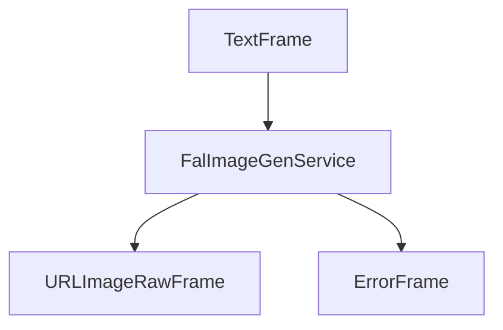

## Metrics Support

The service collects processing metrics:

* Generation time
* Download time
* API response time
* Total processing duration

## Notes

* Fast inference times with optimized models
* Supports various image sizes and formats
* Automatic prompt enhancement option
* Built-in safety filtering
* Asynchronous operation
* Efficient HTTP session management
* Comprehensive error handling


# Google Imagen
Source: https://docs.pipecat.ai/server/services/image-generation/google-imagen

Image generation service implementation using Google’s Imagen models

## Overview

`GoogleImageGenService` provides high-quality image generation capabilities using Google's Imagen models. It supports generating multiple images from text prompts with various customization options.

## Installation

To use `GoogleImageGenService`, install the required dependencies:

```bash
pip install "pipecat-ai[google]"
```

You'll also need to set up your Google API key as an environment variable: `GOOGLE_API_KEY`

## Configuration

### Constructor Parameters

<ParamField path="params" type="InputParams" default="InputParams()">
  Generation parameters configuration
</ParamField>

<ParamField path="api_key" type="str" required>
  Google API key for authentication
</ParamField>

### Input Parameters

<ParamField path="number_of_images" type="int" default="1">
  Number of images to generate (1-8)
</ParamField>

<ParamField path="model" type="str" default="imagen-3.0-generate-002">
  Model identifier
</ParamField>

<ParamField path="negative_prompt" type="str" default="None">
  Elements to exclude from generation
</ParamField>

## Input

The service accepts text prompts through its image generation pipeline.

## Output Frames

### URLImageRawFrame

<ParamField path="url" type="string">
  Generated image URL (null for Google implementation as it returns raw bytes)
</ParamField>

<ParamField path="image" type="bytes">
  Raw image data
</ParamField>

<ParamField path="size" type="tuple">
  Image dimensions (width, height)
</ParamField>

<ParamField path="format" type="string">
  Image format (e.g., 'JPEG')
</ParamField>

### ErrorFrame

<ParamField path="error" type="string">
  Error information if generation fails
</ParamField>

## Usage Example

```python
from pipecat.services.google.image import GoogleImageGenService

# Configure service
image_gen = GoogleImageGenService(
    api_key="your-google-api-key",
    params=GoogleImageGenService.InputParams(
        number_of_images=2,
        model="imagen-3.0-generate-002",
        negative_prompt="blurry, distorted, low quality"
    )
)

# Use in pipeline
main_pipeline = Pipeline(
    [
        transport.input(),
        context_aggregator.user(),
        llm_service,
        image_gen,
        tts_service,
        transport.output(),
        context_aggregator.assistant(),
    ]
)
```

## Frame Flow


## Metrics Support

The service supports metrics collection:

* Time to First Byte (TTFB)
* Processing duration
* API response metrics

## Model Support

Google's Imagen service offers different model variants:

| Model ID                | Description                                   |
| ----------------------- | --------------------------------------------- |
| imagen-3.0-generate-002 | Latest Imagen model with high-quality outputs |

See other available models in [Google's Imagen documentation](https://cloud.google.com/vertex-ai/generative-ai/docs/model-reference/imagen-api).

## Error Handling

```python
try:
    async for frame in service.run_image_gen(prompt):
        if isinstance(frame, ErrorFrame):
            handle_error(frame.error)
except Exception as e:
    logger.error(f"Image generation error: {e}")
```


# OpenAI Image Generation
Source: https://docs.pipecat.ai/server/services/image-generation/openai

Image generation service implementation using OpenAI’s DALL-E models

## Overview

`OpenAIImageGenService` provides high-quality image generation capabilities using OpenAI's DALL-E models. It transforms text prompts into images with various size options and model configurations.

## Installation

No additional installation is required for the `OpenAIImageGenService` as it is part of the Pipecat AI package.

You'll also need an OpenAI API key for authentication.

## Configuration

### Constructor Parameters

<ParamField path="api_key" type="str" required>
  OpenAI API key for authentication
</ParamField>

<ParamField path="base_url" type="str" default="None">
  Optional base URL for OpenAI API requests
</ParamField>

<ParamField path="aiohttp_session" type="aiohttp.ClientSession" required>
  HTTP session for making requests
</ParamField>

<ParamField path="image_size" type="str" required>
  Image dimensions - one of "256x256", "512x512", "1024x1024", "1792x1024",
  "1024x1792"
</ParamField>

<ParamField path="model" type="str" default="dall-e-3">
  OpenAI model identifier for image generation
</ParamField>

## Input

The service accepts text prompts through its image generation pipeline.

## Output Frames

### URLImageRawFrame

<ParamField path="url" type="string">
  Generated image URL from OpenAI
</ParamField>

<ParamField path="image" type="bytes">
  Raw image data
</ParamField>

<ParamField path="size" type="tuple">
  Image dimensions (width, height)
</ParamField>

<ParamField path="format" type="string">
  Image format (e.g., 'JPEG')
</ParamField>

### ErrorFrame

<ParamField path="error" type="string">
  Error information if generation fails
</ParamField>

## Usage Example

```python
import aiohttp
from pipecat.pipeline.pipeline import Pipeline
from pipecat.services.openai.image import OpenAIImageGenService

# Create an aiohttp session
aiohttp_session = aiohttp.ClientSession()

# Configure service
image_gen = OpenAIImageGenService(
    api_key="your-openai-api-key",
    aiohttp_session=aiohttp_session,
    image_size="1024x1024",
    model="dall-e-3"
)

# Use in pipeline
main_pipeline = Pipeline(
    [
        transport.input(),
        context_aggregator.user(),
        llm_service,
        image_gen,
        tts_service,
        transport.output(),
        context_aggregator.assistant(),
    ]
)
```

## Frame Flow

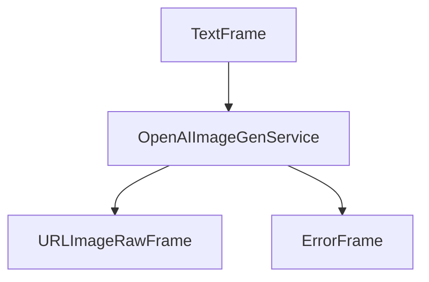

## Metrics Support

The service supports metrics collection:

* Time to First Byte (TTFB)
* Processing duration
* API response metrics

## Model Support

OpenAI's image generation service offers different model variants:

| Model ID | Description                                                         |
| -------- | ------------------------------------------------------------------- |
| dall-e-3 | Latest DALL-E model with higher quality and better prompt following |
| dall-e-2 | Previous generation model with good quality and lower cost          |

## Image Size Options

| Size Option | Aspect Ratio | Description                      |
| ----------- | ------------ | -------------------------------- |
| 256x256     | 1:1          | Small square image               |
| 512x512     | 1:1          | Medium square image              |
| 1024x1024   | 1:1          | Large square image               |
| 1792x1024   | 16:9         | Horizontal/landscape orientation |
| 1024x1792   | 9:16         | Vertical/portrait orientation    |

## Error Handling

```python
try:
    async for frame in image_gen.run_image_gen(prompt):
        if isinstance(frame, ErrorFrame):
            logger.error(f"Image generation error: {frame.error}")
        else:
            # Process successful image generation
            pass
except Exception as e:
    logger.error(f"Unexpected error during image generation: {e}")
```


# Anthropic
Source: https://docs.pipecat.ai/server/services/llm/anthropic

Large Language Model service implementation using Anthropic’s Claude API

## Overview

`AnthropicLLMService` provides integration with Anthropic's Claude models, supporting streaming responses, function calling, and prompt caching with specialized context handling for Anthropic's message format.

<CardGroup cols={3}>
  <Card title="API Reference" icon="code" href="https://pipecat-docs--2067.org.readthedocs.build/en/2067/api/pipecat.services.anthropic.llm.html">
    Complete API documentation and method details
  </Card>

  <Card title="Anthropic Docs" icon="book" href="https://docs.anthropic.com/en/api/messages">
    Official Anthropic API documentation and features
  </Card>

  <Card title="Example Code" icon="play" href="https://github.com/pipecat-ai/pipecat/blob/main/examples/foundational/14a-function-calling-anthropic.py">
    Working example with function calling
  </Card>
</CardGroup>

## Installation

To use Anthropic services, install the required dependency:

```bash
pip install "pipecat-ai[anthropic]"
```

You'll also need to set up your Anthropic API key as an environment variable: `ANTHROPIC_API_KEY`.

<Tip>
  Get your API key from [Anthropic Console](https://console.anthropic.com/).
</Tip>

## Frames

### Input

* `OpenAILLMContextFrame` - Conversation context and history
* `LLMMessagesFrame` - Direct message list
* `VisionImageRawFrame` - Images for vision processing
* `LLMUpdateSettingsFrame` - Runtime parameter updates
* `LLMEnablePromptCachingFrame` - Toggle prompt caching

### Output

* `LLMFullResponseStartFrame` / `LLMFullResponseEndFrame` - Response boundaries
* `LLMTextFrame` - Streamed completion chunks
* `FunctionCallInProgressFrame` / `FunctionCallResultFrame` - Function call lifecycle
* `ErrorFrame` - API or processing errors

## Function Calling

<Card title="Function Calling Guide" icon="function" href="/learn/function-calling">
  Learn how to implement function calling with standardized schemas, register
  handlers, manage context properly, and control execution flow in your
  conversational AI applications.
</Card>

## Context Management

<Card title="Context Management Guide" icon="messages" href="/learn/context-management">
  Learn how to manage conversation context, handle message history, and
  integrate context aggregators for consistent conversational experiences.
</Card>

## Usage Example

```python
import os
from pipecat.services.anthropic.llm import AnthropicLLMService
from pipecat.processors.aggregators.openai_llm_context import OpenAILLMContext
from pipecat.adapters.schemas.function_schema import FunctionSchema
from pipecat.adapters.schemas.tools_schema import ToolsSchema

# Configure the service
llm = AnthropicLLMService(
    api_key=os.getenv("ANTHROPIC_API_KEY"),
    model="claude-sonnet-4-20250514",
    params=AnthropicLLMService.InputParams(
        temperature=0.7,
        enable_prompt_caching_beta=True
    )
)

# Define function for tool calling
weather_function = FunctionSchema(
    name="get_weather",
    description="Get current weather information",
    properties={
        "location": {
            "type": "string",
            "description": "City and state, e.g. San Francisco, CA"
        }
    },
    required=["location"]
)

tools = ToolsSchema(standard_tools=[weather_function])

# Create context with system message
context = OpenAILLMContext(
    messages=[{"role": "user", "content": "What's the weather like?"}],
    tools=tools
)

# Create context aggregators
context_aggregator = llm.create_context_aggregator(context)

# Register function handler
async def get_weather(params):
    location = params.arguments["location"]
    await params.result_callback(f"Weather in {location}: 72°F and sunny")

llm.register_function("get_weather", get_weather)

# Use in pipeline
pipeline = Pipeline([
    transport.input(),
    stt,
    context_aggregator.user(),    # Handles user messages
    llm,                          # Processes with Anthropic
    tts,
    transport.output(),
    context_aggregator.assistant() # Captures responses
])
```

## Metrics

The service provides:

* **Time to First Byte (TTFB)** - Latency from request to first response token
* **Processing Duration** - Total request processing time
* **Token Usage** - Prompt tokens, completion tokens, and total usage
* **Cache Metrics** - Cache creation and read token usage

<Info>
  [Learn how to enable Metrics](/guides/fundamentals/metrics) in your Pipeline.
</Info>

## Additional Notes

* **Streaming Responses**: All responses are streamed for low latency
* **Context Persistence**: Use context aggregators to maintain conversation history
* **Error Handling**: Automatic retry logic for rate limits and transient errors
* **Message Format**: Automatically converts between OpenAI and Anthropic message formats
* **Prompt Caching**: Reduces costs and latency for repeated context patterns


# AWS Bedrock
Source: https://docs.pipecat.ai/server/services/llm/aws

Large Language Model service implementation using Amazon Bedrock API

## Overview

AWS Bedrock LLM service provides access to Amazon's foundation models including Anthropic Claude and Amazon Nova, with streaming responses, function calling, and multimodal capabilities through Amazon's managed AI service.

<CardGroup cols={3}>
  <Card title="API Reference" icon="code" href="https://reference-server.pipecat.ai/en/latest/api/pipecat.services.aws.llm.html">
    Complete API documentation and method details
  </Card>

  <Card title="AWS Bedrock Docs" icon="book" href="https://docs.aws.amazon.com/bedrock/latest/userguide/what-is-bedrock.html">
    Official AWS Bedrock documentation and features
  </Card>

  <Card title="Example Code" icon="play" href="https://github.com/pipecat-ai/pipecat/blob/main/examples/foundational/14r-function-calling-aws.py">
    Working example with function calling
  </Card>
</CardGroup>

## Installation

To use AWS Bedrock services, install the required dependencies:

```bash
pip install "pipecat-ai[aws]"
```

You'll also need to set up your AWS credentials as environment variables:

* `AWS_ACCESS_KEY_ID`
* `AWS_SECRET_ACCESS_KEY`
* `AWS_SESSION_TOKEN` (if using temporary credentials)
* `AWS_REGION` (defaults to "us-east-1")

<Tip>
  Set up an IAM user with Amazon Bedrock access in your AWS account to obtain
  credentials.
</Tip>

## Frames

### Input

* `OpenAILLMContextFrame` - Conversation context and history
* `LLMMessagesFrame` - Direct message list
* `VisionImageRawFrame` - Images for vision processing
* `LLMUpdateSettingsFrame` - Runtime parameter updates

### Output

* `LLMFullResponseStartFrame` / `LLMFullResponseEndFrame` - Response boundaries
* `LLMTextFrame` - Streamed completion chunks
* `FunctionCallInProgressFrame` / `FunctionCallResultFrame` - Function call lifecycle
* `ErrorFrame` - API or processing errors

## Function Calling

<Card title="Function Calling Guide" icon="function" href="/learn/function-calling">
  Learn how to implement function calling with standardized schemas, register
  handlers, manage context properly, and control execution flow in your
  conversational AI applications.
</Card>

## Context Management

<Card title="Context Management Guide" icon="messages" href="/learn/context-management">
  Learn how to manage conversation context, handle message history, and
  integrate context aggregators for consistent conversational experiences.
</Card>

## Usage Example

```python
import os
from pipecat.services.aws.llm import AWSBedrockLLMService
from pipecat.processors.aggregators.openai_llm_context import OpenAILLMContext
from pipecat.adapters.schemas.function_schema import FunctionSchema
from pipecat.adapters.schemas.tools_schema import ToolsSchema

# Configure the service
llm = AWSBedrockLLMService(
    aws_region="us-west-2",
    model="us.anthropic.claude-3-5-haiku-20241022-v1:0",
    params=AWSBedrockLLMService.InputParams(
        temperature=0.7,
    )
)

# Define function for tool calling
weather_function = FunctionSchema(
    name="get_current_weather",
    description="Get current weather information",
    properties={
        "location": {
            "type": "string",
            "description": "City and state, e.g. San Francisco, CA"
        },
        "format": {
            "type": "string",
            "enum": ["celsius", "fahrenheit"],
            "description": "Temperature unit to use"
        }
    },
    required=["location", "format"]
)

tools = ToolsSchema(standard_tools=[weather_function])

# Register function handler
async def get_current_weather(params):
    location = params.arguments["location"]
    format_type = params.arguments["format"]
    result = {"conditions": "sunny", "temperature": "75", "unit": format_type}
    await params.result_callback(result)

llm.register_function("get_current_weather", get_current_weather)

# Create context with system message
messages = [
    {
        "role": "system",
        "content": "You are a helpful assistant with access to weather information."
    }
]

context = OpenAILLMContext(messages, tools)
context_aggregator = llm.create_context_aggregator(context)

# Use in pipeline
pipeline = Pipeline([
    transport.input(),
    stt,
    context_aggregator.user(),    # Handles user messages
    llm,                          # Processes with AWS Bedrock
    tts,
    transport.output(),
    context_aggregator.assistant() # Captures responses
])
```

## Metrics

The service provides comprehensive AWS Bedrock metrics:

* **Time to First Byte (TTFB)** - Latency from request to first response token
* **Processing Duration** - Total request processing time
* **Token Usage** - Input tokens, output tokens, and total usage

<Info>
  [Learn how to enable Metrics](/guides/fundamentals/metrics) in your Pipeline.
</Info>

## Additional Notes

* **Streaming Responses**: All responses are streamed for low latency
* **Context Persistence**: Use context aggregators to maintain conversation history
* **Error Handling**: Automatic retry logic for rate limits and transient errors
* **Message Format**: Automatically converts between OpenAI and AWS Bedrock message formats
* **Performance Modes**: Choose "standard" or "optimized" latency based on your needs
* **Regional Availability**: Different models available in different AWS regions
* **Vision Support**: Image processing available with compatible models like Claude 3


# Azure
Source: https://docs.pipecat.ai/server/services/llm/azure

Large Language Model service implementation using Azure OpenAI API

## Overview

`AzureLLMService` provides access to Azure OpenAI's language models through an OpenAI-compatible interface. It inherits from `OpenAILLMService` and supports streaming responses, function calling, and context management.

<CardGroup cols={3}>
  <Card title="API Reference" icon="code" href="https://reference-server.pipecat.ai/en/latest/api/pipecat.services.azure.llm.html">
    Complete API documentation and method details
  </Card>

  <Card title="Azure OpenAI Docs" icon="book" href="https://learn.microsoft.com/en-us/azure/ai-services/openai/">
    Official Azure OpenAI documentation and setup
  </Card>

  <Card title="Example Code" icon="play" href="https://github.com/pipecat-ai/pipecat/blob/main/examples/foundational/14h-function-calling-azure.py">
    Working example with function calling
  </Card>
</CardGroup>

## Installation

To use Azure OpenAI services, install the required dependency:

```bash
pip install "pipecat-ai[azure]"
```

You'll need to set up your Azure OpenAI credentials:

* `AZURE_CHATGPT_API_KEY` - Your Azure OpenAI API key
* `AZURE_CHATGPT_ENDPOINT` - Your Azure OpenAI endpoint URL
* `AZURE_CHATGPT_MODEL` - Your model deployment name

<Tip>
  Get your credentials from the [Azure Portal](https://portal.azure.com/) under
  your Azure OpenAI resource.
</Tip>

## Frames

### Input

* `OpenAILLMContextFrame` - Conversation context and history
* `LLMMessagesFrame` - Direct message list
* `VisionImageRawFrame` - Images for vision processing
* `LLMUpdateSettingsFrame` - Runtime parameter updates

### Output

* `LLMFullResponseStartFrame` / `LLMFullResponseEndFrame` - Response boundaries
* `LLMTextFrame` - Streamed completion chunks
* `FunctionCallInProgressFrame` / `FunctionCallResultFrame` - Function call lifecycle
* `ErrorFrame` - API or processing errors

## Azure vs OpenAI Differences

| Feature            | Azure OpenAI              | Standard OpenAI      |
| ------------------ | ------------------------- | -------------------- |
| **Authentication** | API key + endpoint        | API key only         |
| **Deployment**     | Custom deployment names   | Model names directly |
| **Compliance**     | Enterprise SOC, HIPAA     | Standard compliance  |
| **Regional**       | Multiple Azure regions    | OpenAI regions only  |
| **Pricing**        | Azure billing integration | OpenAI billing       |

## Function Calling

<Card title="Function Calling Guide" icon="function" href="/learn/function-calling">
  Learn how to implement function calling with standardized schemas, register
  handlers, manage context properly, and control execution flow in your
  conversational AI applications.
</Card>

## Context Management

<Card title="Context Management Guide" icon="messages" href="/learn/context-management">
  Learn how to manage conversation context, handle message history, and
  integrate context aggregators for consistent conversational experiences.
</Card>

## Usage Example

```python
import os
from pipecat.services.azure.llm import AzureLLMService
from pipecat.processors.aggregators.openai_llm_context import OpenAILLMContext
from pipecat.adapters.schemas.function_schema import FunctionSchema
from pipecat.adapters.schemas.tools_schema import ToolsSchema

# Configure Azure OpenAI service
llm = AzureLLMService(
    api_key=os.getenv("AZURE_CHATGPT_API_KEY"),
    endpoint=os.getenv("AZURE_CHATGPT_ENDPOINT"),
    model=os.getenv("AZURE_CHATGPT_MODEL"),  # Your deployment name
    params=AzureLLMService.InputParams(
        temperature=0.7,
        max_completion_tokens=1000
    )
)

# Define function for tool calling
weather_function = FunctionSchema(
    name="get_current_weather",
    description="Get current weather information",
    properties={
        "location": {
            "type": "string",
            "description": "City and state, e.g. San Francisco, CA"
        },
        "format": {
            "type": "string",
            "enum": ["celsius", "fahrenheit"],
            "description": "Temperature unit to use"
        }
    },
    required=["location", "format"]
)

tools = ToolsSchema(standard_tools=[weather_function])

# Create context
context = OpenAILLMContext(
    messages=[
        {
            "role": "system",
            "content": "You are a helpful assistant. Keep responses concise for voice output."
        }
    ],
    tools=tools
)

# Create context aggregators
context_aggregator = llm.create_context_aggregator(context)

# Register function handler with event callback
async def fetch_weather(params):
    location = params.arguments["location"]
    await params.result_callback({"conditions": "sunny", "temperature": "75°F"})

llm.register_function("get_current_weather", fetch_weather)

# Optional: Add function call feedback
@llm.event_handler("on_function_calls_started")
async def on_function_calls_started(service, function_calls):
    await tts.queue_frame(TTSSpeakFrame("Let me check on that."))

# Use in pipeline
pipeline = Pipeline([
    transport.input(),
    stt,
    context_aggregator.user(),
    llm,
    tts,
    transport.output(),
    context_aggregator.assistant()
])
```

## Metrics

Inherits all OpenAI metrics capabilities:

* **Time to First Byte (TTFB)** - Response latency measurement
* **Processing Duration** - Total request processing time
* **Token Usage** - Prompt tokens, completion tokens, and totals

<Info>
  [Learn how to enable Metrics](/guides/fundamentals/metrics) in your Pipeline.
</Info>

## Additional Notes

* **OpenAI Compatibility**: Full compatibility with OpenAI API features and parameters
* **Regional Deployment**: Deploy in your preferred Azure region for compliance and latency
* **Deployment Names**: Use your Azure deployment name as the model parameter, not OpenAI model names
* **Automatic Retries**: Built-in retry logic handles transient Azure service issues


# Cerebras
Source: https://docs.pipecat.ai/server/services/llm/cerebras

LLM service implementation using Cerebras’s API with OpenAI-compatible interface

## Overview

`CerebrasLLMService` provides access to Cerebras's language models through an OpenAI-compatible interface. It inherits from `OpenAILLMService` and supports streaming responses, function calling, and context management.

<CardGroup cols={3}>
  <Card title="API Reference" icon="code" href="https://reference-server.pipecat.ai/en/latest/api/pipecat.services.cerebras.llm.html">
    Complete API documentation and method details
  </Card>

  <Card title="Cerebras Docs" icon="book" href="https://inference-docs.cerebras.ai/api-reference/chat-completions">
    Official Cerebras inference API documentation
  </Card>

  <Card title="Example Code" icon="play" href="https://github.com/pipecat-ai/pipecat/blob/main/examples/foundational/14k-function-calling-cerebras.py">
    Working example with function calling
  </Card>
</CardGroup>

## Installation

To use Cerebras services, install the required dependency:

```bash
pip install "pipecat-ai[cerebras]"
```

You'll also need to set up your Cerebras API key as an environment variable: `CEREBRAS_API_KEY`.

<Tip>Get your API key from [Cerebras Cloud](https://cloud.cerebras.ai/).</Tip>

## Frames

### Input

* `OpenAILLMContextFrame` - Conversation context and history
* `LLMMessagesFrame` - Direct message list
* `VisionImageRawFrame` - Images for vision processing
* `LLMUpdateSettingsFrame` - Runtime parameter updates

### Output

* `LLMFullResponseStartFrame` / `LLMFullResponseEndFrame` - Response boundaries
* `LLMTextFrame` - Streamed completion chunks
* `FunctionCallInProgressFrame` / `FunctionCallResultFrame` - Function call lifecycle
* `ErrorFrame` - API or processing errors

## Function Calling

<Card title="Function Calling Guide" icon="function" href="/learn/function-calling">
  Learn how to implement function calling with standardized schemas, register
  handlers, manage context properly, and control execution flow in your
  conversational AI applications.
</Card>

## Context Management

<Card title="Context Management Guide" icon="messages" href="/learn/context-management">
  Learn how to manage conversation context, handle message history, and
  integrate context aggregators for consistent conversational experiences.
</Card>

## Usage Example

```python
import os
from pipecat.services.cerebras.llm import CerebrasLLMService
from pipecat.processors.aggregators.openai_llm_context import OpenAILLMContext
from pipecat.adapters.schemas.function_schema import FunctionSchema
from pipecat.adapters.schemas.tools_schema import ToolsSchema

# Configure the service
llm = CerebrasLLMService(
    api_key=os.getenv("CEREBRAS_API_KEY"),
    model="llama-3.3-70b",
    params=CerebrasLLMService.InputParams(
        temperature=0.7,
        max_completion_tokens=1000
    )
)

# Define function for tool calling
weather_function = FunctionSchema(
    name="get_current_weather",
    description="Get current weather information",
    properties={
        "location": {
            "type": "string",
            "description": "City and state, e.g. San Francisco, CA"
        },
        "format": {
            "type": "string",
            "enum": ["celsius", "fahrenheit"],
            "description": "Temperature unit to use"
        }
    },
    required=["location", "format"]
)

tools = ToolsSchema(standard_tools=[weather_function])

# Create context
context = OpenAILLMContext(
    messages=[
        {
            "role": "system",
            "content": "You are a helpful assistant for weather information. Keep responses concise for voice output."
        }
    ],
    tools=tools
)

# Create context aggregators
context_aggregator = llm.create_context_aggregator(context)

# Register function handler
async def fetch_weather(params):
    location = params.arguments["location"]
    await params.result_callback({"conditions": "sunny", "temperature": "75°F"})

llm.register_function("get_current_weather", fetch_weather)

# Optional: Add function call feedback
@llm.event_handler("on_function_calls_started")
async def on_function_calls_started(service, function_calls):
    await tts.queue_frame(TTSSpeakFrame("Let me check on that."))

# Use in pipeline
pipeline = Pipeline([
    transport.input(),
    stt,
    context_aggregator.user(),
    llm,
    tts,
    transport.output(),
    context_aggregator.assistant()
])
```

## Metrics

Inherits all OpenAI-compatible metrics:

* **Time to First Byte (TTFB)** - Ultra-low latency measurement
* **Processing Duration** - Total request processing time
* **Token Usage** - Prompt tokens, completion tokens, and totals

<Info>
  [Learn how to enable Metrics](/guides/fundamentals/metrics) in your Pipeline.
</Info>

## Additional Notes

* **OpenAI Compatibility**: Full compatibility with OpenAI API parameters and responses
* **Streaming Responses**: All responses are streamed for minimal latency
* **Function Calling**: Full support for OpenAI-style tool calling
* **Open Source Models**: Access to latest Llama models with commercial licensing


# DeepSeek
Source: https://docs.pipecat.ai/server/services/llm/deepseek

LLM service implementation using DeepSeek’s API with OpenAI-compatible interface

## Overview

`DeepSeekLLMService` provides access to DeepSeek's language models through an OpenAI-compatible interface. It inherits from `OpenAILLMService` and supports streaming responses, function calling, and context management.

<CardGroup cols={3}>
  <Card title="API Reference" icon="code" href="https://reference-server.pipecat.ai/en/latest/api/pipecat.services.deepseek.llm.html">
    Complete API documentation and method details
  </Card>

  <Card title="DeepSeek Docs" icon="book" href="https://api-docs.deepseek.com/api/create-chat-completion">
    Official DeepSeek API documentation and features
  </Card>

  <Card title="Example Code" icon="play" href="https://github.com/pipecat-ai/pipecat/blob/main/examples/foundational/14l-function-calling-deepseek.py">
    Working example with function calling
  </Card>
</CardGroup>

## Installation

To use DeepSeek services, install the required dependency:

```bash
pip install "pipecat-ai[deepseek]"
```

You'll also need to set up your DeepSeek API key as an environment variable: `DEEPSEEK_API_KEY`.

<Tip>
  Get your API key from [DeepSeek Platform](https://platform.deepseek.com/).
</Tip>

## Frames

### Input

* `OpenAILLMContextFrame` - Conversation context and history
* `LLMMessagesFrame` - Direct message list
* `VisionImageRawFrame` - Images for vision processing
* `LLMUpdateSettingsFrame` - Runtime parameter updates

### Output

* `LLMFullResponseStartFrame` / `LLMFullResponseEndFrame` - Response boundaries
* `LLMTextFrame` - Streamed completion chunks
* `FunctionCallInProgressFrame` / `FunctionCallResultFrame` - Function call lifecycle
* `ErrorFrame` - API or processing errors

## Function Calling

<Card title="Function Calling Guide" icon="function" href="/learn/function-calling">
  Learn how to implement function calling with standardized schemas, register
  handlers, manage context properly, and control execution flow in your
  conversational AI applications.
</Card>

## Context Management

<Card title="Context Management Guide" icon="messages" href="/learn/context-management">
  Learn how to manage conversation context, handle message history, and
  integrate context aggregators for consistent conversational experiences.
</Card>

## Usage Example

```python
import os
from pipecat.services.deepseek.llm import DeepSeekLLMService
from pipecat.processors.aggregators.openai_llm_context import OpenAILLMContext
from pipecat.adapters.schemas.function_schema import FunctionSchema
from pipecat.adapters.schemas.tools_schema import ToolsSchema

# Configure DeepSeek service
llm = DeepSeekLLMService(
    api_key=os.getenv("DEEPSEEK_API_KEY"),
    model="deepseek-chat",
    params=DeepSeekLLMService.InputParams(
        temperature=0.7,
        max_tokens=1000
    )
)

# Define function for tool calling
weather_function = FunctionSchema(
    name="get_current_weather",
    description="Get current weather information",
    properties={
        "location": {
            "type": "string",
            "description": "City and state, e.g. San Francisco, CA"
        },
        "format": {
            "type": "string",
            "enum": ["celsius", "fahrenheit"],
            "description": "Temperature unit to use"
        }
    },
    required=["location", "format"]
)

tools = ToolsSchema(standard_tools=[weather_function])

# Create context with reasoning-focused system message
context = OpenAILLMContext(
    messages=[
        {
            "role": "system",
            "content": """You are a helpful assistant with strong reasoning capabilities.
            Infer temperature units based on location unless specified.
            Provide logical, step-by-step responses."""
        }
    ],
    tools=tools
)

# Create context aggregators
context_aggregator = llm.create_context_aggregator(context)

# Register function handler with feedback
async def fetch_weather(params):
    location = params.arguments["location"]
    await params.result_callback({"conditions": "sunny", "temperature": "75°F"})

llm.register_function("get_current_weather", fetch_weather)

# Optional: Add function call feedback
@llm.event_handler("on_function_calls_started")
async def on_function_calls_started(service, function_calls):
    await tts.queue_frame(TTSSpeakFrame("Let me check on that."))

# Use in pipeline
pipeline = Pipeline([
    transport.input(),
    stt,
    context_aggregator.user(),
    llm,
    tts,
    transport.output(),
    context_aggregator.assistant()
])
```

## Metrics

Inherits all OpenAI metrics capabilities:

* **Time to First Byte (TTFB)** - Response latency measurement
* **Processing Duration** - Total request processing time
* **Token Usage** - Prompt tokens, completion tokens, and totals

<Info>
  [Learn how to enable Metrics](/guides/fundamentals/metrics) in your Pipeline.
</Info>

## Additional Notes

* **OpenAI Compatibility**: Full compatibility with OpenAI API features and parameters
* **Cost Efficiency**: Competitive pricing compared to other high-capability models
* **Streaming Support**: Real-time response streaming for low-latency applications


# Fireworks AI
Source: https://docs.pipecat.ai/server/services/llm/fireworks

LLM service implementation using Fireworks AI’s API with OpenAI-compatible interface

## Overview

`FireworksLLMService` provides access to Fireworks AI's language models through an OpenAI-compatible interface. It inherits from `OpenAILLMService` and supports streaming responses, function calling, and context management.

<CardGroup cols={3}>
  <Card title="API Reference" icon="code" href="https://reference-server.pipecat.ai/en/latest/api/pipecat.services.fireworks.llm.html">
    Complete API documentation and method details
  </Card>

  <Card title="Fireworks Docs" icon="book" href="https://docs.fireworks.ai/api-reference/post-chatcompletions">
    Official Fireworks AI API documentation and features
  </Card>

  <Card title="Example Code" icon="play" href="https://github.com/pipecat-ai/pipecat/blob/main/examples/foundational/14i-function-calling-fireworks.py">
    Working example with function calling
  </Card>
</CardGroup>

## Installation

To use Fireworks AI services, install the required dependency:

```bash
pip install "pipecat-ai[fireworks]"
```

You'll also need to set up your Fireworks API key as an environment variable: `FIREWORKS_API_KEY`.

<Tip>
  Get your API key from [Fireworks AI
  Console](https://fireworks.ai/account/api-keys).
</Tip>

## Frames

### Input

* `OpenAILLMContextFrame` - Conversation context and history
* `LLMMessagesFrame` - Direct message list
* `VisionImageRawFrame` - Images for vision processing
* `LLMUpdateSettingsFrame` - Runtime parameter updates

### Output

* `LLMFullResponseStartFrame` / `LLMFullResponseEndFrame` - Response boundaries
* `LLMTextFrame` - Streamed completion chunks
* `FunctionCallInProgressFrame` / `FunctionCallResultFrame` - Function call lifecycle
* `ErrorFrame` - API or processing errors

## Function Calling

<Card title="Function Calling Guide" icon="function" href="/learn/function-calling">
  Learn how to implement function calling with standardized schemas, register
  handlers, manage context properly, and control execution flow in your
  conversational AI applications.
</Card>

## Context Management

<Card title="Context Management Guide" icon="messages" href="/learn/context-management">
  Learn how to manage conversation context, handle message history, and
  integrate context aggregators for consistent conversational experiences.
</Card>

## Usage Example

```python
import os
from pipecat.services.fireworks.llm import FireworksLLMService
from pipecat.processors.aggregators.openai_llm_context import OpenAILLMContext
from pipecat.adapters.schemas.function_schema import FunctionSchema
from pipecat.adapters.schemas.tools_schema import ToolsSchema

# Configure Fireworks service
llm = FireworksLLMService(
    api_key=os.getenv("FIREWORKS_API_KEY"),
    model="accounts/fireworks/models/firefunction-v2",  # Optimized for function calling
    params=FireworksLLMService.InputParams(
        temperature=0.7,
        max_tokens=1000
    )
)

# Define function for tool calling
weather_function = FunctionSchema(
    name="get_current_weather",
    description="Get current weather information",
    properties={
        "location": {
            "type": "string",
            "description": "City and state, e.g. San Francisco, CA"
        },
        "format": {
            "type": "string",
            "enum": ["celsius", "fahrenheit"],
            "description": "Temperature unit to use"
        }
    },
    required=["location", "format"]
)

tools = ToolsSchema(standard_tools=[weather_function])

# Create context
context = OpenAILLMContext(
    messages=[
        {
            "role": "system",
            "content": """You are a helpful assistant optimized for voice interactions.
            Keep responses concise and avoid special characters for audio output."""
        }
    ],
    tools=tools
)

# Create context aggregators
context_aggregator = llm.create_context_aggregator(context)

# Register function handler with feedback
async def fetch_weather(params):
    location = params.arguments["location"]
    await params.result_callback({"conditions": "sunny", "temperature": "75°F"})

llm.register_function("get_current_weather", fetch_weather)

# Optional: Add function call feedback
@llm.event_handler("on_function_calls_started")
async def on_function_calls_started(service, function_calls):
    await tts.queue_frame(TTSSpeakFrame("Let me check on that."))

# Use in pipeline
pipeline = Pipeline([
    transport.input(),
    stt,
    context_aggregator.user(),
    llm,
    tts,
    transport.output(),
    context_aggregator.assistant()
])
```

## Metrics

Inherits all OpenAI metrics capabilities:

* **Time to First Byte (TTFB)** - Response latency measurement
* **Processing Duration** - Total request processing time
* **Token Usage** - Prompt tokens, completion tokens, and totals

<Info>
  [Learn how to enable Metrics](/guides/fundamentals/metrics) in your Pipeline.
</Info>

## Additional Notes

* **OpenAI Compatibility**: Full compatibility with OpenAI API features and parameters
* **Function Calling**: Specialized firefunction models optimized for tool use
* **Cost Effective**: Competitive pricing for open-source model inference


# Google Gemini
Source: https://docs.pipecat.ai/server/services/llm/gemini

Large Language Model service implementation using Google’s Gemini API

## Overview

`GoogleLLMService` provides integration with Google's Gemini models, supporting streaming responses, function calling, and multimodal inputs. It includes specialized context handling for Google's message format while maintaining compatibility with OpenAI-style contexts.

<CardGroup cols={3}>
  <Card title="API Reference" icon="code" href="https://reference-server.pipecat.ai/en/latest/api/pipecat.services.google.llm.html">
    Complete API documentation and method details
  </Card>

  <Card title="Gemini Docs" icon="book" href="https://ai.google.dev/gemini-api/docs">
    Official Google Gemini API documentation and features
  </Card>

  <Card title="Example Code" icon="play" href="https://github.com/pipecat-ai/pipecat/blob/main/examples/foundational/14e-function-calling-google.py">
    Working example with function calling
  </Card>
</CardGroup>

## Installation

To use `GoogleLLMService`, install the required dependencies:

```bash
pip install "pipecat-ai[google]"
```

You'll also need to set up your Google API key as an environment variable: `GOOGLE_API_KEY`.

<Tip>
  Get your API key from [Google AI
  Studio](https://aistudio.google.com/app/apikey).
</Tip>

## Frames

### Input

* `OpenAILLMContextFrame` - Conversation context and history
* `LLMMessagesFrame` - Direct message list
* `VisionImageRawFrame` - Images for vision processing
* `LLMUpdateSettingsFrame` - Runtime parameter updates

### Output

* `LLMFullResponseStartFrame` / `LLMFullResponseEndFrame` - Response boundaries
* `LLMTextFrame` - Streamed completion chunks
* `LLMSearchResponseFrame` - Search grounding results with citations
* `FunctionCallInProgressFrame` / `FunctionCallResultFrame` - Function call lifecycle
* `ErrorFrame` - API or processing errors

## Search Grounding

Google Gemini's search grounding feature enables real-time web search integration, allowing the model to access current information and provide citations. This is particularly valuable for applications requiring up-to-date information.

### Enabling Search Grounding

```python
# Configure search grounding tool
search_tool = {
    "google_search_retrieval": {
        "dynamic_retrieval_config": {
            "mode": "MODE_DYNAMIC",
            "dynamic_threshold": 0.3,  # Lower = more frequent grounding
        }
    }
}

# Initialize with search grounding
llm = GoogleLLMService(
    api_key=os.getenv("GOOGLE_API_KEY"),
    model="gemini-1.5-flash-002",
    system_instruction="You are a helpful assistant with access to current information.",
    tools=[search_tool]
)
```

### Handling Search Results

Search grounding produces `LLMSearchResponseFrame` with detailed citation information:

```python
@pipeline.event_handler("llm_search_response")
async def handle_search_response(frame):
    print(f"Search result: {frame.search_result}")
    print(f"Sources: {len(frame.origins)} citations")
    for origin in frame.origins:
        print(f"- {origin['site_title']}: {origin['site_uri']}")
```

## Function Calling

<Card title="Function Calling Guide" icon="function" href="/learn/function-calling">
  Learn how to implement function calling with standardized schemas, register
  handlers, manage context properly, and control execution flow in your
  conversational AI applications.
</Card>

## Context Management

<Card title="Context Management Guide" icon="messages" href="/learn/context-management">
  Learn how to manage conversation context, handle message history, and
  integrate context aggregators for consistent conversational experiences.
</Card>

## Usage Example

```python
import os
from pipecat.services.google.llm import GoogleLLMService
from pipecat.processors.aggregators.openai_llm_context import OpenAILLMContext
from pipecat.adapters.schemas.function_schema import FunctionSchema
from pipecat.adapters.schemas.tools_schema import ToolsSchema

# Configure Gemini service with search grounding
search_tool = {
    "google_search_retrieval": {
        "dynamic_retrieval_config": {
            "mode": "MODE_DYNAMIC",
            "dynamic_threshold": 0.3
        }
    }
}

llm = GoogleLLMService(
    api_key=os.getenv("GOOGLE_API_KEY"),
    model="gemini-2.0-flash",
    system_instruction="""You are a helpful assistant with access to current information.
    When users ask about recent events, use search to provide accurate, up-to-date information.""",
    tools=[search_tool],
    params=GoogleLLMService.InputParams(
        temperature=0.7,
        max_tokens=1000
    )
)

# Define function for tool calling
weather_function = FunctionSchema(
    name="get_weather",
    description="Get current weather information",
    properties={
        "location": {
            "type": "string",
            "description": "City and state, e.g. San Francisco, CA"
        }
    },
    required=["location"]
)

# Define image capture function for multimodal capabilities
image_function = FunctionSchema(
    name="get_image",
    description="Capture and analyze an image from the video stream",
    properties={
        "question": {
            "type": "string",
            "description": "Question about what to analyze in the image"
        }
    },
    required=["question"]
)

tools = ToolsSchema(standard_tools=[weather_function, image_function])

# Create context with multimodal system prompt
context = OpenAILLMContext(
    messages=[
        {
            "role": "system",
            "content": """You are a helpful assistant with access to current information and vision capabilities.
            You can answer questions about weather, analyze images from video streams, and search for current information.
            Keep responses concise for voice output."""
        },
        {"role": "user", "content": "Hello! What can you help me with?"}
    ],
    tools=tools
)

# Create context aggregators
context_aggregator = llm.create_context_aggregator(context)

# Register function handlers
async def get_weather(params):
    location = params.arguments["location"]
    await params.result_callback(f"Weather in {location}: 72°F and sunny")

async def get_image(params):
    question = params.arguments["question"]
    # Request image from video stream
    await params.llm.request_image_frame(
        user_id=client_id,
        function_name=params.function_name,
        tool_call_id=params.tool_call_id,
        text_content=question
    )
    await params.result_callback(f"Analyzing image for: {question}")

llm.register_function("get_weather", get_weather)
llm.register_function("get_image", get_image)

# Optional: Add function call feedback
@llm.event_handler("on_function_calls_started")
async def on_function_calls_started(service, function_calls):
    await tts.queue_frame(TTSSpeakFrame("Let me check on that."))

# Use in pipeline
pipeline = Pipeline([
    transport.input(),
    stt,
    context_aggregator.user(),
    llm,
    tts,
    transport.output(),
    context_aggregator.assistant()
])
```

## Metrics

Google Gemini provides comprehensive usage tracking:

* **Time to First Byte (TTFB)** - Response latency measurement
* **Processing Duration** - Total request processing time
* **Token Usage** - Prompt tokens, completion tokens, and totals

<Info>
  [Learn how to enable Metrics](/guides/fundamentals/metrics) in your Pipeline.
</Info>

## Additional Notes

* **Multimodal Capabilities**: Native support for text, images, audio, and video processing
* **Search Grounding**: Real-time web search with automatic citation and source attribution
* **System Instructions**: Handle system messages differently than OpenAI - set during initialization
* **Vision Functions**: Built-in support for image capture and analysis from video streams


# Google Vertex AI
Source: https://docs.pipecat.ai/server/services/llm/google-vertex

LLM service implementation using Google’s Vertex AI with OpenAI-compatible interface

## Overview

`GoogleVertexLLMService` provides access to Google's language models through Vertex AI while maintaining an OpenAI-compatible interface. It inherits from `OpenAILLMService` and supports all the features of the OpenAI interface while connecting to Google's AI services.

## Installation

To use `GoogleVertexLLMService`, install the required dependencies:

```bash
pip install "pipecat-ai[google]"
```

You'll also need to set up Google Cloud credentials. You can either:

* Set the `GOOGLE_APPLICATION_CREDENTIALS` environment variable pointing to your service account JSON file
* Provide credentials directly to the service constructor

## Configuration

### Constructor Parameters

<ParamField path="credentials" type="Optional[str]">
  JSON string of Google service account credentials
</ParamField>

<ParamField path="credentials_path" type="Optional[str]">
  Path to the Google service account JSON file
</ParamField>

<ParamField path="model" type="str" default="google/gemini-2.0-flash-001">
  Model identifier
</ParamField>

<ParamField path="params" type="InputParams">
  Vertex AI specific parameters
</ParamField>

### Input Parameters

Extends the OpenAI input parameters with Vertex AI specific options:

<ParamField path="location" type="str" default="us-east4">
  Google Cloud region where the model is deployed
</ParamField>

<ParamField path="project_id" type="str" required>
  Google Cloud project ID
</ParamField>

Also inherits all OpenAI-compatible parameters:

<ParamField path="frequency_penalty" type="Optional[float]">
  Reduces likelihood of repeating tokens based on their frequency. Range: \[-2.0,
  2.0]
</ParamField>

<ParamField path="max_tokens" type="Optional[int]">
  Maximum number of tokens to generate. Must be greater than or equal to 1
</ParamField>

<ParamField path="presence_penalty" type="Optional[float]">
  Reduces likelihood of repeating any tokens that have appeared. Range: \[-2.0,
  2.0]
</ParamField>

<ParamField path="temperature" type="Optional[float]">
  Controls randomness in the output. Range: \[0.0, 2.0]
</ParamField>

<ParamField path="top_p" type="Optional[float]">
  Controls diversity via nucleus sampling. Range: \[0.0, 1.0]
</ParamField>

## Usage Example

```python
from pipecat.services.google.llm_vertex import GoogleVertexLLMService
from pipecat.processors.aggregators.openai_llm_context import OpenAILLMContext
from pipecat.pipeline.pipeline import Pipeline
from pipecat.pipeline.task import PipelineParams, PipelineTask

# Configure service
llm = GoogleVertexLLMService(
    credentials_path="/path/to/service-account.json",
    model="google/gemini-2.0-flash-001",
    params=GoogleVertexLLMService.InputParams(
        project_id="your-google-cloud-project-id",
        location="us-east4"
    )
)

# Create context with system message
context = OpenAILLMContext(
    messages=[
        {
            "role": "system",
            "content": "You are a helpful assistant in a voice conversation. Keep responses concise."
        }
    ]
)

# Create context aggregator for message handling
context_aggregator = llm.create_context_aggregator(context)

# Set up pipeline
pipeline = Pipeline([
    transport.input(),
    context_aggregator.user(),
    llm,
    tts,
    transport.output(),
    context_aggregator.assistant()
])

# Create and configure task
task = PipelineTask(
    pipeline,
    params=PipelineParams(
        allow_interruptions=True,
        enable_metrics=True,
        enable_usage_metrics=True,
    ),
)
```

## Authentication

The service supports multiple authentication methods:

1. **Direct credentials string** - Pass the JSON credentials as a string to the constructor
2. **Credentials file path** - Provide a path to the service account JSON file
3. **Environment variable** - Set `GOOGLE_APPLICATION_CREDENTIALS` to the path of your service account file

The service automatically handles token refresh, with tokens having a 1-hour lifetime.

## Methods

See the [LLM base class methods](https://reference-server.pipecat.ai/en/latest/api/pipecat.services.llm_service.html#llm-service) for additional functionality.

## Function Calling

This service supports function calling (also known as tool calling) through the OpenAI-compatible interface, which allows the LLM to request information from external services and APIs.

<Card title="Function Calling Guide" icon="function" href="/learn/function-calling">
  Learn how to implement function calling with standardized schemas, register
  handlers, manage context properly, and control execution flow in your
  conversational AI applications.
</Card>

## Available Models

| Model Name                    | Description                           |
| ----------------------------- | ------------------------------------- |
| `google/gemini-2.0-flash-001` | Fast, efficient text generation model |
| `google/gemini-2.0-pro-001`   | Comprehensive, high-quality model     |
| `google/gemini-1.5-pro-001`   | Versatile multimodal model            |
| `google/gemini-1.5-flash-001` | Fast, efficient multimodal model      |

<Note>
  See [Google Vertex AI
  documentation](https://cloud.google.com/vertex-ai/generative-ai/docs/model-reference/overview)
  for a complete list of supported models and their capabilities.
</Note>

## Frame Flow

Inherits the OpenAI LLM Service frame flow:


## Metrics Support

The service collects standard LLM metrics:

* **Time to First Byte (TTFB)** - Response latency measurement
* **Processing Duration** - Total request processing time
* **Token Usage** - Prompt tokens, completion tokens, and totals

<Info>
  [Learn how to enable Metrics](/guides/fundamentals/metrics) in your Pipeline.
</Info>

## Notes

* Uses Google Cloud's Vertex AI API
* Maintains OpenAI-compatible interface
* Supports streaming responses
* Handles function calling
* Manages conversation context
* Includes token usage tracking
* Thread-safe processing
* Automatic token refresh
* Requires Google Cloud project setup


# Grok
Source: https://docs.pipecat.ai/server/services/llm/grok

LLM service implementation using Grok’s API with OpenAI-compatible interface

## Overview

`GrokLLMService` provides access to Grok's language models through an OpenAI-compatible interface. It inherits from `OpenAILLMService` and supports streaming responses, function calling, and context management.

<CardGroup cols={3}>
  <Card title="API Reference" icon="code" href="https://reference-server.pipecat.ai/en/latest/api/pipecat.services.grok.llm.html">
    Complete API documentation and method details
  </Card>

  <Card title="Grok Docs" icon="book" href="https://docs.x.ai/docs/api-reference#chat-completions">
    Official Grok API documentation and features
  </Card>

  <Card title="Example Code" icon="play" href="https://github.com/pipecat-ai/pipecat/blob/main/examples/foundational/14g-function-calling-grok.py">
    Working example with function calling
  </Card>
</CardGroup>

## Installation

To use `GrokLLMService`, install the required dependencies:

```bash
pip install "pipecat-ai[grok]"
```

You'll also need to set up your Grok API key as an environment variable: `GROK_API_KEY`.

<Tip>Get your API key from [X.AI Console](https://console.x.ai/).</Tip>

## Frames

### Input

* `OpenAILLMContextFrame` - Conversation context and history
* `LLMMessagesFrame` - Direct message list
* `VisionImageRawFrame` - Images for vision processing
* `LLMUpdateSettingsFrame` - Runtime parameter updates

### Output

* `LLMFullResponseStartFrame` / `LLMFullResponseEndFrame` - Response boundaries
* `LLMTextFrame` - Streamed completion chunks
* `FunctionCallInProgressFrame` / `FunctionCallResultFrame` - Function call lifecycle
* `ErrorFrame` - API or processing errors

## Function Calling

<Card title="Function Calling Guide" icon="function" href="/learn/function-calling">
  Learn how to implement function calling with standardized schemas, register
  handlers, manage context properly, and control execution flow in your
  conversational AI applications.
</Card>

## Context Management

<Card title="Context Management Guide" icon="messages" href="/learn/context-management">
  Learn how to manage conversation context, handle message history, and
  integrate context aggregators for consistent conversational experiences.
</Card>

## Usage Example

```python
import os
from pipecat.services.grok.llm import GrokLLMService
from pipecat.processors.aggregators.openai_llm_context import OpenAILLMContext
from pipecat.adapters.schemas.function_schema import FunctionSchema
from pipecat.adapters.schemas.tools_schema import ToolsSchema

# Configure Grok service
llm = GrokLLMService(
    api_key=os.getenv("GROK_API_KEY"),
    model="grok-3-beta",
    params=GrokLLMService.InputParams(
        temperature=0.8,  # Higher for creative responses
        max_tokens=1000
    )
)

# Define function for tool calling
weather_function = FunctionSchema(
    name="get_current_weather",
    description="Get current weather information",
    properties={
        "location": {
            "type": "string",
            "description": "City and state, e.g. San Francisco, CA"
        },
        "format": {
            "type": "string",
            "enum": ["celsius", "fahrenheit"],
            "description": "Temperature unit to use"
        }
    },
    required=["location", "format"]
)

tools = ToolsSchema(standard_tools=[weather_function])

# Create context optimized for voice interaction
context = OpenAILLMContext(
    messages=[
        {
            "role": "system",
            "content": """You are a helpful and creative assistant in a voice conversation.
            Your output will be converted to audio, so avoid special characters.
            Respond in an engaging and helpful way while being succinct."""
        }
    ],
    tools=tools
)

# Create context aggregators
context_aggregator = llm.create_context_aggregator(context)

# Register function handler
async def fetch_weather(params):
    location = params.arguments["location"]
    await params.result_callback({"conditions": "sunny", "temperature": "75°F"})

llm.register_function("get_current_weather", fetch_weather)

# Use in pipeline
pipeline = Pipeline([
    transport.input(),
    stt,
    context_aggregator.user(),
    llm,
    tts,
    transport.output(),
    context_aggregator.assistant()
])
```

## Metrics

Inherits all OpenAI metrics capabilities with specialized token tracking:

* **Time to First Byte (TTFB)** - Response latency measurement
* **Processing Duration** - Total request processing time
* **Token Usage** - Accumulated prompt tokens, completion tokens, and totals

<Info>
  [Learn how to enable Metrics](/guides/fundamentals/metrics) in your Pipeline.
</Info>

## Additional Notes

* **OpenAI Compatibility**: Full compatibility with OpenAI API features and parameters
* **Real-time Information**: Access to current events and up-to-date information
* **Vision Capabilities**: Image understanding and analysis with grok-2-vision model


# Groq
Source: https://docs.pipecat.ai/server/services/llm/groq

LLM service implementation using Groq’s API with OpenAI-compatible interface

## Overview

`GroqLLMService` provides access to Groq's language models through an OpenAI-compatible interface. It inherits from `OpenAILLMService` and supports streaming responses, function calling, and context management.

<CardGroup cols={3}>
  <Card title="API Reference" icon="code" href="https://reference-server.pipecat.ai/en/latest/api/pipecat.services.groq.llm.html">
    Complete API documentation and method details
  </Card>

  <Card title="Groq Docs" icon="book" href="https://console.groq.com/docs/api-reference#chat-create">
    Official Groq API documentation and features
  </Card>

  <Card title="Example Code" icon="play" href="https://github.com/pipecat-ai/pipecat/blob/main/examples/foundational/14f-function-calling-groq.py">
    Working example with function calling
  </Card>
</CardGroup>

## Installation

To use Groq services, install the required dependency:

```bash
pip install "pipecat-ai[groq]"
```

You'll also need to set up your Groq API key as an environment variable: `GROQ_API_KEY`.

<Tip>
  Get your API key for free from [Groq Console](https://console.groq.com/).
</Tip>

## Frames

### Input

* `OpenAILLMContextFrame` - Conversation context and history
* `LLMMessagesFrame` - Direct message list
* `VisionImageRawFrame` - Images for vision processing (select models)
* `LLMUpdateSettingsFrame` - Runtime parameter updates

### Output

* `LLMFullResponseStartFrame` / `LLMFullResponseEndFrame` - Response boundaries
* `LLMTextFrame` - Streamed completion chunks
* `FunctionCallInProgressFrame` / `FunctionCallResultFrame` - Function call lifecycle
* `ErrorFrame` - API or processing errors

## Function Calling

<Card title="Function Calling Guide" icon="function" href="/learn/function-calling">
  Learn how to implement function calling with standardized schemas, register
  handlers, manage context properly, and control execution flow in your
  conversational AI applications.
</Card>

## Context Management

<Card title="Context Management Guide" icon="messages" href="/learn/context-management">
  Learn how to manage conversation context, handle message history, and
  integrate context aggregators for consistent conversational experiences.
</Card>

## Usage Example

```python
import os
from pipecat.services.groq.llm import GroqLLMService
from pipecat.processors.aggregators.openai_llm_context import OpenAILLMContext
from pipecat.adapters.schemas.function_schema import FunctionSchema
from pipecat.adapters.schemas.tools_schema import ToolsSchema

# Configure Groq service for speed
llm = GroqLLMService(
    api_key=os.getenv("GROQ_API_KEY"),
    model="llama-3.3-70b-versatile",  # Fast, capable model
    params=GroqLLMService.InputParams(
        temperature=0.7,
        max_tokens=1000
    )
)

# Define function for tool calling
weather_function = FunctionSchema(
    name="get_current_weather",
    description="Get current weather information",
    properties={
        "location": {
            "type": "string",
            "description": "City and state, e.g. San Francisco, CA"
        },
        "format": {
            "type": "string",
            "enum": ["celsius", "fahrenheit"],
            "description": "Temperature unit to use"
        }
    },
    required=["location", "format"]
)

tools = ToolsSchema(standard_tools=[weather_function])

# Create context optimized for voice interaction
context = OpenAILLMContext(
    messages=[
        {
            "role": "system",
            "content": """You are a helpful assistant optimized for voice conversations.
            Keep responses concise and avoid special characters that don't work well in speech."""
        }
    ],
    tools=tools
)

# Create context aggregators with fast timeout for speed
from pipecat.processors.aggregators.llm_response import LLMUserAggregatorParams

context_aggregator = llm.create_context_aggregator(
    context,
    user_params=LLMUserAggregatorParams(aggregation_timeout=0.05)  # Fast aggregation
)

# Register function handler with feedback
async def fetch_weather(params):
    location = params.arguments["location"]
    await params.result_callback({"conditions": "sunny", "temperature": "75°F"})

llm.register_function("get_current_weather", fetch_weather)

# Optional: Add function call feedback for better UX
@llm.event_handler("on_function_calls_started")
async def on_function_calls_started(service, function_calls):
    await tts.queue_frame(TTSSpeakFrame("Let me check on that."))

# Use in pipeline with Groq STT for full Groq stack
pipeline = Pipeline([
    transport.input(),
    groq_stt,  # GroqSTTService for consistent ecosystem
    context_aggregator.user(),
    llm,
    tts,
    transport.output(),
    context_aggregator.assistant()
])
```

## Metrics

Inherits all OpenAI metrics capabilities:

* **Time to First Byte (TTFB)** - Ultra-low latency measurements
* **Processing Duration** - Hardware-accelerated processing times
* **Token Usage** - Prompt tokens, completion tokens, and totals

<Info>
  [Learn how to enable Metrics](/guides/fundamentals/metrics) in your Pipeline.
</Info>

## Additional Notes

* **OpenAI Compatibility**: Full compatibility with OpenAI API features and parameters
* **Real-time Optimized**: Ideal for conversational AI and streaming applications
* **Open Source Models**: Access to Llama, Mixtral, and other open-source models
* **Vision Support**: Select models support image understanding capabilities
* **Free Tier**: Generous free tier available for development and testing


# NVIDIA NIM
Source: https://docs.pipecat.ai/server/services/llm/nim

LLM service implementation using NVIDIA’s NIM (NVIDIA Inference Microservice) API with OpenAI-compatible interface

## Overview

`NimLLMService` provides access to NVIDIA's NIM language models through an OpenAI-compatible interface. It inherits from `OpenAILLMService` and supports streaming responses, function calling, and context management, with special handling for NVIDIA's incremental token reporting.

<CardGroup cols={3}>
  <Card title="API Reference" icon="code" href="https://reference-server.pipecat.ai/en/latest/api/pipecat.services.nim.llm.html">
    Complete API documentation and method details
  </Card>

  <Card title="NVIDIA NIM Docs" icon="book" href="https://docs.nvidia.com/nim/">
    Official NVIDIA NIM documentation and setup
  </Card>

  <Card title="Example Code" icon="play" href="https://github.com/pipecat-ai/pipecat/blob/main/examples/foundational/14j-function-calling-nim.py">
    Working example with function calling
  </Card>
</CardGroup>

## Installation

To use NVIDIA NIM services, install the required dependencies:

```bash
pip install "pipecat-ai[nim]"
```

You'll also need to set up your NVIDIA API key as an environment variable: `NVIDIA_API_KEY`.

<Tip>
  Get your API key from [NVIDIA
  Build](https://build.nvidia.com/explore/discover).
</Tip>

## Frames

### Input

* `OpenAILLMContextFrame` - Conversation context and history
* `LLMMessagesFrame` - Direct message list
* `VisionImageRawFrame` - Images for vision processing
* `LLMUpdateSettingsFrame` - Runtime parameter updates

### Output

* `LLMFullResponseStartFrame` / `LLMFullResponseEndFrame` - Response boundaries
* `LLMTextFrame` - Streamed completion chunks
* `FunctionCallInProgressFrame` / `FunctionCallResultFrame` - Function call lifecycle
* `ErrorFrame` - API or processing errors

## Function Calling

<Card title="Function Calling Guide" icon="function" href="/learn/function-calling">
  Learn how to implement function calling with standardized schemas, register
  handlers, manage context properly, and control execution flow in your
  conversational AI applications.
</Card>

## Context Management

<Card title="Context Management Guide" icon="messages" href="/learn/context-management">
  Learn how to manage conversation context, handle message history, and
  integrate context aggregators for consistent conversational experiences.
</Card>

## Usage Example

```python
import os
from pipecat.services.nim.llm import NimLLMService
from pipecat.processors.aggregators.openai_llm_context import OpenAILLMContext
from pipecat.adapters.schemas.function_schema import FunctionSchema
from pipecat.adapters.schemas.tools_schema import ToolsSchema

# Configure NVIDIA NIM service
llm = NimLLMService(
    api_key=os.getenv("NVIDIA_API_KEY"),
    model="nvidia/llama-3.1-nemotron-70b-instruct",
    params=NimLLMService.InputParams(
        temperature=0.7,
        max_tokens=1000
    )
)

# Define function for tool calling
weather_function = FunctionSchema(
    name="get_current_weather",
    description="Get current weather information",
    properties={
        "location": {
            "type": "string",
            "description": "City and state, e.g. San Francisco, CA"
        },
        "format": {
            "type": "string",
            "enum": ["celsius", "fahrenheit"],
            "description": "Temperature unit to use"
        }
    },
    required=["location", "format"]
)

tools = ToolsSchema(standard_tools=[weather_function])

# Create context optimized for voice
context = OpenAILLMContext(
    messages=[
        {
            "role": "system",
            "content": """You are a helpful assistant optimized for voice interactions.
            Keep responses concise and avoid special characters for better speech synthesis."""
        }
    ],
    tools=tools
)

# Create context aggregators
context_aggregator = llm.create_context_aggregator(context)

# Register function handler with feedback
async def fetch_weather(params):
    location = params.arguments["location"]
    await params.result_callback({"conditions": "sunny", "temperature": "75°F"})

llm.register_function("get_current_weather", fetch_weather)

# Optional: Add function call feedback
@llm.event_handler("on_function_calls_started")
async def on_function_calls_started(service, function_calls):
    await tts.queue_frame(TTSSpeakFrame("Let me check on that."))

# Use in pipeline
pipeline = Pipeline([
    transport.input(),
    stt,
    context_aggregator.user(),
    llm,
    tts,
    transport.output(),
    context_aggregator.assistant()
])
```

## Metrics

Includes specialized token usage tracking for NIM's incremental reporting:

* **Time to First Byte (TTFB)** - Response latency measurement
* **Processing Duration** - Total request processing time
* **Token Usage** - Tracks tokens used per request, compatible with NIM's incremental reporting

<Info>
  [Learn how to enable Metrics](/guides/fundamentals/metrics) in your Pipeline.
</Info>

## Additional Notes

* **OpenAI Compatibility**: Full compatibility with OpenAI API features and parameters
* **NVIDIA Optimization**: Hardware-accelerated inference on NVIDIA infrastructure
* **Token Reporting**: Custom handling for NIM's incremental vs. OpenAI's final token reporting
* **Model Variety**: Access to Nemotron and other NVIDIA-optimized model variants


# Ollama
Source: https://docs.pipecat.ai/server/services/llm/ollama

LLM service implementation using Ollama with OpenAI-compatible interface

## Overview

`OLLamaLLMService` provides access to locally-run Ollama models through an OpenAI-compatible interface. It inherits from `BaseOpenAILLMService` and allows you to run various open-source models locally while maintaining compatibility with OpenAI's API format.

<CardGroup cols={3}>
  <Card title="API Reference" icon="code" href="/api/services/ollama-llm">
    Complete API documentation and method details
  </Card>

  <Card title="Ollama Docs" icon="book" href="https://ollama.com/library">
    Official Ollama documentation and model library
  </Card>

  <Card title="Download Ollama" icon="download" href="https://ollama.com/download">
    Download and setup instructions for Ollama
  </Card>
</CardGroup>

## Installation

To use Ollama services, you need to install both Ollama and the Pipecat dependency:

1. **Install Ollama** on your system from [ollama.com/download](https://ollama.com/download)
2. **Install Pipecat dependency**:

```bash
pip install "pipecat-ai[ollama]"
```

3. **Pull a model** (first time only):

```bash
ollama pull llama2
```

<Tip>Ollama runs as a local service on port 11434. No API key required!</Tip>

## Frames

### Input

* `OpenAILLMContextFrame` - Conversation context and history
* `LLMMessagesFrame` - Direct message list
* `VisionImageRawFrame` - Images for vision models
* `LLMUpdateSettingsFrame` - Runtime parameter updates

### Output

* `LLMFullResponseStartFrame` / `LLMFullResponseEndFrame` - Response boundaries
* `LLMTextFrame` - Streamed completion chunks
* `FunctionCallInProgressFrame` / `FunctionCallResultFrame` - Function call lifecycle
* `ErrorFrame` - Connection or processing errors

## Function Calling

<Card title="Function Calling Guide" icon="function" href="/learn/function-calling">
  Learn how to implement function calling with standardized schemas, register
  handlers, manage context properly, and control execution flow in your
  conversational AI applications.
</Card>

## Context Management

<Card title="Context Management Guide" icon="messages" href="/learn/context-management">
  Learn how to manage conversation context, handle message history, and
  integrate context aggregators for consistent conversational experiences.
</Card>

## Usage Example

```python
from pipecat.services.ollama.llm import OLLamaLLMService
from pipecat.processors.aggregators.openai_llm_context import OpenAILLMContext
from pipecat.adapters.schemas.function_schema import FunctionSchema
from pipecat.adapters.schemas.tools_schema import ToolsSchema

# Configure local Ollama service
llm = OLLamaLLMService(
    model="llama3.1",  # Must be pulled first: ollama pull llama3.1
    base_url="http://localhost:11434/v1",  # Default Ollama endpoint
    params=OLLamaLLMService.InputParams(
        temperature=0.7,
        max_tokens=1000
    )
)

# Define function for local processing
weather_function = FunctionSchema(
    name="get_current_weather",
    description="Get current weather information",
    properties={
        "location": {
            "type": "string",
            "description": "City and state, e.g. San Francisco, CA"
        },
        "format": {
            "type": "string",
            "enum": ["celsius", "fahrenheit"],
            "description": "Temperature unit to use"
        }
    },
    required=["location", "format"]
)

tools = ToolsSchema(standard_tools=[weather_function])

# Create context optimized for local model
context = OpenAILLMContext(
    messages=[
        {
            "role": "system",
            "content": """You are a helpful assistant running locally.
            Be concise and efficient in your responses while maintaining helpfulness."""
        }
    ],
    tools=tools
)

# Create context aggregators
context_aggregator = llm.create_context_aggregator(context)

# Register function handler - all processing stays local
async def fetch_weather(params):
    location = params.arguments["location"]
    # Local weather lookup or cached data
    await params.result_callback({"conditions": "sunny", "temperature": "22°C"})

llm.register_function("get_current_weather", fetch_weather)

# Use in pipeline - completely offline capable
pipeline = Pipeline([
    transport.input(),
    stt,  # Can use local STT too
    context_aggregator.user(),
    llm,  # All inference happens locally
    tts,  # Can use local TTS too
    transport.output(),
    context_aggregator.assistant()
])
```

## Metrics

Inherits all OpenAI metrics capabilities for local monitoring:

* **Time to First Byte (TTFB)** - Local inference latency
* **Processing Duration** - Model execution time
* **Token Usage** - Local token counting (if supported by model)

<Info>
  [Learn how to enable Metrics](/guides/fundamentals/metrics) in your Pipeline.
</Info>

## Additional Notes

* **Run models locally**: Ollama allows you to run various open-source models on your own hardware, providing flexibility and control.
* **OpenAI Compatibility**: Full compatibility with OpenAI API features and parameters
* **Privacy centric**: All processing happens locally, ensuring data privacy and security.


# OpenAI
Source: https://docs.pipecat.ai/server/services/llm/openai

Large Language Model services using OpenAI’s chat completion API

## Overview

`OpenAILLMService` provides chat completion capabilities using OpenAI's API, supporting streaming responses, function calling, vision input, and advanced context management for conversational AI applications.

<CardGroup cols={3}>
  <Card title="API Reference" icon="code" href="https://reference-server.pipecat.ai/en/latest/api/pipecat.services.openai.base_llm.html">
    Complete API documentation and method details
  </Card>

  <Card title="OpenAI Docs" icon="book" href="https://platform.openai.com/docs/api-reference/chat">
    Official OpenAI API documentation
  </Card>

  <Card title="Example Code" icon="play" href="https://github.com/pipecat-ai/pipecat/blob/main/examples/foundational/14-function-calling.py">
    Function calling example with weather API
  </Card>
</CardGroup>

## Installation

To use OpenAI services, install the required dependencies:

```bash
pip install "pipecat-ai[openai]"
```

You'll also need to set up your OpenAI API key as an environment variable: `OPENAI_API_KEY`.

<Tip>
  Get your API key from the [OpenAI
  Platform](https://platform.openai.com/api-keys).
</Tip>

## Frames

### Input

* `OpenAILLMContextFrame` - OpenAI-specific conversation context
* `LLMMessagesFrame` - Standard conversation messages
* `VisionImageRawFrame` - Images for vision model processing
* `LLMUpdateSettingsFrame` - Runtime model configuration updates

### Output

* `LLMFullResponseStartFrame` / `LLMFullResponseEndFrame` - Response boundaries
* `LLMTextFrame` - Streamed completion chunks
* `FunctionCallInProgressFrame` / `FunctionCallResultFrame` - Function call lifecycle
* `ErrorFrame` - API or processing errors

## Function Calling

<Card title="Function Calling Guide" icon="function" href="/learn/function-calling">
  Learn how to implement function calling with standardized schemas, register
  handlers, manage context properly, and control execution flow in your
  conversational AI applications.
</Card>

## Context Management

<Card title="Context Management Guide" icon="messages" href="/learn/context-management">
  Learn how to manage conversation context, handle message history, and
  integrate context aggregators for consistent conversational experiences.
</Card>

## Usage Example

### Basic Conversation with Function Calling

```python
import os
from pipecat.services.openai.llm import OpenAILLMService
from pipecat.processors.aggregators.openai_llm_context import OpenAILLMContext
from pipecat.adapters.schemas.function_schema import FunctionSchema
from pipecat.adapters.schemas.tools_schema import ToolsSchema
from pipecat.services.llm_service import FunctionCallParams

# Configure the service
llm = OpenAILLMService(
    model="gpt-4o",
    api_key=os.getenv("OPENAI_API_KEY"),
    params=OpenAILLMService.InputParams(
        temperature=0.7,
    )
)

# Define function schema
weather_function = FunctionSchema(
    name="get_weather",
    description="Get current weather information",
    properties={
        "location": {
            "type": "string",
            "description": "City name"
        }
    },
    required=["location"]
)

# Create tools and context
tools = ToolsSchema(standard_tools=[weather_function])
context = OpenAILLMContext(
    messages=[{
        "role": "system",
        "content": "You are a helpful assistant. Keep responses concise."
    }],
    tools=tools
)

# Register function handler
async def get_weather_handler(params: FunctionCallParams):
    location = params.arguments.get("location")
    # Call weather API here...
    weather_data = {"temperature": "75°F", "conditions": "sunny"}
    await params.result_callback(weather_data)

llm.register_function("get_weather", get_weather_handler)

# Create context aggregators
context_aggregator = llm.create_context_aggregator(context)

# Use in pipeline
pipeline = Pipeline([
    transport.input(),
    stt,
    context_aggregator.user(),    # Handles user messages
    llm,                          # Processes with OpenAI
    tts,
    transport.output(),
    context_aggregator.assistant() # Captures responses
])
```

## Metrics

The service provides:

* **Time to First Byte (TTFB)** - Latency from request to first response token
* **Processing Duration** - Total request processing time
* **Token Usage** - Prompt tokens, completion tokens, and total usage

<Info>
  [Learn how to enable Metrics](/guides/fundamentals/metrics) in your Pipeline.
</Info>

## Additional Notes

* **Streaming Responses**: All responses are streamed for low latency
* **Context Persistence**: Use context aggregators to maintain conversation history
* **Error Handling**: Automatic retry logic for rate limits and transient errors
* **Compatible Services**: Works with OpenAI-compatible APIs by setting `base_url`


# OpenPipe
Source: https://docs.pipecat.ai/server/services/llm/openpipe

LLM service implementation using OpenPipe for LLM request logging and fine-tuning

## Overview

`OpenPipeLLMService` extends the BaseOpenAILLMService to provide integration with OpenPipe, enabling request logging, model fine-tuning, and performance monitoring. It maintains compatibility with OpenAI's API while adding OpenPipe's logging and optimization capabilities.

<CardGroup cols={2}>
  <Card title="API Reference" icon="code" href="https://reference-server.pipecat.ai/en/latest/api/pipecat.services.openpipe.llm.html">
    Complete API documentation and method details
  </Card>

  <Card title="OpenPipe Docs" icon="book" href="https://docs.openpipe.ai/api-reference/post-chatcompletions">
    Official OpenPipe API documentation and features
  </Card>
</CardGroup>

## Installation

To use `OpenPipeLLMService`, install the required dependencies:

```bash
pip install "pipecat-ai[openpipe]"
```

You'll need to set up both API keys as environment variables:

* `OPENPIPE_API_KEY` - Your OpenPipe API key
* `OPENAI_API_KEY` - Your OpenAI API key

<Tip>
  Get your OpenPipe API key from [OpenPipe Dashboard](https://app.openpipe.ai/).
</Tip>

## Frames

### Input

* `OpenAILLMContextFrame` - Conversation context and history
* `LLMMessagesFrame` - Direct message list
* `VisionImageRawFrame` - Images for vision processing
* `LLMUpdateSettingsFrame` - Runtime parameter updates

### Output

* `LLMFullResponseStartFrame` / `LLMFullResponseEndFrame` - Response boundaries
* `LLMTextFrame` - Streamed completion chunks
* `FunctionCallInProgressFrame` / `FunctionCallResultFrame` - Function call lifecycle
* `ErrorFrame` - API or processing errors

## Function Calling

<Card title="Function Calling Guide" icon="function" href="/learn/function-calling">
  Learn how to implement function calling with standardized schemas, register
  handlers, manage context properly, and control execution flow in your
  conversational AI applications.
</Card>

## Context Management

<Card title="Context Management Guide" icon="messages" href="/learn/context-management">
  Learn how to manage conversation context, handle message history, and
  integrate context aggregators for consistent conversational experiences.
</Card>

## Usage Example

```python
import os
from pipecat.services.openpipe.llm import OpenPipeLLMService
from pipecat.processors.aggregators.openai_llm_context import OpenAILLMContext
from pipecat.adapters.schemas.function_schema import FunctionSchema
from pipecat.adapters.schemas.tools_schema import ToolsSchema

# Configure OpenPipe service with comprehensive logging
llm = OpenPipeLLMService(
    model="gpt-4o",
    api_key=os.getenv("OPENAI_API_KEY"),
    openpipe_api_key=os.getenv("OPENPIPE_API_KEY"),
    tags={
        "environment": "production",
        "feature": "conversational-ai",
        "deployment": "voice-assistant",
        "version": "v1.2"
    },
    params=OpenPipeLLMService.InputParams(
        temperature=0.7,
        max_completion_tokens=1000
    )
)

# Define function for monitoring tool usage
weather_function = FunctionSchema(
    name="get_weather",
    description="Get current weather information",
    properties={
        "location": {
            "type": "string",
            "description": "City and state, e.g. San Francisco, CA"
        }
    },
    required=["location"]
)

tools = ToolsSchema(standard_tools=[weather_function])

# Create context with system optimization
context = OpenAILLMContext(
    messages=[
        {
            "role": "system",
            "content": """You are a helpful voice assistant. Keep responses
            concise and natural for speech synthesis. All conversations are
            logged for quality improvement."""
        }
    ],
    tools=tools
)

# Create context aggregators
context_aggregator = llm.create_context_aggregator(context)

# Register function with logging awareness
async def get_weather(params):
    location = params.arguments["location"]
    # Function calls are automatically logged by OpenPipe
    await params.result_callback(f"Weather in {location}: 72°F and sunny")

llm.register_function("get_weather", get_weather)

# Use in pipeline - all requests automatically logged
pipeline = Pipeline([
    transport.input(),
    stt,
    context_aggregator.user(),
    llm,  # Automatic logging happens here
    tts,
    transport.output(),
    context_aggregator.assistant()
])
```

## Metrics

Inherits all OpenAI metrics plus OpenPipe-specific logging:

* **Time to First Byte (TTFB)** - Response latency measurement
* **Processing Duration** - Total request processing time
* **Token Usage** - Detailed consumption tracking

<Info>
  [Learn how to enable Metrics](/guides/fundamentals/metrics) in your Pipeline.
</Info>

## Additional Notes

* **OpenAI Compatibility**: Full compatibility with OpenAI API features and parameters
* **Privacy Aware**: Configurable data retention and filtering policies
* **Cost Optimization**: Detailed analytics help optimize model usage and costs
* **Fine-tuning Pipeline**: Seamless transition from logging to custom model training


# OpenRouter
Source: https://docs.pipecat.ai/server/services/llm/openrouter

LLM service implementation using OpenRouter’s API with OpenAI-compatible interface

## Overview

`OpenRouterLLMService` provides access to OpenRouter's language models through an OpenAI-compatible interface. It inherits from `OpenAILLMService` and supports streaming responses, function calling, and context management.

<CardGroup cols={3}>
  <Card title="API Reference" icon="code" href="https://reference-server.pipecat.ai/en/latest/api/pipecat.services.openrouter.llm.html">
    Complete API documentation and method details
  </Card>

  <Card title="OpenRouter Docs" icon="book" href="https://openrouter.ai/docs/api-reference/chat-completion">
    Official OpenRouter API documentation and features
  </Card>

  <Card title="Example Code" icon="play" href="https://github.com/pipecat-ai/pipecat/blob/main/examples/foundational/14m-function-calling-openrouter.py">
    Working example with function calling
  </Card>
</CardGroup>

## Installation

To use `OpenRouterLLMService`, install the required dependencies:

```bash
pip install "pipecat-ai[openrouter]"
```

You'll also need to set up your OpenRouter API key as an environment variable: `OPENROUTER_API_KEY`.

<Tip>
  Get your API key from [OpenRouter](https://openrouter.ai/). Free tier includes
  \$1 of credits.
</Tip>

## Frames

### Input

* `OpenAILLMContextFrame` - Conversation context and history
* `LLMMessagesFrame` - Direct message list
* `VisionImageRawFrame` - Images for vision processing (select models)
* `LLMUpdateSettingsFrame` - Runtime parameter updates

### Output

* `LLMFullResponseStartFrame` / `LLMFullResponseEndFrame` - Response boundaries
* `LLMTextFrame` - Streamed completion chunks
* `FunctionCallInProgressFrame` / `FunctionCallResultFrame` - Function call lifecycle
* `ErrorFrame` - API or processing errors

## Function Calling

<Card title="Function Calling Guide" icon="function" href="/learn/function-calling">
  Learn how to implement function calling with standardized schemas, register
  handlers, manage context properly, and control execution flow in your
  conversational AI applications.
</Card>

## Context Management

<Card title="Context Management Guide" icon="messages" href="/learn/context-management">
  Learn how to manage conversation context, handle message history, and
  integrate context aggregators for consistent conversational experiences.
</Card>

## Usage Example

```python
import os
from pipecat.services.openrouter.llm import OpenRouterLLMService
from pipecat.processors.aggregators.openai_llm_context import OpenAILLMContext
from pipecat.adapters.schemas.function_schema import FunctionSchema
from pipecat.adapters.schemas.tools_schema import ToolsSchema

# Configure OpenRouter service
llm = OpenRouterLLMService(
    api_key=os.getenv("OPENROUTER_API_KEY"),
    model="openai/gpt-4o-2024-11-20",  # Easy model switching
    params=OpenRouterLLMService.InputParams(
        temperature=0.7,
        max_tokens=1000
    )
)

# Define function for tool calling
weather_function = FunctionSchema(
    name="get_current_weather",
    description="Get current weather information",
    properties={
        "location": {
            "type": "string",
            "description": "City and state, e.g. San Francisco, CA"
        },
        "format": {
            "type": "string",
            "enum": ["celsius", "fahrenheit"],
            "description": "Temperature unit to use"
        }
    },
    required=["location", "format"]
)

tools = ToolsSchema(standard_tools=[weather_function])

# Create context
context = OpenAILLMContext(
    messages=[
        {
            "role": "system",
            "content": """You are a helpful assistant optimized for voice conversations.
            Keep responses concise and avoid special characters for better speech synthesis."""
        }
    ],
    tools=tools
)

# Create context aggregators
context_aggregator = llm.create_context_aggregator(context)

# Register function handler with feedback
async def fetch_weather(params):
    location = params.arguments["location"]
    await params.result_callback({"conditions": "sunny", "temperature": "75°F"})

llm.register_function("get_current_weather", fetch_weather)

# Optional: Add function call feedback
@llm.event_handler("on_function_calls_started")
async def on_function_calls_started(service, function_calls):
    await tts.queue_frame(TTSSpeakFrame("Let me check on that."))

# Use in pipeline
pipeline = Pipeline([
    transport.input(),
    stt,
    context_aggregator.user(),
    llm,
    tts,
    transport.output(),
    context_aggregator.assistant()
])

# Easy model switching for different use cases
# llm.set_model_name("anthropic/claude-3.5-sonnet")  # Switch to Claude
# llm.set_model_name("meta-llama/llama-3.1-70b-instruct")  # Switch to Llama
```

## Metrics

Inherits all OpenAI metrics capabilities:

* **Time to First Byte (TTFB)** - Response latency measurement
* **Processing Duration** - Total request processing time
* **Token Usage** - Prompt tokens, completion tokens, and totals

<Info>
  [Learn how to enable Metrics](/guides/fundamentals/metrics) in your Pipeline.
</Info>

## Additional Notes

* **Model Variety**: Access 70+ models from OpenAI, Anthropic, Meta, Google, and more
* **OpenAI Compatibility**: Full compatibility with existing OpenAI code
* **Easy Switching**: Change models with a single parameter update
* **Fallback Support**: Built-in model fallbacks for high availability


# Perplexity
Source: https://docs.pipecat.ai/server/services/llm/perplexity

LLM service implementation using Perplexity’s API with OpenAI-compatible interface

## Overview

`PerplexityLLMService` provides access to Perplexity's language models through an OpenAI-compatible interface. It inherits from `OpenAILLMService` and supports streaming responses and context management, with special handling for Perplexity's incremental token reporting.

<CardGroup cols={3}>
  <Card title="API Reference" icon="code" href="https://reference-server.pipecat.ai/en/latest/api/pipecat.services.perplexity.llm.html">
    Complete API documentation and method details
  </Card>

  <Card title="Perplexity Docs" icon="book" href="https://docs.perplexity.ai/api-reference/chat-completions-post">
    Official Perplexity API documentation and features
  </Card>

  <Card title="Example Code" icon="play" href="https://github.com/pipecat-ai/pipecat/blob/main/examples/foundational/14n-function-calling-perplexity.py">
    Working example with search capabilities
  </Card>
</CardGroup>

<Note>
  Unlike other LLM services, Perplexity does not support function calling.
  Instead, they offer native internet search built in without requiring special
  function calls.
</Note>

## Installation

To use `PerplexityLLMService`, install the required dependencies:

```bash
pip install "pipecat-ai[perplexity]"
```

You'll also need to set up your Perplexity API key as an environment variable: `PERPLEXITY_API_KEY`.

<Tip>
  Get your API key from [Perplexity
  API](https://www.perplexity.ai/settings/api).
</Tip>

## Frames

### Input

* `OpenAILLMContextFrame` - Conversation context and history
* `LLMMessagesFrame` - Direct message list
* `LLMUpdateSettingsFrame` - Runtime parameter updates

### Output

* `LLMFullResponseStartFrame` / `LLMFullResponseEndFrame` - Response boundaries
* `LLMTextFrame` - Streamed completion chunks with citations
* `ErrorFrame` - API or processing errors

## Context Management

<Card title="Context Management Guide" icon="messages" href="/learn/context-management">
  Learn how to manage conversation context, handle message history, and
  integrate context aggregators for consistent conversational experiences.
</Card>

## Usage Example

```python
import os
from pipecat.services.perplexity.llm import PerplexityLLMService
from pipecat.processors.aggregators.openai_llm_context import OpenAILLMContext

# Configure Perplexity service
llm = PerplexityLLMService(
    api_key=os.getenv("PERPLEXITY_API_KEY"),
    model="sonar-pro",  # Pro model for enhanced capabilities
    params=PerplexityLLMService.InputParams(
        temperature=0.7,
        max_tokens=1000
    )
)

# Create context optimized for search and current information
context = OpenAILLMContext(
    messages=[
        {
            "role": "system",
            "content": """You are a knowledgeable assistant with access to real-time information.
            When answering questions, use your search capabilities to provide current, accurate information.
            Always cite your sources when possible. Keep responses concise for voice output."""
        }
    ]
)

# Create context aggregators
context_aggregator = llm.create_context_aggregator(context)

# Use in pipeline for information-rich conversations
pipeline = Pipeline([
    transport.input(),
    stt,
    context_aggregator.user(),
    llm,  # Will automatically search and cite sources
    tts,
    transport.output(),
    context_aggregator.assistant()
])

# Enable metrics with special TTFB reporting for Perplexity
task = PipelineTask(
    pipeline,
    params=PipelineParams(
        enable_metrics=True,
        enable_usage_metrics=True,
        report_only_initial_ttfb=True,  # Optimized for Perplexity's response pattern
    )
)
```

## Metrics

The service provides specialized token tracking for Perplexity's incremental reporting:

* **Time to First Byte (TTFB)** - Response latency measurement
* **Processing Duration** - Total request processing time
* **Token Usage** - Accumulated prompt and completion tokens

<Info>
  [Learn how to enable Metrics](/guides/fundamentals/metrics) in your Pipeline.
</Info>

## Additional Notes

* **No Function Calling**: Perplexity doesn't support traditional function calling but provides superior built-in search
* **Real-time Data**: Access to current information without complex function orchestration
* **Source Citations**: Automatic citation of web sources in responses
* **OpenAI Compatible**: Uses familiar OpenAI-style interface and parameters


# Qwen
Source: https://docs.pipecat.ai/server/services/llm/qwen

LLM service implementation using Alibaba Cloud’s Qwen models through an OpenAI-compatible interface

## Overview

`QwenLLMService` provides access to Alibaba Cloud's Qwen language models through an OpenAI-compatible interface. It inherits from `OpenAILLMService` and supports streaming responses, function calling, and context management, with particularly strong capabilities for Chinese language processing.

<CardGroup cols={3}>
  <Card title="API Reference" icon="code" href="https://reference-server.pipecat.ai/en/latest/api/pipecat.services.qwen.llm.html">
    Complete API documentation and method details
  </Card>

  <Card title="Qwen Docs" icon="book" href="https://www.alibabacloud.com/help/en/model-studio/use-qwen-by-calling-api">
    Official Qwen API documentation and features
  </Card>

  <Card title="Example Code" icon="play" href="https://github.com/pipecat-ai/pipecat/blob/main/examples/foundational/14q-function-calling-qwen.py">
    Working example with function calling
  </Card>
</CardGroup>

## Installation

To use `QwenLLMService`, install the required dependencies:

```bash
pip install "pipecat-ai[qwen]"
```

You'll also need to set up your DashScope API key as an environment variable: `QWEN_API_KEY`.

<Tip>
  Get your API key from [Alibaba Cloud Model
  Studio](https://www.alibabacloud.com/help/en/model-studio/getting-started/first-api-call-to-qwen).
</Tip>

## Frames

### Input

* `OpenAILLMContextFrame` - Conversation context and history
* `LLMMessagesFrame` - Direct message list
* `VisionImageRawFrame` - Images for vision processing
* `LLMUpdateSettingsFrame` - Runtime parameter updates

### Output

* `LLMFullResponseStartFrame` / `LLMFullResponseEndFrame` - Response boundaries
* `LLMTextFrame` - Streamed completion chunks
* `FunctionCallInProgressFrame` / `FunctionCallResultFrame` - Function call lifecycle
* `ErrorFrame` - API or processing errors

## Function Calling

<Card title="Function Calling Guide" icon="function" href="/learn/function-calling">
  Learn how to implement function calling with standardized schemas, register
  handlers, manage context properly, and control execution flow in your
  conversational AI applications.
</Card>

## Context Management

<Card title="Context Management Guide" icon="messages" href="/learn/context-management">
  Learn how to manage conversation context, handle message history, and
  integrate context aggregators for consistent conversational experiences.
</Card>

## Usage Example

```python
import os
from pipecat.services.qwen.llm import QwenLLMService
from pipecat.processors.aggregators.openai_llm_context import OpenAILLMContext
from pipecat.adapters.schemas.function_schema import FunctionSchema
from pipecat.adapters.schemas.tools_schema import ToolsSchema

# Configure Qwen service
llm = QwenLLMService(
    api_key=os.getenv("QWEN_API_KEY"),
    model="qwen2.5-72b-instruct",  # High-quality open source model
    params=QwenLLMService.InputParams(
        temperature=0.7,
        max_tokens=1000
    )
)

# Define function for tool calling
weather_function = FunctionSchema(
    name="get_current_weather",
    description="Get current weather information",
    properties={
        "location": {
            "type": "string",
            "description": "City and country, e.g. Beijing, China or San Francisco, USA"
        },
        "format": {
            "type": "string",
            "enum": ["celsius", "fahrenheit"],
            "description": "Temperature unit to use"
        }
    },
    required=["location", "format"]
)

tools = ToolsSchema(standard_tools=[weather_function])

# Create bilingual context for Chinese/English support
context = OpenAILLMContext(
    messages=[
        {
            "role": "system",
            "content": """You are a helpful assistant in voice conversations.
            Keep responses concise for speech output. You can respond in Chinese when
            the user speaks Chinese, or English when they speak English.

            你是一个语音对话助手。请保持简洁的回答以适合语音输出。
            当用户用中文交流时用中文回答，用英文交流时用英文回答。"""
        }
    ],
    tools=tools
)

# Create context aggregators
context_aggregator = llm.create_context_aggregator(context)

# Register function handler
async def fetch_weather(params):
    location = params.arguments["location"]
    # Return response that works well in both languages
    await params.result_callback({
        "conditions": "sunny",
        "temperature": "22°C",
        "location": location
    })

llm.register_function("get_current_weather", fetch_weather)

# Optional: Add function call feedback
@llm.event_handler("on_function_calls_started")
async def on_function_calls_started(service, function_calls):
    await tts.queue_frame(TTSSpeakFrame("Let me check on that."))

# Use in pipeline
pipeline = Pipeline([
    transport.input(),
    stt,
    context_aggregator.user(),
    llm,
    tts,  # Consider QwenTTSService for Chinese speech
    transport.output(),
    context_aggregator.assistant()
])
```

## Metrics

Inherits all OpenAI metrics capabilities:

* **Time to First Byte (TTFB)** - Response latency measurement
* **Processing Duration** - Total request processing time
* **Token Usage** - Prompt tokens, completion tokens, and totals

<Info>
  [Learn how to enable Metrics](/guides/fundamentals/metrics) in your Pipeline.
</Info>

## Additional Notes

* **OpenAI Compatibility**: Full compatibility with OpenAI API features and parameters
* **Long Context Support**: Models support up to 1M token contexts for extensive conversations
* **Multilingual Excellence**: Superior performance in Chinese with strong English capabilities
* **Code-Switching**: Seamlessly handles mixed Chinese-English conversations
* **Alibaba Cloud Integration**: Native integration with Alibaba Cloud ecosystem


# SambaNova
Source: https://docs.pipecat.ai/server/services/llm/sambanova

LLM service implementation using SambaNova's API with OpenAI-compatible interface

## Overview

`SambaNovaLLMService` provides access to SambaNova's language models through an OpenAI-compatible interface.
It inherits from `OpenAILLMService` and supports streaming responses, function calling, and context management.

## Installation

To use `SambaNovaLLMService`, install the required dependencies:

```bash
pip install "pipecat-ai[sambanova]"
```

You also need to set up your SambaNova API key as an environment variable: `SAMBANOVA_API_KEY`.

<Tip>
  Get your SambaNova API key
  [here](https://cloud.sambanova.ai/?utm_source=pipecat\&utm_medium=external\&utm_campaign=cloud_signup).
</Tip>

## Configuration

### Constructor Parameters

<ParamField path="api_key" type="str" required>
  Your SambaNova API key
</ParamField>

<ParamField path="model" type="str" default="Llama-4-Maverick-17B-128E-Instruct">
  Model identifier
</ParamField>

<ParamField path="base_url" type="str" default="https://api.sambanova.ai/v1">
  SambaNova API endpoint
</ParamField>

### Input Parameters

Inherits OpenAI-compatible parameters:

<ParamField path="max_tokens" type="Optional[int]">
  Maximum number of tokens to generate. Must be greater than or equal to 1.
</ParamField>

<ParamField path="temperature" type="Optional[float]">
  Controls randomness in the output. Range: \[0.0, 1.0].
</ParamField>

<ParamField path="top_p" type="Optional[float]">
  Controls diversity via nucleus sampling. Range: \[0.0, 1.0]
</ParamField>

## Usage Example

```python
from pipecat.adapters.schemas.function_schema import FunctionSchema
from pipecat.adapters.schemas.tools_schema import ToolsSchema
from pipecat.services.sambanova.llm import SambaNovaLLMService
from pipecat.processors.aggregators.openai_llm_context import OpenAILLMContext
from openai.types.chat import ChatCompletionToolParam
from pipecat.pipeline.pipeline import Pipeline
from pipecat.pipeline.task import PipelineParams, PipelineTask
from pipecat.services.llm_service import FunctionCallParams

# Configure service
llm = SambaNovaLLMService(
    api_key'your-sambanova-api-key',
    model='Llama-4-Maverick-17B-128E-Instruct',
    params=SambaNovaLLMService.InputParams(temperature=0.7, max_tokens=1024),
)

# Define function to call
async def fetch_weather(params: FunctionCallParams) -> Any:
    """Mock function that fetches the weather forcast from an API."""

    await params.result_callback({'conditions': 'nice', 'temperature': '20 Degrees Celsius'})

# Register function handlers
llm.register_function('get_current_weather', fetch_weather)

# Define weather function using standardized schema
weather_function = FunctionSchema(
    name='get_current_weather',
    description='Get the current weather',
    properties={
        'location': {
            'type': 'string',
            'description': 'The city and state.',
        },
        'format': {
            'type': 'string',
            'enum': ['celsius', 'fahrenheit'],
            'description': "The temperature unit to use. Infer this from the user's location.",
        },
    },
    required=['location', 'format'],
)

# Create tools schema
tools = ToolsSchema(standard_tools=[weather_function])

# Define system message
messages = [
    {
        'role': 'system',
        'content': 'You are a helpful LLM in a WebRTC call. '
        'Your goal is to demonstrate your capabilities of weather forecasting in a succinct way. '
        'Introduce yourself to the user and then wait for their question. '
        'Elaborate your response into a conversational answer in a creative and helpful way. '
        'Your output will be converted to audio so do not include special characters in your answer. '
        'Once the final answer has been provided, please stop, unless the user asks another question. ',
    },
]

# Create context with system message and tools
context = OpenAILLMContext(messages, tools)

# Context aggregator
context_aggregator = llm.create_context_aggregator(context)

# Create context aggregator for message handling
context_aggregator = llm.create_context_aggregator(context)

# Set up pipeline
pipeline = Pipeline(
    [
        transport.input(),
        stt,
        context_aggregator.user(),
        llm,
        tts,
        transport.output(),
        context_aggregator.assistant(),
    ]
)

# Create and configure task
task = PipelineTask(
    pipeline,
    params=PipelineParams(
        allow_interruptions=True,
        enable_metrics=True,
        enable_usage_metrics=True,
    ),
)
```

## Methods

See the [LLM base class methods](https://reference-server.pipecat.ai/en/latest/api/pipecat.services.llm_service.html#llm-service) for additional functionality.

## Function Calling

This service supports function calling (also known as tool calling) which allows the LLM to request information from external services and APIs. For example, you can enable your bot to:

* Check current weather conditions.
* Query databases.
* Access external APIs.
* Perform custom actions.

<Card title="Function Calling Guide" icon="function" href="/learn/function-calling">
  Learn how to implement function calling with standardized schemas, register
  handlers, manage context properly, and control execution flow in your
  conversational AI applications.
</Card>

## Available Models

| Model Name                            | Description                                       |
| ------------------------------------- | ------------------------------------------------- |
| `DeepSeek-R1`                         | deepseek-ai/DeepSeek-R1                           |
| `DeepSeek-R1-Distill-Llama-70B`       | deepseek-ai/DeepSeek-R1-Distill-Llama-70B         |
| `DeepSeek-V3-0324`                    | deepseek-ai/DeepSeek-V3-0324                      |
| `Llama-4-Maverick-17B-128E-Instruct`  | meta-llama/Llama-4-Maverick-17B-128E-Instruct     |
| `Llama-4-Scout-17B-16E-Instruct`      | meta-llama/Llama-4-Scout-17B-16E-Instruct         |
| `Meta-Llama-3.3-70B-Instruct`         | meta-llama/Llama-3.3-70B-Instruct                 |
| `Meta-Llama-3.2-3B-Instruct`          | meta-llama/Llama-3.2-3B-Instruct                  |
| `Meta-Llama-3.2-1B-Instruct`          | meta-llama/Llama-3.2-1B-Instruct                  |
| `Meta-Llama-3.1-405B-Instruct`        | meta-llama/Llama-3.1-405B-Instruct                |
| `Meta-Llama-3.1-8B-Instruct`          | meta-llama/Llama-3.1-8B-Instruct                  |
| `Meta-Llama-Guard-3-8B`               | meta-llama/Llama-Guard-3-8B                       |
| `QwQ-32B`                             | Qwen/QwQ-32B                                      |
| `Qwen3-32B`                           | Qwen/Qwen3-32B                                    |
| `Llama-3.3-Swallow-70B-Instruct-v0.4` | Tokyotech-llm/Llama-3.3-Swallow-70B-Instruct-v0.4 |

<Note>
  See [SambaNova's
  docs](https://docs.sambanova.ai/cloud/docs/get-started/supported-models) for a
  complete list of supported models.
</Note>

## Frame Flow

Inherits the OpenAI LLM Service frame flow:

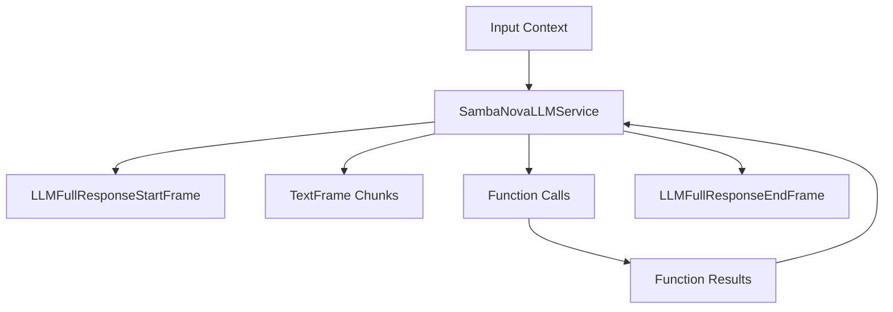

## Metrics Support

The service collects standard LLM metrics:

* **Time to First Byte (TTFB)** - Response latency measurement
* **Processing Duration** - Total request processing time
* **Token Usage** - Prompt tokens, completion tokens, and totals

<Info>
  [Learn how to enable Metrics](/guides/fundamentals/metrics) in your Pipeline.
</Info>

## Notes

* OpenAI-compatible interface.
* Supports streaming responses.
* Handles function calling.
* Manages conversation context.
* Includes token usage tracking.
* Thread-safe processing.
* Automatic error handling.


# Together AI
Source: https://docs.pipecat.ai/server/services/llm/together

LLM service implementation using Together AI’s API with OpenAI-compatible interface

## Overview

`TogetherLLMService` provides access to Together AI's language models, including Meta's Llama 3.1 and 3.2 models, through an OpenAI-compatible interface. It inherits from `OpenAILLMService` and supports streaming responses, function calling, and context management.

<CardGroup cols={3}>
  <Card title="API Reference" icon="code" href="https://reference-server.pipecat.ai/en/latest/api/pipecat.services.together.llm.html">
    Complete API documentation and method details
  </Card>

  <Card title="Together AI Docs" icon="book" href="https://docs.together.ai/reference/chat-completions-1">
    Official Together AI API documentation and features
  </Card>

  <Card title="Example Code" icon="play" href="https://github.com/pipecat-ai/pipecat/blob/main/examples/foundational/14c-function-calling-together.py">
    Working example with function calling
  </Card>
</CardGroup>

## Installation

To use `TogetherLLMService`, install the required dependencies:

```bash
pip install "pipecat-ai[together]"
```

You'll also need to set up your Together AI API key as an environment variable: `TOGETHER_API_KEY`.

<Tip>
  Get your API key from [Together AI Console](https://api.together.xyz/).
</Tip>

## Frames

### Input

* `OpenAILLMContextFrame` - Conversation context and history
* `LLMMessagesFrame` - Direct message list
* `VisionImageRawFrame` - Images for vision processing (select models)
* `LLMUpdateSettingsFrame` - Runtime parameter updates

### Output

* `LLMFullResponseStartFrame` / `LLMFullResponseEndFrame` - Response boundaries
* `LLMTextFrame` - Streamed completion chunks
* `FunctionCallInProgressFrame` / `FunctionCallResultFrame` - Function call lifecycle
* `ErrorFrame` - API or processing errors

## Function Calling

<Card title="Function Calling Guide" icon="function" href="/learn/function-calling">
  Learn how to implement function calling with standardized schemas, register
  handlers, manage context properly, and control execution flow in your
  conversational AI applications.
</Card>

## Context Management

<Card title="Context Management Guide" icon="messages" href="/learn/context-management">
  Learn how to manage conversation context, handle message history, and
  integrate context aggregators for consistent conversational experiences.
</Card>

## Usage Example

```python
import os
from pipecat.services.together.llm import TogetherLLMService
from pipecat.processors.aggregators.openai_llm_context import OpenAILLMContext
from pipecat.adapters.schemas.function_schema import FunctionSchema
from pipecat.adapters.schemas.tools_schema import ToolsSchema

# Configure Together AI service
llm = TogetherLLMService(
    api_key=os.getenv("TOGETHER_API_KEY"),
    model="meta-llama/Meta-Llama-3.1-70B-Instruct-Turbo",  # Balanced performance
    params=TogetherLLMService.InputParams(
        temperature=0.7,
        max_tokens=1000
    )
)

# Define function for tool calling
weather_function = FunctionSchema(
    name="get_current_weather",
    description="Get current weather information",
    properties={
        "location": {
            "type": "string",
            "description": "City and state, e.g. San Francisco, CA"
        },
        "format": {
            "type": "string",
            "enum": ["celsius", "fahrenheit"],
            "description": "Temperature unit to use"
        }
    },
    required=["location", "format"]
)

tools = ToolsSchema(standard_tools=[weather_function])

# Create context optimized for voice
context = OpenAILLMContext(
    messages=[
        {
            "role": "system",
            "content": """You are a helpful assistant in a voice conversation.
            Keep responses concise and avoid special characters for better speech synthesis."""
        }
    ],
    tools=tools
)

# Create context aggregators
context_aggregator = llm.create_context_aggregator(context)

# Register function handler with feedback
async def fetch_weather(params):
    location = params.arguments["location"]
    await params.result_callback({"conditions": "sunny", "temperature": "75°F"})

llm.register_function("get_current_weather", fetch_weather)

# Optional: Add function call feedback
@llm.event_handler("on_function_calls_started")
async def on_function_calls_started(service, function_calls):
    await tts.queue_frame(TTSSpeakFrame("Let me check on that."))

# Use in pipeline
pipeline = Pipeline([
    transport.input(),
    stt,
    context_aggregator.user(),
    llm,
    tts,
    transport.output(),
    context_aggregator.assistant()
])
```

## Metrics

Inherits all OpenAI metrics capabilities:

* **Time to First Byte (TTFB)** - Response latency measurement
* **Processing Duration** - Total request processing time
* **Token Usage** - Prompt tokens, completion tokens, and totals

<Info>
  [Learn how to enable Metrics](/guides/fundamentals/metrics) in your Pipeline.
</Info>

## Additional Notes

* **OpenAI Compatibility**: Full compatibility with OpenAI API features and parameters
* **Open Source Models**: Access to cutting-edge open-source models like Llama
* **Vision Support**: Select models support multimodal image and text understanding
* **Competitive Pricing**: Cost-effective alternative to proprietary model APIs
* **Flexible Scaling**: Choose model size based on performance vs cost requirements


# Mem0
Source: https://docs.pipecat.ai/server/services/memory/mem0

Long-term conversation memory service powered by Mem0

## Overview

`Mem0MemoryService` provides long-term memory capabilities for conversational agents by integrating with Mem0's API. It automatically stores conversation history and retrieves relevant past context based on the current conversation, enhancing LLM responses with persistent memory across sessions.

## Installation

To use the Mem0 memory service, install the required dependencies:

```bash
pip install "pipecat-ai[mem0]"
```

You'll also need to set up your Mem0 API key as an environment variable: `MEM0_API_KEY`.

<Tip>
  You can obtain a Mem0 API key by signing up at [mem0.ai](https://mem0.ai).
</Tip>

## Mem0MemoryService

### Constructor Parameters

<ParamField path="api_key" type="str" required>
  Mem0 API key for accessing the service
</ParamField>

<ParamField path="host" type="str" required>
  Mem0 host for accessing the service
</ParamField>

<ParamField path="user_id" type="str" optional>
  Unique identifier for the end user to associate with memories
</ParamField>

<ParamField path="agent_id" type="str" optional>
  Identifier for the agent using the memory service
</ParamField>

<ParamField path="run_id" type="str" optional>
  Identifier for the specific conversation session
</ParamField>

<ParamField path="params" type="InputParams" optional>
  Configuration parameters for memory retrieval (see below)
</ParamField>

<ParamField path="local_config" type="dict" optional>
  Configuration for using local LLMs and embedders instead of Mem0's cloud API (see Local Configuration section)
</ParamField>

<Tip>
  At least one of `user_id`, `agent_id`, or `run_id` must be provided to
  organize memories.
</Tip>

### Input Parameters

The `params` object accepts the following configuration settings:

<ParamField path="search_limit" type="int" default="10">
  Maximum number of relevant memories to retrieve per query
</ParamField>

<ParamField path="search_threshold" type="float" default="0.1">
  Relevance threshold for memory retrieval (0.0 to 1.0)
</ParamField>

<ParamField path="api_version" type="str" default="v2">
  Mem0 API version to use
</ParamField>

<ParamField path="system_prompt" type="str" default="Based on previous conversations, I recall: \n\n">
  Prefix text to add before retrieved memories
</ParamField>

<ParamField path="add_as_system_message" type="bool" default="True">
  Whether to add memories as a system message (True) or user message (False)
</ParamField>

<ParamField path="position" type="int" default="1">
  Position in the context where memories should be inserted
</ParamField>

## Input Frames

The service processes the following input frames:

<ParamField path="OpenAILLMContextFrame" type="Frame">
  Contains OpenAI-specific conversation context
</ParamField>

<ParamField path="LLMMessagesFrame" type="Frame">
  Contains conversation messages in standard format
</ParamField>

## Output Frames

The service may produce the following output frames:

<ParamField path="LLMMessagesFrame" type="Frame">
  Enhanced messages with relevant memories included
</ParamField>

<ParamField path="OpenAILLMContextFrame" type="Frame">
  Enhanced OpenAI context with memories included
</ParamField>

<ParamField path="ErrorFrame" type="Frame">
  Contains error information if memory operations fail
</ParamField>

## Memory Operations

The service performs two main operations automatically:

### Message Storage

All conversation messages are stored in Mem0 for future reference. The service:

* Captures full message history from context frames
* Associates messages with the specified user/agent/run IDs
* Stores metadata to enable efficient retrieval

### Memory Retrieval

When a new user message is detected, the service:

1. Uses the message as a search query
2. Retrieves relevant past memories from Mem0
3. Formats memories with the configured system prompt
4. Adds the formatted memories to the conversation context
5. Passes the enhanced context downstream in the pipeline

## Pipeline Positioning

The memory service should be positioned **after** the user context aggregator but **before** the LLM service:

```
context_aggregator.user() → memory_service → llm
```

This ensures that:

1. The user's latest message is included in the context
2. The memory service can enhance the context before the LLM processes it
3. The LLM receives the enhanced context with relevant memories

## Usage Examples

### Basic Integration

```python
from pipecat.services.mem0.memory import Mem0MemoryService
from pipecat.pipeline.pipeline import Pipeline

# Create the memory service
memory = Mem0MemoryService(
    api_key=os.getenv("MEM0_API_KEY"),
    user_id="user123",  # Unique user identifier
)

# Position the memory service between context aggregator and LLM
pipeline = Pipeline([
    transport.input(),
    context_aggregator.user(),
    memory,           # <-- Memory service enhances context here
    llm,
    tts,
    transport.output(),
    context_aggregator.assistant()
])
```

### Using Local Configuration

The `local_config` parameter allows you to use your own LLM and embedding providers instead of Mem0's cloud API. This is useful for self-hosted deployments or when you want more control over the memory processing.

```python
local_config = {
    "llm": {
        "provider": str,  # LLM provider name (e.g., "anthropic", "openai")
        "config": {
            # Provider-specific configuration
            "model": str,  # Model name
            "api_key": str,  # API key for the provider
            # Other provider-specific parameters
        }
    },
    "embedder": {
        "provider": str,  # Embedding provider name (e.g., "openai")
        "config": {
            # Provider-specific configuration
            "model": str,  # Model name
            # Other provider-specific parameters
        }
    }
}

# Initialize Mem0 memory service with local configuration
memory = Mem0MemoryService(
    local_config=local_config,  # Use local LLM for memory processing
    user_id="user123",          # Unique identifier for the user
)
```

<Warning>
  When using `local_config` do not provide the `api_key` parameter.
</Warning>

## Frame Flow

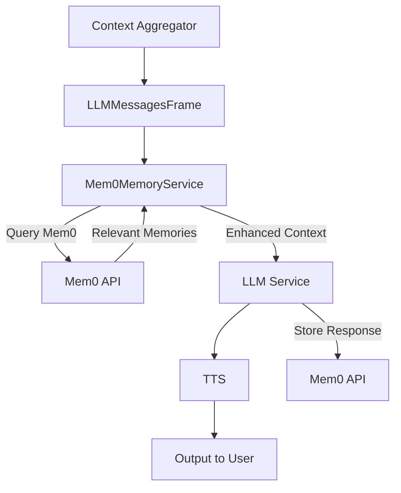

## Error Handling

The service includes basic error handling to ensure conversation flow continues even when memory operations fail:

* Exceptions during memory storage and retrieval are caught and logged
* If an error occurs during frame processing, an `ErrorFrame` is emitted with error details
* The original frame is still passed downstream to prevent the pipeline from stalling
* Connection and authentication errors from the Mem0 API will be logged but won't interrupt the conversation

<Warning>
  While the service attempts to handle errors gracefully, memory operations that
  fail may result in missing context in conversations. Monitor your application
  logs for memory-related errors.
</Warning>


# AWS Nova Sonic
Source: https://docs.pipecat.ai/server/services/s2s/aws

Real-time speech-to-speech service implementation using AWS Nova Sonic

The `AWSNovaSonicLLMService` enables natural, real-time conversations with AWS Nova Sonic. It provides built-in audio transcription, voice activity detection, and context management for creating interactive AI experiences. It provides:

<CardGroup cols={2}>
  <Card title="Real-time Interaction" icon="bolt">
    Stream audio in real-time with low latency response times
  </Card>

  {" "}

  <Card title="Speech Processing" icon="waveform-lines">
    Built-in speech-to-text and text-to-speech capabilities with multiple voice
    options
  </Card>

  {" "}

  <Card title="Voice Activity Detection" icon="microphone">
    Automatic detection of speech start/stop for natural conversations
  </Card>

  <Card title="Context Management" icon="brain">
    Intelligent handling of conversation history and system instructions
  </Card>
</CardGroup>

## Installation

To use `AWSNovaSonicLLMService`, install the required dependencies:

```bash
pip install "pipecat-ai[aws-nova-sonic]"
```

We recommend setting up your AWS credentials as environment variables, as you'll need them to initialize `AWSNovaSonicLLMService`:

* `AWS_SECRET_ACCESS_KEY`
* `AWS_ACCESS_KEY_ID`
* `AWS_REGION`

## Basic Usage

Here’s a simple example of setting up a conversational AI bot with AWS Nova Sonic:

```python
from pipecat.services.aws_nova_sonic.aws import AWSNovaSonicLLMService

llm = AWSNovaSonicLLMService(
    secret_access_key=os.getenv("AWS_SECRET_ACCESS_KEY"),
    access_key_id=os.getenv("AWS_ACCESS_KEY_ID"),
    region=os.getenv("AWS_REGION")
    voice_id="tiffany",                    # Voices: matthew, tiffany, amy
)
```

## Configuration

### Constructor Parameters

<ParamField path="secret_access_key" type="str" required>
  Your AWS secret access key
</ParamField>

<ParamField path="access_key_id" type="str" required>
  Your AWS access key ID
</ParamField>

<ParamField path="region" type="str" required>
  Specify the AWS region for the service (e.g., `"us-east-1"`). Note that the
  service may not be available in all AWS regions: check the [AWS Bedrock User
  Guide's support
  table](https://docs.aws.amazon.com/bedrock/latest/userguide/models-supported.html).
</ParamField>

<ParamField path="model" type="str" default="amazon.nova-sonic-v1:0">
  AWS Nova Sonic model to use. Note that `"amazon.nova-sonic-v1:0"` is the only
  supported model as of 2025-05-08.
</ParamField>

<ParamField path="voice_id" type="str" default="matthew">
  Voice for text-to-speech (options: `"matthew"`, `"tiffany"`, `"amy"`)
</ParamField>

<ParamField path="params" type="Params" optional>
  Configuration for model parameters
</ParamField>

<ParamField path="system_instruction" type="str" optional>
  High-level instructions that guide the model's behavior. Note that more
  commonly these instructions will be included as part of the context provided
  to kick off the conversation.
</ParamField>

<ParamField path="tools" type="ToolsSchema" optional>
  List of function definitions for tool/function calling. Note that more
  commonly tools will be included as part of the context provided to kick off
  the conversation.
</ParamField>

<ParamField path="send_transcription_frames" type="bool" default="True">
  Whether to emit transcription frames
</ParamField>

### Model Parameters

The `Params` object configures the behavior of the AWS Nova Sonic model.

<Warning>
  It is strongly recommended to stick with default values (most easily by
  omitting `params` when constructing `AWSNovaSonicLLMService`) unless you have
  a good understanding of the parameters and their impact. Deviating from the
  defaults may lead to unexpected behavior.
</Warning>

<ParamField path="temperature" type="float" optional default="0.7">
  Controls randomness in responses. Range: 0.0 to 2.0
</ParamField>

<ParamField path="max_tokens" type="int" optional default="1024">
  Maximum number of tokens to generate
</ParamField>

<ParamField path="top_p" type="float" optional default="0.9">
  Cumulative probability cutoff for token selection. Range: 0.0 to 1.0
</ParamField>

<ParamField path="input_sample_rate" type="int" optional default="16000">
  Sample rate for input audio
</ParamField>

<ParamField path="output_sample_rate" type="int" optional default="24000">
  Sample rate for output audio
</ParamField>

<ParamField path="input_sample_size" type="int" optional default="16">
  Bit depth for input audio
</ParamField>

<ParamField path="input_channel_count" type="int" optional default="1">
  Number of channels for input audio
</ParamField>

<ParamField path="output_sample_size" type="int" optional default="16">
  Bit depth for output audio
</ParamField>

<ParamField path="output_channel_count" type="int" optional default="1">
  Number of channels for output audio
</ParamField>

## Frame Types

### Input Frames

<ParamField path="InputAudioRawFrame" type="Frame">
  Raw audio data for speech input
</ParamField>

<ParamField path="OpenAILLMContextFrame" type="Frame">
  Contains conversation context
</ParamField>

<ParamField path="BotStoppedSpeakingFrame" type="Frame">
  Signals the bot has stopped speaking
</ParamField>

### Output Frames

<ParamField path="TTSAudioRawFrame" type="Frame">
  Generated speech audio
</ParamField>

<ParamField path="LLMFullResponseStartFrame" type="Frame">
  Signals the start of a response from the LLM
</ParamField>

<ParamField path="LLMFullResponseEndFrame" type="Frame">
  Signals the end of a response from the LLM
</ParamField>

<ParamField path="TTSStartedFrame" type="Frame">
  Signals start of speech synthesis (coincides with the start of the LLM
  response, as this is a speech-to-speech model)
</ParamField>

<ParamField path="TTSStoppedFrame" type="Frame">
  Signals end of speech synthesis (coincides with the end of the LLM response,
  as this is a speech-to-speech model)
</ParamField>

<ParamField path="LLMTextFrame" type="Frame">
  Generated text responses from the LLM
</ParamField>

<ParamField path="TTSTextFrame" type="Frame">
  Generated text responses
</ParamField>

<ParamField path="TranscriptionFrame" type="Frame">
  Speech transcriptions. Only output if `send_transcription_frames` is `True`.
</ParamField>

## Function Calling

This service supports function calling (also known as tool calling) which allows the LLM to request information from external services and APIs. For example, you can enable your bot to:

* Check current weather conditions
* Query databases
* Access external APIs
* Perform custom actions

See the [Function Calling guide](/learn/function-calling) for:

* Detailed implementation instructions
* Provider-specific function definitions
* Handler registration examples
* Control over function call behavior
* Complete usage examples

## Next Steps

### Examples

* [Foundational Example](https://github.com/pipecat-ai/pipecat/blob/main/examples/foundational/40-aws-nova-sonic.py)
  Basic implementation showing core features

* [Persistent Content Example](https://github.com/pipecat-ai/pipecat/blob/main/examples/foundational/20e-persistent-context-aws-nova-sonic.py)
  Implementation showing saving and loading conversation history


# Gemini Multimodal Live
Source: https://docs.pipecat.ai/server/services/s2s/gemini

A real-time, multimodal conversational AI service powered by Google’s Gemini

The `GeminiMultimodalLiveLLMService` enables natural, real-time conversations with Google’s Gemini model. It provides built-in audio transcription, voice activity detection, and context management for creating interactive AI experiences. It provides:

<CardGroup cols={2}>
  <Card title="Real-time Interaction" icon="video">
    Stream audio and video in real-time with low latency response times
  </Card>

  <Card title="Speech Processing" icon="waveform-lines">
    Built-in speech-to-text and text-to-speech capabilities with multiple voice
    options
  </Card>

  <Card title="Voice Activity Detection" icon="microphone">
    Automatic detection of speech start/stop for natural conversations
  </Card>

  <Card title="Context Management" icon="brain">
    Intelligent handling of conversation history and system instructions
  </Card>
</CardGroup>

<Tip>
  Want to start building? Check out our [Gemini Multimodal Live
  Guide](/guides/features/gemini-multimodal-live).
</Tip>

## Installation

To use `GeminiMultimodalLiveLLMService`, install the required dependencies:

```bash
pip install "pipecat-ai[google]"
```

You’ll need to set up your Google API key as an environment variable: `GOOGLE_API_KEY`.

## Basic Usage

Here’s a simple example of setting up a conversational AI bot with Gemini Multimodal Live:

```python
from pipecat.services.gemini_multimodal_live.gemini import (
    GeminiMultimodalLiveLLMService,
    InputParams,
    GeminiMultimodalModalities
)

llm = GeminiMultimodalLiveLLMService(
    api_key=os.getenv("GOOGLE_API_KEY"),
    voice_id="Aoede",                                # Voices: Aoede, Charon, Fenrir, Kore, Puck
    params=InputParams(
        temperature=0.7,                             # Set model input params
        language=Language.EN_US,                     # Set language (30+ languages supported)
        modalities=GeminiMultimodalModalities.AUDIO  # Response modality
    )
)
```

## Configuration

### Constructor Parameters

<ParamField path="api_key" type="str" required>
  Your Google API key
</ParamField>

<ParamField path="base_url" type="str" default="generativelanguage.googleapis.com/ws/google.ai.generativelanguage.v1beta.GenerativeService.BidiGenerateContent">
  API endpoint URL
</ParamField>

<ParamField path="model" type="str" default="models/gemini-2.5-flash-preview-native-audio-dialog">
  Gemini model to use (upgraded to new v1beta model)
</ParamField>

<ParamField path="voice_id" type="str" default="Charon">
  Voice for text-to-speech (options: Aoede, Charon, Fenrir, Kore, Puck)
</ParamField>

```python
llm = GeminiMultimodalLiveLLMService(
    api_key=os.getenv("GOOGLE_API_KEY"),
    voice_id="Puck",  # Choose your preferred voice
)
```

<ParamField path="system_instruction" type="str" optional>
  High-level instructions that guide the model's behavior
</ParamField>

```python
llm = GeminiMultimodalLiveLLMService(
    api_key=os.getenv("GOOGLE_API_KEY"),
    system_instruction="Talk like a pirate.",
)
```

<ParamField path="start_audio_paused" type="bool" default="False">
  Whether to start with audio input paused
</ParamField>

<ParamField path="start_video_paused" type="bool" default="False">
  Whether to start with video input paused
</ParamField>

<ParamField path="tools" type="Union[List[dict], ToolsSchema]" optional>
  Tools/functions available to the model
</ParamField>

<ParamField path="inference_on_context_initialization" type="bool" default="True">
  Whether to generate a response when context is first set
</ParamField>

### Input Parameters

<ParamField path="frequency_penalty" type="float" optional default="None">
  Penalizes repeated tokens. Range: 0.0 to 2.0
</ParamField>

<ParamField path="max_tokens" type="int" optional default="4096">
  Maximum number of tokens to generate
</ParamField>

<ParamField path="modalities" type="GeminiMultimodalModalities" optional default="AUDIO">
  Response modalities to include (options: `AUDIO`, `TEXT`).
</ParamField>

<ParamField path="presence_penalty" type="float" optional default="None">
  Penalizes tokens based on their presence in the text. Range: 0.0 to 2.0
</ParamField>

<ParamField path="temperature" type="float" optional default="None">
  Controls randomness in responses. Range: 0.0 to 2.0
</ParamField>

<ParamField path="language" type="Language" optional default="Language.EN_US">
  Language for generation. Over 30 languages are supported.
</ParamField>

<ParamField path="media_resolution" type="GeminiMediaResolution" optional default="UNSPECIFIED">
  Controls image processing quality and token usage:

  * `LOW`: Uses 64 tokens
  * `MEDIUM`: Uses 256 tokens
  * `HIGH`: Zoomed reframing with 256 tokens
</ParamField>

<ParamField path="vad" type="GeminiVADParams" optional>
  Voice Activity Detection configuration:

  * `disabled`: Toggle VAD on/off
  * `start_sensitivity`: How quickly speech is detected (HIGH/LOW)
  * `end_sensitivity`: How quickly turns end after pauses (HIGH/LOW)
  * `prefix_padding_ms`: Milliseconds of audio to keep before speech
  * `silence_duration_ms`: Milliseconds of silence to end a turn
</ParamField>

```python
from pipecat.services.gemini_multimodal_live.events import (
    StartSensitivity,
    EndSensitivity
)
from pipecat.services.gemini_multimodal_live.gemini import (
    GeminiVADParams,
    GeminiMediaResolution,
)

llm = GeminiMultimodalLiveLLMService(
    api_key=os.getenv("GOOGLE_API_KEY"),
    params=InputParams(
        temperature=0.7,
        language=Language.ES,                         # Spanish language
        media_resolution=GeminiMediaResolution.HIGH,  # Higher quality image processing
        vad=GeminiVADParams(
            start_sensitivity=StartSensitivity.HIGH,  # Detect speech quickly
            end_sensitivity=EndSensitivity.LOW,       # Allow longer pauses
            prefix_padding_ms=300,                    # Keep 300ms before speech
            silence_duration_ms=1000,                 # End turn after 1s silence
        )
    )
)
```

<ParamField path="top_k" type="int" optional default="None">
  Limits vocabulary to k most likely tokens. Minimum: 0
</ParamField>

<ParamField path="top_p" type="float" optional default="None">
  Cumulative probability cutoff for token selection. Range: 0.0 to 1.0
</ParamField>

<ParamField path="context_window_compression" type="ContextWindowCompressionParams" optional>
  Parameters for managing the context window: - `enabled`: Enable/disable
  compression (default: False) - `trigger_tokens`: Number of tokens that trigger
  compression (default: None, uses 80% of context window)
</ParamField>

```python
from pipecat.services.gemini_multimodal_live.gemini import (
    ContextWindowCompressionParams
)

llm = GeminiMultimodalLiveLLMService(
    api_key=os.getenv("GOOGLE_API_KEY"),
    params=InputParams(
        top_p=0.9,               # More focused token selection
        top_k=40,                # Limit vocabulary options
        context_window_compression=ContextWindowCompressionParams(
            enabled=True,
            trigger_tokens=8000  # Compress when reaching 8000 tokens
        )
    )
)
```

## Methods

<ParamField path="set_audio_input_paused(paused: bool)" type="method">
  Pause or unpause audio input processing
</ParamField>

<ParamField path="set_video_input_paused(paused: bool)" type="method">
  Pause or unpause video input processing
</ParamField>

<ParamField path="set_model_modalities(modalities: GeminiMultimodalModalities)" type="method">
  Change the response modality (TEXT or AUDIO)
</ParamField>

<ParamField path="set_language(language: Language)" type="method">
  Change the language for generation
</ParamField>

<ParamField path="set_context(context: OpenAILLMContext)" type="method">
  Set the conversation context explicitly
</ParamField>

<ParamField path="create_context_aggregator(context: OpenAILLMContext, user_params: LLMUserAggregatorParams, assistant_params: LLMAssistantAggregatorParams)" type="method">
  Create context aggregators for managing conversation state
</ParamField>

## Frame Types

### Input Frames

<ParamField path="InputAudioRawFrame" type="Frame">
  Raw audio data for speech input
</ParamField>

<ParamField path="InputImageRawFrame" type="Frame">
  Raw image data for visual input
</ParamField>

<ParamField path="StartInterruptionFrame" type="Frame">
  Signals start of user interruption
</ParamField>

<ParamField path="UserStartedSpeakingFrame" type="Frame">
  Signals user started speaking
</ParamField>

<ParamField path="UserStoppedSpeakingFrame" type="Frame">
  Signals user stopped speaking
</ParamField>

<ParamField path="OpenAILLMContextFrame" type="Frame">
  Contains conversation context
</ParamField>

<ParamField path="LLMMessagesAppendFrame" type="Frame">
  Adds messages to the conversation
</ParamField>

<ParamField path="LLMUpdateSettingsFrame" type="Frame">
  Updates LLM settings
</ParamField>

<ParamField path="LLMSetToolsFrame" type="Frame">
  Sets available tools for the LLM
</ParamField>

### Output Frames

<ParamField path="TTSAudioRawFrame" type="Frame">
  Generated speech audio
</ParamField>

<ParamField path="TTSStartedFrame" type="Frame">
  Signals start of speech synthesis
</ParamField>

<ParamField path="TTSStoppedFrame" type="Frame">
  Signals end of speech synthesis
</ParamField>

<ParamField path="LLMTextFrame" type="Frame">
  Generated text responses from the LLM
</ParamField>

<ParamField path="TTSTextFrame" type="Frame">
  Text used for speech synthesis
</ParamField>

<ParamField path="TranscriptionFrame" type="Frame">
  Speech transcriptions from user audio
</ParamField>

<ParamField path="LLMFullResponseStartFrame" type="Frame">
  Signals the start of a complete LLM response
</ParamField>

<ParamField path="LLMFullResponseEndFrame" type="Frame">
  Signals the end of a complete LLM response
</ParamField>

## Function Calling

This service supports function calling (also known as tool calling) which allows the LLM to request information from external services and APIs. For example, you can enable your bot to:

* Check current weather conditions
* Query databases
* Access external APIs
* Perform custom actions

See the [Function Calling guide](/learn/function-calling) for:

* Detailed implementation instructions
* Provider-specific function definitions
* Handler registration examples
* Control over function call behavior
* Complete usage examples

## Token Usage Tracking

Gemini Multimodal Live automatically tracks token usage metrics, providing:

* Prompt token counts
* Completion token counts
* Total token counts
* Detailed token breakdowns by modality (text, audio)

These metrics can be used for monitoring usage, optimizing costs, and understanding model performance.

## Language Support

Gemini Multimodal Live supports the following languages:

| Language Code     | Description          | Gemini Code |
| ----------------- | -------------------- | ----------- |
| `Language.AR`     | Arabic               | `ar-XA`     |
| `Language.BN_IN`  | Bengali (India)      | `bn-IN`     |
| `Language.CMN_CN` | Chinese (Mandarin)   | `cmn-CN`    |
| `Language.DE_DE`  | German (Germany)     | `de-DE`     |
| `Language.EN_US`  | English (US)         | `en-US`     |
| `Language.EN_AU`  | English (Australia)  | `en-AU`     |
| `Language.EN_GB`  | English (UK)         | `en-GB`     |
| `Language.EN_IN`  | English (India)      | `en-IN`     |
| `Language.ES_ES`  | Spanish (Spain)      | `es-ES`     |
| `Language.ES_US`  | Spanish (US)         | `es-US`     |
| `Language.FR_FR`  | French (France)      | `fr-FR`     |
| `Language.FR_CA`  | French (Canada)      | `fr-CA`     |
| `Language.GU_IN`  | Gujarati (India)     | `gu-IN`     |
| `Language.HI_IN`  | Hindi (India)        | `hi-IN`     |
| `Language.ID_ID`  | Indonesian           | `id-ID`     |
| `Language.IT_IT`  | Italian (Italy)      | `it-IT`     |
| `Language.JA_JP`  | Japanese (Japan)     | `ja-JP`     |
| `Language.KN_IN`  | Kannada (India)      | `kn-IN`     |
| `Language.KO_KR`  | Korean (Korea)       | `ko-KR`     |
| `Language.ML_IN`  | Malayalam (India)    | `ml-IN`     |
| `Language.MR_IN`  | Marathi (India)      | `mr-IN`     |
| `Language.NL_NL`  | Dutch (Netherlands)  | `nl-NL`     |
| `Language.PL_PL`  | Polish (Poland)      | `pl-PL`     |
| `Language.PT_BR`  | Portuguese (Brazil)  | `pt-BR`     |
| `Language.RU_RU`  | Russian (Russia)     | `ru-RU`     |
| `Language.TA_IN`  | Tamil (India)        | `ta-IN`     |
| `Language.TE_IN`  | Telugu (India)       | `te-IN`     |
| `Language.TH_TH`  | Thai (Thailand)      | `th-TH`     |
| `Language.TR_TR`  | Turkish (Turkey)     | `tr-TR`     |
| `Language.VI_VN`  | Vietnamese (Vietnam) | `vi-VN`     |

You can set the language using the `language` parameter:

```python
from pipecat.transcriptions.language import Language
from pipecat.services.gemini_multimodal_live.gemini import (
    GeminiMultimodalLiveLLMService,
    InputParams
)

# Set language during initialization
llm = GeminiMultimodalLiveLLMService(
    api_key=os.getenv("GOOGLE_API_KEY"),
    params=InputParams(language=Language.ES_ES)  # Spanish (Spain)
)
```

## Next Steps

### Examples

* [Foundational Example](https://github.com/pipecat-ai/pipecat/blob/main/examples/foundational/26a-gemini-multimodal-live-transcription.py)
  Basic implementation showing core features and transcription

* [Simple Chatbot](https://github.com/pipecat-ai/pipecat-examples/tree/main/simple-chatbot)
  A client/server example showing how to build a Pipecat JS or React client that connects to a Gemini Live Pipecat bot.

### Learn More

Check out our [Gemini Multimodal Live Guide](/guides/features/gemini-multimodal-live) for detailed explanations and best practices.


# OpenAI Realtime Beta
Source: https://docs.pipecat.ai/server/services/s2s/openai

Real-time speech-to-speech service implementation using OpenAI’s Realtime Beta API

`OpenAIRealtimeBetaLLMService` provides real-time, multimodal conversation capabilities using OpenAI's Realtime Beta API. It supports speech-to-speech interactions with integrated LLM processing, function calling, and advanced conversation management.

<CardGroup cols={2}>
  <Card title="Real-time Interaction" icon="bolt">
    Stream audio in real-time with minimal latency response times
  </Card>

  <Card title="Speech Processing" icon="waveform-lines">
    Built-in speech-to-text and text-to-speech capabilities with voice options
  </Card>

  <Card title="Advanced Turn Detection" icon="microphone">
    Multiple voice activity detection options including semantic turn detection
  </Card>

  <Card title="Powerful Function Calling" icon="code">
    Seamless support for calling external functions and APIs
  </Card>
</CardGroup>

## Installation

To use `OpenAIRealtimeBetaLLMService`, install the required dependencies:

```bash
pip install "pipecat-ai[openai]"
```

You'll also need to set up your OpenAI API key as an environment variable: `OPENAI_API_KEY`.

## Configuration

### Constructor Parameters

<ParamField path="api_key" type="str" required>
  Your OpenAI API key
</ParamField>

<ParamField path="model" type="str" default="gpt-4o-realtime-preview-2025-06-03">
  The speech-to-speech model used for processing
</ParamField>

<ParamField path="base_url" type="str" default="wss://api.openai.com/v1/realtime">
  WebSocket endpoint URL
</ParamField>

<ParamField path="session_properties" type="SessionProperties">
  Configuration for the realtime session
</ParamField>

<ParamField path="start_audio_paused" type="bool" default="False">
  Whether to start with audio input paused
</ParamField>

<ParamField path="send_transcription_frames" type="bool" default="True">
  Whether to emit transcription frames
</ParamField>

### Session Properties

The `SessionProperties` object configures the behavior of the realtime session:

<ParamField path="modalities" type="List[Literal['text', 'audio']]" optional>
  The modalities to enable (default includes both text and audio)
</ParamField>

<ParamField path="instructions" type="str" optional>
  System instructions that guide the model's behavior
</ParamField>

```python
service = OpenAIRealtimeBetaLLMService(
    api_key=os.getenv("OPENAI_API_KEY"),
    session_properties=SessionProperties(
        instructions="You are a helpful assistant. Be concise and friendly."
    )
)
```

<ParamField path="voice" type="str" optional>
  Voice ID for text-to-speech (options: alloy, echo, fable, onyx, nova, shimmer)
</ParamField>

<ParamField path="input_audio_format" type="Literal['pcm16', 'g711_ulaw', 'g711_alaw']" optional>
  Format of the input audio
</ParamField>

<ParamField path="output_audio_format" type="Literal['pcm16', 'g711_ulaw', 'g711_alaw']" optional>
  Format of the output audio
</ParamField>

<ParamField path="input_audio_transcription" type="InputAudioTranscription" optional>
  Configuration for audio transcription
</ParamField>

```python
from pipecat.services.openai_realtime_beta.events import InputAudioTranscription

service = OpenAIRealtimeBetaLLMService(
    api_key=os.getenv("OPENAI_API_KEY"),
    session_properties=SessionProperties(
        input_audio_transcription=InputAudioTranscription(
            model="gpt-4o-transcribe",
            language="en",
            prompt="This is a technical conversation about programming"
        )
    )
)
```

<ParamField path="input_audio_noise_reduction" type="InputAudioNoiseReduction" optional>
  Configuration for audio noise reduction
</ParamField>

<ParamField path="turn_detection" type="Union[TurnDetection, SemanticTurnDetection, bool]" optional>
  Configuration for turn detection (set to False to disable)
</ParamField>

<ParamField path="tools" type="List[Dict]" optional>
  List of function definitions for tool/function calling
</ParamField>

<ParamField path="tool_choice" type="Literal['auto', 'none', 'required']" optional>
  Controls when the model calls functions
</ParamField>

<ParamField path="temperature" type="float" optional>
  Controls randomness in responses (0.0 to 2.0)
</ParamField>

<ParamField path="max_response_output_tokens" type="Union[int, Literal['inf']]" optional>
  Maximum number of tokens to generate
</ParamField>

## Input Frames

### Audio Input

<ParamField path="InputAudioRawFrame" type="Frame">
  Raw audio data for speech input
</ParamField>

### Control Input

<ParamField path="StartInterruptionFrame" type="Frame">
  Signals start of user interruption
</ParamField>

<ParamField path="UserStartedSpeakingFrame" type="Frame">
  Signals user started speaking
</ParamField>

<ParamField path="UserStoppedSpeakingFrame" type="Frame">
  Signals user stopped speaking
</ParamField>

### Context Input

<ParamField path="OpenAILLMContextFrame" type="Frame">
  Contains conversation context
</ParamField>

<ParamField path="LLMMessagesAppendFrame" type="Frame">
  Appends messages to conversation
</ParamField>

## Output Frames

### Audio Output

<ParamField path="TTSAudioRawFrame" type="Frame">
  Generated speech audio
</ParamField>

### Control Output

<ParamField path="TTSStartedFrame" type="Frame">
  Signals start of speech synthesis
</ParamField>

<ParamField path="TTSStoppedFrame" type="Frame">
  Signals end of speech synthesis
</ParamField>

### Text Output

<ParamField path="TextFrame" type="Frame">
  Generated text responses
</ParamField>

<ParamField path="TranscriptionFrame" type="Frame">
  Speech transcriptions
</ParamField>

## Events

<ParamField path="on_conversation_item_created" type="event">
  Emitted when a conversation item on the server is created. Handler receives:

  * `item_id: str`
  * `item: ConversationItem`
</ParamField>

<ParamField path="on_conversation_item_updated" type="event">
  Emitted when a conversation item on the server is updated. Handler receives:

  * `item_id: str`
  * `item: Optional[ConversationItem]` (may not exist for some updates)
</ParamField>

## Methods

<ResponseField name="retrieve_conversation_item" type="method">
  Retrieves a conversation item's details from the server.

  ```python
  async def retrieve_conversation_item(self, item_id: str) -> ConversationItem
  ```
</ResponseField>

## Usage Example

```python
from pipecat.services.openai_realtime_beta import OpenAIRealtimeBetaLLMService
from pipecat.services.openai_realtime_beta.events import SessionProperties, TurnDetection

# Configure service
service = OpenAIRealtimeBetaLLMService(
    api_key="your-api-key",
    session_properties=SessionProperties(
        modalities=["audio", "text"],
        voice="alloy",
        turn_detection=TurnDetection(
            threshold=0.5,
            silence_duration_ms=800
        ),
        temperature=0.7
    )
)

# Use in pipeline
pipeline = Pipeline([
    audio_input,       # Produces InputAudioRawFrame
    service,           # Processes speech/generates responses
    audio_output       # Handles TTSAudioRawFrame
])
```

## Function Calling

The service supports function calling with automatic response handling:

```python
from pipecat.adapters.schemas.function_schema import FunctionSchema
from pipecat.adapters.schemas.tools_schema import ToolsSchema
from pipecat.services.openai_realtime_beta import SessionProperties

# Define weather function using standardized schema
weather_function = FunctionSchema(
    name="get_weather",
    description="Get weather information",
    properties={
        "location": {"type": "string"}
    },
    required=["location"]
)

# Create tools schema
tools = ToolsSchema(standard_tools=[weather_function])

# Configure service with tools
llm = OpenAIRealtimeBetaLLMService(
    api_key="your-api-key",
    session_properties=SessionProperties(
        tools=tools,
        tool_choice="auto"
    )
)

llm.register_function("get_weather", fetch_weather_from_api)
```

See the [Function Calling guide](/learn/function-calling) for:

* Detailed implementation instructions
* Provider-specific function definitions
* Handler registration examples
* Control over function call behavior
* Complete usage examples

## Frame Flow

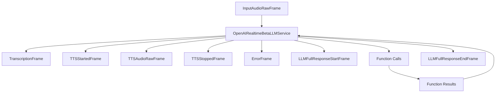

## Metrics Support

The service collects comprehensive metrics:

* Token usage (prompt and completion)
* Processing duration
* Time to First Byte (TTFB)
* Audio processing metrics
* Function call metrics

## Advanced Features

### Turn Detection

```python
# Server-side basic VAD
turn_detection = TurnDetection(
    type="server_vad",
    threshold=0.5,
    prefix_padding_ms=300,
    silence_duration_ms=800
)

# Server-side semantic VAD
turn_detection = SemanticTurnDetection(
  type="semantic_vad",
  eagerness="auto", # default. could also be "low" | "medium" | "high"
  create_response=True # default
  interrupt_response=True # default
)

# Disable turn detection
turn_detection = False
```

### Context Management

```python
# Create context
context = OpenAIRealtimeLLMContext(
    messages=[],
    tools=[],
    system="You are a helpful assistant"
)

# Create aggregators
aggregators = service.create_context_aggregator(context)
```

## Foundational Examples

<Card title="OpenAI Realtime Beta Example" icon="code" href="https://github.com/pipecat-ai/pipecat/blob/main/examples/foundational/19-openai-realtime-beta.py">
  Basic implementation showing core realtime features including audio streaming,
  turn detection, and function calling.
</Card>

## Notes

* Supports real-time speech-to-speech conversation
* Handles interruptions and turn-taking
* Manages WebSocket connection lifecycle
* Provides function calling capabilities
* Supports conversation context management
* Includes comprehensive error handling
* Manages audio streaming and processing
* Handles both text and audio modalities


# ExotelFrameSerializer
Source: https://docs.pipecat.ai/server/services/serializers/exotel

Serializer for Exotel WebSocket media streaming protocol

## Overview

`ExotelFrameSerializer` enables integration with Exotel's WebSocket media streaming protocol, allowing your Pipecat application to handle phone calls via Exotel's voice services.

## Features

* Bidirectional audio conversion between Pipecat and Exotel
* DTMF (touch-tone) event handling

## Installation

The `ExotelFrameSerializer` does not require any additional dependencies beyond the core Pipecat library.

## Configuration

### Constructor Parameters

<ParamField path="stream_id" type="str" required>
  The Stream ID for Exotel
</ParamField>

<ParamField path="call_sid" type="Optional[str]" default="None">
  The associated Exotel Call SID.
</ParamField>

<ParamField path="params" type="InputParams" default="InputParams()">
  Configuration parameters
</ParamField>

### InputParams Configuration

<ParamField path="exotel_sample_rate" type="int" default="8000">
  Sample rate used by Exotel (typically 8kHz)
</ParamField>

<ParamField path="sample_rate" type="int | None" default="None">
  Optional override for pipeline input sample rate
</ParamField>

## Basic Usage

```python
from pipecat.serializers.exotel import ExotelFrameSerializer
from pipecat.transports.network.fastapi_websocket import (
    FastAPIWebsocketTransport,
    FastAPIWebsocketParams
)

# Extract required values from Exotel WebSocket connection
stream_id = call_data["stream_id"]
call_sid = call_data["start"]["call_sid"]

# Create serializer
serializer = ExotelFrameSerializer(
    stream_id=stream_id,
    call_sid,
)

# Use with FastAPIWebsocketTransport
transport = FastAPIWebsocketTransport(
    websocket=websocket,
    params=FastAPIWebsocketParams(
        audio_in_enabled=True,
        audio_out_enabled=True,
        vad_analyzer=SileroVADAnalyzer(),
        serializer=serializer,
    )
)
```

## Server Code Example

Here's a complete example of handling a Exotel WebSocket connection:

```python
from fastapi import FastAPI, WebSocket
from pipecat.serializers.exotel import ExotelFrameSerializer
import json
import os

app = FastAPI()

@app.websocket("/ws")
async def websocket_endpoint(websocket: WebSocket):
    await websocket.accept()

    # Read initial messages from Exotel
    start_data = websocket.iter_text()
    await start_data.__anext__()  # Skip first message

    # Parse the second message to get call details
    call_data = json.loads(await start_data.__anext__())

    # Extract Exotel-specific IDs and encoding
    stream_id = call_data["stream_id"]
    call_sid = call_data["start"]["call_sid"]

    # Create serializer with API key for auto hang-up
    serializer = ExotelFrameSerializer(
        stream_id=stream_id,
        call_sid=call_sid,
    )

    # Continue with transport and pipeline setup...
```


# Frame Serializer Overview
Source: https://docs.pipecat.ai/server/services/serializers/introduction

Overview of frame serializers for converting between Pipecat frames and external protocols

## Overview

Frame serializers are components that convert between Pipecat's internal frame format and external protocols or formats. They're essential when integrating with third-party services or APIs that have their own message formats.

## Core Responsibilities

Serializers handle:

1. **Serialization**: Converting Pipecat frames to external formats or protocols
2. **Deserialization**: Converting external messages to Pipecat frames
3. **Protocol-specific behaviors**: Managing unique aspects of each integration

## Available Serializers

Pipecat includes serializers for popular voice and communications platforms:

<CardGroup cols={2}>
  <Card title="Exotel Serializer" icon="phone" href="/server/services/serializers/exotel">
    For integrating with Exotel WebSocket media streaming
  </Card>

  <Card title="Plivo Serializer" icon="phone" href="/server/services/serializers/plivo">
    For integrating with Telnyx WebSocket media streaming
  </Card>

  <Card title="Telnyx Serializer" icon="phone" href="/server/services/serializers/telnyx">
    For integrating with Telnyx WebSocket media streaming
  </Card>

  <Card title="Twilio Serializer" icon="phone" href="/server/services/serializers/twilio">
    For integrating with Twilio Media Streams WebSocket protocol
  </Card>
</CardGroup>

## Custom Serializers

You can create custom serializers by implementing the `FrameSerializer` base class:

```python
from pipecat.serializers.base_serializer import FrameSerializer, FrameSerializerType
from pipecat.frames.frames import Frame, StartFrame

class MyCustomSerializer(FrameSerializer):
    @property
    def type(self) -> FrameSerializerType:
        return FrameSerializerType.TEXT  # or BINARY

    async def setup(self, frame: StartFrame):
        # Initialize with pipeline configuration
        pass

    async def serialize(self, frame: Frame) -> str | bytes | None:
        # Convert Pipecat frame to external format
        pass

    async def deserialize(self, data: str | bytes) -> Frame | None:
        # Convert external data to Pipecat frame
        pass
```


# PlivoFrameSerializer
Source: https://docs.pipecat.ai/server/services/serializers/plivo

Serializer for Plivo Audio Streaming WebSocket protocol

## Overview

`PlivoFrameSerializer` enables integration with Plivo's Audio Streaming WebSocket protocol, allowing your Pipecat application to handle phone calls via Plivo's voice services.

## Features

* Bidirectional audio conversion between Pipecat and Plivo
* DTMF (touch-tone) event handling
* Automatic call termination via Plivo's REST API
* μ-law audio encoding/decoding

## Installation

The `PlivoFrameSerializer` does not require any additional dependencies beyond the core Pipecat library.

## Configuration

### Constructor Parameters

<ParamField path="stream_id" type="str" required>
  The Plivo Stream ID
</ParamField>

<ParamField path="call_id" type="Optional[str]" default="None">
  The associated Plivo Call ID (required for auto hang-up)
</ParamField>

<ParamField path="auth_id" type="Optional[str]" default="None">
  Plivo auth ID (required for auto hang-up)
</ParamField>

<ParamField path="auth_token" type="Optional[str]" default="None">
  Plivo auth token (required for auto hang-up)
</ParamField>

<ParamField path="params" type="InputParams" default="InputParams()">
  Configuration parameters
</ParamField>

### InputParams Configuration

<ParamField path="plivo_sample_rate" type="int" default="8000">
  Sample rate used by Plivo (typically 8kHz)
</ParamField>

<ParamField path="sample_rate" type="int | None" default="None">
  Optional override for pipeline input sample rate
</ParamField>

<ParamField path="auto_hang_up" type="bool" default="True">
  Whether to automatically terminate call on EndFrame
</ParamField>

## Basic Usage

```python
from pipecat.serializers.plivo import PlivoFrameSerializer
from pipecat.transports.network.fastapi_websocket import (
    FastAPIWebsocketTransport,
    FastAPIWebsocketParams
)

# Extract required values from Plivo WebSocket connection
stream_id = start_message["start"]["streamId"]
call_id = start_message["start"]["callId"]

# Create serializer
serializer = PlivoFrameSerializer(
    stream_id=stream_id,
    call_id=call_id,
    auth_id="your_plivo_auth_id",
    auth_token="your_plivo_auth_token"
)

# Use with FastAPIWebsocketTransport
transport = FastAPIWebsocketTransport(
    websocket=websocket,
    params=FastAPIWebsocketParams(
        audio_in_enabled=True,
        audio_out_enabled=True,
        vad_analyzer=SileroVADAnalyzer(),
        serializer=serializer,
    )
)
```

## Hang-up Functionality

When `auto_hang_up` is enabled, the serializer will automatically hang up the Plivo call when an `EndFrame` or `CancelFrame` is processed, using Plivo's REST API:

```python
# Properly configured with hang-up support
serializer = PlivoFrameSerializer(
    stream_id=stream_id,
    call_id=call_id,                             # Required for auto hang-up
    auth_id=os.getenv("PLIVO_AUTH_ID"),          # Required for auto hang-up
    auth_token=os.getenv("PLIVO_AUTH_TOKEN"),    # Required for auto hang-up
)
```

## Server Code Example

Here's a complete example of handling a Plivo WebSocket connection:

```python
from fastapi import FastAPI, WebSocket
from pipecat.serializers.plivo import PlivoFrameSerializer
import json
import os

app = FastAPI()

@app.websocket("/ws")
async def websocket_endpoint(websocket: WebSocket):
    await websocket.accept()

    # Read the start message from Plivo
    start_data = websocket.iter_text()
    start_message = json.loads(await start_data.__anext__())

    # Extract Plivo-specific IDs from the start event
    start_info = start_message.get("start", {})
    stream_id = start_info.get("streamId")
    call_id = start_info.get("callId")

    # Create serializer with authentication for auto hang-up
    serializer = PlivoFrameSerializer(
        stream_id=stream_id,
        call_id=call_id,
        auth_id=os.getenv("PLIVO_AUTH_ID"),
        auth_token=os.getenv("PLIVO_AUTH_TOKEN"),
    )

    # Continue with transport and pipeline setup...
```

## Plivo XML Configuration

To enable audio streaming with Plivo, you'll need to configure your Plivo application to return appropriate XML:

```xml
<?xml version="1.0" encoding="UTF-8"?>
<Response>
  <Stream
    keepCallAlive="true"
    bidirectional="true"
    contentType="audio/x-mulaw;rate=8000"
  >
    wss://your-websocket-url/ws
  </Stream>
</Response>
```

<Note>
  The `bidirectional="true"` attribute is required for two-way audio
  communication, and `keepCallAlive="true"` prevents the call from being
  disconnected after XML execution.
</Note>

## Key Differences from Twilio

* **Stream Identifier**: Plivo uses `streamId` instead of `streamSid`
* **Call Identifier**: Plivo uses `callId` instead of `callSid`
* **XML Structure**: Plivo uses `<Stream>` element directly instead of `<Connect><Stream>`
* **Authentication**: Plivo uses Auth ID and Auth Token instead of Account SID and Auth Token

<Note>
  See the [Plivo Chatbot
  example](https://github.com/pipecat-ai/pipecat-examples/tree/main/plivo-chatbot)
  for a complete implementation.
</Note>


# TelnyxFrameSerializer
Source: https://docs.pipecat.ai/server/services/serializers/telnyx

Serializer for Telnyx WebSocket media streaming protocol

## Overview

`TelnyxFrameSerializer` enables integration with Telnyx's WebSocket media streaming protocol, allowing your Pipecat application to handle phone calls via Telnyx's voice services.

## Features

* Bidirectional audio conversion between Pipecat and Telnyx
* DTMF (touch-tone) event handling
* Automatic call termination via Telnyx's REST API
* Support for multiple audio encodings (PCMU, PCMA)

## Installation

The `TelnyxFrameSerializer` does not require any additional dependencies beyond the core Pipecat library.

## Configuration

### Constructor Parameters

<ParamField path="stream_id" type="str" required>
  The Stream ID for Telnyx
</ParamField>

<ParamField path="outbound_encoding" type="str" required>
  The encoding type for outbound audio (e.g., "PCMU", "PCMA")
</ParamField>

<ParamField path="inbound_encoding" type="str" required>
  The encoding type for inbound audio (e.g., "PCMU", "PCMA")
</ParamField>

<ParamField path="call_control_id" type="Optional[str]" default="None">
  The Call Control ID for the Telnyx call (required for auto hang-up)
</ParamField>

<ParamField path="api_key" type="Optional[str]" default="None">
  Your Telnyx API key (required for auto hang-up)
</ParamField>

<ParamField path="params" type="InputParams" default="InputParams()">
  Configuration parameters
</ParamField>

### InputParams Configuration

<ParamField path="telnyx_sample_rate" type="int" default="8000">
  Sample rate used by Telnyx (typically 8kHz)
</ParamField>

<ParamField path="sample_rate" type="int | None" default="None">
  Optional override for pipeline input sample rate
</ParamField>

<ParamField path="inbound_encoding" type="str" default="PCMU">
  Audio encoding for data sent to Telnyx
</ParamField>

<ParamField path="outbound_encoding" type="str" default="PCMU">
  Audio encoding for data received from Telnyx
</ParamField>

<ParamField path="auto_hang_up" type="bool" default="True">
  Whether to automatically terminate call on EndFrame
</ParamField>

## Basic Usage

```python
from pipecat.serializers.telnyx import TelnyxFrameSerializer
from pipecat.transports.network.fastapi_websocket import (
    FastAPIWebsocketTransport,
    FastAPIWebsocketParams
)

# Extract required values from Telnyx WebSocket connection
stream_id = call_data["stream_id"]
call_control_id = call_data["start"]["call_control_id"]
outbound_encoding = call_data["start"]["media_format"]["encoding"]

# Create serializer
serializer = TelnyxFrameSerializer(
    stream_id=stream_id,
    outbound_encoding=outbound_encoding,
    inbound_encoding="PCMU",
    call_control_id=call_control_id,
    api_key=os.getenv("TELNYX_API_KEY")
)

# Use with FastAPIWebsocketTransport
transport = FastAPIWebsocketTransport(
    websocket=websocket,
    params=FastAPIWebsocketParams(
        audio_in_enabled=True,
        audio_out_enabled=True,
        vad_analyzer=SileroVADAnalyzer(),
        serializer=serializer,
    )
)
```

## Hang-up Functionality

When `auto_hang_up` is enabled, the serializer will automatically hang up the Telnyx call when an `EndFrame` or `CancelFrame` is processed, using Telnyx's REST API:

```python
# Properly configured with hang-up support
serializer = TelnyxFrameSerializer(
    stream_id=stream_id,
    outbound_encoding=outbound_encoding,
    inbound_encoding="PCMU",
    call_control_id=call_control_id,    # Required for auto hang-up
    api_key=os.getenv("TELNYX_API_KEY") # Required for auto hang-up
)
```

## Server Code Example

Here's a complete example of handling a Telnyx WebSocket connection:

```python
from fastapi import FastAPI, WebSocket
from pipecat.serializers.telnyx import TelnyxFrameSerializer
import json
import os

app = FastAPI()

@app.websocket("/ws")
async def websocket_endpoint(websocket: WebSocket):
    await websocket.accept()

    # Read initial messages from Telnyx
    start_data = websocket.iter_text()
    await start_data.__anext__()  # Skip first message

    # Parse the second message to get call details
    call_data = json.loads(await start_data.__anext__())

    # Extract Telnyx-specific IDs and encoding
    stream_id = call_data["stream_id"]
    call_control_id = call_data["start"]["call_control_id"]
    outbound_encoding = call_data["start"]["media_format"]["encoding"]

    # Create serializer with API key for auto hang-up
    serializer = TelnyxFrameSerializer(
        stream_id=stream_id,
        outbound_encoding=outbound_encoding,
        inbound_encoding="PCMU",
        call_control_id=call_control_id,
        api_key=os.getenv("TELNYX_API_KEY"),
    )

    # Continue with transport and pipeline setup...
```

<Note>
  See the [Telnyx Chatbot
  example](https://github.com/pipecat-ai/pipecat-examples/tree/main/telnyx-chatbot)
  for a complete implementation.
</Note>


# TwilioFrameSerializer
Source: https://docs.pipecat.ai/server/services/serializers/twilio

Serializer for Twilio Media Streams WebSocket protocol

## Overview

`TwilioFrameSerializer` enables integration with Twilio's Media Streams WebSocket protocol, allowing your Pipecat application to handle phone calls via Twilio's voice services.

## Features

* Bidirectional audio conversion between Pipecat and Twilio
* DTMF (touch-tone) event handling
* Automatic call termination via Twilio's REST API
* μ-law audio encoding/decoding

## Installation

The `TwilioFrameSerializer` does not require any additional dependencies beyond the core Pipecat library.

## Configuration

### Constructor Parameters

<ParamField path="stream_sid" type="str" required>
  The Twilio Media Stream SID
</ParamField>

<ParamField path="call_sid" type="Optional[str]" default="None">
  The associated Twilio Call SID (required for auto hang-up)
</ParamField>

<ParamField path="account_sid" type="Optional[str]" default="None">
  Twilio account SID (required for auto hang-up)
</ParamField>

<ParamField path="auth_token" type="Optional[str]" default="None">
  Twilio auth token (required for auto hang-up)
</ParamField>

<ParamField path="params" type="InputParams" default="InputParams()">
  Configuration parameters
</ParamField>

### InputParams Configuration

<ParamField path="twilio_sample_rate" type="int" default="8000">
  Sample rate used by Twilio (typically 8kHz)
</ParamField>

<ParamField path="sample_rate" type="int | None" default="None">
  Optional override for pipeline input sample rate
</ParamField>

<ParamField path="auto_hang_up" type="bool" default="True">
  Whether to automatically terminate call on EndFrame
</ParamField>

## Basic Usage

```python
from pipecat.serializers.twilio import TwilioFrameSerializer
from pipecat.transports.network.fastapi_websocket import (
    FastAPIWebsocketTransport,
    FastAPIWebsocketParams
)

# Extract required values from Twilio WebSocket connection
stream_sid = call_data["start"]["streamSid"]
call_sid = call_data["start"]["callSid"]

# Create serializer
serializer = TwilioFrameSerializer(
    stream_sid=stream_sid,
    call_sid=call_sid,
    account_sid="your_twilio_account_sid",
    auth_token="your_twilio_auth_token"
)

# Use with FastAPIWebsocketTransport
transport = FastAPIWebsocketTransport(
    websocket=websocket,
    params=FastAPIWebsocketParams(
        audio_in_enabled=True,
        audio_out_enabled=True,
        vad_analyzer=SileroVADAnalyzer(),
        serializer=serializer,
    )
)
```

## Hang-up Functionality

When `auto_hang_up` is enabled, the serializer will automatically hang up the Twilio call when an `EndFrame` or `CancelFrame` is processed, using Twilio's REST API:

```python
# Properly configured with hang-up support
serializer = TwilioFrameSerializer(
    stream_sid=stream_sid,
    call_sid=call_sid,              # Required for auto hang-up
    account_sid=os.getenv("TWILIO_ACCOUNT_SID"),  # Required for auto hang-up
    auth_token=os.getenv("TWILIO_AUTH_TOKEN"),    # Required for auto hang-up
)
```

## Server Code Example

Here's a complete example of handling a Twilio WebSocket connection:

```python
from fastapi import FastAPI, WebSocket
from pipecat.serializers.twilio import TwilioFrameSerializer
import json
import os

app = FastAPI()

@app.websocket("/ws")
async def websocket_endpoint(websocket: WebSocket):
    await websocket.accept()

    # Read initial messages from Twilio
    start_data = websocket.iter_text()
    await start_data.__anext__()  # Skip first message

    # Parse the second message to get call details
    call_data = json.loads(await start_data.__anext__())

    # Extract Twilio-specific IDs
    stream_sid = call_data["start"]["streamSid"]
    call_sid = call_data["start"]["callSid"]

    # Create serializer with authentication for auto hang-up
    serializer = TwilioFrameSerializer(
        stream_sid=stream_sid,
        call_sid=call_sid,
        account_sid=os.getenv("TWILIO_ACCOUNT_SID"),
        auth_token=os.getenv("TWILIO_AUTH_TOKEN"),
    )

    # Continue with transport and pipeline setup...
```

<Note>
  See the [Twilio Chatbot
  example](https://github.com/pipecat-ai/pipecat-examples/tree/main/twilio-chatbot)
  for a complete implementation.
</Note>


# AssemblyAI
Source: https://docs.pipecat.ai/server/services/stt/assemblyai

Speech-to-text service implementation using AssemblyAI’s real-time transcription API

## Overview

`AssemblyAISTTService` provides real-time speech recognition using AssemblyAI's WebSocket API with support for interim results, end-of-turn detection, and configurable audio processing parameters.

<CardGroup cols={3}>
  <Card title="API Reference" icon="code" href="https://reference-server.pipecat.ai/en/latest/api/pipecat.services.assemblyai.stt.html">
    Complete API documentation and method details
  </Card>

  <Card title="AssemblyAI Docs" icon="book" href="https://www.assemblyai.com/docs/api-reference/overview">
    Official AssemblyAI documentation and features
  </Card>

  <Card title="Example Code" icon="play" href="https://github.com/pipecat-ai/pipecat/blob/main/examples/foundational/07o-interruptible-assemblyai.py">
    Working example with interruption handling
  </Card>
</CardGroup>

## Installation

To use AssemblyAI services, install the required dependency:

```bash
pip install "pipecat-ai[assemblyai]"
```

You'll also need to set up your AssemblyAI API key as an environment variable: `ASSEMBLYAI_API_KEY`.

<Tip>
  Get your API key from [AssemblyAI
  Console](https://www.assemblyai.com/dashboard/signup).
</Tip>

## Frames

### Input

* `InputAudioRawFrame` - Raw PCM audio data (16-bit, 16kHz, mono)
* `UserStartedSpeakingFrame` - VAD start signal (triggers TTFB metrics)
* `UserStoppedSpeakingFrame` - VAD stop signal (triggers force endpoint if enabled)
* `STTUpdateSettingsFrame` - Runtime transcription configuration updates
* `STTMuteFrame` - Mute audio input for transcription

### Output

* `InterimTranscriptionFrame` - Real-time transcription updates
* `TranscriptionFrame` - Final transcription results
* `TranslationFrame` - Translated text (if translation is enabled)
* `ErrorFrame` - Connection or processing errors

## Language Support

AssemblyAI Streaming STT currently supports English only.

## Usage Example

### Basic Configuration

Initialize the `AssemblyAISTTService` and use it in a pipeline:

```python
from pipecat.services.assemblyai.stt import AssemblyAISTTService
from pipecat.services.assemblyai.models import AssemblyAIConnectionParams

# Basic configuration
stt = AssemblyAISTTService(
    api_key=os.getenv("ASSEMBLYAI_API_KEY"),
)

# Configuration with custom parameters
stt = AssemblyAISTTService(
    api_key=os.getenv("ASSEMBLYAI_API_KEY"),
    connection_params=AssemblyAIConnectionParams(
        sample_rate=16000,
        formatted_finals=True,
        end_of_turn_confidence_threshold=0.8,
        max_turn_silence=1000
    ),
    vad_force_turn_endpoint=True
)

# Use in pipeline
pipeline = Pipeline([
    transport.input(),
    stt,
    context_aggregator.user(),
    llm,
    tts,
    transport.output(),
    context_aggregator.assistant()
])
```

### Dynamic Configuration

Make settings updates by pushing an `STTUpdateSettingsFrame` for the `AssemblyAISTTService`:

```python
from pipecat.frames.frames import STTUpdateSettingsFrame

await task.queue_frame(
    STTUpdateSettingsFrame(settings={"language": Language.FR})
)
```

## Metrics

The service provides:

* **Time to First Byte (TTFB)** - Latency from speech start to first transcription
* **Processing Duration** - Total time spent processing audio

<Info>
  [Learn how to enable Metrics](/guides/fundamentals/metrics) in your Pipeline.
</Info>

## Additional Notes

* **Connection Management**: Automatically handles WebSocket connections, reconnections, and proper termination handshakes
* **VAD Integration**: Supports force endpoint triggering when VAD detects speech stop, requiring a VAD processor in the pipeline
* **Error Handling**: Error handling for connection issues and message processing failures


# AWS Transcribe
Source: https://docs.pipecat.ai/server/services/stt/aws

Speech-to-text service implementation using Amazon Transcribe’s real-time transcription API

## Overview

`AWSTranscribeSTTService` provides real-time speech recognition using Amazon Transcribe's WebSocket streaming API with support for interim results, multiple languages, and configurable audio processing parameters.

<CardGroup cols={3}>
  <Card title="API Reference" icon="code" href="https://reference-server.pipecat.ai/en/latest/api/pipecat.services.aws.stt.html">
    Complete API documentation and method details
  </Card>

  <Card title="AWS Transcribe Docs" icon="book" href="https://docs.aws.amazon.com/transcribe/latest/dg/streaming.html">
    Official AWS Transcribe documentation and features
  </Card>

  <Card title="Example Code" icon="play" href="https://github.com/pipecat-ai/pipecat/blob/main/examples/foundational/07m-interruptible-aws.py">
    Working example with AWS services integration
  </Card>
</CardGroup>

## Installation

To use AWS Transcribe services, install the required dependency:

```bash
pip install "pipecat-ai[aws]"
```

You'll also need to set up your AWS credentials as environment variables:

* `AWS_ACCESS_KEY_ID`
* `AWS_SECRET_ACCESS_KEY`
* `AWS_SESSION_TOKEN` (if using temporary credentials)
* `AWS_REGION` (defaults to "us-east-1")

<Tip>
  Get your AWS credentials by setting up an IAM user with Amazon Transcribe
  access in your [AWS Console](https://console.aws.amazon.com/).
</Tip>

## Frames

### Input

* `InputAudioRawFrame` - Raw PCM audio data (16-bit, 8kHz or 16kHz, mono)
* `STTUpdateSettingsFrame` - Runtime transcription configuration updates
* `STTMuteFrame` - Mute audio input for transcription

### Output

* `InterimTranscriptionFrame` - Real-time transcription updates
* `TranscriptionFrame` - Final transcription results
* `ErrorFrame` - Connection or processing errors

## Language Support

AWS Transcribe supports multiple languages with regional variants:

| Language Code     | Description               | Service Codes |
| ----------------- | ------------------------- | ------------- |
| `Language.AF`     | Afrikaans                 | `af-ZA`       |
| `Language.AF_ZA`  | Afrikaans (South Africa)  | `af-ZA`       |
| `Language.AR`     | Arabic (Modern Standard)  | `ar-SA`       |
| `Language.AR_AE`  | Arabic (Gulf)             | `ar-AE`       |
| `Language.AR_SA`  | Arabic (Modern Standard)  | `ar-SA`       |
| `Language.EU`     | Basque                    | `eu-ES`       |
| `Language.EU_ES`  | Basque (Spain)            | `eu-ES`       |
| `Language.CA`     | Catalan                   | `ca-ES`       |
| `Language.CA_ES`  | Catalan (Spain)           | `ca-ES`       |
| `Language.ZH`     | Chinese (Simplified)      | `zh-CN`       |
| `Language.ZH_CN`  | Chinese (Simplified)      | `zh-CN`       |
| `Language.ZH_TW`  | Chinese (Traditional)     | `zh-TW`       |
| `Language.ZH_HK`  | Chinese (Cantonese)       | `zh-HK`       |
| `Language.YUE`    | Cantonese                 | `zh-HK`       |
| `Language.HR`     | Croatian                  | `hr-HR`       |
| `Language.HR_HR`  | Croatian (Croatia)        | `hr-HR`       |
| `Language.CS`     | Czech                     | `cs-CZ`       |
| `Language.CS_CZ`  | Czech (Czech Republic)    | `cs-CZ`       |
| `Language.DA`     | Danish                    | `da-DK`       |
| `Language.DA_DK`  | Danish (Denmark)          | `da-DK`       |
| `Language.NL`     | Dutch                     | `nl-NL`       |
| `Language.NL_NL`  | Dutch (Netherlands)       | `nl-NL`       |
| `Language.EN`     | English (US)              | `en-US`       |
| `Language.EN_AU`  | English (Australian)      | `en-AU`       |
| `Language.EN_GB`  | English (British)         | `en-GB`       |
| `Language.EN_IN`  | English (Indian)          | `en-IN`       |
| `Language.EN_IE`  | English (Irish)           | `en-IE`       |
| `Language.EN_NZ`  | English (New Zealand)     | `en-NZ`       |
| `Language.EN_ZA`  | English (South African)   | `en-ZA`       |
| `Language.EN_US`  | English (US)              | `en-US`       |
| `Language.FA`     | Persian/Farsi             | `fa-IR`       |
| `Language.FA_IR`  | Persian/Farsi (Iran)      | `fa-IR`       |
| `Language.FI`     | Finnish                   | `fi-FI`       |
| `Language.FI_FI`  | Finnish (Finland)         | `fi-FI`       |
| `Language.FR`     | French (France)           | `fr-FR`       |
| `Language.FR_FR`  | French (France)           | `fr-FR`       |
| `Language.FR_CA`  | French (Canadian)         | `fr-CA`       |
| `Language.GL`     | Galician                  | `gl-ES`       |
| `Language.GL_ES`  | Galician (Spain)          | `gl-ES`       |
| `Language.KA`     | Georgian                  | `ka-GE`       |
| `Language.KA_GE`  | Georgian (Georgia)        | `ka-GE`       |
| `Language.DE`     | German (Germany)          | `de-DE`       |
| `Language.DE_DE`  | German (Germany)          | `de-DE`       |
| `Language.DE_CH`  | German (Swiss)            | `de-CH`       |
| `Language.EL`     | Greek                     | `el-GR`       |
| `Language.EL_GR`  | Greek (Greece)            | `el-GR`       |
| `Language.HE`     | Hebrew                    | `he-IL`       |
| `Language.HE_IL`  | Hebrew (Israel)           | `he-IL`       |
| `Language.HI`     | Hindi                     | `hi-IN`       |
| `Language.HI_IN`  | Hindi (India)             | `hi-IN`       |
| `Language.ID`     | Indonesian                | `id-ID`       |
| `Language.ID_ID`  | Indonesian (Indonesia)    | `id-ID`       |
| `Language.IT`     | Italian                   | `it-IT`       |
| `Language.IT_IT`  | Italian (Italy)           | `it-IT`       |
| `Language.JA`     | Japanese                  | `ja-JP`       |
| `Language.JA_JP`  | Japanese (Japan)          | `ja-JP`       |
| `Language.KO`     | Korean                    | `ko-KR`       |
| `Language.KO_KR`  | Korean (South Korea)      | `ko-KR`       |
| `Language.LV`     | Latvian                   | `lv-LV`       |
| `Language.LV_LV`  | Latvian (Latvia)          | `lv-LV`       |
| `Language.MS`     | Malay                     | `ms-MY`       |
| `Language.MS_MY`  | Malay (Malaysia)          | `ms-MY`       |
| `Language.NB`     | Norwegian Bokmål          | `no-NO`       |
| `Language.NB_NO`  | Norwegian Bokmål (Norway) | `no-NO`       |
| `Language.NO`     | Norwegian                 | `no-NO`       |
| `Language.PL`     | Polish                    | `pl-PL`       |
| `Language.PL_PL`  | Polish (Poland)           | `pl-PL`       |
| `Language.PT`     | Portuguese (Portugal)     | `pt-PT`       |
| `Language.PT_PT`  | Portuguese (Portugal)     | `pt-PT`       |
| `Language.PT_BR`  | Portuguese (Brazil)       | `pt-BR`       |
| `Language.RO`     | Romanian                  | `ro-RO`       |
| `Language.RO_RO`  | Romanian (Romania)        | `ro-RO`       |
| `Language.RU`     | Russian                   | `ru-RU`       |
| `Language.RU_RU`  | Russian (Russia)          | `ru-RU`       |
| `Language.SR`     | Serbian                   | `sr-RS`       |
| `Language.SR_RS`  | Serbian (Serbia)          | `sr-RS`       |
| `Language.SK`     | Slovak                    | `sk-SK`       |
| `Language.SK_SK`  | Slovak (Slovakia)         | `sk-SK`       |
| `Language.SO`     | Somali                    | `so-SO`       |
| `Language.SO_SO`  | Somali (Somalia)          | `so-SO`       |
| `Language.ES`     | Spanish (Spain)           | `es-ES`       |
| `Language.ES_ES`  | Spanish (Spain)           | `es-ES`       |
| `Language.ES_US`  | Spanish (US)              | `es-US`       |
| `Language.SV`     | Swedish                   | `sv-SE`       |
| `Language.SV_SE`  | Swedish (Sweden)          | `sv-SE`       |
| `Language.TL`     | Tagalog                   | `tl-PH`       |
| `Language.FIL`    | Filipino                  | `tl-PH`       |
| `Language.FIL_PH` | Filipino (Philippines)    | `tl-PH`       |
| `Language.TH`     | Thai                      | `th-TH`       |
| `Language.TH_TH`  | Thai (Thailand)           | `th-TH`       |
| `Language.UK`     | Ukrainian                 | `uk-UA`       |
| `Language.UK_UA`  | Ukrainian (Ukraine)       | `uk-UA`       |
| `Language.VI`     | Vietnamese                | `vi-VN`       |
| `Language.VI_VN`  | Vietnamese (Vietnam)      | `vi-VN`       |
| `Language.ZU`     | Zulu                      | `zu-ZA`       |
| `Language.ZU_ZA`  | Zulu (South Africa)       | `zu-ZA`       |

<Note>
  AWS Transcribe supports additional languages and regional variants. See the
  [AWS
  documentation](https://docs.aws.amazon.com/transcribe/latest/dg/supported-languages.html)
  for a complete list.
</Note>

## Usage Example

### Basic Configuration

Initialize the `AWSTranscribeSTTService` and use it in a pipeline:

```python
from pipecat.services.aws.stt import AWSTranscribeSTTService
from pipecat.transcriptions.language import Language

# Configuration with explicit credentials
stt = AWSTranscribeSTTService(
    aws_access_key_id="YOUR_ACCESS_KEY_ID",
    api_key="YOUR_SECRET_ACCESS_KEY",
    aws_session_token="YOUR_SESSION_TOKEN",  # If using temporary credentials
    region="us-west-2",
    language=Language.FR
)

# Use in pipeline
pipeline = Pipeline([
    transport.input(),
    stt,
    context_aggregator.user(),
    llm,
    tts,
    transport.output(),
    context_aggregator.assistant()
])
```

### Dynamic Configuration

Make settings updates by pushing an `STTUpdateSettingsFrame` for the `AWSTranscribeSTTService`:

```python
from pipecat.frames.frames import STTUpdateSettingsFrame

await task.queue_frame(
    STTUpdateSettingsFrame(settings={"language": Language.FR})
)
```

## Metrics

The service provides:

* **Time to First Byte (TTFB)** - Latency from audio input to first transcription
* **Processing Duration** - Total time spent processing audio

<Info>
  [Learn how to enable Metrics](/guides/fundamentals/metrics) in your Pipeline.
</Info>

## Additional Notes

* **Sample Rate**: Supports 8kHz and 16kHz sample rates. Other rates are automatically resampled to 16kHz.
* **Connection Management**: Handles WebSocket connections with automatic reconnection and proper connection state management.
* **Credentials**: Supports both environment variables and explicit credential parameters for flexible deployment
* **Error Handling**: Comprehensive error handling with graceful degradation and connection recovery


# Azure
Source: https://docs.pipecat.ai/server/services/stt/azure

Speech-to-text service using Azure Cognitive Services Speech SDK

## Overview

`AzureSTTService` provides real-time speech recognition using Azure's Cognitive Services Speech SDK with support for continuous recognition, extensive language support, and configurable audio processing.

<CardGroup cols={3}>
  <Card title="API Reference" icon="code" href="https://reference-server.pipecat.ai/en/latest/api/pipecat.services.azure.stt.html">
    Complete API documentation and method details
  </Card>

  <Card title="Azure Speech Docs" icon="book" href="https://docs.microsoft.com/en-us/azure/cognitive-services/speech-service/speech-to-text">
    Official Azure Speech Service documentation and features
  </Card>

  <Card title="Example Code" icon="play" href="https://github.com/pipecat-ai/pipecat/blob/main/examples/foundational/07f-interruptible-azure.py">
    Working example with Azure services integration
  </Card>
</CardGroup>

## Installation

To use Azure Speech services, install the required dependency:

```bash
pip install "pipecat-ai[azure]"
```

You'll also need to set up your Azure credentials as environment variables:

* `AZURE_API_KEY` (or `AZURE_SPEECH_API_KEY`)
* `AZURE_REGION` (or `AZURE_SPEECH_REGION`)

<Tip>
  Get your API key and region from the [Azure Portal](https://portal.azure.com/)
  by creating a Speech Services resource.
</Tip>

## Frames

### Input

* `InputAudioRawFrame` - Raw PCM audio data (configurable sample rate, mono or stereo)
* `STTUpdateSettingsFrame` - Runtime transcription configuration updates
* `STTMuteFrame` - Mute audio input for transcription

### Output

* `TranscriptionFrame` - Final transcription results
* `ErrorFrame` - Connection or processing errors

## Language Support

Azure Speech STT supports extensive language coverage with regional variants:

<Accordion title="View All Supported Languages">
  | Language Code    | Description           | Service Codes |
  | ---------------- | --------------------- | ------------- |
  | `Language.AF`    | Afrikaans             | `af-ZA`       |
  | `Language.AM`    | Amharic               | `am-ET`       |
  | `Language.AR`    | Arabic (UAE)          | `ar-AE`       |
  | `Language.AR_SA` | Arabic (Saudi Arabia) | `ar-SA`       |
  | `Language.AR_EG` | Arabic (Egypt)        | `ar-EG`       |
  | `Language.AS`    | Assamese              | `as-IN`       |
  | `Language.AZ`    | Azerbaijani           | `az-AZ`       |
  | `Language.BG`    | Bulgarian             | `bg-BG`       |
  | `Language.BN`    | Bengali               | `bn-IN`       |
  | `Language.BS`    | Bosnian               | `bs-BA`       |
  | `Language.CA`    | Catalan               | `ca-ES`       |
  | `Language.CS`    | Czech                 | `cs-CZ`       |
  | `Language.CY`    | Welsh                 | `cy-GB`       |
  | `Language.DA`    | Danish                | `da-DK`       |
  | `Language.DE`    | German                | `de-DE`       |
  | `Language.DE_AT` | German (Austria)      | `de-AT`       |
  | `Language.DE_CH` | German (Switzerland)  | `de-CH`       |
  | `Language.EL`    | Greek                 | `el-GR`       |
  | `Language.EN`    | English (US)          | `en-US`       |
  | `Language.EN_AU` | English (Australia)   | `en-AU`       |
  | `Language.EN_CA` | English (Canada)      | `en-CA`       |
  | `Language.EN_GB` | English (UK)          | `en-GB`       |
  | `Language.EN_IN` | English (India)       | `en-IN`       |
  | `Language.ES`    | Spanish (Spain)       | `es-ES`       |
  | `Language.ES_MX` | Spanish (Mexico)      | `es-MX`       |
  | `Language.ES_US` | Spanish (US)          | `es-US`       |
  | `Language.ET`    | Estonian              | `et-EE`       |
  | `Language.EU`    | Basque                | `eu-ES`       |
  | `Language.FA`    | Persian               | `fa-IR`       |
  | `Language.FI`    | Finnish               | `fi-FI`       |
  | `Language.FIL`   | Filipino              | `fil-PH`      |
  | `Language.FR`    | French                | `fr-FR`       |
  | `Language.FR_CA` | French (Canada)       | `fr-CA`       |
  | `Language.GA`    | Irish                 | `ga-IE`       |
  | `Language.GL`    | Galician              | `gl-ES`       |
  | `Language.GU`    | Gujarati              | `gu-IN`       |
  | `Language.HE`    | Hebrew                | `he-IL`       |
  | `Language.HI`    | Hindi                 | `hi-IN`       |
  | `Language.HR`    | Croatian              | `hr-HR`       |
  | `Language.HU`    | Hungarian             | `hu-HU`       |
  | `Language.HY`    | Armenian              | `hy-AM`       |
  | `Language.ID`    | Indonesian            | `id-ID`       |
  | `Language.IS`    | Icelandic             | `is-IS`       |
  | `Language.IT`    | Italian               | `it-IT`       |
  | `Language.JA`    | Japanese              | `ja-JP`       |
  | `Language.JV`    | Javanese              | `jv-ID`       |
  | `Language.KA`    | Georgian              | `ka-GE`       |
  | `Language.KK`    | Kazakh                | `kk-KZ`       |
  | `Language.KM`    | Khmer                 | `km-KH`       |
  | `Language.KN`    | Kannada               | `kn-IN`       |
  | `Language.KO`    | Korean                | `ko-KR`       |
  | `Language.LO`    | Lao                   | `lo-LA`       |
  | `Language.LT`    | Lithuanian            | `lt-LT`       |
  | `Language.LV`    | Latvian               | `lv-LV`       |
  | `Language.MK`    | Macedonian            | `mk-MK`       |
  | `Language.ML`    | Malayalam             | `ml-IN`       |
  | `Language.MN`    | Mongolian             | `mn-MN`       |
  | `Language.MR`    | Marathi               | `mr-IN`       |
  | `Language.MS`    | Malay                 | `ms-MY`       |
  | `Language.MT`    | Maltese               | `mt-MT`       |
  | `Language.MY`    | Burmese               | `my-MM`       |
  | `Language.NB`    | Norwegian             | `nb-NO`       |
  | `Language.NE`    | Nepali                | `ne-NP`       |
  | `Language.NL`    | Dutch                 | `nl-NL`       |
  | `Language.OR`    | Odia                  | `or-IN`       |
  | `Language.PA`    | Punjabi               | `pa-IN`       |
  | `Language.PL`    | Polish                | `pl-PL`       |
  | `Language.PS`    | Pashto                | `ps-AF`       |
  | `Language.PT`    | Portuguese            | `pt-PT`       |
  | `Language.PT_BR` | Portuguese (Brazil)   | `pt-BR`       |
  | `Language.RO`    | Romanian              | `ro-RO`       |
  | `Language.RU`    | Russian               | `ru-RU`       |
  | `Language.SI`    | Sinhala               | `si-LK`       |
  | `Language.SK`    | Slovak                | `sk-SK`       |
  | `Language.SL`    | Slovenian             | `sl-SI`       |
  | `Language.SO`    | Somali                | `so-SO`       |
  | `Language.SQ`    | Albanian              | `sq-AL`       |
  | `Language.SR`    | Serbian               | `sr-RS`       |
  | `Language.SU`    | Sundanese             | `su-ID`       |
  | `Language.SV`    | Swedish               | `sv-SE`       |
  | `Language.SW`    | Swahili               | `sw-KE`       |
  | `Language.TA`    | Tamil                 | `ta-IN`       |
  | `Language.TE`    | Telugu                | `te-IN`       |
  | `Language.TH`    | Thai                  | `th-TH`       |
  | `Language.TR`    | Turkish               | `tr-TR`       |
  | `Language.UK`    | Ukrainian             | `uk-UA`       |
  | `Language.UR`    | Urdu                  | `ur-IN`       |
  | `Language.UZ`    | Uzbek                 | `uz-UZ`       |
  | `Language.VI`    | Vietnamese            | `vi-VN`       |
  | `Language.ZH`    | Chinese (Mandarin)    | `zh-CN`       |
  | `Language.ZH_HK` | Chinese (Hong Kong)   | `zh-HK`       |
  | `Language.ZH_TW` | Chinese (Taiwan)      | `zh-TW`       |
  | `Language.ZU`    | Zulu                  | `zu-ZA`       |
</Accordion>

Common languages:

* `Language.EN_US` - English (US) - `en-US`
* `Language.ES` - Spanish - `es-ES`
* `Language.FR` - French - `fr-FR`
* `Language.DE` - German - `de-DE`
* `Language.IT` - Italian - `it-IT`
* `Language.JA` - Japanese - `ja-JP`

## Usage Example

### Basic Configuration

Initialize the `AzureSTTService` and use it in a pipeline:

```python
from pipecat.services.azure.stt import AzureSTTService
from pipecat.transcriptions.language import Language

# Basic configuration
stt = AzureSTTService(
    api_key=os.getenv("AZURE_SPEECH_API_KEY"),
    region=os.getenv("AZURE_SPEECH_REGION"),
    language=Language.EN_US,
)

# Use in pipeline
pipeline = Pipeline([
    transport.input(),
    stt,
    context_aggregator.user(),
    llm,
    tts,
    transport.output(),
    context_aggregator.assistant()
])
```

### Dynamic Configuration

Make settings updates by pushing an `STTUpdateSettingsFrame` for the `AzureSTTService`:

```python
from pipecat.frames.frames import STTUpdateSettingsFrame

await task.queue_frame(
    STTUpdateSettingsFrame(settings={"language": Language.FR})
)
```

## Metrics

The service provides:

* **Time to First Byte (TTFB)** - Latency from audio input to first transcription
* **Processing Duration** - Total time spent processing audio

<Info>
  [Learn how to enable Metrics](/guides/fundamentals/metrics) in your Pipeline.
</Info>

## Additional Notes

* **Continuous Recognition**: Uses Azure's continuous recognition mode for real-time processing
* **Audio Flexibility**: Supports configurable sample rates and both mono/stereo input
* **Resource Management**: Automatic cleanup of Azure speech recognizer and audio streams
* **Threading**: Thread-safe operation with proper async event loop handling using `asyncio.run_coroutine_threadsafe`
* **Regional Support**: Requires Azure region specification for optimal performance and compliance
* **Connection Management**: Handles Azure SDK connection lifecycle with proper start/stop/cancel operations


# Cartesia
Source: https://docs.pipecat.ai/server/services/stt/cartesia

Speech-to-text service implementation using Cartesia’s real-time transcription API

## Overview

`CartesiaSTTService` provides real-time speech recognition using Cartesia's WebSocket API with the `ink-whisper` model, supporting streaming transcription with both interim and final results.

<CardGroup cols={3}>
  <Card title="API Reference" icon="code" href="https://reference-server.pipecat.ai/en/latest/api/pipecat.services.cartesia.stt.html">
    Complete API documentation and method details
  </Card>

  <Card title="Cartesia Docs" icon="book" href="https://docs.cartesia.ai/api-reference/stt/stt">
    Official Cartesia STT documentation and features
  </Card>

  <Card title="Example Code" icon="play" href="https://github.com/pipecat-ai/pipecat/blob/main/examples/foundational/13f-cartesia-transcription.py">
    Working example with transcription logging
  </Card>
</CardGroup>

## Installation

To use Cartesia services, install the required dependency:

```bash
pip install "pipecat-ai[cartesia]"
```

You'll also need to set up your Cartesia API key as an environment variable: `CARTESIA_API_KEY`.

<Tip>Get your API key from [Cartesia](https://cartesia.ai/).</Tip>

## Frames

### Input

* `InputAudioRawFrame` - Raw PCM audio data (16-bit, 16kHz, mono)
* `UserStartedSpeakingFrame` - Triggers metrics collection
* `UserStoppedSpeakingFrame` - Sends finalize command to flush session
* `STTUpdateSettingsFrame` - Runtime transcription configuration updates
* `STTMuteFrame` - Mute audio input for transcription

### Output

* `InterimTranscriptionFrame` - Real-time transcription updates
* `TranscriptionFrame` - Final transcription results
* `ErrorFrame` - Connection or processing errors

## Models

Cartesia currently offers one primary STT model:

| Model         | Description                                 | Best For                                |
| ------------- | ------------------------------------------- | --------------------------------------- |
| `ink-whisper` | Cartesia's optimized Whisper implementation | General-purpose real-time transcription |

## Language Support

Cartesia STT supports multiple languages through standard language codes:

| Language Code | Description  | Service Codes |
| ------------- | ------------ | ------------- |
| `Language.EN` | English (US) | `en`          |
| `Language.ES` | Spanish      | `es`          |
| `Language.FR` | French       | `fr`          |
| `Language.DE` | German       | `de`          |
| `Language.IT` | Italian      | `it`          |
| `Language.PT` | Portuguese   | `pt`          |
| `Language.NL` | Dutch        | `nl`          |
| `Language.PL` | Polish       | `pl`          |
| `Language.RU` | Russian      | `ru`          |
| `Language.JA` | Japanese     | `ja`          |
| `Language.KO` | Korean       | `ko`          |
| `Language.ZH` | Chinese      | `zh`          |

<Note>
  Language support may vary. Check [Cartesia's
  documentation](https://docs.cartesia.ai/api-reference/stt/stt) for the most
  current language list.
</Note>

## Usage Example

### Basic Configuration

Initialize the `CartesiaSTTService` and use it in a pipeline:

```python
from pipecat.services.cartesia.stt import CartesiaSTTService

# Simple setup with defaults
stt = CartesiaSTTService(
    api_key=os.getenv("CARTESIA_API_KEY")
)

# Use in pipeline
pipeline = Pipeline([
    transport.input(),
    stt,
    context_aggregator.user(),
    llm,
    tts,
    transport.output(),
    context_aggregator.assistant()
])
```

### Dynamic Configuration

Make settings updates by pushing an `STTUpdateSettingsFrame` for the `CartesiaSTTService`:

```python
from pipecat.frames.frames import STTUpdateSettingsFrame

await task.queue_frame(
    STTUpdateSettingsFrame(settings={"language": Language.FR})
)
```

### Live Options Configuration

```python
from pipecat.services.cartesia.stt import CartesiaSTTService, CartesiaLiveOptions
from pipecat.transcriptions.language import Language

# Custom configuration with live options
live_options = CartesiaLiveOptions(
    model="ink-whisper",
    language=Language.ES,  # Spanish transcription
)

stt = CartesiaSTTService(
    api_key=os.getenv("CARTESIA_API_KEY"),
    base_url="api.cartesia.ai",  # Custom endpoint if needed
    live_options=live_options
)
```

## Metrics

The service provides comprehensive metrics:

* **Time to First Byte (TTFB)** - Latency from audio input to first transcription
* **Processing Duration** - Total time spent processing audio

<Info>
  [Learn how to enable Metrics](/guides/fundamentals/metrics) in your Pipeline.
</Info>

## Additional Notes

* **Audio Format**: Expects PCM S16LE format at 16kHz sample rate by default
* **Session Management**: Each connection represents a transcription session that can be finalized
* **Interim Results**: Provides real-time interim transcriptions before final results
* **Language Detection**: Automatic language detection available in transcription responses


# Deepgram
Source: https://docs.pipecat.ai/server/services/stt/deepgram

Speech-to-text service implementation using Deepgram’s real-time transcription API

## Overview

`DeepgramSTTService` provides real-time speech recognition using Deepgram's WebSocket API with support for interim results, language detection, and voice activity detection (VAD).

<CardGroup cols={3}>
  <Card title="API Reference" icon="code" href="https://reference-server.pipecat.ai/en/latest/api/pipecat.services.deepgram.stt.html">
    Complete API documentation and method details
  </Card>

  <Card title="Deepgram Docs" icon="book" href="https://developers.deepgram.com/docs/pre-recorded-audio">
    Official Deepgram documentation and features
  </Card>

  <Card title="Example Code" icon="play" href="https://github.com/pipecat-ai/pipecat/blob/main/examples/foundational/07c-interruptible-deepgram.py">
    Working example with interruption handling
  </Card>
</CardGroup>

## Installation

To use `DeepgramSTTService`, install the required dependencies:

```bash
pip install "pipecat-ai[deepgram]"
```

You'll also need to set up your Deepgram API key as an environment variable: `DEEPGRAM_API_KEY`.

<Tip>
  Get your API key from the [Deepgram
  Console](https://console.deepgram.com/signup).
</Tip>

## Frames

### Input

* `InputAudioRawFrame` - Raw PCM audio data (16-bit, 16kHz, mono)
* `UserStartedSpeakingFrame` - Triggers metrics collection
* `UserStoppedSpeakingFrame` - Sends finalize command to flush session
* `STTUpdateSettingsFrame` - Runtime transcription configuration updates
* `STTMuteFrame` - Mute audio input for transcription

### Output

* `InterimTranscriptionFrame` - Real-time transcription updates
* `TranscriptionFrame` - Final transcription results
* `ErrorFrame` - Connection or processing errors

## Models

Deepgram offers several models optimized for different use cases. Popular models include:

| Model              | Best For                       | Features                          |
| ------------------ | ------------------------------ | --------------------------------- |
| `nova-3-general`   | General purpose, meetings      | Latest accuracy, punctuation      |
| `nova-2-general`   | General purpose, meetings      | Latest accuracy, punctuation      |
| `nova-2-phonecall` | Phone calls, low quality audio | Noise robust, telephony optimized |

See [Deepgram's model docs](https://developers.deepgram.com/docs/models-languages-overview) for detailed performance metrics.

## Language Support

Deepgram STT supports the following languages and regional variants:

| Language Code    | Description                      | Service Codes            |
| ---------------- | -------------------------------- | ------------------------ |
| `Language.BG`    | Bulgarian                        | `bg`                     |
| `Language.CA`    | Catalan                          | `ca`                     |
| `Language.ZH`    | Chinese (Mandarin, Simplified)   | `zh`, `zh-CN`, `zh-Hans` |
| `Language.ZH_TW` | Chinese (Mandarin, Traditional)  | `zh-TW`, `zh-Hant`       |
| `Language.ZH_HK` | Chinese (Cantonese, Traditional) | `zh-HK`                  |
| `Language.CS`    | Czech                            | `cs`                     |
| `Language.DA`    | Danish                           | `da`, `da-DK`            |
| `Language.NL`    | Dutch                            | `nl`                     |
| `Language.NL_BE` | Dutch (Flemish)                  | `nl-BE`                  |
| `Language.EN`    | English                          | `en`                     |
| `Language.EN_US` | English (US)                     | `en-US`                  |
| `Language.EN_AU` | English (Australia)              | `en-AU`                  |
| `Language.EN_GB` | English (UK)                     | `en-GB`                  |
| `Language.EN_NZ` | English (New Zealand)            | `en-NZ`                  |
| `Language.EN_IN` | English (India)                  | `en-IN`                  |
| `Language.ET`    | Estonian                         | `et`                     |
| `Language.FI`    | Finnish                          | `fi`                     |
| `Language.FR`    | French                           | `fr`                     |
| `Language.FR_CA` | French (Canada)                  | `fr-CA`                  |
| `Language.DE`    | German                           | `de`                     |
| `Language.DE_CH` | German (Switzerland)             | `de-CH`                  |
| `Language.EL`    | Greek                            | `el`                     |
| `Language.HI`    | Hindi                            | `hi`                     |
| `Language.HU`    | Hungarian                        | `hu`                     |
| `Language.ID`    | Indonesian                       | `id`                     |
| `Language.IT`    | Italian                          | `it`                     |
| `Language.JA`    | Japanese                         | `ja`                     |
| `Language.KO`    | Korean                           | `ko`, `ko-KR`            |
| `Language.LV`    | Latvian                          | `lv`                     |
| `Language.LT`    | Lithuanian                       | `lt`                     |
| `Language.MS`    | Malay                            | `ms`                     |
| `Language.NO`    | Norwegian                        | `no`                     |
| `Language.PL`    | Polish                           | `pl`                     |
| `Language.PT`    | Portuguese                       | `pt`                     |
| `Language.PT_BR` | Portuguese (Brazil)              | `pt-BR`                  |
| `Language.PT_PT` | Portuguese (Portugal)            | `pt-PT`                  |
| `Language.RO`    | Romanian                         | `ro`                     |
| `Language.RU`    | Russian                          | `ru`                     |
| `Language.SK`    | Slovak                           | `sk`                     |
| `Language.ES`    | Spanish                          | `es`, `es-419`           |
| `Language.SV`    | Swedish                          | `sv`, `sv-SE`            |
| `Language.TH`    | Thai                             | `th`, `th-TH`            |
| `Language.TR`    | Turkish                          | `tr`                     |
| `Language.UK`    | Ukrainian                        | `uk`                     |
| `Language.VI`    | Vietnamese                       | `vi`                     |

## Usage Example

### Basic Configuration

Initialize the `DeepgramSTTService` and use it in a pipeline:

```python
from pipecat.services.deepgram.stt import DeepgramSTTService, LiveOptions
from pipecat.transcriptions.language import Language

# Configure service
stt = DeepgramSTTService(
    api_key="your-api-key",
    live_options=LiveOptions(
        model="nova-3-general",
        language=Language.EN,
        smart_format=True
    )
)

# Use in pipeline
pipeline = Pipeline([
    transport.input(),
    stt,
    context_aggregator.user(),
    llm,
    tts,
    transport.output(),
    context_aggregator.assistant()
])
```

### Dynamic Configuration

Update settings dynamically by pushing an `STTUpdateSettingsFrame`:

```python
from pipecat.frames.frames import STTUpdateSettingsFrame

await task.queue_frame(
    STTUpdateSettingsFrame(settings={"language": Language.FR})
)
```

## Metrics

The service provides:

* **Time to First Byte (TTFB)** - Latency from audio input to first transcription
* **Processing Duration** - Total time spent processing audio

<Info>
  [Learn how to enable Metrics](/guides/fundamentals/metrics) in your Pipeline.
</Info>

## Additional Notes

* **Connection Management**: Automatically handles WebSocket connections and reconnections
* **VAD Integration**: Supports Deepgram's built-in VAD, though we recommend using local VAD services like [Silero](/server/utilities/audio/silero-vad-analyzer) for better performance
* **Sample Rate**: Can be configured per service, but we recommend setting it globally in `PipelineParams` for consistency across services


# Fal (Wizper)
Source: https://docs.pipecat.ai/server/services/stt/fal

Speech-to-text service implementation using Fal’s Wizper API

## Overview

`FalSTTService` provides speech-to-text capabilities using Fal's Wizper API with Voice Activity Detection (VAD) to process only speech segments, optimizing API usage and improving response time.

<CardGroup cols={3}>
  <Card title="API Reference" icon="code" href="https://reference-server.pipecat.ai/en/latest/api/pipecat.services.fal.stt.html">
    Complete API documentation and method details
  </Card>

  <Card title="Fal Docs" icon="book" href="https://fal.ai/models/fal-ai/wizper">
    Official Fal Wizper documentation and features
  </Card>

  <Card title="Example Code" icon="play" href="https://github.com/pipecat-ai/pipecat/blob/main/examples/foundational/07w-interruptible-fal.py">
    Working example with VAD integration
  </Card>
</CardGroup>

## Installation

To use Fal services, install the required dependency:

```bash
pip install "pipecat-ai[fal]"
```

You'll also need to set up your Fal API key as an environment variable: `FAL_KEY`.

<Tip>Get your API key from the [Fal platform](https://fal.ai/).</Tip>

## Frames

### Input

* `InputAudioRawFrame` - Raw PCM audio data (16-bit, mono)
* `UserStartedSpeakingFrame` - VAD detection of speech start
* `UserStoppedSpeakingFrame` - VAD detection of speech end (triggers processing)
* `STTUpdateSettingsFrame` - Runtime transcription configuration updates
* `STTMuteFrame` - Mute audio input for transcription

### Output

* `TranscriptionFrame` - Final transcription results after speech segment ends
* `ErrorFrame` - API or processing errors

## Models

Fal offers the Wizper model with version options:

| Model    | Version | Description                        |
| -------- | ------- | ---------------------------------- |
| `wizper` | `3`     | Latest Wizper model (default)      |
| `wizper` | `2`     | Previous version for compatibility |

## VAD-Based Processing

`FalSTTService` extends `SegmentedSTTService`, which uses Voice Activity Detection to process complete speech segments:

* **Segment Processing**: Only processes complete utterances, not continuous audio
* **Audio Buffering**: Maintains a 1-second buffer to capture speech before VAD detection
* **VAD Requirement**: Requires a VAD component like `SileroVADAnalyzer` in your transport

## Language Support

<Accordion title="View All Supported Languages (90+)">
  | Language Code | Description       | Wizper Code |
  | ------------- | ----------------- | ----------- |
  | `Language.AF` | Afrikaans         | `af`        |
  | `Language.AM` | Amharic           | `am`        |
  | `Language.AR` | Arabic            | `ar`        |
  | `Language.AS` | Assamese          | `as`        |
  | `Language.AZ` | Azerbaijani       | `az`        |
  | `Language.BA` | Bashkir           | `ba`        |
  | `Language.BE` | Belarusian        | `be`        |
  | `Language.BG` | Bulgarian         | `bg`        |
  | `Language.BN` | Bengali           | `bn`        |
  | `Language.BO` | Tibetan           | `bo`        |
  | `Language.BR` | Breton            | `br`        |
  | `Language.BS` | Bosnian           | `bs`        |
  | `Language.CA` | Catalan           | `ca`        |
  | `Language.CS` | Czech             | `cs`        |
  | `Language.CY` | Welsh             | `cy`        |
  | `Language.DA` | Danish            | `da`        |
  | `Language.DE` | German            | `de`        |
  | `Language.EL` | Greek             | `el`        |
  | `Language.EN` | English           | `en`        |
  | `Language.ES` | Spanish           | `es`        |
  | `Language.ET` | Estonian          | `et`        |
  | `Language.EU` | Basque            | `eu`        |
  | `Language.FA` | Persian           | `fa`        |
  | `Language.FI` | Finnish           | `fi`        |
  | `Language.FO` | Faroese           | `fo`        |
  | `Language.FR` | French            | `fr`        |
  | `Language.GL` | Galician          | `gl`        |
  | `Language.GU` | Gujarati          | `gu`        |
  | `Language.HA` | Hausa             | `ha`        |
  | `Language.HE` | Hebrew            | `he`        |
  | `Language.HI` | Hindi             | `hi`        |
  | `Language.HR` | Croatian          | `hr`        |
  | `Language.HT` | Haitian Creole    | `ht`        |
  | `Language.HU` | Hungarian         | `hu`        |
  | `Language.HY` | Armenian          | `hy`        |
  | `Language.ID` | Indonesian        | `id`        |
  | `Language.IS` | Icelandic         | `is`        |
  | `Language.IT` | Italian           | `it`        |
  | `Language.JA` | Japanese          | `ja`        |
  | `Language.JW` | Javanese          | `jw`        |
  | `Language.KA` | Georgian          | `ka`        |
  | `Language.KK` | Kazakh            | `kk`        |
  | `Language.KM` | Khmer             | `km`        |
  | `Language.KN` | Kannada           | `kn`        |
  | `Language.KO` | Korean            | `ko`        |
  | `Language.LA` | Latin             | `la`        |
  | `Language.LB` | Luxembourgish     | `lb`        |
  | `Language.LN` | Lingala           | `ln`        |
  | `Language.LO` | Lao               | `lo`        |
  | `Language.LT` | Lithuanian        | `lt`        |
  | `Language.LV` | Latvian           | `lv`        |
  | `Language.MG` | Malagasy          | `mg`        |
  | `Language.MI` | Maori             | `mi`        |
  | `Language.MK` | Macedonian        | `mk`        |
  | `Language.ML` | Malayalam         | `ml`        |
  | `Language.MN` | Mongolian         | `mn`        |
  | `Language.MR` | Marathi           | `mr`        |
  | `Language.MS` | Malay             | `ms`        |
  | `Language.MT` | Maltese           | `mt`        |
  | `Language.MY` | Burmese           | `my`        |
  | `Language.NE` | Nepali            | `ne`        |
  | `Language.NL` | Dutch             | `nl`        |
  | `Language.NN` | Norwegian Nynorsk | `nn`        |
  | `Language.NO` | Norwegian         | `no`        |
  | `Language.OC` | Occitan           | `oc`        |
  | `Language.PA` | Punjabi           | `pa`        |
  | `Language.PL` | Polish            | `pl`        |
  | `Language.PS` | Pashto            | `ps`        |
  | `Language.PT` | Portuguese        | `pt`        |
  | `Language.RO` | Romanian          | `ro`        |
  | `Language.RU` | Russian           | `ru`        |
  | `Language.SA` | Sanskrit          | `sa`        |
  | `Language.SD` | Sindhi            | `sd`        |
  | `Language.SI` | Sinhala           | `si`        |
  | `Language.SK` | Slovak            | `sk`        |
  | `Language.SL` | Slovenian         | `sl`        |
  | `Language.SN` | Shona             | `sn`        |
  | `Language.SO` | Somali            | `so`        |
  | `Language.SQ` | Albanian          | `sq`        |
  | `Language.SR` | Serbian           | `sr`        |
  | `Language.SU` | Sundanese         | `su`        |
  | `Language.SV` | Swedish           | `sv`        |
  | `Language.SW` | Swahili           | `sw`        |
  | `Language.TA` | Tamil             | `ta`        |
  | `Language.TE` | Telugu            | `te`        |
  | `Language.TG` | Tajik             | `tg`        |
  | `Language.TH` | Thai              | `th`        |
  | `Language.TK` | Turkmen           | `tk`        |
  | `Language.TL` | Tagalog           | `tl`        |
  | `Language.TR` | Turkish           | `tr`        |
  | `Language.TT` | Tatar             | `tt`        |
  | `Language.UK` | Ukrainian         | `uk`        |
  | `Language.UR` | Urdu              | `ur`        |
  | `Language.UZ` | Uzbek             | `uz`        |
  | `Language.VI` | Vietnamese        | `vi`        |
  | `Language.YI` | Yiddish           | `yi`        |
  | `Language.YO` | Yoruba            | `yo`        |
  | `Language.ZH` | Chinese           | `zh`        |
</Accordion>

Common languages:

* `Language.EN` - English - `en`
* `Language.ES` - Spanish - `es`
* `Language.FR` - French - `fr`
* `Language.DE` - German - `de`
* `Language.IT` - Italian - `it`
* `Language.JA` - Japanese - `ja`

## Usage Example

### Basic Configuration

Initialize the `FalSTTService` and use it in a pipeline:

```python
from pipecat.services.fal.stt import FalSTTService
from pipecat.transcriptions.language import Language

# Simple setup
stt = FalSTTService(
    api_key=os.getenv("FAL_KEY")
)

# Use in pipeline
pipeline = Pipeline([
    transport.input(),
    stt,
    context_aggregator.user(),
    llm,
    tts,
    transport.output(),
    context_aggregator.assistant()
])
```

### Dynamic Configuration

Make settings updates by pushing an `STTUpdateSettingsFrame` for the `FalSTTService`:

```python
from pipecat.frames.frames import STTUpdateSettingsFrame

await task.queue_frame(
    STTUpdateSettingsFrame(settings={"language": Language.FR})
)
```

## Metrics

The service provides performance metrics:

* **Time to First Byte (TTFB)** - Latency from audio input to first transcription
* **Processing Duration** - Total time spent processing audio

<Info>
  [Learn how to enable Metrics](/guides/fundamentals/metrics) in your Pipeline.
</Info>

## Additional Notes

* **VAD Dependency**: Requires a VAD component in your transport for speech segment detection
* **Segment Processing**: Processes complete utterances rather than streaming audio
* **Translation Support**: Can translate foreign speech directly to English when using `translate` task
* **Error Handling**: Comprehensive error handling for API failures and network issues


# Gladia
Source: https://docs.pipecat.ai/server/services/stt/gladia

Speech-to-text service implementation using Gladia’s API

## Overview

`GladiaSTTService` provides real-time speech recognition using Gladia's WebSocket API with support for 99+ languages, custom vocabulary, translation, sentiment analysis, and advanced audio processing features.

<CardGroup cols={3}>
  <Card title="API Reference" icon="code" href="https://reference-server.pipecat.ai/en/latest/api/pipecat.services.gladia.html">
    Complete API documentation and method details
  </Card>

  <Card title="Gladia Docs" icon="book" href="https://docs.gladia.io/api-reference/live-flow">
    Official Gladia documentation and features
  </Card>

  <Card title="Example Code" icon="play" href="https://github.com/pipecat-ai/pipecat/blob/main/examples/foundational/07j-interruptible-gladia.py">
    Working example with interruption handling
  </Card>
</CardGroup>

## Installation

To use Gladia services, install the required dependency:

```bash
pip install "pipecat-ai[gladia]"
```

You'll also need to set up your Gladia API key and region as an environment variables:

* `GLADIA_API_KEY`.
* `GLADIA_REGION` eu-west or us-west. (optional, defaults to "eu-west")

<Tip>Get your API key from [Gladia](https://www.gladia.io/).</Tip>

## Frames

### Input

* `InputAudioRawFrame` - Raw PCM audio data (16-bit, 16kHz, mono)
* `STTUpdateSettingsFrame` - Runtime transcription configuration updates
* `STTMuteFrame` - Mute audio input for transcription

### Output

* `InterimTranscriptionFrame` - Real-time transcription updates
* `TranscriptionFrame` - Final transcription results
* `TranslationFrame` - Real-time translation results (when enabled)
* `ErrorFrame` - Connection or processing errors

## Models

Gladia offers several models optimized for different use cases:

| Model       | Description                  | Best For                            |
| ----------- | ---------------------------- | ----------------------------------- |
| `solaria-1` | Latest general-purpose model | High accuracy, balanced performance |

See [Gladia's model documentation](https://docs.gladia.io/api-reference/v2/live/init#body-model) for detailed comparisons.

## Language Support

Gladia STT supports 99+ languages with automatic detection and code-switching:

<Accordion title="View All Supported Languages">
  | Language Code    | Description         | Service Code |
  | ---------------- | ------------------- | ------------ |
  | `Language.AF`    | Afrikaans           | `af`         |
  | `Language.AM`    | Amharic             | `am`         |
  | `Language.AR`    | Arabic              | `ar`         |
  | `Language.AS`    | Assamese            | `as`         |
  | `Language.AZ`    | Azerbaijani         | `az`         |
  | `Language.BA`    | Bashkir             | `ba`         |
  | `Language.BE`    | Belarusian          | `be`         |
  | `Language.BG`    | Bulgarian           | `bg`         |
  | `Language.BN`    | Bengali             | `bn`         |
  | `Language.BO`    | Tibetan             | `bo`         |
  | `Language.BR`    | Breton              | `br`         |
  | `Language.BS`    | Bosnian             | `bs`         |
  | `Language.CA`    | Catalan             | `ca`         |
  | `Language.CS`    | Czech               | `cs`         |
  | `Language.CY`    | Welsh               | `cy`         |
  | `Language.DA`    | Danish              | `da`         |
  | `Language.DE`    | German              | `de`         |
  | `Language.EL`    | Greek               | `el`         |
  | `Language.EN`    | English             | `en`         |
  | `Language.ES`    | Spanish             | `es`         |
  | `Language.ET`    | Estonian            | `et`         |
  | `Language.EU`    | Basque              | `eu`         |
  | `Language.FA`    | Persian             | `fa`         |
  | `Language.FI`    | Finnish             | `fi`         |
  | `Language.FO`    | Faroese             | `fo`         |
  | `Language.FR`    | French              | `fr`         |
  | `Language.GL`    | Galician            | `gl`         |
  | `Language.GU`    | Gujarati            | `gu`         |
  | `Language.HA`    | Hausa               | `ha`         |
  | `Language.HAW`   | Hawaiian            | `haw`        |
  | `Language.HE`    | Hebrew              | `he`         |
  | `Language.HI`    | Hindi               | `hi`         |
  | `Language.HR`    | Croatian            | `hr`         |
  | `Language.HT`    | Haitian Creole      | `ht`         |
  | `Language.HU`    | Hungarian           | `hu`         |
  | `Language.HY`    | Armenian            | `hy`         |
  | `Language.ID`    | Indonesian          | `id`         |
  | `Language.IS`    | Icelandic           | `is`         |
  | `Language.IT`    | Italian             | `it`         |
  | `Language.JA`    | Japanese            | `ja`         |
  | `Language.JV`    | Javanese            | `jv`         |
  | `Language.KA`    | Georgian            | `ka`         |
  | `Language.KK`    | Kazakh              | `kk`         |
  | `Language.KM`    | Khmer               | `km`         |
  | `Language.KN`    | Kannada             | `kn`         |
  | `Language.KO`    | Korean              | `ko`         |
  | `Language.LA`    | Latin               | `la`         |
  | `Language.LB`    | Luxembourgish       | `lb`         |
  | `Language.LN`    | Lingala             | `ln`         |
  | `Language.LO`    | Lao                 | `lo`         |
  | `Language.LT`    | Lithuanian          | `lt`         |
  | `Language.LV`    | Latvian             | `lv`         |
  | `Language.MG`    | Malagasy            | `mg`         |
  | `Language.MI`    | Maori               | `mi`         |
  | `Language.MK`    | Macedonian          | `mk`         |
  | `Language.ML`    | Malayalam           | `ml`         |
  | `Language.MN`    | Mongolian           | `mn`         |
  | `Language.MR`    | Marathi             | `mr`         |
  | `Language.MS`    | Malay               | `ms`         |
  | `Language.MT`    | Maltese             | `mt`         |
  | `Language.MY_MR` | Burmese             | `mymr`       |
  | `Language.NE`    | Nepali              | `ne`         |
  | `Language.NL`    | Dutch               | `nl`         |
  | `Language.NN`    | Norwegian (Nynorsk) | `nn`         |
  | `Language.NO`    | Norwegian           | `no`         |
  | `Language.OC`    | Occitan             | `oc`         |
  | `Language.PA`    | Punjabi             | `pa`         |
  | `Language.PL`    | Polish              | `pl`         |
  | `Language.PS`    | Pashto              | `ps`         |
  | `Language.PT`    | Portuguese          | `pt`         |
  | `Language.RO`    | Romanian            | `ro`         |
  | `Language.RU`    | Russian             | `ru`         |
  | `Language.SA`    | Sanskrit            | `sa`         |
  | `Language.SD`    | Sindhi              | `sd`         |
  | `Language.SI`    | Sinhala             | `si`         |
  | `Language.SK`    | Slovak              | `sk`         |
  | `Language.SL`    | Slovenian           | `sl`         |
  | `Language.SN`    | Shona               | `sn`         |
  | `Language.SO`    | Somali              | `so`         |
  | `Language.SQ`    | Albanian            | `sq`         |
  | `Language.SR`    | Serbian             | `sr`         |
  | `Language.SU`    | Sundanese           | `su`         |
  | `Language.SV`    | Swedish             | `sv`         |
  | `Language.SW`    | Swahili             | `sw`         |
  | `Language.TA`    | Tamil               | `ta`         |
  | `Language.TE`    | Telugu              | `te`         |
  | `Language.TG`    | Tajik               | `tg`         |
  | `Language.TH`    | Thai                | `th`         |
  | `Language.TK`    | Turkmen             | `tk`         |
  | `Language.TL`    | Tagalog             | `tl`         |
  | `Language.TR`    | Turkish             | `tr`         |
  | `Language.TT`    | Tatar               | `tt`         |
  | `Language.UK`    | Ukrainian           | `uk`         |
  | `Language.UR`    | Urdu                | `ur`         |
  | `Language.UZ`    | Uzbek               | `uz`         |
  | `Language.VI`    | Vietnamese          | `vi`         |
  | `Language.YI`    | Yiddish             | `yi`         |
  | `Language.YO`    | Yoruba              | `yo`         |
  | `Language.ZH`    | Chinese             | `zh`         |
</Accordion>

Common languages:

* `Language.EN` - English - `en`
* `Language.ES` - Spanish - `es`
* `Language.FR` - French - `fr`
* `Language.DE` - German - `de`
* `Language.IT` - Italian - `it`
* `Language.JA` - Japanese - `ja`

## Advanced Features

### Automatic Language Detection

* Single language: Fixed language for entire session
* Multiple languages: Auto-detect per utterance with `code_switching=True`
* No languages specified: Auto-detect from all supported languages

### Custom Vocabulary

* Add domain-specific terms with bias intensity (0.0-1.0)
* Mix strings and `CustomVocabularyItem` objects
* Configure default intensity for simple strings

### Real-time Translation

* Translate to multiple target languages simultaneously
* Enhanced model for higher accuracy
* Align translations with original utterances

## Usage Example

### Basic Configuration

Initialize the `GladiaSTTService` and use it in a pipeline:

```python
from pipecat.services.gladia.stt import GladiaSTTService
from pipecat.services.gladia.config import GladiaInputParams, LanguageConfig

# Simple setup
stt = GladiaSTTService(
    api_key=os.getenv("GLADIA_API_KEY"),
    region=os.getenv("GLADIA_REGION"),
)

# Use in pipeline
pipeline = Pipeline([
    transport.input(),
    stt,
    context_aggregator.user(),
    llm,
    tts,
    transport.output(),
    context_aggregator.assistant()
])
```

### Dynamic Configuration

Make settings updates by pushing an `STTUpdateSettingsFrame` for the `GladiaSTTService`:

```python
from pipecat.frames.frames import STTUpdateSettingsFrame

await task.queue_frame(
    STTUpdateSettingsFrame(settings={"language": Language.FR})
)
```

### Multi-language Configuration

```python
from pipecat.services.gladia.config import LanguageConfig

# Multi-language with auto-detection
params = GladiaInputParams(
    language_config=LanguageConfig(
        languages=["en", "es", "fr"],  # English, Spanish, French
        code_switching=True  # Auto-detect language changes
    )
)

stt = GladiaSTTService(
    api_key=os.getenv("GLADIA_API_KEY"),
    region=os.getenv("GLADIA_REGION"),
    params=params
)
```

### Real-time Translation

```python
from pipecat.services.gladia.config import (
    RealtimeProcessingConfig,
    TranslationConfig
)

# Enable real-time translation
params = GladiaInputParams(
    language_config=LanguageConfig(languages=["en"]),
    realtime_processing=RealtimeProcessingConfig(
        translation=True,
        translation_config=TranslationConfig(
            target_languages=["es"],
            match_original_utterances=True
        )
    )
)

stt = GladiaSTTService(
    api_key=os.getenv("GLADIA_API_KEY"),
    region=os.getenv("GLADIA_REGION"),
    params=params
)
```

### Custom Vocabulary

```python
from pipecat.services.gladia.config import (
    CustomVocabularyConfig,
    CustomVocabularyItem,
    RealtimeProcessingConfig
)

# Add domain-specific vocabulary
custom_vocab = CustomVocabularyConfig(
    vocabulary=[
        CustomVocabularyItem(value="Pipecat", intensity=0.9),
        CustomVocabularyItem(value="WebRTC", intensity=0.8),
        "JavaScript",  # Simple string with default intensity
    ],
    default_intensity=0.6
)

params = GladiaInputParams(
    realtime_processing=RealtimeProcessingConfig(
        custom_vocabulary=True,
        custom_vocabulary_config=custom_vocab
    )
)
```

## Metrics

The service provides comprehensive metrics:

* **Time to First Byte (TTFB)** - Latency from audio input to first transcription
* **Processing Duration** - Total time spent processing audio

<Info>
  [Learn how to enable Metrics](/guides/fundamentals/metrics) in your Pipeline.
</Info>


# Google
Source: https://docs.pipecat.ai/server/services/stt/google

Speech-to-text service implementation using Google Cloud’s Speech-to-Text V2 API

## Overview

`GoogleSTTService` provides real-time speech recognition using Google Cloud's Speech-to-Text V2 API with support for 125+ languages, multiple models, voice activity detection, and advanced features like automatic punctuation and word-level confidence scores.

<CardGroup cols={3}>
  <Card title="API Reference" icon="code" href="https://reference-server.pipecat.ai/en/latest/api/pipecat.services.google.stt.html">
    Complete API documentation and method details
  </Card>

  <Card title="Google Cloud Docs" icon="book" href="https://cloud.google.com/speech-to-text/v2/docs">
    Official Google Cloud Speech-to-Text documentation
  </Card>

  <Card title="Example Code" icon="play" href="https://github.com/pipecat-ai/pipecat/blob/main/examples/foundational/07n-interruptible-google.py">
    Working example with Google Cloud services
  </Card>
</CardGroup>

## Installation

To use Google Cloud Speech services, install the required dependency:

```bash
pip install "pipecat-ai[google]"
```

You'll need Google Cloud credentials either as environment variables, a JSON string, or a service account file.

<Tip>
  Get your credentials by creating a service account in the [Google Cloud
  Console](https://console.cloud.google.com/iam-admin/serviceaccounts) with
  Speech-to-Text API access.
</Tip>

## Frames

### Input

* `InputAudioRawFrame` - Raw PCM audio data (16-bit, configurable sample rate, mono)
* `STTUpdateSettingsFrame` - Runtime transcription configuration updates
* `STTMuteFrame` - Mute audio input for transcription

### Output

* `InterimTranscriptionFrame` - Real-time transcription updates
* `TranscriptionFrame` - Final transcription results with confidence scores
* `ErrorFrame` - Connection or processing errors

## Models

Google Cloud offers specialized models for different use cases:

| Model                  | Description                           | Best For                          |
| ---------------------- | ------------------------------------- | --------------------------------- |
| `latest_long`          | Optimized for long-form speech        | Conversations, meetings, podcasts |
| `chirp_2`              | LLM powered ASR model                 | Streaming and multilingual        |
| `telephony`            | Optimized for phone call audio        | Call centers, phone interviews    |
| `medical_dictation`    | Medical terminology optimized         | Healthcare dictation              |
| `medical_conversation` | Doctor-patient conversation optimized | Medical consultations             |

See [Google's model documentation](https://cloud.google.com/speech-to-text/docs/transcription-model) for detailed performance comparisons.

## Regional Support

Google Cloud Speech-to-Text V2 supports different regional endpoints:

| Region            | Description             | Best For                  |
| ----------------- | ----------------------- | ------------------------- |
| `global`          | Default global endpoint | General use, auto-routing |
| `us-central1`     | US Central region       | North American users      |
| `europe-west1`    | Europe West region      | European users            |
| `asia-northeast1` | Asia Northeast region   | Asian users               |

Configure region for improved latency and data residency:

```python
stt = GoogleSTTService(
    location="us-central1",  # Regional endpoint
    credentials_path="credentials.json"
)
```

## Language Support

Google Cloud STT supports 125+ languages with regional variants:

<Accordion title="View All Supported Languages">
  | Language Code    | Description           | Service Codes |
  | ---------------- | --------------------- | ------------- |
  | `Language.AF`    | Afrikaans             | `af-ZA`       |
  | `Language.SQ`    | Albanian              | `sq-AL`       |
  | `Language.AM`    | Amharic               | `am-ET`       |
  | `Language.AR`    | Arabic (Egypt)        | `ar-EG`       |
  | `Language.AR_AE` | Arabic (UAE)          | `ar-AE`       |
  | `Language.AR_SA` | Arabic (Saudi Arabia) | `ar-SA`       |
  | `Language.HY`    | Armenian              | `hy-AM`       |
  | `Language.AZ`    | Azerbaijani           | `az-AZ`       |
  | `Language.EU`    | Basque                | `eu-ES`       |
  | `Language.BN`    | Bengali (India)       | `bn-IN`       |
  | `Language.BN_BD` | Bengali (Bangladesh)  | `bn-BD`       |
  | `Language.BS`    | Bosnian               | `bs-BA`       |
  | `Language.BG`    | Bulgarian             | `bg-BG`       |
  | `Language.MY`    | Burmese               | `my-MM`       |
  | `Language.CA`    | Catalan               | `ca-ES`       |
  | `Language.ZH`    | Chinese (Simplified)  | `cmn-Hans-CN` |
  | `Language.ZH_TW` | Chinese (Traditional) | `cmn-Hant-TW` |
  | `Language.YUE`   | Chinese (Cantonese)   | `yue-Hant-HK` |
  | `Language.HR`    | Croatian              | `hr-HR`       |
  | `Language.CS`    | Czech                 | `cs-CZ`       |
  | `Language.DA`    | Danish                | `da-DK`       |
  | `Language.NL`    | Dutch                 | `nl-NL`       |
  | `Language.NL_BE` | Dutch (Belgium)       | `nl-BE`       |
  | `Language.EN`    | English (US)          | `en-US`       |
  | `Language.EN_AU` | English (Australia)   | `en-AU`       |
  | `Language.EN_CA` | English (Canada)      | `en-CA`       |
  | `Language.EN_GB` | English (UK)          | `en-GB`       |
  | `Language.EN_IN` | English (India)       | `en-IN`       |
  | `Language.ET`    | Estonian              | `et-EE`       |
  | `Language.FIL`   | Filipino              | `fil-PH`      |
  | `Language.FI`    | Finnish               | `fi-FI`       |
  | `Language.FR`    | French                | `fr-FR`       |
  | `Language.FR_CA` | French (Canada)       | `fr-CA`       |
  | `Language.GL`    | Galician              | `gl-ES`       |
  | `Language.KA`    | Georgian              | `ka-GE`       |
  | `Language.DE`    | German                | `de-DE`       |
  | `Language.DE_AT` | German (Austria)      | `de-AT`       |
  | `Language.EL`    | Greek                 | `el-GR`       |
  | `Language.GU`    | Gujarati              | `gu-IN`       |
  | `Language.HE`    | Hebrew                | `iw-IL`       |
  | `Language.HI`    | Hindi                 | `hi-IN`       |
  | `Language.HU`    | Hungarian             | `hu-HU`       |
  | `Language.IS`    | Icelandic             | `is-IS`       |
  | `Language.ID`    | Indonesian            | `id-ID`       |
  | `Language.IT`    | Italian               | `it-IT`       |
  | `Language.JA`    | Japanese              | `ja-JP`       |
  | `Language.JV`    | Javanese              | `jv-ID`       |
  | `Language.KN`    | Kannada               | `kn-IN`       |
  | `Language.KK`    | Kazakh                | `kk-KZ`       |
  | `Language.KM`    | Khmer                 | `km-KH`       |
  | `Language.KO`    | Korean                | `ko-KR`       |
  | `Language.LO`    | Lao                   | `lo-LA`       |
  | `Language.LV`    | Latvian               | `lv-LV`       |
  | `Language.LT`    | Lithuanian            | `lt-LT`       |
  | `Language.MK`    | Macedonian            | `mk-MK`       |
  | `Language.MS`    | Malay                 | `ms-MY`       |
  | `Language.ML`    | Malayalam             | `ml-IN`       |
  | `Language.MR`    | Marathi               | `mr-IN`       |
  | `Language.MN`    | Mongolian             | `mn-MN`       |
  | `Language.NE`    | Nepali                | `ne-NP`       |
  | `Language.NO`    | Norwegian             | `no-NO`       |
  | `Language.FA`    | Persian               | `fa-IR`       |
  | `Language.PL`    | Polish                | `pl-PL`       |
  | `Language.PT`    | Portuguese            | `pt-PT`       |
  | `Language.PT_BR` | Portuguese (Brazil)   | `pt-BR`       |
  | `Language.PA`    | Punjabi               | `pa-Guru-IN`  |
  | `Language.RO`    | Romanian              | `ro-RO`       |
  | `Language.RU`    | Russian               | `ru-RU`       |
  | `Language.SR`    | Serbian               | `sr-RS`       |
  | `Language.SI`    | Sinhala               | `si-LK`       |
  | `Language.SK`    | Slovak                | `sk-SK`       |
  | `Language.SL`    | Slovenian             | `sl-SI`       |
  | `Language.ES`    | Spanish (Spain)       | `es-ES`       |
  | `Language.ES_MX` | Spanish (Mexico)      | `es-MX`       |
  | `Language.ES_US` | Spanish (US)          | `es-US`       |
  | `Language.SU`    | Sundanese             | `su-ID`       |
  | `Language.SW`    | Swahili               | `sw-TZ`       |
  | `Language.SV`    | Swedish               | `sv-SE`       |
  | `Language.TA`    | Tamil                 | `ta-IN`       |
  | `Language.TE`    | Telugu                | `te-IN`       |
  | `Language.TH`    | Thai                  | `th-TH`       |
  | `Language.TR`    | Turkish               | `tr-TR`       |
  | `Language.UK`    | Ukrainian             | `uk-UA`       |
  | `Language.UR`    | Urdu                  | `ur-IN`       |
  | `Language.UZ`    | Uzbek                 | `uz-UZ`       |
  | `Language.VI`    | Vietnamese            | `vi-VN`       |
  | `Language.XH`    | Xhosa                 | `xh-ZA`       |
  | `Language.ZU`    | Zulu                  | `zu-ZA`       |
</Accordion>

Common languages:

* `Language.EN_US` - English (US) - `en-US`
* `Language.ES` - Spanish - `es-ES`
* `Language.FR` - French - `fr-FR`
* `Language.DE` - German - `de-DE`
* `Language.ZH` - Chinese (Simplified) - `cmn-Hans-CN`
* `Language.JA` - Japanese - `ja-JP`

## Usage Example

### Basic Configuration

Initialize the `GoogleSTTService` and use it in a pipeline:

```python
from pipecat.services.google.stt import GoogleSTTService
from pipecat.transcriptions.language import Language

# Using environment credentials
stt = GoogleSTTService(
    params=GoogleSTTService.InputParams(
        languages=Language.EN_US,
        model="latest_long",
        enable_automatic_punctuation=True,
        enable_interim_results=True
    )
)

# Use in pipeline
pipeline = Pipeline([
    transport.input(),
    stt,
    context_aggregator.user(),
    llm,
    tts,
    transport.output(),
    context_aggregator.assistant()
])
```

### Credentials Configuration

```python
# Using service account file
stt = GoogleSTTService(
    credentials_path="path/to/service-account.json",
    location="us-central1",
    params=GoogleSTTService.InputParams(languages=Language.EN_US)
)

# Using credentials JSON string
stt = GoogleSTTService(
    credentials=os.getenv("GOOGLE_SERVICE_ACCOUNT_JSON"),
    params=GoogleSTTService.InputParams(languages=Language.EN_US)
)
```

### Multi-language Configuration

```python
# Multiple languages (first is primary)
params = GoogleSTTService.InputParams(
    languages=[Language.EN_US, Language.ES_MX, Language.FR],
    model="latest_long",
    enable_automatic_punctuation=True
)

stt = GoogleSTTService(
    credentials_path="credentials.json",
    params=params
)
```

### Dynamic Configuration Updates

Make settings updates by pushing an `STTUpdateSettingsFrame` for the `GoogleSTTService`:

```python
from pipecat.frames.frames import STTUpdateSettingsFrame

await task.queue_frame(
    STTUpdateSettingsFrame(settings={"language": Language.FR})
)
```

## Advanced Features

### Multi-language Support

* Support for multiple languages simultaneously
* First language in list is considered primary
* Automatic language detection within configured set

### Voice Activity Detection

* Built-in VAD events from Google's service
* Integrates with Pipecat's VAD framework
* Configurable sensitivity and detection

### Content Processing

* **Automatic Punctuation**: Smart punctuation insertion
* **Profanity Filtering**: Optional content filtering
* **Format Control**: Handle spoken vs written formats

## Metrics

The service provides comprehensive metrics:

* **Time to First Byte (TTFB)** - Latency from audio input to first transcription
* **Processing Duration** - Total time spent processing audio

<Info>
  [Learn how to enable Metrics](/guides/fundamentals/metrics) in your Pipeline.
</Info>


# Groq (Whisper)
Source: https://docs.pipecat.ai/server/services/stt/groq

Speech-to-text service implementation using Groq’s Whisper API

## Overview

`GroqSTTService` provides high-accuracy speech recognition using Groq's hosted Whisper API with ultra-fast inference speeds. It uses Voice Activity Detection (VAD) to process speech segments efficiently to create speech segments to send to the API.

<CardGroup cols={3}>
  <Card title="API Reference" icon="code" href="https://reference-server.pipecat.ai/en/latest/api/pipecat.services.groq.stt.html">
    Complete API documentation and method details
  </Card>

  <Card title="Groq Docs" icon="book" href="https://console.groq.com/docs/api-reference#audio-transcription">
    Official Groq STT documentation and features
  </Card>

  <Card title="Example Code" icon="play" href="https://github.com/pipecat-ai/pipecat/blob/main/examples/foundational/07l-interruptible-groq.py">
    Working example with Groq ecosystem integration
  </Card>
</CardGroup>

## Installation

To use Groq services, install the required dependency:

```bash
pip install "pipecat-ai[groq]"
```

You'll need to set up your Groq API key as an environment variable: `GROQ_API_KEY`.

<Tip>
  Get your API key from the [Groq Console](https://console.groq.com/keys).
</Tip>

## Frames

### Input

* `InputAudioRawFrame` - Raw PCM audio data (16-bit, mono)
* `UserStartedSpeakingFrame` - VAD signal to start buffering audio
* `UserStoppedSpeakingFrame` - VAD signal to process buffered audio

### Output

* `TranscriptionFrame` - Final transcription results (no interim results)
* `ErrorFrame` - API or processing errors

## Models

Groq currently offers one optimized Whisper model:

| Model                    | Description                       | Performance                             |
| ------------------------ | --------------------------------- | --------------------------------------- |
| `whisper-large-v3-turbo` | Groq's optimized Whisper large v3 | Ultra-fast inference with high accuracy |

<Note>
  Groq's hardware acceleration makes this model significantly faster than
  standard Whisper implementations while maintaining accuracy.
</Note>

## Language Support

Groq's Whisper API supports 60+ languages with automatic language detection:

<Accordion title="View All Supported Languages">
  | Language Code | Description | Whisper Code |
  | ------------- | ----------- | ------------ |
  | `Language.AF` | Afrikaans   | `af`         |
  | `Language.AR` | Arabic      | `ar`         |
  | `Language.HY` | Armenian    | `hy`         |
  | `Language.AZ` | Azerbaijani | `az`         |
  | `Language.BE` | Belarusian  | `be`         |
  | `Language.BS` | Bosnian     | `bs`         |
  | `Language.BG` | Bulgarian   | `bg`         |
  | `Language.CA` | Catalan     | `ca`         |
  | `Language.ZH` | Chinese     | `zh`         |
  | `Language.HR` | Croatian    | `hr`         |
  | `Language.CS` | Czech       | `cs`         |
  | `Language.DA` | Danish      | `da`         |
  | `Language.NL` | Dutch       | `nl`         |
  | `Language.EN` | English     | `en`         |
  | `Language.ET` | Estonian    | `et`         |
  | `Language.FI` | Finnish     | `fi`         |
  | `Language.FR` | French      | `fr`         |
  | `Language.GL` | Galician    | `gl`         |
  | `Language.DE` | German      | `de`         |
  | `Language.EL` | Greek       | `el`         |
  | `Language.HE` | Hebrew      | `he`         |
  | `Language.HI` | Hindi       | `hi`         |
  | `Language.HU` | Hungarian   | `hu`         |
  | `Language.IS` | Icelandic   | `is`         |
  | `Language.ID` | Indonesian  | `id`         |
  | `Language.IT` | Italian     | `it`         |
  | `Language.JA` | Japanese    | `ja`         |
  | `Language.KN` | Kannada     | `kn`         |
  | `Language.KK` | Kazakh      | `kk`         |
  | `Language.KO` | Korean      | `ko`         |
  | `Language.LV` | Latvian     | `lv`         |
  | `Language.LT` | Lithuanian  | `lt`         |
  | `Language.MK` | Macedonian  | `mk`         |
  | `Language.MS` | Malay       | `ms`         |
  | `Language.MR` | Marathi     | `mr`         |
  | `Language.MI` | Maori       | `mi`         |
  | `Language.NE` | Nepali      | `ne`         |
  | `Language.NO` | Norwegian   | `no`         |
  | `Language.FA` | Persian     | `fa`         |
  | `Language.PL` | Polish      | `pl`         |
  | `Language.PT` | Portuguese  | `pt`         |
  | `Language.RO` | Romanian    | `ro`         |
  | `Language.RU` | Russian     | `ru`         |
  | `Language.SR` | Serbian     | `sr`         |
  | `Language.SK` | Slovak      | `sk`         |
  | `Language.SL` | Slovenian   | `sl`         |
  | `Language.ES` | Spanish     | `es`         |
  | `Language.SW` | Swahili     | `sw`         |
  | `Language.SV` | Swedish     | `sv`         |
  | `Language.TL` | Tagalog     | `tl`         |
  | `Language.TA` | Tamil       | `ta`         |
  | `Language.TH` | Thai        | `th`         |
  | `Language.TR` | Turkish     | `tr`         |
  | `Language.UK` | Ukrainian   | `uk`         |
  | `Language.UR` | Urdu        | `ur`         |
  | `Language.VI` | Vietnamese  | `vi`         |
  | `Language.CY` | Welsh       | `cy`         |
</Accordion>

Common languages:

* `Language.EN` - English - `en`
* `Language.ES` - Spanish - `es`
* `Language.FR` - French - `fr`
* `Language.DE` - German - `de`
* `Language.IT` - Italian - `it`
* `Language.JA` - Japanese - `ja`

<Note>
  Regional variants (like `EN_US`, `FR_CA`) are automatically mapped to their
  base language codes.
</Note>

## Usage Example

### Basic Configuration

Initialize the `GroqSTTService` and use it in a pipeline:

```python
from pipecat.services.groq.stt import GroqSTTService
from pipecat.transcriptions.language import Language

# Simple setup with defaults
stt = GroqSTTService(
    api_key=os.getenv("GROQ_API_KEY"),
    language=Language.EN
)

# Use in pipeline with VAD
pipeline = Pipeline([
    transport.input(),  # Must include VAD analyzer
    stt,
    context_aggregator.user(),
    llm,
    tts,
    transport.output(),
    context_aggregator.assistant()
])
```

### Advanced Configuration

```python
# Optimized for specific use case
stt = GroqSTTService(
    api_key=os.getenv("GROQ_API_KEY"),
    model="whisper-large-v3-turbo",
    language=Language.EN,
    prompt="Transcribe this technical discussion about AI and machine learning.",
    temperature=0.0  # Deterministic output
)
```

### Dynamic Configuration

Make settings updates by pushing an `STTUpdateSettingsFrame` for the `GroqSTTService`:

```python
from pipecat.frames.frames import STTUpdateSettingsFrame

await task.queue_frame(
    STTUpdateSettingsFrame(settings={"language": Language.FR})
)
```

## Metrics

The service provides comprehensive metrics:

* **Time to First Byte (TTFB)** - API response latency
* **Processing Duration** - Total transcription time

<Info>
  [Learn how to enable Metrics](/guides/fundamentals/metrics) in your Pipeline.
</Info>

## Additional Notes

* **Segmented Processing**: Processes complete utterances, not continuous streams
* **No Interim Results**: Only final transcriptions are provided (typical for batch APIs)
* **Audio Buffer**: Maintains 1-second buffer to capture speech before VAD detection
* **Language Variants**: Regional language codes automatically map to base languages
* **Context Prompts**: Use prompts to improve accuracy for specific domains or conversation styles
* **Rate Limits**: Check your Groq plan for concurrent request and usage limits
* **Hardware Optimization**: Leverages Groq's custom inference chips for maximum performance


# OpenAI
Source: https://docs.pipecat.ai/server/services/stt/openai

Speech-to-text service implementation using OpenAI’s Speech-to-Text APIs

## Overview

`OpenAISTTService` provides high-accuracy speech recognition using OpenAI's advanced transcription models, including the latest GPT-4o transcription model and the proven Whisper API. It uses Voice Activity Detection (VAD) to efficiently process speech segments with superior accuracy and context understanding.

<CardGroup cols={3}>
  <Card title="API Reference" icon="code" href="https://reference-server.pipecat.ai/en/latest/api/pipecat.services.openai.stt.html">
    Complete API documentation and method details
  </Card>

  <Card title="OpenAI Docs" icon="book" href="https://platform.openai.com/docs/api-reference/audio/createTranscription">
    Official OpenAI transcription documentation and features
  </Card>

  <Card title="Example Code" icon="play" href="https://github.com/pipecat-ai/pipecat/blob/main/examples/foundational/07g-interruptible-openai.py">
    Working example with OpenAI ecosystem integration
  </Card>
</CardGroup>

## Installation

To use OpenAI services, install the required dependency:

```bash
pip install "pipecat-ai[openai]"
```

You'll need to set up your OpenAI API key as an environment variable: `OPENAI_API_KEY`.

<Tip>
  Get your API key from the [OpenAI
  Platform](https://platform.openai.com/api-keys).
</Tip>

## Frames

### Input

* `InputAudioRawFrame` - Raw PCM audio data (16-bit, mono)
* `UserStartedSpeakingFrame` - VAD signal to start buffering audio
* `UserStoppedSpeakingFrame` - VAD signal to process buffered audio

### Output

* `TranscriptionFrame` - Final transcription results (no interim results)
* `ErrorFrame` - API or processing errors

## Models

OpenAI offers two transcription models with different strengths:

| Model               | Description                                      | Best For                                                    | Accuracy | Speed |
| ------------------- | ------------------------------------------------ | ----------------------------------------------------------- | -------- | ----- |
| `gpt-4o-transcribe` | Latest GPT-4o model fine-tuned for transcription | High accuracy, robustness to accents, context understanding | Highest  | Fast  |
| `whisper-1`         | OpenAI's proven Whisper model                    | Broad language support, clean audio                         | High     | Fast  |

<Note>
  **Recommended**: Use `gpt-4o-transcribe` for the best accuracy and context
  understanding, especially with challenging audio or technical content.
</Note>

## Language Support

OpenAI's speech-to-text models support 60+ languages with automatic language detection:

<Accordion title="View All Supported Languages">
  | Language Code | Description | Service Code |
  | ------------- | ----------- | ------------ |
  | `Language.AF` | Afrikaans   | `af`         |
  | `Language.AR` | Arabic      | `ar`         |
  | `Language.HY` | Armenian    | `hy`         |
  | `Language.AZ` | Azerbaijani | `az`         |
  | `Language.BE` | Belarusian  | `be`         |
  | `Language.BS` | Bosnian     | `bs`         |
  | `Language.BG` | Bulgarian   | `bg`         |
  | `Language.CA` | Catalan     | `ca`         |
  | `Language.ZH` | Chinese     | `zh`         |
  | `Language.HR` | Croatian    | `hr`         |
  | `Language.CS` | Czech       | `cs`         |
  | `Language.DA` | Danish      | `da`         |
  | `Language.NL` | Dutch       | `nl`         |
  | `Language.EN` | English     | `en`         |
  | `Language.ET` | Estonian    | `et`         |
  | `Language.FI` | Finnish     | `fi`         |
  | `Language.FR` | French      | `fr`         |
  | `Language.GL` | Galician    | `gl`         |
  | `Language.DE` | German      | `de`         |
  | `Language.EL` | Greek       | `el`         |
  | `Language.HE` | Hebrew      | `he`         |
  | `Language.HI` | Hindi       | `hi`         |
  | `Language.HU` | Hungarian   | `hu`         |
  | `Language.IS` | Icelandic   | `is`         |
  | `Language.ID` | Indonesian  | `id`         |
  | `Language.IT` | Italian     | `it`         |
  | `Language.JA` | Japanese    | `ja`         |
  | `Language.KN` | Kannada     | `kn`         |
  | `Language.KK` | Kazakh      | `kk`         |
  | `Language.KO` | Korean      | `ko`         |
  | `Language.LV` | Latvian     | `lv`         |
  | `Language.LT` | Lithuanian  | `lt`         |
  | `Language.MK` | Macedonian  | `mk`         |
  | `Language.MS` | Malay       | `ms`         |
  | `Language.MR` | Marathi     | `mr`         |
  | `Language.MI` | Maori       | `mi`         |
  | `Language.NE` | Nepali      | `ne`         |
  | `Language.NO` | Norwegian   | `no`         |
  | `Language.FA` | Persian     | `fa`         |
  | `Language.PL` | Polish      | `pl`         |
  | `Language.PT` | Portuguese  | `pt`         |
  | `Language.RO` | Romanian    | `ro`         |
  | `Language.RU` | Russian     | `ru`         |
  | `Language.SR` | Serbian     | `sr`         |
  | `Language.SK` | Slovak      | `sk`         |
  | `Language.SL` | Slovenian   | `sl`         |
  | `Language.ES` | Spanish     | `es`         |
  | `Language.SW` | Swahili     | `sw`         |
  | `Language.SV` | Swedish     | `sv`         |
  | `Language.TL` | Tagalog     | `tl`         |
  | `Language.TA` | Tamil       | `ta`         |
  | `Language.TH` | Thai        | `th`         |
  | `Language.TR` | Turkish     | `tr`         |
  | `Language.UK` | Ukrainian   | `uk`         |
  | `Language.UR` | Urdu        | `ur`         |
  | `Language.VI` | Vietnamese  | `vi`         |
  | `Language.CY` | Welsh       | `cy`         |
</Accordion>

Common languages:

* `Language.EN` - English - `en`
* `Language.ES` - Spanish - `es`
* `Language.FR` - French - `fr`
* `Language.DE` - German - `de`
* `Language.IT` - Italian - `it`
* `Language.JA` - Japanese - `ja`

<Note>
  Regional variants (like `EN_US`, `FR_CA`) are automatically mapped to their
  base language codes.
</Note>

## Usage Example

### Basic Configuration

Initialize the `OpenAISTTService` and use it in a pipeline:

```python
from pipecat.services.openai.stt import OpenAISTTService
from pipecat.transcriptions.language import Language

# Simple setup with GPT-4o (recommended)
stt = OpenAISTTService(
    api_key=os.getenv("OPENAI_API_KEY"),
    model="gpt-4o-transcribe",
    language=Language.EN
)

# Use in pipeline with VAD
pipeline = Pipeline([
    transport.input(),  # Must include VAD analyzer
    stt,
    context_aggregator.user(),
    llm,
    tts,
    transport.output(),
    context_aggregator.assistant()
])
```

### Advanced Configuration

```python
# Optimized for technical content
stt = OpenAISTTService(
    api_key=os.getenv("OPENAI_API_KEY"),
    model="gpt-4o-transcribe",
    language=Language.EN,
    prompt="Transcribe technical terms accurately. Format numbers as digits rather than words.",
    temperature=0.0  # Deterministic output
)
```

### Dynamic Configuration

Make settings updates by pushing an `STTUpdateSettingsFrame` for the `OpenAISTTService`:

```python
from pipecat.frames.frames import STTUpdateSettingsFrame

await task.queue_frame(
    STTUpdateSettingsFrame(settings={"language": Language.FR})
)
```

## Metrics

The service provides comprehensive metrics:

* **Time to First Byte (TTFB)** - API response latency
* **Processing Duration** - Total transcription time

<Info>
  [Learn how to enable Metrics](/guides/fundamentals/metrics) in your Pipeline.
</Info>

## Additional Notes

* **Segmented Processing**: Processes complete utterances, not continuous streams
* **No Interim Results**: Only final transcriptions are provided (typical for batch APIs)
* **Audio Buffer**: Maintains 1-second buffer to capture speech before VAD detection
* **Language Variants**: Regional language codes automatically map to base languages
* **Context Prompts**: GPT-4o especially benefits from domain-specific prompts
* **Rate Limits**: Check your OpenAI plan for concurrent request and usage limits
* **Quality Focus**: OpenAI prioritizes accuracy and context understanding over speed


# NVIDIA Riva
Source: https://docs.pipecat.ai/server/services/stt/riva

Speech-to-text service implementation using NVIDIA Riva

## Overview

NVIDIA Riva provides two STT services:

* `RivaSTTService` for real-time streaming transcription using Parakeet models
* `RivaSegmentedSTTService` for segmented transcription using Canary models with advanced language support

<CardGroup cols={3}>
  <Card title="API Reference" icon="code" href="https://reference-server.pipecat.ai/en/latest/api/pipecat.services.riva.stt.html">
    Complete API documentation and method details
  </Card>

  <Card title="NVIDIA Riva Docs" icon="book" href="https://docs.nvidia.com/deeplearning/riva/user-guide/docs/asr/asr-overview.html">
    Official NVIDIA Riva ASR documentation
  </Card>

  <Card title="Example Code" icon="play" href="https://github.com/pipecat-ai/pipecat/blob/main/examples/foundational/07r-interruptible-riva-nim.py">
    Working example with NVIDIA services integration
  </Card>
</CardGroup>

## Installation

To use NVIDIA Riva services, install the required dependency:

```bash
pip install "pipecat-ai[riva]"
```

You'll also need to set up your NVIDIA API key as an environment variable: `NVIDIA_API_KEY`.

<Tip>
  Get your API key from [NVIDIA's developer
  portal](https://developer.nvidia.com).
</Tip>

## Frames

### Input

* `InputAudioRawFrame` - Raw PCM audio data (16-bit, mono)
* `STTUpdateSettingsFrame` - Runtime transcription configuration updates
* `STTMuteFrame` - Mute audio input for transcription

### Output

* `InterimTranscriptionFrame` - Real-time transcription updates (streaming only)
* `TranscriptionFrame` - Final transcription results
* `ErrorFrame` - Connection or processing errors

## Service Comparison

| Feature             | RivaSTTService         | RivaSegmentedSTTService   |
| ------------------- | ---------------------- | ------------------------- |
| **Processing**      | Real-time streaming    | Segmented (VAD-based)     |
| **Model**           | Parakeet CTC 1.1B      | Canary 1B                 |
| **Latency**         | Ultra-low              | Higher (batch processing) |
| **Languages**       | English-focused        | Multi-language            |
| **Interim Results** | ✅ Yes                  | ❌ No                      |
| **Best For**        | Real-time conversation | Multi-language accuracy   |

## Models

| Model                   | Service Class           | Description                             | Languages                 |
| ----------------------- | ----------------------- | --------------------------------------- | ------------------------- |
| `parakeet-ctc-1.1b-asr` | RivaSTTService          | Streaming ASR optimized for low latency | English (various accents) |
| `canary-1b-asr`         | RivaSegmentedSTTService | Multilingual ASR with high accuracy     | 15+ languages             |

See [NVIDIA's model cards](https://build.nvidia.com/nvidia) for detailed performance metrics.

## Language Support

### RivaSTTService (Parakeet)

Primarily supports English with various regional accents:

* `Language.EN_US` - English (US) - `en-US`

### RivaSegmentedSTTService (Canary)

Supports multiple languages:

| Language Code    | Description         | Service Codes |
| ---------------- | ------------------- | ------------- |
| `Language.EN_US` | English (US)        | `en-US`       |
| `Language.EN_GB` | English (UK)        | `en-GB`       |
| `Language.ES`    | Spanish             | `es-ES`       |
| `Language.ES_US` | Spanish (US)        | `es-US`       |
| `Language.FR`    | French              | `fr-FR`       |
| `Language.DE`    | German              | `de-DE`       |
| `Language.IT`    | Italian             | `it-IT`       |
| `Language.PT_BR` | Portuguese (Brazil) | `pt-BR`       |
| `Language.JA`    | Japanese            | `ja-JP`       |
| `Language.KO`    | Korean              | `ko-KR`       |
| `Language.RU`    | Russian             | `ru-RU`       |
| `Language.HI`    | Hindi               | `hi-IN`       |
| `Language.AR`    | Arabic              | `ar-AR`       |

## Usage Example

### Real-time Streaming (RivaSTTService)

Initialize the `RivaSTTService` and use it in a pipeline:

```python
from pipecat.services.riva.stt import RivaSTTService
from pipecat.transcriptions.language import Language

# Basic streaming configuration
stt = RivaSTTService(
    api_key=os.getenv("NVIDIA_API_KEY"),
    params=RivaSTTService.InputParams(
        language=Language.EN_US
    )
)

# Use in pipeline for real-time conversation
pipeline = Pipeline([
    transport.input(),
    stt,
    context_aggregator.user(),
    llm,
    tts,
    transport.output(),
    context_aggregator.assistant()
])
```

### Segmented Multi-language (RivaSegmentedSTTService)

Initialize the `RivaSegmentedSTTService` for segmented transcription:

```python
from pipecat.services.riva.stt import RivaSegmentedSTTService
from pipecat.audio.vad.silero import SileroVADAnalyzer

# Multi-language segmented transcription
stt = RivaSegmentedSTTService(
    api_key=os.getenv("NVIDIA_API_KEY"),
    params=RivaSegmentedSTTService.InputParams(
        language=Language.ES,  # Spanish
        profanity_filter=False,
        automatic_punctuation=True,
        boosted_lm_words=["inteligencia", "artificial"],
        boosted_lm_score=5.0
    )
)


# Use in pipeline
pipeline = Pipeline([
    transport.input(),
    stt,  # Processes audio segments
    context_aggregator.user(),
    llm,
    tts,
    transport.output(),
    context_aggregator.assistant()
])
```

## Dynamic Configuration

Make settings updates by pushing an `STTUpdateSettingsFrame` for either service:

```python
from pipecat.frames.frames import STTUpdateSettingsFrame

await task.queue_frame(
    STTUpdateSettingsFrame(settings={"language": Language.FR})
)
```

## Advanced Configuration

Both services support advanced ASR parameters:

### Word Boosting

* `boosted_lm_words`: List of domain-specific terms to emphasize
* `boosted_lm_score`: Boost intensity (default: 4.0, recommended: 4.0-8.0)

### Audio Processing

* `profanity_filter`: Filter inappropriate content
* `automatic_punctuation`: Add punctuation automatically
* `verbatim_transcripts`: Control transcript formatting

### Voice Activity Detection (Streaming only)

* `start_history`: History frames for speech start detection
* `start_threshold`: Confidence threshold for speech start
* `stop_threshold`: Confidence threshold for speech end

## Metrics

* **Time to First Byte (TTFB)** - Latency from audio segment to transcription
* **Processing Duration** - Time spent processing each segment

<Info>
  [Learn how to enable Metrics](/guides/fundamentals/metrics) in your Pipeline.
</Info>

## Additional Notes

* **Authentication**: Uses NVIDIA Cloud Functions with Bearer token authentication
* **Real-time vs Batch**: Choose streaming for conversation, segmented for accuracy and multi-language
* **VAD Requirement**: Segmented service requires Voice Activity Detection in the pipeline
* **Custom Endpoints**: Supports custom Riva server endpoints for on-premise deployments


# SambaNova (Whisper)
Source: https://docs.pipecat.ai/server/services/stt/sambanova

Speech-to-text service implementation using SambaNova’s Whisper API

## Overview

`SambaNovaSTTService` provides speech-to-text capabilities using SambaNova's hosted Whisper API with Voice Activity Detection (VAD) for optimized processing. It uses Voice Activity Detection (VAD) to process speech segments efficiently to create speech segments to send to the API.

<CardGroup cols={3}>
  <Card title="API Reference" icon="code" href="https://reference-server.pipecat.ai/en/latest/api/pipecat.services.sambanova.stt.html">
    Complete API documentation and method details
  </Card>

  <Card title="SambaNova Docs" icon="book" href="https://docs.sambanova.ai/sambastudio/latest/open-ai-api.html">
    Official SambaNova API documentation and features
  </Card>

  <Card title="Example Code" icon="play" href="https://github.com/pipecat-ai/pipecat/blob/main/examples/foundational/14s-function-calling-sambanova.py">
    Working example with function calling
  </Card>
</CardGroup>

## Installation

To use SambaNova services, install the required dependency:

```bash
pip install "pipecat-ai[sambanova]"
```

You'll also need to set up your SambaNova API key as an environment variable: `SAMBANOVA_API_KEY`.

<Tip>
  Get your SambaNova API key from [SambaNova
  Cloud](https://cloud.sambanova.ai/?utm_source=pipecat\&utm_medium=external\&utm_campaign=cloud_signup).
</Tip>

## Frames

### Input

* `InputAudioRawFrame` - Raw PCM audio data (16-bit, mono)
* `UserStartedSpeakingFrame` - VAD start signal (begins audio buffering)
* `UserStoppedSpeakingFrame` - VAD stop signal (triggers transcription)

### Output

* `TranscriptionFrame` - Final transcription results
* `ErrorFrame` - API or processing errors

## Models

SambaNova currently offers one Whisper model:

| Model              | Description               | Features                                      |
| ------------------ | ------------------------- | --------------------------------------------- |
| `Whisper-Large-v3` | OpenAI's Whisper Large v3 | High accuracy, 99+ languages, robust to noise |

## Language Support

SambaNova's Whisper implementation supports 99+ languages with automatic language detection:

<Accordion title="View All Supported Languages">
  | Language Code | Description | Whisper Code |
  | ------------- | ----------- | ------------ |
  | `Language.AF` | Afrikaans   | `af`         |
  | `Language.AR` | Arabic      | `ar`         |
  | `Language.HY` | Armenian    | `hy`         |
  | `Language.AZ` | Azerbaijani | `az`         |
  | `Language.BE` | Belarusian  | `be`         |
  | `Language.BS` | Bosnian     | `bs`         |
  | `Language.BG` | Bulgarian   | `bg`         |
  | `Language.CA` | Catalan     | `ca`         |
  | `Language.ZH` | Chinese     | `zh`         |
  | `Language.HR` | Croatian    | `hr`         |
  | `Language.CS` | Czech       | `cs`         |
  | `Language.DA` | Danish      | `da`         |
  | `Language.NL` | Dutch       | `nl`         |
  | `Language.EN` | English     | `en`         |
  | `Language.ET` | Estonian    | `et`         |
  | `Language.FI` | Finnish     | `fi`         |
  | `Language.FR` | French      | `fr`         |
  | `Language.GL` | Galician    | `gl`         |
  | `Language.DE` | German      | `de`         |
  | `Language.EL` | Greek       | `el`         |
  | `Language.HE` | Hebrew      | `he`         |
  | `Language.HI` | Hindi       | `hi`         |
  | `Language.HU` | Hungarian   | `hu`         |
  | `Language.IS` | Icelandic   | `is`         |
  | `Language.ID` | Indonesian  | `id`         |
  | `Language.IT` | Italian     | `it`         |
  | `Language.JA` | Japanese    | `ja`         |
  | `Language.KN` | Kannada     | `kn`         |
  | `Language.KK` | Kazakh      | `kk`         |
  | `Language.KO` | Korean      | `ko`         |
  | `Language.LV` | Latvian     | `lv`         |
  | `Language.LT` | Lithuanian  | `lt`         |
  | `Language.MK` | Macedonian  | `mk`         |
  | `Language.MS` | Malay       | `ms`         |
  | `Language.MR` | Marathi     | `mr`         |
  | `Language.MI` | Maori       | `mi`         |
  | `Language.NE` | Nepali      | `ne`         |
  | `Language.NO` | Norwegian   | `no`         |
  | `Language.FA` | Persian     | `fa`         |
  | `Language.PL` | Polish      | `pl`         |
  | `Language.PT` | Portuguese  | `pt`         |
  | `Language.RO` | Romanian    | `ro`         |
  | `Language.RU` | Russian     | `ru`         |
  | `Language.SR` | Serbian     | `sr`         |
  | `Language.SK` | Slovak      | `sk`         |
  | `Language.SL` | Slovenian   | `sl`         |
  | `Language.ES` | Spanish     | `es`         |
  | `Language.SW` | Swahili     | `sw`         |
  | `Language.SV` | Swedish     | `sv`         |
  | `Language.TL` | Tagalog     | `tl`         |
  | `Language.TA` | Tamil       | `ta`         |
  | `Language.TH` | Thai        | `th`         |
  | `Language.TR` | Turkish     | `tr`         |
  | `Language.UK` | Ukrainian   | `uk`         |
  | `Language.UR` | Urdu        | `ur`         |
  | `Language.VI` | Vietnamese  | `vi`         |
  | `Language.CY` | Welsh       | `cy`         |
</Accordion>

Common languages:

* `Language.EN` - English - `en`
* `Language.ES` - Spanish - `es`
* `Language.FR` - French - `fr`
* `Language.DE` - German - `de`
* `Language.IT` - Italian - `it`
* `Language.JA` - Japanese - `ja`

<Note>
  Language variants (like `en-US`, `fr-CA`) are automatically mapped to their
  base language codes.
</Note>

## Usage Example

### Basic Configuration

Initialize the `SambaNovaSTTService` and use it in a pipeline:

```python
from pipecat.services.sambanova.stt import SambaNovaSTTService
from pipecat.transcriptions.language import Language

# Simple setup
stt = SambaNovaSTTService(
    api_key=os.getenv("SAMBANOVA_API_KEY"),
    model="Whisper-Large-v3",
    language=Language.EN
)

# Use in pipeline with VAD
pipeline = Pipeline([
    transport.input(),  # Must include VAD analyzer
    stt,
    context_aggregator.user(),
    llm,
    tts,
    transport.output(),
    context_aggregator.assistant()
])
```

### Advanced Configuration

```python
# Production-ready configuration
stt = SambaNovaSTTService(
    api_key=os.getenv("SAMBANOVA_API_KEY"),
    model="Whisper-Large-v3",
    language=Language.EN,
    prompt="Transcribe the following professional conversation:",
    temperature=0.1,  # More deterministic output
    base_url="https://api.sambanova.ai/v1"  # Custom endpoint if needed
)
```

### Dynamic Configuration

Make settings updates by pushing an `STTUpdateSettingsFrame` for the `SambaNovaSTTService`:

```python
from pipecat.frames.frames import STTUpdateSettingsFrame

await task.queue_frame(
    STTUpdateSettingsFrame(settings={"language": Language.FR})
)
```

## Metrics

The service provides comprehensive metrics:

* **Time to First Byte (TTFB)** - Latency from audio input to first transcription
* **Processing Duration** - Total time spent processing audio

<Info>
  [Learn how to enable Metrics](/guides/fundamentals/metrics) in your Pipeline.
</Info>

## Additional Notes

* **VAD Requirement**: Must use a transport with VAD analyzer for proper operation
* **Segmented Processing**: Transcribes complete utterances, not continuous streams
* **OpenAI Compatibility**: Uses OpenAI-compatible API interface
* **Language Detection**: Automatic language detection when no language is specified


# Soniox
Source: https://docs.pipecat.ai/server/services/stt/soniox

Speech-to-text service implementation using Soniox’s WebSocket API

## Overview

`SonioxSTTService` is a speech-to-text (STT) service that integrates with Soniox’s WebSocket API to provide real-time transcription capabilities. It processes audio input and produces transcription frames and interim transcription frames in real time, supporting over 60 languages. Supports custom context, multiple languages in same conversation and more.

<CardGroup cols={3}>
  <Card title="API Reference" icon="code" href="https://pipecat-docs.readthedocs.io/en/latest/api/pipecat.services.soniox.stt.html">
    Complete API documentation
  </Card>

  <Card title="Soniox Docs" icon="book" href="https://soniox.com/docs/speech-to-text/get-started">
    Official Soniox documentation
  </Card>

  <Card title="Example Code" icon="play" href="https://github.com/pipecat-ai/pipecat/blob/main/examples/foundational/07aa-interruptible-soniox.py">
    Working example with interruption handling
  </Card>
</CardGroup>

## Installation

To use `SonioxSTTService`, you need to install the Soniox dependencies:

```bash
pip install "pipecat-ai[soniox]"
```

You'll also need to set up your Soniox API key as an environment variable: `SONIOX_API_KEY`.

<Tip>
  You can obtain a Soniox API key by signing up at [Soniox
  console](https://console.soniox.com/).
</Tip>

## Frames

### Input

By default the service processes raw audio data with the following requirements:

* PCM audio format
* 16-bit depth
* 16kHz sample rate
* Single channel

Other audio formats, custom sample rates and number of channels are supported. Refer to [Audio formats](https://soniox.com/docs/speech-to-text/core-concepts/audio-formats) for more information.

### Output

The service produces two types of frames during transcription:

* `TranscriptionFrame` - Final transcription results
* `InterimTranscriptionFrame` - Real-time transcription updates
* `ErrorFrame` - Connection or processing errors

## Advanced Features

### Language Hints

There is no need to pre-select a language — the model automatically detects and transcribes any supported language. It also handles multilingual audio seamlessly, even when multiple languages are mixed within a single sentence or conversation.

However, when you have prior knowledge of the languages likely to be spoken in your audio, you can use language hints to guide the model toward those languages for even greater recognition accuracy.

```python
from pipecat.services.soniox import SonioxInputParams
from pipecat.transcriptions.language import Language

SonioxInputParams(
  language_hints=[Language.EN, Language.ES, Language.JA, Language.ZH],
)
```

Language variants are ignored, for example `Language.EN_GB` will be treated same as `Language.EN`. See [Supported Languages](https://soniox.com/docs/speech-to-text/core-concepts/supported-languages) for a list of supported languages.

You can learn more about language hints in the [Soniox documentation](https://soniox.com/docs/speech-to-text/core-concepts/language-hints).

### Customization with Context

By providing context, you help the AI model better understand and anticipate the language in your audio - even if some terms do not appear clearly or completely.

```python
from pipecat.services.soniox import SonioxInputParams

SonioxInputParams(
  context="Celebrex, Zyrtec, Xanax, Prilosec, Amoxicillin Clavulanate Potassium",
),
```

### Endpoint Detection and VAD

The `SonioxSTTService` processes your speech and has two ways of knowing when to finalize the text.

#### Automatic Pause Detection

By default, the service listens for natural pauses in your speech. When it detects that you've likely finished a sentence, it finalizes the transcription.
You can learn more about Endpoint Detection in [Soniox documentation](https://soniox.com/docs/speech-to-text/core-concepts/endpoint-detection).

#### Using Voice Activity Detection (VAD)

For more explicit control, you can use a dedicated Voice Activity Detection (VAD) component within your Pipecat pipeline. The VAD's job is to detect when a user has completely stopped talking.

To enable this behavior, set `vad_force_turn_endpoint` to `True`. This will disable the automatic endpoint detection and force the service to return transcription results as soon as the user stops talking.

## Usage Example

```python
from pipecat.pipeline.pipeline import Pipeline
from pipecat.services.soniox.stt import SonioxSTTService, SonioxInputParams
from pipecat.transcriptions.language import Language

# Configure the service
stt = SonioxSTTService(
    api_key=os.getenv("SONIOX_API_KEY"),
    params=SonioxInputParams(
      language_hints=[Language.EN, Language.ES, Language.JA, Language.ZH],
    ),
)

# Use in pipeline
pipeline = Pipeline([
    transport.input(),
    stt,
    llm,
    ...
])
```


# Speechmatics
Source: https://docs.pipecat.ai/server/services/stt/speechmatics

Speech-to-text service implementation using Speechmatics’ real-time transcription STT API

## Overview

`SpeechmaticsSTTService` enables real-time speech transcription using Speechmatics' WebSocket API with partial + final results, speaker diarization, and end of utterance detection (VAD).

<CardGroup cols={2}>
  <Card title="API Reference" icon="code" href="https://reference-server.pipecat.ai/en/latest/api/pipecat.services.speechmatics.stt.html">
    Complete API documentation and method details
  </Card>

  <Card title="Speechmatics Docs" icon="book" href="https://docs.speechmatics.com/rt-api-ref">
    Official Speechmatics documentation and features
  </Card>

  <Card title="Speaker Diarization" icon="book" href="https://docs.speechmatics.com/speech-to-text/features/diarization#speaker-diarization">
    Separating out different speakers in the audio
  </Card>

  <Card title="Example Code" icon="play" href="https://github.com/pipecat-ai/pipecat/blob/main/examples/foundational/07a-interruptible-speechmatics.py">
    Working example with interruption handling
  </Card>
</CardGroup>

## Installation

To use `SpeechmaticsSTTService`, install the required dependencies:

```bash
pip install "pipecat-ai[speechmatics]"
```

You'll also need to set up your Speechmatics API key as an environment variable: `SPEECHMATICS_API_KEY`.

<Tip>
  Get your API key from the [Speechmatics
  Portal](https://portal.speechmatics.com/dashboard).
</Tip>

## Frames

### Input

* `InputAudioRawFrame` - Raw PCM audio data (16-bit, 16kHz, mono)

### Output

* `InterimTranscriptionFrame` - Real-time transcription updates
* `TranscriptionFrame` - Final transcription results

## Endpoints

Speechmatics STT supports the following endpoints (defaults to `EU2`):

| Region | Environment   | STT Endpoint                     | Access                    |
| ------ | ------------- | -------------------------------- | ------------------------- |
| EU     | EU1           | `wss://neu.rt.speechmatics.com/` | Self-Service / Enterprise |
| EU     | EU2 (Default) | `wss://eu2.rt.speechmatics.com/` | Self-Service / Enterprise |
| US     | US1           | `wss://wus.rt.speechmatics.com/` | Enterprise                |

## Feature Discovery

To check the languages and features supported by Speechmatics STT, you can use the following code:

```shell
curl "https://eu2.rt.speechmatics.com/v1/discovery/features"
```

### Language Support

<Note>
  Refer to the [Speechmatics
  docs](https://docs.speechmatics.com/introduction/supported-languages) for more
  information on supported languages.
</Note>

Speechmatics STT supports the following languages and regional variants.

Setting a language can be done using the `language` parameter when creating the STT object. The exception to this is English / Mandarin which has the code `cmn_en` and must be set using the `language_code` parameter.

| Language Code  | Description | Locales                   |
| -------------- | ----------- | ------------------------- |
| `Language.AR`  | Arabic      | -                         |
| `Language.BA`  | Bashkir     | -                         |
| `Language.EU`  | Basque      | -                         |
| `Language.BE`  | Belarusian  | -                         |
| `Language.BG`  | Bulgarian   | -                         |
| `Language.BN`  | Bengali     | -                         |
| `Language.YUE` | Cantonese   | -                         |
| `Language.CA`  | Catalan     | -                         |
| `Language.HR`  | Croatian    | -                         |
| `Language.CS`  | Czech       | -                         |
| `Language.DA`  | Danish      | -                         |
| `Language.NL`  | Dutch       | -                         |
| `Language.EN`  | English     | `en-US`, `en-GB`, `en-AU` |
| `Language.EO`  | Esperanto   | -                         |
| `Language.ET`  | Estonian    | -                         |
| `Language.FA`  | Persian     | -                         |
| `Language.FI`  | Finnish     | -                         |
| `Language.FR`  | French      | -                         |
| `Language.GL`  | Galician    | -                         |
| `Language.DE`  | German      | -                         |
| `Language.EL`  | Greek       | -                         |
| `Language.HE`  | Hebrew      | -                         |
| `Language.HI`  | Hindi       | -                         |
| `Language.HU`  | Hungarian   | -                         |
| `Language.IA`  | Interlingua | -                         |
| `Language.IT`  | Italian     | -                         |
| `Language.ID`  | Indonesian  | -                         |
| `Language.GA`  | Irish       | -                         |
| `Language.JA`  | Japanese    | -                         |
| `Language.KO`  | Korean      | -                         |
| `Language.LV`  | Latvian     | -                         |
| `Language.LT`  | Lithuanian  | -                         |
| `Language.MS`  | Malay       | -                         |
| `Language.MT`  | Maltese     | -                         |
| `Language.CMN` | Mandarin    | `cmn-Hans`, `cmn-Hant`    |
| `Language.MR`  | Marathi     | -                         |
| `Language.MN`  | Mongolian   | -                         |
| `Language.NO`  | Norwegian   | -                         |
| `Language.PL`  | Polish      | -                         |
| `Language.PT`  | Portuguese  | -                         |
| `Language.RO`  | Romanian    | -                         |
| `Language.RU`  | Russian     | -                         |
| `Language.SK`  | Slovakian   | -                         |
| `Language.SL`  | Slovenian   | -                         |
| `Language.ES`  | Spanish     | -                         |
| `Language.SV`  | Swedish     | -                         |
| `Language.SW`  | Swahili     | -                         |
| `Language.TA`  | Tamil       | -                         |
| `Language.TH`  | Thai        | -                         |
| `Language.TR`  | Turkish     | -                         |
| `Language.UG`  | Uyghur      | -                         |
| `Language.UK`  | Ukrainian   | -                         |
| `Language.UR`  | Urdu        | -                         |
| `Language.VI`  | Vietnamese  | -                         |
| `Language.CY`  | Welsh       | -                         |

For bilingual transcription, use the `language_code` and `domain` parameters as follows:

| Language Code | Description        | Domain Options |
| ------------- | ------------------ | -------------- |
| `cmn_en`      | English / Mandarin | -              |
| `en_ms`       | English / Malay    | -              |
| `Language.ES` | English / Spanish  | `bilingual-en` |
| `en_ta`       | English / Tamil    | -              |

## Speaker Diarization

Speechmatics STT supports speaker diarization, which separates out different speakers in the audio. The identity of each speaker is returned in the TranscriptionFrame objects in the `user_id` attribute.

To enable this feature, set `enable_diarization` to `True`. Additionally, if `speaker_active_format` or `speaker_passive_format` are provided, then the text output for the TranscriptionFrame will be formatted to this specification. Your system context can then be updated to include information about this format to understand which speaker spoke which words. The passive format is optional and is used when the engine has been told to focus on specific speakers and other speakers will then be formatted using the `speaker_passive_format` format.

* `speaker_active_format` -> the formatter for active speakers
* `speaker_passive_format` -> the formatter for passive / background speakers

Examples:

* `<{speaker_id}>{text}</{speaker_id}>` -> `<S1>Good morning.</S1>`.
* `@{speaker_id}: {text}` -> `@S1: Good morning.`.

### Available attributes

| Attribute    | Description           | Example         |
| ------------ | --------------------- | --------------- |
| `speaker_id` | The ID of the speaker | `S1`            |
| `text`       | The transcribed text  | `Good morning.` |

## Usage Examples

Examples are included in the Pipecat project:

* Using Speechmatics STT service -> [07a-interruptible-speechmatics.py](https://github.com/pipecat-ai/pipecat/blob/main/examples/foundational/07a-interruptible-speechmatics.py)
* Using Speechmatics STT service with VAD -> [07a-interruptible-speechmatics-vad.py](https://github.com/pipecat-ai/pipecat/blob/main/examples/foundational/07a-interruptible-speechmatics-vad.py)
* Transcribing with Speechmatics STT -> [13h-speechmatics-transcription.py](https://github.com/pipecat-ai/pipecat/blob/main/examples/foundational/13h-speechmatics-transcription.py)

Sample projects:

* Guess Who -> [Guess Who](https://github.com/sam-s10s/pipecat-guess-who)
* Guess Who Board Game -> [Guess Who](https://github.com/sam-s10s/pipecat-guess-who-irl)

### Basic Configuration

Initialize the `SpeechmaticsSTTService` and use it in a pipeline:

```python
from pipecat.services.speechmatics.stt import SpeechmaticsSTTService
from pipecat.transcriptions.language import Language

# Configure service
stt = SpeechmaticsSTTService(
    api_key="your-api-key",
    params=SpeechmaticsSTTService.InputParams(
        language=Language.FR,
    )
)

# Use in pipeline
pipeline = Pipeline([
    transport.input(),
    stt,
    context_aggregator.user(),
    llm,
    tts,
    transport.output(),
    context_aggregator.assistant()
])
```

### With Diarization

This will enable diarization and also only go to the LLM if words are spoken from the first speaker (`S1`). Words from other speakers are transcribed but only sent when the first speaker speaks. When using the `enable_vad` option, this will use the speaker diarization to determine when a speaker is speaking. You will need to disable VAD options within the selected transport object to ensure this works correctly (see [07b-interruptible-speechmatics-vad.py](https://github.com/pipecat-ai/pipecat/blob/main/examples/foundational/07b-interruptible-speechmatics-vad.py) as an example).

Initialize the `SpeechmaticsSTTService` and use it in a pipeline:

```python
from pipecat.services.speechmatics.stt import SpeechmaticsSTTService
from pipecat.transcriptions.language import Language

# Configure service
stt = SpeechmaticsSTTService(
    api_key="your-api-key",
    params=SpeechmaticsSTTService.InputParams(
        language=Language.EN,
        enable_diarization=True,
        enable_vad=True,
        speaker_active_format="<{speaker_id}>{text}</{speaker_id}>",
        speaker_passive_format="<PASSIVE><{speaker_id}>{text}</{speaker_id}></PASSIVE>",
        focus_speakers=["S1"],
    )
)

# Use in pipeline
pipeline = Pipeline([
    transport.input(),
    stt,
    context_aggregator.user(),
    llm,
    tts,
    transport.output(),
    context_aggregator.assistant()
])
```

## Additional Notes

* **Connection Management**: Automatically handles WebSocket connections and reconnections
* **Sample Rate**: The default sample rate of `16000` in `pcm_s16le` format
* **VAD Integration**: Optionally supports Speechmatics' built-in VAD and end of utterance detection


# Ultravox
Source: https://docs.pipecat.ai/server/services/stt/ultravox

Speech-to-text service implementation using a locally-loaded Ultravox multimodal model

## Overview

`UltravoxSTTService` provides real-time speech-to-text using the Ultravox multimodal model running locally. Ultravox directly encodes audio into the LLM's embedding space, eliminating traditional ASR components and providing faster, more efficient transcription with built-in conversational understanding.

<CardGroup cols={3}>
  <Card title="API Reference" icon="code" href="https://reference-server.pipecat.ai/en/latest/api/pipecat.services.ultravox.stt.html">
    Complete API documentation and method details
  </Card>

  <Card title="Ultravox Docs" icon="book" href="https://docs.ultravox.ai/">
    Official Ultravox documentation and features
  </Card>

  <Card title="Example Code" icon="play" href="https://github.com/pipecat-ai/pipecat/blob/main/examples/foundational/07u-interruptible-ultravox.py">
    Working example with GPU optimization
  </Card>
</CardGroup>

## Installation

To use Ultravox services, install the required dependency:

```bash
pip install "pipecat-ai[ultravox]"
```

You'll also need a Hugging Face token to access the models: `HF_TOKEN`.

<Tip>
  Get your Hugging Face token from [Hugging Face
  Settings](https://huggingface.co/settings/tokens).
</Tip>

## Frames

### Input

* `InputAudioRawFrame` - Raw PCM audio data (16-bit, 16kHz, mono)
* `UserStartedSpeakingFrame` - Triggers audio buffering
* `UserStoppedSpeakingFrame` - Processes collected audio
* `STTUpdateSettingsFrame` - Runtime transcription configuration updates
* `STTMuteFrame` - Mute audio input for transcription

### Output

* `LLMFullResponseStartFrame` - Indicates transcription generation start
* `LLMTextFrame` - Streaming text tokens as they're generated
* `LLMFullResponseEndFrame` - Indicates transcription completion
* `ErrorFrame` - Processing errors or resource issues

## Models

Ultravox offers several models with different resource requirements:

* `fixie-ai/ultravox-v0_6-llama-3_3-70b` - Latest model with improved accuracy and efficiency
* `fixie-ai/ultravox-v0_5-llama-3_3-70b` - Recommended for new deployments
* `fixie-ai/ultravox-v0_5-llama-3_1-8b` - Smaller model for resource-constrained environments
* `fixie-ai/ultravox-v0_4_1-llama-3_1-8b` - Previous version for compatibility
* `fixie-ai/ultravox-v0_4_1-llama-3_1-70b` - Larger model for high accuracy

See the [Ultravox models](https://huggingface.co/fixie-ai/collections) on Hugging Face for more details.

## Usage Example

### Basic Configuration

```python
from pipecat.services.ultravox.stt import UltravoxSTTService

# Simple setup with default model
ultravox_processor = UltravoxSTTService(
    hf_token=os.getenv("HF_TOKEN"),
    temperature=0.7,
    max_tokens=100
)

# Use in pipeline (requires VAD for speech detection)
pipeline = Pipeline([
    transport.input(),
    ultravox_processor,  # Note: Ultravox outputs LLM frames, not transcription frames
    tts,
    transport.output()
])
```

## Metrics

The service provides comprehensive metrics:

* **Time to First Byte (TTFB)** - Latency from speech end to first token
* **Processing Duration** - Total time for audio processing and generation

<Info>
  [Learn how to enable Metrics](/guides/fundamentals/metrics) in your Pipeline.
</Info>

## Additional Notes

* **VAD Dependency**: Requires Voice Activity Detection (VAD) to trigger audio processing
* **GPU Acceleration**: Designed for GPU deployment; consider using Cerebrium, Modal, or other GPU-optimized environments
* **Model Loading**: First model load can take several minutes; consider pre-initialization
* **Memory Usage**: Audio buffer grows with speech duration; automatically cleared after processing
* **Output Format**: Generates `LLMTextFrame` objects, not traditional `TranscriptionFrame`
* **Local Processing**: All processing happens locally; no external API calls after model download
* **Hugging Face Authentication**: Required for downloading models from Hugging Face Hub


# Whisper
Source: https://docs.pipecat.ai/server/services/stt/whisper

Speech-to-text service implementation using locally-downloaded Whisper models

## Overview

`WhisperSTTService` provides offline speech recognition using OpenAI's Whisper models running locally. Supports multiple model sizes and hardware acceleration options including CPU, CUDA, and Apple Silicon (MLX).

<CardGroup cols={2}>
  <Card title="API Reference" icon="code" href="https://reference-server.pipecat.ai/en/latest/api/pipecat.services.whisper.stt.html">
    Complete API documentation and method details
  </Card>

  <Card title="Whisper Github" icon="github" href="https://github.com/openai/whisper">
    OpenAI's Whisper research paper and model details
  </Card>

  <Card title="Faster Whisper Example" icon="play" href="https://github.com/pipecat-ai/pipecat/blob/main/examples/foundational/13-whisper-transcription.py">
    Working example with standard Whisper
  </Card>

  <Card title="MLX Whisper Example" icon="play" href="https://github.com/pipecat-ai/pipecat/blob/main/examples/foundational/13e-whisper-mlx.py">
    Working example with Apple Silicon optimization
  </Card>
</CardGroup>

## Installation

Choose your installation based on your hardware:

### Standard Whisper (CPU/CUDA)

```bash
pip install "pipecat-ai[whisper]"
```

### MLX Whisper (Apple Silicon)

```bash
pip install "pipecat-ai[mlx-whisper]"
```

<Note>
  First run will download the selected model from Hugging Face. Model sizes
  range from 39MB to 1.5GB.
</Note>

## Frames

### Input

* `InputAudioRawFrame` - Raw PCM audio data (16-bit, mono)
* `UserStartedSpeakingFrame` - VAD signal to start buffering audio
* `UserStoppedSpeakingFrame` - VAD signal indicating speech segment completion
* `STTUpdateSettingsFrame` - Runtime transcription configuration updates
* `STTMuteFrame` - Mute audio input for transcription

### Output

* `TranscriptionFrame` - Final transcription results (segmented processing)
* `ErrorFrame` - Model loading or processing errors

## Service Comparison

| Service                | Hardware      | Performance | Memory   | Best For                         |
| ---------------------- | ------------- | ----------- | -------- | -------------------------------- |
| `WhisperSTTService`    | CPU/CUDA      | Good        | Moderate | General use, GPU acceleration    |
| `WhisperSTTServiceMLX` | Apple Silicon | Better      | Lower    | Mac users, optimized performance |

## Model Selection

### Standard Whisper Models

* `TINY`: Smallest multilingual model, fastest inference
* `BASE`: Basic multilingual model, good speed/quality balance
* `SMALL`: Small multilingual model, better speed/quality balance than BASE
* `MEDIUM`: Medium-sized multilingual model, better quality
* `LARGE`: Best quality multilingual model, slower inference
* `LARGE_V3_TURBO`: Fast multilingual model, slightly lower quality than LARGE
* `DISTIL_LARGE_V2`: Fast multilingual distilled model.
* `DISTIL_MEDIUM_EN`: Fast English-only distilled model.

### MLX Whisper Models (Apple Silicon)

* `TINY`: Smallest multilingual model for MLX
* `MEDIUM`: Medium-sized multilingual model for MLX
* `LARGE_V3`: Best quality multilingual model for MLX
* `LARGE_V3_TURBO`: Finetuned, pruned Whisper large-v3, much faster with slightly lower quality
* `DISTIL_LARGE_V3`: Fast multilingual distilled model for MLX
* `LARGE_V3_TURBO_Q4`: LARGE\_V3\_TURBO quantized to Q4 for reduced memory usage

## Language Support

Whisper supports a number of languages with automatic detection and regional variants:

<Accordion title="View All Supported Languages">
  | Language Code    | Description                  | Service Codes |
  | ---------------- | ---------------------------- | ------------- |
  | `Language.AR`    | Arabic                       | `ar`          |
  | `Language.AR_AE` | Arabic (UAE)                 | `ar`          |
  | `Language.AR_BH` | Arabic (Bahrain)             | `ar`          |
  | `Language.AR_DZ` | Arabic (Algeria)             | `ar`          |
  | `Language.AR_EG` | Arabic (Egypt)               | `ar`          |
  | `Language.AR_IQ` | Arabic (Iraq)                | `ar`          |
  | `Language.AR_JO` | Arabic (Jordan)              | `ar`          |
  | `Language.AR_KW` | Arabic (Kuwait)              | `ar`          |
  | `Language.AR_LB` | Arabic (Lebanon)             | `ar`          |
  | `Language.AR_LY` | Arabic (Libya)               | `ar`          |
  | `Language.AR_MA` | Arabic (Morocco)             | `ar`          |
  | `Language.AR_OM` | Arabic (Oman)                | `ar`          |
  | `Language.AR_QA` | Arabic (Qatar)               | `ar`          |
  | `Language.AR_SA` | Arabic (Saudi Arabia)        | `ar`          |
  | `Language.AR_SY` | Arabic (Syria)               | `ar`          |
  | `Language.AR_TN` | Arabic (Tunisia)             | `ar`          |
  | `Language.AR_YE` | Arabic (Yemen)               | `ar`          |
  | `Language.BN`    | Bengali                      | `bn`          |
  | `Language.BN_BD` | Bengali (Bangladesh)         | `bn`          |
  | `Language.BN_IN` | Bengali (India)              | `bn`          |
  | `Language.CS`    | Czech                        | `cs`          |
  | `Language.CS_CZ` | Czech (Czech Republic)       | `cs`          |
  | `Language.DA`    | Danish                       | `da`          |
  | `Language.DA_DK` | Danish (Denmark)             | `da`          |
  | `Language.DE`    | German                       | `de`          |
  | `Language.DE_AT` | German (Austria)             | `de`          |
  | `Language.DE_CH` | German (Switzerland)         | `de`          |
  | `Language.DE_DE` | German (Germany)             | `de`          |
  | `Language.EL`    | Greek                        | `el`          |
  | `Language.EL_GR` | Greek (Greece)               | `el`          |
  | `Language.EN`    | English                      | `en`          |
  | `Language.EN_AU` | English (Australia)          | `en`          |
  | `Language.EN_CA` | English (Canada)             | `en`          |
  | `Language.EN_GB` | English (UK)                 | `en`          |
  | `Language.EN_HK` | English (Hong Kong)          | `en`          |
  | `Language.EN_IE` | English (Ireland)            | `en`          |
  | `Language.EN_IN` | English (India)              | `en`          |
  | `Language.EN_KE` | English (Kenya)              | `en`          |
  | `Language.EN_NG` | English (Nigeria)            | `en`          |
  | `Language.EN_NZ` | English (New Zealand)        | `en`          |
  | `Language.EN_PH` | English (Philippines)        | `en`          |
  | `Language.EN_SG` | English (Singapore)          | `en`          |
  | `Language.EN_TZ` | English (Tanzania)           | `en`          |
  | `Language.EN_US` | English (US)                 | `en`          |
  | `Language.EN_ZA` | English (South Africa)       | `en`          |
  | `Language.ES`    | Spanish                      | `es`          |
  | `Language.ES_AR` | Spanish (Argentina)          | `es`          |
  | `Language.ES_BO` | Spanish (Bolivia)            | `es`          |
  | `Language.ES_CL` | Spanish (Chile)              | `es`          |
  | `Language.ES_CO` | Spanish (Colombia)           | `es`          |
  | `Language.ES_CR` | Spanish (Costa Rica)         | `es`          |
  | `Language.ES_CU` | Spanish (Cuba)               | `es`          |
  | `Language.ES_DO` | Spanish (Dominican Republic) | `es`          |
  | `Language.ES_EC` | Spanish (Ecuador)            | `es`          |
  | `Language.ES_ES` | Spanish (Spain)              | `es`          |
  | `Language.ES_GQ` | Spanish (Equatorial Guinea)  | `es`          |
  | `Language.ES_GT` | Spanish (Guatemala)          | `es`          |
  | `Language.ES_HN` | Spanish (Honduras)           | `es`          |
  | `Language.ES_MX` | Spanish (Mexico)             | `es`          |
  | `Language.ES_NI` | Spanish (Nicaragua)          | `es`          |
  | `Language.ES_PA` | Spanish (Panama)             | `es`          |
  | `Language.ES_PE` | Spanish (Peru)               | `es`          |
  | `Language.ES_PR` | Spanish (Puerto Rico)        | `es`          |
  | `Language.ES_PY` | Spanish (Paraguay)           | `es`          |
  | `Language.ES_SV` | Spanish (El Salvador)        | `es`          |
  | `Language.ES_US` | Spanish (US)                 | `es`          |
  | `Language.ES_UY` | Spanish (Uruguay)            | `es`          |
  | `Language.ES_VE` | Spanish (Venezuela)          | `es`          |
  | `Language.FA`    | Persian                      | `fa`          |
  | `Language.FA_IR` | Persian (Iran)               | `fa`          |
  | `Language.FI`    | Finnish                      | `fi`          |
  | `Language.FI_FI` | Finnish (Finland)            | `fi`          |
  | `Language.FR`    | French                       | `fr`          |
  | `Language.FR_BE` | French (Belgium)             | `fr`          |
  | `Language.FR_CA` | French (Canada)              | `fr`          |
  | `Language.FR_CH` | French (Switzerland)         | `fr`          |
  | `Language.FR_FR` | French (France)              | `fr`          |
  | `Language.HI`    | Hindi                        | `hi`          |
  | `Language.HI_IN` | Hindi (India)                | `hi`          |
  | `Language.HU`    | Hungarian                    | `hu`          |
  | `Language.HU_HU` | Hungarian (Hungary)          | `hu`          |
  | `Language.ID`    | Indonesian                   | `id`          |
  | `Language.ID_ID` | Indonesian (Indonesia)       | `id`          |
  | `Language.IT`    | Italian                      | `it`          |
  | `Language.IT_IT` | Italian (Italy)              | `it`          |
  | `Language.JA`    | Japanese                     | `ja`          |
  | `Language.JA_JP` | Japanese (Japan)             | `ja`          |
  | `Language.KO`    | Korean                       | `ko`          |
  | `Language.KO_KR` | Korean (Korea)               | `ko`          |
  | `Language.NL`    | Dutch                        | `nl`          |
  | `Language.NL_BE` | Dutch (Belgium)              | `nl`          |
  | `Language.NL_NL` | Dutch (Netherlands)          | `nl`          |
  | `Language.PL`    | Polish                       | `pl`          |
  | `Language.PL_PL` | Polish (Poland)              | `pl`          |
  | `Language.PT`    | Portuguese                   | `pt`          |
  | `Language.PT_BR` | Portuguese (Brazil)          | `pt`          |
  | `Language.PT_PT` | Portuguese (Portugal)        | `pt`          |
  | `Language.RO`    | Romanian                     | `ro`          |
  | `Language.RO_RO` | Romanian (Romania)           | `ro`          |
  | `Language.RU`    | Russian                      | `ru`          |
  | `Language.RU_RU` | Russian (Russia)             | `ru`          |
  | `Language.SK`    | Slovak                       | `sk`          |
  | `Language.SK_SK` | Slovak (Slovakia)            | `sk`          |
  | `Language.SV`    | Swedish                      | `sv`          |
  | `Language.SV_SE` | Swedish (Sweden)             | `sv`          |
  | `Language.TH`    | Thai                         | `th`          |
  | `Language.TH_TH` | Thai (Thailand)              | `th`          |
  | `Language.TR`    | Turkish                      | `tr`          |
  | `Language.TR_TR` | Turkish (Turkey)             | `tr`          |
  | `Language.UK`    | Ukrainian                    | `uk`          |
  | `Language.UK_UA` | Ukrainian (Ukraine)          | `uk`          |
  | `Language.UR`    | Urdu                         | `ur`          |
  | `Language.UR_IN` | Urdu (India)                 | `ur`          |
  | `Language.UR_PK` | Urdu (Pakistan)              | `ur`          |
  | `Language.VI`    | Vietnamese                   | `vi`          |
  | `Language.VI_VN` | Vietnamese (Vietnam)         | `vi`          |
  | `Language.ZH`    | Chinese                      | `zh`          |
  | `Language.ZH_CN` | Chinese (China)              | `zh`          |
  | `Language.ZH_HK` | Chinese (Hong Kong)          | `zh`          |
  | `Language.ZH_TW` | Chinese (Taiwan)             | `zh`          |
</Accordion>

Common languages:

* `Language.EN` - English - `en`
* `Language.ES` - Spanish - `es`
* `Language.FR` - French - `fr`
* `Language.DE` - German - `de`
* `Language.IT` - Italian - `it`
* `Language.JA` - Japanese - `ja`
* `Language.KO` - Korean - `ko`
* `Language.ZH` - Chinese - `zh`
* `Language.PT` - Portuguese - `pt`
* `Language.RU` - Russian - `ru`
* `Language.AR` - Arabic - `ar`
* `Language.HI` - Hindi - `hi`

<Note>
  Whisper can automatically detect language or you can specify it for better
  performance. All regional variants map to the same base language code.
</Note>

## Usage Example

### Basic Configuration

Initialize the `WhisperSTTService` and use it in a pipeline:

```python
from pipecat.services.whisper.stt import WhisperSTTService, Model
from pipecat.transcriptions.language import Language

# Standard Whisper with default settings
stt = WhisperSTTService()

# Use in pipeline with VAD
pipeline = Pipeline([
    transport.input(),
    stt,
    context_aggregator.user(),
    llm,
    tts,
    transport.output(),
    context_aggregator.assistant()
])
```

### GPU Acceleration

```python
# CUDA acceleration for faster processing
stt = WhisperSTTService(
    model=Model.LARGE_V3_TURBO,
    device="cuda",
    compute_type="float16",  # Reduce memory usage
    no_speech_prob=0.3,      # Lower threshold for speech detection
    language=Language.EN     # Specify language for better performance
)
```

### Apple Silicon Optimization

```python
from pipecat.services.whisper.stt import WhisperSTTServiceMLX, MLXModel

# MLX Whisper optimized for Apple Silicon
stt = WhisperSTTServiceMLX(
    model=MLXModel.LARGE_V3_TURBO_Q4,  # Quantized for efficiency
    no_speech_prob=0.6,
    language=Language.EN,
)
```

### Dynamic Configuration

Make settings updates by pushing an `STTUpdateSettingsFrame` for the `WhisperSTTService`:

```python
from pipecat.frames.frames import STTUpdateSettingsFrame

await task.queue_frame(
    STTUpdateSettingsFrame(settings={"language": Language.FR})
)
```

## Metrics

Both services provide comprehensive metrics:

* **Time to First Byte (TTFB)** - Latency from audio input to first transcription
* **Processing Duration** - Total time spent processing audio segments

<Info>
  [Learn how to enable Metrics](/guides/fundamentals/metrics) in your Pipeline.
</Info>

## Additional Notes

* **Segmented Processing**: Both services use VAD to process speech in segments rather than continuously
* **Offline Operation**: Runs completely offline after initial model download
* **Speech Filtering**: `no_speech_prob` threshold filters out non-speech audio segments
* **Automatic Normalization**: Audio is automatically normalized to float32 \[-1.0, 1.0] range


# Supported Services
Source: https://docs.pipecat.ai/server/services/supported-services

AI services integrated with Pipecat and their setup requirements

## Transports

Transports exchange audio and video streams between the user and bot.

| Service                                                           | Setup                                 |
| ----------------------------------------------------------------- | ------------------------------------- |
| [Daily](/server/services/transport/daily)                         | `pip install "pipecat-ai[daily]"`     |
| [FastAPI WebSocket](/server/services/transport/fastapi-websocket) | `pip install "pipecat-ai[websocket]"` |
| [LiveKit](/server/services/transport/livekit)                     | `pip install "pipecat-ai[livekit]"`   |
| [SmallWebRTCTransport](/server/services/transport/small-webrtc)   | `pip install "pipecat-ai[webrtc]"`    |
| [WebSocket Server](/server/services/transport/websocket-server)   | `pip install "pipecat-ai[websocket]"` |
| [TavusTransport](/server/services/transport/tavus)                | `pip install "pipecat-ai[tavus]"`     |

## Serializers

Serializers convert between frames and media streams, enabling real-time communication over a websocket.

| Service                                       | Setup                    |
| --------------------------------------------- | ------------------------ |
| [Exotel](/server/services/serializers/exotel) | No dependencies required |
| [Plivo](/server/services/serializers/plivo)   | No dependencies required |
| [Telnyx](/server/services/serializers/telnyx) | No dependencies required |
| [Twilio](/server/services/serializers/twilio) | No dependencies required |

## Speech-to-Text

Speech-to-Text services receive and audio input and output transcriptions.

| Service                                               | Setup                                    |
| ----------------------------------------------------- | ---------------------------------------- |
| [AssemblyAI](/server/services/stt/assemblyai)         | `pip install "pipecat-ai[assemblyai]"`   |
| [AWS Transcribe](/server/services/stt/aws)            | `pip install "pipecat-ai[aws]"`          |
| [Azure](/server/services/stt/azure)                   | `pip install "pipecat-ai[azure]"`        |
| [Cartesia](/server/services/stt/cartesia)             | `pip install "pipecat-ai[cartesia]"`     |
| [Deepgram](/server/services/stt/deepgram)             | `pip install "pipecat-ai[deepgram]"`     |
| [Fal Wizper](/server/services/stt/fal)                | `pip install "pipecat-ai[fal]"`          |
| [Gladia](/server/services/stt/gladia)                 | `pip install "pipecat-ai[gladia]"`       |
| [Google](/server/services/stt/google)                 | `pip install "pipecat-ai[google]"`       |
| [Groq (Whisper)](/server/services/stt/groq)           | `pip install "pipecat-ai[groq]"`         |
| [NVIDIA Riva](/server/services/stt/riva)              | `pip install "pipecat-ai[riva]"`         |
| [OpenAI (Whisper)](/server/services/stt/openai)       | `pip install "pipecat-ai[openai]"`       |
| [SambaNova (Whisper)](/server/services/stt/sambanova) | `pip install "pipecat-ai[sambanova]"`    |
| [Soniox](/server/services/stt/soniox)                 | `pip install "pipecat-ai[soniox]"`       |
| [Speechmatics](/server/services/stt/speechmatics)     | `pip install "pipecat-ai[speechmatics]"` |
| [Ultravox](/server/services/stt/ultravox)             | `pip install "pipecat-ai[ultravox]"`     |
| [Whisper](/server/services/stt/whisper)               | `pip install "pipecat-ai[whisper]"`      |

## Large Language Models

LLMs receive text or audio based input and output a streaming text response.

| Service                                                | Setup                                  |
| ------------------------------------------------------ | -------------------------------------- |
| [Anthropic](/server/services/llm/anthropic)            | `pip install "pipecat-ai[anthropic]"`  |
| [AWS Bedrock](/server/services/llm/aws)                | `pip install "pipecat-ai[aws]"`        |
| [Azure](/server/services/llm/azure)                    | `pip install "pipecat-ai[azure]"`      |
| [Cerebras](/server/services/llm/cerebras)              | `pip install "pipecat-ai[cerebras]"`   |
| [DeepSeek](/server/services/llm/deepseek)              | `pip install "pipecat-ai[deepseek]"`   |
| [Fireworks AI](/server/services/llm/fireworks)         | `pip install "pipecat-ai[fireworks]"`  |
| [Google Gemini](/server/services/llm/gemini)           | `pip install "pipecat-ai[google]"`     |
| [Google Vertex AI](/server/services/llm/google-vertex) | `pip install "pipecat-ai[google]"`     |
| [Grok](/server/services/llm/grok)                      | `pip install "pipecat-ai[grok]"`       |
| [Groq](/server/services/llm/groq)                      | `pip install "pipecat-ai[groq]"`       |
| [NVIDIA NIM](/server/services/llm/nim)                 | `pip install "pipecat-ai[nim]"`        |
| [Ollama](/server/services/llm/ollama)                  | `pip install "pipecat-ai[ollama]"`     |
| [OpenAI](/server/services/llm/openai)                  | `pip install "pipecat-ai[openai]"`     |
| [OpenPipe](/server/services/llm/openpipe)              | `pip install "pipecat-ai[openpipe]"`   |
| [OpenRouter](/server/services/llm/openrouter)          | `pip install "pipecat-ai[openrouter]"` |
| [Perplexity](/server/services/llm/perplexity)          | `pip install "pipecat-ai[perplexity]"` |
| [Qwen](/server/services/llm/qwen)                      | `pip install "pipecat-ai[qwen]"`       |
| [SambaNova](/server/services/llm/sambanova)            | `pip install "pipecat-ai[sambanova]"`  |
| [Together AI](/server/services/llm/together)           | `pip install "pipecat-ai[together]"`   |

## Text-to-Speech

Text-to-Speech services receive text input and output audio streams or chunks.

| Service                                       | Setup                                  |
| --------------------------------------------- | -------------------------------------- |
| [Async](/server/services/tts/asyncai)         | `pip install "pipecat-ai[asyncai]"`    |
| [AWS Polly](/server/services/tts/aws)         | `pip install "pipecat-ai[aws]"`        |
| [Azure](/server/services/tts/azure)           | `pip install "pipecat-ai[azure]"`      |
| [Cartesia](/server/services/tts/cartesia)     | `pip install "pipecat-ai[cartesia]"`   |
| [Deepgram](/server/services/tts/deepgram)     | `pip install "pipecat-ai[deepgram]"`   |
| [ElevenLabs](/server/services/tts/elevenlabs) | `pip install "pipecat-ai[elevenlabs]"` |
| [Fish](/server/services/tts/fish)             | `pip install "pipecat-ai[fish]"`       |
| [Google](/server/services/tts/google)         | `pip install "pipecat-ai[google]"`     |
| [Groq](/server/services/tts/groq)             | `pip install "pipecat-ai[groq]"`       |
| [Inworld](/server/services/tts/inworld)       | No dependencies required               |
| [LMNT](/server/services/tts/lmnt)             | `pip install "pipecat-ai[lmnt]"`       |
| [MiniMax](/server/services/tts/minimax)       | No dependencies required               |
| [Neuphonic](/server/services/tts/neuphonic)   | `pip install "pipecat-ai[neuphonic]"`  |
| [NVIDIA Riva](/server/services/tts/riva)      | `pip install "pipecat-ai[riva]"`       |
| [OpenAI](/server/services/tts/openai)         | `pip install "pipecat-ai[openai]"`     |
| [Piper](/server/services/tts/piper)           | No dependencies required               |
| [PlayHT](/server/services/tts/playht)         | `pip install "pipecat-ai[playht]"`     |
| [Rime](/server/services/tts/rime)             | `pip install "pipecat-ai[rime]"`       |
| [Sarvam](/server/services/tts/sarvam)         | No dependencies required               |
| [XTTS](/server/services/tts/xtts)             | `pip install "pipecat-ai[xtts]"`       |

## Speech-to-Speech

Speech-to-Speech services are multi-modal LLM services that take in audio, video, or text and output audio or text.

| Service                                               | Setup                                      |
| ----------------------------------------------------- | ------------------------------------------ |
| [AWS Nova Sonic](/server/services/s2s/aws)            | `pip install "pipecat-ai[aws-nova-sonic]"` |
| [Gemini Multimodal Live](/server/services/s2s/gemini) | `pip install "pipecat-ai[google]"`         |
| [OpenAI Realtime](/server/services/s2s/openai)        | `pip install "pipecat-ai[openai]"`         |

## Image Generation

Image generation services receive text inputs and output images.

| Service                                                          | Setup                              |
| ---------------------------------------------------------------- | ---------------------------------- |
| [fal](/server/services/image-generation/fal)                     | `pip install "pipecat-ai[fal]"`    |
| [Google Imagen](/server/services/image-generation/google-imagen) | `pip install "pipecat-ai[google]"` |
| [OpenAI](/server/services/image-generation/openai)               | `pip install "pipecat-ai[openai]"` |

## Video

Video services enable you to build an avatar where audio and video are synchronized.

| Service                                 | Setup                              |
| --------------------------------------- | ---------------------------------- |
| [HeyGen](/server/services/video/heygen) | `pip install "pipecat-ai[heygen]"` |
| [Simli](/server/services/video/simli)   | `pip install "pipecat-ai[simli]"`  |
| [Tavus](/server/services/video/tavus)   | `pip install "pipecat-ai[tavus]"`  |

## Memory

Memory services can be used to store and retrieve conversations.

| Service                              | Setup                            |
| ------------------------------------ | -------------------------------- |
| [mem0](/server/services/memory/mem0) | `pip install "pipecat-ai[mem0]"` |

## Vision

Vision services receive a streaming video input and output text describing the video input.

| Service                                        | Setup                                 |
| ---------------------------------------------- | ------------------------------------- |
| [Moondream](/server/services/vision/moondream) | `pip install "pipecat-ai[moondream]"` |

## Analytics & Monitoring

Analytics services help you better understand how your service operates.

| Service                                     | Setup                              |
| ------------------------------------------- | ---------------------------------- |
| [Sentry](/server/services/analytics/sentry) | `pip install "pipecat-ai[sentry]"` |


# DailyTransport
Source: https://docs.pipecat.ai/server/services/transport/daily

WebRTC transport implementation using Daily for real-time audio/video communication

## Overview

`DailyTransport` provides real-time audio and video communication capabilities using Daily's hosted WebRTC platform. It supports bidirectional audio/video streams, transcription, voice activity detection, participant management, and advanced features like dial-in/out and recording without requiring your own WebRTC infrastructure.

<CardGroup cols={2}>
  <Card title="DailyTransport API Reference" icon="code" href="https://reference-server.pipecat.ai/en/latest/api/pipecat.transports.services.daily.html">
    Transport methods and configuration options
  </Card>

  <Card title="Daily API Docs" icon="book" href="https://docs.daily.co/reference/rest-api">
    Official Daily REST API documentation
  </Card>

  <Card title="Example Code" icon="play" href="https://github.com/pipecat-ai/pipecat/blob/main/examples/foundational/04a-transports-daily.py">
    Working example with voice agent implementation
  </Card>

  <Card title="Daily Dashboard" icon="external-link" href="https://dashboard.daily.co/u/signup?pipecat=true">
    Sign up for Daily API access
  </Card>
</CardGroup>

## Installation

To use `DailyTransport`, install the required dependencies:

```bash
pip install "pipecat-ai[daily]"
```

You'll also need to set up your Daily API key as an environment variable: `DAILY_API_KEY`.

<Tip>
  Get your API key by signing up at [Daily
  Dashboard](https://dashboard.daily.co/u/signup?pipecat=true).
</Tip>

## Frames

### Input

* `InputAudioRawFrame` - Audio data from room participants
* `UserImageRawFrame` - Video frames from participant cameras
* `TranscriptionFrame` - Final speech transcriptions
* `InterimTranscriptionFrame` - Real-time transcription updates
* `TransportMessageUrgentFrame` - Application messages from participants

### Output

* `OutputAudioRawFrame` - Audio data to room participants
* `OutputImageRawFrame` - Video frames to participants
* `OutputDTMFFrame` - DTMF tones for phone calls
* `TransportMessageFrame` - Application messages to participants
* `TransportMessageUrgentFrame` - Urgent messages to participants

## Key Features

* **Hosted WebRTC**: No infrastructure setup required - Daily handles all WebRTC complexity
* **Multi-participant Support**: Handle multiple participants with individual audio/video tracks
* **Built-in Transcription**: Real-time speech-to-text with Deepgram integration
* **Dial-in/Dial-out**: Connect to phone numbers via SIP/PSTN
* **Recording & Streaming**: Built-in call recording and live streaming capabilities
* **Advanced Controls**: Participant management, permissions, and media routing

## Usage Example

```python
import os
from pipecat.audio.vad.silero import SileroVADAnalyzer
from pipecat.pipeline.pipeline import Pipeline
from pipecat.transports.services.daily import DailyTransport, DailyParams

async def main():
    # Create or get a Daily room (see Room Creation section below)
    room_url = "https://your-domain.daily.co/room-name"
    token = "your-meeting-token"  # Created via Daily API

    # Configure the transport
    transport = DailyTransport(
        room_url=room_url,
        token=token,
        bot_name="AI Assistant",
        params=DailyParams(
            audio_in_enabled=True,
            audio_out_enabled=True,
            transcription_enabled=True,  # Enable real-time transcription
            vad_analyzer=SileroVADAnalyzer(),
        ),
    )

    # Your services (STT, LLM, TTS, etc.)
    # ...

    # Create pipeline
    pipeline = Pipeline([
        transport.input(),              # Receive audio/video from participants
        # ... your processing chain
        transport.output(),             # Send audio/video to participants
    ])

    # Event handlers
    @transport.event_handler("on_client_connected")
    async def on_client_connected(transport, client):
        logger.info(f"Client connected")
         # Enable transcription for the participant
        await transport.capture_participant_transcription(participant["id"])
        # Start the conversation
        messages.append({"role": "system", "content": "Please introduce yourself to the user."})
        await task.queue_frames([LLMRunFrame()])

    @transport.event_handler("on_client_disconnected")
    async def on_client_disconnected(transport, client):
        logger.info(f"Client disconnected")
        await task.cancel()  # End the session

    # Run the pipeline
    # ...
```

## Room Creation

Daily rooms must be created before connecting.

Pipecat's [development runner](/server/utilities/runner/guide) provides a helper function to create room URL, token, and room name:

```python
import aiohttp
from pipecat.runner.daily import configure

async def create_room():
    async with aiohttp.ClientSession() as session:
        # This helper creates a room and token automatically
        room_url, token = await configure(session)
        return room_url, token
```

Or manually via [Daily REST API](https://docs.daily.co/reference/rest-api/rooms):

```python
import aiohttp
from pipecat.transports.services.helpers.daily_rest import DailyRESTHelper

async def create_room_manual():
    daily_helper = DailyRESTHelper(
        daily_api_key=os.getenv("DAILY_API_KEY"),
        aiohttp_session=session
    )

    # Create room
    room = await daily_helper.create_room()
    room_url = room["url"]

    # Create token with permissions
    token = await daily_helper.get_token(room_url, expiry_time=3600)

    return room_url, token
```

## Methods

`DailyTransport` provides comprehensive methods for controlling calls and participants:

### Room Management

* `participants()` - Get current participants in the room
* `participant_counts()` - Get participant count statistics
* `send_message()` - Send messages to participants

### Media Control

* `send_image()` - Send image frames to the room
* `send_audio()` - Send audio frames to the room
* `capture_participant_video()` - Capture video from specific participants
* `capture_participant_audio()` - Capture audio from specific participants

### Transcription Control

* `capture_participant_transcription()` - Enable transcription for participants
* `start_transcription()` - Start room-wide transcription
* `stop_transcription()` - Stop transcription
* `update_transcription()` - Update transcription settings

### Recording Control

* `start_recording()` - Start recording the call
* `stop_recording()` - Stop active recordings

### Dial Control

* `start_dialout()` - Initiate dial-out calls
* `stop_dialout()` - Stop dial-out calls
* `send_dtmf()` - Send DTMF tones
* `sip_call_transfer()` - Transfer SIP calls
* `sip_refer()` - Send SIP REFER requests

### Participant Management

* `update_remote_participants()` - Control participant permissions and settings
* `update_subscriptions()` - Manage media subscriptions
* `update_publishing()` - Control media publishing settings

### Chat & Messaging

* `send_prebuilt_chat_message()` - Send messages to Daily Prebuilt chat

<Tip>
  For complete method signatures, parameters, and examples, see the
  [`DailyTransport` API
  reference](https://reference-server.pipecat.ai/en/latest/api/pipecat.transports.services.daily.html).
</Tip>

### Example Usage

```python
# Capture participant media
await transport.capture_participant_transcription("participant-123")
await transport.capture_participant_video("participant-123", framerate=30)

# Control participant permissions
await transport.update_remote_participants({
    "participant-123": {
        "inputsEnabled": {"microphone": False}
    }
})

# Start recording
await transport.start_recording({
    "rtmpUrl": "rtmp://your-server.com/live/stream"
})
```

## Event Handling

`DailyTransport` provides comprehensive event callbacks organized by category. Register callbacks using the `@transport.event_handler()` decorator:

### Connection Events

* `on_joined` - Bot successfully joined the room
* `on_left` - Bot left the room
* `on_call_state_updated` - Call state changes
* `on_error` - Transport errors occur

### Participant Events

* `on_first_participant_joined` - First participant joins (useful for starting conversations)
* `on_participant_joined` - Any participant joins
* `on_participant_left` - Participant leaves
* `on_participant_updated` - Participant information changes
* `on_client_connected` - Client (participant) connects
* `on_client_disconnected` - Client (participant) disconnects
* `on_active_speaker_changed` - Active speaker changes

### Communication Events

* `on_app_message` - Application messages received
* `on_transcription_message` - Speech transcription received

### Dial Events

* `on_dialin_*` - Dial-in connection events (ready, connected, stopped, error, warning)
* `on_dialout_*` - Dial-out call events (answered, connected, stopped, error, warning)

### Recording Events

* `on_recording_started` - Recording begins
* `on_recording_stopped` - Recording ends
* `on_recording_error` - Recording errors

<Tip>
  For complete event details, parameters, and examples, see the
  [`DailyTransport` API
  reference](https://reference-server.pipecat.ai/en/latest/api/pipecat.transports.services.daily.html#pipecat.transports.services.daily.DailyCallbacks).
</Tip>

### Example Usage

```python
@transport.event_handler("on_transcription_message")
async def on_transcription(transport, message):
    text = message["text"]
    participant_id = message["participantId"]
    is_final = message["rawResponse"]["is_final"]
    print(f"Transcription from {participant_id}: {text}")

@transport.event_handler("on_recording_started")
async def on_recording_started(transport, status):
    print(f"Recording started: {status}")

@transport.event_handler("on_dialout_answered")
async def on_dialout_answered(transport, data):
    print(f"Dial-out call answered: {data}")
```

## Additional Notes

* **Scalability**: Daily handles the WebRTC infrastructure, supporting many concurrent rooms
* **Global Infrastructure**: Daily's global edge network ensures low latency worldwide
* **Enterprise Features**: Advanced routing, analytics, and compliance features available
* **Browser Compatibility**: Works with all modern browsers via Daily's client SDKs
* **Mobile Support**: Native iOS and Android SDKs available for mobile applications
* **SIP Integration**: Enterprise-grade phone system integration with dial-in/out capabilities

The hosted nature of Daily makes it ideal for production applications where you want professional WebRTC infrastructure without the operational complexity.


# FastAPIWebsocketTransport
Source: https://docs.pipecat.ai/server/services/transport/fastapi-websocket

WebSocket transport implementation for FastAPI web applications with telephony integration

## Overview

`FastAPIWebsocketTransport` provides WebSocket support for FastAPI web applications, enabling real-time audio communication over WebSocket connections. It's primarily designed for telephony integrations with providers like Twilio, Telnyx, and Plivo, supporting bidirectional audio streams with configurable serializers and voice activity detection.

<Warning>
  FastAPIWebsocketTransport is best suited for telephony applications and server-side WebSocket integrations.

  For general client/server applications, we recommend using WebRTC-based transports for more robust network and media handling.
</Warning>

<CardGroup cols={2}>
  <Card title="FastAPIWebsocketTransport API" icon="code" href="https://reference-server.pipecat.ai/en/latest/api/pipecat.transports.network.fastapi_websocket.html">
    Transport methods and configuration options
  </Card>

  <Card title="FastAPI Docs" icon="book" href="https://fastapi.tiangolo.com/advanced/websockets/">
    Official FastAPI WebSocket documentation
  </Card>

  <Card title="Example Code" icon="play" href="https://github.com/pipecat-ai/pipecat-examples/tree/main/twilio-chatbot">
    Working example with Twilio integration
  </Card>

  <Card title="Telephony Providers" icon="settings" href="/server/services/serializers/introduction">
    Learn about supported FrameSerializers for telephony providers
  </Card>
</CardGroup>

## Installation

To use `FastAPIWebsocketTransport`, install the required dependencies:

```bash
pip install "pipecat-ai[websocket]"
```

No additional API keys are required for the transport itself, but you'll need credentials for your chosen telephony provider.

<Tip>
  This transport is commonly used with telephony providers. See the [Frame
  Serializers](/server/services/serializers/introduction) documentation for
  provider-specific setup.
</Tip>

## Frames

### Input

* `InputAudioRawFrame` - Raw audio data from WebSocket client
* `Frame` - Other frame types based on configured serializer

### Output

* `OutputAudioRawFrame` - Audio data to WebSocket client (with optional WAV headers)
* `TransportMessageFrame` - Application messages to client
* `TransportMessageUrgentFrame` - Urgent messages to client

## Key Features

* **Telephony Integration**: Optimized for phone call audio streaming with major providers
* **Frame Serialization**: Configurable serializers for different telephony protocols
* **Session Management**: Built-in connection monitoring and timeout handling
* **Audio Timing**: Simulates audio device timing for proper call flow
* **WAV Header Support**: Optional WAV header generation for compatibility

## Usage Example

### Using the Development Runner (Recommended)

The easiest way to use `FastAPIWebsocketTransport` for telephony is with Pipecat's development runner:

```python
import os
from pipecat.audio.vad.silero import SileroVADAnalyzer
from pipecat.pipeline.pipeline import Pipeline
from pipecat.runner.types import RunnerArguments, WebSocketRunnerArguments
from pipecat.transports.network.fastapi_websocket import (
    FastAPIWebsocketParams,
    FastAPIWebsocketTransport,
)

async def run_bot(transport):
    """Your core bot logic - works with any transport."""
    # Your services (STT, LLM, TTS, etc.)
    # ...

    # Create pipeline
    pipeline = Pipeline([
        transport.input(),              # Receive audio from caller
        stt,                            # Convert speech to text
        context_aggregator.user(),      # Add user messages to context
        llm,                            # Process text with LLM
        tts,                            # Convert text to speech
        transport.output(),             # Send audio to caller
        context_aggregator.assistant(), # Add assistant responses to context
    ])

    # Event handlers
    @transport.event_handler("on_client_connected")
    async def on_client_connected(transport, client):
        # Start conversation when caller connects
        await task.queue_frames([LLMRunFrame()])

    @transport.event_handler("on_client_disconnected")
    async def on_client_disconnected(transport, client):
        await task.cancel()

    # Run the pipeline
    # ...

async def bot(runner_args: RunnerArguments):
    """Entry point called by the development runner."""
    if isinstance(runner_args, WebSocketRunnerArguments):
        # Auto-detect telephony provider and create appropriate serializer
        from pipecat.runner.utils import parse_telephony_websocket

        transport_type, call_data = await parse_telephony_websocket(runner_args.websocket)

        # Create serializer based on detected provider
        if transport_type == "twilio":
            from pipecat.serializers.twilio import TwilioFrameSerializer
            serializer = TwilioFrameSerializer(
                stream_sid=call_data["stream_id"],
                call_sid=call_data["call_id"],
                account_sid=os.getenv("TWILIO_ACCOUNT_SID"),
                auth_token=os.getenv("TWILIO_AUTH_TOKEN"),
            )

        transport = FastAPIWebsocketTransport(
            websocket=runner_args.websocket,
            params=FastAPIWebsocketParams(
                audio_in_enabled=True,
                audio_out_enabled=True,
                vad_analyzer=SileroVADAnalyzer(),
                serializer=serializer,
            ),
        )
        await run_bot(transport)

if __name__ == "__main__":
    from pipecat.runner.run import main
    main()
```

Run your telephony bot with:

```bash
python bot.py -t twilio -x your-ngrok-domain.ngrok.io
python bot.py -t telnyx -x your-ngrok-domain.ngrok.io
python bot.py -t plivo -x your-ngrok-domain.ngrok.io
```

The development runner automatically:

* Creates FastAPI server with telephony webhook endpoints
* Sets up WebSocket endpoints for audio streaming
* Handles provider-specific message parsing and serialization
* Manages WebSocket connection lifecycle

<Tip>
  The `-x` flag specifies your public domain (like ngrok) that telephony
  providers can reach for webhooks.
</Tip>

### Manual FastAPI Implementation

For custom deployments, you can implement the FastAPI server manually:

#### 1. FastAPI Server Setup

```python
from fastapi import FastAPI, WebSocket
from fastapi.middleware.cors import CORSMiddleware
from starlette.responses import HTMLResponse

app = FastAPI()

app.add_middleware(
    CORSMiddleware,
    allow_origins=["*"],
    allow_credentials=True,
    allow_methods=["*"],
    allow_headers=["*"],
)

@app.post("/")
async def start_call():
    """Handle telephony provider webhook."""
    # Return TwiML/XML response that establishes WebSocket connection
    xml_response = f"""<?xml version="1.0" encoding="UTF-8"?>
    <Response>
      <Connect>
        <Stream url="wss://your-domain.com/ws"></Stream>
      </Connect>
      <Pause length="40"/>
    </Response>"""
    return HTMLResponse(content=xml_response, media_type="application/xml")

@app.websocket("/ws")
async def websocket_endpoint(websocket: WebSocket):
    """Handle WebSocket connections for audio streaming."""
    await websocket.accept()

    # Parse initial connection data from provider
    start_data = websocket.iter_text()
    await start_data.__anext__()
    call_data = json.loads(await start_data.__anext__())

    # Extract call information
    stream_sid = call_data["start"]["streamSid"]
    call_sid = call_data["start"]["callSid"]

    await run_bot(websocket, stream_sid, call_sid)
```

<Warning>
  Websocket message parsing varies based on the telephony provider. Use the
  `parse_telephony_websocket()` utility to auto-detect and extract call data.
</Warning>

#### 2. Bot Implementation

```python
import json
from pipecat.serializers.twilio import TwilioFrameSerializer
from pipecat.transports.network.fastapi_websocket import (
    FastAPIWebsocketParams,
    FastAPIWebsocketTransport,
)

async def run_bot(websocket: WebSocket, stream_sid: str, call_sid: str):
    """Run the Pipecat bot for a specific call."""
    # Create serializer for telephony provider
    serializer = TwilioFrameSerializer(
        stream_sid=stream_sid,
        call_sid=call_sid,
        account_sid=os.getenv("TWILIO_ACCOUNT_SID"),
        auth_token=os.getenv("TWILIO_AUTH_TOKEN"),
    )

    # Create transport
    transport = FastAPIWebsocketTransport(
        websocket=websocket,
        params=FastAPIWebsocketParams(
            audio_in_enabled=True,
            audio_out_enabled=True,
            vad_analyzer=SileroVADAnalyzer(),
            serializer=serializer,
            session_timeout=30,  # Optional timeout
        ),
    )

    # Your pipeline setup
    # ...

    # Run the pipeline
    runner = PipelineRunner(handle_sigint=False, force_gc=True)
    await runner.run(task)
```

## Event Handling

FastAPIWebsocketTransport provides event callbacks for connection management. Register callbacks using the `@transport.event_handler()` decorator:

### Connection Events

* `on_client_connected` - Client connects to WebSocket endpoint
* `on_client_disconnected` - Client disconnects from WebSocket endpoint
* `on_session_timeout` - Session timeout occurs (if configured)

<Tip>
  For complete event details and parameters, see the [FastAPIWebsocketTransport
  API
  reference](https://reference-server.pipecat.ai/en/latest/api/pipecat.transports.network.fastapi_websocket.html#pipecat.transports.network.fastapi_websocket.FastAPIWebsocketCallbacks).
</Tip>

### Example Usage

```python
@transport.event_handler("on_client_connected")
async def on_client_connected(transport, websocket):
    logger.info("Caller connected")
    # Start conversation
    await task.queue_frames([TextFrame("Hello! How can I help you today?")])

@transport.event_handler("on_client_disconnected")
async def on_client_disconnected(transport, websocket):
    logger.info("Call ended")
    await task.cancel()

@transport.event_handler("on_session_timeout")
async def on_session_timeout(transport, websocket):
    logger.info("Call timed out")
    # Handle timeout (e.g., play message, end call)
```

## Telephony Integration

FastAPIWebsocketTransport works with major telephony providers through frame serializers:

### Supported Providers

* **Twilio**: Use [`TwilioFrameSerializer`](/server/services/serializers/twilio) for Media Streams integration
* **Telnyx**: Use [`TelnyxFrameSerializer`](/server/services/serializers/telnyx) for WebSocket streaming
* **Plivo**: Use [`PlivoFrameSerializer`](/server/services/serializers/plivo) for WebSocket streaming
* **Exotel**: Use [`ExotelFrameSerializer`](/server/services/serializers/exotel) for WebSocket integration

### Provider-Specific Setup

Each provider requires specific configuration and webhook URLs. The development runner handles this automatically, or you can configure manually:

```python
# Twilio setup
serializer = TwilioFrameSerializer(
    stream_sid="stream_id_from_webhook",
    call_sid="call_id_from_webhook",
    account_sid=os.getenv("TWILIO_ACCOUNT_SID"),
    auth_token=os.getenv("TWILIO_AUTH_TOKEN"),
)

# Telnyx setup
serializer = TelnyxFrameSerializer(
    stream_id="stream_id_from_webhook",
    call_control_id="call_control_id_from_webhook",
    api_key=os.getenv("TELNYX_API_KEY"),
)
```

See the [Frame Serializers](/server/services/serializers/introduction) documentation for complete provider setup guides.

## Advanced Configuration

### Audio Processing

```python
params = FastAPIWebsocketParams(
    audio_in_enabled=True,
    audio_out_enabled=True,
    audio_in_sample_rate=8000,   # Common for telephony
    audio_out_sample_rate=8000,  # Common for telephony
    add_wav_header=False,        # Depending on provider requirements
    vad_analyzer=SileroVADAnalyzer(),
)
```

### Session Management

```python
params = FastAPIWebsocketParams(
    session_timeout=300,  # 5 minute timeout
    # Other parameters...
)

@transport.event_handler("on_session_timeout")
async def handle_timeout(transport, websocket):
    # Play timeout message before ending call
    await task.queue_frames([
        TTSTextFrame("I haven't heard from you in a while. Goodbye!"),
        EndFrame()
    ])
```

## Additional Notes

* **Telephony Focus**: Optimized for phone call audio with 8kHz sample rates
* **Provider Integration**: Works seamlessly with major telephony providers
* **Audio Timing**: Simulates real audio device timing for proper call flow
* **Session Management**: Built-in timeout handling for abandoned calls
* **Webhook Requirements**: Requires publicly accessible endpoints for telephony providers
* **Development**: Use ngrok or similar tools for local development with real phone numbers

FastAPIWebsocketTransport is the preferred choice for building phone-based voice AI applications with reliable audio streaming and provider compatibility.


# LiveKitTransport
Source: https://docs.pipecat.ai/server/services/transport/livekit

WebRTC transport implementation using LiveKit for real-time audio communication

# Overview

`LiveKitTransport` provides real-time audio communication capabilities using LiveKit's open-source WebRTC platform. It supports bidirectional audio streaming, data messaging, participant management, and room event handling for conversational AI applications with the flexibility of self-hosted or cloud infrastructure.

<CardGroup cols={2}>
  <Card title="LiveKitTransport API" icon="code" href="https://reference-server.pipecat.ai/en/latest/api/pipecat.transports.services.livekit.html">
    Transport methods and configuration options
  </Card>

  <Card title="LiveKit Docs" icon="book" href="https://docs.livekit.io/reference/">
    Official LiveKit API documentation
  </Card>

  <Card title="Example Code" icon="play" href="https://github.com/pipecat-ai/pipecat/blob/main/examples/foundational/04b-transports-livekit.py">
    Working example with voice agent implementation
  </Card>

  <Card title="LiveKit Cloud" icon="external-link" href="https://cloud.livekit.io/login">
    Sign up for hosted LiveKit service
  </Card>
</CardGroup>

## Installation

To use LiveKitTransport, install the required dependencies:

```bash
pip install "pipecat-ai[livekit]"
```

You'll need a LiveKit server URL and access token for room authentication.

<Tip>
  Get started quickly with [LiveKit Cloud](https://cloud.livekit.io/login) or
  [self-host LiveKit](https://docs.livekit.io/realtime/self-hosting/deployment/)
  for full control.
</Tip>

## Frames

### Input

* `UserAudioRawFrame` - Audio data from room participants
* `LiveKitTransportMessageUrgentFrame` - Data messages from participants

### Output

* `OutputAudioRawFrame` - Audio data to room participants
* `LiveKitTransportMessageFrame` - Data messages to participants
* `LiveKitTransportMessageUrgentFrame` - Urgent messages to participants

## Key Features

* **Open Source Platform**: Self-hosted or cloud options with full control over infrastructure
* **Data Messaging**: Bidirectional data channels for application messaging
* **Participant Management**: Built-in participant controls and metadata management
* **Scalable Architecture**: Handles multiple concurrent rooms and participants

## Usage Example

```python
import os
from pipecat.audio.vad.silero import SileroVADAnalyzer
from pipecat.pipeline.pipeline import Pipeline
from pipecat.transports.services.livekit import LiveKitTransport, LiveKitParams

async def main():
    # LiveKit connection details (see Room Creation section below)
    url = "wss://your-livekit-server.com"
    token = "your-access-token"  # Generated for specific room/participant
    room_name = "conversation-room"

    # Configure the transport
    transport = LiveKitTransport(
        url=url,
        token=token,
        room_name=room_name,
        params=LiveKitParams(
            audio_in_enabled=True,
            audio_out_enabled=True,
            vad_analyzer=SileroVADAnalyzer(),
        ),
    )

    # Your services (STT, LLM, TTS, etc.)
    # ...

    # Create pipeline
    pipeline = Pipeline([
        transport.input(),              # Receive audio from participants
        # ... your processing chain
        transport.output(),             # Send audio to participants
    ])

    # Event handlers
    @transport.event_handler("on_first_participant_joined")
    async def on_first_participant_joined(transport, participant_id):
        # Start conversation when first participant joins
        await task.queue_frame(TextFrame("Hello! How can I help you today?"))

    @transport.event_handler("on_data_received")
    async def on_data_received(transport, data, participant_id):
        # Handle text messages from participants
        message_data = json.loads(data)
        await task.queue_frames([
            TranscriptionFrame(
                user_id=participant_id,
                text=message_data["message"],
                timestamp=message_data["timestamp"]
            )
        ])

    @transport.event_handler("on_participant_disconnected")
    async def on_participant_disconnected(transport, participant_id):
        await task.cancel()  # End session when participant leaves

    # Run the pipeline
    # ...
```

## Room Creation

LiveKit requires a url, room, and corresponding token for authentication.

Pipecat's [development runner](/server/utilities/runner/guide) provides a helper function to create room URL, token, and room name:

```python
from pipecat.runner.livekit import configure

async def create_room():
    # This helper creates room URL, token, and room name
    url, token, room_name = await configure()
    return url, token, room_name
```

## Methods

`LiveKitTransport` provides methods for room and participant management:

### Room Management

* `get_participants()` - Get list of participant IDs in the room
* `send_message()` - Send messages to participants
* `send_message_urgent()` - Send urgent messages to participants

### Audio Control

* `send_audio()` - Send audio frames to the room

### Participant Management

* `get_participant_metadata()` - Get metadata for specific participants
* `set_metadata()` - Set metadata for the local participant
* `mute_participant()` - Mute a participant's audio tracks
* `unmute_participant()` - Unmute a participant's audio tracks

<Tip>
  For complete method signatures, parameters, and examples, see the
  [`LiveKitTransport` API
  reference](https://reference-server.pipecat.ai/en/latest/api/pipecat.transports.services.livekit.html).
</Tip>

### Example Usage

```python
# Get participants in the room
participants = transport.get_participants()
print(f"Active participants: {participants}")

# Send a data message to all participants
await transport.send_message("Welcome to the conversation!")

# Send urgent message to specific participant
await transport.send_message_urgent("Connection issue detected", participant_id="user-123")

# Control participant audio
await transport.mute_participant("user-123")
await transport.unmute_participant("user-123")

# Set bot metadata
await transport.set_metadata('{"role": "assistant", "capabilities": ["voice", "text"]}')
```

## Event Handling

`LiveKitTransport` provides event callbacks for room and participant management. Register callbacks using the `@transport.event_handler()` decorator:

### Connection Events

* `on_connected` - Connected to the LiveKit room
* `on_disconnected` - Disconnected from the LiveKit room

### Participant Events

* `on_first_participant_joined` - First participant joins (useful for starting conversations)
* `on_participant_connected` - Any participant joins the room
* `on_participant_disconnected` - Participant leaves the room
* `on_participant_left` - Participant left (alias for compatibility)

### Audio Events

* `on_audio_track_subscribed` - Audio track from participant is available
* `on_audio_track_unsubscribed` - Audio track is no longer available

### Communication Events

* `on_data_received` - Data messages received from participants

<Tip>
  For complete event details, parameters, and examples, see the
  [`LiveKitTransport` API
  reference](https://reference-server.pipecat.ai/en/latest/api/pipecat.transports.services.livekit.html#pipecat.transports.services.livekit.LiveKitCallbacks).
</Tip>

### Example Usage

```python
@transport.event_handler("on_participant_connected")
async def on_participant_connected(transport, participant_id):
    print(f"Participant {participant_id} joined the room")

@transport.event_handler("on_audio_track_subscribed")
async def on_audio_track_subscribed(transport, participant_id):
    print(f"Now receiving audio from {participant_id}")

@transport.event_handler("on_data_received")
async def on_data_received(transport, data, participant_id):
    message = json.loads(data.decode())
    print(f"Received message from {participant_id}: {message}")
```

## Additional Notes

* **Deployment Flexibility**: Choose between LiveKit Cloud, self-hosted, or hybrid deployments
* **Open Source**: Full access to LiveKit server source code for customization
* **Scalability**: Horizontal scaling with multiple LiveKit servers
* **Security**: End-to-end encryption and configurable authentication
* **Platform Support**: Native SDKs for web, iOS, Android, and server applications


# SmallWebRTCTransport
Source: https://docs.pipecat.ai/server/services/transport/small-webrtc

A lightweight WebRTC transport for peer-to-peer audio and video communication in Pipecat

## Overview

SmallWebRTCTransport enables peer-to-peer ("serverless") WebRTC connections between clients and your Pipecat application. It implements bidirectional audio, video and data channels using WebRTC for real-time communication. This transport is open source and self-contained, with no dependencies on any other infrastructure.

SmallWebRTCTransport is the default transport for the Pipecat examples and starter kits. It is heavily tested and can be used in production.

<Tip>
  For detailed notes on how to decide between using the SmallWebRTCTransport or
  other WebRTC transports like the DailyTransport, see [this
  post](https://www.daily.co/blog/you-dont-need-a-webrtc-server-for-your-voice-agents/).
</Tip>

<CardGroup cols={2}>
  <Card title="SmallWebRTCTransport API" icon="code" href="https://reference-server.pipecat.ai/en/latest/api/pipecat.transports.network.small_webrtc.html">
    Transport methods and configuration options
  </Card>

  <Card title="SmallWebRTCConnection API" icon="code" href="https://reference-server.pipecat.ai/en/latest/api/pipecat.transports.network.webrtc_connection.html">
    Connection management and signaling methods
  </Card>

  <Card title="Example Code" icon="play" href="https://github.com/pipecat-ai/pipecat-examples/tree/main/p2p-webrtc/voice-agent">
    Working example with voice agent implementation
  </Card>

  <Card title="Official WebRTC Docs" icon="book" href="https://webrtc.org/getting-started/overview">
    Learn more about WebRTC!
  </Card>
</CardGroup>

## Installation

To use `SmallWebRTCTransport`, install the required dependencies:

```bash
pip install "pipecat-ai[webrtc]"
```

No API keys are required since this is a peer-to-peer transport implementation.

<Tip>
  For production deployments across different networks, you may need to
  configure STUN/TURN servers for NAT traversal.
</Tip>

## Frames

### Input

* `InputAudioRawFrame` - Audio data from WebRTC peer
* `UserImageRawFrame` - Video frames from peer's camera
* `TransportMessageUrgentFrame` - Application messages from peer

### Output

* `OutputAudioRawFrame` - Audio data to WebRTC peer
* `OutputImageRawFrame` - Video frames to peer
* `TransportMessageFrame` - Application messages to peer
* `TransportMessageUrgentFrame` - Urgent messages to peer

## Key Features

* **Serverless Architecture**: Direct peer-to-peer connections with no intermediate servers
* **Bidirectional Media**: Full-duplex audio and video streaming
* **Data Channels**: Application messaging and signaling support
* **Production Ready**: Heavily tested and used in Pipecat examples
* **ICE Support**: Configurable STUN/TURN servers for NAT traversal

## Usage Example

SmallWebRTCTransport requires two components working together: a **signaling server** to handle the WebRTC handshake, and your **Pipecat bot** that processes the media streams. Unlike other transports, you cannot use SmallWebRTCTransport without implementing both parts.

### Using the Development Runner (Recommended)

The easiest way to get started is using Pipecat's development runner, which handles all the server infrastructure automatically:

```python
from pipecat.audio.vad.silero import SileroVADAnalyzer
from pipecat.pipeline.pipeline import Pipeline
from pipecat.runner.types import RunnerArguments, SmallWebRTCRunnerArguments
from pipecat.transports.base_transport import TransportParams
from pipecat.transports.network.small_webrtc import SmallWebRTCTransport

async def run_bot(transport):
    """Your core bot logic - works with any transport."""
    # Your services (STT, LLM, TTS, etc.)
    # ...

    # Create pipeline
    pipeline = Pipeline([
        transport.input(),              # Receive audio from client
        stt,                            # Convert speech to text
        context_aggregator.user(),      # Add user messages to context
        llm,                            # Process text with LLM
        tts,                            # Convert text to speech
        transport.output(),             # Send audio responses to client
        context_aggregator.assistant(), # Add assistant responses to context
    ])

    # Event handlers
    @transport.event_handler("on_client_connected")
    async def on_client_connected(transport, client):
        # Start conversation when client connects
        await task.queue_frames([LLMRunFrame()])

    @transport.event_handler("on_client_disconnected")
    async def on_client_disconnected(transport, client):
        await task.cancel()

    # Run the pipeline
    # ...

# The `bot()` function is the entry point for the development runner.
async def bot(runner_args: RunnerArguments):
    """Entry point called by the development runner."""

    # RunnerArguments are types that can be used to configure the transport.
    # The SmallWebRTCRunnerArguments contains the WebRTC connection
    # parameters needed to establish the connection.
    if isinstance(runner_args, SmallWebRTCRunnerArguments):
        transport = SmallWebRTCTransport(
            webrtc_connection=runner_args.webrtc_connection,
            params=TransportParams(
                audio_in_enabled=True,
                audio_out_enabled=True,
                vad_analyzer=SileroVADAnalyzer(),
            ),
        )
        await run_bot(transport)

if __name__ == "__main__":
    # Run the bot using the development runner
    from pipecat.runner.run import main
    main()
```

Run your bot with:

```bash
python bot.py --transport webrtc
# Opens http://localhost:7860/client
```

The development runner automatically:

* Creates a FastAPI server with WebRTC signaling endpoints
* Serves a built-in web interface for testing
* Handles WebRTC connection management and cleanup
* Spawns your bot for each new connection

<Tip>
  The development runner is the recommended approach for development and can
  also be used in production with Pipecat Cloud.
</Tip>

### Manual Server Implementation

For advanced use cases or custom deployment requirements, you can implement the server infrastructure manually:

#### 1. Signaling Server (Required)

First, create a web server to handle WebRTC connection establishment. This server receives offers from clients and creates the WebRTC connections that your bot will use:

```python
import asyncio
from contextlib import asynccontextmanager
from typing import Dict

from fastapi import BackgroundTasks, FastAPI
from fastapi.responses import FileResponse
from pipecat.transports.network.webrtc_connection import IceServer, SmallWebRTCConnection

app = FastAPI()

# Store active WebRTC connections by their unique ID
connections: Dict[str, SmallWebRTCConnection] = {}

# Configure ICE servers for NAT traversal
ice_servers = [
    IceServer(urls="stun:stun.l.google.com:19302"),
]

@app.post("/api/offer")
async def handle_offer(request: dict, background_tasks: BackgroundTasks):
    """Handle WebRTC offer from client and return SDP answer."""
    pc_id = request.get("pc_id")

    if pc_id and pc_id in connections:
        # Handle reconnections
        webrtc_connection = connections[pc_id]
        await webrtc_connection.renegotiate(
            sdp=request["sdp"],
            type=request["type"]
        )
    else:
        # Create new WebRTC connection
        webrtc_connection = SmallWebRTCConnection(ice_servers=ice_servers)
        await webrtc_connection.initialize(
            sdp=request["sdp"],
            type=request["type"]
        )

        # Clean up when client disconnects
        @webrtc_connection.event_handler("closed")
        async def on_closed(connection):
            connections.pop(connection.pc_id, None)

        # Start bot for this connection (defined below)
        background_tasks.add_task(run_bot, webrtc_connection)

    answer = webrtc_connection.get_answer()
    connections[answer["pc_id"]] = webrtc_connection
    return answer

# Run with: uvicorn server:app --host 0.0.0.0 --port 7860
```

#### 2. Pipecat Bot Implementation

Next, implement your bot function that receives the WebRTC connection from the server and creates the transport:

```python
from pipecat.audio.vad.silero import SileroVADAnalyzer
from pipecat.pipeline.pipeline import Pipeline
from pipecat.transports.base_transport import TransportParams
from pipecat.transports.network.small_webrtc import SmallWebRTCTransport

async def run_bot(webrtc_connection):
    """Run the Pipecat bot for a specific WebRTC connection."""
    # Create transport using the connection from the server
    transport = SmallWebRTCTransport(
        webrtc_connection=webrtc_connection,
        params=TransportParams(
            audio_in_enabled=True,   # Accept audio from client
            audio_out_enabled=True,  # Send audio to client
            vad_analyzer=SileroVADAnalyzer(),
        ),
    )

    # Your services (STT, LLM, TTS, etc.)
    # ...

    # Create pipeline
    pipeline = Pipeline([
        transport.input(),              # Receive audio from client
        stt,                            # Convert speech to text
        context_aggregator.user(),      # Add user messages to context
        llm,                            # Process text with LLM
        tts,                            # Convert text to speech
        transport.output(),             # Send audio responses to client
        context_aggregator.assistant(), # Add assistant responses to context
    ])

    # Handle connection events
    @transport.event_handler("on_client_connected")
    async def on_client_connected(transport, client):
        # Start conversation when client connects
        await task.queue_frames([LLMRunFrame()])

    @transport.event_handler("on_client_disconnected")
    async def on_client_disconnected(transport, client):
        await task.cancel()

    # Run the pipeline
    # ...
```

### How It Works Together

1. **Client connects** to your server at `/api/offer` with WebRTC offer
2. **Server creates** `SmallWebRTCConnection` and initializes it with the offer
3. **Server starts** `run_bot()` in background with the connection
4. **Bot creates** `SmallWebRTCTransport` using the connection
5. **Media flows** directly between client and bot via WebRTC peer connection

This architecture gives you the benefits of peer-to-peer WebRTC (low latency, no media servers) while maintaining a simple server for connection management.

## How to connect with SmallWebRTCTransport

For client connections, you have two options:

1. **Pipecat Client SDK** (Recommended): Use the [JavaScript SDK](/client/js/transports/small-webrtc) for easy integration
2. **Custom WebRTC Client**: Implement WebRTC signaling manually for advanced use cases

The server setup is shown in the [Usage Example](#usage-example) above.

## Examples

To see a complete implementation, check out the following examples:

<CardGroup>
  <Card title="Video Transform" icon="camera" href="https://github.com/pipecat-ai/pipecat-examples/tree/main/p2p-webrtc/video-transform">
    Demonstrates real-time video processing using WebRTC transport
  </Card>

  <Card title="Voice Agent" icon="microphone" href="https://github.com/pipecat-ai/pipecat-examples/tree/main/p2p-webrtc/voice-agent">
    Implements a voice assistant using WebRTC for audio communication
  </Card>
</CardGroup>

## Media Handling

### Audio

Audio is processed in 20ms chunks by default. The transport handles audio format conversion and resampling as needed:

* Input audio is processed at 16kHz (mono) to be compatible with speech recognition services
* Output audio can be configured to match your application's requirements, but it must be mono, 16-bit PCM audio

### Video

Video is streamed using RGB format by default. The transport provides:

* Frame conversion between different color formats (RGB, YUV, etc.)
* Configurable resolution and framerate

## WebRTC ICE Servers Configuration

When implementing WebRTC in your project, **STUN** (Session Traversal Utilities for NAT) and **TURN** (Traversal Using Relays around NAT)
servers are usually needed in cases where users are behind routers or firewalls.

In local networks (e.g., testing within the same home or office network), you usually don't need to configure STUN or TURN servers.
In such cases, WebRTC can often directly establish peer-to-peer connections without needing to traverse NAT or firewalls.

### What are STUN and TURN Servers?

* **STUN Server**: Helps clients discover their public IP address and port when they're behind a NAT (Network Address Translation) device (like a router).
  This allows WebRTC to attempt direct peer-to-peer communication by providing the public-facing IP and port.

* **TURN Server**: Used as a fallback when direct peer-to-peer communication isn't possible due to strict NATs or firewalls blocking connections.
  The TURN server relays media traffic between peers.

### Why are ICE Servers Important?

**ICE (Interactive Connectivity Establishment)** is a framework used by WebRTC to handle network traversal and NAT issues.
The `iceServers` configuration provides a list of **STUN** and **TURN** servers that WebRTC uses to find the best way to connect two peers.

## Advanced Configuration

### ICE Servers

For better connectivity, especially when testing across different networks, you can provide STUN servers:

```python
webrtc_connection = SmallWebRTCConnection(
    ice_servers=["stun:stun.l.google.com:19302", "stun:stun1.l.google.com:19302"]
)
```

You can also use IceServer objects for more advanced configuration:

```python
from pipecat.transports.network.webrtc_connection import IceServer

webrtc_connection = SmallWebRTCConnection(
    ice_servers=[
        IceServer(urls="stun:stun.l.google.com:19302"),
        IceServer(
            urls="turn:turn.example.com:3478",
            username="username",
            credential="password"
        )
    ]
)
```

### ESP32 Compatibility

For ESP32 WebRTC connections, use the development runner with ESP32 mode:

```bash
python bot.py -t webrtc --esp32 --host 192.168.1.100
```

This enables SDP munging required for ESP32 WebRTC compatibility.

## Troubleshooting

If clients have trouble connecting or streaming:

1. Check browser console for WebRTC errors
2. Ensure you're using HTTPS in production (required for WebRTC)
3. For testing across networks, consider using Daily which provides TURN servers
4. Verify browser permissions for camera and microphone
5. Try the development runner first to isolate connection issues

## Additional Notes

* **HTTPS Requirement**: WebRTC requires HTTPS in production environments
* **Browser Compatibility**: Modern browsers support WebRTC natively
* **Firewall Considerations**: May need TURN servers for restrictive network environments
* **Latency**: Direct peer-to-peer connections typically provide lower latency than server-mediated solutions
* **Scalability**: Each connection is independent; consider connection pooling for high-traffic applications
* **Development**: Use the development runner for rapid prototyping and testing

For comparing with other transport options, see the [transport comparison guide](https://www.daily.co/blog/you-dont-need-a-webrtc-server-for-your-voice-agents/).


# TavusTransport
Source: https://docs.pipecat.ai/server/services/transport/tavus

Connects your Pipecat app to a Tavus conversation, allowing the bot to join the same virtual room as the Tavus avatar and participants.

## Overview

`TavusTransport` integrate a Tavus Replica into your Pipecat application as a participant.

The Tavus agent joins as a third participant alongside the Pipecat bot and human user. It receives audio from the Pipecat pipeline’s TTS layer and renders synchronized video and audio.

## Installation

To use `TavusTransport`, install the required dependencies:

```bash
pip install pipecat-ai[tavus]
```

## Basic Usage

This basic usage example shows the transport specific parts of a bot.py file required to configure your bot:

```python
from pipecat.audio.vad.silero import SileroVADAnalyzer
from pipecat.pipeline.pipeline import Pipeline
from pipecat.transports.services.tavus import TavusParams, TavusTransport

async def run_bot():
    async with aiohttp.ClientSession() as session:
        # Create the Tavus transport
        transport = TavusTransport(
            bot_name="Pipecat bot",
            api_key=os.getenv("TAVUS_API_KEY"),
            replica_id=os.getenv("TAVUS_REPLICA_ID"),
            session=session,
            params=TavusParams(
                audio_in_enabled=True,
                audio_out_enabled=True,
                microphone_out_enabled=False,
                vad_analyzer=SileroVADAnalyzer(),
            ),
        )

        # Set up your services and context

        # Create the pipeline
        pipeline = Pipeline([
            transport.input(),              # Receive audio from client
            stt,                            # Convert speech to text
            context_aggregator.user(),      # Add user messages to context
            llm,                            # Process text with LLM
            tts,                            # Convert text to speech
            transport.output(),             # Send audio responses to client
            context_aggregator.assistant(), # Add assistant responses to context
        ])

        # Register event handlers
        @transport.event_handler("on_client_connected")
        async def on_client_connected(transport, client):
            logger.info("Client connected")
            # Start the conversation when client connects
            await task.queue_frames([LLMRunFrame()])

        @transport.event_handler("on_client_disconnected")
        async def on_client_disconnected(transport, client):
            logger.info("Client disconnected")
```

## How to connect with `TavusTransport`

Use a Pipecat client SDK with the `DailyTransport`. See the [Client SDK docs](/client/js/transports/daily) to get started.

## Examples

To see a complete implementation, check out the following example:

<Card title="Tavus Transport" icon="camera" href="https://github.com/pipecat-ai/pipecat/blob/main/examples/foundational/21-tavus-transport.py">
  Demonstrates real-time video processing using WebRTC transport
</Card>

***

## See Also

* [Tavus integration guide on docs.tavus.io](https://docs.tavus.io/sections/integrations/pipecat#pipecat)


# WebSocket Transports
Source: https://docs.pipecat.ai/server/services/transport/websocket-server

WebSocket transport implementations for real-time client-server communication

## Overview

WebSocket transports provide both client and server WebSocket implementations for real-time bidirectional communication. These transports support audio streaming, frame serialization, and connection management, making them ideal for prototyping and lightweight client-server applications where WebRTC might be overkill.

<Warning>
  WebSocket transports are best suited for prototyping and controlled network environments.

  For production client-server applications, we recommend WebRTC-based transports for more robust network handling, NAT traversal, and media optimization.
</Warning>

<CardGroup cols={3}>
  <Card title="WebSocket Client API" icon="code" href="https://reference-server.pipecat.ai/en/latest/api/pipecat.transports.network.websocket_client.html">
    Client transport methods and configuration
  </Card>

  <Card title="WebSocket Server API" icon="code" href="https://reference-server.pipecat.ai/en/latest/api/pipecat.transports.network.websocket_server.html">
    Server transport methods and configuration
  </Card>

  <Card title="Example Code" icon="play" href="https://github.com/pipecat-ai/pipecat-examples/tree/main/websocket">
    Working examples with client and server setup
  </Card>
</CardGroup>

## Installation

To use WebSocket transports, install the required dependencies:

```bash
pip install "pipecat-ai[websocket]"
```

No additional API keys are required for WebSocket communication.

<Tip>
  WebSocket transports use Protobuf serialization by default for efficient
  binary messaging, but support custom serializers for different protocols.
</Tip>

## Frames

### Input

* `InputAudioRawFrame` - Raw audio data from WebSocket peer
* `Frame` - Other frame types based on configured serializer

### Output

* `OutputAudioRawFrame` - Audio data to WebSocket peer (with optional WAV headers)
* `TransportMessageFrame` - Application messages to peer
* `TransportMessageUrgentFrame` - Urgent messages to peer

## Key Features

* **Client & Server Support**: Both WebSocket client and server implementations
* **Frame Serialization**: Configurable serializers including Protobuf by default
* **Audio Timing**: Simulates audio device timing for proper streaming flow
* **Session Management**: Built-in connection monitoring and timeout handling
* **WAV Header Support**: Optional WAV header generation for audio compatibility
* **Single Connection**: Server supports one active client at a time (new connections replace existing)

## Usage Example

### WebSocket Server Transport

The server transport creates a WebSocket server that clients can connect to:

```python
import os
from pipecat.audio.vad.silero import SileroVADAnalyzer
from pipecat.pipeline.pipeline import Pipeline
from pipecat.serializers.protobuf import ProtobufFrameSerializer
from pipecat.transports.network.websocket_server import (
    WebsocketServerParams,
    WebsocketServerTransport,
)

async def run_websocket_server():
    # Create WebSocket server transport
    transport = WebsocketServerTransport(
        host="localhost",
        port=8765,
        params=WebsocketServerParams(
            audio_in_enabled=True,
            audio_out_enabled=True,
            vad_analyzer=SileroVADAnalyzer(),
            serializer=ProtobufFrameSerializer(),
            session_timeout=180,  # 3 minutes
        ),
    )

    # Your services (STT, LLM, TTS, etc.)
    # ...

    # Create pipeline
    pipeline = Pipeline([
        transport.input(),              # Receive data from WebSocket clients
        # ... your processing chain
        transport.output(),             # Send data to WebSocket clients
    ])

    # Event handlers
    @transport.event_handler("on_client_connected")
    async def on_client_connected(transport, websocket):
        logger.info(f"Client connected from {websocket.remote_address}")
        # Start conversation
        await task.queue_frames([LLMRunFrame()])

    @transport.event_handler("on_client_disconnected")
    async def on_client_disconnected(transport, websocket):
        logger.info(f"Client disconnected: {websocket.remote_address}")
        await task.cancel()

    @transport.event_handler("on_session_timeout")
    async def on_session_timeout(transport, websocket):
        logger.info(f"Session timeout for {websocket.remote_address}")
        await task.cancel()

    # Run the pipeline
    runner = PipelineRunner()
    await runner.run(task)
```

### WebSocket Client Transport

The client transport connects to an existing WebSocket server:

```python
from pipecat.transports.network.websocket_client import (
    WebsocketClientParams,
    WebsocketClientTransport,
)

async def run_websocket_client():
    # Create WebSocket client transport
    transport = WebsocketClientTransport(
        uri="ws://localhost:8765",
        params=WebsocketClientParams(
            audio_in_enabled=True,
            audio_out_enabled=True,
            vad_analyzer=SileroVADAnalyzer(),
            serializer=ProtobufFrameSerializer(),
            add_wav_header=True,  # Optional WAV headers
        ),
    )

    # Your pipeline setup
    pipeline = Pipeline([
        transport.input(),
        # ... your processing chain
        transport.output(),
    ])

    # Event handlers
    @transport.event_handler("on_connected")
    async def on_connected(transport, websocket):
        logger.info("Connected to WebSocket server")

    @transport.event_handler("on_disconnected")
    async def on_disconnected(transport, websocket):
        logger.info("Disconnected from WebSocket server")
        await task.cancel()

    # Run the pipeline
    runner = PipelineRunner()
    await runner.run(task)
```

### Combined Server Setup

For a complete application, you might run both a FastAPI web server and WebSocket server:

```python
import asyncio
import uvicorn
from fastapi import FastAPI

app = FastAPI()

@app.post("/connect")
async def get_websocket_url():
    return {"wsUrl": "ws://localhost:8765"}

async def main():
    # Run both WebSocket bot and web server concurrently
    tasks = [
        run_websocket_server(),  # Your WebSocket bot
        uvicorn.Server(uvicorn.Config(app, host="0.0.0.0", port=7860)).serve()
    ]
    await asyncio.gather(*tasks)

if __name__ == "__main__":
    asyncio.run(main())
```

## Event Handling

WebSocket transports provide event callbacks for connection management. Register callbacks using the `@transport.event_handler()` decorator:

### Server Events

* `on_client_connected` - Client connects to the server
* `on_client_disconnected` - Client disconnects from the server
* `on_session_timeout` - Client session times out (if configured)
* `on_websocket_ready` - WebSocket server is ready to accept connections

### Client Events

* `on_connected` - Successfully connected to WebSocket server
* `on_disconnected` - Disconnected from WebSocket server

<Tip>
  For complete event details and parameters, see the API reference documentation
  for specific callback signatures and usage examples.
</Tip>

### Example Usage

```python
# Server event handling
@server_transport.event_handler("on_websocket_ready")
async def on_server_ready(transport):
    logger.info("WebSocket server ready for connections")

@server_transport.event_handler("on_client_connected")
async def on_client_connected(transport, websocket):
    logger.info(f"New client: {websocket.remote_address}")
    # Initialize conversation or send welcome message

# Client event handling
@client_transport.event_handler("on_connected")
async def on_connected(transport, websocket):
    logger.info("Connected to server")
    # Start sending data or audio

@client_transport.event_handler("on_disconnected")
async def on_disconnected(transport, websocket):
    logger.info("Server connection lost")
    # Handle reconnection or cleanup
```

## Advanced Configuration

### Audio Processing

```python
# Server configuration
server_params = WebsocketServerParams(
    audio_in_enabled=True,
    audio_out_enabled=True,
    audio_out_sample_rate=24000,
    audio_out_channels=1,
    add_wav_header=False,  # Binary audio data
    vad_analyzer=SileroVADAnalyzer(),
)

# Client configuration
client_params = WebsocketClientParams(
    audio_in_enabled=True,
    audio_out_enabled=True,
    add_wav_header=True,   # WAV headers for compatibility
    serializer=ProtobufFrameSerializer(),
)
```

### Session Management

```python
params = WebsocketServerParams(
    session_timeout=300,  # 5 minute timeout
    # ... other parameters
)

@transport.event_handler("on_session_timeout")
async def handle_timeout(transport, websocket):
    logger.info("Session timed out, cleaning up")
    await task.cancel()
```

## Use Cases

### Server Transport

* **Voice AI Applications**: Host voice assistants that clients connect to
* **Real-time Audio Processing**: Server-side audio analysis and response
* **Prototyping**: Quick setup for testing conversational AI flows
* **Controlled Environments**: Internal networks where WebRTC complexity isn't needed

### Client Transport

* **Bot Clients**: Connect bots to existing WebSocket servers
* **Testing Tools**: Automated testing of WebSocket-based services
* **Integration**: Connect Pipecat to third-party WebSocket APIs
* **Monitoring**: Client bots that connect to monitor or interact with services


# Async
Source: https://docs.pipecat.ai/server/services/tts/asyncai

Text-to-speech services using Async’s WebSocket and HTTP APIs

## Overview

Async provides two TTS service implementations:

* `AsyncAITTSService`: WebSocket-based streaming TTS with interruption support
* `AsyncAIHttpTTSService`: HTTP-based streaming TTS service for simpler synthesis

<Tip>`AsyncAITTSService` is recommended for real-time applications.</Tip>

<CardGroup cols={3}>
  <Card title="API Reference" icon="code" href="https://reference-server.pipecat.ai/en/latest/api/pipecat.services.asyncai.tts.html">
    Complete API documentation and method details
  </Card>

  <Card title="Async Docs" icon="book" href="https://docs.async.ai/">
    Official Async documentation
  </Card>

  <Card title="Example Code" icon="play" href="https://github.com/pipecat-ai/pipecat/blob/main/examples/foundational/07ac-interruptible-asyncai.py">
    Working example with WebSocket streaming and interruption handling
  </Card>
</CardGroup>

## Installation

To use Async services, install the required dependencies:

```bash
pip install "pipecat-ai[asyncai]"
```

You'll also need to set up your Async API key as an environment variable: `ASYNCAI_API_KEY`.

<Tip>Get your API key by signing up at [async](https://async.ai).</Tip>

## Frames

### Input

* `TextFrame` - Text content to synthesize into speech
* `TTSSpeakFrame` - Text that the TTS service should speak
* `TTSUpdateSettingsFrame` - Runtime configuration updates (e.g., voice)
* `LLMFullResponseStartFrame` / `LLMFullResponseEndFrame` - LLM response boundaries

### Output

* `TTSStartedFrame` - Signals start of synthesis
* `TTSAudioRawFrame` - Generated audio data chunks
* `TTSStoppedFrame` - Signals completion of synthesis
* `ErrorFrame` - Connection or processing errors

## Service Comparison

| Feature          | AsyncAITTSService (WebSocket) | AsyncAIHttpTTSService (HTTP) |
| ---------------- | ----------------------------- | ---------------------------- |
| **Streaming**    | ✅ Low-latency chunks          | ✅ Response streaming         |
| **Interruption** | ✅ Advanced handling           | ⚠️ Basic support             |
| **Latency**      | 🚀 Low                        | 📈 Higher                    |
| **Connection**   | WebSocket persistent          | HTTP per-request             |

## Language Support

Async currently supports:

| Language Code | Description | Service Code |
| ------------- | ----------- | ------------ |
| `Language.EN` | English     | `en`         |

<Note>
  Async is expanding language support. Check the [official
  documentation](https://docs.async.ai) for the latest available languages.
</Note>

## Usage Example

### WebSocket Service (Recommended)

Initialize the WebSocket service with your API key and desired voice:

```python
from pipecat.services.asyncai.tts import AsyncAITTSService
import os

# Configure WebSocket service
tts = AsyncAITTSService(
    api_key=os.getenv("ASYNCAI_API_KEY"),
    voice_id=os.getenv("ASYNCAI_VOICE_ID"),
    model="asyncflow_v2.0"
)

# Use in pipeline
pipeline = Pipeline([
    transport.input(),
    stt,
    context_aggregator.user(),
    llm,
    tts,
    transport.output(),
    context_aggregator.assistant()
])
```

### HTTP Service

Initialize the `AsyncAIHttpTTSService` and use it in a pipeline:

```python
from pipecat.services.aysncai.tts import AsyncAIHttpTTSService
import aiohttp

# For simpler, non-persistent connections
async with aiohttp.ClientSession() as session:
    http_tts = AsyncAIHttpTTSService(
        api_key=os.getenv("ASYNCAI_API_KEY"),
        voice_id=os.getenv("ASYNCAI_VOICE_ID"),
        aiohttp_session=session,
        model="asyncflow_v2.0"
    )
```

### Dynamic Configuration

Make settings updates by pushing an `TTSUpdateSettingsFrame` for either service:

```python
from pipecat.frames.frames import TTSUpdateSettingsFrame

await task.queue_frame(
    TTSUpdateSettingsFrame(settings={"voice": "your-new-voice-id"})
)
```

## Metrics

Both services provide:

* **Time to First Byte (TTFB)** - Latency from text input to first audio
* **Processing Duration** - Total synthesis time
* **Usage Metrics** - Character count and synthesis statistics

<Info>
  [Learn how to enable Metrics](/guides/fundamentals/metrics) in your Pipeline.
</Info>

## Additional Notes

* **WebSocket Recommended**: Use `AsyncAITTSService` for low-latency streaming cases
* **Connection Management**: WebSocket maintains persistent connection with automatic keepalive (10-second intervals)
* **Sample Rate**: Set globally in `PipelineParams` rather than per-service for consistency


# AWS Polly
Source: https://docs.pipecat.ai/server/services/tts/aws

Text-to-speech service using Amazon Polly

## Overview

AWS Polly provides text-to-speech synthesis through Amazon's cloud service with support for standard, neural, and generative engines. The service offers extensive language support, SSML features, and voice customization options including prosody controls for pitch, rate, and volume.

<CardGroup cols={3}>
  <Card title="API Reference" icon="code" href="https://reference-server.pipecat.ai/en/latest/api/pipecat.services.aws.tts.html">
    Complete API documentation and method details
  </Card>

  <Card title="AWS Polly Docs" icon="book" href="https://docs.aws.amazon.com/polly/">
    Official AWS Polly documentation and features
  </Card>

  <Card title="Example Code" icon="play" href="https://github.com/pipecat-ai/pipecat/blob/main/examples/foundational/07m-interruptible-aws.py">
    Working example with generative engine
  </Card>
</CardGroup>

## Installation

To use AWS Polly services, install the required dependencies:

```bash
pip install "pipecat-ai[aws]"
```

You'll also need to set up your AWS credentials as environment variables:

* `AWS_ACCESS_KEY_ID`
* `AWS_SECRET_ACCESS_KEY`
* `AWS_SESSION_TOKEN` (if using temporary credentials)
* `AWS_REGION` (defaults to "us-east-1")

<Tip>
  Set up AWS credentials through the [AWS
  Console](https://console.aws.amazon.com/iam/) or use AWS CLI configuration.
</Tip>

## Frames

### Input

* `TextFrame` - Text content to synthesize into speech
* `TTSSpeakFrame` - Text that should be spoken immediately
* `TTSUpdateSettingsFrame` - Runtime configuration updates
* `LLMFullResponseStartFrame` / `LLMFullResponseEndFrame` - LLM response boundaries

### Output

* `TTSStartedFrame` - Signals start of synthesis
* `TTSAudioRawFrame` - Generated audio data (PCM, resampled from 16kHz)
* `TTSStoppedFrame` - Signals completion of synthesis
* `ErrorFrame` - AWS API or processing errors

## Language Support

<Accordion title="View All Supported Languages">
  | Language Code    | Description            | Service Code |
  | ---------------- | ---------------------- | ------------ |
  | `Language.AR`    | Arabic                 | `arb`        |
  | `Language.AR_AE` | Arabic (UAE)           | `ar-AE`      |
  | `Language.CA`    | Catalan                | `ca-ES`      |
  | `Language.ZH`    | Chinese (Mandarin)     | `cmn-CN`     |
  | `Language.YUE`   | Chinese (Cantonese)    | `yue-CN`     |
  | `Language.CS`    | Czech                  | `cs-CZ`      |
  | `Language.DA`    | Danish                 | `da-DK`      |
  | `Language.NL`    | Dutch                  | `nl-NL`      |
  | `Language.NL_BE` | Dutch (Belgium)        | `nl-BE`      |
  | `Language.EN`    | English (US)           | `en-US`      |
  | `Language.EN_AU` | English (Australia)    | `en-AU`      |
  | `Language.EN_GB` | English (UK)           | `en-GB`      |
  | `Language.EN_IN` | English (India)        | `en-IN`      |
  | `Language.EN_NZ` | English (New Zealand)  | `en-NZ`      |
  | `Language.EN_ZA` | English (South Africa) | `en-ZA`      |
  | `Language.FI`    | Finnish                | `fi-FI`      |
  | `Language.FR`    | French                 | `fr-FR`      |
  | `Language.FR_BE` | French (Belgium)       | `fr-BE`      |
  | `Language.FR_CA` | French (Canada)        | `fr-CA`      |
  | `Language.DE`    | German                 | `de-DE`      |
  | `Language.DE_AT` | German (Austria)       | `de-AT`      |
  | `Language.DE_CH` | German (Switzerland)   | `de-CH`      |
  | `Language.HI`    | Hindi                  | `hi-IN`      |
  | `Language.IS`    | Icelandic              | `is-IS`      |
  | `Language.IT`    | Italian                | `it-IT`      |
  | `Language.JA`    | Japanese               | `ja-JP`      |
  | `Language.KO`    | Korean                 | `ko-KR`      |
  | `Language.NO`    | Norwegian              | `nb-NO`      |
  | `Language.PL`    | Polish                 | `pl-PL`      |
  | `Language.PT`    | Portuguese             | `pt-PT`      |
  | `Language.PT_BR` | Portuguese (Brazil)    | `pt-BR`      |
  | `Language.RO`    | Romanian               | `ro-RO`      |
  | `Language.RU`    | Russian                | `ru-RU`      |
  | `Language.ES`    | Spanish                | `es-ES`      |
  | `Language.ES_MX` | Spanish (Mexico)       | `es-MX`      |
  | `Language.ES_US` | Spanish (US)           | `es-US`      |
  | `Language.SV`    | Swedish                | `sv-SE`      |
  | `Language.TR`    | Turkish                | `tr-TR`      |
  | `Language.CY`    | Welsh                  | `cy-GB`      |
</Accordion>

Common languages supported include:

* `Language.EN` - English (US)
* `Language.ES` - Spanish
* `Language.FR` - French
* `Language.DE` - German
* `Language.IT` - Italian
* `Language.JA` - Japanese

## Usage Example

### Basic Configuration

Initialize the `AWSPollyTTSService` and use it in a pipeline:

```python
from pipecat.services.aws.tts import AWSPollyTTSService
from pipecat.transcriptions.language import Language
import os

tts = AWSPollyTTSService(
    aws_access_key_id=os.getenv("AWS_ACCESS_KEY_ID"),
    api_key=os.getenv("AWS_SECRET_ACCESS_KEY"),
    region="us-west-2",
    voice_id="Joanna",
    params=AWSPollyTTSService.InputParams(
        engine="neural",
        language=Language.EN,
        rate="+10%",
        volume="loud"
    )
)

# Use in pipeline
pipeline = Pipeline([
    transport.input(),
    stt,
    context_aggregator.user(),
    llm,
    tts,
    transport.output(),
    context_aggregator.assistant()
])
```

### Dynamic Configuration

Make settings updates by pushing a `TTSUpdateSettingsFrame` for the `AWSPollyTTSService`:

```python
from pipecat.frames.frames import TTSUpdateSettingsFrame

await task.queue_frame(
    TTSUpdateSettingsFrame(settings={"voice": "your-new-voice-id"})
)
```

## SSML Features

AWS Polly automatically constructs SSML for advanced speech control:

```python
# Prosody controls (engine-dependent)
service = AWSPollyTTSService(
    voice_id="Joanna",
    params=AWSPollyTTSService.InputParams(
        engine="standard",   # Full prosody support
        rate="slow",         # SSML rate values
        pitch="low",         # Pitch adjustment
        volume="loud"        # Volume control
    )
)

# Lexicon support for custom pronunciations
service = AWSPollyTTSService(
    voice_id="Joanna",
    params=AWSPollyTTSService.InputParams(
        lexicon_names=["custom-pronunciations"]
    )
)
```

## Metrics

The service provides comprehensive metrics:

* **Time to First Byte (TTFB)** - Latency from text input to first audio
* **Processing Duration** - Total synthesis time
* **Character Usage** - Text processed for billing

<Info>
  [Learn how to enable Metrics](/guides/fundamentals/metrics) in your Pipeline.
</Info>

## Additional Notes

* **Engine Selection**: Use generative for highest quality, neural for balance, standard for lowest latency
* **Region Requirements**: Generative engine only available in select regions (us-west-2, us-east-1, etc.)
* **Audio Format**: Service outputs PCM audio resampled from 16kHz to your specified rate
* **Credential Management**: Supports both environment variables and direct credential passing
* **SSML Automatic**: Service automatically wraps text in appropriate SSML tags based on parameters
* **Prosody Limitations**: Generative engine only supports rate adjustment, not pitch or volume


# Azure
Source: https://docs.pipecat.ai/server/services/tts/azure

Text-to-speech service using Azure Cognitive Services Speech SDK

## Overview

Azure Cognitive Services provides high-quality text-to-speech synthesis with two implementations:

* `AzureTTSService` (WebSocket-based streaming)
* `AzureHttpTTSService` (HTTP-based batch synthesis).

<Tip>
  `AzureTTSService` is recommended for real-time applications requiring low
  latency and streaming capabilities.
</Tip>

<CardGroup cols={3}>
  <Card title="API Reference" icon="code" href="https://reference-server.pipecat.ai/en/latest/api/pipecat.services.azure.tts.html">
    Complete API documentation and method details
  </Card>

  <Card title="Azure Speech Docs" icon="book" href="https://docs.microsoft.com/en-us/azure/cognitive-services/speech-service/">
    Official Azure Speech Services documentation
  </Card>

  <Card title="Example Code" icon="play" href="https://github.com/pipecat-ai/pipecat/blob/main/examples/foundational/07f-interruptible-azure.py">
    Working example with streaming synthesis
  </Card>
</CardGroup>

## Installation

To use Azure services, install the required dependencies:

```bash
pip install "pipecat-ai[azure]"
```

You'll also need to set up your Azure credentials as environment variables:

* `AZURE_API_KEY` (or `AZURE_SPEECH_API_KEY`)
* `AZURE_REGION` (or `AZURE_SPEECH_REGION`)

<Tip>
  Get your API key and region from the [Azure Portal](https://portal.azure.com/)
  under Cognitive Services > Speech.
</Tip>

## Frames

### Input

* `TextFrame` - Text content to synthesize into speech
* `TTSSpeakFrame` - Text that should be spoken immediately
* `TTSUpdateSettingsFrame` - Runtime configuration updates
* `LLMFullResponseStartFrame` / `LLMFullResponseEndFrame` - LLM response boundaries

### Output

* `TTSStartedFrame` - Signals start of synthesis
* `TTSAudioRawFrame` - Generated audio data (PCM format)
* `TTSStoppedFrame` - Signals completion of synthesis
* `ErrorFrame` - Azure API or processing errors

## Service Comparison

| Feature        | AzureTTSService (Streaming) | AzureHttpTTSService (HTTP) |
| -------------- | --------------------------- | -------------------------- |
| **Streaming**  | ✅ Real-time chunks          | ❌ Single audio block       |
| **Latency**    | 🚀 Low                      | 📈 Higher                  |
| **Complexity** | ⚠️ WebSocket management     | ✅ Simple HTTP              |
| **Connection** | WebSocket-based             | HTTP-based                 |

## Language Support

<Accordion title="View All Supported Languages">
  | Language Code    | Description           | Service Code |
  | ---------------- | --------------------- | ------------ |
  | `Language.BG`    | Bulgarian             | `bg-BG`      |
  | `Language.CA`    | Catalan               | `ca-ES`      |
  | `Language.ZH`    | Chinese (Simplified)  | `zh-CN`      |
  | `Language.ZH_TW` | Chinese (Traditional) | `zh-TW`      |
  | `Language.CS`    | Czech                 | `cs-CZ`      |
  | `Language.DA`    | Danish                | `da-DK`      |
  | `Language.NL`    | Dutch (Netherlands)   | `nl-NL`      |
  | `Language.NL_BE` | Dutch (Belgium)       | `nl-BE`      |
  | `Language.EN`    | English (US)          | `en-US`      |
  | `Language.EN_US` | English (US)          | `en-US`      |
  | `Language.EN_AU` | English (Australia)   | `en-AU`      |
  | `Language.EN_GB` | English (UK)          | `en-GB`      |
  | `Language.EN_NZ` | English (New Zealand) | `en-NZ`      |
  | `Language.EN_IN` | English (India)       | `en-IN`      |
  | `Language.ET`    | Estonian              | `et-EE`      |
  | `Language.FI`    | Finnish               | `fi-FI`      |
  | `Language.FR`    | French (France)       | `fr-FR`      |
  | `Language.FR_CA` | French (Canada)       | `fr-CA`      |
  | `Language.DE`    | German (Germany)      | `de-DE`      |
  | `Language.DE_CH` | German (Switzerland)  | `de-CH`      |
  | `Language.EL`    | Greek                 | `el-GR`      |
  | `Language.HI`    | Hindi                 | `hi-IN`      |
  | `Language.HU`    | Hungarian             | `hu-HU`      |
  | `Language.ID`    | Indonesian            | `id-ID`      |
  | `Language.IT`    | Italian               | `it-IT`      |
  | `Language.JA`    | Japanese              | `ja-JP`      |
  | `Language.KO`    | Korean                | `ko-KR`      |
  | `Language.LV`    | Latvian               | `lv-LV`      |
  | `Language.LT`    | Lithuanian            | `lt-LT`      |
  | `Language.MS`    | Malay                 | `ms-MY`      |
  | `Language.NO`    | Norwegian             | `nb-NO`      |
  | `Language.PL`    | Polish                | `pl-PL`      |
  | `Language.PT`    | Portuguese (Portugal) | `pt-PT`      |
  | `Language.PT_BR` | Portuguese (Brazil)   | `pt-BR`      |
  | `Language.RO`    | Romanian              | `ro-RO`      |
  | `Language.RU`    | Russian               | `ru-RU`      |
  | `Language.SK`    | Slovak                | `sk-SK`      |
  | `Language.ES`    | Spanish               | `es-ES`      |
  | `Language.SV`    | Swedish               | `sv-SE`      |
  | `Language.TH`    | Thai                  | `th-TH`      |
  | `Language.TR`    | Turkish               | `tr-TR`      |
  | `Language.UK`    | Ukrainian             | `uk-UA`      |
  | `Language.VI`    | Vietnamese            | `vi-VN`      |
</Accordion>

Common languages supported include:

* `Language.EN_US` - English (US)
* `Language.EN_GB` - English (UK)
* `Language.FR` - French
* `Language.DE` - German
* `Language.ES` - Spanish
* `Language.IT` - Italian

## Supported Sample Rates

Azure supports multiple sample rates with automatic format selection:

* **8000 Hz**: `Raw8Khz16BitMonoPcm`
* **16000 Hz**: `Raw16Khz16BitMonoPcm`
* **22050 Hz**: `Raw22050Hz16BitMonoPcm`
* **24000 Hz**: `Raw24Khz16BitMonoPcm` (default)
* **44100 Hz**: `Raw44100Hz16BitMonoPcm`
* **48000 Hz**: `Raw48Khz16BitMonoPcm`

## Usage Example

### Streaming Service (Recommended)

Initialize the `AzureTTSService` and use it in a pipeline:

```python
from pipecat.services.azure.tts import AzureTTSService
from pipecat.transcriptions.language import Language
import os

# Configure streaming service
tts = AzureTTSService(
    api_key=os.getenv("AZURE_SPEECH_API_KEY"),
    region=os.getenv("AZURE_SPEECH_REGION"),
    voice="en-US-JennyNeural",
    params=AzureTTSService.InputParams(
        language=Language.EN_US,
        rate="1.1",
        style="cheerful",
        style_degree="1.5"
    )
)

# Use in pipeline
pipeline = Pipeline([
    transport.input(),
    stt,
    context_aggregator.user(),
    llm,
    tts,
    transport.output(),
    context_aggregator.assistant()
])
```

### HTTP Service

Initialize the `AzureHttpTTSService` and use it in a pipeline:

```python
from pipecat.services.azure.tts import AzureHttpTTSService

# For simpler, non-streaming use cases
http_tts = AzureHttpTTSService(
    api_key=os.getenv("AZURE_SPEECH_API_KEY"),
    region=os.getenv("AZURE_SPEECH_REGION"),
    voice="en-US-AriaNeural",
    params=AzureHttpTTSService.InputParams(
        language=Language.EN_US,
        rate="1.05"
    )
)
```

## SSML Features

Azure TTS supports rich SSML customization through parameters:

```python
# Advanced SSML configuration
params = AzureTTSService.InputParams(
    language=Language.EN_US,
    style="cheerful",           # Speaking style
    style_degree="2.0",         # Style intensity (0.01-2.0)
    role="YoungAdultFemale",    # Voice role
    rate="1.2",                 # Speech rate
    pitch="+2st",               # Pitch adjustment
    volume="loud",              # Volume level
    emphasis="strong"           # Text emphasis
)

tts = AzureTTSService(
    api_key=os.getenv("AZURE_SPEECH_API_KEY"),
    region="eastus",
    voice="en-US-JennyNeural",
    params=params
)
```

### Dynamic Configuration

Make settings updates by pushing a `TTSUpdateSettingsFrame` for the `AzureTTSService`:

```python
from pipecat.frames.frames import TTSUpdateSettingsFrame

await task.queue_frame(
    TTSUpdateSettingsFrame(settings={"voice": "your-new-voice-id"})
)
```

## Metrics

Both services provide comprehensive metrics:

* **Time to First Byte (TTFB)** - Latency from text input to first audio
* **Processing Duration** - Total synthesis time
* **Character Usage** - Text processed for billing

<Info>
  [Learn how to enable Metrics](/guides/fundamentals/metrics) in your Pipeline.
</Info>

## Additional Notes

* **Neural Voices**: Use neural voices (ending in "Neural") for highest quality
* **Regional Availability**: Some voices and features may be region-specific
* **SSML Automatic**: Service automatically constructs SSML based on parameters
* **Audio Format**: Automatic format selection based on sample rate
* **Voice Matching**: Ensure voice selection matches the specified language
* **Streaming Recommended**: Use `AzureTTSService` for real-time applications requiring low latency
* **Connection Management**: WebSocket lifecycle handled automatically in streaming service


# Cartesia
Source: https://docs.pipecat.ai/server/services/tts/cartesia

Text-to-speech services using Cartesia’s WebSocket and HTTP APIs

## Overview

Cartesia provides two TTS service implementations:

* `CartesiaTTSService`: WebSocket-based with streaming and word timestamps
* `CartesiaHttpTTSService`: HTTP-based for simpler synthesis

<Tip>`CartesiaTTSService` is recommended for real-time applications.</Tip>

<CardGroup cols={3}>
  <Card title="API Reference" icon="code" href="https://reference-server.pipecat.ai/en/latest/api/pipecat.services.cartesia.tts.html">
    Complete API documentation and method details
  </Card>

  <Card title="Cartesia Docs" icon="book" href="https://docs.cartesia.ai/2024-11-13/get-started/overview">
    Official Cartesia documentation and features
  </Card>

  <Card title="Example Code" icon="play" href="https://github.com/pipecat-ai/pipecat/blob/main/examples/foundational/07-interruptible.py">
    Working example with interruption handling
  </Card>
</CardGroup>

## Installation

To use Cartesia services, install the required dependencies:

```bash
pip install "pipecat-ai[cartesia]"
```

You'll also need to set up your Cartesia API key as an environment variable: `CARTESIA_API_KEY`.

<Tip>
  Get your API key by signing up at
  [Cartesia](https://play.cartesia.ai/sign-up).
</Tip>

## Frames

### Input

* `TextFrame` - Text content to synthesize into speech
* `TTSSpeakFrame` - Text that the TTS service should speak
* `TTSUpdateSettingsFrame` - Runtime configuration updates (e.g., voice)
* `LLMFullResponseStartFrame` / `LLMFullResponseEndFrame` - LLM response boundaries

### Output

* `TTSStartedFrame` - Signals start of synthesis
* `TTSAudioRawFrame` - Generated audio data chunks
* `TTSStoppedFrame` - Signals completion of synthesis
* `ErrorFrame` - Connection or processing errors

## Service Comparison

| Feature             | CartesiaTTSService (WebSocket) | CartesiaHttpTTSService (HTTP) |
| ------------------- | ------------------------------ | ----------------------------- |
| **Streaming**       | ✅ Real-time chunks             | ❌ Single audio block          |
| **Word Timestamps** | ✅ Precise timing               | ❌ Not available               |
| **Interruption**    | ✅ Advanced handling            | ⚠️ Basic support              |
| **Latency**         | 🚀 Low                         | 📈 Higher                     |
| **Best For**        | Interactive apps               | Batch processing              |

## Language Support

Supports multiple languages through the `Language` enum:

| Language Code | Description        | Service Code |
| ------------- | ------------------ | ------------ |
| `Language.DE` | German             | `de`         |
| `Language.EN` | English            | `en`         |
| `Language.ES` | Spanish            | `es`         |
| `Language.FR` | French             | `fr`         |
| `Language.HI` | Hindi              | `hi`         |
| `Language.IT` | Italian            | `it`         |
| `Language.JA` | Japanese           | `ja`         |
| `Language.KO` | Korean             | `ko`         |
| `Language.NL` | Dutch              | `nl`         |
| `Language.PL` | Polish             | `pl`         |
| `Language.PT` | Portuguese         | `pt`         |
| `Language.RU` | Russian            | `ru`         |
| `Language.SV` | Swedish            | `sv`         |
| `Language.TR` | Turkish            | `tr`         |
| `Language.ZH` | Chinese (Mandarin) | `zh`         |

## Usage Example

### WebSocket Service (Recommended)

Initialize the WebSocket service with your API key and desired voice:

```python
from pipecat.services.cartesia.tts import CartesiaTTSService
from pipecat.transcriptions.language import Language
import os

# Configure WebSocket service
tts = CartesiaTTSService(
    api_key=os.getenv("CARTESIA_API_KEY"),
    voice_id="your-voice-id",
    model="sonic-2",
    params=CartesiaTTSService.InputParams(
        language=Language.EN,
        speed="normal"
    )
)

# Use in pipeline
pipeline = Pipeline([
    transport.input(),
    stt,
    llm,
    tts,  # Word timestamps enable precise context updates
    transport.output()
])
```

### HTTP Service

Initialize the HTTP service and use it in a pipeline:

```python
# For simpler, non-streaming use cases
http_tts = CartesiaHttpTTSService(
    api_key=os.getenv("CARTESIA_API_KEY"),
    voice_id="your-voice-id",
    model="sonic-2",
    params=CartesiaHttpTTSService.InputParams(
        language=Language.EN
    )
)
```

### Dynamic Configuration

Make settings updates by pushing a `TTSUpdateSettingsFrame` for the `CartesiaTTSService`:

```python
from pipecat.frames.frames import TTSUpdateSettingsFrame

await task.queue_frame(
    TTSUpdateSettingsFrame(settings={"voice": "your-new-voice-id"})
)
```

## Metrics

Both services provide:

* **Time to First Byte (TTFB)** - Latency from text input to first audio
* **Processing Duration** - Total synthesis time
* **Usage Metrics** - Character count and synthesis statistics

<Info>
  [Learn how to enable Metrics](/guides/fundamentals/metrics) in your Pipeline.
</Info>

## Additional Notes

* **WebSocket Recommended**: Use `CartesiaTTSService` for low-latency streaming and accurate context updates with word timestamps
* **Connection Management**: WebSocket lifecycle is handled automatically with reconnection support
* **Sample Rate**: Set globally in `PipelineParams` rather than per-service for consistency


# Deepgram
Source: https://docs.pipecat.ai/server/services/tts/deepgram

Text-to-speech service implementation using Deepgram’s Aura API

## Overview

Deepgram's Aura API provides high-quality text-to-speech synthesis with streaming capabilities and ultra-low latency. The service offers various voice models optimized for conversational AI applications with efficient audio streaming.

<CardGroup cols={3}>
  <Card title="API Reference" icon="code" href="https://reference-server.pipecat.ai/en/latest/api/pipecat.services.deepgram.tts.html">
    Complete API documentation and method details
  </Card>

  <Card title="Deepgram TTS Docs" icon="book" href="https://developers.deepgram.com/reference/text-to-speech-api/speak">
    Official Deepgram text-to-speech API documentation
  </Card>

  <Card title="Example Code" icon="play" href="https://github.com/pipecat-ai/pipecat/blob/main/examples/foundational/07c-interruptible-deepgram.py">
    Working example with Silero VAD
  </Card>
</CardGroup>

## Installation

To use Deepgram services, install the required dependencies:

```bash
pip install "pipecat-ai[deepgram]"
```

You'll also need to set up your Deepgram API key as an environment variable: `DEEPGRAM_API_KEY`.

<Tip>
  Get your API key from the [Deepgram Console](https://console.deepgram.com/).
</Tip>

## Frames

### Input

* `TextFrame` - Text content to synthesize into speech
* `TTSSpeakFrame` - Text that should be spoken immediately
* `TTSUpdateSettingsFrame` - Runtime configuration updates
* `LLMFullResponseStartFrame` / `LLMFullResponseEndFrame` - LLM response boundaries

### Output

* `TTSStartedFrame` - Signals start of synthesis
* `TTSAudioRawFrame` - Generated audio data chunks (streaming)
* `TTSStoppedFrame` - Signals completion of synthesis
* `ErrorFrame` - API or processing errors

## Voice Models

Deepgram offers various Aura voice models optimized for different use cases. Here are some highlights:

| Voice Model           | Description                 | Language |
| --------------------- | --------------------------- | -------- |
| `aura-2-helena-en`    | Natural female voice        | English  |
| `aura-2-andromeda-en` | Expressive female voice     | English  |
| `aura-helios-en`      | Warm male voice             | English  |
| `aura-luna-en`        | Conversational female voice | English  |
| `aura-stella-en`      | Professional female voice   | English  |
| `aura-zeus-en`        | Authoritative male voice    | English  |

<Note>
  Deepgram regularly adds new voice models. Check the [official
  documentation](https://developers.deepgram.com/reference/text-to-speech-api/speak)
  for the latest available voices.
</Note>

## Supported Sample Rates

* **8000 Hz** - Phone quality
* **16000 Hz** - Standard quality
* **24000 Hz** - High quality (default)
* **44100 Hz** - CD quality
* **48000 Hz** - Professional quality

## Integration with VAD

Deepgram TTS works seamlessly with Voice Activity Detection:

### Using Silero VAD (Recommended)

```python
from pipecat.audio.vad.silero import SileroVADAnalyzer

transport_params = DailyParams(
    audio_in_enabled=True,
    audio_out_enabled=True,
    vad_analyzer=SileroVADAnalyzer()
)
```

### Using Deepgram's Built-in VAD Events

```python
from deepgram import LiveOptions

stt = DeepgramSTTService(
    api_key=os.getenv("DEEPGRAM_API_KEY"),
    live_options=LiveOptions(
        vad_events=True,
        utterance_end_ms="1000"
    )
)

@stt.event_handler("on_speech_started")
async def on_speech_started(stt, *args, **kwargs):
    await task.queue_frames([BotInterruptionFrame()])

@stt.event_handler("on_utterance_end")
async def on_utterance_end(stt, *args, **kwargs):
    await task.queue_frames([StopInterruptionFrame()])
```

## Usage Example

### Basic Configuration

Initialize the `DeepgramTTSService` with your API key and use it in your pipeline:

```python
from pipecat.services.deepgram.tts import DeepgramTTSService
import os

# Configure service
tts = DeepgramTTSService(
    api_key=os.getenv("DEEPGRAM_API_KEY"),
    voice="aura-2-andromeda-en",
    sample_rate=24000,
    encoding="linear16"
)

# Use in pipeline
pipeline = Pipeline([
    transport.input(),
    stt,
    context_aggregator.user(),
    llm,
    tts,
    transport.output(),
    context_aggregator.assistant()
])
```

### Custom Configuration

```python
# Advanced configuration with custom settings
tts = DeepgramTTSService(
    api_key=os.getenv("DEEPGRAM_API_KEY"),
    voice="aura-helios-en",        # Male voice
    base_url="https://api.deepgram.com",  # Custom endpoint
    sample_rate=48000,             # High-quality audio
    encoding="linear16"
)
```

### Dynamic Configuration

Make settings updates by pushing a `TTSUpdateSettingsFrame` for the `DeepgramTTSService`:

```python
from pipecat.frames.frames import TTSUpdateSettingsFrame

await task.queue_frame(
    TTSUpdateSettingsFrame(settings={"voice": "your-new-voice-id"})
)
```

## Metrics

The service provides comprehensive metrics:

* **Time to First Byte (TTFB)** - Latency from text input to first audio
* **Processing Duration** - Total synthesis time
* **Character Usage** - Text processed for billing

<Info>
  [Learn how to enable Metrics](/guides/fundamentals/metrics) in your Pipeline.
</Info>

## Additional Notes

* **Streaming Audio**: Service streams audio in chunks for low-latency playback
* **Voice Selection**: Choose voices based on your application's tone and audience
* **Sample Rate Matching**: Ensure sample rate matches your pipeline's audio output sample rate


# ElevenLabs
Source: https://docs.pipecat.ai/server/services/tts/elevenlabs

Text-to-speech service using ElevenLab’s streaming API with word-level timing

## Overview

ElevenLabs provides high-quality text-to-speech synthesis with two implementations:

* `ElevenLabsTTSService`: WebSocket-based with word timestamps and audio context management
* `ElevenLabsHttpTTSService`: HTTP-based for simpler integration

<Tip>
  `ElevenLabsTTSService` is recommended for real-time applications requiring
  precise timing.
</Tip>

<CardGroup cols={3}>
  <Card title="API Reference" icon="code" href="https://reference-server.pipecat.ai/en/latest/api/pipecat.services.elevenlabs.tts.html">
    Complete API documentation and method details
  </Card>

  <Card title="ElevenLabs TTS Docs" icon="book" href="https://elevenlabs.io/docs/api-reference/text-to-speech/v-1-text-to-speech-voice-id-multi-stream-input">
    Official ElevenLabs text-to-speech API documentation
  </Card>

  <Card title="Example Code" icon="play" href="https://github.com/pipecat-ai/pipecat/blob/main/examples/foundational/07d-interruptible-elevenlabs.py">
    Working example with WebSocket streaming
  </Card>
</CardGroup>

## Installation

To use ElevenLabs services, install the required dependencies:

```bash
pip install "pipecat-ai[elevenlabs]"
```

You'll also need to set up your ElevenLabs API key as an environment variable: `ELEVENLABS_API_KEY`.

<Tip>
  Get your API key by signing up at
  [ElevenLabs](https://elevenlabs.io/app/sign-up).
</Tip>

## Frames

### Input

* `TextFrame` - Text content to synthesize into speech
* `TTSSpeakFrame` - Text that should be spoken immediately
* `TTSUpdateSettingsFrame` - Runtime configuration updates
* `LLMFullResponseStartFrame` / `LLMFullResponseEndFrame` - LLM response boundaries

### Output

* `TTSStartedFrame` - Signals start of synthesis
* `TTSAudioRawFrame` - Generated audio data chunks with word timing
* `TTSStoppedFrame` - Signals completion of synthesis
* `ErrorFrame` - API or processing errors

## Service Comparison

| Feature             | ElevenLabsTTSService (WebSocket) | ElevenLabsHttpTTSService (HTTP) |
| ------------------- | -------------------------------- | ------------------------------- |
| **Word Timestamps** | ✅ Real-time precision            | ✅ Batch processing              |
| **Streaming**       | ✅ Low-latency chunks             | ✅ Response streaming            |
| **Audio Context**   | ✅ Advanced management            | ❌ Basic                         |
| **Interruption**    | ✅ Context-aware                  | ⚠️ Limited                      |
| **Connection**      | WebSocket persistent             | HTTP per-request                |

## Language Support

<Accordion title="View All Supported Languages">
  | Language Code  | Description | Service Code |
  | -------------- | ----------- | ------------ |
  | `Language.AR`  | Arabic      | `ar`         |
  | `Language.BG`  | Bulgarian   | `bg`         |
  | `Language.CS`  | Czech       | `cs`         |
  | `Language.DA`  | Danish      | `da`         |
  | `Language.DE`  | German      | `de`         |
  | `Language.EL`  | Greek       | `el`         |
  | `Language.EN`  | English     | `en`         |
  | `Language.ES`  | Spanish     | `es`         |
  | `Language.FI`  | Finnish     | `fi`         |
  | `Language.FIL` | Filipino    | `fil`        |
  | `Language.FR`  | French      | `fr`         |
  | `Language.HI`  | Hindi       | `hi`         |
  | `Language.HR`  | Croatian    | `hr`         |
  | `Language.HU`  | Hungarian   | `hu`         |
  | `Language.ID`  | Indonesian  | `id`         |
  | `Language.IT`  | Italian     | `it`         |
  | `Language.JA`  | Japanese    | `ja`         |
  | `Language.KO`  | Korean      | `ko`         |
  | `Language.MS`  | Malay       | `ms`         |
  | `Language.NL`  | Dutch       | `nl`         |
  | `Language.NO`  | Norwegian   | `no`         |
  | `Language.PL`  | Polish      | `pl`         |
  | `Language.PT`  | Portuguese  | `pt`         |
  | `Language.RO`  | Romanian    | `ro`         |
  | `Language.RU`  | Russian     | `ru`         |
  | `Language.SK`  | Slovak      | `sk`         |
  | `Language.SV`  | Swedish     | `sv`         |
  | `Language.TA`  | Tamil       | `ta`         |
  | `Language.TR`  | Turkish     | `tr`         |
  | `Language.UK`  | Ukrainian   | `uk`         |
  | `Language.VI`  | Vietnamese  | `vi`         |
  | `Language.ZH`  | Chinese     | `zh`         |
</Accordion>

Common languages supported include:

* `Language.EN` - English
* `Language.ES` - Spanish
* `Language.FR` - French
* `Language.DE` - German
* `Language.IT` - Italian
* `Language.JA` - Japanese

<Note>
  Language support varies by model. Use multilingual models
  (`eleven_flash_v2_5`, `eleven_turbo_v2_5`) for language specification.
</Note>

## Supported Sample Rates

ElevenLabs supports specific sample rates with automatic format selection:

* **8000 Hz** - `pcm_8000`
* **16000 Hz** - `pcm_16000`
* **22050 Hz** - `pcm_22050`
* **24000 Hz** - `pcm_24000` (default)
* **44100 Hz** - `pcm_44100`

## Model Selection

Choose the right model for your use case:

| Model                    | Quality | Latency   | Multilingual | Best For                |
| ------------------------ | ------- | --------- | ------------ | ----------------------- |
| `eleven_flash_v2_5`      | High    | Ultra-low | ✅            | Real-time conversations |
| `eleven_turbo_v2_5`      | High    | Ultra-low | ✅            | Real-time conversations |
| `eleven_multilingual_v2` | High    | Medium    | ✅            | Quality + languages     |
| `eleven_flash_v2`        | High    | Low       | ❌            | English-only apps       |

## Usage Example

### WebSocket Service (Recommended)

Initialize the `ElevenLabsTTSService` with your API key and use it in your pipeline:

```python
from pipecat.services.elevenlabs.tts import ElevenLabsTTSService
from pipecat.transcriptions.language import Language
import os

# Configure WebSocket service with voice customization
tts = ElevenLabsTTSService(
    api_key=os.getenv("ELEVENLABS_API_KEY"),
    voice_id=os.getenv("ELEVENLABS_VOICE_ID"),
    model="eleven_flash_v2_5",
    params=ElevenLabsTTSService.InputParams(
        language=Language.EN,
        stability=0.7,
        similarity_boost=0.8,
        style=0.5,
        use_speaker_boost=True,
        speed=1.1
    )
)

# Use in pipeline
pipeline = Pipeline([
    transport.input(),
    stt,
    context_aggregator.user(),
    llm,
    tts,  # Word timestamps enable precise context updates
    transport.output(),
    context_aggregator.assistant()
])
```

### HTTP Service

Initialize the `ElevenLabsHttpTTSService` and use it in a pipeline:

```python
from pipecat.services.elevenlabs.tts import ElevenLabsHttpTTSService
import aiohttp

# For simpler, non-persistent connections
async with aiohttp.ClientSession() as session:
    http_tts = ElevenLabsHttpTTSService(
        api_key=os.getenv("ELEVENLABS_API_KEY"),
        voice_id=os.getenv("ELEVENLABS_VOICE_ID"),
        aiohttp_session=session,
        params=ElevenLabsHttpTTSService.InputParams(
            language=Language.EN,
            optimize_streaming_latency=3
        )
    )
```

### Dynamic Configuration

Make settings updates by pushing an `TTSUpdateSettingsFrame` for either service:

```python
from pipecat.frames.frames import TTSUpdateSettingsFrame

await task.queue_frame(
    TTSUpdateSettingsFrame(settings={"voice": "your-new-voice-id"})
)
```

## Voice Customization

ElevenLabs offers extensive voice control parameters:

```python
# Advanced voice settings
params = ElevenLabsTTSService.InputParams(
    stability=0.7,              # Voice consistency (0.0-1.0)
    similarity_boost=0.8,       # Voice similarity (0.0-1.0)
    style=0.5,                  # Expression style (0.0-1.0, V2+ models)
    use_speaker_boost=True,     # Enhanced clarity (V2+ models)
    speed=0.7,                  # Speech rate (0.7-1.2)
    auto_mode=True,             # Latency optimization
    enable_ssml_parsing=True    # SSML support
)

tts = ElevenLabsTTSService(
    api_key=os.getenv("ELEVENLABS_API_KEY"),
    voice_id="your-voice-id",
    model="eleven_turbo_v2_5",
    params=params
)
```

## Metrics

Both services provide comprehensive metrics:

* **Time to First Byte (TTFB)** - Latency from text input to first audio
* **Processing Duration** - Total synthesis time
* **Character Usage** - Text processed for billing

<Info>
  [Learn how to enable Metrics](/guides/fundamentals/metrics) in your Pipeline.
</Info>

## Additional Notes

* **WebSocket Recommended**: Use `ElevenLabsTTSService` for real-time applications with word timestamps and audio context management
* **Connection Management**: WebSocket maintains persistent connection with automatic keepalive (10-second intervals)
* **Audio Context**: WebSocket service manages multiple audio contexts for handling interruptions and overlapping requests
* **Voice Settings**: Both `stability` and `similarity_boost` must be set together for voice customization
* **Language Specification**: Only works with multilingual models (`eleven_flash_v2_5`, `eleven_turbo_v2_5`, `eleven_multilingual_v2`)
* **Sample Rate Constraints**: Must use supported sample rates (8000, 16000, 22050, 24000, or 44100 Hz)
* **SSML Support**: Enable SSML parsing for advanced speech markup control


# Fish Audio
Source: https://docs.pipecat.ai/server/services/tts/fish

Real-time text-to-speech service using Fish Audio's WebSocket API

## Overview

Fish Audio provides real-time text-to-speech synthesis through a WebSocket-based streaming API. The service offers custom voice models, prosody controls, and multiple audio formats optimized for conversational AI applications with low latency.

<CardGroup cols={3}>
  <Card title="API Reference" icon="code" href="https://reference-server.pipecat.ai/en/latest/api/pipecat.services.fish.tts.html">
    Complete API documentation and method details
  </Card>

  <Card title="Fish Audio Docs" icon="book" href="https://docs.fish.audio/text-to-speech/text-to-speech-ws">
    Official Fish Audio WebSocket API documentation
  </Card>

  <Card title="Example Code" icon="play" href="https://github.com/pipecat-ai/pipecat/blob/main/examples/foundational/07t-interruptible-fish.py">
    Working example with custom voice model
  </Card>
</CardGroup>

## Installation

To use Fish Audio services, install the required dependencies:

```bash
pip install "pipecat-ai[fish]"
```

You'll also need to set up your Fish Audio API key as an environment variable: `FISH_API_KEY`.

<Tip>
  Get your API key from the [Fish Audio Console](https://console.fish.audio/).
</Tip>

## Frames

### Input

* `TextFrame` - Text content to synthesize into speech
* `TTSSpeakFrame` - Text that should be spoken immediately
* `TTSUpdateSettingsFrame` - Runtime configuration updates
* `LLMFullResponseStartFrame` / `LLMFullResponseEndFrame` - LLM response boundaries

### Output

* `TTSStartedFrame` - Signals start of synthesis
* `TTSAudioRawFrame` - Generated audio data chunks (streaming)
* `TTSStoppedFrame` - Signals completion of synthesis
* `ErrorFrame` - API or processing errors

## Sample Rate Options

Supported sample rates for different quality levels:

* **8000 Hz** - Phone quality
* **16000 Hz** - Standard quality
* **24000 Hz** - High quality (recommended)
* **44100 Hz** - CD quality
* **48000 Hz** - Professional quality

## Language Support

Fish Audio currently supports:

| Language Code | Description | Service Code |
| ------------- | ----------- | ------------ |
| `Language.EN` | English     | `en`         |
| `Language.JA` | Japanese    | `ja`         |
| `Language.ZH` | Chinese     | `zh`         |

<Note>
  Fish Audio is expanding language support. Check the [official
  documentation](https://docs.fish.audio) for the latest available languages.
</Note>

## Latency Modes

Choose the appropriate latency mode for your application:

| Mode       | Description                | Best For                |
| ---------- | -------------------------- | ----------------------- |
| `normal`   | Standard latency (Default) | General applications    |
| `balanced` | Balanced quality/speed     | Real-time conversations |

## Usage Example

### Basic Configuration

```python
from pipecat.services.fish.tts import FishAudioTTSService
from pipecat.transcriptions.language import Language
import os

# Configure service with custom voice
tts = FishAudioTTSService(
    api_key=os.getenv("FISH_API_KEY"),
    reference_id="4ce7e917cedd4bc2bb2e6ff3a46acaa1",  # Voice model ID
    model_id="speech-1.5",
    output_format="pcm",
    sample_rate=24000,
    params=FishAudioTTSService.InputParams(
        language=Language.EN,
        latency="normal",
        prosody_speed=1.0,
        prosody_volume=0
    )
)

# Use in pipeline
pipeline = Pipeline([
    transport.input(),
    stt,
    context_aggregator.user(),
    llm,
    tts,
    transport.output(),
    context_aggregator.assistant()
])
```

### Advanced Prosody Control

```python
# Custom prosody settings
tts = FishAudioTTSService(
    api_key=os.getenv("FISH_API_KEY"),
    reference_id="your-voice-model-id",
    params=FishAudioTTSService.InputParams(
        language=Language.EN,
        latency="balanced",      # Balance quality vs speed
        prosody_speed=1.2,       # 20% faster speech
        prosody_volume=3,        # +3dB volume boost
        normalize=True           # Normalize audio output
    )
)
```

### Dynamic Configuration

Make settings updates by pushing a `TTSUpdateSettingsFrame`:

```python
from pipecat.frames.frames import TTSUpdateSettingsFrame

await task.queue_frame(
    TTSUpdateSettingsFrame(settings={"voice": "your-new-voice-id"})
)
```

## Metrics

The service provides comprehensive metrics:

* **Time to First Byte (TTFB)** - Latency from text input to first audio
* **Processing Duration** - Total synthesis time
* **Character Usage** - Text processed for billing

<Info>
  [Learn how to enable Metrics](/guides/fundamentals/metrics) in your Pipeline.
</Info>

## Additional Notes

* **WebSocket Streaming**: Real-time audio generation with automatic chunking
* **Interruption Handling**: Built-in support for conversation interruptions
* **Custom Voice Models**: Use your own trained voice models via reference IDs
* **Audio Buffering**: Efficient streaming with configurable buffer sizes
* **Connection Management**: Automatic reconnection on connection failures
* **Format Flexibility**: Multiple audio formats for different deployment scenarios
* **Prosody Control**: Fine-tune speech characteristics including speed and volume


# Google
Source: https://docs.pipecat.ai/server/services/tts/google

Text-to-speech service using Google’s Cloud Text-to-Speech API

## Overview

Google Cloud Text-to-Speech provides high-quality speech synthesis with two implementations:

* `GoogleTTSService`: Websocket-based streaming service
* `GoogleHttpTTSService`: HTTP-based streaming service

<Tip>
  `GoogleTTSService` offers the lowest latency and is the recommended option.
</Tip>

<CardGroup cols={3}>
  <Card title="API Reference" icon="code" href="https://reference-server.pipecat.ai/en/latest/api/pipecat.services.google.tts.html">
    Complete API documentation and method details
  </Card>

  <Card title="Google Cloud TTS Docs" icon="book" href="https://cloud.google.com/text-to-speech/docs">
    Official Google Cloud Text-to-Speech documentation
  </Card>

  <Card title="Example Code" icon="play" href="https://github.com/pipecat-ai/pipecat/blob/main/examples/foundational/07n-interruptible-google.py">
    Working example with Chirp 3 HD voice
  </Card>
</CardGroup>

## Installation

To use Google services, install the required dependencies:

```bash
pip install "pipecat-ai[google]"
```

You'll need to set up Google Cloud credentials through one of these methods:

* Environment variable: `GOOGLE_APPLICATION_CREDENTIALS` (path to service account JSON)
* Service account JSON string
* Service account file path

<Tip>
  Create a service account in the [Google Cloud
  Console](https://console.cloud.google.com/iam-admin/serviceaccounts) with
  Text-to-Speech API permissions.
</Tip>

## Frames

### Input

* `TextFrame` - Text content to synthesize into speech
* `TTSSpeakFrame` - Text that should be spoken immediately
* `TTSUpdateSettingsFrame` - Runtime configuration updates
* `LLMFullResponseStartFrame` / `LLMFullResponseEndFrame` - LLM response boundaries

### Output

* `TTSStartedFrame` - Signals start of synthesis
* `TTSAudioRawFrame` - Generated audio data (PCM format)
* `TTSStoppedFrame` - Signals completion of synthesis
* `ErrorFrame` - Google Cloud API or processing errors

## Service Comparison

| Feature           | GoogleTTSService (Streaming) | GoogleHttpTTSService (HTTP) |
| ----------------- | ---------------------------- | --------------------------- |
| **Streaming**     | ✅ Real-time chunks           | ❌ Single audio block        |
| **Latency**       | 🚀 Ultra-low                 | 📈 Higher                   |
| **Voice Support** | Chirp 3 HD, Journey only     | All Google voices           |
| **SSML Support**  | ❌ Plain text only            | ✅ Full SSML                 |
| **Customization** | ⚠️ Basic                     | ✅ Extensive                 |

## Language Support

<Accordion title="View All Supported Languages">
  | Language Code    | Description         | Service Code |
  | ---------------- | ------------------- | ------------ |
  | `Language.AF`    | Afrikaans           | `af-ZA`      |
  | `Language.AR`    | Arabic              | `ar-XA`      |
  | `Language.BN`    | Bengali             | `bn-IN`      |
  | `Language.BG`    | Bulgarian           | `bg-BG`      |
  | `Language.CA`    | Catalan             | `ca-ES`      |
  | `Language.ZH`    | Chinese (Mandarin)  | `cmn-CN`     |
  | `Language.ZH_TW` | Chinese (Taiwan)    | `cmn-TW`     |
  | `Language.ZH_HK` | Chinese (Hong Kong) | `yue-HK`     |
  | `Language.CS`    | Czech               | `cs-CZ`      |
  | `Language.DA`    | Danish              | `da-DK`      |
  | `Language.NL`    | Dutch               | `nl-NL`      |
  | `Language.NL_BE` | Dutch (Belgium)     | `nl-BE`      |
  | `Language.EN`    | English (US)        | `en-US`      |
  | `Language.EN_AU` | English (Australia) | `en-AU`      |
  | `Language.EN_GB` | English (UK)        | `en-GB`      |
  | `Language.EN_IN` | English (India)     | `en-IN`      |
  | `Language.ET`    | Estonian            | `et-EE`      |
  | `Language.FIL`   | Filipino            | `fil-PH`     |
  | `Language.FI`    | Finnish             | `fi-FI`      |
  | `Language.FR`    | French              | `fr-FR`      |
  | `Language.FR_CA` | French (Canada)     | `fr-CA`      |
  | `Language.GL`    | Galician            | `gl-ES`      |
  | `Language.DE`    | German              | `de-DE`      |
  | `Language.EL`    | Greek               | `el-GR`      |
  | `Language.GU`    | Gujarati            | `gu-IN`      |
  | `Language.HE`    | Hebrew              | `he-IL`      |
  | `Language.HI`    | Hindi               | `hi-IN`      |
  | `Language.HU`    | Hungarian           | `hu-HU`      |
  | `Language.IS`    | Icelandic           | `is-IS`      |
  | `Language.ID`    | Indonesian          | `id-ID`      |
  | `Language.IT`    | Italian             | `it-IT`      |
  | `Language.JA`    | Japanese            | `ja-JP`      |
  | `Language.KN`    | Kannada             | `kn-IN`      |
  | `Language.KO`    | Korean              | `ko-KR`      |
  | `Language.LV`    | Latvian             | `lv-LV`      |
  | `Language.LT`    | Lithuanian          | `lt-LT`      |
  | `Language.MS`    | Malay               | `ms-MY`      |
  | `Language.ML`    | Malayalam           | `ml-IN`      |
  | `Language.MR`    | Marathi             | `mr-IN`      |
  | `Language.NO`    | Norwegian           | `nb-NO`      |
  | `Language.PA`    | Punjabi             | `pa-IN`      |
  | `Language.PL`    | Polish              | `pl-PL`      |
  | `Language.PT`    | Portuguese          | `pt-PT`      |
  | `Language.PT_BR` | Portuguese (Brazil) | `pt-BR`      |
  | `Language.RO`    | Romanian            | `ro-RO`      |
  | `Language.RU`    | Russian             | `ru-RU`      |
  | `Language.SR`    | Serbian             | `sr-RS`      |
  | `Language.SK`    | Slovak              | `sk-SK`      |
  | `Language.ES`    | Spanish             | `es-ES`      |
  | `Language.ES_US` | Spanish (US)        | `es-US`      |
  | `Language.SV`    | Swedish             | `sv-SE`      |
  | `Language.TA`    | Tamil               | `ta-IN`      |
  | `Language.TE`    | Telugu              | `te-IN`      |
  | `Language.TH`    | Thai                | `th-TH`      |
  | `Language.TR`    | Turkish             | `tr-TR`      |
  | `Language.UK`    | Ukrainian           | `uk-UA`      |
  | `Language.VI`    | Vietnamese          | `vi-VN`      |
</Accordion>

Common languages supported include:

* `Language.EN_US` - English (US)
* `Language.EN_GB` - English (UK)
* `Language.FR` - French
* `Language.DE` - German
* `Language.ES` - Spanish
* `Language.IT` - Italian

## Credential Setup

### Environment Variable Method

```bash
export GOOGLE_APPLICATION_CREDENTIALS="/path/to/service-account.json"
```

### Direct Credentials

```python
# Using credentials string
tts = GoogleTTSService(
    credentials='{"type": "service_account", "project_id": "...", ...}'
)

# Using credentials file path
tts = GoogleTTSService(
    credentials_path="/path/to/service-account.json"
)
```

## Usage Example

### Streaming Service (Recommended for Real-time)

Initialize `GoogleTTSService` and use it in a pipeline:

```python
from pipecat.services.google.tts import GoogleTTSService
from pipecat.transcriptions.language import Language
import os

# Configure streaming service with Chirp 3 HD
tts = GoogleTTSService(
    credentials=os.getenv("GOOGLE_TEST_CREDENTIALS"),
    voice_id="en-US-Chirp3-HD-Charon",
    params=GoogleTTSService.InputParams(
        language=Language.EN_US
    )
)

# Use in pipeline
pipeline = Pipeline([
    transport.input(),
    stt,
    context_aggregator.user(),
    llm,
    tts,
    transport.output(),
    context_aggregator.assistant()
])
```

### HTTP Service (Full SSML Support)

Initialize `GoogleHttpTTSService` for more customization options:

```python
from pipecat.services.google.tts import GoogleHttpTTSService

# Configure HTTP service with SSML customization
http_tts = GoogleHttpTTSService(
    credentials_path="/path/to/service-account.json",
    voice_id="en-US-Neural2-A",
    params=GoogleHttpTTSService.InputParams(
        language=Language.EN_US,
        pitch="+2st",
        rate="1.2",
        volume="loud",
        emphasis="moderate",
        google_style="empathetic"
    )
)
```

### Dynamic Configuration

Make settings updates by pushing a `TTSUpdateSettingsFrame`:

```python
from pipecat.frames.frames import TTSUpdateSettingsFrame

await task.queue_frame(
    TTSUpdateSettingsFrame(settings={"voice": "your-new-voice-id"})
)
```

## Metrics

Both services provide comprehensive metrics:

* **Time to First Byte (TTFB)** - Latency from text input to first audio
* **Processing Duration** - Total synthesis time
* **Character Usage** - Text processed for billing

<Info>
  [Learn how to enable Metrics](/guides/fundamentals/metrics) in your Pipeline.
</Info>

## Additional Notes

* **Voice Compatibility**: Streaming service only supports Chirp 3 HD and Journey voices
* **SSML Limitations**: Chirp and Journey voices don't support SSML - use plain text input
* **Credential Management**: Supports multiple authentication methods for flexibility
* **Regional Voices**: Match voice selection with language code for optimal results
* **Streaming Advantage**: Use streaming service for conversational AI requiring ultra-low latency
* **HTTP Advantage**: Use HTTP service when you need extensive voice customization via SSML


# Groq
Source: https://docs.pipecat.ai/server/services/tts/groq

Text-to-speech service implementation using Groq’s TTS API

## Overview

Groq's TTS API provides fast text-to-speech synthesis with multiple voice options. The service operates at a fixed 48kHz sample rate and offers efficient audio streaming for real-time applications.

<CardGroup cols={3}>
  <Card title="API Reference" icon="code" href="https://reference-server.pipecat.ai/en/latest/api/pipecat.services.groq.tts.html">
    Complete API documentation and method details
  </Card>

  <Card title="Groq TTS Docs" icon="book" href="https://console.groq.com/docs/api-reference#models">
    Official Groq API documentation and models
  </Card>

  <Card title="Example Code" icon="play" href="https://github.com/pipecat-ai/pipecat/blob/main/examples/foundational/07l-interruptible-groq.py">
    Working example with Groq STT and LLM
  </Card>
</CardGroup>

## Installation

To use Groq services, install the required dependencies:

```bash
pip install "pipecat-ai[groq]"
```

You'll also need to set up your Groq API key as an environment variable: `GROQ_API_KEY`.

<Tip>
  Get your API key by signing up at [Groq
  Console](https://console.groq.com/login).
</Tip>

## Frames

### Input

* `TextFrame` - Text content to synthesize into speech
* `TTSSpeakFrame` - Text that should be spoken immediately
* `TTSUpdateSettingsFrame` - Runtime configuration updates
* `LLMFullResponseStartFrame` / `LLMFullResponseEndFrame` - LLM response boundaries

### Output

* `TTSStartedFrame` - Signals start of synthesis
* `TTSAudioRawFrame` - Generated audio data chunks (WAV format)
* `TTSStoppedFrame` - Signals completion of synthesis
* `ErrorFrame` - API or processing errors

## Voice Models

Groq TTS supports various voice options through the PlayAI model:

| Voice ID         | Description                    | Gender |
| ---------------- | ------------------------------ | ------ |
| `Celeste-PlayAI` | Natural, conversational voice  | Female |
| `Iris-PlayAI`    | Professional, clear voice      | Female |
| `Oliver-PlayAI`  | Warm, friendly voice           | Male   |
| `William-PlayAI` | Authoritative, confident voice | Male   |

<Note>
  Voice availability may vary. Check the [Groq
  documentation](https://console.groq.com/docs/text-to-speech) for the latest
  available voices.
</Note>

## Audio Configuration

### Sample Rate

* **Fixed at 48kHz** - Groq TTS only supports 48,000 Hz sample rate
* Automatic resampling if pipeline uses different rates

## Usage Example

### Basic Configuration

Initialize `GroqTTSService` and use it in your pipeline:

```python
from pipecat.services.groq.tts import GroqTTSService
from pipecat.transcriptions.language import Language
import os

# Configure service
tts = GroqTTSService(
    api_key=os.getenv("GROQ_API_KEY"),
    model_name="playai-tts",
    voice_id="Celeste-PlayAI",
    params=GroqTTSService.InputParams(
        language=Language.EN,
        speed=1.0
    )
)

# Use in pipeline
pipeline = Pipeline([
    transport.input(),
    stt,
    context_aggregator.user(),
    llm,
    tts,
    transport.output(),
    context_aggregator.assistant()
])
```

### Dynamic Configuration

Make settings updates by pushing a `TTSUpdateSettingsFrame` for the `GroqTTSService`:

```python
from pipecat.frames.frames import TTSUpdateSettingsFrame

await task.queue_frame(
    TTSUpdateSettingsFrame(settings={"voice": "your-new-voice-id"})
)
```

## Metrics

The service provides comprehensive metrics:

* **Time to First Byte (TTFB)** - Latency from text input to first audio
* **Processing Duration** - Total synthesis time

<Info>
  [Learn how to enable Metrics](/guides/fundamentals/metrics) in your Pipeline.
</Info>

## Additional Notes

* **Fixed Sample Rate**: Service operates at 48kHz only - resampling handled automatically
* **Speed Control**: Adjust speech rate from 0.5x to 2.0x normal speed


# Inworld
Source: https://docs.pipecat.ai/server/services/tts/inworld

Text-to-speech service using Inworld AI's TTS APIs

## Overview

Inworld AI provides high-quality text-to-speech synthesis with natural-sounding voices and real-time streaming capabilities. The service supports both streaming and non-streaming modes, making it suitable for various use cases from low-latency conversational AI to batch audio generation.

<Tip>
  Streaming mode is recommended for real-time applications requiring low
  latency.
</Tip>

<CardGroup cols={3}>
  <Card title="API Reference" icon="code" href="https://reference-server.pipecat.ai/en/latest/api/pipecat.services.inworld.tts.html">
    Complete API documentation and method details
  </Card>

  <Card title="Inworld AI Docs" icon="book" href="https://docs.inworld.ai/docs/tts/tts">
    Official Inworld TTS API documentation
  </Card>

  <Card title="Example Code" icon="play" href="https://github.com/pipecat-ai/pipecat/blob/main/examples/foundational/07ab-interruptible-inworld-http.py">
    Working example with Inworld TTS
  </Card>
</CardGroup>

## Installation

To use Inworld services, no additional dependencies are required beyond the base installation:

```bash
pip install "pipecat-ai"
```

You'll also need to set up your Inworld API key as an environment variable: `INWORLD_API_KEY`.

<Tip>
  Get your API key from [Inworld Studio](https://studio.inworld.ai/). Make sure
  to base64-encode your API key.
</Tip>

## Frames

### Input

* `TextFrame` - Text content to synthesize into speech
* `TTSSpeakFrame` - Text that should be spoken immediately
* `TTSUpdateSettingsFrame` - Runtime configuration updates
* `LLMFullResponseStartFrame` / `LLMFullResponseEndFrame` - LLM response boundaries

### Output

* `TTSStartedFrame` - Signals start of synthesis
* `TTSAudioRawFrame` - Generated audio data (LINEAR16 PCM, WAV header stripped)
* `TTSStoppedFrame` - Signals completion of synthesis
* `ErrorFrame` - API or processing errors

## Features

* **High-Quality Voices**: Natural-sounding voices including Ashley, Hades, and more
* **Streaming & Non-Streaming**: Unified interface supporting both real-time and batch processing
* **Automatic Language Detection**: No need to specify language manually - Inworld detects it from your text
* **Voice Temperature Control**: Accepts 0-2 (best results 0.6 to 1.0); lower values yield steadier, deterministic speech, while higher values add expressive variation.
* **Model Selection**: Choose `inworld‑tts‑1` for real‑time, cost‑sensitive use (lowest latency); use `inworld‑tts‑1‑max` (experimental) when you can trade a bit more latency for richer expressiveness and broader multilingual support.
* **Professional-quality Audio Output**: LINEAR16 PCM audio at up to 48kHz

## Audio Markups

Inworld supports experimental audio markups for enhanced expressiveness in English:

**Emotion and Delivery Style** (use at beginning of text):

* **Emotions**: `[happy]`, `[sad]`, `[angry]`, `[surprised]`, `[fearful]`, `[disgusted]`
* **Delivery Styles**: `[laughing]`, `[whispering]`

**Non-verbal Vocalizations** (place anywhere in text):

* **Sound Effects**: `[breathe]`, `[clear_throat]`, `[cough]`, `[laugh]`, `[sigh]`, `[yawn]`

<Note>
  Audio markup features are experimental and currently support English only. For
  best results, use only one emotion/delivery style at the beginning of text.
  For detailed usage guidelines and best practices, refer to Inworld's
  documentation on [Audio Markups Best
  Practices](https://docs.inworld.ai/docs/tts/best-practices/generating-speech#audio-markups).
</Note>

## Usage Examples

### Streaming Mode (Real-time)

Perfect for conversational AI applications requiring low latency:

<CodeGroup>
  ```python Python
  import asyncio
  import aiohttp
  import os
  from pipecat.services.inworld.tts import InworldTTSService

  async def main():
      async with aiohttp.ClientSession() as session:
          tts = InworldTTSService(
              api_key=os.getenv("INWORLD_API_KEY"),
              aiohttp_session=session,
              voice_id="Ashley",
              model="inworld-tts-1",
              streaming=True,  # Use streaming mode for real-time audio
              params=InworldTTSService.InputParams(
                  temperature=0.8,
              ),
          )

          # Use in your pipeline
          # pipeline = Pipeline([...other_processors..., tts, ...])

  asyncio.run(main())
  ```
</CodeGroup>

### Non-Streaming Mode (Complete Audio)

Ideal for scenarios where you need the complete audio file before playback:

<CodeGroup>
  ```python Python
  tts = InworldTTSService(
      api_key=os.getenv("INWORLD_API_KEY"),
      aiohttp_session=session,
      voice_id="Hades",
      model="inworld-tts-1-max",  # Higher quality model
      streaming=False,  # Complete audio generation first
      params=InworldTTSService.InputParams(
          temperature=1.2,  # More expressive speech
      ),
  )
  ```
</CodeGroup>

### Streaming vs Non-Streaming

| Mode              | Best For               | Use Cases                                                                                |
| ----------------- | ---------------------- | ---------------------------------------------------------------------------------------- |
| **Streaming**     | Real-time applications | Building conversational AI, minimal latency interactions, processing text as available   |
| **Non-Streaming** | Batch processing       | Longer content generation, complete audio files, batch scenarios, slighly better quality |

### Audio Specifications

* **Sample Rate Range**: 8kHz - 48kHz (default comes from StartFrame)
* **Bit Depth**: 16-bit
* **Encoding**: LINEAR16 PCM (uncompressed)
* **Format**: WAV headers automatically stripped

| Sample Rate | Quality | Use Case                         |
| ----------- | ------- | -------------------------------- |
| 16000 Hz    | Basic   | Voice calls, simple applications |
| 24000 Hz    | Good    | General conversational AI        |
| 48000 Hz    | High    | Professional applications, music |

## Monitoring and Metrics

* **Time To First Byte (TTFB)**: Latency measurement from request start to first audio chunk
* **Processing Time**: Total duration for the complete TTS operation
* **Usage Metrics**: Character count of processed text for billing and analytics

<Info>
  [Learn how to enable Metrics](/guides/fundamentals/metrics) in your Pipeline.
</Info>

## Resources

* [Inworld AI Documentation](https://docs.inworld.ai/)
* [TTS API Reference](https://docs.inworld.ai/api-reference/ttsAPI/texttospeech/)
* [Inworld Studio](https://studio.inworld.ai/) - Voice management and API keys
* [Audio Markups Best Practices](https://docs.inworld.ai/docs/tts/best-practices/generating-speech#audio-markups) - Techniques for optimal markup usage
* [Pipecat Examples](https://github.com/pipecat-ai/pipecat/tree/main/examples) - Sample implementations


# LMNT
Source: https://docs.pipecat.ai/server/services/tts/lmnt

Text-to-speech service implementation using LMNT’s streaming API

## Overview

LMNT provides real-time text-to-speech synthesis through a WebSocket-based streaming API optimized for conversational AI. The service offers ultra-low latency with high-quality voice models and supports multiple languages with automatic interruption handling.

<CardGroup cols={3}>
  <Card title="API Reference" icon="code" href="https://reference-server.pipecat.ai/en/latest/api/pipecat.services.lmnt.tts.html">
    Complete API documentation and method details
  </Card>

  <Card title="LMNT Speech Docs" icon="book" href="https://docs.lmnt.com/api-reference/speech/streaming">
    Official LMNT streaming speech API documentation
  </Card>

  <Card title="Example Code" icon="play" href="https://github.com/pipecat-ai/pipecat/blob/main/examples/foundational/07k-interruptible-lmnt.py">
    Working example with voice synthesis
  </Card>
</CardGroup>

## Installation

To use LMNT services, install the required dependencies:

```bash
pip install "pipecat-ai[lmnt]"
```

You'll also need to set up your LMNT API key as an environment variable: `LMNT_API_KEY`.

<Tip>Get your API key from the [LMNT Console](https://app.lmnt.com/).</Tip>

## Frames

### Input

* `TextFrame` - Text content to synthesize into speech
* `TTSSpeakFrame` - Text that should be spoken immediately
* `TTSUpdateSettingsFrame` - Runtime configuration updates
* `LLMFullResponseStartFrame` / `LLMFullResponseEndFrame` - LLM response boundaries

### Output

* `TTSStartedFrame` - Signals start of synthesis
* `TTSAudioRawFrame` - Generated audio data chunks (streaming PCM)
* `TTSStoppedFrame` - Signals completion of synthesis
* `ErrorFrame` - WebSocket or API errors

## Language Support

<Accordion title="View All Supported Languages">
  | Language Code | Description | Service Code |
  | ------------- | ----------- | ------------ |
  | `Language.DE` | German      | `de`         |
  | `Language.EN` | English     | `en`         |
  | `Language.ES` | Spanish     | `es`         |
  | `Language.FR` | French      | `fr`         |
  | `Language.HI` | Hindi       | `hi`         |
  | `Language.ID` | Indonesian  | `id`         |
  | `Language.IT` | Italian     | `it`         |
  | `Language.JA` | Japanese    | `ja`         |
  | `Language.KO` | Korean      | `ko`         |
  | `Language.NL` | Dutch       | `nl`         |
  | `Language.PL` | Polish      | `pl`         |
  | `Language.PT` | Portuguese  | `pt`         |
  | `Language.RU` | Russian     | `ru`         |
  | `Language.SV` | Swedish     | `sv`         |
  | `Language.TH` | Thai        | `th`         |
  | `Language.TR` | Turkish     | `tr`         |
  | `Language.UK` | Ukrainian   | `uk`         |
  | `Language.VI` | Vietnamese  | `vi`         |
  | `Language.ZH` | Chinese     | `zh`         |
</Accordion>

Most common languages supported:

* `Language.EN` - English
* `Language.ES` - Spanish
* `Language.FR` - French
* `Language.DE` - German
* `Language.ZH` - Chinese
* `Language.JA` - Japanese

## Usage Example

### Basic Configuration

Initialize the `LmntTTSService` and use it in a pipeline:

```python
from pipecat.services.lmnt.tts import LmntTTSService
from pipecat.transcriptions.language import Language
import os

# Configure service
tts = LmntTTSService(
    api_key=os.getenv("LMNT_API_KEY"),
    voice_id="morgan",
    model="aurora",
    language=Language.EN,
    sample_rate=24000
)

# Use in pipeline
pipeline = Pipeline([
    transport.input(),
    stt,
    context_aggregator.user(),
    llm,
    tts,
    transport.output(),
    context_aggregator.assistant()
])
```

### Dynamic Configuration

Make settings updates by pushing a `TTSUpdateSettingsFrame` for the `LmntTTSService`:

```python
from pipecat.frames.frames import TTSUpdateSettingsFrame

await task.queue_frame(
    TTSUpdateSettingsFrame(settings={"voice": "your-new-voice-id"})
)
```

## Metrics

The service provides real-time metrics:

* **Time to First Byte (TTFB)** - Latency from text input to first audio
* **Processing Duration** - Total synthesis time
* **Character Usage** - Text processed for billing

<Info>
  [Learn how to enable Metrics](/guides/fundamentals/metrics) in your Pipeline.
</Info>

## Additional Notes

* **WebSocket Streaming**: Uses persistent WebSocket connection for ultra-low latency
* **Custom Voices**: Supports custom voice creation through LMNT dashboard
* **Language Detection**: Automatically handles language variants and fallbacks


# MiniMax
Source: https://docs.pipecat.ai/server/services/tts/minimax

Text-to-speech service implementation using MiniMax T2A API

## Overview

MiniMax's T2A (Text-to-Audio) API provides high-quality text-to-speech synthesis with streaming capabilities, emotional voice control, and support for multiple languages. The service offers various models optimized for different use cases, from low-latency to high-definition audio quality.

<CardGroup cols={3}>
  <Card title="API Reference" icon="code" href="https://reference-server.pipecat.ai/en/latest/api/pipecat.services.minimax.tts.html">
    Complete API documentation and method details
  </Card>

  <Card title="MiniMax T2A Docs" icon="book" href="https://www.minimax.io/platform/document/T2A%20V2?key=66719005a427f0c8a5701643">
    Official MiniMax T2A API documentation
  </Card>

  <Card title="Example Code" icon="play" href="https://github.com/pipecat-ai/pipecat/blob/main/examples/foundational/07y-interruptible-minimax.py">
    Working example with emotional voice settings
  </Card>
</CardGroup>

## Installation

To use MiniMax services, no additional dependencies are required beyond the base installation:

```bash
pip install "pipecat-ai"
```

You'll need MiniMax API credentials:

* `MINIMAX_API_KEY`
* `MINIMAX_GROUP_ID`

<Tip>
  Get your API credentials from the [MiniMax
  Platform](https://www.minimax.io/platform/).
</Tip>

## Frames

### Input

* `TextFrame` - Text content to synthesize into speech
* `TTSSpeakFrame` - Text that should be spoken immediately
* `TTSUpdateSettingsFrame` - Runtime configuration updates
* `LLMFullResponseStartFrame` / `LLMFullResponseEndFrame` - LLM response boundaries

### Output

* `TTSStartedFrame` - Signals start of synthesis
* `TTSAudioRawFrame` - Generated audio data chunks (streaming PCM)
* `TTSStoppedFrame` - Signals completion of synthesis
* `ErrorFrame` - API or processing errors

## Model Comparison

| Model               | Quality | Latency | Features                             |
| ------------------- | ------- | ------- | ------------------------------------ |
| **speech-02-hd**    | Highest | Higher  | Superior rhythm and stability        |
| **speech-02-turbo** | High    | Lower   | Enhanced multilingual capabilities   |
| **speech-01-hd**    | High    | Medium  | Rich voices with expressive emotions |
| **speech-01-turbo** | Good    | Lowest  | Regular updates, fast response       |

<Note>
  Refer to the [MiniMax
  documentation](https://www.minimax.io/platform/document/T2A%20V2?key=66719005a427f0c8a5701643#TJeyxusWAUP0l3tX67brbAyE)
  for up-to-date model information.
</Note>

## Voice Selection

MiniMax offers diverse voice personalities:

| Voice ID          | Description         | Tone                         |
| ----------------- | ------------------- | ---------------------------- |
| `Wise_Woman`      | Mature female voice | Authoritative, knowledgeable |
| `Friendly_Person` | Warm, approachable  | Conversational, welcoming    |
| `Patient_Man`     | Calm male voice     | Steady, reassuring           |
| `Lively_Girl`     | Young female voice  | Energetic, enthusiastic      |
| `Deep_Voice_Man`  | Rich male voice     | Professional, commanding     |
| `Calm_Woman`      | Serene female voice | Peaceful, soothing           |
| `Elegant_Man`     | Sophisticated male  | Refined, articulate          |

<Note>
  See the [MiniMax
  documentation](https://www.minimax.io/platform/document/T2A%20V2?key=66719005a427f0c8a5701643)
  for the complete list of available voices.
</Note>

## Supported Sample Rates

MiniMax supports multiple sample rates for different quality levels:

* **8000 Hz**
* **16000 Hz**
* **22050 Hz**
* **24000 Hz**
* **32000 Hz**
* **44100 Hz**

## Language Support

<Accordion title="View All Supported Languages">
  | Language Code  | Description         | Service Code  |
  | -------------- | ------------------- | ------------- |
  | `Language.AR`  | Arabic              | `Arabic`      |
  | `Language.CS`  | Czech               | `Czech`       |
  | `Language.DE`  | German              | `German`      |
  | `Language.EL`  | Greek               | `Greek`       |
  | `Language.EN`  | English             | `English`     |
  | `Language.ES`  | Spanish             | `Spanish`     |
  | `Language.FI`  | Finnish             | `Finnish`     |
  | `Language.FR`  | French              | `French`      |
  | `Language.HI`  | Hindi               | `Hindi`       |
  | `Language.ID`  | Indonesian          | `Indonesian`  |
  | `Language.IT`  | Italian             | `Italian`     |
  | `Language.JA`  | Japanese            | `Japanese`    |
  | `Language.KO`  | Korean              | `Korean`      |
  | `Language.NL`  | Dutch               | `Dutch`       |
  | `Language.PL`  | Polish              | `Polish`      |
  | `Language.PT`  | Portuguese          | `Portuguese`  |
  | `Language.RO`  | Romanian            | `Romanian`    |
  | `Language.RU`  | Russian             | `Russian`     |
  | `Language.TH`  | Thai                | `Thai`        |
  | `Language.TR`  | Turkish             | `Turkish`     |
  | `Language.UK`  | Ukrainian           | `Ukrainian`   |
  | `Language.VI`  | Vietnamese          | `Vietnamese`  |
  | `Language.YUE` | Chinese (Cantonese) | `Chinese,Yue` |
  | `Language.ZH`  | Chinese (Mandarin)  | `Chinese`     |
</Accordion>

Common languages supported include:

* `Language.EN` - English
* `Language.ZH` - Chinese (Mandarin)
* `Language.ES` - Spanish
* `Language.FR` - French
* `Language.DE` - German
* `Language.JA` - Japanese

## Usage Example

### Basic Configuration

Initialize the `MiniMaxHttpTTSService` and use it in a pipeline:

```python
from pipecat.services.minimax.tts import MiniMaxHttpTTSService
from pipecat.transcriptions.language import Language
import os

# Configure service
tts = MiniMaxHttpTTSService(
    api_key=os.getenv("MINIMAX_API_KEY"),
    group_id=os.getenv("MINIMAX_GROUP_ID"),
    aiohttp_session=session,
    params=MiniMaxHttpTTSService.InputParams(
        language=Language.EN
    )
)

# Use in pipeline
pipeline = Pipeline([
    transport.input(),
    stt,
    context_aggregator.user(),
    llm,
    tts,
    transport.output(),
    context_aggregator.assistant()
])
```

### Dynamic Configuration

Make settings updates by pushing a `TTSUpdateSettingsFrame` for the `MiniMaxHttpTTSService`:

```python
from pipecat.frames.frames import TTSUpdateSettingsFrame

await task.queue_frame(
    TTSUpdateSettingsFrame(settings={"voice": "your-new-voice-id"})
)
```

## Metrics

The service provides comprehensive metrics:

* **Time to First Byte (TTFB)** - Latency from text input to first audio
* **Processing Duration** - Total synthesis time
* **Character Usage** - Text processed for billing

<Info>
  [Learn how to enable Metrics](/guides/fundamentals/metrics) in your Pipeline.
</Info>

## Additional Notes

* **HTTP Session Required**: Must provide an `aiohttp.ClientSession` for API communication
* **Emotional AI**: Advanced emotional expression capabilities with voice-specific optimizations
* **Text Normalization**: Optional English normalization for better number and abbreviation handling


# Neuphonic
Source: https://docs.pipecat.ai/server/services/tts/neuphonic

Text-to-speech service implementation using Neuphonic’s API

## Overview

Neuphonic provides high-quality text-to-speech synthesis with two implementations:

* `NeuphonicTTSService`: WebSocket-based with real-time streaming and interruption support
* `NeuphonicHttpTTSService`: HTTP-based with server-sent events.

<Tip>
  `NeuphonicTTSService` is the recommended option for interactive applications
  requiring low latency.
</Tip>

<CardGroup cols={3}>
  <Card title="API Reference" icon="code" href="https://reference-server.pipecat.ai/en/latest/api/pipecat.services.neuphonic.tts.html">
    Complete API documentation and method details
  </Card>

  <Card title="Neuphonic Docs" icon="book" href="https://docs.neuphonic.com/api-reference/tts/websocket">
    Official Neuphonic TTS API documentation
  </Card>

  <Card title="Example Code" icon="play" href="https://github.com/pipecat-ai/pipecat/blob/main/examples/foundational/07v-interruptible-neuphonic.py">
    Working example with WebSocket streaming
  </Card>
</CardGroup>

## Installation

To use Neuphonic services, install the required dependencies:

```bash
pip install "pipecat-ai[neuphonic]"
```

You'll also need to set up your Neuphonic API key as an environment variable: `NEUPHONIC_API_KEY`.

<Tip>
  Get your API key from the [Neuphonic Console](https://app.neuphonic.com/).
</Tip>

## Frames

### Input

* `TextFrame` - Text content to synthesize into speech
* `TTSSpeakFrame` - Text that should be spoken immediately
* `TTSUpdateSettingsFrame` - Runtime configuration updates (voice, speed, etc.)
* `LLMFullResponseStartFrame` / `LLMFullResponseEndFrame` - LLM response boundaries

### Output

* `TTSStartedFrame` - Signals start of synthesis
* `TTSAudioRawFrame` - Generated audio data chunks (streaming)
* `TTSStoppedFrame` - Signals completion of synthesis
* `ErrorFrame` - API or processing errors

## Service Comparison

| Feature          | NeuphonicTTSService (WebSocket) | NeuphonicHttpTTSService (HTTP) |
| ---------------- | ------------------------------- | ------------------------------ |
| **Streaming**    | ✅ Real-time chunks              | ✅ Server-sent events           |
| **Interruption** | ✅ Advanced handling             | ❌ Limited support              |
| **Latency**      | 🚀 Ultra-low                    | 📈 Moderate                    |

## Language Support

Neuphonic supports multiple languages with automatic base language detection:

| Language Code | Description | Service Code |
| ------------- | ----------- | ------------ |
| `Language.EN` | English     | `en`         |
| `Language.ES` | Spanish     | `es`         |
| `Language.DE` | German      | `de`         |
| `Language.NL` | Dutch       | `nl`         |
| `Language.AR` | Arabic      | `ar`         |
| `Language.FR` | French      | `fr`         |
| `Language.PT` | Portuguese  | `pt`         |
| `Language.RU` | Russian     | `ru`         |
| `Language.HI` | Hindi       | `hi`         |
| `Language.ZH` | Chinese     | `zh`         |

<Note>
  Regional variants (e.g., `EN_US`, `ES_ES`) are automatically mapped to their
  base language.
</Note>

## Usage Example

### WebSocket Service (Recommended)

Initialize the `NeuphonicTTSService` and use it in a pipeline:

```python
from pipecat.services.neuphonic.tts import NeuphonicTTSService
from pipecat.transcriptions.language import Language
import os

# Configure WebSocket service
tts = NeuphonicTTSService(
    api_key=os.getenv("NEUPHONIC_API_KEY"),
    voice_id="fc854436-2dac-4d21-aa69-ae17b54e98eb",  # Emily voice
    params=NeuphonicTTSService.InputParams(
        language=Language.EN,
        speed=1.2
    ),
    sample_rate=22050
)

# Use in pipeline
pipeline = Pipeline([
    transport.input(),
    stt,
    context_aggregator.user(),
    llm,
    tts,
    transport.output(),
    context_aggregator.assistant()
])
```

### HTTP Service

Initialize the `NeuphonicHttpTTSService` and use it in a pipeline:

```python
from pipecat.services.neuphonic.tts import NeuphonicHttpTTSService

# For simpler, HTTP-based synthesis
http_tts = NeuphonicHttpTTSService(
    api_key=os.getenv("NEUPHONIC_API_KEY"),
    voice_id="your-voice-id",
    params=NeuphonicHttpTTSService.InputParams(
        language=Language.ES,
        speed=1.0
    )
)
```

### Dynamic Voice Switching

```python
from pipecat.frames.frames import TTSUpdateSettingsFrame

await task.queue_frame(
    TTSUpdateSettingsFrame(settings={"voice": "your-new-voice-id"})
)
```

## Metrics

Both services provide comprehensive metrics:

* **Time to First Byte (TTFB)** - Latency from text input to first audio
* **Processing Duration** - Total synthesis time
* **Character Usage** - Text processed for billing

<Info>
  [Learn how to enable Metrics](/guides/fundamentals/metrics) in your Pipeline.
</Info>

## Additional Notes

* **WebSocket Recommended**: Use `NeuphonicTTSService` for real-time applications requiring low latency and interruption support


# OpenAI
Source: https://docs.pipecat.ai/server/services/tts/openai

Text-to-speech service using OpenAI’s TTS API

## Overview

OpenAI's TTS API provides high-quality text-to-speech synthesis with multiple voice models including traditional TTS models and advanced GPT-based models. The service outputs 24kHz PCM audio with streaming capabilities for real-time applications.

<CardGroup cols={3}>
  <Card title="API Reference" icon="code" href="https://reference-server.pipecat.ai/en/latest/api/pipecat.services.openai.tts.html">
    Complete API documentation and method details
  </Card>

  <Card title="OpenAI TTS Docs" icon="book" href="https://platform.openai.com/docs/api-reference/audio/createSpeech">
    Official OpenAI text-to-speech API documentation
  </Card>

  <Card title="Example Code" icon="play" href="https://github.com/pipecat-ai/pipecat/blob/main/examples/foundational/07g-interruptible-openai.py">
    Working example with voice customization
  </Card>
</CardGroup>

## Installation

To use OpenAI services, install the required dependencies:

```bash
pip install "pipecat-ai[openai]"
```

You'll also need to set up your OpenAI API key as an environment variable: `OPENAI_API_KEY`.

<Tip>
  Get your API key from the [OpenAI
  Platform](https://platform.openai.com/api-keys).
</Tip>

## Frames

### Input

* `TextFrame` - Text content to synthesize into speech
* `TTSSpeakFrame` - Text that should be spoken immediately
* `TTSUpdateSettingsFrame` - Runtime configuration updates
* `LLMFullResponseStartFrame` / `LLMFullResponseEndFrame` - LLM response boundaries

### Output

* `TTSStartedFrame` - Signals start of synthesis
* `TTSAudioRawFrame` - Generated audio data (24kHz PCM, mono)
* `TTSStoppedFrame` - Signals completion of synthesis
* `ErrorFrame` - API or processing errors

## Models

| Model             | Description                | Best For                                                            |
| ----------------- | -------------------------- | ------------------------------------------------------------------- |
| `gpt-4o-mini-tts` | Latest GPT-based TTS model | Faster generation, improved prosody, recommended for most use cases |
| `tts-1`           | Original TTS model         | Standard quality speech synthesis                                   |
| `tts-1-hd`        | High-definition TTS model  | Premium quality speech with higher fidelity                         |

## Voice Options

OpenAI provides multiple voice personalities:

| Voice     | Description           | Characteristics           |
| --------- | --------------------- | ------------------------- |
| `alloy`   | Balanced, neutral     | Professional, clear       |
| `echo`    | Calm, measured        | Thoughtful, deliberate    |
| `fable`   | Warm, engaging        | Storytelling, expressive  |
| `onyx`    | Deep, authoritative   | Commanding, confident     |
| `nova`    | Bright, energetic     | Enthusiastic, friendly    |
| `shimmer` | Soft, gentle          | Soothing, approachable    |
| `ash`     | Mature, sophisticated | Experienced, wise         |
| `ballad`  | Smooth, melodic       | Musical, flowing          |
| `coral`   | Vibrant, lively       | Dynamic, spirited         |
| `sage`    | Wise, contemplative   | Reflective, knowledgeable |
| `verse`   | Poetic, rhythmic      | Artistic, expressive      |

Refer to the [OpenAI TTS documentation](https://platform.openai.com/docs/api-reference/audio/createSpeech#audio-createspeech-voice) for the latest voice options and their characteristics.

## Usage Example

### Basic Configuration

Initialize `OpenAITTSService` and use it in a pipeline:

```python
from pipecat.services.openai.tts import OpenAITTSService
import os

# Configure service with default settings
tts = OpenAITTSService(
    api_key=os.getenv("OPENAI_API_KEY"),
    voice="nova",
    model="gpt-4o-mini-tts"
)

# Use in pipeline
pipeline = Pipeline([
    transport.input(),
    stt,
    context_aggregator.user(),
    llm,
    tts,
    transport.output(),
    context_aggregator.assistant()
])
```

### Dynamic Voice Changes

```python
await task.queue_frame(
    TTSUpdateSettingsFrame(settings={"voice": "your-new-voice-id"})
)
```

## Audio Specifications

### Sample Rate

* **Fixed Rate**: 24kHz (24,000 Hz)
* **Format**: 16-bit PCM
* **Channels**: Mono (1 channel)
* **Streaming**: Chunked delivery for low latency

<Warning>
  OpenAI TTS only outputs at 24kHz. Ensure your pipeline sample rate matches to
  avoid audio issues.
</Warning>

## Advanced Features

### Voice Instructions (GPT Models)

```python
# Guide voice behavior with instructions
tts = OpenAITTSService(
    model="gpt-4o-mini-tts",
    voice="nova",
    instructions="Speak enthusiastically about technology topics, but use a calm tone for sensitive subjects"
)
```

### Custom Endpoints

```python
# Use custom OpenAI-compatible endpoints
tts = OpenAITTSService(
    base_url="https://api.custom-provider.com/v1",
    api_key="custom-api-key",
    model="custom-tts-model"
)
```

## Metrics

The service provides comprehensive metrics:

* **Time to First Byte (TTFB)** - Latency from text input to first audio
* **Processing Duration** - Total synthesis time
* **Character Usage** - Text processed for billing

<Info>
  [Learn how to enable Metrics](/guides/fundamentals/metrics) in your Pipeline.
</Info>

## Additional Notes

* **Sample Rate Constraint**: OpenAI TTS always outputs at 24kHz - ensure pipeline compatibility
* **Streaming Optimized**: Audio chunks delivered as generated for low-latency playback
* **Voice Quality**: GPT-based models offer superior prosody and naturalness
* **Instructions Support**: GPT models accept behavioral instructions for voice customization
* **Error Handling**: Robust error handling with detailed error messages
* **Thread Safety**: Safe for concurrent use in multi-threaded applications
* **Cost Efficiency**: Character-based billing with usage metrics tracking


# Piper
Source: https://docs.pipecat.ai/server/services/tts/piper

Text-to-speech service implementation using the Piper TTS server

## Overview

Piper provides high-quality neural text-to-speech synthesis through a self-hosted HTTP server. The service offers complete privacy and control with no external API dependencies, making it ideal for on-premise deployments and applications requiring data sovereignty.

<CardGroup cols={3}>
  <Card title="API Reference" icon="code" href="https://reference-server.pipecat.ai/en/latest/api/pipecat.services.piper.tts.html">
    Complete API documentation and method details
  </Card>

  <Card title="Piper TTS Docs" icon="book" href="https://github.com/OHF-Voice/piper1-gpl">
    Official Piper TTS documentation and setup
  </Card>
</CardGroup>

## Installation

To use Piper services, no additional Pipecat dependencies are required:

```bash
pip install "pipecat-ai"  # Base installation is sufficient
```

You'll need to set up a running Piper TTS server following the [HTTP server documentation](https://github.com/OHF-Voice/piper1-gpl/blob/main/docs/API_HTTP.md).

<Tip>
  Piper runs entirely locally, providing complete privacy and eliminating API
  key requirements.
</Tip>

## Frames

### Input

* `TextFrame` - Text content to synthesize into speech
* `TTSSpeakFrame` - Text that should be spoken immediately
* `TTSUpdateSettingsFrame` - Runtime configuration updates
* `LLMFullResponseStartFrame` / `LLMFullResponseEndFrame` - LLM response boundaries

### Output

* `TTSStartedFrame` - Signals start of synthesis
* `TTSAudioRawFrame` - Generated audio data chunks (WAV headers automatically removed)
* `TTSStoppedFrame` - Signals completion of synthesis
* `ErrorFrame` - HTTP server or processing errors

## Voice Models

Piper offers various pre-trained voice models with different qualities and languages:

### English Models

* `en_US-lessac-medium` - Natural female voice, balanced quality
* `en_US-ryan-high` - High-quality male voice
* `en_US-amy-medium` - Clear female voice
* `en_GB-alan-medium` - British male voice

### Quality Levels

* **low** - Fastest, smallest file size
* **medium** - Balanced quality and speed
* **high** - Best quality, larger models

<Note>
  Check the [Piper voices
  repository](https://huggingface.co/rhasspy/piper-voices) for the complete list
  of available models and languages.
</Note>

### Supported Sample Rates

Piper supports multiple sample rates depending on the model quality:

* **Low quality**: 16kHz
* **Medium quality**: 22.05kHz
* **High quality**: 24kHz

## Usage Example

### Basic Configuration

Initialize the Piper TTS service and use it in a pipeline:

```python
import aiohttp
from pipecat.services.piper.tts import PiperTTSService

# Create aiohttp session (reuse across requests)
session = aiohttp.ClientSession()

# Configure service
tts = PiperTTSService(
    base_url="http://localhost:5000/api/tts",
    aiohttp_session=session,
    sample_rate=22050  # Match your Piper model's sample rate
)

# Use in pipeline
pipeline = Pipeline([
    transport.input(),
    stt,
    context_aggregator.user(),
    llm,
    tts,
    transport.output(),
    context_aggregator.assistant()
])
```

### Dynamic Voice Switching

You can dynamically switch voices by updating the `voice_id` parameter:

```python
from pipecat.frames.frames import TTSUpdateSettingsFrame

await task.queue_frame(
    TTSUpdateSettingsFrame(settings={"voice": "your-new-voice-id"})
)
```

## Metrics

The service provides comprehensive metrics:

* **Time to First Byte (TTFB)** - Latency from text input to first audio
* **Processing Duration** - Total synthesis time
* **Character Usage** - Text processed for monitoring

<Info>
  [Learn how to enable Metrics](/guides/fundamentals/metrics) in your Pipeline.
</Info>

## Additional Notes

* **Self-Hosted**: Complete control over TTS infrastructure and data privacy
* **No API Keys**: No external service dependencies or API costs
* **Language Support**: Multiple languages available through different voice models


# PlayHT
Source: https://docs.pipecat.ai/server/services/tts/playht

Text-to-speech services using PlayHT’s WebSocket and HTTP APIs

## Overview

PlayHT provides high-quality text-to-speech synthesis with two implementations:

* `PlayHTTTSService`: WebSocket-based with real-time streaming
* `PlayHTHttpTTSService`: HTTP-based for simpler synthesis

<Tip>
  `PlayHTTTSService` is recommended for interactive applications requiring low
  latency.
</Tip>

<CardGroup cols={3}>
  <Card title="API Reference" icon="code" href="https://reference-server.pipecat.ai/en/latest/api/pipecat.services.playht.tts.html">
    Complete API documentation and method details
  </Card>

  <Card title="PlayHT Docs" icon="book" href="https://docs.play.ht/reference/playht-tts-websocket-api">
    Official PlayHT WebSocket API documentation
  </Card>

  <Card title="Example Code" icon="play" href="https://github.com/pipecat-ai/pipecat/blob/main/examples/foundational/07e-interruptible-playht.py">
    Working example with voice cloning
  </Card>
</CardGroup>

## Installation

To use PlayHT services, install the required dependencies:

```bash
pip install "pipecat-ai[playht]"
```

You'll also need to set up your PlayHT credentials as environment variables:

* `PLAY_HT_USER_ID`
* `PLAY_HT_API_KEY`

<Tip>
  Get your credentials from the [PlayHT Dashboard](https://play.ht/app).
</Tip>

## Frames

### Input

* `TextFrame` - Text content to synthesize into speech
* `TTSSpeakFrame` - Text that should be spoken immediately
* `TTSUpdateSettingsFrame` - Runtime configuration updates
* `LLMFullResponseStartFrame` / `LLMFullResponseEndFrame` - LLM response boundaries

### Output

* `TTSStartedFrame` - Signals start of synthesis
* `TTSAudioRawFrame` - Generated audio data (WAV format)
* `TTSStoppedFrame` - Signals completion of synthesis
* `ErrorFrame` - API or processing errors

## Service Comparison

| Feature          | PlayHTTTSService (WebSocket) | PlayHTHttpTTSService (HTTP) |
| ---------------- | ---------------------------- | --------------------------- |
| **Streaming**    | ✅ Real-time chunks           | ❌ Single audio block        |
| **Latency**      | 🚀 Ultra-low                 | 📈 Higher                   |
| **Interruption** | ✅ Advanced handling          | ⚠️ Basic support            |
| **Connection**   | WebSocket-based              | HTTP-based                  |

## Language Support

<Accordion title="View All Supported Languages">
  | Language Code | Description | Service Code |
  | ------------- | ----------- | ------------ |
  | `Language.AF` | Afrikaans   | `afrikans`   |
  | `Language.AM` | Amharic     | `amharic`    |
  | `Language.AR` | Arabic      | `arabic`     |
  | `Language.BN` | Bengali     | `bengali`    |
  | `Language.BG` | Bulgarian   | `bulgarian`  |
  | `Language.CA` | Catalan     | `catalan`    |
  | `Language.CS` | Czech       | `czech`      |
  | `Language.DA` | Danish      | `danish`     |
  | `Language.DE` | German      | `german`     |
  | `Language.EL` | Greek       | `greek`      |
  | `Language.EN` | English     | `english`    |
  | `Language.ES` | Spanish     | `spanish`    |
  | `Language.FR` | French      | `french`     |
  | `Language.GL` | Galician    | `galician`   |
  | `Language.HE` | Hebrew      | `hebrew`     |
  | `Language.HI` | Hindi       | `hindi`      |
  | `Language.HR` | Croatian    | `croatian`   |
  | `Language.HU` | Hungarian   | `hungarian`  |
  | `Language.ID` | Indonesian  | `indonesian` |
  | `Language.IT` | Italian     | `italian`    |
  | `Language.JA` | Japanese    | `japanese`   |
  | `Language.KO` | Korean      | `korean`     |
  | `Language.MS` | Malay       | `malay`      |
  | `Language.NL` | Dutch       | `dutch`      |
  | `Language.PL` | Polish      | `polish`     |
  | `Language.PT` | Portuguese  | `portuguese` |
  | `Language.RU` | Russian     | `russian`    |
  | `Language.SQ` | Albanian    | `albanian`   |
  | `Language.SR` | Serbian     | `serbian`    |
  | `Language.SV` | Swedish     | `swedish`    |
  | `Language.TH` | Thai        | `thai`       |
  | `Language.TL` | Tagalog     | `tagalog`    |
  | `Language.TR` | Turkish     | `turkish`    |
  | `Language.UK` | Ukrainian   | `ukrainian`  |
  | `Language.UR` | Urdu        | `urdu`       |
  | `Language.XH` | Xhosa       | `xhosa`      |
  | `Language.ZH` | Mandarin    | `mandarin`   |
</Accordion>

Common languages supported include:

* `Language.EN` - English
* `Language.ES` - Spanish
* `Language.FR` - French
* `Language.DE` - German
* `Language.IT` - Italian
* `Language.JA` - Japanese

## Usage Example

### WebSocket Service (Recommended)

Initialize the `PlayHTTTSService` and use it in a pipeline:

```python
from pipecat.services.playht.tts import PlayHTTTSService
from pipecat.transcriptions.language import Language
import os

# Configure WebSocket service
tts = PlayHTTTSService(
    user_id=os.getenv("PLAYHT_USER_ID"),
    api_key=os.getenv("PLAYHT_API_KEY"),
    voice_url="s3://voice-cloning-zero-shot/your-voice-id/manifest.json",
    voice_engine="PlayHT3.0-mini",
    params=PlayHTTTSService.InputParams(
        language=Language.EN,
        speed=1.2,
        seed=42  # For consistent voice output
    )
)

# Use in pipeline
pipeline = Pipeline([
    transport.input(),
    stt,
    context_aggregator.user(),
    llm,
    tts,
    transport.output(),
    context_aggregator.assistant()
])
```

### HTTP Service

Initialize the `PlayHTHttpTTSService` and use it in a pipeline:

```python
from pipecat.services.playht.tts import PlayHTHttpTTSService

# For simpler, non-streaming use cases
http_tts = PlayHTHttpTTSService(
    user_id=os.getenv("PLAYHT_USER_ID"),
    api_key=os.getenv("PLAYHT_API_KEY"),
    voice_url="your-voice-url",
    voice_engine="Play3.0-mini",
    protocol="http",
    params=PlayHTHttpTTSService.InputParams(
        language=Language.EN,
        speed=1.0
    )
)
```

### Dynamic Voice Switching

Make settings updates by pushing a `TTSUpdateSettingsFrame`:

```python
from pipecat.frames.frames import TTSUpdateSettingsFrame

await task.queue_frame(
    TTSUpdateSettingsFrame(settings={"voice": "your-new-voice-id"})
)
```

## Metrics

Both services provide comprehensive metrics:

* **Time to First Byte (TTFB)** - Latency from text input to first audio
* **Processing Duration** - Total synthesis time
* **Character Usage** - Text processed for billing

<Info>
  [Learn how to enable Metrics](/guides/fundamentals/metrics) in your Pipeline.
</Info>

## Additional Notes

* **Voice URLs**: Use S3 URLs for both standard and cloned voices from PlayHT
* **Engine Selection**: Choose based on latency requirements and quality needs
* **WebSocket Recommended**: Use `PlayHTTTSService` for real-time interactive applications


# Rime
Source: https://docs.pipecat.ai/server/services/tts/rime

Text-to-speech service implementations using Rime AI

## Overview

Rime AI provides two TTS service implementations:

* `RimeTTSService`: WebSocket-based with word-level timing and interruption support
* `RimeHttpTTSService`: HTTP-based for simpler use cases

<Tip>
  `RimeTTSService` is recommended for real-time interactive applications.
</Tip>

<CardGroup cols={3}>
  <Card title="API Reference" icon="code" href="https://reference-server.pipecat.ai/en/latest/api/pipecat.services.rime.tts.html">
    Complete API documentation and method details
  </Card>

  <Card title="Rime Docs" icon="book" href="https://docs.rime.ai/api-reference/endpoint/websockets-json">
    Official Rime WebSocket and HTTP API documentation
  </Card>

  <Card title="Example Code" icon="play" href="https://github.com/pipecat-ai/pipecat/blob/main/examples/foundational/07q-interruptible-rime.py">
    Working example with word timestamps
  </Card>
</CardGroup>

## Installation

To use Rime services, install the required dependencies:

```bash
pip install "pipecat-ai[rime]"
```

You'll also need to set up your Rime API key as an environment variable: `RIME_API_KEY`.

<Tip>Get your API key by signing up at [Rime](https://rime.ai/signup).</Tip>

## Frames

### Input

* `TextFrame` - Text content to synthesize into speech
* `TTSSpeakFrame` - Text that should be spoken immediately
* `TTSUpdateSettingsFrame` - Runtime configuration updates
* `LLMFullResponseStartFrame` / `LLMFullResponseEndFrame` - LLM response boundaries

### Output

* `TTSStartedFrame` - Signals start of synthesis
* `TTSAudioRawFrame` - Generated audio data chunks (PCM format)
* `TTSTextFrame` - Word-level timing information (WebSocket service only)
* `TTSStoppedFrame` - Signals completion of synthesis
* `ErrorFrame` - API or processing errors

## Service Comparison

| Feature             | RimeTTSService (WebSocket) | RimeHttpTTSService (HTTP) |
| ------------------- | -------------------------- | ------------------------- |
| **Word Timestamps** | ✅ Precise timing           | ❌ Not available           |
| **Interruption**    | ✅ Context tracking         | ⚠️ Basic support          |
| **Streaming**       | ✅ Real-time chunks         | ✅ Chunked response        |
| **Inline Speed**    | ❌ Not supported            | ✅ Word-level control      |
| **Arcana Model**    | ❌ Not supported            | ✅ Latest model            |

## Model Options

| Model      | Description                                         | Availability  |
| ---------- | --------------------------------------------------- | ------------- |
| **mistv2** | Hyper-realistic conversational voices (recommended) | Both services |
| **mist**   | Previous generation model                           | Both services |
| **arcana** | Latest high-quality model                           | HTTP only     |

## Supported Sample Rates

### WebSocket Service

Sample rates must be between 4000 Hz and 44100 Hz. Default: 24000 Hz.

### HTTP Service

Sample rates must be between 8000 Hz and 96000 Hz. Default: 24000 Hz. Anything above 24000 Hz is up-sampling.

## Language Support

| Language Code | Description | Service Code |
| ------------- | ----------- | ------------ |
| `Language.DE` | German      | `ger`        |
| `Language.EN` | English     | `eng`        |
| `Language.ES` | Spanish     | `spa`        |
| `Language.FR` | French      | `fra`        |

## Usage Example

### WebSocket Service (Recommended)

Initialize the WebSocket service with your API key and desired voice:

```python
from pipecat.services.rime.tts import RimeTTSService
from pipecat.transcriptions.language import Language
import os

# Configure WebSocket service
tts = RimeTTSService(
    api_key=os.getenv("RIME_API_KEY"),
    voice_id="rex",
    model="mistv2",
    params=RimeTTSService.InputParams(
        language=Language.EN,
        speed_alpha=1.0,
        reduce_latency=False,
        pause_between_brackets=True,
        phonemize_between_brackets=False
    )
)

# Use in pipeline
pipeline = Pipeline([
    transport.input(),
    stt,
    context_aggregator.user(),
    llm,
    tts,  # Word timestamps enable precise context updates
    transport.output(),
    context_aggregator.assistant()
])
```

### HTTP Service

Initialize the HTTP service and use it in a pipeline:

```python
import aiohttp
from pipecat.services.rime.tts import RimeHttpTTSService

# Configure HTTP service for batch processing
async with aiohttp.ClientSession() as session:
    http_tts = RimeHttpTTSService(
        api_key=os.getenv("RIME_API_KEY"),
        voice_id="eva",
        aiohttp_session=session,
        model="arcana",  # Latest model
        params=RimeHttpTTSService.InputParams(
            language=Language.EN,
            speed_alpha=1.2,
            inline_speed_alpha="0.8,1.5",  # Word-level speed control
            pause_between_brackets=True
        )
    )
```

### Dynamic Configuration

Make settings updates by pushing a `TTSUpdateSettingsFrame`:

```python
from pipecat.frames.frames import TTSUpdateSettingsFrame

await task.queue_frame(
    TTSUpdateSettingsFrame(settings={"voice": "your-new-voice-id"})
)
```

## Metrics

Both services provide comprehensive metrics:

* **Time to First Byte (TTFB)** - Latency from text input to first audio
* **Processing Duration** - Total synthesis time
* **Character Usage** - Text processed for billing

<Info>
  [Learn how to enable Metrics](/guides/fundamentals/metrics) in your Pipeline.
</Info>

## Additional Notes

* **WebSocket Recommended**: Use `RimeTTSService` for interactive applications requiring word timestamps and precise context management
* **Context Tracking**: WebSocket service maintains context across multiple messages within a turn
* **Text Aggregation**: WebSocket service uses `SkipTagsAggregator` by default to handle Rime's `spell()` tags
* **Model Selection**: Use `mistv2` for best balance of quality and performance, `arcana` for highest quality (HTTP only)
* **Advanced Controls**: HTTP service supports more text markup features like inline speed control


# NVIDIA Riva
Source: https://docs.pipecat.ai/server/services/tts/riva

Text-to-speech service implementation using NVIDIA Riva

## Overview

NVIDIA Riva provides high-quality text-to-speech synthesis through cloud-based AI models accessible via gRPC API. The service offers multilingual support, configurable quality settings, and streaming audio generation optimized for real-time applications.

<CardGroup cols={3}>
  <Card title="API Reference" icon="code" href="https://reference-server.pipecat.ai/en/latest/api/pipecat.services.riva.tts.html">
    Complete API documentation and method details
  </Card>

  <Card title="NVIDIA Riva Docs" icon="book" href="https://docs.nvidia.com/deeplearning/riva/user-guide/docs/tts/tts-overview.html">
    Official NVIDIA Riva TTS documentation
  </Card>

  <Card title="Example Code" icon="play" href="https://github.com/pipecat-ai/pipecat/blob/main/examples/foundational/07r-interruptible-riva-nim.py">
    Working example with Riva NIM
  </Card>
</CardGroup>

## Installation

To use NVIDIA Riva services, install the required dependencies:

```bash
pip install "pipecat-ai[riva]"
```

You'll also need to set up your NVIDIA API key as an environment variable: `NVIDIA_API_KEY`.

<Tip>
  Get your API key from the [NVIDIA Developer
  Portal](https://developer.nvidia.com/) and access to Riva services.
</Tip>

## Frames

### Input

* `TextFrame` - Text content to synthesize into speech
* `TTSSpeakFrame` - Text that should be spoken immediately
* `TTSUpdateSettingsFrame` - Runtime configuration updates
* `LLMFullResponseStartFrame` / `LLMFullResponseEndFrame` - LLM response boundaries

### Output

* `TTSStartedFrame` - Signals start of synthesis
* `TTSAudioRawFrame` - Generated audio data chunks (streaming)
* `TTSStoppedFrame` - Signals completion of synthesis
* `ErrorFrame` - API or processing errors

## Available Models

| Model                     | Description                            | Best For                              |
| ------------------------- | -------------------------------------- | ------------------------------------- |
| `magpie-tts-multilingual` | Multilingual model with natural voices | Conversational AI, multiple languages |
| `fastpitch-hifigan-tts`   | High-quality English synthesis         | English-only applications             |

<Note>
  The `magpie-tts-multilingual` model is the default and recommended for most
  use cases due to its multilingual capabilities and natural voice quality.
</Note>

## Language Support

The `magpie-tts-multilingual` model supports:

| Language Code    | Description      | Service Code |
| ---------------- | ---------------- | ------------ |
| `Language.EN_US` | English (US)     | `en-US`      |
| `Language.ES_US` | Spanish (US)     | `es-US`      |
| `Language.FR_FR` | French (France)  | `fr-FR`      |
| `Language.DE_DE` | German (Germany) | `de-DE`      |
| `Language.IT_IT` | Italian (Italy)  | `it-IT`      |
| `Language.ZH_CN` | Chinese (China)  | `zh-CN`      |

## Usage Example

### Basic Configuration

Initialize the Riva TTS service with your API key and desired voice:

```python
from pipecat.services.riva.tts import RivaTTSService
from pipecat.transcriptions.language import Language
import os

# Configure with default multilingual model
tts = RivaTTSService(
    api_key=os.getenv("NVIDIA_API_KEY"),
    voice_id="Magpie-Multilingual.EN-US.Ray",
    params=RivaTTSService.InputParams(
        language=Language.EN_US,
        quality=20
    )
)

# Use in pipeline
pipeline = Pipeline([
    transport.input(),
    stt,
    context_aggregator.user(),
    llm,
    tts,
    transport.output(),
    context_aggregator.assistant()
])
```

### Dynamic Configuration

Make settings updates by pushing a `TTSUpdateSettingsFrame` for the `RivaTTSService`:

```python
from pipecat.frames.frames import TTSUpdateSettingsFrame

await task.queue_frame(
    TTSUpdateSettingsFrame(settings={"voice": "your-new-voice-id"})
)
```

## Metrics

The service provides comprehensive metrics:

* **Time to First Byte (TTFB)** - Latency from text input to first audio
* **Processing Duration** - Total synthesis time
* **Character Usage** - Text processed for billing

<Info>
  [Learn how to enable Metrics](/guides/fundamentals/metrics) in your Pipeline.
</Info>

## Additional Notes

* **Model Set at Initialization**: Models cannot be changed after initialization - configure `model_function_map` during construction
* **Deprecated Classes**: `FastPitchTTSService` is deprecated - use `RivaTTSService` instead
* **Quality vs Speed**: Higher quality settings increase synthesis time but improve audio quality


# Sarvam AI
Source: https://docs.pipecat.ai/server/services/tts/sarvam

Text-to-speech service implementation using Sarvam AI’s TTS API

## Overview

Sarvam AI provides text-to-speech synthesis specialized for Indian languages and voices. The service offers extensive voice customization options including pitch, pace, and loudness control, with support for multiple Indian languages and preprocessing for mixed-language content.

<CardGroup cols={3}>
  <Card title="API Reference" icon="code" href="https://reference-server.pipecat.ai/en/latest/api/pipecat.services.sarvam.tts.html">
    Complete API documentation and method details
  </Card>

  <Card title="Sarvam AI Docs" icon="book" href="https://docs.sarvam.ai/api-reference-docs/text-to-speech/convert">
    Official Sarvam AI text-to-speech API documentation
  </Card>

  <Card title="Example Code" icon="play" href="https://github.com/pipecat-ai/pipecat/blob/main/examples/foundational/07z-interruptible-sarvam.py">
    Working example with Indian language support
  </Card>
</CardGroup>

## Installation

To use Sarvam AI services, no additional dependencies are required beyond the base installation:

```bash
pip install "pipecat-ai"
```

You'll also need to set up your Sarvam AI API key as an environment variable: `SARVAM_API_KEY`.

<Tip>
  Get your API key from the [Sarvam AI Console](https://www.sarvam.ai/).
</Tip>

## Frames

### Input

* `TextFrame` - Text content to synthesize into speech
* `TTSSpeakFrame` - Text that should be spoken immediately
* `TTSUpdateSettingsFrame` - Runtime configuration updates
* `LLMFullResponseStartFrame` / `LLMFullResponseEndFrame` - LLM response boundaries

### Output

* `TTSStartedFrame` - Signals start of synthesis
* `TTSAudioRawFrame` - Generated audio data (PCM, WAV header stripped)
* `TTSStoppedFrame` - Signals completion of synthesis
* `ErrorFrame` - API or processing errors

## Supported Sample Rates

* **8000 Hz** - Phone quality
* **16000 Hz** - Standard quality
* **22050 Hz** - High quality
* **24000 Hz** - Premium quality (default)

## Language Support

Sarvam AI specializes in Indian languages with high-quality voice synthesis:

| Language Code | Description     | Service Code |
| ------------- | --------------- | ------------ |
| `Language.BN` | Bengali         | `bn-IN`      |
| `Language.EN` | English (India) | `en-IN`      |
| `Language.GU` | Gujarati        | `gu-IN`      |
| `Language.HI` | Hindi           | `hi-IN`      |
| `Language.KN` | Kannada         | `kn-IN`      |
| `Language.ML` | Malayalam       | `ml-IN`      |
| `Language.MR` | Marathi         | `mr-IN`      |
| `Language.OR` | Odia            | `od-IN`      |
| `Language.PA` | Punjabi         | `pa-IN`      |
| `Language.TA` | Tamil           | `ta-IN`      |
| `Language.TE` | Telugu          | `te-IN`      |

## TTS Models

* **bulbul:v1** - First generation model
* **bulbul:v2** - Enhanced model with improved quality (recommended)

## Usage Example

### Basic Configuration

Initialize the Sarvam TTS service with your API key and desired voice:

```python
from pipecat.services.sarvam.tts import SarvamTTSService
from pipecat.transcriptions.language import Language
import aiohttp
import os

# Configure service with HTTP session
async with aiohttp.ClientSession() as session:
    tts = SarvamTTSService(
        api_key=os.getenv("SARVAM_API_KEY"),
        voice_id="anushka",
        model="bulbul:v2",
        aiohttp_session=session,
        params=SarvamTTSService.InputParams(
            language=Language.HI,
            pitch=0.1,
            pace=1.2,
            loudness=1.0
        )
    )

    # Use in pipeline
    pipeline = Pipeline([
        transport.input(),
        stt,
        context_aggregator.user(),
        llm,
        tts,
        transport.output(),
        context_aggregator.assistant()
    ])
```

### Dynamic Configuration

Make settings updates by pushing a `TTSUpdateSettingsFrame` for the `SarvamTTSService`:

```python
from pipecat.frames.frames import TTSUpdateSettingsFrame

await task.queue_frame(
    TTSUpdateSettingsFrame(settings={"voice": "your-new-voice-id"})
)
```

## Metrics

The service provides comprehensive metrics:

* **Time to First Byte (TTFB)** - Latency from text input to first audio
* **Processing Duration** - Total synthesis time
* **Character Usage** - Text processed for billing

<Info>
  [Learn how to enable Metrics](/guides/fundamentals/metrics) in your Pipeline.
</Info>

## Additional Notes

* **Language Specialization**: Optimized for Indian languages with native voice quality
* **Voice Quality**: High-quality synthesis with natural prosody for Indian languages


# XTTS
Source: https://docs.pipecat.ai/server/services/tts/xtts

Text-to-speech service implementation using Coqui’s XTTS streaming server

<Warning>
  Coqui, the XTTS maintainer, has shut down. XTTS may not receive future updates
  or support.
</Warning>

## Overview

XTTS (Cross-lingual Text-to-Speech) provides multilingual voice synthesis with voice cloning capabilities through a locally hosted streaming server. The service supports real-time streaming and custom voice training using Coqui's XTTS-v2 model.

<CardGroup cols={3}>
  <Card title="API Reference" icon="code" href="https://reference-server.pipecat.ai/en/latest/api/pipecat.services.xtts.tts.html">
    Complete API documentation and method details
  </Card>

  <Card title="XTTS Repository" icon="book" href="https://github.com/coqui-ai/xtts-streaming-server">
    Official XTTS streaming server repository
  </Card>

  <Card title="Example Code" icon="play" href="https://github.com/pipecat-ai/pipecat/blob/main/examples/foundational/07i-interruptible-xtts.py">
    Working example with voice cloning
  </Card>
</CardGroup>

## Installation

XTTS requires a running streaming server. Start the server using Docker:

```bash
docker run --gpus=all -e COQUI_TOS_AGREED=1 --rm -p 8000:80 \
  ghcr.io/coqui-ai/xtts-streaming-server:latest-cuda121
```

<Note>
  GPU acceleration is recommended for optimal performance. The server requires
  CUDA support.
</Note>

## Frames

### Input

* `TextFrame` - Text content to synthesize into speech
* `TTSSpeakFrame` - Text that should be spoken immediately
* `TTSUpdateSettingsFrame` - Runtime configuration updates
* `LLMFullResponseStartFrame` / `LLMFullResponseEndFrame` - LLM response boundaries

### Output

* `TTSStartedFrame` - Signals start of synthesis
* `TTSAudioRawFrame` - Generated audio data (streaming, resampled from 24kHz)
* `TTSStoppedFrame` - Signals completion of synthesis
* `ErrorFrame` - Server connection or processing errors

## Language Support

XTTS supports multiple languages with cross-lingual capabilities:

| Language Code | Description          | Service Code |
| ------------- | -------------------- | ------------ |
| `Language.CS` | Czech                | `cs`         |
| `Language.DE` | German               | `de`         |
| `Language.EN` | English              | `en`         |
| `Language.ES` | Spanish              | `es`         |
| `Language.FR` | French               | `fr`         |
| `Language.HI` | Hindi                | `hi`         |
| `Language.HU` | Hungarian            | `hu`         |
| `Language.IT` | Italian              | `it`         |
| `Language.JA` | Japanese             | `ja`         |
| `Language.KO` | Korean               | `ko`         |
| `Language.NL` | Dutch                | `nl`         |
| `Language.PL` | Polish               | `pl`         |
| `Language.PT` | Portuguese           | `pt`         |
| `Language.RU` | Russian              | `ru`         |
| `Language.TR` | Turkish              | `tr`         |
| `Language.ZH` | Chinese (Simplified) | `zh-cn`      |

## Usage Example

### Basic Configuration

Initialize the `XTTSService` and use it in a pipeline:

```python
from pipecat.services.xtts.tts import XTTSService
from pipecat.transcriptions.language import Language
import aiohttp

async def setup_tts():
    # Create HTTP session for server communication
    session = aiohttp.ClientSession()

    tts = XTTSService(
        aiohttp_session=session,
        voice_id="Claribel Dervla",
        base_url="http://localhost:8000",
        language=Language.EN
    )

    # Use in pipeline
    pipeline = Pipeline([
        transport.input(),
        stt,
        context_aggregator.user(),
        llm,
        tts,
        transport.output(),
        context_aggregator.assistant()
    ])

    return pipeline, session
```

### Dynamic Configuration

Make settings updates by pushing an `TTSUpdateSettingsFrame` for the `XTTSService`:

```python
from pipecat.frames.frames import TTSUpdateSettingsFrame

await task.queue_frame(
    TTSUpdateSettingsFrame(settings={"voice": "your-new-voice-id"})
)
```

## Metrics

The service provides comprehensive metrics:

* **Time to First Byte (TTFB)** - Latency from text input to first audio
* **Processing Duration** - Total synthesis time
* **Streaming Performance** - Buffer utilization and chunk processing

<Info>
  [Learn how to enable Metrics](/guides/fundamentals/metrics) in your Pipeline.
</Info>

## Additional Notes

* **Local Deployment**: Runs entirely on local infrastructure for privacy
* **Voice Cloning**: Supports custom voice training with audio samples
* **Cross-lingual**: Can synthesize multiple languages with same voice


# HeyGen
Source: https://docs.pipecat.ai/server/services/video/heygen

AI avatar video generation service for creating interactive conversational avatars

## Overview

`HeyGenVideoService` integrates with HeyGen to create interactive AI-powered video avatars that respond naturally in real-time conversations. The service handles bidirectional audio/video streaming, avatar animations, voice activity detection, and conversation interruptions to deliver engaging conversational AI experiences with lifelike visual presence.

<CardGroup cols={3}>
  <Card title="API Reference" icon="code" href="https://reference-server.pipecat.ai/en/latest/api/pipecat.services.heygen.video.html">
    Complete API documentation and method details
  </Card>

  <Card title="HeyGen Docs" icon="book" href="https://docs.heygen.com/reference/authentication">
    Official HeyGen API documentation and guides
  </Card>

  <Card title="Example Code" icon="play" href="https://github.com/pipecat-ai/pipecat/blob/main/examples/foundational/43a-heygen-video-service.py">
    Working example with interactive avatar
  </Card>
</CardGroup>

## Installation

To use HeyGen services, install the required dependency:

```bash
pip install "pipecat-ai[heygen]"
```

You'll also need to set up your HeyGen API key as an environment variable:

* `HEYGEN_API_KEY` - Your HeyGen API key

<Tip>
  Sign up for a HeyGen account at [HeyGen Platform](https://app.heygen.com) to
  get your API key and access interactive avatars.
</Tip>

## Frames

### Input

* `TTSAudioRawFrame` - Text-to-speech audio for avatar to speak
* `UserStartedSpeakingFrame` - Triggers avatar listening animation
* `UserStoppedSpeakingFrame` - Stops avatar listening state
* `EndFrame` - Signals end of conversation

### Output

* `OutputImageRawFrame` - Generated avatar video frames
* `OutputAudioRawFrame` - Avatar's synchronized audio output
* `UserStartedSpeakingFrame` - Forwarded user speech events
* `UserStoppedSpeakingFrame` - Forwarded user speech events

## Service Features

* **Interactive Avatars**: Real-time conversational avatars with natural expressions
* **Voice Activity Detection**: Intelligent listening animations and interruption handling
* **Real-time Streaming**: Low-latency bidirectional audio/video communication
* **Natural Conversations**: Smooth interruption handling for fluid interactions
* **Avatar Animations**: Contextual animations based on conversation state

## Usage Example

```python
import os
import aiohttp
from pipecat.services.heygen.video import HeyGenVideoService
from pipecat.services.heygen.api import NewSessionRequest
from pipecat.pipeline.pipeline import Pipeline

async def main():
    async with aiohttp.ClientSession() as session:
        # Configure HeyGen service with custom avatar
        heygen = HeyGenVideoService(
            api_key=os.getenv("HEYGEN_API_KEY"),
            session=session,
            session_request=NewSessionRequest(
                avatar_id="Shawn_Therapist_public"  # Or your custom avatar ID
            ),
        )

        # Create pipeline with video output
        pipeline = Pipeline([
            transport.input(),              # User input
            stt,                            # Speech-to-text
            context_aggregator.user(),      # User context
            llm,                            # Language model
            tts,                            # Text-to-speech
            heygen,                         # Avatar video generation
            transport.output(),             # Video/audio output
            context_aggregator.assistant(), # Assistant context
        ])

        # Configure transport for video
        transport_params = DailyParams(
            audio_in_enabled=True,
            audio_out_enabled=True,
            video_out_enabled=True,         # Enable video output
            video_out_is_live=True,         # Real-time video streaming
            video_out_width=1280,
            video_out_height=720,
            vad_analyzer=SileroVADAnalyzer(),
        )

        # Run the pipeline
        # ...
```

## Avatar Configuration

### Avatar Selection

HeyGen provides various pre-built avatars or you can use custom avatars:

```python
from pipecat.services.heygen.api import NewSessionRequest

# Use a public avatar
heygen = HeyGenVideoService(
    api_key=os.getenv("HEYGEN_API_KEY"),
    session=session,
    session_request=NewSessionRequest(
        avatar_id="Shawn_Therapist_public"  # Public avatar
    ),
)

# Use your custom avatar
heygen = HeyGenVideoService(
    api_key=os.getenv("HEYGEN_API_KEY"),
    session=session,
    session_request=NewSessionRequest(
        avatar_id="your-custom-avatar-id"  # Your trained avatar
    ),
)
```

### Default Configuration

If no session request is provided, the service uses the `Shawn_Therapist_public` avatar by default.

## Integration Patterns

### With Daily Transport

HeyGen works seamlessly with Daily for video conferencing applications:

```python
# Daily transport with video capabilities
transport = DailyTransport(
    room_url=room_url,
    token=token,
    bot_name="AI Avatar",
    params=DailyParams(
        video_out_enabled=True,
        video_out_is_live=True,
        video_out_width=1280,
        video_out_height=720,
    ),
)
```

### With WebRTC Transport

For peer-to-peer video communication:

```python
# WebRTC transport with video support
transport = SmallWebRTCTransport(
    webrtc_connection=connection,
    params=TransportParams(
        video_out_enabled=True,
        video_out_is_live=True,
        video_out_width=1280,
        video_out_height=720,
    ),
)
```

## Additional Notes

* **Real-time Optimization**: Designed for low-latency conversational interactions
* **Network Requirements**: Video streaming requires sufficient bandwidth for quality delivery
* **Processing Requirements**: Ensure adequate server resources for real-time video processing
* **Session Management**: Automatically handles avatar lifecycle and conversation state
* **Audio Synchronization**: Maintains perfect lip-sync with generated speech
* **Error Handling**: Robust error recovery for uninterrupted conversations

HeyGen provides powerful interactive avatar capabilities that create more engaging and natural conversational AI experiences with sophisticated conversation flow management.


# Simli
Source: https://docs.pipecat.ai/server/services/video/simli

Real-time AI avatar video generation service using WebRTC streaming

## Overview

`SimliVideoService` integrates with Simli to create real-time AI avatar video experiences using WebRTC streaming. The service processes audio input to generate synchronized avatar video and audio output, handling real-time streaming, audio resampling, and conversation interruptions for engaging conversational AI applications.

<CardGroup cols={3}>
  <Card title="API Reference" icon="code" href="https://reference-server.pipecat.ai/en/latest/api/pipecat.services.simli.video.html">
    Complete API documentation and method details
  </Card>

  <Card title="Simli Docs" icon="book" href="https://docs.simli.com/overview">
    Official Simli API documentation and guides
  </Card>

  <Card title="Example Code" icon="play" href="https://github.com/pipecat-ai/pipecat/blob/main/examples/foundational/27-simli-layer.py">
    Working example with avatar streaming
  </Card>
</CardGroup>

## Installation

To use Simli services, install the required dependency:

```bash
pip install "pipecat-ai[simli]"
```

You'll also need to set up your Simli credentials as environment variables:

* `SIMLI_API_KEY` - Your Simli API key
* `SIMLI_FACE_ID` - ID of your avatar face

<Tip>
  Sign up for a Simli account at [Simli Platform](https://www.simli.com/) to get
  your API key and access avatar faces.
</Tip>

## Frames

### Input

* `TTSAudioRawFrame` - Text-to-speech audio for avatar to speak
* `StartInterruptionFrame` - Signals conversation interruption (clears buffer)
* `EndFrame` - Signals end of conversation
* `CancelFrame` - Signals conversation cancellation

### Output

* `OutputImageRawFrame` - Generated avatar video frames via WebRTC
* `TTSAudioRawFrame` - Synchronized audio from the avatar
* `StartInterruptionFrame` - Forwarded interruption signals

## Service Features

* **WebRTC Streaming**: Real-time video streaming with low latency
* **Audio Synchronization**: Perfect lip-sync with generated speech
* **Buffer Management**: Smart audio buffer handling for smooth playback
* **Interruption Handling**: Clean conversation interruptions with buffer clearing
* **Automatic Resampling**: Handles audio format conversion seamlessly

## Usage Example

```python
import os
from simli import SimliConfig
from pipecat.services.simli.video import SimliVideoService
from pipecat.pipeline.pipeline import Pipeline

async def main():
    # Configure Simli service
    simli = SimliVideoService(
        SimliConfig(
            apiKey=os.getenv("SIMLI_API_KEY"),
            faceId=os.getenv("SIMLI_FACE_ID"),
            handleSilence=True,      # Keep video active during silence
            maxSessionLength=600,    # 10 minute session limit
            maxIdleTime=30,          # 30 second idle timeout
        ),
        use_turn_server=False,       # Set to True if needed for network
        latency_interval=0,          # Latency monitoring interval
    )

    # Create pipeline with video output
    pipeline = Pipeline([
        transport.input(),              # User input
        stt,                            # Speech-to-text
        context_aggregator.user(),      # User context
        llm,                            # Language model
        tts,                            # Text-to-speech
        simli,                          # Avatar video generation
        transport.output(),             # Video/audio output
        context_aggregator.assistant(), # Assistant context
    ])

    # Configure transport for video (512x512 is optimal for Simli)
    transport_params = DailyParams(
        audio_in_enabled=True,
        audio_out_enabled=True,
        video_out_enabled=True,         # Enable video output
        video_out_is_live=True,         # Real-time video streaming
        video_out_width=512,            # Simli optimized resolution
        video_out_height=512,
        vad_analyzer=SileroVADAnalyzer(),
    )

    # Run the pipeline
    # ...
```

## Avatar Configuration

### Face Selection

Simli supports various avatar faces and emotions:

```python
from simli import SimliConfig

# Basic avatar configuration
simli_config = SimliConfig(
    apiKey=os.getenv("SIMLI_API_KEY"),
    faceId="your-face-id",           # Your avatar face ID
)

# Avatar with specific emotion (for Trinity faces)
simli_config = SimliConfig(
    apiKey=os.getenv("SIMLI_API_KEY"),
    faceId="faceId/emotionId",       # Face ID with emotion specification
)
```

### Session Settings

Configure session behavior and timeouts:

```python
simli_config = SimliConfig(
    apiKey=os.getenv("SIMLI_API_KEY"),
    faceId=os.getenv("SIMLI_FACE_ID"),
    handleSilence=True,              # Keep sending video during silence
    syncAudio=True,                  # Synchronize audio streams
    maxSessionLength=1200,           # 20 minute maximum session
    maxIdleTime=60,                  # 1 minute idle timeout
)
```

### Network Configuration

Configure WebRTC settings for different network environments:

```python
# For standard networks
simli = SimliVideoService(simli_config, use_turn_server=False)

# For restrictive networks requiring TURN
simli = SimliVideoService(simli_config, use_turn_server=True)

# With latency monitoring (60 second intervals)
simli = SimliVideoService(simli_config, latency_interval=60)
```

## Integration Patterns

### With Daily Transport

Simli works seamlessly with Daily for video conferencing:

```python
# Daily transport optimized for Simli
transport = DailyTransport(
    room_url=room_url,
    token=token,
    bot_name="AI Avatar",
    params=DailyParams(
        video_out_enabled=True,
        video_out_is_live=True,
        video_out_width=512,         # Simli optimal resolution
        video_out_height=512,
        video_out_framerate=30,
    ),
)
```

### With WebRTC Transport

For peer-to-peer video communication:

```python
# WebRTC transport with Simli settings
transport = SmallWebRTCTransport(
    webrtc_connection=connection,
    params=TransportParams(
        video_out_enabled=True,
        video_out_is_live=True,
        video_out_width=512,
        video_out_height=512,
    ),
)
```

## Additional Notes

* **WebRTC Integration**: Uses WebRTC for low-latency real-time streaming
* **Network Requirements**: Sufficient bandwidth needed for video streaming quality
* **Session Limits**: Configure appropriate session lengths based on use case

Simli provides efficient real-time avatar video generation with WebRTC streaming, ideal for applications requiring responsive and engaging visual AI interactions.


# Tavus
Source: https://docs.pipecat.ai/server/services/video/tavus

AI avatar video generation service for creating realistic talking avatars

## Overview

`TavusVideoService` integrates with Tavus to generate AI-powered video avatars that speak your text-to-speech output in real-time. The service takes audio input and produces synchronized video of a realistic avatar speaking, enabling engaging conversational AI experiences with visual presence.

<CardGroup cols={3}>
  <Card title="API Reference" icon="code" href="https://reference-server.pipecat.ai/en/latest/api/pipecat.services.tavus.video.html">
    Complete API documentation and method details
  </Card>

  <Card title="Tavus Docs" icon="book" href="https://docs.tavus.io/sections/replica/overview">
    Official Tavus replica and avatar documentation
  </Card>

  <Card title="Example Code" icon="play" href="https://github.com/pipecat-ai/pipecat/blob/main/examples/foundational/21a-tavus-video-service.py">
    Working example with avatar video generation
  </Card>
</CardGroup>

## Installation

To use Tavus services, install the required dependency:

```bash
pip install "pipecat-ai[tavus]"
```

You'll also need to set up your Tavus credentials as environment variables:

* `TAVUS_API_KEY` - Your Tavus API key
* `TAVUS_REPLICA_ID` - ID of your trained voice replica

<Tip>
  Sign up for a Tavus account at [Tavus
  Platform](https://platform.tavus.io/auth/sign-up?plan=free) to get your API
  key and create voice replicas.
</Tip>

## Frames

### Input

* `TTSAudioRawFrame` - Text-to-speech audio to be spoken by the avatar
* `StartInterruptionFrame` - Signals conversation interruption
* `EndFrame` - Signals end of conversation

### Output

* `OutputImageRawFrame` - Generated avatar video frames
* `OutputAudioRawFrame` - Synchronized audio from the avatar
* `StartInterruptionFrame` - Forwarded interruption signals

## Service Features

* **Realistic Avatars**: High-quality AI-generated talking heads
* **Real-time Generation**: Low-latency video creation for live conversations
* **Audio Synchronization**: Perfect lip-sync with generated speech
* **Video Streaming**: Optimized for real-time video transport

## Usage Example

```python
import os
import aiohttp
from pipecat.services.tavus.video import TavusVideoService
from pipecat.pipeline.pipeline import Pipeline

async def main():
    async with aiohttp.ClientSession() as session:
        # Configure Tavus service
        tavus = TavusVideoService(
            api_key=os.getenv("TAVUS_API_KEY"),
            replica_id=os.getenv("TAVUS_REPLICA_ID"),
            persona_id="pipecat-stream",  # Default persona for TTS
            session=session,
        )

        # Create pipeline with video output
        pipeline = Pipeline([
            transport.input(),              # User input
            stt,                            # Speech-to-text
            context_aggregator.user(),      # User context
            llm,                            # Language model
            tts,                            # Text-to-speech
            tavus,                          # Avatar video generation
            transport.output(),             # Video/audio output
            context_aggregator.assistant(), # Assistant context
        ])

        # Configure transport for video
        transport_params = DailyParams(
            audio_in_enabled=True,
            audio_out_enabled=True,
            video_out_enabled=True,         # Enable video output
            video_out_is_live=True,         # Real-time video streaming
            video_out_width=1280,
            video_out_height=720,
            vad_analyzer=SileroVADAnalyzer(),
        )

        # Run the pipeline
        # ...
```

## Avatar Configuration

### Voice Replicas

Tavus uses voice replicas to generate speech that matches a specific voice:

```python
tavus = TavusVideoService(
    api_key=os.getenv("TAVUS_API_KEY"),
    replica_id="your-replica-id",  # Trained voice replica
    persona_id="pipecat-stream",   # Visual persona
    session=session,
)
```

## Integration Patterns

### With Daily Transport

Tavus works seamlessly with Daily for video conferencing applications:

```python
# Daily transport with video capabilities
transport = DailyTransport(
    room_url=room_url,
    token=token,
    bot_name="AI Avatar",
    params=DailyParams(
        video_out_enabled=True,
        video_out_is_live=True,
        video_out_width=1280,
        video_out_height=720,
    ),
)
```

### With WebRTC Transport

For peer-to-peer video communication:

```python
# WebRTC transport with video support
transport = SmallWebRTCTransport(
    webrtc_connection=connection,
    params=TransportParams(
        video_out_enabled=True,
        video_out_is_live=True,
        video_out_width=1280,
        video_out_height=720,
    ),
)
```

## Additional Notes

* **Latency Optimization**: Designed for real-time conversation with minimal delay
* **Network Requirements**: Video streaming requires sufficient bandwidth for quality delivery
* **Processing Requirements**: Ensure sufficient server resources for real-time video processing and streaming
* **Session Management**: Automatically handles avatar lifecycle and cleanup
* **Error Handling**: Robust error recovery for uninterrupted conversations

Tavus provides a powerful way to add visual presence to your conversational AI applications, creating more engaging and human-like interactions.


# Moondream
Source: https://docs.pipecat.ai/server/services/vision/moondream

Vision service implementation using Moondream for local image analysis and question answering

## Overview

`MoondreamService` provides local image analysis and question-answering capabilities using the Moondream model. It runs entirely on your local machine, supporting various hardware acceleration options including CUDA, Intel XPU, and Apple MPS.

## Installation

To use `MoondreamService`, install the required dependencies:

```bash
pip install "pipecat-ai[moondream]"
```

<Tip>
  You can obtain a Moondream API key by signing up at
  [Moondream](https://www.moondream.ai/).
</Tip>

## Configuration

### Constructor Parameters

<ParamField path="model" type="str" default="vikhyatk/moondream2">
  Hugging Face model identifier
</ParamField>

<ParamField path="revision" type="str" default="2024-08-26">
  Model revision/version
</ParamField>

<ParamField path="use_cpu" type="bool" default="False">
  Force CPU usage instead of available accelerators
</ParamField>

### Hardware Acceleration

The service automatically detects and uses the best available hardware:

1. Intel XPU (if intel\_extension\_for\_pytorch is installed)
2. NVIDIA CUDA
3. Apple Metal (MPS)
4. CPU (fallback)

## Input

### VisionImageRawFrame

<ParamField path="format" type="str">
  Image format (e.g., 'RGB', 'RGBA')
</ParamField>

<ParamField path="size" type="tuple">
  Image dimensions (width, height)
</ParamField>

<ParamField path="image" type="bytes">
  Raw image data
</ParamField>

<ParamField path="text" type="str">
  Question about the image
</ParamField>

## Output Frames

### TextFrame

<ParamField path="text" type="str">
  Generated description or answer about the image
</ParamField>

### ErrorFrame

<ParamField path="error" type="str">
  Error information if processing fails
</ParamField>

## Methods

See the [Vision base class methods](/server/base-classes/media#visionservice) for additional functionality.

## Usage Example

```python
from pipecat.services.moondream.vision import MoondreamService
from pipecat.frames.frames import VisionImageRawFrame
from PIL import Image

# Configure service
service = MoondreamService(
    model="vikhyatk/moondream2",
    revision="2024-08-26"
)

# Create pipeline
pipeline = Pipeline([
    image_input,      # Produces VisionImageRawFrame
    service,          # Analyzes images
    text_handler      # Handles text responses
])

# Example frame processing
image = Image.open("example.jpg")
frame = VisionImageRawFrame(
    format=image.mode,
    size=image.size,
    image=image.tobytes(),
    text="What objects are in this image?"
)
```

## Hardware Configuration Examples

### CUDA (NVIDIA GPU)

```python
# Automatically uses CUDA if available
service = MoondreamService()
```

### Intel XPU

```python
# Requires intel_extension_for_pytorch
import intel_extension_for_pytorch
service = MoondreamService()
```

### Force CPU Usage

```python
service = MoondreamService(use_cpu=True)
```

## Frame Flow

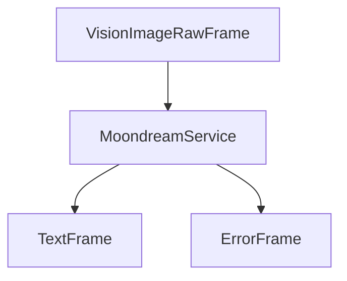

## Metrics Support

The service collects processing metrics:

* Processing duration
* Model loading time
* Inference time

## Performance Considerations

### Memory Usage

* Model size varies by version
* GPU memory requirements depend on image size
* CPU mode uses more system memory

### Processing Speed

Relative performance by hardware:

1. NVIDIA GPU (fastest)
2. Intel XPU
3. Apple MPS
4. CPU (slowest)

## Best Practices

### 1. Image Preparation

```python
# Optimize image before processing
def prepare_image(image_path):
    image = Image.open(image_path)
    # Resize if needed
    if max(image.size) > 1024:
        image.thumbnail((1024, 1024))
    return image
```

### 2. Error Handling

```python
try:
    async for frame in service.run_vision(vision_frame):
        if isinstance(frame, ErrorFrame):
            logger.error(f"Vision processing error: {frame.error}")
        elif isinstance(frame, TextFrame):
            process_result(frame.text)
except Exception as e:
    logger.error(f"Unexpected error: {e}")
```

### 3. Resource Management

```python
# Initialize once, reuse for multiple images
service = MoondreamService()
try:
    # Process multiple images
    for image in images:
        await process_image(service, image)
finally:
    # Cleanup if needed
    await service.cleanup()
```

## Notes

* Runs completely offline after model download
* First run requires model download
* Supports multiple hardware acceleration options
* Thread-safe processing
* Automatic error handling
* Manages model lifecycle
* Supports various image formats


# AudioBufferProcessor
Source: https://docs.pipecat.ai/server/utilities/audio/audio-buffer-processor

Process and buffer audio frames from conversations with flexible event handling

## Overview

The `AudioBufferProcessor` captures and buffers audio frames from both input (user) and output (bot) sources during conversations. It provides synchronized audio streams with configurable sample rates, supports both mono and stereo output, and offers flexible event handlers for various audio processing workflows.

## Constructor

```python
AudioBufferProcessor(
    sample_rate=None,
    num_channels=1,
    buffer_size=0,
    enable_turn_audio=False,
    **kwargs
)
```

### Parameters

<ParamField path="sample_rate" type="Optional[int]" default="None">
  The desired output sample rate in Hz. If `None`, uses the transport's sample
  rate from the `StartFrame`.
</ParamField>

<ParamField path="num_channels" type="int" default="1">
  Number of output audio channels:

  * `1`: Mono output (user and bot audio are mixed together)
  * `2`: Stereo output (user audio on left channel, bot audio on right channel)
</ParamField>

<ParamField path="buffer_size" type="int" default="0">
  Buffer size in bytes that triggers audio data events:

  * `0`: Events only trigger when recording stops
  * `>0`: Events trigger whenever buffer reaches this size (useful for chunked processing)
</ParamField>

<ParamField path="enable_turn_audio" type="bool" default="False">
  Whether to enable per-turn audio event handlers (`on_user_turn_audio_data` and
  `on_bot_turn_audio_data`).
</ParamField>

## Properties

### sample\_rate

```python
@property
def sample_rate(self) -> int
```

The current sample rate of the audio processor in Hz.

### num\_channels

```python
@property
def num_channels(self) -> int
```

The number of channels in the audio output (1 for mono, 2 for stereo).

## Methods

### start\_recording()

```python
async def start_recording()
```

Start recording audio from both user and bot sources. Initializes recording state and resets audio buffers.

### stop\_recording()

```python
async def stop_recording()
```

Stop recording and trigger final audio data handlers with any remaining buffered audio.

### has\_audio()

```python
def has_audio() -> bool
```

Check if both user and bot audio buffers contain data.

**Returns:** `True` if both buffers contain audio data.

## Event Handlers

The processor supports multiple event handlers for different audio processing workflows. Register handlers using the `@processor.event_handler()` decorator.

### on\_audio\_data

Triggered when `buffer_size` is reached or recording stops, providing merged audio.

```python
@audiobuffer.event_handler("on_audio_data")
async def on_audio_data(buffer, audio: bytes, sample_rate: int, num_channels: int):
    # Handle merged audio data
    pass
```

**Parameters:**

* `buffer`: The AudioBufferProcessor instance
* `audio`: Merged audio data (format depends on `num_channels` setting)
* `sample_rate`: Sample rate in Hz
* `num_channels`: Number of channels (1 or 2)

### on\_track\_audio\_data

Triggered alongside `on_audio_data`, providing separate user and bot audio tracks.

```python
@audiobuffer.event_handler("on_track_audio_data")
async def on_track_audio_data(buffer, user_audio: bytes, bot_audio: bytes,
                             sample_rate: int, num_channels: int):
    # Handle separate audio tracks
    pass
```

**Parameters:**

* `buffer`: The AudioBufferProcessor instance
* `user_audio`: Raw user audio bytes (always mono)
* `bot_audio`: Raw bot audio bytes (always mono)
* `sample_rate`: Sample rate in Hz
* `num_channels`: Always 1 for individual tracks

### on\_user\_turn\_audio\_data

Triggered when a user speaking turn ends. Requires `enable_turn_audio=True`.

```python
@audiobuffer.event_handler("on_user_turn_audio_data")
async def on_user_turn_audio_data(buffer, audio: bytes, sample_rate: int, num_channels: int):
    # Handle user turn audio
    pass
```

**Parameters:**

* `buffer`: The AudioBufferProcessor instance
* `audio`: Audio data from the user's speaking turn
* `sample_rate`: Sample rate in Hz
* `num_channels`: Always 1 (mono)

### on\_bot\_turn\_audio\_data

Triggered when a bot speaking turn ends. Requires `enable_turn_audio=True`.

```python
@audiobuffer.event_handler("on_bot_turn_audio_data")
async def on_bot_turn_audio_data(buffer, audio: bytes, sample_rate: int, num_channels: int):
    # Handle bot turn audio
    pass
```

**Parameters:**

* `buffer`: The AudioBufferProcessor instance
* `audio`: Audio data from the bot's speaking turn
* `sample_rate`: Sample rate in Hz
* `num_channels`: Always 1 (mono)

## Audio Processing Features

* **Automatic resampling**: Converts incoming audio to the specified sample rate
* **Buffer synchronization**: Aligns user and bot audio streams temporally
* **Silence insertion**: Fills gaps in non-continuous audio streams to maintain timing
* **Turn tracking**: Monitors speaking turns when `enable_turn_audio=True`

## Integration Notes

### STT Audio Passthrough

If using an STT service in your pipeline, enable audio passthrough to make audio available to the AudioBufferProcessor:

```python
stt = DeepgramSTTService(
    api_key=os.getenv("DEEPGRAM_API_KEY"),
    audio_passthrough=True,
)
```

<Note>`audio_passthrough` is enabled by default.</Note>

### Pipeline Placement

Add the AudioBufferProcessor after `transport.output()` to capture both user and bot audio:

```python
pipeline = Pipeline([
    transport.input(),
    # ... other processors ...
    transport.output(),
    audiobuffer,  # Place after audio output
    # ... remaining processors ...
])
```


# KoalaFilter
Source: https://docs.pipecat.ai/server/utilities/audio/koala-filter

Audio noise reduction filter using Koala AI technology from Picovoice

## Overview

`KoalaFilter` is an audio processor that reduces background noise in real-time audio streams using Koala Noise Suppression technology from Picovoice. It inherits from `BaseAudioFilter` and processes audio frames to improve audio quality by removing unwanted noise.

To use Koala, you need a Picovoice access key. Get started at [Picovoice Console](https://console.picovoice.ai/signup).

## Installation

The Koala filter requires additional dependencies:

```bash
pip install "pipecat-ai[koala]"
```

You'll also need to set up your Koala access key as an environment variable: `KOALA_ACCESS_KEY`

## Constructor Parameters

<ParamField path="access_key" type="str" required>
  Picovoice access key for using the Koala noise suppression service
</ParamField>

## Input Frames

<ParamField path="FilterEnableFrame" type="Frame">
  Specific control frame to toggle filtering on/off

  ```python
  from pipecat.frames.frames import FilterEnableFrame

  # Disable noise reduction
  await task.queue_frame(FilterEnableFrame(False))

  # Re-enable noise reduction
  await task.queue_frame(FilterEnableFrame(True))
  ```
</ParamField>

## Usage Example

```python
from pipecat.audio.filters.koala_filter import KoalaFilter

transport = DailyTransport(
    room_url,
    token,
    "Respond bot",
    DailyParams(
        audio_in_filter=KoalaFilter(access_key=os.getenv("KOALA_ACCESS_KEY")), # Enable Koala noise reduction
        audio_in_enabled=True,
        audio_out_enabled=True,
        vad_analyzer=SileroVADAnalyzer(),
    ),
)
```

## Audio Flow

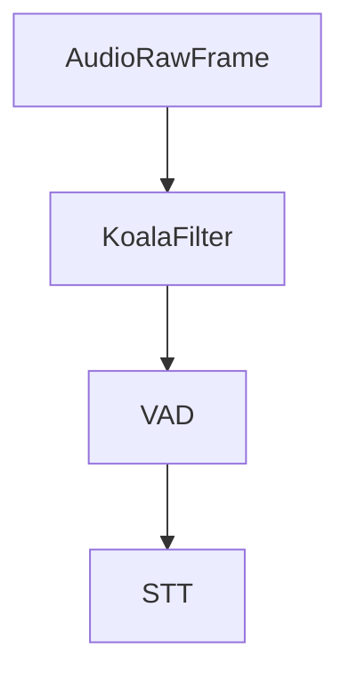

## Notes

* Requires Picovoice access key
* Supports real-time audio processing
* Handles 16-bit PCM audio format
* Can be dynamically enabled/disabled
* Maintains audio quality while reducing noise
* Efficient processing for low latency
* Automatically handles audio frame buffering
* Sample rate must match Koala's required sample rate


# KrispFilter
Source: https://docs.pipecat.ai/server/utilities/audio/krisp-filter

Audio noise reduction filter using Krisp AI technology

## Overview

`KrispFilter` is an audio processor that reduces background noise in real-time audio streams using Krisp AI technology. It inherits from `BaseAudioFilter` and processes audio frames to improve audio quality by removing unwanted noise.

To use Krisp, you need a Krisp SDK license. Get started at [Krisp.ai](https://krisp.ai/developers/).

<Tip>
  Looking for help getting started with Krisp and Pipecat? Checkout our [Krisp
  noise cancellation guide](/guides/features/krisp).
</Tip>

## Installation

The Krisp filter requires additional dependencies:

```bash
pip install "pipecat-ai[krisp]"
```

## Environment Variables

You need to provide the path to the Krisp model. This can either be done by setting the `KRISP_MODEL_PATH` environment variable or by setting the `model_path` in the constructor.

## Constructor Parameters

<ParamField path="sample_type" type="str" default="PCM_16">
  Audio sample type format
</ParamField>

<ParamField path="channels" type="int" default="1">
  Number of audio channels
</ParamField>

<ParamField path="model_path" type="str" default="None">
  Path to the Krisp model file.

  You can set the `model_path` directly. Alternatively, you can set the `KRISP_MODEL_PATH` environment variable to the model file path.
</ParamField>

## Input Frames

<ParamField path="FilterEnableFrame" type="Frame">
  Specific control frame to toggle filtering on/off

  ```python
  from pipecat.frames.frames import FilterEnableFrame

  # Disable noise reduction
  await task.queue_frame(FilterEnableFrame(False))

  # Re-enable noise reduction
  await task.queue_frame(FilterEnableFrame(True))
  ```
</ParamField>

## Usage Example

```python
from pipecat.audio.filters.krisp_filter import KrispFilter

transport = DailyTransport(
    room_url,
    token,
    "Respond bot",
    DailyParams(
        audio_in_filter=KrispFilter(), # Enable Krisp noise reduction
        audio_in_enabled=True,
        audio_out_enabled=True,
        vad_analyzer=SileroVADAnalyzer(),
    ),
)
```

## Audio Flow

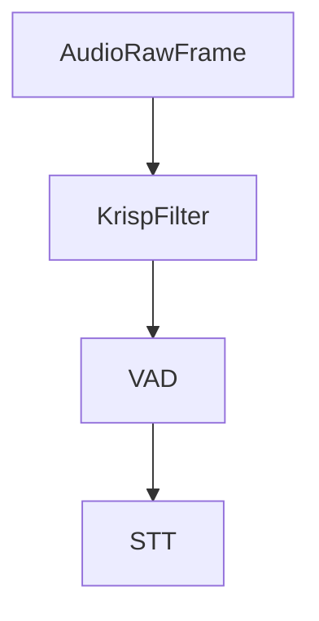

## Notes

* Requires Krisp SDK and model file to be available
* Supports real-time audio processing
* Supports additional features like background voice removal
* Handles PCM\_16 audio format
* Thread-safe for pipeline processing
* Can be dynamically enabled/disabled
* Maintains audio quality while reducing noise
* Efficient processing for low latency


# NoisereduceFilter
Source: https://docs.pipecat.ai/server/utilities/audio/noisereduce-filter

Audio noise reduction filter using the noisereduce library

## Overview

`NoisereduceFilter` is an audio processor that reduces background noise in real-time audio streams using the noisereduce library. It inherits from `BaseAudioFilter` and processes audio frames to improve audio quality by removing unwanted noise.

## Installation

The noisereduce filter requires additional dependencies:

```bash
pip install "pipecat-ai[noisereduce]"
```

## Constructor Parameters

This filter has no configurable parameters in its constructor.

## Input Frames

<ParamField path="FilterEnableFrame" type="Frame">
  Specific control frame to toggle filtering on/off

  ```python
  from pipecat.frames.frames import FilterEnableFrame

  # Disable noise reduction
  await task.queue_frame(FilterEnableFrame(False))

  # Re-enable noise reduction
  await task.queue_frame(FilterEnableFrame(True))
  ```
</ParamField>

## Usage Example

```python
from pipecat.audio.filters.noisereduce_filter import NoisereduceFilter

transport = DailyTransport(
    room_url,
    token,
    "Respond bot",
    DailyParams(
        audio_in_filter=NoisereduceFilter(), # Enable noise reduction
        audio_in_enabled=True,
        audio_out_enabled=True,
        vad_analyzer=SileroVADAnalyzer(),
    ),
)
```

## Audio Flow

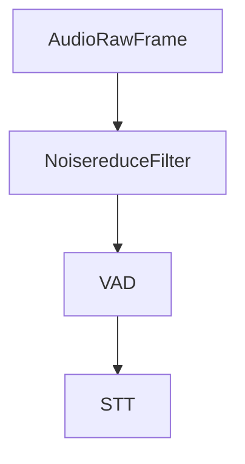

## Notes

* Lightweight alternative to Krisp for noise reduction
* Supports real-time audio processing
* Handles PCM\_16 audio format
* Thread-safe for pipeline processing
* Can be dynamically enabled/disabled
* No additional configuration required
* Uses statistical noise reduction techniques


# SileroVADAnalyzer
Source: https://docs.pipecat.ai/server/utilities/audio/silero-vad-analyzer

Voice Activity Detection analyzer using the Silero VAD ONNX model

## Overview

`SileroVADAnalyzer` is a Voice Activity Detection (VAD) analyzer that uses the Silero VAD ONNX model to detect speech in audio streams. It provides high-accuracy speech detection with efficient processing using ONNX runtime.

## Installation

The Silero VAD analyzer requires additional dependencies:

```bash
pip install "pipecat-ai[silero]"
```

## Constructor Parameters

<ParamField path="sample_rate" type="int" default="None">
  Audio sample rate in Hz. Must be either 8000 or 16000.
</ParamField>

<ParamField path="params" type="VADParams" default="VADParams()">
  Voice Activity Detection parameters object

  <Expandable title="properties">
    <ParamField path="confidence" type="float" default="0.7">
      Confidence threshold for speech detection. Higher values make detection more strict. Must be between 0 and 1.
    </ParamField>

    <ParamField path="start_secs" type="float" default="0.2">
      Time in seconds that speech must be detected before transitioning to SPEAKING state.
    </ParamField>

    <ParamField path="stop_secs" type="float" default="0.8">
      Time in seconds of silence required before transitioning back to QUIET state.
    </ParamField>

    <ParamField path="min_volume" type="float" default="0.6">
      Minimum audio volume threshold for speech detection. Must be between 0 and 1.
    </ParamField>
  </Expandable>
</ParamField>

## Usage Example

```python
transport = DailyTransport(
    room_url,
    token,
    "Respond bot",
    DailyParams(
        audio_in_enabled=True,
        audio_out_enabled=True,
        vad_analyzer=SileroVADAnalyzer(params=VADParams(stop_secs=0.5)),
    ),
)
```

## Technical Details

### Sample Rate Requirements

The analyzer supports two sample rates:

* 8000 Hz (256 samples per frame)
* 16000 Hz (512 samples per frame)

Model Management

* Uses ONNX runtime for efficient inference
* Automatically resets model state every 5 seconds to manage memory
* Runs on CPU by default for consistent performance
* Includes built-in model file

## Notes

* High-accuracy speech detection
* Efficient ONNX-based processing
* Automatic memory management
* Thread-safe for pipeline processing
* Built-in model file included
* CPU-optimized inference
* Supports 8kHz and 16kHz audio


# SoundfileMixer
Source: https://docs.pipecat.ai/server/utilities/audio/soundfile-mixer

Audio mixer for combining real-time audio with sound files

## Overview

`SoundfileMixer` is an audio mixer that combines incoming audio with audio from files. It supports multiple audio file formats through the soundfile library and can handle runtime volume adjustments and sound switching.

## Installation

The soundfile mixer requires additional dependencies:

```bash
pip install "pipecat-ai[soundfile]"
```

## Constructor Parameters

<ParamField path="sound_files" type="Mapping[str, str]" required>
  Dictionary mapping sound names to file paths. Files must be mono (single channel).
</ParamField>

<ParamField path="default_sound" type="str" required>
  Name of the default sound to play (must be a key in sound\_files).
</ParamField>

<ParamField path="volume" type="float" default="0.4">
  Initial volume for the mixed sound. Values typically range from 0.0 to 1.0, but can go higher.
</ParamField>

<ParamField path="loop" type="bool" default="true">
  Whether to loop the sound file when it reaches the end.
</ParamField>

## Control Frames

<ParamField path="MixerUpdateSettingsFrame" type="Frame">
  Updates mixer settings at runtime

  <Expandable title="properties">
    <ParamField path="sound" type="str">
      Changes the current playing sound (must be a key in sound\_files)
    </ParamField>

    <ParamField path="volume" type="float">
      Updates the mixing volume
    </ParamField>

    <ParamField path="loop" type="bool">
      Updates whether the sound should loop
    </ParamField>
  </Expandable>
</ParamField>

<ParamField path="MixerEnableFrame" type="Frame">
  Enables or disables the mixer

  <Expandable title="properties">
    <ParamField path="enable" type="bool">
      Whether mixing should be enabled
    </ParamField>
  </Expandable>
</ParamField>

## Usage Example

```python
# Initialize mixer with sound files
mixer = SoundfileMixer(
    sound_files={"office": "office_ambience.wav"},
    default_sound="office",
    volume=2.0,
)

# Add to transport
transport = DailyTransport(
    room_url,
    token,
    "Audio Bot",
    DailyParams(
        audio_out_enabled=True,
        audio_out_mixer=mixer,
    ),
)

# Control mixer at runtime
await task.queue_frame(MixerUpdateSettingsFrame({"volume": 0.5}))
await task.queue_frame(MixerEnableFrame(False))  # Disable mixing
await task.queue_frame(MixerEnableFrame(True))   # Enable mixing
```

## Notes

* Supports any audio format that soundfile can read
* Automatically resamples audio files to match output sample rate
* Files must be mono (single channel)
* Thread-safe for pipeline processing
* Can dynamically switch between multiple sound files
* Volume can be adjusted in real-time
* Mixing can be enabled/disabled on demand


# DailyRESTHelper
Source: https://docs.pipecat.ai/server/utilities/daily/rest-helper

Classes and methods for interacting with the Daily API to manage rooms and tokens

<Card title="Daily REST API Documentation" icon="link" href="https://docs.daily.co/reference/rest-api">
  For complete Daily REST API reference and additional details
</Card>

## Classes

### DailyRoomSipParams

Configuration for SIP (Session Initiation Protocol) parameters.

<ResponseField name="display_name" type="string" default="sw-sip-dialin">
  Display name for the SIP endpoint
</ResponseField>

<ResponseField name="video" type="boolean" default={false}>
  Whether video is enabled for SIP
</ResponseField>

<ResponseField name="sip_mode" type="string" default="dial-in">
  SIP connection mode
</ResponseField>

<ResponseField name="num_endpoints" type="integer" default={1}>
  Number of SIP endpoints
</ResponseField>

```python
from pipecat.transports.services.helpers.daily_rest import DailyRoomSipParams

sip_params = DailyRoomSipParams(
    display_name="conference-line",
    video=True,
    num_endpoints=2
)
```

### RecordingsBucketConfig

Configuration for storing Daily recordings in a custom S3 bucket.

<ResponseField name="bucket_name" type="string" required>
  Name of the S3 bucket for storing recordings
</ResponseField>

<ResponseField name="bucket_region" type="string" required>
  AWS region where the S3 bucket is located
</ResponseField>

<ResponseField name="assume_role_arn" type="string" required>
  ARN of the IAM role to assume for S3 access
</ResponseField>

<ResponseField name="allow_api_access" type="boolean" default={false}>
  Whether to allow API access to the recordings
</ResponseField>

```python
from pipecat.transports.services.helpers.daily_rest import RecordingsBucketConfig

bucket_config = RecordingsBucketConfig(
    bucket_name="my-recordings-bucket",
    bucket_region="us-west-2",
    assume_role_arn="arn:aws:iam::123456789012:role/DailyRecordingsRole",
    allow_api_access=True
)
```

### DailyRoomProperties

Properties that configure a Daily room's behavior and features.

<ResponseField name="exp" type="float" optional>
  Room expiration time as Unix timestamp (e.g., time.time() + 300 for 5 minutes)
</ResponseField>

<ResponseField name="enable_chat" type="boolean" default={false}>
  Whether chat is enabled in the room
</ResponseField>

<ResponseField name="enable_prejoin_ui" type="boolean" default={false}>
  Whether the prejoin lobby UI is enabled
</ResponseField>

<ResponseField name="enable_emoji_reactions" type="boolean" default={false}>
  Whether emoji reactions are enabled
</ResponseField>

<ResponseField name="eject_at_room_exp" type="boolean" default={false}>
  Whether to eject participants when room expires
</ResponseField>

<ResponseField name="enable_dialout" type="boolean" optional>
  Whether dial-out is enabled
</ResponseField>

<ResponseField name="enable_recording" type="string" optional>
  Recording settings ("cloud", "local", or "raw-tracks")
</ResponseField>

<ResponseField name="geo" type="string" optional>
  Geographic region for room
</ResponseField>

<ResponseField name="max_participants" type="number" optional>
  Maximum number of participants allowed in the room
</ResponseField>

<ResponseField name="recordings_bucket" type="RecordingsBucketConfig" optional>
  Configuration for custom S3 bucket recordings
</ResponseField>

<ResponseField name="sip" type="DailyRoomSipParams" optional>
  SIP configuration parameters
</ResponseField>

<ResponseField name="sip_uri" type="dict" optional>
  SIP URI configuration (returned by Daily)
</ResponseField>

<ResponseField name="start_video_off" type="boolean" default={false}>
  Whether the camera video is turned off by default
</ResponseField>

The class also includes a `sip_endpoint` property that returns the SIP endpoint URI if available.

```python
import time
from pipecat.transports.services.helpers.daily_rest import (
    DailyRoomProperties,
    DailyRoomSipParams,
    RecordingsBucketConfig,
)

properties = DailyRoomProperties(
    exp=time.time() + 3600,  # 1 hour from now
    enable_chat=True,
    enable_emoji_reactions=True,
    enable_recording="cloud",
    geo="us-west",
    max_participants=50,
    sip=DailyRoomSipParams(display_name="conference"),
    recordings_bucket=RecordingsBucketConfig(
        bucket_name="my-bucket",
        bucket_region="us-west-2",
        assume_role_arn="arn:aws:iam::123456789012:role/DailyRole"
    )
)

# Access SIP endpoint if available
if properties.sip_endpoint:
    print(f"SIP endpoint: {properties.sip_endpoint}")
```

### DailyRoomParams

Parameters for creating a new Daily room.

<ResponseField name="name" type="string" optional>
  Room name (if not provided, one will be generated)
</ResponseField>

<ResponseField name="privacy" type="string" default="public">
  Room privacy setting ("private" or "public")
</ResponseField>

<ResponseField name="properties" type="DailyRoomProperties">
  Room configuration properties
</ResponseField>

```python
import time
from pipecat.transports.services.helpers.daily_rest import (
    DailyRoomParams,
    DailyRoomProperties,
)

params = DailyRoomParams(
    name="team-meeting",
    privacy="private",
    properties=DailyRoomProperties(
        enable_chat=True,
        exp=time.time() + 7200  # 2 hours from now
    )
)
```

### DailyRoomObject

Response object representing a Daily room.

<ResponseField name="id" type="string">
  Unique room identifier
</ResponseField>

<ResponseField name="name" type="string">
  Room name
</ResponseField>

<ResponseField name="api_created" type="boolean">
  Whether the room was created via API
</ResponseField>

<ResponseField name="privacy" type="string">
  Room privacy setting
</ResponseField>

<ResponseField name="url" type="string">
  Complete room URL
</ResponseField>

<ResponseField name="created_at" type="string">
  Room creation timestamp in ISO 8601 format
</ResponseField>

<ResponseField name="config" type="DailyRoomProperties">
  Room configuration
</ResponseField>

```python
from pipecat.transports.services.helpers.daily_rest import (
    DailyRoomObject,
    DailyRoomProperties,
)

# Example of what a DailyRoomObject looks like when received
room = DailyRoomObject(
    id="abc123",
    name="team-meeting",
    api_created=True,
    privacy="private",
    url="https://your-domain.daily.co/team-meeting",
    created_at="2024-01-20T10:00:00.000Z",
    config=DailyRoomProperties(
        enable_chat=True,
        exp=1705743600
    )
)
```

### DailyMeetingTokenProperties

Properties for configuring a Daily meeting token.

<ResponseField name="room_name" type="string" optional>
  The room this token is valid for. If not set, token is valid for all rooms.
</ResponseField>

<ResponseField name="eject_at_token_exp" type="boolean" optional>
  Whether to eject user when token expires
</ResponseField>

<ResponseField name="eject_after_elapsed" type="integer" optional>
  Eject user after this many seconds
</ResponseField>

<ResponseField name="nbf" type="integer" optional>
  "Not before" timestamp - users cannot join before this time
</ResponseField>

<ResponseField name="exp" type="integer" optional>
  Expiration timestamp - users cannot join after this time
</ResponseField>

<ResponseField name="is_owner" type="boolean" optional>
  Whether token grants owner privileges
</ResponseField>

<ResponseField name="user_name" type="string" optional>
  User's display name in the meeting
</ResponseField>

<ResponseField name="user_id" type="string" optional>
  Unique identifier for the user (36 char limit)
</ResponseField>

<ResponseField name="enable_screenshare" type="boolean" optional>
  Whether user can share their screen
</ResponseField>

<ResponseField name="start_video_off" type="boolean" optional>
  Whether to join with video off
</ResponseField>

<ResponseField name="start_audio_off" type="boolean" optional>
  Whether to join with audio off
</ResponseField>

<ResponseField name="enable_recording" type="string" optional>
  Recording settings ("cloud", "local", or "raw-tracks")
</ResponseField>

<ResponseField name="enable_prejoin_ui" type="boolean" optional>
  Whether to show prejoin UI
</ResponseField>

<ResponseField name="start_cloud_recording" type="boolean" optional>
  Whether to start cloud recording when user joins
</ResponseField>

<ResponseField name="permissions" type="dict" optional>
  Initial default permissions for a non-meeting-owner participant
</ResponseField>

### DailyMeetingTokenParams

Parameters for creating a Daily meeting token.

<ResponseField name="properties" type="DailyMeetingTokenProperties">
  Token configuration properties
</ResponseField>

```python
from pipecat.transports.services.helpers.daily_rest import (
    DailyMeetingTokenParams,
    DailyMeetingTokenProperties,
)

token_params = DailyMeetingTokenParams(
    properties=DailyMeetingTokenProperties(
        user_name="John Doe",
        enable_screenshare=True,
        start_video_off=True,
        permissions={"canSend": ["video", "audio"]}
    )
)
```

## Initialize DailyRESTHelper

Create a new instance of the Daily REST helper.

<ParamField path="daily_api_key" type="string" required>
  Your Daily API key
</ParamField>

<ParamField path="daily_api_url" type="string" default="https://api.daily.co/v1">
  The Daily API base URL
</ParamField>

<ParamField path="aiohttp_session" type="aiohttp.ClientSession" required>
  An aiohttp client session for making HTTP requests
</ParamField>

```python
helper = DailyRESTHelper(
    daily_api_key="your-api-key",
    aiohttp_session=session
)
```

## Create Room

Creates a new Daily room with specified parameters.

<ParamField path="params" type="DailyRoomParams" required>
  Room configuration parameters including name, privacy, and properties
</ParamField>

```python
# Create a room that expires in 1 hour
params = DailyRoomParams(
    name="my-room",
    privacy="private",
    properties=DailyRoomProperties(
        exp=time.time() + 3600,
        enable_chat=True
    )
)
room = await helper.create_room(params)
print(f"Room URL: {room.url}")
```

## Get Room From URL

Retrieves room information using a Daily room URL.

<ParamField path="room_url" type="string" required>
  The complete Daily room URL
</ParamField>

```python
room = await helper.get_room_from_url("https://your-domain.daily.co/my-room")
print(f"Room name: {room.name}")
```

## Get Token

Generates a meeting token for a specific room.

<ParamField path="room_url" type="string" required>
  The complete Daily room URL
</ParamField>

<ParamField path="expiry_time" type="float" default="3600">
  Token expiration time in seconds
</ParamField>

<ParamField path="eject_at_token_exp" type="bool" default="False">
  Whether to eject user when token expires
</ParamField>

<ParamField path="owner" type="bool" default="True">
  Whether the token should have owner privileges (overrides any setting in
  params)
</ParamField>

<ParamField path="params" type="DailyMeetingTokenParams" optional>
  Additional token configuration. Note that `room_name`, `exp`,
  `eject_at_token_exp`, and `is_owner` will be set based on the other function
  parameters.
</ParamField>

```python
# Basic token generation
token = await helper.get_token(
    room_url="https://your-domain.daily.co/my-room",
    expiry_time=1800,  # 30 minutes
    owner=True,
    eject_at_token_exp=True
)

# Advanced token generation with additional properties
token_params = DailyMeetingTokenParams(
    properties=DailyMeetingTokenProperties(
        user_name="John Doe",
        start_video_off=True
    )
)
token = await helper.get_token(
    room_url="https://your-domain.daily.co/my-room",
    expiry_time=1800,
    owner=False,
    eject_at_token_exp=True,
    params=token_params
)
```

## Delete Room By URL

Deletes a room using its URL.

<ParamField path="room_url" type="string" required>
  The complete Daily room URL
</ParamField>

```python
success = await helper.delete_room_by_url("https://your-domain.daily.co/my-room")
if success:
    print("Room deleted successfully")
```

## Delete Room By Name

Deletes a room using its name.

<ParamField path="room_name" type="string" required>
  The name of the Daily room
</ParamField>

```python
success = await helper.delete_room_by_name("my-room")
if success:
    print("Room deleted successfully")
```

## Get Name From URL

Extracts the room name from a Daily room URL.

<ParamField path="room_url" type="string" required>
  The complete Daily room URL
</ParamField>

```python
room_name = helper.get_name_from_url("https://your-domain.daily.co/my-room")
print(f"Room name: {room_name}")  # Outputs: "my-room"
```


# DTMFAggregator
Source: https://docs.pipecat.ai/server/utilities/dtmf-aggregator

Aggregates DTMF (phone keypad) input into meaningful sequences for LLM processing

## Overview

`DTMFAggregator` processes incoming DTMF (Dual-Tone Multi-Frequency) frames from phone keypad input and aggregates them into complete sequences that can be understood by LLM services. It buffers individual digit presses and flushes them as transcription frames when a termination digit is pressed, a timeout occurs, or an interruption happens.

This aggregator is essential for telephony applications where users interact via phone keypad buttons, converting raw DTMF input into structured text that LLMs can process alongside voice transcriptions.

## Constructor

```python
aggregator = DTMFAggregator(
    timeout=2.0,
    termination_digit=KeypadEntry.POUND,
    prefix="DTMF: "
)
```

<ParamField path="timeout" type="float" default="2.0">
  Idle timeout in seconds before flushing the aggregated digits
</ParamField>

<ParamField path="termination_digit" type="KeypadEntry" default="KeypadEntry.POUND">
  Digit that triggers immediate flush of the aggregation
</ParamField>

<ParamField path="prefix" type="str" default="DTMF: ">
  Prefix added to DTMF sequence in the output transcription
</ParamField>

## Input Frames

<ParamField path="InputDTMFFrame" type="Frame">
  Contains a single keypad button press with a KeypadEntry value
</ParamField>

<ParamField path="StartInterruptionFrame" type="Frame">
  Flushes any pending aggregation when user interruption begins
</ParamField>

<ParamField path="EndFrame" type="Frame">
  Flushes pending aggregation and stops the aggregation task
</ParamField>

## Output Frames

<ParamField path="TranscriptionFrame" type="Frame">
  Contains the aggregated DTMF sequence as text with the configured prefix
</ParamField>

All input frames are passed through downstream, including the original `InputDTMFFrame` instances.

## Keypad Entries

The aggregator processes these standard phone keypad entries:

| KeypadEntry           | Value         | Description       |
| --------------------- | ------------- | ----------------- |
| `ZERO` through `NINE` | `"0"` - `"9"` | Numeric digits    |
| `STAR`                | `"*"`         | Star/asterisk key |
| `POUND`               | `"#"`         | Pound/hash key    |

## Aggregation Behavior

The aggregator flushes (emits a TranscriptionFrame) when:

1. **Termination digit**: The configured termination digit is pressed (default: `#`)
2. **Timeout**: No new digits received within the timeout period (default: 2 seconds)
3. **Interruption**: A `StartInterruptionFrame` is received
4. **Pipeline end**: An `EndFrame` is received

## Usage Examples

### Basic Telephony Integration

```python
from pipecat.processors.aggregators.dtmf_aggregator import DTMFAggregator
from pipecat.serializers.twilio import TwilioFrameSerializer

# Create DTMF aggregator with default settings
dtmf_aggregator = DTMFAggregator()

# Set up Twilio serializer for phone integration
serializer = TwilioFrameSerializer(
    stream_sid=stream_sid,
    call_sid=call_sid,
    account_sid=os.getenv("TWILIO_ACCOUNT_SID"),
    auth_token=os.getenv("TWILIO_AUTH_TOKEN")
)

# Create pipeline with DTMF processing
pipeline = Pipeline([
    transport.input(),      # Websocket input from Twilio
    dtmf_aggregator,       # Process DTMF before STT
    stt,                   # Speech-to-text service
    context_aggregator.user(),
    llm,                   # LLM processes both voice and DTMF
    tts,                   # Text-to-speech
    transport.output(),
    context_aggregator.assistant(),
])
```

### Custom Configuration for Menu Systems

```python
# Configure for menu system with star termination
menu_dtmf = DTMFAggregator(
    timeout=5.0,                    # Longer timeout for menu selection
    termination_digit=KeypadEntry.STAR,  # Use * to confirm selection
    prefix="Menu selection: "       # Clear prefix for LLM
)

# Update system prompt to handle DTMF input
messages = [
    {
        "role": "system",
        "content": """You are a phone menu assistant.

When you receive input starting with "Menu selection:", this represents
button presses on the phone keypad:
- Single digits (1-9): Menu options
- 0: Often "speak to operator"
- *: Confirmation or "go back"
- #: Usually "repeat menu"

Respond appropriately to both voice and keypad input."""
    }
]
```

## Sequence Examples

| User Input         | Aggregation Trigger    | Output TranscriptionFrame |
| ------------------ | ---------------------- | ------------------------- |
| `1`, `2`, `3`, `#` | Termination digit      | `"DTMF: 123#"`            |
| `*`, `0`           | 2-second timeout       | `"DTMF: *0"`              |
| `5`, interruption  | StartInterruptionFrame | `"DTMF: 5"`               |
| `9`, `9`, EndFrame | Pipeline shutdown      | `"DTMF: 99"`              |

## Frame Flow

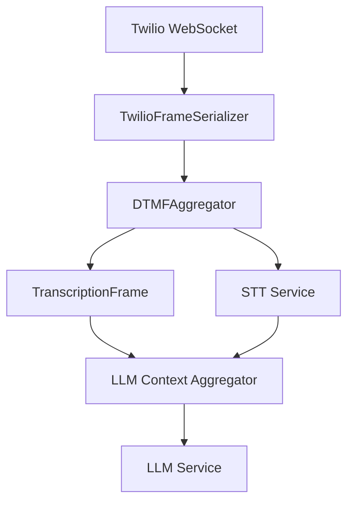

## Error Handling

The aggregator gracefully handles:

* Invalid DTMF digits (logged and ignored)
* Pipeline interruptions (flushes pending sequences)
* Rapid key presses (buffers efficiently)
* Mixed voice and DTMF input (processes independently)

## Best Practices

1. **System Prompt Design**: Train your LLM to recognize and respond to DTMF prefixed input
2. **Timeout Configuration**: Use shorter timeouts (1-2s) for rapid entry, longer (3-5s) for menu selection
3. **Termination Strategy**: Use `#` for confirmation, `*` for cancel/back operations
4. **Pipeline Placement**: Always place before the user context aggregator to ensure proper frame ordering


# FrameFilter
Source: https://docs.pipecat.ai/server/utilities/filters/frame-filter

Processor that selectively passes through only specified frame types

## Overview

`FrameFilter` is a processor that filters frames based on their types, only passing through frames that match specified types (plus some system frames like `EndFrame` and `SystemFrame`).

## Constructor Parameters

<ParamField path="types" type="Tuple[Type[Frame], ...]" required>
  Tuple of frame types that should be passed through the filter
</ParamField>

## Functionality

When a frame passes through the filter, it is checked against the provided types. Only frames that match one of the specified types (or are system frames) will be passed downstream. All other frames are dropped.

## Output Frames

The processor always passes through:

* Frames matching any of the specified types
* `EndFrame` and `SystemFrame` instances (always allowed, so as to not block the pipeline)

## Usage Example

```python
from pipecat.frames.frames import TextFrame, AudioRawFrame, Frame
from pipecat.processors.filters import FrameFilter
from typing import Tuple, Type

# Create a filter that only passes TextFrames and AudioRawFrames
text_and_audio_filter = FrameFilter(
    types=(TextFrame, AudioRawFrame)
)

# Add to pipeline
pipeline = Pipeline([
    source,
    text_and_audio_filter,  # Filters out all other frame types
    destination
])
```

## Frame Flow

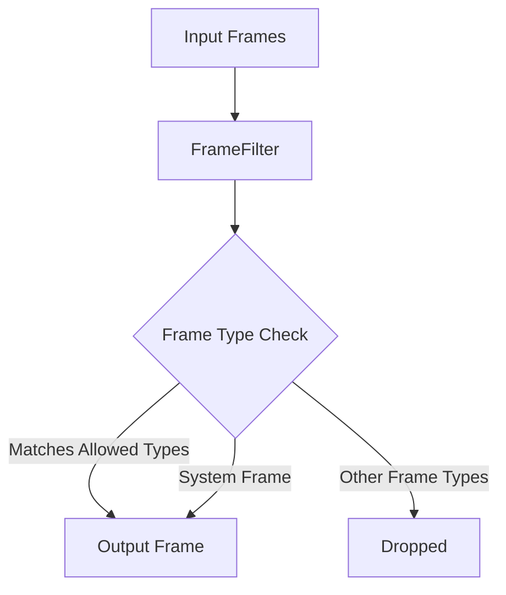

## Notes

* Simple but powerful way to restrict which frame types flow through parts of your pipeline
* Always allows system frames to pass through for proper pipeline operation
* Can be used to isolate specific parts of your pipeline from certain frame types
* Efficient implementation with minimal overhead


# FunctionFilter
Source: https://docs.pipecat.ai/server/utilities/filters/function-filter

Processor that filters frames using a custom filter function

## Overview

`FunctionFilter` is a flexible processor that uses a custom async function to determine which frames to pass through. This allows for complex, dynamic filtering logic beyond simple type checking.

## Constructor Parameters

<ParamField path="filter" type="Callable[[Frame], Awaitable[bool]]" required>
  Async function that examines each frame and returns True to allow it or False
  to filter it out
</ParamField>

<ParamField path="direction" type="FrameDirection" default="FrameDirection.DOWNSTREAM">
  Which direction of frames to filter (DOWNSTREAM or UPSTREAM)
</ParamField>

## Functionality

When a frame passes through the processor:

1. System frames and end frames are always passed through
2. Frames moving in a different direction than specified are always passed through
3. Other frames are passed to the filter function
4. If the filter function returns True, the frame is passed through

## Output Frames

The processor conditionally passes through frames based on:

* Frame type (system frames and end frames always pass)
* Frame direction (only filters in the specified direction)
* Result of the custom filter function

## Usage Example

```python
from pipecat.frames.frames import TextFrame, Frame
from pipecat.processors.filters import FunctionFilter
from pipecat.processors.frame_processor import FrameDirection

# Create filter that only allows TextFrames with more than 10 characters
async def long_text_filter(frame: Frame) -> bool:
    if isinstance(frame, TextFrame):
        return len(frame.text) > 10
    return False

# Apply filter to downstream frames only
text_length_filter = FunctionFilter(
    filter=long_text_filter,
    direction=FrameDirection.DOWNSTREAM
)

# Add to pipeline
pipeline = Pipeline([
    source,
    text_length_filter,  # Filters out short text frames
    destination
])
```

## Frame Flow

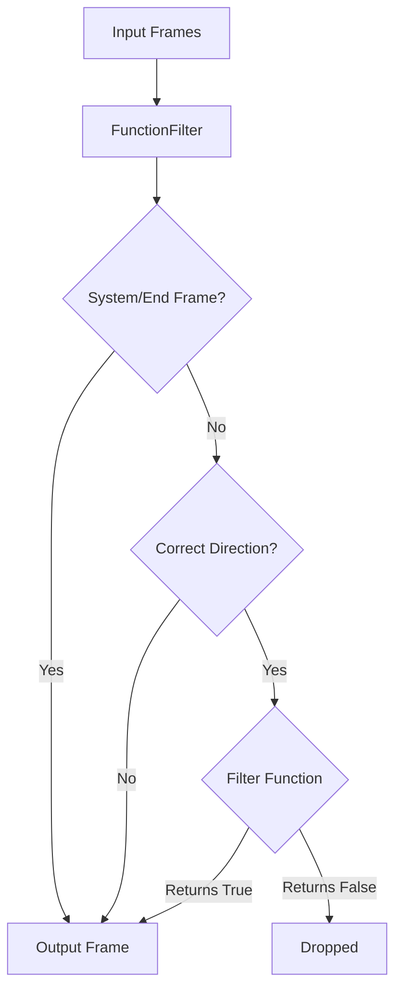

## Notes

* Provides maximum flexibility for complex filtering logic
* Can incorporate dynamic conditions that change at runtime
* Only filters frames moving in the specified direction
* Always passes through system frames for proper pipeline operation
* Can be used to create sophisticated content-based filters
* Supports async filter functions for complex processing


# IdentityFilter
Source: https://docs.pipecat.ai/server/utilities/filters/identify-filter

Processor that passes all frames through without modification

## Overview

`IdentityFilter` is a simple pass-through processor that forwards all frames without any modification or filtering. It acts as a transparent layer in your pipeline, allowing all frames to flow through unchanged.

<Tip>
  Check out Observers for an option that delivers similar functionality but
  doesn't require a processor to reside in the Pipeline.
</Tip>

## Constructor Parameters

The `IdentityFilter` constructor accepts no specific parameters beyond those inherited from `FrameProcessor`.

## Functionality

When a frame passes through the processor, it is immediately forwarded in the same direction with no changes. This applies to all frame types and both directions (upstream and downstream).

## Use Cases

While functionally equivalent to having no filter at all, `IdentityFilter` can be useful in several scenarios:

* Testing `ParallelPipeline` configurations to ensure frames aren't duplicated
* Acting as a placeholder where a more complex filter might be added later
* Monitoring frame flow in pipelines by adding logging in subclasses
* Creating a base class for more complex conditional filters

## Usage Example

```python
from pipecat.processors.filters import IdentityFilter

# Create an identity filter
pass_through = IdentityFilter()

# Add to pipeline
pipeline = Pipeline([
    source,
    pass_through,  # All frames pass through unchanged
    destination
])
```

## Frame Flow

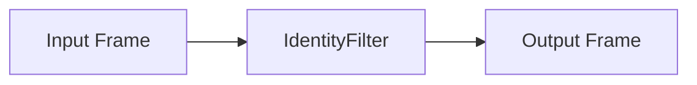

## Notes

* Simplest possible filter implementation
* Passes all frames through without modification
* Useful in testing parallel pipelines
* Can serve as a placeholder or base class
* Zero overhead in normal operation


# NullFilter
Source: https://docs.pipecat.ai/server/utilities/filters/null-filter

Processor that blocks all frames except system frames

## Overview

`NullFilter` is a filtering processor that blocks all frames from passing through, with the exception of system frames and end frames which are required for proper pipeline operation.

## Constructor Parameters

The `NullFilter` constructor accepts no specific parameters beyond those inherited from `FrameProcessor`.

## Functionality

When a frame passes through the processor:

* If the frame is a `SystemFrame` or `EndFrame`, it is passed through
* All other frame types are blocked and do not continue through the pipeline

This filter effectively acts as a barrier that allows only the essential system frames required for pipeline initialization, shutdown, and management.

## Use Cases

`NullFilter` is useful in several scenarios:

* Temporarily disabling parts of a pipeline without removing components
* Creating dead-end branches in parallel pipelines
* Testing pipeline behavior with blocked communication
* Implementing conditional pipelines where certain paths should be blocked

## Usage Example

```python
from pipecat.processors.filters import NullFilter

# Create a null filter that blocks all non-system frames
blocker = NullFilter()

# Add to pipeline
pipeline = Pipeline([
    source,
    blocker,  # Blocks all regular frames
    destination  # Will only receive system frames
])
```

## Frame Flow

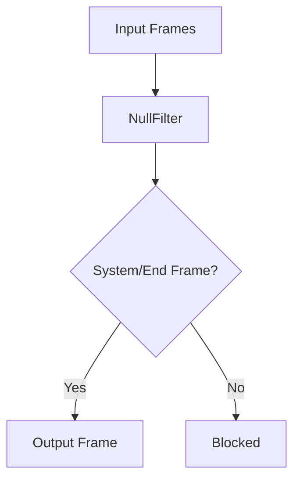

## Notes

* Blocks all regular frames in both directions
* Only allows system frames and end frames to pass through
* Useful for testing, debugging, and creating conditional pipelines
* Minimal overhead as it performs simple type checking
* Can be used to temporarily disable parts of a pipeline


# STTMuteFilter
Source: https://docs.pipecat.ai/server/utilities/filters/stt-mute

Processor for controlling STT muting and interruption handling during bot speech and function calls

## Overview

`STTMuteFilter` is a general-purpose processor that combines STT muting and interruption control. When active, it prevents both transcription and interruptions during specified conditions (e.g., bot speech, function calls), providing a cleaner conversation flow.

The processor supports multiple simultaneous strategies for when to mute the STT service, making it flexible for different use cases.

<Tip>
  Want to try it out? Check out the [STTMuteFilter foundational
  demo](https://github.com/pipecat-ai/pipecat/blob/main/examples/foundational/24-stt-mute-filter.py)
</Tip>

## Constructor Parameters

<ParamField path="config" type="STTMuteConfig" required>
  Configuration object that defines the muting strategies and optional custom
  logic
</ParamField>

<ParamField path="stt_service" type="Optional[STTService]" required>
  The STT service to control (deprecated, will be removed in a future version)
</ParamField>

## Configuration

The processor is configured using `STTMuteConfig`, which determines when and how the STT service should be muted:

<ParamField path="strategies" type="set[STTMuteStrategy]">
  Set of muting strategies to apply
</ParamField>

<ParamField path="should_mute_callback" type="Callable[[STTMuteFilter], Awaitable[bool]]" default="None">
  Optional callback for custom muting logic (required when strategy is `CUSTOM`)
</ParamField>

### Muting Strategies

`STTMuteConfig` accepts a set of these `STTMuteStrategy` values:

<ParamField path="FIRST_SPEECH" type="STTMuteStrategy">
  Mute only during the bot's first speech (typically during introduction)
</ParamField>

<ParamField path="MUTE_UNTIL_FIRST_BOT_COMPLETE" type="STTMuteStrategy">
  Start muted and remain muted until first bot speech completes. Useful when bot
  speaks first and you want to ensure its first response cannot be interrupted.
</ParamField>

<ParamField path="FUNCTION_CALL" type="STTMuteStrategy">
  Mute during LLM function calls (e.g., API requests, external service calls)
</ParamField>

<ParamField path="ALWAYS" type="STTMuteStrategy">
  Mute during all bot speech
</ParamField>

<ParamField path="CUSTOM" type="STTMuteStrategy">
  Use custom logic provided via callback to determine when to mute. The callback
  is invoked when the bot is speaking and can use application state to decide
  whether to mute. When the bot stops speaking, unmuting occurs automatically if
  no other strategy requires muting.
</ParamField>

<Note>
  `MUTE_UNTIL_FIRST_BOT_COMPLETE` and `FIRST_SPEECH` strategies should not be
  used together as they handle the first bot speech differently.
</Note>

## Input Frames

<ParamField path="BotStartedSpeakingFrame" type="Frame">
  Indicates bot has started speaking
</ParamField>

<ParamField path="BotStoppedSpeakingFrame" type="Frame">
  Indicates bot has stopped speaking
</ParamField>

<ParamField path="FunctionCallInProgressFrame" type="Frame">
  Indicates a function call has started
</ParamField>

<ParamField path="FunctionCallResultFrame" type="Frame">
  Indicates a function call has completed
</ParamField>

<ParamField path="InterimTranscriptionFrame" type="Frame">
  Indicates an interim transcription result (suppressed when muted)
</ParamField>

<ParamField path="StartInterruptionFrame" type="Frame">
  User interruption start event (suppressed when muted)
</ParamField>

<ParamField path="StopInterruptionFrame" type="Frame">
  User interruption stop event (suppressed when muted)
</ParamField>

<ParamField path="TranscriptionFrame" type="Frame">
  Indicates a transcription result (suppressed when muted)
</ParamField>

<ParamField path="UserStartedSpeakingFrame" type="Frame">
  Indicates user has started speaking (suppressed when muted)
</ParamField>

<ParamField path="UserStoppedSpeakingFrame" type="Frame">
  Indicates user has stopped speaking (suppressed when muted)
</ParamField>

## Output Frames

<ParamField path="STTMuteFrame" type="Frame">
  Control frame to mute/unmute the STT service
</ParamField>

All input frames are passed through except VAD-related frames (interruptions and user speaking events) when muted.

## Usage Examples

### Basic Usage (Mute During Bot's First Speech)

```python
stt = DeepgramSTTService(api_key=os.getenv("DEEPGRAM_API_KEY"))
stt_mute_filter = STTMuteFilter(
    config=STTMuteConfig(strategies={
        STTMuteStrategy.FIRST_SPEECH
    })
)

pipeline = Pipeline([
    transport.input(),
    stt,
    stt_mute_filter,  # Between the STT service and context aggregator
    context_aggregator.user(),
    # ... rest of pipeline
])
```

### Mute Until First Bot Response Completes

```python
stt_mute_filter = STTMuteFilter(
    config=STTMuteConfig(strategies={STTMuteStrategy.MUTE_UNTIL_FIRST_BOT_COMPLETE})
)
```

This ensures no user speech is processed until after the bot's first complete response.

### Always Mute During Bot Speech

```python
stt_mute_filter = STTMuteFilter(
    config=STTMuteConfig(strategies={STTMuteStrategy.ALWAYS})
)
```

### Custom Muting Logic

The `CUSTOM` strategy allows you to control muting based on application state when the bot is speaking. The callback will be invoked whenever the bot is speaking, and your logic decides whether to mute:

```python
# Create a state manager
class SessionState:
    def __init__(self):
        self.session_ending = False

session_state = SessionState()

# Callback function that determines whether to mute
async def session_state_mute_logic(stt_filter: STTMuteFilter) -> bool:
    # Return True to mute, False otherwise
    # This is called when the bot is speaking
    return session_state.session_ending

# Configure filter with CUSTOM strategy
stt_mute_filter = STTMuteFilter(
    config=STTMuteConfig(
        strategies={STTMuteStrategy.CUSTOM},
        should_mute_callback=session_state_mute_logic
    )
)

# Later, when you want to trigger muting (e.g., during session timeout):
async def handle_session_timeout():
    # Update state that will be checked by the callback
    session_state.session_ending = True

    # Send goodbye message
    goodbye_message = "Thank you for using our service. This session is now ending."
    await pipeline.push_frame(TTSSpeakFrame(text=goodbye_message))

    # The system will automatically mute during this message because:
    # 1. Bot starts speaking, triggering the callback
    # 2. Callback returns True (session_ending is True)
    # 3. When bot stops speaking, unmuting happens automatically
```

### Combining Multiple Strategies

```python
async def custom_mute_logic(processor: STTMuteFilter) -> bool:
    # Example: Mute during business hours only
    current_hour = datetime.now().hour
    return 9 <= current_hour < 17

stt_mute_filter = STTMuteFilter(
    config=STTMuteConfig(
        strategies={
            STTMuteStrategy.FUNCTION_CALL,       # Mute during function calls
            STTMuteStrategy.CUSTOM,              # And during business hours
            STTMuteStrategy.MUTE_UNTIL_FIRST_BOT_COMPLETE  # And until first bot speech completes
        },
        should_mute_callback=custom_mute_logic
    )
)
```

### Frame Flow

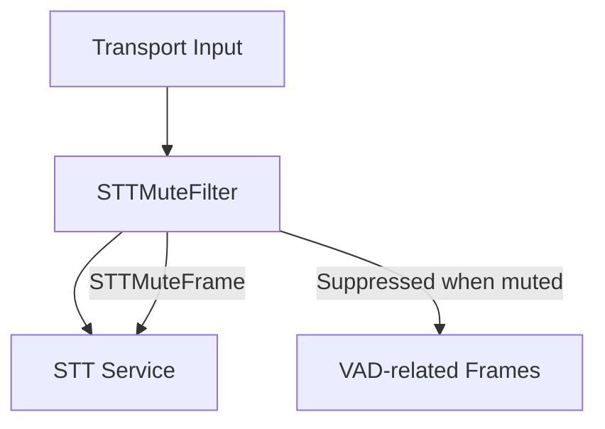

## Notes

* Combines STT muting and interruption control into a single concept
* Muting prevents both transcription and interruptions
* Multiple strategies can be active simultaneously
* CUSTOM strategy callback is only invoked when the bot is speaking
* Unmuting happens automatically when bot speech ends (if no other strategy requires muting)
* Placed between the STT service and context aggregator in pipeline
* Maintains conversation flow during bot speech and function calls
* Efficient state tracking for minimal overhead


# WakeCheckFilter
Source: https://docs.pipecat.ai/server/utilities/filters/wake-check-filter

Processor that passes frames only after detecting wake phrases in transcriptions

## Overview

`WakeCheckFilter` monitors `TranscriptionFrame`s for specified wake phrases and only allows frames to pass through after a wake phrase has been detected. It includes a keepalive timeout to maintain the awake state for a period after detection, allowing continuous conversation without requiring repeated wake phrases.

## Constructor Parameters

<ParamField path="wake_phrases" type="list[str]" required>
  List of wake phrases to detect in transcriptions
</ParamField>

<ParamField path="keepalive_timeout" type="float" default="3">
  Number of seconds to remain in the awake state after each transcription
</ParamField>

## Functionality

The filter maintains state for each participant and processes frames as follows:

1. `TranscriptionFrame` objects are checked for wake phrases
2. If a wake phrase is detected, the filter enters the "AWAKE" state
3. While in the "AWAKE" state, all transcription frames pass through
4. After no activity for the keepalive timeout period, the filter returns to "IDLE"
5. All non-transcription frames pass through normally

Wake phrases are detected using regular expressions that match whole words with flexible spacing, making detection resilient to minor transcription variations.

## States

<ParamField path="IDLE" type="WakeState">
  Default state - only non-transcription frames pass through
</ParamField>

<ParamField path="AWAKE" type="WakeState">
  Active state after wake phrase detection - all frames pass through
</ParamField>

## Output Frames

* All non-transcription frames pass through unchanged
* After wake phrase detection, transcription frames pass through
* When awake, transcription frames reset the keepalive timer

## Usage Example

```python
from pipecat.processors.filters import WakeCheckFilter

# Create filter with wake phrases
wake_filter = WakeCheckFilter(
    wake_phrases=["hey assistant", "ok computer", "listen up"],
    keepalive_timeout=5.0  # Stay awake for 5 seconds after each transcription
)

# Add to pipeline
pipeline = Pipeline([
    transport.input(),
    stt_service,
    wake_filter,  # Only passes transcriptions after wake phrases
    llm_service,
    tts_service,
    transport.output()
])
```

## Frame Flow

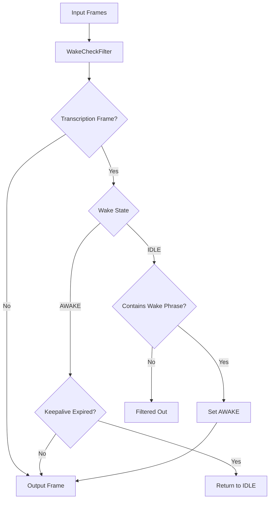

## Notes

* Maintains separate state for each participant ID
* Uses regex pattern matching for resilient wake phrase detection
* Accumulates transcription text to detect phrases across multiple frames
* Trims accumulated text when wake phrase is detected
* Supports multiple wake phrases
* Passes all non-transcription frames through unchanged
* Error handling produces ErrorFrames for robust operation
* Case-insensitive matching for natural language use


# WakeNotifierFilter
Source: https://docs.pipecat.ai/server/utilities/filters/wake-notifier-filter

Processor that triggers a notifier when specified frame types pass a custom filter

## Overview

`WakeNotifierFilter` monitors the pipeline for specific frame types and triggers a notification when those frames pass a custom filter condition. It passes all frames through unchanged while performing this notification side-effect.

## Constructor Parameters

<ParamField path="notifier" type="BaseNotifier" required>
  The notifier object to trigger when conditions are met
</ParamField>

<ParamField path="types" type="Tuple[Type[Frame]]" required>
  Tuple of frame types to monitor
</ParamField>

<ParamField path="filter" type="Callable[[Frame], Awaitable[bool]]" required>
  Async function that examines each matching frame and returns True to trigger
  notification
</ParamField>

## Functionality

The processor operates as follows:

1. Checks if the incoming frame matches any of the specified types
2. If it's a matching type, calls the filter function with the frame
3. If the filter returns True, triggers the notifier
4. Passes all frames through unchanged, regardless of the filtering result

This allows for notification side-effects without modifying the pipeline's data flow.

## Output Frames

* All frames pass through unchanged in their original direction
* No frames are modified or filtered out

## Usage Example

```python
from pipecat.frames.frames import TranscriptionFrame, UserStartedSpeakingFrame
from pipecat.processors.filters import WakeNotifierFilter
from pipecat.sync.event_notifier import EventNotifier

# Create an event notifier
wake_event = EventNotifier()

# Create filter that notifies when certain wake phrases are detected
async def wake_phrase_filter(frame):
    if isinstance(frame, TranscriptionFrame):
        return "hey assistant" in frame.text.lower()
    return False

# Add to pipeline
wake_notifier = WakeNotifierFilter(
    notifier=wake_event,
    types=(TranscriptionFrame, UserStartedSpeakingFrame),
    filter=wake_phrase_filter
)

# In another component, wait for the notification
async def handle_wake_event():
    await wake_event.wait()
    print("Wake phrase detected!")
```

## Frame Flow

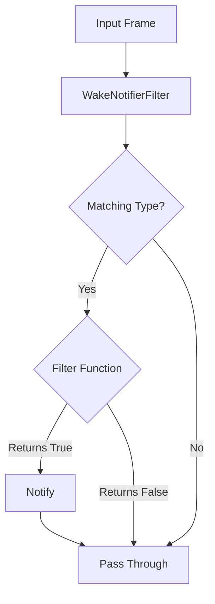

## Notes

* Acts as a transparent pass-through for all frames
* Can trigger external events without modifying pipeline flow
* Useful for signaling between pipeline components
* Can monitor for multiple frame types simultaneously
* Uses async filter function for complex conditions
* Functions as a "listener" that doesn't affect the data stream
* Can be used for logging, analytics, or coordinating external systems


# Producer & Consumer Processors
Source: https://docs.pipecat.ai/server/utilities/frame/producer-consumer

Route frames between different parts of a pipeline, allowing selective frame sharing across parallel branches or within complex pipelines

## Overview

The Producer and Consumer processors work as a pair to route frames between different parts of a pipeline, particularly useful when working with [`ParallelPipeline`](/server/pipeline/parallel-pipeline). They allow you to selectively capture frames from one pipeline branch and inject them into another.

## ProducerProcessor

`ProducerProcessor` examines frames flowing through the pipeline, applies a filter to decide which frames to share, and optionally transforms these frames before sending them to connected consumers.

### Constructor Parameters

<ParamField path="filter" type="Callable[[Frame], Awaitable[bool]]" required>
  An async function that determines which frames should be sent to consumers.
  Should return `True` for frames to be shared.
</ParamField>

<ParamField path="transformer" type="Callable[[Frame], Awaitable[Frame]]" default="identity_transformer">
  Optional async function that transforms frames before sending to consumers. By
  default, passes frames unchanged.
</ParamField>

<ParamField path="passthrough" type="bool" default="True">
  When `True`, passes all frames through the normal pipeline flow. When `False`,
  only passes through frames that don't match the filter.
</ParamField>

## ConsumerProcessor

`ConsumerProcessor` receives frames from a `ProducerProcessor` and injects them into its pipeline branch.

### Constructor Parameters

<ParamField path="producer" type="ProducerProcessor" required>
  The producer processor that will send frames to this consumer.
</ParamField>

<ParamField path="transformer" type="Callable[[Frame], Awaitable[Frame]]" default="identity_transformer">
  Optional async function that transforms frames before injecting them into the
  pipeline.
</ParamField>

<ParamField path="direction" type="FrameDirection" default="FrameDirection.DOWNSTREAM">
  The direction in which to push received frames. Usually `DOWNSTREAM` to send
  frames forward in the pipeline.
</ParamField>

## Usage Examples

### Basic Usage: Moving TTS Audio Between Branches

```python
# Create a producer that captures TTS audio frames
async def is_tts_audio(frame: Frame) -> bool:
    return isinstance(frame, TTSAudioRawFrame)

# Define an async transformer function
async def tts_to_input_audio_transformer(frame: Frame) -> Frame:
    if isinstance(frame, TTSAudioRawFrame):
        # Convert TTS audio to input audio format
        return InputAudioRawFrame(
            audio=frame.audio,
            sample_rate=frame.sample_rate,
            num_channels=frame.num_channels
        )
    return frame

producer = ProducerProcessor(
    filter=is_tts_audio,
    transformer=tts_to_input_audio_transformer
    passthrough=True  # Keep these frames in original pipeline
)

# Create a consumer to receive the frames
consumer = ConsumerProcessor(
    producer=producer,
    direction=FrameDirection.DOWNSTREAM
)

# Use in a ParallelPipeline
pipeline = Pipeline([
    transport.input(),
    ParallelPipeline(
        # Branch 1: LLM for bot responses
        [
            llm,
            tts,
            producer,  # Capture TTS audio here
        ],
        # Branch 2: Audio processing branch
        [
            consumer,  # Receive TTS audio here
            llm, # Speech-to-Speech LLM (audio in)
        ]
    ),
    transport.output(),
])
```


# Interruption Strategies
Source: https://docs.pipecat.ai/server/utilities/interruption-strategies

Configure when users can interrupt the bot to prevent unwanted interruptions from brief affirmations

## Overview

Interruption strategies allow you to control when users can interrupt the bot during speech. By default, any user speech immediately interrupts the bot, but this can be problematic when users engage in backchanneling—brief vocal responses like "yeah", "okay", or "mm-hmm" that indicate they're listening without intending to interrupt.

With interruption strategies, you can require users to meet specific criteria (such as speaking a minimum number of words or reaching a certain audio volume) before their speech will interrupt the bot, creating a more natural conversation flow.

<Tip>
  Want to try it out? Check out the [interruption strategies foundational
  demo](https://github.com/pipecat-ai/pipecat/blob/main/examples/foundational/42-interruption-config.py)
</Tip>

## Configuration

Interruption strategies are configured via the `interruption_strategies` parameter in `PipelineParams`. When specified, the normal immediate interruption behavior is replaced with conditional interruption based on your criteria.

<ParamField path="interruption_strategies" type="List[BaseInterruptionStrategy]" default="[]">
  List of interruption strategies to apply. When multiple strategies are
  provided, the first one that evaluates to true will trigger the interruption.
  If empty, normal interruption behavior applies.
</ParamField>

## Base Strategy Interface

All interruption strategies inherit from `BaseInterruptionStrategy`, which provides a common interface for evaluating interruption conditions.

<ParamField path="append_audio(audio, sample_rate)" type="async method">
  Appends audio data to the strategy for analysis. Not all strategies handle
  audio.
</ParamField>

<ParamField path="append_text(text)" type="async method">
  Appends text to the strategy for analysis. Not all strategies handle text.
</ParamField>

<ParamField path="should_interrupt()" type="async method">
  Called when the user stops speaking to determine if interruption should occur
  based on accumulated audio and/or text.
</ParamField>

<ParamField path="reset()" type="async method">
  Resets accumulated text and/or audio data.
</ParamField>

## Available Strategies

### MinWordsInterruptionStrategy

Requires users to speak a minimum number of words before interrupting the bot.

<ParamField path="min_words" type="int" required>
  Minimum number of words the user must speak to interrupt the bot. Must be
  greater than 0.
</ParamField>

```python
from pipecat.audio.interruptions.min_words_interruption_strategy import MinWordsInterruptionStrategy

strategy = MinWordsInterruptionStrategy(min_words=3)
```

## How It Works

When interruption strategies are configured:

1. **Bot not speaking**: User speech interrupts immediately (normal behavior)
2. **Bot speaking**: User speech and audio are collected and fed to strategies
3. **User stops speaking**: Strategies are evaluated in order
4. **First match wins**: The first strategy that returns `True` triggers interruption
5. **No matches**: User speech is discarded

The system automatically handles both audio and text input:

* Audio frames (`InputAudioRawFrame`) are fed to `append_audio()`
* Transcription text is fed to `append_text()`
* Strategies can use either or both data types

## Usage Examples

### Basic Word Count Interruption

Require users to speak at least 3 words to interrupt the bot:

```python
from pipecat.audio.interruptions.min_words_interruption_strategy import MinWordsInterruptionStrategy
from pipecat.pipeline.task import PipelineParams, PipelineTask

task = PipelineTask(
    pipeline,
    params=PipelineParams(
        allow_interruptions=True,
        interruption_strategies=[MinWordsInterruptionStrategy(min_words=3)]
    )
)
```

### Multiple Strategies with Priority

Strategies are evaluated in order, with the first match triggering interruption:

```python
# Prioritize word count, then volume (hypothetical future strategy)
task = PipelineTask(
    pipeline,
    params=PipelineParams(
        allow_interruptions=True,
        interruption_strategies=[
            MinWordsInterruptionStrategy(min_words=2),        # Check first
            # VolumeInterruptionStrategy(min_volume=0.8),     # Your custom strategy
        ]
    )
)
```

## Behavior Comparison

| Scenario                                      | Without Strategy         | With MinWordsInterruptionStrategy(min\_words=3) |
| --------------------------------------------- | ------------------------ | ----------------------------------------------- |
| User says "okay" while bot speaks             | ✅ Interrupts immediately | ❌ Ignored (only 1 word)                         |
| User says "yes that's right" while bot speaks | ✅ Interrupts immediately | ✅ Interrupts (3 words)                          |
| User speaks while bot is silent               | ✅ Processed immediately  | ✅ Processed immediately                         |

## Notes

* Interruption strategies only affect behavior when the bot is actively speaking
* When the bot is not speaking, user input is processed immediately regardless of strategy configuration
* The `allow_interruptions` parameter must be `True` for interruption strategies to work
* User speech that doesn't meet interruption criteria is discarded, not queued
* Strategies are evaluated in order - first match wins
* Both audio and text data are automatically fed to strategies based on their implementation
* Word counting uses simple whitespace splitting for word boundaries


# MCPClient
Source: https://docs.pipecat.ai/server/utilities/mcp/mcp

Service to connect to MCP (Model Context Protocol) servers

## Overview

MCP is an open standard for enabling AI agents to interact with external data and tools. `MCPClient` provides a way to access and call tools via MCP. For example, instead of writing bespoke function call implementations for an external API, you may use an MCP server that provides a bridge to the API. *Be aware there may be security implications.* See [MCP documenation](https://github.com/modelcontextprotocol) for more details.

## Installation

To use `MCPClient`, install the required dependencies:

```bash
pip install "pipecat-ai[mcp]"
```

You may also need to set environment variables as required by the specific MCP server to which you are connecting.

## Configuration

### Constructor Parameters

You can connect to your MCP server via Stdio or SSE transport. See [here](https://modelcontextprotocol.io/docs/concepts/transports#built-in-transport-types) for more documentation on MCP transports.

<ParamField path="server_params" type="str | StdioServerParameters" required>
  You can provide either:

  * URL: "[https://your.mcp.server/sse](https://your.mcp.server/sse)"
  * StdioServerParameters, which are defined as:

  ```python
    StdioServerParameters(
          command="python",  # Executable
          args=["example_server.py"],  # Optional command line arguments
          env=None,  # Optional environment variables
      )
  ```
</ParamField>

### Input Parameters

See more information regarding server params [here](https://github.com/modelcontextprotocol/python-sdk?tab=readme-ov-file#writing-mcp-clients).

## Usage Example

### MCP Stdio Transport Implementation

```python

# Import MCPClient and StdioServerParameters
...
from mcp import StdioServerParameters
from pipecat.services.mcp_service import MCPClient
...

# Initialize an LLM
llm = ...

# Initialize and configure MCPClient with server parameters
mcp = MCPClient(
        server_params=StdioServerParameters(
            command=shutil.which("npx"),
            args=["-y", "@name/mcp-server-name@latest"],
            env={"ENV_API_KEY": "<env_api_key>"},
        )
    )

# Create tools schema from the MCP server and register them with llm
tools = await mcp.register_tools(llm)

# Create context with system message and tools
# Tip: Let the LLM know it has access to tools from an MCP server by including it in the system prompt.
context = OpenAILLMContext(
    messages=[
        {
            "role": "system",
            "content": "You are a helpful assistant in a voice conversation. You have access to MCP tools. Keep responses concise."
        }
    ],
    tools=tools
)
```

### MCP SSE Transport Implementation

```python

# Import MCPClient
...
from pipecat.services.mcp_service import MCPClient
...

# Initialize an LLM
llm = ...

# Initialize and configure MCPClient with MCP SSE server url
mcp = MCPClient(server_params="https://your.mcp.server/sse")

# Create tools schema from the MCP server and register them with llm
tools = await mcp.register_tools(llm)

# Create context with system message and tools
# Tip: Let the LLM know it has access to tools from an MCP server by including it in the system prompt.
context = OpenAILLMContext(
    messages=[
        {
            "role": "system",
            "content": "You are a helpful assistant in a voice conversation. You have access to MCP tools. Keep responses concise."
        }
    ],
    tools=tools
)
```

## Methods

<ResponseField name="register_tools" type="async method">
  Converts MCP tools to Pipecat-friendly function definitions and registers the
  functions with the llm.
</ResponseField>

```python
async def register_tools(self, llm) -> ToolsSchema:
```

## Additional documentation

<Note>
  See [MCP's docs](https://github.com/modelcontextprotocol/python-sdk) for MCP
  related updates.
</Note>


# Debug Log Observer
Source: https://docs.pipecat.ai/server/utilities/observers/debug-observer

Comprehensive frame logging with configurable filtering in Pipecat

The `DebugLogObserver` provides detailed logging of frame activity in your Pipecat pipeline, with full visibility into frame content and flexible filtering options.

## Features

* Log all frame types and their content
* Filter by specific frame types
* Filter by source or destination components
* Automatic formatting of frame fields
* Special handling for complex data structures

## Usage

### Log All Frames

Log all frames passing through the pipeline:

```python
from pipecat.observers.loggers.debug_log_observer import DebugLogObserver

task = PipelineTask(
    pipeline,
    params=PipelineParams(
        observers=[DebugLogObserver()],
    ),
)
```

### Filter by Frame Types

Log only specific frame types:

```python
from pipecat.frames.frames import TranscriptionFrame, InterimTranscriptionFrame
from pipecat.observers.loggers.debug_log_observer import DebugLogObserver

task = PipelineTask(
    pipeline,
    params=PipelineParams(
        observers=[
            DebugLogObserver(frame_types=(
                TranscriptionFrame,
                InterimTranscriptionFrame
            ))
        ],
    ),
)
```

### Advanced Source/Destination Filtering

Filter frames based on their type and source/destination:

```python
from pipecat.frames.frames import StartInterruptionFrame, UserStartedSpeakingFrame, LLMTextFrame
from pipecat.observers.loggers.debug_log_observer import DebugLogObserver, FrameEndpoint
from pipecat.transports.base_output_transport import BaseOutputTransport
from pipecat.services.stt_service import STTService

task = PipelineTask(
    pipeline,
    params=PipelineParams(
        observers=[
            DebugLogObserver(frame_types={
                # Only log StartInterruptionFrame when source is BaseOutputTransport
                StartInterruptionFrame: (BaseOutputTransport, FrameEndpoint.SOURCE),

                # Only log UserStartedSpeakingFrame when destination is STTService
                UserStartedSpeakingFrame: (STTService, FrameEndpoint.DESTINATION),

                # Log LLMTextFrame regardless of source or destination
                LLMTextFrame: None
            })
        ],
    ),
)
```

## Log Output Format

The observer logs each frame with its complete details:

```
[Source] → [Destination]: [FrameType] [field1: value1, field2: value2, ...] at [timestamp]s
```

For example:

```
OpenAILLMService#0 → DailyTransport#0: LLMTextFrame text: 'Hello, how can I help you today?' at 1.24s
```

## Configuration Options

| Parameter        | Type                                                                                   | Description                                                     |
| ---------------- | -------------------------------------------------------------------------------------- | --------------------------------------------------------------- |
| `frame_types`    | `Tuple[Type[Frame], ...]` or `Dict[Type[Frame], Optional[Tuple[Type, FrameEndpoint]]]` | Frame types to log, with optional source/destination filtering  |
| `exclude_fields` | `Set[str]`                                                                             | Field names to exclude from logging (defaults to binary fields) |

## FrameEndpoint Enum

The `FrameEndpoint` enum is used for source/destination filtering:

* `FrameEndpoint.SOURCE`: Filter by source component
* `FrameEndpoint.DESTINATION`: Filter by destination component


# LLM Log Observer
Source: https://docs.pipecat.ai/server/utilities/observers/llm-observer

Logging LLM activity in Pipecat

The `LLMLogObserver` provides detailed logging of Large Language Model (LLM) activity within your Pipecat pipeline. It tracks the entire lifecycle of LLM interactions, from initial prompts to final responses.

## Frame Types Monitored

The observer tracks the following frame types (only from/to LLM service):

* **LLMFullResponseStartFrame**: When the LLM begins generating a response
* **LLMFullResponseEndFrame**: When the LLM completes its response
* **LLMTextFrame**: Individual text chunks generated by the LLM
* **FunctionCallInProgressFrame**: Function/tool calls made by the LLM
* **LLMMessagesFrame**: Input messages sent to the LLM
* **OpenAILLMContextFrame**: Context information for OpenAI LLM calls
* **FunctionCallResultFrame**: Results returned from function calls

## Usage

```python
from pipecat.observers.loggers.llm_log_observer import LLMLogObserver

task = PipelineTask(
    pipeline,
    params=PipelineParams(
        observers=[LLMLogObserver()],
    ),
)
```

## Log Output Format

The observer uses emojis and consistent formatting for easy log reading:

* 🧠 \[Source] → LLM START/END RESPONSE
* 🧠 \[Source] → LLM GENERATING: \[text]
* 🧠 \[Source] → LLM FUNCTION CALL: \[details]
* 🧠 → \[Destination] LLM MESSAGES FRAME: \[messages]
* 🧠 → \[Destination] LLM CONTEXT FRAME: \[context]

All log entries include timestamps for precise timing analysis.


# Observer Pattern
Source: https://docs.pipecat.ai/server/utilities/observers/observer-pattern

Understanding and implementing observers in Pipecat

The Observer pattern in Pipecat allows non-intrusive monitoring of frames as they flow through the pipeline. Observers can watch frame traffic without affecting the pipeline's core functionality.

## Base Observer

All observers must inherit from `BaseObserver` and implement the `on_push_frame` method:

```python
from pipecat.observers.base_observer import BaseObserver

class CustomObserver(BaseObserver):
    async def on_push_frame(
        self,
        src: FrameProcessor,
        dst: FrameProcessor,
        frame: Frame,
        direction: FrameDirection,
        timestamp: int,
    ):
        # Your frame observation logic here
        pass
```

## Available Observers

Pipecat provides several built-in observers:

* **LLMLogObserver**: Logs LLM activity and responses
* **TranscriptionLogObserver**: Logs speech-to-text transcription events
* **RTVIObserver**: Converts internal frames to RTVI protocol messages for server to client messaging

## Using Multiple Observers

You can attach multiple observers to a pipeline task. Each observer will be notified of all frames:

```python
task = PipelineTask(
    pipeline,
    params=PipelineParams(
        observers=[LLMLogObserver(), TranscriptionLogObserver(), CustomObserver()],
    ),
)
```

## Example: Debug Observer

Here's an example observer that logs interruptions and bot speaking events:

```python
class DebugObserver(BaseObserver):
    """Observer to log interruptions and bot speaking events to the console.

    Logs all frame instances of:
    - StartInterruptionFrame
    - BotStartedSpeakingFrame
    - BotStoppedSpeakingFrame

    This allows you to see the frame flow from processor to processor through the pipeline for these frames.
    Log format: [EVENT TYPE]: [source processor] → [destination processor] at [timestamp]s
    """

    async def on_push_frame(
        self,
        src: FrameProcessor,
        dst: FrameProcessor,
        frame: Frame,
        direction: FrameDirection,
        timestamp: int,
    ):
        time_sec = timestamp / 1_000_000_000
        arrow = "→" if direction == FrameDirection.DOWNSTREAM else "←"

        if isinstance(frame, StartInterruptionFrame):
            logger.info(f"⚡ INTERRUPTION START: {src} {arrow} {dst} at {time_sec:.2f}s")
        elif isinstance(frame, BotStartedSpeakingFrame):
            logger.info(f"🤖 BOT START SPEAKING: {src} {arrow} {dst} at {time_sec:.2f}s")
        elif isinstance(frame, BotStoppedSpeakingFrame):
            logger.info(f"🤖 BOT STOP SPEAKING: {src} {arrow} {dst} at {time_sec:.2f}s")
```

## Common Use Cases

Observers are particularly useful for:

* Debugging frame flow
* Logging specific events
* Monitoring pipeline behavior
* Collecting metrics
* Converting internal frames to external messages


# Transcription Log Observer
Source: https://docs.pipecat.ai/server/utilities/observers/transcription-observer

Logging speech-to-text transcription activity in Pipecat

The `TranscriptionLogObserver` logs all speech-to-text transcription activity in your Pipecat pipeline, providing visibility into both final and interim transcription results.

## Frame Types Monitored

The observer tracks the following frame types (only from STT service):

* **TranscriptionFrame**: Final transcription results
* **InterimTranscriptionFrame**: In-progress transcription results

## Usage

```python
from pipecat.observers.loggers.transcription_log_observer import TranscriptionLogObserver

task = PipelineTask(
    pipeline,
    params=PipelineParams(
        observers=[TranscriptionLogObserver()],
    ),
)
```

## Log Output Format

The observer uses consistent formatting with emoji indicators:

* 💬 \[Source] → TRANSCRIPTION: \[text] from \[user\_id]
* 💬 \[Source] → INTERIM TRANSCRIPTION: \[text] from \[user\_id]

All log entries include timestamps for precise timing analysis.


# Turn Tracking Observer
Source: https://docs.pipecat.ai/server/utilities/observers/turn-tracking-observer

Track conversation turns and events in your Pipecat pipeline

The `TurnTrackingObserver` monitors and tracks conversational turns in your Pipecat pipeline, providing events when turns start and end. It intelligently identifies when a user-bot interaction cycle begins and completes.

## Turn Lifecycle

A turn represents a complete user-bot interaction cycle:

1. **Start**: When the user starts speaking (or pipeline starts for first turn)
2. **Processing**: User speaks, bot processes and responds
3. **End**: After the bot finishes speaking and either:
   * The user starts speaking again
   * A timeout period elapses with no further activity

## Events

The observer emits two main events:

* **`on_turn_started`**: When a new turn begins
  * Parameters: `turn_number` (int)
* **`on_turn_ended`**: When a turn completes
  * Parameters: `turn_number` (int), `duration` (float, in seconds), `was_interrupted` (bool)

## Usage

The observer is automatically created when you initialize a `PipelineTask` with `enable_turn_tracking=True` (which is the default):

```python
task = PipelineTask(
    pipeline,
    params=PipelineParams(allow_interruptions=True),
    # Turn tracking is enabled by default
)

# Access the observer
turn_observer = task.turn_tracking_observer

# Register event handlers
@turn_observer.event_handler("on_turn_started")
async def on_turn_started(observer, turn_number):
    logger.info(f"Turn {turn_number} started")

@turn_observer.event_handler("on_turn_ended")
async def on_turn_ended(observer, turn_number, duration, was_interrupted):
    status = "interrupted" if was_interrupted else "completed"
    logger.info(f"Turn {turn_number} {status} in {duration:.2f}s")
```

## Configuration

You can configure the observer's behavior when creating a `PipelineTask`:

```python
from pipecat.observers.turn_tracking_observer import TurnTrackingObserver

# Create a custom observer instance
custom_turn_tracker = TurnTrackingObserver(
    turn_end_timeout_secs=3.5,     # Turn end timeout (default: 2.5)
)

# Add it as a regular observer
task = PipelineTask(
    pipeline,
    observers=[custom_turn_tracker],
    # Disable the default one if adding your own
    enable_turn_tracking=False,
)
```

## Interruptions

The observer automatically detects interruptions when the user starts speaking while the bot is still speaking. In this case:

* The current turn is marked as interrupted (`was_interrupted=True`)
* A new turn begins immediately

## How It Works

The observer monitors specific frame types to track conversation flow:

* **StartFrame**: Initiates the first turn
* **UserStartedSpeakingFrame**: Starts user speech or triggers a new turn
* **BotStartedSpeakingFrame**: Marks bot speech beginning
* **BotStoppedSpeakingFrame**: Starts the turn end timeout

After a bot stops speaking, the observer waits for the configured timeout period. If no further bot speech occurs, the turn ends; otherwise, it continues as part of the same turn.

## Use Cases

* **Analytics**: Measure turn durations, interruption rates, and conversation flow
* **Logging**: Record turn-based logs for diagnostics and analysis
* **Visualization**: Show turn-based conversation timelines in UIs
* **Tracing**: Group spans and metrics by conversation turns


# User-Bot Latency Observer
Source: https://docs.pipecat.ai/server/utilities/observers/user-bot-latency-observer

Measure response time between user speech and bot responses in Pipecat

The `UserBotLatencyLogObserver` measures the time between when a user stops speaking and when the bot starts responding, providing metrics for conversational AI performance optimization.

## Features

* Tracks user speech start/stop timing
* Measures bot response latency
* Calculates statistics: average, minimum, maximum
* Provides real-time latency logging
* Automatically resets between conversation turns

## Usage

### Basic Latency Monitoring

Add latency monitoring to your pipeline:

```python
from pipecat.observers.loggers.user_bot_latency_log_observer import UserBotLatencyLogObserver

task = PipelineTask(
    pipeline,
    params=PipelineParams(
        observers=[UserBotLatencyLogObserver()],
    ),
)
```

## How It Works

The observer tracks conversation flow through these key events:

1. **User starts speaking** → Resets latency tracking
2. **User stops speaking** → Records timestamp
3. **Bot starts speaking** → Calculates and logs latency
4. **Pipeline ends** → Reports session latency statistics

## Log Output

### Real-time Latency Logs

During conversation, each response latency is logged:

```
⏱️ LATENCY FROM USER STOPPED SPEAKING TO BOT STARTED SPEAKING: 1.234s
```

### Final Statistics

When the pipeline ends, comprehensive statistics are reported:

```
⏱️ LATENCY FROM USER STOPPED SPEAKING TO BOT STARTED SPEAKING - Avg: 1.456s, Min: 0.892s, Max: 2.103s
```

## Limitations

* Only measures speech-to-speech latency (not text processing time)
* Requires proper frame sequencing to work accurately


# OpenTelemetry Tracing
Source: https://docs.pipecat.ai/server/utilities/opentelemetry

Monitor and analyze your Pipecat conversational pipelines using OpenTelemetry

## Overview

Pipecat includes built-in support for OpenTelemetry tracing, allowing you to gain deep visibility into your voice applications. Tracing helps you:

* Track latency and performance across your conversation pipeline
* Monitor service health and identify bottlenecks
* Visualize conversation turns and service dependencies
* Collect usage metrics and operational analytics

## Installation

To use OpenTelemetry tracing with Pipecat, install the tracing dependencies:

```bash
pip install "pipecat-ai[tracing]"
```

<Tip>
  For local development and testing, we recommend using Jaeger as a trace collector.
  You can run it with Docker:

  ```bash
  docker run -d --name jaeger \
    -p 16686:16686 \
    -p 4317:4317 \
    -p 4318:4318 \
    jaegertracing/all-in-one:latest
  ```

  Then access the UI at [http://localhost:16686](http://localhost:16686)
</Tip>

## Basic Setup

Enabling tracing in your Pipecat application requires two steps:

1. **Initialize the OpenTelemetry SDK** with your preferred exporter
2. **Enable tracing in your PipelineTask**

```python
import os
from opentelemetry.exporter.otlp.proto.grpc.trace_exporter import OTLPSpanExporter
from pipecat.utils.tracing.setup import setup_tracing
from pipecat.pipeline.task import PipelineTask, PipelineParams

# Step 1: Initialize OpenTelemetry with your chosen exporter
exporter = OTLPSpanExporter(
    endpoint="http://localhost:4317",  # Jaeger or other collector endpoint
    insecure=True,
)

setup_tracing(
    service_name="my-voice-app",
    exporter=exporter,
    console_export=False,  # Set to True for debug output
)

# Step 2: Enable tracing in your PipelineTask
task = PipelineTask(
    pipeline,
    params=PipelineParams(
        enable_metrics=True,                              # Required for some service metrics
    ),
    enable_tracing=True,                                  # Enable tracing for this task
    enable_turn_tracking=True,                            # Enable turn tracking for this task
    conversation_id="customer-123",                       # Optional - will auto-generate if not provided
    additional_span_attributes={"session.id": "abc-123"} # Optional - additional attributes to attach to the otel span
)
```

<Info>
  For complete working examples, see our sample implementations:

  * [Jaeger Tracing Example](https://github.com/pipecat-ai/pipecat-examples/tree/main/open-telemetry/jaeger) - Uses gRPC exporter with Jaeger
  * [Langfuse Tracing Example](https://github.com/pipecat-ai/pipecat-examples/tree/main/open-telemetry/langfuse) - Uses HTTP exporter with Langfuse for LLM-focused observability
</Info>

## Trace Structure

Pipecat organizes traces hierarchically, following the natural structure of conversations:

```
Conversation (conversation)
├── turn
│   ├── stt
│   ├── llm
│   └── tts
└── turn
    ├── stt
    ├── llm
    └── tts
    turn...
```

For real-time multimodal services like Gemini Live and OpenAI Realtime, the structure adapts to their specific patterns:

```
Conversation (conversation)
├── turn
│   ├── llm_setup (session configuration)
│   ├── stt (user input)
│   ├── llm_response (complete response with usage)
│   └── llm_tool_call/llm_tool_result (for function calls)
└── turn
    ├── stt (user input)
    └── llm_response (complete response)
    turn...
```

This hierarchical structure makes it easy to:

* Track the full lifecycle of a conversation
* Measure latency for individual turns
* Identify which services are contributing to delays
* Compare performance across different conversations

## Exporter Options

Pipecat supports any OpenTelemetry-compatible exporter. Common options include:

### OTLP Exporter (for Jaeger, Grafana, etc.)

```python
from opentelemetry.exporter.otlp.proto.grpc.trace_exporter import OTLPSpanExporter

exporter = OTLPSpanExporter(
    endpoint="http://localhost:4317",  # Your collector endpoint
    insecure=True,  # Use False for TLS connections
)
```

### HTTP OTLP Exporter (for Langfuse, etc.)

```python
from opentelemetry.exporter.otlp.proto.http.trace_exporter import OTLPSpanExporter

exporter = OTLPSpanExporter(
    # Configure with environment variables:
    # OTEL_EXPORTER_OTLP_ENDPOINT
    # OTEL_EXPORTER_OTLP_HEADERS
)
```

See our [Langfuse example](https://github.com/pipecat-ai/pipecat-examples/tree/main/open-telemetry/langfuse) for details on configuring this exporter.

### Console Exporter (for debugging)

The console exporter can be enabled alongside any other exporter by setting `console_export=True`:

```python
setup_tracing(
    service_name="my-voice-app",
    exporter=otlp_exporter,
    console_export=True,  # Prints traces to stdout
)
```

### Cloud Provider Exporters

Many cloud providers offer OpenTelemetry-compatible observability services:

* **AWS X-Ray**
* **Google Cloud Trace**
* **Azure Monitor**
* **Datadog APM**

Check the OpenTelemetry documentation for specific exporter configurations: [OpenTelemetry Vendors](https://opentelemetry.io/ecosystem/vendors/)

## Span Attributes

Pipecat enriches spans with detailed attributes about service operations:

### TTS Service Spans

* `gen_ai.system`: Service provider (e.g., "cartesia")
* `gen_ai.request.model`: Model ID/name
* `voice_id`: Voice identifier
* `text`: The text being synthesized
* `metrics.character_count`: Number of characters in the text
* `metrics.ttfb`: Time to first byte in seconds
* `settings.*`: Service-specific configuration parameters

### STT Service Spans

* `gen_ai.system`: Service provider (e.g., "deepgram")
* `gen_ai.request.model`: Model ID/name
* `transcript`: The transcribed text
* `is_final`: Whether the transcription is final
* `language`: Detected or configured language
* `vad_enabled`: Whether voice activity detection is enabled
* `metrics.ttfb`: Time to first byte in seconds
* `settings.*`: Service-specific configuration parameters

### LLM Service Spans

* `gen_ai.system`: Service provider (e.g., "openai", "gcp.gemini")
* `gen_ai.request.model`: Model ID/name
* `gen_ai.operation.name`: Operation type (e.g., "chat")
* `stream`: Whether streaming is enabled
* `input`: JSON-serialized input messages
* `output`: Complete response text
* `tools`: JSON-serialized tools configuration
* `tools.count`: Number of tools available
* `tools.names`: Comma-separated tool names
* `system`: System message content
* `gen_ai.usage.input_tokens`: Number of prompt tokens
* `gen_ai.usage.output_tokens`: Number of completion tokens
* `metrics.ttfb`: Time to first byte in seconds
* `gen_ai.request.*`: Standard parameters (temperature, max\_tokens, etc.)

### Multimodal Service Spans (Gemini Live & OpenAI Realtime)

#### Setup Spans

* `gen_ai.system`: "gcp.gemini" or "openai"
* `gen_ai.request.model`: Model identifier
* `tools.count`: Number of available tools
* `tools.definitions`: JSON-serialized tool schemas
* `system_instruction`: System prompt (truncated)
* `session.*`: Session configuration parameters

#### Request Spans (OpenAI Realtime)

* `input`: JSON-serialized context messages being sent
* `gen_ai.operation.name`: "llm\_request"

#### Response Spans

* `output`: Complete assistant response text
* `output_modality`: "TEXT" or "AUDIO" (Gemini Live)
* `gen_ai.usage.input_tokens`: Prompt tokens used
* `gen_ai.usage.output_tokens`: Completion tokens generated
* `function_calls.count`: Number of function calls made
* `function_calls.names`: Comma-separated function names
* `metrics.ttfb`: Time to first response in seconds

#### Tool Call/Result Spans (Gemini Live)

* `tool.function_name`: Name of the function being called
* `tool.call_id`: Unique identifier for the call
* `tool.arguments`: Function arguments (truncated)
* `tool.result`: Function execution result (truncated)
* `tool.result_status`: "completed", "error", or "parse\_error"

### Turn Spans

* `turn.number`: Sequential turn number
* `turn.type`: Type of turn (e.g., "conversation")
* `turn.duration_seconds`: Duration of the turn
* `turn.was_interrupted`: Whether the turn was interrupted
* `conversation.id`: ID of the parent conversation

### Conversation Spans

* `conversation.id`: Unique identifier for the conversation
* `conversation.type`: Type of conversation (e.g., "voice")

## Usage Metrics

Pipecat's tracing implementation automatically captures usage metrics for LLM and TTS services:

### LLM Token Usage

Token usage is captured in LLM spans as:

* `gen_ai.usage.input_tokens`
* `gen_ai.usage.output_tokens`

### TTS Character Count

Character count is captured in TTS spans as:

* `metrics.character_count`

## Performance Metrics

Pipecat traces capture key performance metrics for each service:

### Time To First Byte (TTFB)

The time it takes for a service to produce its first response:

* `metrics.ttfb` (in seconds)

### Processing Duration

The total time spent processing in each service is captured in the span duration.

## Configuration Options

### PipelineTask Parameters

<ParamField path="enable_tracing" type="bool" default="True">
  Enable or disable tracing for the pipeline
</ParamField>

<ParamField path="enable_turn_tracking" type="bool" default="False">
  Whether to enable turn tracking.
</ParamField>

<ParamField path="conversation_id" type="Optional[str]" default="None">
  Custom ID for the conversation. If not provided, a UUID will be generated
</ParamField>

<ParamField path="additional_span_attributes" type="Optional[dict]" default="None">
  Any additional attributes to add to top-level OpenTelemetry conversation span.
</ParamField>

### setup\_tracing() Parameters

<ParamField path="service_name" type="str" default="pipecat">
  Name of the service for traces
</ParamField>

<ParamField path="exporter" type="Optional[SpanExporter]" default="None">
  A pre-configured OpenTelemetry span exporter instance
</ParamField>

<ParamField path="console_export" type="bool" default="False">
  Whether to also export traces to console (useful for debugging)
</ParamField>

## Example

Here's a complete example showing OpenTelemetry tracing setup with Jaeger:

```python
import os
from dotenv import load_dotenv
from opentelemetry.exporter.otlp.proto.grpc.trace_exporter import OTLPSpanExporter

from pipecat.pipeline.pipeline import Pipeline
from pipecat.pipeline.task import PipelineParams, PipelineTask
from pipecat.services.deepgram.stt import DeepgramSTTService
from pipecat.services.openai.llm import OpenAILLMService
from pipecat.services.cartesia.tts import CartesiaTTSService
from pipecat.utils.tracing.setup import setup_tracing

load_dotenv()

# Initialize tracing if enabled
if os.getenv("ENABLE_TRACING"):
    # Create the exporter
    otlp_exporter = OTLPSpanExporter(
        endpoint=os.getenv("OTEL_EXPORTER_OTLP_ENDPOINT", "http://localhost:4317"),
        insecure=True,
    )

    # Set up tracing with the exporter
    setup_tracing(
        service_name="pipecat-demo",
        exporter=otlp_exporter,
        console_export=bool(os.getenv("OTEL_CONSOLE_EXPORT")),
    )

# Create your services
stt = DeepgramSTTService(api_key=os.getenv("DEEPGRAM_API_KEY"))
llm = OpenAILLMService(api_key=os.getenv("OPENAI_API_KEY"))
tts = CartesiaTTSService(
    api_key=os.getenv("CARTESIA_API_KEY"),
    voice_id="your-voice-id"
)

# Build pipeline
pipeline = Pipeline([
    transport.input(),
    stt,
    context_aggregator.user(),
    llm,
    tts,
    transport.output(),
    context_aggregator.assistant(),
])

# Create pipeline task with tracing enabled
task = PipelineTask(
    pipeline,
    params=PipelineParams(
        allow_interruptions=True,
        enable_metrics=True,
        enable_usage_metrics=True,
    ),
    enable_tracing=True,
    enable_turn_tracking=True,
    conversation_id="customer-123",                       # Optional - will auto-generate if not provided
    additional_span_attributes={"session.id": "abc-123"} # Optional - additional attributes to attach to the otel span
)

# Run the pipeline
runner = PipelineRunner()
await runner.run(task)
```

## Troubleshooting

If you're having issues with tracing:

* **No Traces Visible**: Ensure the OpenTelemetry packages are installed and that your collector endpoint is correct
* **Missing Service Data**: Verify that `enable_metrics=True` is set in PipelineParams
* **Debugging Tracing**: Enable console export with `console_export=True` to view traces in your logs
* **Connection Errors**: Check network connectivity to your trace collector
* **Collector Configuration**: Verify your collector is properly set up to receive traces

## References

* [OpenTelemetry Python Documentation](https://opentelemetry-python.readthedocs.io/)
* [OpenTelemetry Tracing Specification](https://opentelemetry.io/docs/reference/specification/trace/api/)
* [Jaeger Documentation](https://www.jaegertracing.io/docs/latest/)
* [Langfuse OpenTelemetry Documentation](https://langfuse.com/docs/opentelemetry/get-started)


# Development Runner
Source: https://docs.pipecat.ai/server/utilities/runner/guide

Unified runner for building voice AI bots with Daily, WebRTC, and telephony transports

## Overview

The Pipecat development runner provides a unified way to run voice AI bots across multiple transport types. It handles infrastructure setup - creating Daily rooms, managing WebRTC connections, and routing telephony calls.

## Installation

```bash
pip install pipecat-ai[runner]
```

## What is a Runner?

A runner in Pipecat refers to a "bot runner", an HTTP service that provides a gateway for spawning bots on-demand. It's the component that enables your bot to run by providing it with server infrastructure and connection details like rooms and tokens.

A bot runner typically creates transport sessions (like Daily WebRTC rooms), generates authentication tokens for both bots and users, spawns new bot processes when users request sessions, and manages bot lifecycle and cleanup. Think of it as the bridge between incoming user connections and your bot logic.

## How the Development Runner Works

The development runner operates as a FastAPI web server that automatically discovers and executes your bot code. When you start the runner, it creates the necessary web endpoints and infrastructure for your chosen transport type.

* **WebRTC connections**: It serves a built-in web interface where users can connect directly as well as an endpoint to create new WebRTC sessions
* **Daily integration**: It provides endpoints that create new rooms and tokens and redirect users to join them
* **Telephony providers**: For Twilio, it sets up webhook endpoints that handle incoming calls and establish WebSocket connections for audio streaming

The runner automatically detects which transport type you're using and configures the appropriate infrastructure. It then discovers your bot function and spawns new instances whenever users connect. This means you can focus on writing your bot logic while the runner handles all the server infrastructure, connection management, and transport-specific details.

Your bot code receives runner arguments that contain everything it needs, including Daily room URLs and tokens, WebRTC connections, or WebSocket streams for telephony. The runner abstracts away the complexity of managing these different connection types, providing a unified interface for building bots that work across multiple platforms.

## Pipecat Cloud Ready

The bot runner is designed to be cloud-ready, meaning that you can run the same bot code locally and deployed to Pipecat Cloud without any modifications. It automatically handles the differences in transport setup, providing you with the flexibility to test locally using a free transport, like SmallWebRTCTransport, but run in production using Daily or telephony transports.

## Building with the Runner

Now let's build a practical example to see how this works. The key insight is that your bot code is structured into two parts: the core bot logic that works with any transport, and the entry point that creates the appropriate transport based on the runner arguments.

Here's the basic structure:

```python
# Your imports
from pipecat.audio.vad.silero import SileroVADAnalyzer
from pipecat.runner.types import RunnerArguments
from pipecat.transports.base_transport import BaseTransport, TransportParams
from pipecat.transports.network.small_webrtc import SmallWebRTCTransport

async def run_bot(transport: BaseTransport):
    """Your core bot logic here:
    - Define services (STT, TTS, LLM)
    - Initialize messages and context
    - Create the pipeline
    - Add event handlers
    - Run the pipeline
    """

    # Your bot logic goes here
    # Define STT, LLM, TTS...
    # ...
    # Run your pipeline
    await runner.run(task)

async def bot(runner_args: RunnerArguments):
    """Main bot entry point compatible for local dev and Pipecat Cloud."""
    transport = SmallWebRTCTransport(
        params=TransportParams(
            audio_in_enabled=True,
            audio_out_enabled=True,
            vad_analyzer=SileroVADAnalyzer(),
        ),
        webrtc_connection=runner_args.webrtc_connection,
    )

    await run_bot(transport)

if __name__ == "__main__":
    from pipecat.runner.run import main
    main()
```

The `run_bot()` function contains your actual bot logic and is transport-agnostic. The `bot()` function is the entry point that the runner calls - it creates the appropriate transport and passes it to your bot logic. This separation allows the same bot code to work across different transports.

When you run this with `python bot.py`, the development runner starts a web server and opens a browser interface at `http://localhost:7860/client`. Each time someone connects, the runner calls your `bot()` function with WebRTC runner arguments.

## Supporting Multiple Transports

To make your bot work across different platforms, you can detect the transport type from the runner arguments and create the appropriate transport. Here's how to support both Daily and WebRTC:

```python
from pipecat.runner.types import DailyRunnerArguments, RunnerArguments, SmallWebRTCRunnerArguments

async def bot(runner_args: RunnerArguments):
    """Main bot entry point compatible with Pipecat Cloud."""

    transport = None

    if isinstance(runner_args, DailyRunnerArguments):
        from pipecat.transports.services.daily import DailyParams, DailyTransport

        transport = DailyTransport(
            runner_args.room_url,
            runner_args.token,
            "Pipecat Bot",
            params=DailyParams(
                audio_in_enabled=True,
                audio_out_enabled=True,
                vad_analyzer=SileroVADAnalyzer(),
            ),
        )

    elif isinstance(runner_args, SmallWebRTCRunnerArguments):
        from pipecat.transports.base_transport import TransportParams
        from pipecat.transports.network.small_webrtc import SmallWebRTCTransport

        transport = SmallWebRTCTransport(
            params=TransportParams(
                audio_in_enabled=True,
                audio_out_enabled=True,
                vad_analyzer=SileroVADAnalyzer(),
            ),
            webrtc_connection=runner_args.webrtc_connection,
        )

    else:
        logger.error(f"Unsupported runner arguments type: {type(runner_args)}")
        return

    if transport is None:
        logger.error("Failed to create transport")
        return

    await run_bot(transport)

if __name__ == "__main__":
    from pipecat.runner.run import main
    main()
```

Now you can run your bot with different transports:

```bash
python bot.py -t webrtc  # Uses SmallWebRTCRunnerArguments
python bot.py -t daily   # Uses DailyRunnerArguments
```

### Understanding Runner Arguments

Runner arguments are how the runner communicates transport-specific information to your bot. The runner determines which transport to use based on the command-line arguments, then creates the appropriate runner arguments:

* **`DailyRunnerArguments`**: Contains `room_url`, `token` (Optional), `body` (Optional) for joining Daily rooms
* **`SmallWebRTCRunnerArguments`**: Contains `webrtc_connection` for local WebRTC sessions
* **`WebSocketRunnerArguments`**: Contains `websocket` for telephony connections

All runner arguments also include:

* **`handle_sigint`**: Whether the bot should handle SIGINT (Ctrl+C) signals (managed automatically)
* **`handle_sigterm`**: Whether the bot should handle SIGTERM signals (managed automatically)

<Warning>
  `handle_sigint` and `handle_sigterm` are development only features and cannot
  be used when deploying to Pipecat Cloud.
</Warning>

The runner handles all the complex setup - creating Daily rooms, generating tokens, establishing WebSocket connections - and provides your bot with everything it needs through these runner arguments.

Notice how we use lazy imports (`from pipecat.transports.services.daily import ...`) inside the conditional blocks. This ensures that transport-specific dependencies are only required when that transport is actually used, making your bot more portable.

<Info>
  `RunnerArguments` is the base class for all runner arguments. It provides a
  common interface for the runner to pass transport-specific information to your
  bot.
</Info>

## Environment Detection

When building bots that work both locally and in production, you often need to detect the execution environment to enable different features. The development runner sets the `ENV` environment variable to help with this:

```python
import os

async def bot(runner_args: RunnerArguments):
    # Check if running in local development environment
    is_local = os.environ.get("ENV") == "local"

    # Enable production features only when deployed
    if not is_local:
        from pipecat.audio.filters.krisp_filter import KrispFilter
        krisp_filter = KrispFilter()
    else:
        krisp_filter = None

    transport = DailyTransport(
        runner_args.room_url,
        runner_args.token,
        "Pipecat Bot",
        params=DailyParams(
            audio_in_filter=krisp_filter,  # Krisp filter only in production
            audio_in_enabled=True,
            audio_out_enabled=True,
            vad_analyzer=SileroVADAnalyzer(),
        ),
    )
```

### Environment Values

The development runner automatically sets environment variables based on how your bot is running:

* **Local development**: `ENV=local` (set by the development runner)
* **Production/Cloud deployment**: `ENV` is not set or has a different value

This allows you to easily customize behavior between development and production environments:

## All Supported Transports

The development runner supports five transport types, each designed for different use cases:

### WebRTC (`-t webrtc`)

Local WebRTC connections with a built-in browser interface. Perfect for development and testing.

```bash
python bot.py -t webrtc
# Opens http://localhost:7860/client

# ESP32 compatibility mode
python bot.py -t webrtc --esp32 --host 192.168.1.100
```

**Runner Arguments**: `SmallWebRTCRunnerArguments`

* `webrtc_connection`: Pre-configured WebRTC peer connection

### Daily (`-t daily`)

Integration with Daily for production video conferencing with rooms, participant management, and Pipecat client compatibility.

```bash
python bot.py -t daily
# Opens http://localhost:7860 with room creation interface
# Also provides POST /start endpoint for Pipecat clients

# Direct connection for testing (bypasses web server)
python bot.py -d
```

**Runner Arguments**: `DailyRunnerArguments`

* `room_url`: Daily room URL to join
* `token`: Authentication token for the room
* `body`: Request data from /start endpoint (dict)

**Available Endpoints**:

* `GET /`: Web interface for creating rooms
* `POST /start`: RTVI-compatible endpoint for programmatic access

### Telephony (`-t twilio|telnyx|plivo`)

Phone call integration through telephony providers. Requires a public webhook endpoint and provider credentials.

```bash
# Set up environment variables first
export TWILIO_ACCOUNT_SID=your_account_sid
export TWILIO_AUTH_TOKEN=your_auth_token

# Then run with public proxy
python bot.py -t twilio -x yourproxy.ngrok.io
```

**Environment Variables**:

* Twilio: `TWILIO_ACCOUNT_SID`, `TWILIO_AUTH_TOKEN`
* Telnyx: `TELNYX_API_KEY`
* Plivo: `PLIVO_AUTH_ID`, `PLIVO_AUTH_TOKEN`

Environment variables are optional, but when provided will attempt to hang up the call when the session ends.

**Runner Arguments**: `WebSocketRunnerArguments`

* `websocket`: WebSocket connection for audio streaming

The runner automatically detects the telephony provider from incoming WebSocket messages and configures the appropriate serializers and audio settings. Your bot receives a pre-configured FastAPI WebSocket connection ready for telephony audio streaming.

## Command Line Options

The development runner accepts several command-line arguments to customize its behavior:

```bash
python bot.py [OPTIONS]

Options:
  --host TEXT          Server host address (default: localhost)
  --port INTEGER       Server port (default: 7860)
  -t, --transport      Transport type: daily, webrtc, twilio, telnyx, plivo (default: webrtc)
  -x, --proxy TEXT     Public proxy hostname for telephony webhooks (required for telephony)
  --esp32              Enable SDP munging for ESP32 WebRTC compatibility
  -d, --direct         Connect directly to Daily room for testing (automatically sets transport to daily)
  -v, --verbose        Increase logging verbosity
```

### Key Arguments

**`--transport` / `-t`**: Determines which transport infrastructure to set up

* `webrtc`: Local WebRTC with browser interface
* `daily`: Daily.co integration with room management
* `twilio`, `telnyx`, `plivo`: Telephony provider integration

**`--proxy` / `-x`**: Required for telephony transports. This should be a publicly accessible hostname (like `yourbot.ngrok.io`) that can receive webhooks from telephony providers.

**`--direct` / `-d`**: Special mode for Daily that bypasses the web server and connects your bot directly to a Daily room. Useful for quick testing but not recommended for production use.

**`--esp32`**: Enables SDP (Session Description Protocol) modifications needed for ESP32 WebRTC compatibility. Must be used with a specific IP address via `--host`.

### Environment Variables

Different transports require different environment variables:

**Daily**:

* `DAILY_API_KEY`: Daily API key for creating rooms and tokens
* `DAILY_SAMPLE_ROOM_URL` (Optional): Existing room URL to use

**Telephony**:

* `TWILIO_ACCOUNT_SID`, `TWILIO_AUTH_TOKEN`: Twilio credentials
* `PLIVO_AUTH_ID`, `PLIVO_AUTH_TOKEN`: Plivo credentials
* `TELNYX_API_KEY`: Telnyx API key

The runner automatically uses these environment variables when creating transport sessions and authentication tokens.

## Simplifying with the Transport Utility

While the manual approach gives you full control, the `create_transport` utility provides a much cleaner way to handle multiple transports. Instead of writing conditional logic for each transport type, you define transport configurations upfront and let the utility handle the selection:

```python
from pipecat.runner.utils import create_transport

# Define transport configurations using factory functions
transport_params = {
    "daily": lambda: DailyParams(
        audio_in_enabled=True,
        audio_out_enabled=True,
        vad_analyzer=SileroVADAnalyzer(),
    ),
    "webrtc": lambda: TransportParams(
        audio_in_enabled=True,
        audio_out_enabled=True,
        vad_analyzer=SileroVADAnalyzer(),
    ),
    "twilio": lambda: FastAPIWebsocketParams(
        audio_in_enabled=True,
        audio_out_enabled=True,
        vad_analyzer=SileroVADAnalyzer(),
        # add_wav_header and serializer handled automatically
    ),
}

async def bot(runner_args):
    """Simplified bot entry point using the transport utility."""
    transport = await create_transport(runner_args, transport_params)
    await run_bot(transport)
```

The utility automatically:

* Detects the telephony provider from WebSocket messages
* Configures the appropriate serializer (Twilio, Telnyx, or Plivo)
* Sets up authentication using environment variables
* Handles WebRTC and Daily transport creation

Now your bot supports all five transport types with just two lines of code in the bot() function.

## RTVI Integration

The development runner provides RTVI (Real-Time Voice Interface) compatible endpoints for the Pipecat client SDKs. This allows you to use the Pipecat client libraries locally during development as well as when deployed to Pipecat Cloud.

### The `/start` Endpoint

For Daily transports, the runner automatically creates a `/start` POST endpoint that:

1. **Creates Daily rooms and tokens** using your `DAILY_API_KEY`
2. **Spawns bot instances** with request `body` data
3. **Returns connection details** in RTVI-compatible format

```bash
# Start the Daily runner
python bot.py -t daily

# The /start endpoint is now available at:
# POST http://localhost:7860/start
```

**Request Format:**

```json
{
  "createDailyRoom": true,
  "dailyRoomProperties": {
    "start_video_off": true,
    "start_audio_off": false
  },
  "body": {
    "custom_data": "your_value",
    "user_id": "user123"
  }
}
```

<Note>`dailyRoomProperties` are not yet handled by the runner.</Note>

**Response Format:**

```json
{
  "dailyRoom": "https://domain.daily.co/room-name",
  "dailyToken": "eyJ0eXAiOiJKV1QiLCJhbGciOiJIUzI1NiJ9..."
}
```

### Accessing Request Data in Your Bot

The `body` field from the `/start` request is passed to your bot through `DailyRunnerArguments.body`:

```python
async def bot(runner_args: DailyRunnerArguments):
    # Access custom data from the /start request
    custom_data = runner_args.body.get("custom_data")
    user_id = runner_args.body.get("user_id")

    print(f"Bot started for user: {user_id}")
    print(f"Custom data: {custom_data}")

    # Your bot logic here
    transport = DailyTransport(runner_args.room_url, runner_args.token, "Bot")
    await run_bot(transport)
```

### RTVI Client Example

You can use RTVI client libraries to connect to your local development runner:

```javascript
import { PipecatClient } from "@pipecat-ai/client-js";
import { DailyTransport } from "@pipecat-ai/daily-transport";

const client = new PipecatClient({
  transport: new DailyTransport(),
  enableMic: true,
  enableCam: false,
});

// Start a session with custom data
await client.connect({ endpoint: "http://localhost:7860/start" });
```

<Info>
  The `/start` endpoint is only available for Daily transports (`-t daily`).
  WebRTC and telephony transports use different connection methods.
</Info>

## Quick Reference

| Transport    | Command                                             | Access                                                       | Environment Variables                               |
| ------------ | --------------------------------------------------- | ------------------------------------------------------------ | --------------------------------------------------- |
| WebRTC       | `python bot.py`                                     | [http://localhost:7860/client](http://localhost:7860/client) | None                                                |
| Daily        | `python bot.py -t daily`                            | [http://localhost:7860](http://localhost:7860)               | `DAILY_API_KEY`, `DAILY_SAMPLE_ROOM_URL` (Optional) |
| Daily Direct | `python bot.py -d`                                  | Direct connection                                            | `DAILY_API_KEY`, `DAILY_SAMPLE_ROOM_URL` (Optional) |
| Twilio       | `python bot.py -t twilio -x proxy.ngrok.io`         | Phone calls                                                  | `TWILIO_ACCOUNT_SID`, `TWILIO_AUTH_TOKEN`           |
| Telnyx       | `python bot.py -t telnyx -x proxy.ngrok.io`         | Phone calls                                                  | `TELNYX_API_KEY`                                    |
| Plivo        | `python bot.py -t plivo -x proxy.ngrok.io`          | Phone calls                                                  | `PLIVO_AUTH_ID`, `PLIVO_AUTH_TOKEN`                 |
| ESP32 WebRTC | `python bot.py -t webrtc --esp32 --host <ESP32_IP>` | ESP32 WebRTC connection                                      | None                                                |

## Examples

For practical examples of using the development runner with different transports, check out the following:

<Card title="Runner Examples" icon="code" href="https://github.com/pipecat-ai/pipecat-examples/tree/main/runner-examples">
  Explore the examples for different ways to use the development runner with
  various transports.
</Card>


# Transport Utilities
Source: https://docs.pipecat.ai/server/utilities/runner/transport-utils

Configuration and helper utilities for Daily, LiveKit, telephony, and WebRTC transports

## Overview

Pipecat provides several utility modules for configuring transports and handling transport-specific operations. While the [development runner](/server/utilities/runner/guide) handles most of these automatically, these utilities are useful for custom setups, advanced configurations, or when building your own deployment infrastructure.

## Daily Configuration

The Daily utilities handle room creation, token generation, and authentication setup for Daily integration.

### Basic Configuration

Use `configure()` for simple room and token setup:

```python
import aiohttp
from pipecat.runner.daily import configure

async with aiohttp.ClientSession() as session:
    room_url, token = await configure(session)

    # Use with DailyTransport
    transport = DailyTransport(room_url, token, "Bot Name", params=DailyParams())
```

This function:

* Uses `DAILY_SAMPLE_ROOM_URL` environment variable if set, otherwise creates a new room
* Creates rooms with 2-hour expiration and automatic ejection
* Generates an authentication token with 2-hour expiration using `DAILY_API_KEY`
* Returns a room URL and token ready for use

### Environment Variables

**Required**:

* `DAILY_API_KEY`: Daily API key for creating rooms and tokens

**Optional**:

* `DAILY_SAMPLE_ROOM_URL`: Use an existing room instead of creating one
* `DAILY_API_URL`: Override Daily API endpoint (defaults to [https://api.daily.co/v1](https://api.daily.co/v1))

### Room and Token Management

When no `DAILY_SAMPLE_ROOM_URL` is provided, rooms are created automatically with:

* 2-hour expiration from creation time
* Automatic participant ejection when the room expires
* Unique names using UUID prefixes (e.g. `pipecat-uuid`)

<Note>
  Expired rooms are automatically cleaned up by Daily, so you don't need to
  manage them manually.
</Note>

Tokens are generated with 2-hour expiration and include necessary permissions for bot participation. The utilities handle all the Daily REST API interactions automatically.

## LiveKit Configuration

LiveKit utilities manage authentication tokens, room setup, and agent permissions for LiveKit server integration.

### Basic Configuration

Use `configure()` for standard setup:

```python
from pipecat.runner.livekit import configure

url, token, room_name = await configure()

# Use with LiveKitTransport
transport = LiveKitTransport(url=url, token=token, room_name=room_name, params=LiveKitParams())
```

### Configuration with Arguments

For command-line integration:

```python
import argparse
from pipecat.runner.livekit import configure_with_args

parser = argparse.ArgumentParser()
url, token, room_name, args = await configure_with_args(parser)
```

Supports these command-line options:

* `-r, --room`: Specify LiveKit room name
* `-u, --url`: Specify LiveKit server URL

### Token Generation

LiveKit provides two token generation functions:

**`generate_token(room_name, participant_name, api_key, api_secret)`**
Creates a standard participant token for users or testing.

**`generate_token_with_agent(room_name, participant_name, api_key, api_secret)`**
Creates an agent token with special permissions. Use this for your bots.

```python
from pipecat.runner.livekit import generate_token_with_agent

# Generate agent token for your bot
agent_token = generate_token_with_agent("my-room", "Pipecat Bot", api_key, api_secret)

# Generate user token for testing
user_token = generate_token("my-room", "Test User", api_key, api_secret)
```

### Environment Variables

**Required**:

* `LIVEKIT_API_KEY`: LiveKit API key
* `LIVEKIT_API_SECRET`: LiveKit API secret
* `LIVEKIT_URL`: LiveKit server URL
* `LIVEKIT_ROOM_NAME`: Default room name

All environment variables are required for LiveKit to function properly.

## WebSocket and Transport Utilities

The transport utilities provide helper functions for WebSocket parsing, SDP manipulation, and transport management.

### Telephony WebSocket Parsing

Use `parse_telephony_websocket()` to auto-detect telephony providers and extract call data:

```python
from pipecat.runner.utils import parse_telephony_websocket

transport_type, call_data = await parse_telephony_websocket(websocket)

if transport_type == "twilio":
    stream_id = call_data["stream_id"]
    call_id = call_data["call_id"]
elif transport_type == "telnyx":
    stream_id = call_data["stream_id"]
    call_control_id = call_data["call_control_id"]
    outbound_encoding = call_data["outbound_encoding"]
elif transport_type == "plivo":
    stream_id = call_data["stream_id"]
    call_id = call_data["call_id"]
```

The function automatically:

* Reads and parses initial WebSocket messages
* Detects provider based on message structure
* Extracts provider-specific call information
* Returns structured data for transport configuration

### Transport Helper Functions

**Client ID Detection**:

```python
from pipecat.runner.utils import get_transport_client_id

client_id = get_transport_client_id(transport, client)
# Returns pc_id for WebRTC or participant ID for Daily
```

**Video Capture** (Daily only):

```python
from pipecat.runner.utils import maybe_capture_participant_camera, maybe_capture_participant_screen

# Capture participant's camera
await maybe_capture_participant_camera(transport, client, framerate=30)

# Capture participant's screen
await maybe_capture_participant_screen(transport, client, framerate=15)
```

These functions safely handle transport detection and only execute if the transport supports the operation.

## When to Use These Utilities

### Automatic Usage (Most Common)

The development runner and `create_transport` utility handle these automatically. Most users won't need to call these functions directly.

### Manual Usage (Advanced)

Use these utilities directly when:

**Custom deployment infrastructure**: Building your own bot runner or deployment system

**Advanced transport configuration**: Need specific room settings, token permissions, or custom authentication

**Non-runner scenarios**: Integrating Pipecat transports into existing applications

**Testing and debugging**: Need to create rooms/tokens independently for testing

### Integration Example

Here's how you might use these utilities in a custom deployment:

```python
import aiohttp
from pipecat.runner.daily import configure
from pipecat.runner.utils import parse_telephony_websocket
from pipecat.transports.services.daily import DailyTransport, DailyParams

async def create_custom_bot_session(transport_type: str):
    if transport_type == "daily":
        async with aiohttp.ClientSession() as session:
            room_url, token = await configure(session)
            return DailyTransport(room_url, token, "Custom Bot", DailyParams())

    elif transport_type == "telephony":
        # Handle custom telephony setup
        transport_type, call_data = await parse_telephony_websocket(websocket)
        # Configure based on detected provider...
```

These utilities provide the building blocks for any transport configuration scenario while maintaining the same reliability and functionality as the development runner.


# Fal Smart Turn
Source: https://docs.pipecat.ai/server/utilities/smart-turn/fal-smart-turn

Cloud-hosted Smart Turn detection using Fal.ai

## Overview

`FalSmartTurnAnalyzer` provides an easy way to use Smart Turn detection via Fal.ai's cloud infrastructure. This implementation requires minimal setup - just an API key - and offers scalable inference without having to manage your own servers.

## Installation

```bash
pip install "pipecat-ai[remote-smart-turn]"
```

## Requirements

* A Fal.ai account and API key (get one at [Fal.ai](https://fal.ai))
* Internet connectivity for making API calls

## Configuration

### Constructor Parameters

<ParamField path="api_key" type="Optional[str]" default="None">
  Your Fal.ai API key for authentication (required unless using a custom
  deployment)
</ParamField>

<ParamField path="url" type="str" default="https://fal.run/fal-ai/smart-turn/raw">
  URL endpoint for the Smart Turn API (defaults to the official Fal deployment)
</ParamField>

<ParamField path="aiohttp_session" type="aiohttp.ClientSession" required>
  An aiohttp client session for making HTTP requests
</ParamField>

<ParamField path="sample_rate" type="Optional[int]" default="None">
  Audio sample rate (will be set by the transport if not provided)
</ParamField>

<ParamField path="params" type="SmartTurnParams" default="SmartTurnParams()">
  Configuration parameters for turn detection. See
  [SmartTurnParams](/server/utilities/smart-turn/smart-turn-overview#configuration)
  for details.
</ParamField>

## Example

```python
import os
import aiohttp
from pipecat.audio.turn.smart_turn.fal_smart_turn import FalSmartTurnAnalyzer
from pipecat.audio.vad.silero import SileroVADAnalyzer
from pipecat.audio.vad.vad_analyzer import VADParams
from pipecat.transports.base_transport import TransportParams

async def setup_transport():
    async with aiohttp.ClientSession() as session:
        transport = SmallWebRTCTransport(
            webrtc_connection=webrtc_connection,
            params=TransportParams(
                audio_in_enabled=True,
                audio_out_enabled=True,
                vad_analyzer=SileroVADAnalyzer(params=VADParams(stop_secs=0.2)),
                turn_analyzer=FalSmartTurnAnalyzer(
                    api_key=os.getenv("FAL_SMART_TURN_API_KEY"),
                    aiohttp_session=session
                ),
            ),
        )

        # Continue with pipeline setup...
```

## Custom Deployment

You can also deploy the Smart Turn model yourself on Fal.ai and point to your custom deployment:

```python
turn_analyzer=FalSmartTurnAnalyzer(
    url="https://fal.run/your-username/your-deployment/raw",
    api_key=os.getenv("FAL_API_KEY"),
    aiohttp_session=session
)
```

## Performance Considerations

* **Latency**: While Fal provides global infrastructure, there will be network latency compared to local inference
* **Reliability**: Depends on network connectivity and Fal.ai service availability
* **Scalability**: Handles scaling automatically based on your usage

## Notes

* Fal handles the model hosting, scaling, and infrastructure management
* The session timeout is controlled by the `stop_secs` parameter
* For high-throughput applications, consider deploying your own inference service


# Local CoreML Smart Turn
Source: https://docs.pipecat.ai/server/utilities/smart-turn/local-coreml-smart-turn

Local Smart Turn detection on Apple Silicon using CoreML

## Overview

`LocalCoreMLSmartTurnAnalyzer` runs Smart Turn inference directly on your Mac using Apple's CoreML framework. This provides low-latency inference without external API dependencies, making it ideal for development and applications where network access is limited or latency is critical.

## Installation

```bash
pip install "pipecat-ai[local-smart-turn]"
```

## Requirements

* Apple Silicon Mac (M1/M2/M3 series)
* macOS 11.0 or later

## Local Model Setup

To use the `LocalCoreMLSmartTurnAnalyzer`, you need to set up the CoreML model locally:

1. Install Git LFS (Large File Storage):

   <CodeGroup>
     ```bash macOS
     brew install git-lfs
     ```

     ```bash Ubuntu/Debian
     sudo apt-get install git-lfs
     ```
   </CodeGroup>

2. Initialize Git LFS

   ```bash
   git lfs install
   ```

3. Clone the Smart Turn model repository:

   ```bash
   git clone https://huggingface.co/pipecat-ai/smart-turn
   ```

4. Set the environment variable to the cloned repository path:

   ```bash
   # Add to your .env file or environment
   export LOCAL_SMART_TURN_MODEL_PATH=/path/to/smart-turn
   ```

## Configuration

### Constructor Parameters

<ParamField path="smart_turn_model_path" type="str" required>
  Path to the directory containing the Smart Turn model files
</ParamField>

<ParamField path="sample_rate" type="Optional[int]" default="None">
  Audio sample rate (will be set by the transport if not provided)
</ParamField>

<ParamField path="params" type="SmartTurnParams" default="SmartTurnParams()">
  Configuration parameters for turn detection. See
  [SmartTurnParams](/server/utilities/smart-turn/smart-turn-overview#configuration)
  for details.
</ParamField>

## Example

```python
import os
from pipecat.audio.turn.smart_turn.local_coreml_smart_turn import LocalCoreMLSmartTurnAnalyzer
from pipecat.audio.turn.smart_turn.base_smart_turn import SmartTurnParams
from pipecat.audio.vad.silero import SileroVADAnalyzer
from pipecat.audio.vad.vad_analyzer import VADParams
from pipecat.transports.base_transport import TransportParams

# Get the path to the Smart Turn model
smart_turn_model_path = os.getenv("LOCAL_SMART_TURN_MODEL_PATH")

# Create transport with local Smart Turn detection
transport = SmallWebRTCTransport(
    webrtc_connection=webrtc_connection,
    params=TransportParams(
        audio_in_enabled=True,
        audio_out_enabled=True,
        vad_analyzer=SileroVADAnalyzer(params=VADParams(stop_secs=0.2)),
        turn_analyzer=LocalCoreMLSmartTurnAnalyzer(
            smart_turn_model_path=smart_turn_model_path,
            params=SmartTurnParams(
                stop_secs=2.0,  # Shorter stop time when using Smart Turn
                pre_speech_ms=0.0,
                max_duration_secs=8.0
            )
        ),
    ),
)
```

## Performance Considerations

* **Latency**: Very low latency since inference happens locally
* **Resource Usage**: Uses local CPU/GPU resources
* **Reliability**: No dependency on external services or network connectivity

## Notes

* Optimal for development environments and latency-sensitive applications
* The CoreML model is optimized for Apple Silicon but will work on Intel Macs with reduced performance
* First inference may be slower as the model is loaded and compiled


# Smart Turn Overview
Source: https://docs.pipecat.ai/server/utilities/smart-turn/smart-turn-overview

Advanced conversational turn detection powered by the smart-turn model

## Overview

Smart Turn Detection is an advanced feature in Pipecat that determines when a user has finished speaking and the bot should respond. Unlike basic Voice Activity Detection (VAD) which only detects speech vs. non-speech, Smart Turn Detection uses a machine learning model to recognize natural conversational cues like intonation patterns and linguistic signals.

<CardGroup cols={3}>
  <Card title="Smart Turn Model" icon="github" href="https://github.com/pipecat-ai/smart-turn">
    Open source model for advanced conversational turn detection. Contribute to
    model training and development.
  </Card>

  <Card title="Data Collector" icon="microphone" href="https://turn-training.pipecat.ai/">
    Contribute conversational data to improve the smart-turn model
  </Card>

  <Card title="Data Classifier" icon="check-circle" href="https://smart-turn-dataset.pipecat.ai/">
    Help classify turn completion patterns in conversations
  </Card>
</CardGroup>

Pipecat provides three implementations of Smart Turn Detection:

1. **FalSmartTurnAnalyzer** - Uses a Fal's hosted smart-turn model for inference
2. **LocalCoreMLSmartTurnAnalyzer** - Runs inference locally on Apple Silicon using CoreML (not currently recommended)
3. **LocalSmartTurnAnalyzerV2** - Runs inference locally using PyTorch and Hugging Face Transformers

All implementations share the same underlying API and parameters, making it easy to switch between them based on your deployment requirements.

## Installation

The Smart Turn Detection feature requires additional dependencies depending on which implementation you choose.

For Fal's hosted service inference:

```bash
pip install "pipecat-ai[remote-smart-turn]"
```

For local inference (CoreML or PyTorch based):

```bash
pip install "pipecat-ai[local-smart-turn]"
```

## Integration with Transport

Smart Turn Detection is integrated into your application by setting one of the available turn analyzers as the `turn_analyzer` parameter in your transport configuration:

```python
from pipecat.transports.base_transport import TransportParams

transport = SmallWebRTCTransport(
    webrtc_connection=webrtc_connection,
    params=TransportParams(
        # Other transport parameters...
        turn_analyzer=FalSmartTurnAnalyzer(url=remote_smart_turn_url),
    ),
)
```

<Tip>
  Smart Turn Detection requires VAD to be enabled and works best when the VAD analyzer is set to a short `stop_secs` value. We recommend 0.2 seconds.

  ```python
  audio_in_enabled=True,
  vad_analyzer=SileroVADAnalyzer(params=VADParams(stop_secs=0.2))
  ```
</Tip>

## Configuration

All implementations use the same `SmartTurnParams` class to configure behavior:

<ParamField path="stop_secs" type="float" default="3.0">
  Duration of silence in seconds required before triggering a silence-based end
  of turn
</ParamField>

<ParamField path="pre_speech_ms" type="float" default="0.0">
  Amount of audio (in milliseconds) to include before speech is detected
</ParamField>

<ParamField path="max_duration_secs" type="float" default="8.0">
  Maximum allowed segment duration in seconds. For segments longer than this
  value, a rolling window is used.
</ParamField>

## Remote Smart Turn

The `FalSmartTurnAnalyzer` class uses a remote service for turn detection inference.

### Constructor Parameters

<ParamField path="url" type="str" required>
  The URL of the remote Smart Turn service
</ParamField>

<ParamField path="sample_rate" type="Optional[int]" default="None">
  Audio sample rate (will be set by the transport if not provided)
</ParamField>

<ParamField path="params" type="SmartTurnParams" default="SmartTurnParams()">
  Configuration parameters for turn detection
</ParamField>

### Example

```python
import os
from pipecat.audio.turn.smart_turn.fal_smart_turn import FalSmartTurnAnalyzer
from pipecat.audio.turn.smart_turn.base_smart_turn import SmartTurnParams
from pipecat.transports.base_transport import TransportParams

# Get the URL for the remote Smart Turn service
remote_smart_turn_url = os.getenv("REMOTE_SMART_TURN_URL")

# Create the transport with Smart Turn detection
transport = SmallWebRTCTransport(
    webrtc_connection=webrtc_connection,
    params=TransportParams(
        audio_in_enabled=True,
        audio_out_enabled=True,
        vad_analyzer=SileroVADAnalyzer(params=VADParams(stop_secs=0.2)),
        turn_analyzer=FalSmartTurnAnalyzer(
            url=remote_smart_turn_url,
            params=SmartTurnParams(
                stop_secs=3.0,
                pre_speech_ms=0.0,
                max_duration_secs=8.0
            )
        ),
    ),
)
```

## Local Smart Turn (CoreML)

The `LocalCoreMLSmartTurnAnalyzer` runs inference locally using CoreML, providing lower latency and no network dependencies.

We currently recommend using the PyTorch implementation with the MPS backend on Apple Silicon, rather than CoreML, due to improved performance.

### Constructor Parameters

<ParamField path="smart_turn_model_path" type="str" required>
  Path to the directory containing the Smart Turn model
</ParamField>

<ParamField path="sample_rate" type="Optional[int]" default="None">
  Audio sample rate (will be set by the transport if not provided)
</ParamField>

<ParamField path="params" type="SmartTurnParams" default="SmartTurnParams()">
  Configuration parameters for turn detection
</ParamField>

### Example

```python
import os
from pipecat.audio.turn.smart_turn.local_coreml_smart_turn import LocalCoreMLSmartTurnAnalyzer
from pipecat.audio.turn.smart_turn.base_smart_turn import SmartTurnParams
from pipecat.transports.base_transport import TransportParams

# Path to the Smart Turn model directory
smart_turn_model_path = os.getenv("LOCAL_SMART_TURN_MODEL_PATH")

# Create the transport with local Smart Turn detection
transport = SmallWebRTCTransport(
    webrtc_connection=webrtc_connection,
    params=TransportParams(
        audio_in_enabled=True,
        audio_out_enabled=True,
        vad_analyzer=SileroVADAnalyzer(params=VADParams(stop_secs=0.2)),
        turn_analyzer=LocalCoreMLSmartTurnAnalyzer(
            smart_turn_model_path=smart_turn_model_path,
            params=SmartTurnParams(
                stop_secs=2.0,  # Shorter stop time when using Smart Turn
                pre_speech_ms=0.0,
                max_duration_secs=8.0
            )
        ),
    ),
)
```

## Local Smart Turn (PyTorch)

The `LocalSmartTurnAnalyzerV2` runs inference locally using PyTorch and Hugging Face Transformers, providing a cross-platform solution.

### Constructor Parameters

<ParamField path="smart_turn_model_path" type="str" default="pipecat-ai/smart-turn-v2">
  Path to the Smart Turn model or Hugging Face model identifier. Defaults to the
  official "pipecat-ai/smart-turn-v2" model.
</ParamField>

<ParamField path="sample_rate" type="Optional[int]" default="None">
  Audio sample rate (will be set by the transport if not provided)
</ParamField>

<ParamField path="params" type="SmartTurnParams" default="SmartTurnParams()">
  Configuration parameters for turn detection
</ParamField>

### Example

```python
import os
from pipecat.audio.turn.smart_turn.local_smart_turn_v2 import LocalSmartTurnAnalyzerV2
from pipecat.audio.turn.smart_turn.base_smart_turn import SmartTurnParams
from pipecat.transports.base_transport import TransportParams

# Optional: Path to the local Smart Turn model
# If not provided, it will download from Hugging Face
smart_turn_model_path = os.getenv("LOCAL_SMART_TURN_MODEL_PATH")

# Create the transport with PyTorch-based Smart Turn detection
transport = SmallWebRTCTransport(
    webrtc_connection=webrtc_connection,
    params=TransportParams(
        audio_in_enabled=True,
        audio_out_enabled=True,
        vad_analyzer=SileroVADAnalyzer(params=VADParams(stop_secs=0.2)),
        turn_analyzer=LocalSmartTurnAnalyzerV2(
            smart_turn_model_path=smart_turn_model_path,
            params=SmartTurnParams(
                stop_secs=2.0,
                pre_speech_ms=0.0,
                max_duration_secs=8.0
            )
        ),
    ),
)
```

## Local Model Setup

To use the `LocalCoreMLSmartTurnAnalyzer` or `LocalSmartTurnAnalyzerV2`, you need to set up the model locally:

1. Install Git LFS (Large File Storage):

   <CodeGroup>
     ```bash macOS
     brew install git-lfs
     ```

     ```bash Ubuntu/Debian
     sudo apt-get install git-lfs
     ```
   </CodeGroup>

2. Initialize Git LFS

   ```bash
   git lfs install
   ```

3. Clone the Smart Turn model repository:

   ```bash
   git clone https://huggingface.co/pipecat-ai/smart-turn-v2
   ```

4. Set the environment variable to the cloned repository path:

   ```bash
   # Add to your .env file or environment
   export LOCAL_SMART_TURN_MODEL_PATH=/path/to/smart-turn-v2
   ```

## How It Works

Smart Turn Detection continuously analyzes audio streams to identify natural turn completion points:

1. **Audio Buffering**: The system continuously buffers audio with timestamps, maintaining a small buffer of pre-speech audio.

2. **VAD Processing**: Voice Activity Detection segments the audio into speech and non-speech portions.

3. **Turn Analysis**: When VAD detects a pause in speech:
   * The ML model analyzes the speech segment for natural completion cues
   * It identifies acoustic and linguistic patterns that indicate turn completion
   * A decision is made whether the turn is complete or incomplete

The system includes a fallback mechanism: if a turn is classified as incomplete but silence continues for longer than `stop_secs`, the turn is automatically marked as complete.

## Notes

* The model supports 14 languages, see the [source repository](https://github.com/pipecat-ai/smart-turn) for more details
* You can adjust the `stop_secs` parameter based on your application's needs for responsiveness
* Smart Turn generally provides a more natural conversational experience but is computationally more intensive than simple VAD
* The PyTorch-based `LocalSmartTurnAnalyzerV2` will use CUDA or MPS if available, or will otherwise run on CPU


# MarkdownTextFilter
Source: https://docs.pipecat.ai/server/utilities/text/markdown-text-filter

Converts Markdown-formatted text to TTS-friendly plain text while preserving structure

## Overview

`MarkdownTextFilter` transforms Markdown-formatted text into plain text that's suitable for text-to-speech (TTS) systems. It intelligently removes formatting elements while preserving the content structure, including proper spacing and list formatting.

This filter is especially valuable for LLM-generated content, which often includes Markdown formatting that would sound unnatural if read aloud by a TTS system.

## Constructor

```python
filter = MarkdownTextFilter(params=InputParams())
```

<ParamField path="params" type="InputParams">
  Configuration parameters for the filter
</ParamField>

### Input Parameters

Configure the filter behavior with these options:

<ParamField path="enable_text_filter" type="bool" default="True">
  Whether the filter is active (when False, text passes through unchanged)
</ParamField>

<ParamField path="filter_code" type="bool" default="False">
  Whether to remove code blocks from the output
</ParamField>

<ParamField path="filter_tables" type="bool" default="False">
  Whether to remove Markdown tables from the output
</ParamField>

## Features

The filter handles these Markdown elements:

* **Basic Formatting**: Removes `*italic*`, `**bold**`, and other formatting markers
* **Code**: Removes inline code ticks and optionally removes code blocks
* **Lists**: Preserves numbered lists while removing Markdown formatting
* **Tables**: Optionally removes Markdown tables
* **Whitespace**: Carefully preserves meaningful whitespace for natural speech
* **HTML**: Removes HTML tags and converts entities to their plain text equivalents

## Usage Examples

### Basic Usage with TTS Service

```python
from pipecat.utils.text.markdown_text_filter import MarkdownTextFilter
from pipecat.services.cartesia.tts import CartesiaTTSService

# Create the filter
md_filter = MarkdownTextFilter()

# Use with TTS service
tts = CartesiaTTSService(
    api_key=os.getenv("CARTESIA_API_KEY"),
    voice_id="voice_id_here",
    text_filter=md_filter
)
```

### Custom Configuration

```python
# Create filter that removes code blocks and tables
md_filter = MarkdownTextFilter(
    params=MarkdownTextFilter.InputParams(
        filter_code=True,
        filter_tables=True
    )
)
```

## What Gets Removed

| Markdown Feature           | Example                  | Result       |
| -------------------------- | ------------------------ | ------------ |
| Bold                       | `**important**`          | `important`  |
| Italic                     | `*emphasized*`           | `emphasized` |
| Headers                    | `## Section`             | `Section`    |
| Code (inline)              | `` `code` ``             | `code`       |
| Code blocks (when enabled) | ` ```python\ncode\n``` ` | ` `          |
| Tables (when enabled)      | `\|A\|B\|\n\|--\|--\|`   | ` `          |
| HTML tags                  | `<em>text</em>`          | `text`       |
| Repeated characters        | `!!!!!!!`                | `!`          |

## Notes

* Preserves sentence structure and readability
* Maintains whitespace that affects speech prosody
* Handles streaming text with partial Markdown elements
* Efficiently converts HTML entities to plain text characters
* Smart handling of code blocks and tables with state tracking
* Integrates directly with TTS services in the Pipecat pipeline


# PatternPairAggregator
Source: https://docs.pipecat.ai/server/utilities/text/pattern-pair-aggregator

Text aggregator that identifies and processes content between pattern pairs in streaming text

## Overview

`PatternPairAggregator` is a specialized text aggregator that buffers streaming text until it can identify complete pattern pairs (like XML tags, markdown formatting, or custom delimiters). It processes the content between these patterns using registered handlers and returns text at sentence boundaries (therefore allowing normal TTS processing to occur).

This aggregator is particularly useful for applications like voice switching, structured content processing, and extracting metadata from LLM outputs, ensuring that patterns spanning multiple text chunks are correctly identified.

<Tip>
  Want to see it in action? Check out the [voice switching
  demo](https://github.com/pipecat-ai/pipecat/blob/main/examples/foundational/35-pattern-pair-voice-switching.py).
</Tip>

## Constructor

```python
aggregator = PatternPairAggregator()
```

No parameters are required for initialization. The aggregator starts with an empty buffer and no registered patterns.

## Methods

### add\_pattern\_pair

```python
aggregator.add_pattern_pair(pattern_id, start_pattern, end_pattern, remove_match=True)
```

Registers a new pattern pair to detect in the text.

<ParamField path="pattern_id" type="str" required>
  Unique identifier for this pattern pair
</ParamField>

<ParamField path="start_pattern" type="str" required>
  Pattern that marks the beginning of content
</ParamField>

<ParamField path="end_pattern" type="str" required>
  Pattern that marks the end of content
</ParamField>

<ParamField path="remove_match" type="bool" default="True">
  Whether to remove the matched patterns from the output text
</ParamField>

<ResponseField name="Returns">Self for method chaining</ResponseField>

### on\_pattern\_match

```python
aggregator.on_pattern_match(pattern_id, handler)
```

Registers a handler function to be called when a specific pattern pair is matched.

<ParamField path="pattern_id" type="str" required>
  ID of the pattern pair to match
</ParamField>

<ParamField path="handler" type="Callable[[PatternMatch], None]" required>
  Function to call when the pattern is matched. The function should accept a
  PatternMatch object.
</ParamField>

<ResponseField name="Returns">Self for method chaining</ResponseField>

## Pattern Match Object

When a pattern is matched, the handler function receives a `PatternMatch` object with these attributes:

<ResponseField name="pattern_id" type="str">
  The identifier of the matched pattern pair
</ResponseField>

<ResponseField name="full_match" type="str">
  The complete text including start and end patterns
</ResponseField>

<ResponseField name="content" type="str">
  The text content between the start and end patterns
</ResponseField>

## Usage Examples

### Voice Switching in TTS

```python
# Define voice IDs
VOICE_IDS = {
    "narrator": "c45bc5ec-dc68-4feb-8829-6e6b2748095d",
    "female": "71a7ad14-091c-4e8e-a314-022ece01c121",
    "male": "7cf0e2b1-8daf-4fe4-89ad-f6039398f359",
}

# Create pattern aggregator
pattern_aggregator = PatternPairAggregator()

# Add pattern for voice tags
pattern_aggregator.add_pattern_pair(
    pattern_id="voice_tag",
    start_pattern="<voice>",
    end_pattern="</voice>",
    remove_match=True
)

# Register handler for voice switching
def on_voice_tag(match: PatternMatch):
    voice_name = match.content.strip().lower()
    if voice_name in VOICE_IDS:
        voice_id = VOICE_IDS[voice_name]
        tts.set_voice(voice_id)
        logger.info(f"Switched to {voice_name} voice")

pattern_aggregator.on_pattern_match("voice_tag", on_voice_tag)

# Set the aggregator on a TTS service
tts = CartesiaTTSService(
    api_key=os.getenv("CARTESIA_API_KEY"),
    voice_id=VOICE_IDS["narrator"],
    text_aggregator=pattern_aggregator
)
```

### Extracting Structured Data from LLM Outputs

````python
# Create pattern aggregator
data_extractor = PatternPairAggregator()

# Add pattern for JSON data
data_extractor.add_pattern_pair(
    pattern_id="json_data",
    start_pattern="```json",
    end_pattern="```",
    remove_match=True
)

# Track extracted data
extracted_data = {}

# Register handler for JSON data
def on_json_data(match: PatternMatch):
    try:
        data = json.loads(match.content)
        extracted_data.update(data)
    except json.JSONDecodeError as e:
        logger.error(f"Failed to parse JSON: {e}")

data_extractor.on_pattern_match("json_data", on_json_data)
````

### Concept Explanation with Multiple Patterns

```python
# Create pattern aggregator
concept_aggregator = PatternPairAggregator()

# Add patterns for different parts of an explanation
concept_aggregator.add_pattern_pair(
    pattern_id="definition",
    start_pattern="<definition>",
    end_pattern="</definition>",
    remove_match=False  # Keep the tags in the output
)

concept_aggregator.add_pattern_pair(
    pattern_id="example",
    start_pattern="<example>",
    end_pattern="</example>",
    remove_match=False
)

# Register handlers
def on_definition(match: PatternMatch):
    logger.info(f"Found definition: {match.content}")
    # Could format differently, store for later, etc.

def on_example(match: PatternMatch):
    logger.info(f"Found example: {match.content}")
    # Could create a visual representation, etc.

concept_aggregator.on_pattern_match("definition", on_definition)
concept_aggregator.on_pattern_match("example", on_example)
```

## How It Works

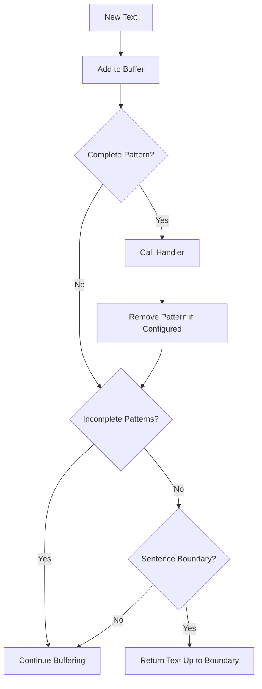

## Notes

* Patterns are processed in the order they appear in the text
* Handlers are called when complete patterns are found
* Patterns can span multiple sentences of text, but be aware that encoding many "reasoning" tokens may slow down the LLM response


# TranscriptProcessor
Source: https://docs.pipecat.ai/server/utilities/transcript-processor

Factory for creating and managing conversation transcript processors with shared event handling

## Overview

The `TranscriptProcessor` is a factory class that creates and manages processors for handling conversation transcripts from both users and assistants. It provides unified access to transcript processors with shared event handling, making it easy to track and respond to conversation updates in real-time.

The processor normalizes messages from various sources into a consistent `TranscriptionMessage` format and emits events when new messages are added to the conversation.

## Constructor

```python
TranscriptProcessor()
```

Creates a new transcript processor factory with no parameters.

## Methods

### user()

```python
def user(**kwargs) -> UserTranscriptProcessor
```

Get or create the user transcript processor instance. This processor handles `TranscriptionFrame`s from STT services.

**Parameters:**

* `**kwargs`: Arguments passed to the `UserTranscriptProcessor` constructor

**Returns:** `UserTranscriptProcessor` instance for processing user messages.

### assistant()

```python
def assistant(**kwargs) -> AssistantTranscriptProcessor
```

Get or create the assistant transcript processor instance. This processor handles `TTSTextFrame`s from TTS services and aggregates them into complete utterances.

**Parameters:**

* `**kwargs`: Arguments passed to the `AssistantTranscriptProcessor` constructor

**Returns:** `AssistantTranscriptProcessor` instance for processing assistant messages.

### event\_handler()

```python
def event_handler(event_name: str)
```

Decorator that registers event handlers for both user and assistant processors.

**Parameters:**

* `event_name`: Name of the event to handle

**Returns:** Decorator function that registers the handler with both processors.

## Event Handlers

### on\_transcript\_update

Triggered when new messages are added to the conversation transcript.

```python
@transcript.event_handler("on_transcript_update")
async def handle_transcript_update(processor, frame):
    # Handle transcript updates
    pass
```

**Parameters:**

* `processor`: The specific processor instance that emitted the event (UserTranscriptProcessor or AssistantTranscriptProcessor)
* `frame`: `TranscriptionUpdateFrame` containing the new messages

## Data Structures

### TranscriptionMessage

```python
@dataclass
class TranscriptionMessage:
    role: Literal["user", "assistant"]
    content: str
    timestamp: str | None = None
    user_id: str | None = None
```

**Fields:**

* `role`: The message sender type ("user" or "assistant")
* `content`: The transcribed text content
* `timestamp`: ISO 8601 timestamp when the message was created
* `user_id`: Optional user identifier (for user messages only)

### TranscriptionUpdateFrame

Frame containing new transcript messages, emitted by the `on_transcript_update` event.

**Properties:**

* `messages`: List of `TranscriptionMessage` objects containing the new transcript content

## Frames

### UserTranscriptProcessor

* **Input:** `TranscriptionFrame` from STT services
* **Output:** `TranscriptionMessage` with role "user"

### AssistantTranscriptProcessor

* **Input:** `TTSTextFrame` from TTS services
* **Output:** `TranscriptionMessage` with role "assistant"

## Integration Notes

### Pipeline Placement

Place the processors at specific positions in your pipeline for accurate transcript collection:

```python
pipeline = Pipeline([
    transport.input(),
    stt,                        # Speech-to-text service
    transcript.user(),          # Place after STT
    context_aggregator.user(),
    llm,
    tts,                        # Text-to-speech service
    transport.output(),
    transcript.assistant(),     # Place after transport.output()
    context_aggregator.assistant(),
])
```

### Event Handler Registration

Event handlers are automatically applied to both user and assistant processors:

```python
transcript = TranscriptProcessor()

# This handler will receive events from both processors
@transcript.event_handler("on_transcript_update")
async def handle_update(processor, frame):
    for message in frame.messages:
        print(f"{message.role}: {message.content}")
```


# UserIdleProcessor
Source: https://docs.pipecat.ai/server/utilities/user-idle-processor

A processor that monitors user inactivity and triggers callbacks after specified timeout periods

The `UserIdleProcessor` is a specialized frame processor that monitors user activity in a conversation and executes callbacks when the user becomes idle. It's particularly useful for maintaining engagement by detecting periods of user inactivity and providing escalating responses to inactivity.

## Constructor Parameters

<ParamField path="callback" type="Union[BasicCallback, RetryCallback]" required>
  An async function that will be called when user inactivity is detected. Can be
  either:

  * Basic callback: `async def(processor: UserIdleProcessor) -> None`

  * Retry callback: `async def(processor: UserIdleProcessor, retry_count: int) ->
    bool` where returning `False` stops idle monitoring
</ParamField>

<ParamField path="timeout" type="float" required>
  The number of seconds to wait before considering the user idle.
</ParamField>

## Behavior

The processor starts monitoring for inactivity only after the first conversation activity (either `UserStartedSpeakingFrame` or `BotSpeakingFrame`). It manages idle state based on the following rules:

* Resets idle timer when user starts or stops speaking
* Pauses idle monitoring while user is speaking
* Resets idle timer when bot is speaking
* Stops monitoring on conversation end or cancellation
* Manages a retry count for the retry callback
* Stops monitoring when retry callback returns `False`

## Properties

<ParamField path="retry_count" type="int">
  The current number of retry attempts made to engage the user.
</ParamField>

## Example Implementations

Here are two example showing how to use the `UserIdleProcessor`: one with the basic callback and one with the retry callback:

<Tabs>
  <Tab title="Basic Callback">
    ```python
    from pipecat.frames.frames import LLMMessagesFrame
    from pipecat.pipeline.pipeline import Pipeline
    from pipecat.processors.user_idle_processor import UserIdleProcessor

    async def handle_idle(user_idle: UserIdleProcessor) -> None:
        messages.append({
            "role": "system",
            "content": "Ask the user if they are still there and try to prompt for some input."
        })
        await user_idle.push_frame(LLMMessagesFrame(messages))

    # Create the processor
    user_idle = UserIdleProcessor(
        callback=handle_idle,
        timeout=5.0
    )

    # Add to pipeline
    pipeline = Pipeline([
        transport.input(),
        user_idle,  # Add the processor to monitor user activity
        context_aggregator.user(),
        # ... rest of pipeline
    ])
    ```
  </Tab>

  <Tab title="Retry Callback">
    ```python
    from pipecat.frames.frames import EndFrame, LLMMessagesFrame, TTSSpeakFrame
    from pipecat.pipeline.pipeline import Pipeline
    from pipecat.processors.user_idle_processor import UserIdleProcessor

    async def handle_user_idle(user_idle: UserIdleProcessor, retry_count: int) -> bool:
        if retry_count == 1:
            # First attempt: Gentle reminder
            messages.append({
                "role": "system",
                "content": "The user has been quiet. Politely and briefly ask if they're still there."
            })
            await user_idle.push_frame(LLMMessagesFrame(messages))
            return True
        elif retry_count == 2:
            # Second attempt: Direct prompt
            messages.append({
                "role": "system",
                "content": "The user is still inactive. Ask if they'd like to continue our conversation."
            })
            await user_idle.push_frame(LLMMessagesFrame(messages))
            return True
        else:
            # Third attempt: End conversation
            await user_idle.push_frame(
                TTSSpeakFrame("It seems like you're busy right now. Have a nice day!")
            )
            await task.queue_frame(EndFrame())
            return False  # Stop monitoring

    # Create the processor
    user_idle = UserIdleProcessor(
        callback=handle_user_idle,
        timeout=5.0
    )

    # Add to pipeline
    pipeline = Pipeline([
        transport.input(),
        user_idle,  # Add the processor to monitor user activity
        context_aggregator.user(),
        # ... rest of pipeline
    ])
    ```
  </Tab>
</Tabs>

## Frame Handling

The processor handles the following frame types:

* `UserStartedSpeakingFrame`: Marks user as active, resets idle timer and retry count
* `UserStoppedSpeakingFrame`: Starts idle monitoring
* `BotSpeakingFrame`: Resets idle timer
* `EndFrame` / `CancelFrame`: Stops idle monitoring

## Notes

* The idle callback won't be triggered while the user or bot is actively speaking
* The processor automatically cleans up its resources when the pipeline ends
* Basic callbacks are supported for backward compatibility


